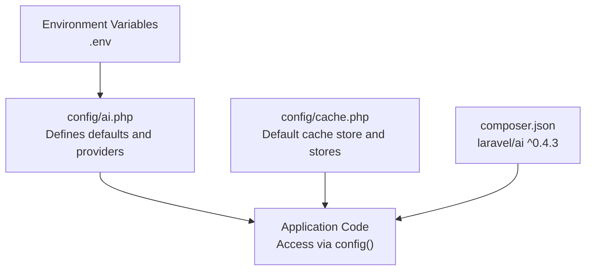
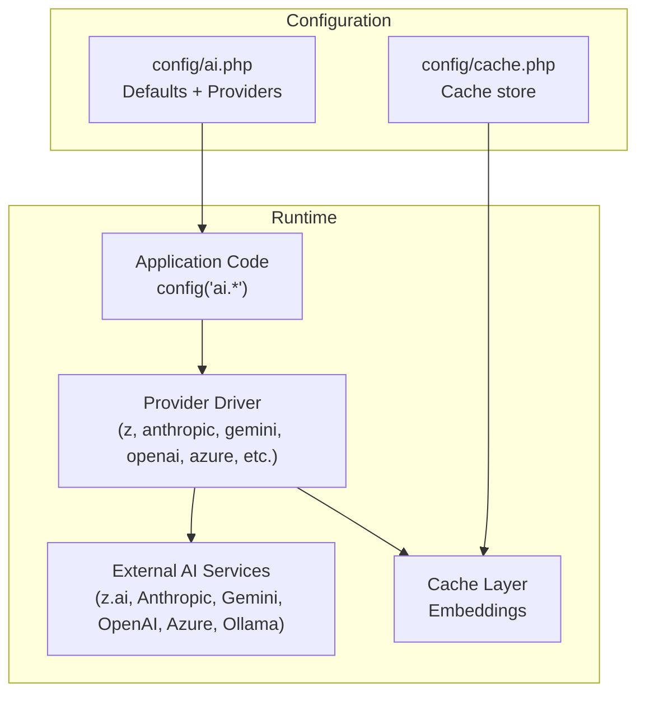
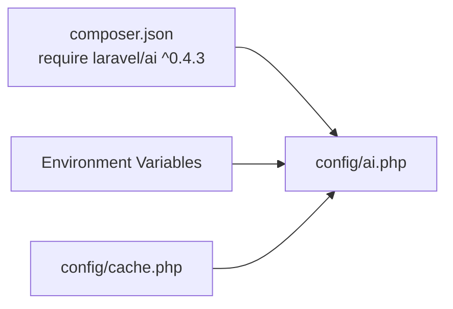

# AI Configuration

<cite>
**Referenced Files in This Document**
- [config/ai.php](file://config/ai.php)
- [config/cache.php](file://config/cache.php)
- [composer.json](file://composer.json)
- [.agents/skills/laravel-best-practices/rules/config.md](file://.agents/skills/laravel-best-practices/rules/config.md)
- [.agents/skills/laravel-best-practices/rules/security.md](file://.agents/skills/laravel-best-practices/rules/security.md)
- [database/migrations/2026_04_02_115916_create_agent_conversations_table.php](file://database/migrations/2026_04_02_115916_create_agent_conversations_table.php)
- [.env.example](file://.env.example)
- [vendor/prism-php/prism/config/prism.php](file://vendor/prism-php/prism/config/prism.php)
</cite>

## Update Summary
**Changes Made**
- Updated default provider assignment from 'anthropic' to 'z'
- Introduced new 'z' driver abstraction layer for Anthropic API with enhanced reliability and rate limiting
- Added comprehensive 'z' provider configuration with dedicated environment variables (Z_API_KEY, Z_URL)
- Enhanced provider selection strategies to leverage the new abstraction layer
- Updated environment variable management to include z.driver-specific configuration

## Table of Contents
1. [Introduction](#introduction)
2. [Project Structure](#project-structure)
3. [Core Components](#core-components)
4. [Architecture Overview](#architecture-overview)
5. [Detailed Component Analysis](#detailed-component-analysis)
6. [Dependency Analysis](#dependency-analysis)
7. [Performance Considerations](#performance-considerations)
8. [Troubleshooting Guide](#troubleshooting-guide)
9. [Conclusion](#conclusion)

## Introduction
This document explains the AI configuration for multi-provider setups and environment management in the Laravel Assistant project. It focuses on the config/ai.php structure, default provider assignments per modality (text, images, audio, transcription, embeddings, reranking), provider configuration arrays, environment variable usage via env(), caching for embeddings, and practical examples for configuring providers such as Anthropic, Gemini, OpenAI, Azure OpenAI, and local providers like Ollama. It also covers provider selection strategies, fallback mechanisms, performance optimization, and security best practices for API key management.

**Updated** The configuration now uses a 'z' driver abstraction layer that provides a unified interface to Anthropic's API through the z.ai service, offering enhanced reliability and rate limiting benefits. This replaces direct Anthropic API usage with a managed service endpoint.

## Project Structure
The AI configuration is primarily defined in config/ai.php, with caching controlled by config/cache.php. The project uses laravel/ai ^0.4.3, which integrates with Laravel's configuration and environment systems. Environment variables are loaded via env() and accessed through config() in application code.

**Diagram sources**
- [config/ai.php:1-138](file://config/ai.php#L1-L138)
- [config/cache.php:1-131](file://config/cache.php#L1-L131)
- [composer.json:11-16](file://composer.json#L11-L16)

**Section sources**
- [config/ai.php:1-138](file://config/ai.php#L1-L138)
- [config/cache.php:1-131](file://config/cache.php#L1-L131)
- [composer.json:11-16](file://composer.json#L11-L16)

## Core Components
- Default provider assignments:
  - General default: **z** (updated from anthropic)
  - Images: gemini
  - Audio: openai
  - Transcription: openai
  - Embeddings: openai
  - Reranking: cohere
- Caching configuration:
  - Embeddings caching disabled by default but can use the configured cache store (defaults to database)
- Providers array:
  - Each provider defines driver, key, and optional URL or provider-specific parameters (e.g., api_version, deployment, embedding_deployment, base URL for local providers)

**Updated** The configuration now includes a 'z' driver abstraction layer that provides a unified interface to Anthropic's API through the z.ai service, offering enhanced reliability and rate limiting benefits.

Key environment variables used:
- **Z_API_KEY**, **Z_URL** (newly added for z driver abstraction)
- ANTHROPIC_API_KEY, ANTHROPIC_URL
- AZURE_OPENAI_API_KEY, AZURE_OPENAI_URL, AZURE_OPENAI_API_VERSION, AZURE_OPENAI_DEPLOYMENT, AZURE_OPENAI_EMBEDDING_DEPLOYMENT
- COHERE_API_KEY
- DEEPSEEK_API_KEY
- ELEVENLABS_API_KEY
- GEMINI_API_KEY
- GROQ_API_KEY
- JINA_API_KEY
- MISTRAL_API_KEY
- OLLAMA_API_KEY, OLLAMA_BASE_URL
- OPENAI_API_KEY, OPENAI_URL
- OPENROUTER_API_KEY
- VOYAGEAI_API_KEY
- XAI_API_KEY
- CACHE_STORE (fallback default: database)

Security and configuration guidance:
- Use encrypted environment variables for production
- Access secrets via config() rather than env() directly in application code
- Prefer platform-native secret stores for cloud environments

**Section sources**
- [config/ai.php:16-21](file://config/ai.php#L16-L21)
- [config/ai.php:34-39](file://config/ai.php#L34-L39)
- [config/ai.php:52-135](file://config/ai.php#L52-L135)
- [.agents/skills/laravel-best-practices/rules/config.md:3-19](file://.agents/skills/laravel-best-practices/rules/config.md#L3-L19)
- [.agents/skills/laravel-best-practices/rules/security.md:141-157](file://.agents/skills/laravel-best-practices/rules/security.md#L141-L157)

## Architecture Overview
The AI configuration orchestrates provider selection and caching for different modalities. Application code resolves provider choices using the defaults and passes credentials via config(). Caching for embeddings leverages the configured cache store.

**Updated** The architecture now includes a z driver abstraction layer that provides a unified interface to Anthropic's API through the z.ai service, offering enhanced reliability and rate limiting benefits.

**Diagram sources**
- [config/ai.php:16-135](file://config/ai.php#L16-L135)
- [config/cache.php:18](file://config/cache.php#L18)
- [composer.json:13](file://composer.json#L13)

## Detailed Component Analysis

### Default Provider Assignments
- General default: **z** (updated from anthropic)
- Images default: gemini
- Audio default: openai
- Transcription default: openai
- Embeddings default: openai
- Reranking default: cohere

**Updated** The default provider has been changed from 'anthropic' to 'z' to leverage the z driver abstraction layer that provides enhanced reliability and rate limiting benefits.

These defaults enable straightforward usage without specifying a provider for each operation. They can be overridden per-operation or per-agent as needed.

**Section sources**
- [config/ai.php:16-21](file://config/ai.php#L16-L21)

### Caching Configuration for Embeddings
- Embeddings caching is configurable:
  - cache: boolean flag to enable/disable
  - store: cache store name (defaults to database)
- The global cache store defaults to database and can be changed via CACHE_STORE.

Practical impact:
- Disabling embeddings cache avoids stale vectors but increases latency and cost.
- Enabling cache reduces repeated vector computations but requires cache invalidation strategies.

**Section sources**
- [config/ai.php:34-39](file://config/ai.php#L34-L39)
- [config/cache.php:18](file://config/cache.php#L18)

### Provider Configuration Array
Each provider entry includes:
- driver: provider identifier (e.g., anthropic, gemini, openai, azure, ollama, **z**)
- key: API key resolved via env()
- url: optional base URL (provider-specific)
- provider-specific parameters:
  - azure: api_version, deployment, embedding_deployment
  - ollama: base URL override

**Updated** The configuration now includes a 'z' driver that provides a unified interface to Anthropic's API through the z.ai service.

Examples of providers supported:
- **anthropic**: driver, key, url
- **z**: driver (anthropic), key (**Z_API_KEY**), url (**Z_URL**)
- azure: driver, key, url, api_version, deployment, embedding_deployment
- cohere: driver, key
- deepseek: driver, key
- eleven: driver, key
- gemini: driver, key
- groq: driver, key
- jina: driver, key
- mistral: driver, key
- ollama: driver, key, url
- openai: driver, key, url
- openrouter: driver, key
- voyageai: driver, key
- xai: driver, key

**Updated** The 'z' provider uses the same anthropic driver but routes requests through the z.ai service, providing enhanced reliability and rate limiting benefits.

Notes:
- Local providers (e.g., ollama) typically require a base URL pointing to the local service.
- Azure OpenAI requires endpoint, api_version, and deployment identifiers.
- **The z provider offers a unified interface to Anthropic's API through z.ai with enhanced reliability**.

**Section sources**
- [config/ai.php:52-135](file://config/ai.php#L52-L135)

### Environment Variable Management and Security
- env() is used in config files to load environment variables.
- Best practice: avoid direct env() usage in application code; read via config() instead.
- Security recommendations:
  - Encrypt environment variables for production
  - Prefer platform-native secret stores (e.g., AWS Secrets Manager, Vault)
  - Do not commit .env files to version control
  - Use config caching and encrypted env for sensitive data

**Updated** Added new environment variables for the z driver abstraction layer.

**Section sources**
- [config/ai.php:54-56](file://config/ai.php#L54-L56)
- [config/ai.php:61-65](file://config/ai.php#L61-L65)
- [config/ai.php:105-106](file://config/ai.php#L105-L106)
- [.agents/skills/laravel-best-practices/rules/config.md:3-19](file://.agents/skills/laravel-best-practices/rules/config.md#L3-L19)
- [.agents/skills/laravel-best-practices/rules/security.md:141-157](file://.agents/skills/laravel-best-practices/rules/security.md#L141-L157)

### Practical Configuration Examples

#### Anthropic
- Set ANTHROPIC_API_KEY and optionally ANTHROPIC_URL.
- Default general provider is **z** (updated from anthropic).

**Section sources**
- [config/ai.php:53-57](file://config/ai.php#L53-L57)

#### Z Driver Abstraction Layer
- Set **Z_API_KEY** and optionally **Z_URL**.
- The 'z' provider uses the anthropic driver but routes requests through z.ai for enhanced reliability.
- **Recommended for production use due to improved rate limiting and uptime guarantees**.

**Section sources**
- [config/ai.php:59-63](file://config/ai.php#L59-L63)

#### Gemini
- Set GEMINI_API_KEY.
- Default for images is gemini.

**Section sources**
- [config/ai.php:89-92](file://config/ai.php#L89-L92)

#### OpenAI
- Set OPENAI_API_KEY and optionally OPENAI_URL.
- Defaults for audio, transcription, and embeddings are openai.

**Section sources**
- [config/ai.php:115-119](file://config/ai.php#L115-L119)

#### Azure OpenAI
- Set AZURE_OPENAI_API_KEY, AZURE_OPENAI_URL, AZURE_OPENAI_API_VERSION, AZURE_OPENAI_DEPLOYMENT, AZURE_OPENAI_EMBEDDING_DEPLOYMENT.

**Section sources**
- [config/ai.php:65-72](file://config/ai.php#L65-L72)

#### Ollama (Local)
- Set OLLAMA_API_KEY (optional) and OLLAMA_BASE_URL (default localhost).
- Useful for local inference without external API costs.

**Section sources**
- [config/ai.php:109-113](file://config/ai.php#L109-L113)

### Provider Selection Strategies and Fallback Mechanisms
- Strategy:
  - Use defaults for broad compatibility.
  - Override per-operation or per-agent when specialized providers are required.
  - Group by modality (images/audio/transcription/embeddings/reranking) for clarity.
  - **Consider the z driver for Anthropic operations to benefit from enhanced reliability**.
- Fallback:
  - If a provider is misconfigured, switch to a working provider or disable the affected modality.
  - Maintain a secondary provider alias for failover scenarios.
  - **The z driver can serve as a reliable fallback for Anthropic operations**.

**Updated** Added guidance for using the z driver as a reliable fallback option.

### Performance Optimization Techniques
- Enable embeddings cache when appropriate to reduce repeated vectorization.
- Choose providers with lower latency for interactive features.
- Use appropriate cache stores (e.g., redis for high throughput).
- Monitor and tune provider-specific parameters (e.g., Azure deployments) for optimal performance.
- **Consider the z driver for production Anthropic operations due to improved rate limiting and reliability**.

**Updated** Added recommendation for using the z driver in production environments.

## Dependency Analysis
The AI configuration depends on:
- laravel/ai ^0.4.3 for AI integrations
- config/ai.php for provider definitions and defaults
- config/cache.php for cache store configuration
- Environment variables for credentials and URLs

**Diagram sources**
- [composer.json:13](file://composer.json#L13)
- [config/ai.php:16-135](file://config/ai.php#L16-L135)
- [config/cache.php:18](file://config/cache.php#L18)

**Section sources**
- [composer.json:13](file://composer.json#L13)
- [config/ai.php:16-135](file://config/ai.php#L16-L135)
- [config/cache.php:18](file://config/cache.php#L18)

## Performance Considerations
- Embeddings caching:
  - Enable cache for frequently used prompts or static content.
  - Use a fast cache backend (e.g., redis) for high-throughput scenarios.
- Provider selection:
  - Match provider capabilities to modality (e.g., Gemini for images, OpenAI for audio/transcription/embeddings).
  - Consider regional endpoints and provider SLAs.
  - **Use the z driver for Anthropic operations in production for improved reliability and rate limiting**.
- Cost control:
  - Prefer local providers (Ollama) for development and internal use.
  - Use caching to minimize repeated calls.
  - **The z driver may offer cost benefits through improved efficiency and reduced failures**.

**Updated** Added recommendations for using the z driver in production environments.

## Troubleshooting Guide
Common issues and resolutions:
- Missing or invalid API key:
  - Verify environment variables are set and accessible.
  - Confirm provider key is correct and not expired.
  - **For z driver issues, verify Z_API_KEY and Z_URL are properly configured**.
- Provider URL misconfiguration:
  - Ensure url is set appropriately for hosted providers.
  - For Azure OpenAI, confirm api_version, deployment, and embedding_deployment match your setup.
  - **Verify z driver URL points to the correct z.ai endpoint**.
- Embeddings cache not applied:
  - Check caching.enable flag and store configuration.
  - Ensure the selected cache store is reachable and configured.
- Conversation persistence:
  - Agent conversations and messages are persisted via migrations; verify tables exist and migrations ran successfully.
- **Z driver connectivity issues**:
  - **Verify Z_API_KEY has proper permissions for z.ai service**.
  - **Check Z_URL points to the correct z.ai Anthropic API endpoint**.
  - **Monitor z.ai service status for outages affecting Anthropic operations**.

**Updated** Added troubleshooting guidance for the z driver abstraction layer.

**Section sources**
- [config/ai.php:54-56](file://config/ai.php#L54-L56)
- [config/ai.php:61-65](file://config/ai.php#L61-L65)
- [config/ai.php:36-37](file://config/ai.php#L36-L37)
- [database/migrations/2026_04_02_115916_create_agent_conversations_table.php:14-39](file://database/migrations/2026_04_02_115916_create_agent_conversations_table.php#L14-L39)

## Conclusion
The AI configuration in this project provides a flexible, multi-provider setup with sensible defaults per modality and a pragmatic approach to environment variable management and caching. **The introduction of the z driver abstraction layer enhances reliability and performance for Anthropic operations by providing a unified interface through z.ai with improved rate limiting and uptime guarantees.** By following the recommended provider configurations, enabling appropriate caching, and adhering to security best practices for API key handling, teams can reliably integrate AI capabilities across text, images, audio, transcription, embeddings, and reranking while maintaining performance and security. **The z driver serves as an excellent production-ready option for Anthropic-based operations, offering enhanced reliability over direct Anthropic API usage.**