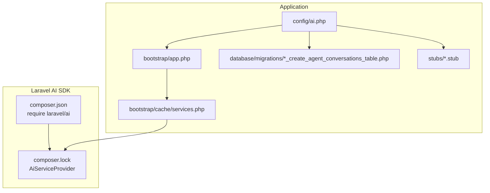
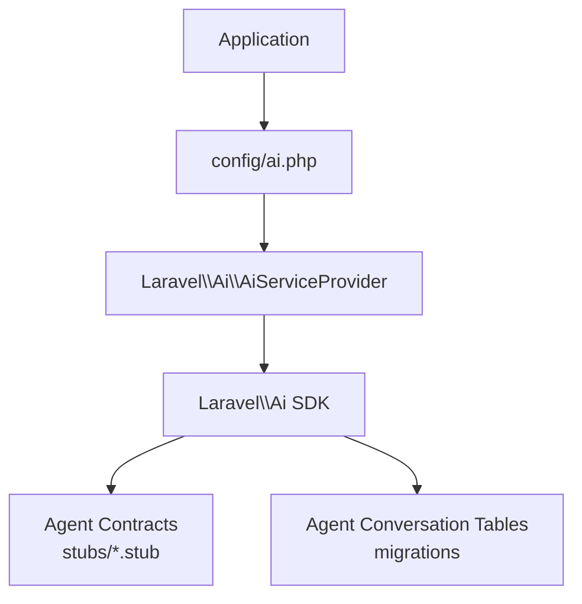
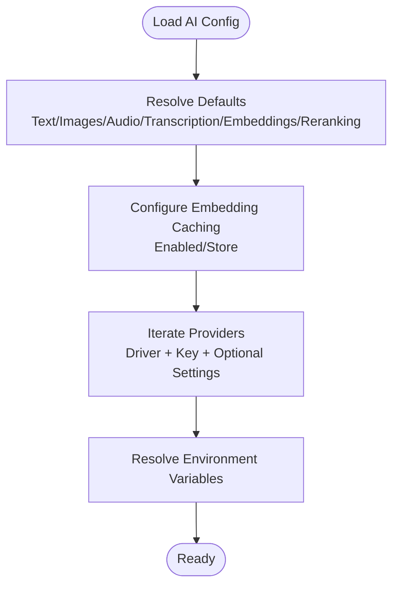
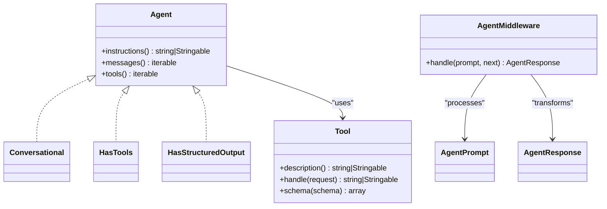
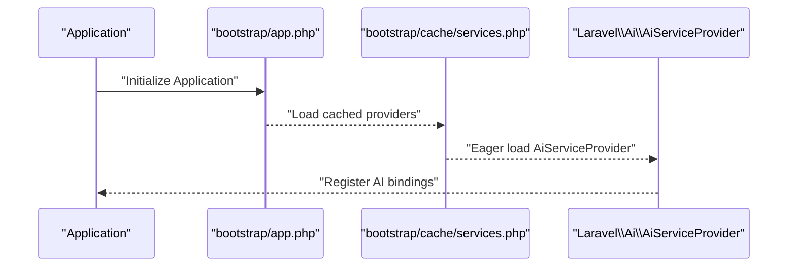
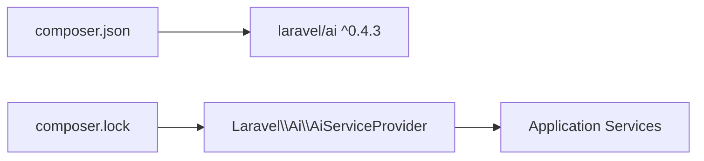

# AI Integration System

<cite>
**Referenced Files in This Document**
- [config/ai.php](file://config/ai.php)
- [bootstrap/app.php](file://bootstrap/app.php)
- [bootstrap/cache/services.php](file://bootstrap/cache/services.php)
- [composer.json](file://composer.json)
- [composer.lock](file://composer.lock)
- [database/migrations/2026_04_02_115916_create_agent_conversations_table.php](file://database/migrations/2026_04_02_115916_create_agent_conversations_table.php)
- [stubs/agent.stub](file://stubs/agent.stub)
- [stubs/structured-agent.stub](file://stubs/structured-agent.stub)
- [stubs/tool.stub](file://stubs/tool.stub)
- [stubs/agent-middleware.stub](file://stubs/agent-middleware.stub)
- [README.md](file://README.md)
- [CLAUDE.md](file://CLAUDE.md)
- [GEMINI.md](file://GEMINI.md)
- [AGENTS.md](file://AGENTS.md)
</cite>

## Table of Contents
1. [Introduction](#introduction)
2. [Project Structure](#project-structure)
3. [Core Components](#core-components)
4. [Architecture Overview](#architecture-overview)
5. [Detailed Component Analysis](#detailed-component-analysis)
6. [Dependency Analysis](#dependency-analysis)
7. [Performance Considerations](#performance-considerations)
8. [Troubleshooting Guide](#troubleshooting-guide)
9. [Conclusion](#conclusion)
10. [Appendices](#appendices)

## Introduction
This document describes the AI Integration System for multi-provider AI configuration and agent-based development workflow. It explains how the AI service abstraction layer enables seamless switching between providers such as Anthropic, Gemini, OpenAI, Azure OpenAI, Cohere, Groq, Mistral, Ollama, OpenRouter, Voyage AI, and XAI. It documents configuration options in config/ai.php, environment variable management, provider-specific settings, caching strategies, fallback mechanisms, performance optimization, practical usage patterns, error handling strategies, provider-specific features, Laravel service container integration, extension points for custom providers, security considerations, rate limiting, and cost optimization strategies. It also connects AI configuration to the agent development workflow.

## Project Structure
The AI Integration System centers around:
- A configuration file that defines default providers per task type and provider credentials.
- Laravel’s service container integration via the official AI SDK service provider.
- Database migrations for agent conversations and messages.
- Stubs for building agents, structured agents, tools, and middleware.

**Diagram sources**
- [config/ai.php:1-132](file://config/ai.php#L1-L132)
- [bootstrap/app.php:1-19](file://bootstrap/app.php#L1-L19)
- [bootstrap/cache/services.php:25-52](file://bootstrap/cache/services.php#L25-L52)
- [composer.json:1-93](file://composer.json#L1-L93)
- [composer.lock:1072-1110](file://composer.lock#L1072-L1110)
- [database/migrations/2026_04_02_115916_create_agent_conversations_table.php:1-51](file://database/migrations/2026_04_02_115916_create_agent_conversations_table.php#L1-L51)
- [stubs/agent.stub:1-44](file://stubs/agent.stub#L1-L44)
- [stubs/structured-agent.stub:1-56](file://stubs/structured-agent.stub#L1-L56)
- [stubs/tool.stub:1-38](file://stubs/tool.stub#L1-L38)
- [stubs/agent-middleware.stub:1-21](file://stubs/agent-middleware.stub#L1-L21)

**Section sources**
- [config/ai.php:1-132](file://config/ai.php#L1-L132)
- [bootstrap/app.php:1-19](file://bootstrap/app.php#L1-L19)
- [bootstrap/cache/services.php:25-52](file://bootstrap/cache/services.php#L25-L52)
- [composer.json:1-93](file://composer.json#L1-L93)
- [composer.lock:1072-1110](file://composer.lock#L1072-L1110)
- [database/migrations/2026_04_02_115916_create_agent_conversations_table.php:1-51](file://database/migrations/2026_04_02_115916_create_agent_conversations_table.php#L1-L51)
- [stubs/agent.stub:1-44](file://stubs/agent.stub#L1-L44)
- [stubs/structured-agent.stub:1-56](file://stubs/structured-agent.stub#L1-L56)
- [stubs/tool.stub:1-38](file://stubs/tool.stub#L1-L38)
- [stubs/agent-middleware.stub:1-21](file://stubs/agent-middleware.stub#L1-L21)

## Core Components
- AI configuration: defaults per task type, caching, and provider definitions with driver, key, and optional URL/version/deployment settings.
- Laravel AI SDK: registered via AiServiceProvider, enabling dependency injection and runtime provider selection.
- Agent development workflow: stubs define contracts for agents, tools, and middleware to build conversational AI experiences.
- Agent conversation persistence: migrations define tables for storing conversations and messages.

Key configuration highlights:
- Defaults for general text, images, audio, transcription, embeddings, and reranking.
- Embedding caching toggle and store selection.
- Provider list with driver and environment-backed keys and optional provider-specific settings.

**Section sources**
- [config/ai.php:16-39](file://config/ai.php#L16-L39)
- [config/ai.php:52-129](file://config/ai.php#L52-L129)
- [composer.lock:1090-1093](file://composer.lock#L1090-L1093)
- [bootstrap/cache/services.php:27-52](file://bootstrap/cache/services.php#L27-L52)
- [database/migrations/2026_04_02_115916_create_agent_conversations_table.php:14-39](file://database/migrations/2026_04_02_115916_create_agent_conversations_table.php#L14-L39)
- [stubs/agent.stub:13-44](file://stubs/agent.stub#L13-L44)
- [stubs/structured-agent.stub:15-56](file://stubs/structured-agent.stub#L15-L56)
- [stubs/tool.stub:10-38](file://stubs/tool.stub#L10-L38)
- [stubs/agent-middleware.stub:9-21](file://stubs/agent-middleware.stub#L9-L21)

## Architecture Overview
The AI Integration System integrates with Laravel through the official AI SDK. The configuration file defines providers and defaults. The service provider registers the SDK into the container. Agents, tools, and middleware are scaffolded via stubs. Conversations and messages are persisted using dedicated migrations.

**Diagram sources**
- [config/ai.php:1-132](file://config/ai.php#L1-L132)
- [composer.lock:1090-1093](file://composer.lock#L1090-L1093)
- [bootstrap/cache/services.php:27-52](file://bootstrap/cache/services.php#L27-L52)
- [stubs/agent.stub:13-44](file://stubs/agent.stub#L13-L44)
- [stubs/structured-agent.stub:15-56](file://stubs/structured-agent.stub#L15-L56)
- [stubs/tool.stub:10-38](file://stubs/tool.stub#L10-L38)
- [database/migrations/2026_04_02_115916_create_agent_conversations_table.php:14-39](file://database/migrations/2026_04_02_115916_create_agent_conversations_table.php#L14-L39)

## Detailed Component Analysis

### AI Configuration Layer
- Defaults per task type: general text, images, audio, transcription, embeddings, reranking.
- Embedding caching: enable/disable and select cache store.
- Providers: driver plus environment-backed keys; provider-specific overrides include URL, API version, deployment, and embedding deployment.

**Diagram sources**
- [config/ai.php:16-39](file://config/ai.php#L16-L39)
- [config/ai.php:52-129](file://config/ai.php#L52-L129)

**Section sources**
- [config/ai.php:16-39](file://config/ai.php#L16-L39)
- [config/ai.php:52-129](file://config/ai.php#L52-L129)

### Environment Variable Management
- Keys are environment-backed per provider.
- Optional provider-specific environment variables (URL, API version, deployments).
- Cache store selection via environment.

Practical guidance:
- Set keys in .env for each provider used.
- Configure optional provider settings when required by the provider.
- Select cache store appropriate for your infrastructure.

**Section sources**
- [config/ai.php:55](file://config/ai.php#L55)
- [config/ai.php:63](file://config/ai.php#L63)
- [config/ai.php:106](file://config/ai.php#L106)
- [config/ai.php:37](file://config/ai.php#L37)

### Caching Strategies
- Embedding caching can be enabled or disabled.
- Store selection falls back to a default if not set.

Optimization tips:
- Enable caching for embeddings to reduce repeated compute costs.
- Choose a persistent cache store for production.
- Monitor cache hit rates and tune TTLs as needed.

**Section sources**
- [config/ai.php:34-39](file://config/ai.php#L34-L39)

### Fallback Mechanisms
- Default provider selection per task type ensures operations proceed even when a specific provider is not explicitly selected.
- Provider lists include multiple vendors, allowing easy fallback by changing defaults or selecting alternate providers.

Operational guidance:
- Define sensible defaults for each task type.
- Keep a secondary provider configured for critical paths.

**Section sources**
- [config/ai.php:16-21](file://config/ai.php#L16-L21)
- [config/ai.php:52-129](file://config/ai.php#L52-L129)

### Performance Optimization Techniques
- Use caching for embeddings.
- Select optimal providers for specific tasks (e.g., Gemini for images, OpenAI for audio/transcription, Cohere for reranking).
- Consider local providers (e.g., Ollama) for reduced latency and cost in controlled environments.

**Section sources**
- [config/ai.php:16-21](file://config/ai.php#L16-L21)
- [config/ai.php:34-39](file://config/ai.php#L34-L39)
- [config/ai.php:103-107](file://config/ai.php#L103-L107)

### Practical Usage Patterns
- Agent scaffolding: use stubs to implement Agent, Conversational, HasTools, and optionally HasStructuredOutput.
- Middleware: wrap prompts/responses to intercept and transform agent interactions.
- Tools: implement Tool contracts to extend agent capabilities.

**Diagram sources**
- [stubs/agent.stub:13-44](file://stubs/agent.stub#L13-L44)
- [stubs/structured-agent.stub:15-56](file://stubs/structured-agent.stub#L15-L56)
- [stubs/tool.stub:10-38](file://stubs/tool.stub#L10-L38)
- [stubs/agent-middleware.stub:9-21](file://stubs/agent-middleware.stub#L9-L21)

**Section sources**
- [stubs/agent.stub:13-44](file://stubs/agent.stub#L13-L44)
- [stubs/structured-agent.stub:15-56](file://stubs/structured-agent.stub#L15-L56)
- [stubs/tool.stub:10-38](file://stubs/tool.stub#L10-L38)
- [stubs/agent-middleware.stub:9-21](file://stubs/agent-middleware.stub#L9-L21)

### Error Handling Strategies
- Use structured agents to constrain outputs and simplify downstream parsing.
- Implement middleware to intercept and normalize errors from provider responses.
- Validate environment variables and provider availability during bootstrapping.

**Section sources**
- [stubs/structured-agent.stub:48-56](file://stubs/structured-agent.stub#L48-L56)
- [stubs/agent-middleware.stub:14-19](file://stubs/agent-middleware.stub#L14-L19)

### Provider-Specific Features
- Anthropic: driver and optional URL.
- Azure OpenAI: driver, key, URL, API version, deployment, embedding deployment.
- Gemini: driver and key.
- OpenAI: driver, key, optional URL.
- Others: Cohere, DeepSeek, ElevenLabs, Groq, Jina, Mistral, Ollama, OpenRouter, Voyage AI, XAI.

Guidance:
- Supply only required keys; optional fields when the provider supports them.
- Keep provider settings aligned with your deployment targets.

**Section sources**
- [config/ai.php:53-57](file://config/ai.php#L53-L57)
- [config/ai.php:59-66](file://config/ai.php#L59-L66)
- [config/ai.php:83-86](file://config/ai.php#L83-L86)
- [config/ai.php:109-113](file://config/ai.php#L109-L113)
- [config/ai.php:125-128](file://config/ai.php#L125-L128)

### Laravel Service Container Integration
- The AI SDK registers its service provider, exposing AI services to the container.
- The provider list confirms eager loading of the AI service provider alongside others.

**Diagram sources**
- [bootstrap/app.php:7-18](file://bootstrap/app.php#L7-L18)
- [bootstrap/cache/services.php:27-52](file://bootstrap/cache/services.php#L27-L52)
- [composer.lock:1090-1093](file://composer.lock#L1090-L1093)

**Section sources**
- [bootstrap/app.php:7-18](file://bootstrap/app.php#L7-L18)
- [bootstrap/cache/services.php:27-52](file://bootstrap/cache/services.php#L27-L52)
- [composer.lock:1090-1093](file://composer.lock#L1090-L1093)

### Extending with Custom Providers
- Add a new provider entry in config/ai.php with a unique key, driver, and required environment variables.
- Ensure the underlying SDK supports the driver; otherwise, coordinate with the SDK or implement a compatible adapter.
- Test provider selection and environment resolution.

**Section sources**
- [config/ai.php:52-129](file://config/ai.php#L52-L129)

### Security Considerations
- Store API keys in environment variables; avoid committing secrets to version control.
- Restrict access to admin panels and routes that expose AI configurations.
- Sanitize inputs and outputs in agents and tools; validate tool schemas.
- Use HTTPS endpoints for providers where applicable.

**Section sources**
- [config/ai.php:55](file://config/ai.php#L55)
- [config/ai.php:112](file://config/ai.php#L112)

### Rate Limiting and Cost Optimization
- Implement client-side throttling and retry with backoff for provider rate limits.
- Prefer caching for embeddings and repeated prompts.
- Select providers optimized for your workload (e.g., cheaper models for inference, local providers for low-latency tasks).
- Monitor usage metrics exposed by providers and track costs.

[No sources needed since this section provides general guidance]

### Relationship Between AI Configuration and Agent Workflow
- Defaults in config/ai.php influence which provider is used for different tasks in agent workflows.
- Stubs define the contracts agents must implement; configuration determines the underlying provider runtime.
- Database migrations persist conversations and messages, enabling reproducible agent sessions.

**Section sources**
- [config/ai.php:16-21](file://config/ai.php#L16-L21)
- [stubs/agent.stub:13-44](file://stubs/agent.stub#L13-L44)
- [database/migrations/2026_04_02_115916_create_agent_conversations_table.php:14-39](file://database/migrations/2026_04_02_115916_create_agent_conversations_table.php#L14-L39)

## Dependency Analysis
The AI Integration System depends on the Laravel AI SDK, which is registered via its service provider. Composer metadata and lock files confirm the SDK presence and provider registration.

**Diagram sources**
- [composer.json:11-16](file://composer.json#L11-L16)
- [composer.lock:1090-1093](file://composer.lock#L1090-L1093)

**Section sources**
- [composer.json:11-16](file://composer.json#L11-L16)
- [composer.lock:1090-1093](file://composer.lock#L1090-L1093)

## Performance Considerations
- Enable embedding caching and choose a persistent store.
- Select providers optimized for each task type to minimize latency and cost.
- Use structured outputs to reduce post-processing overhead.
- Implement middleware for request/response batching and normalization.

[No sources needed since this section provides general guidance]

## Troubleshooting Guide
- Verify environment variables for the selected providers are present.
- Confirm the AI service provider is loaded in the cached providers list.
- Check migration status for agent conversation tables.
- Review agent stubs to ensure contracts are implemented correctly.
- Use structured agents to simplify debugging output parsing.

**Section sources**
- [bootstrap/cache/services.php:27-52](file://bootstrap/cache/services.php#L27-L52)
- [database/migrations/2026_04_02_115916_create_agent_conversations_table.php:14-39](file://database/migrations/2026_04_02_115916_create_agent_conversations_table.php#L14-L39)
- [stubs/agent.stub:13-44](file://stubs/agent.stub#L13-L44)
- [stubs/structured-agent.stub:15-56](file://stubs/structured-agent.stub#L15-L56)

## Conclusion
The AI Integration System provides a flexible, configurable, and extensible foundation for multi-provider AI workflows in Laravel. With environment-backed configuration, caching for embeddings, default provider selection per task type, and robust agent scaffolding, teams can rapidly build secure, efficient, and maintainable agent-driven features. Integrating with Laravel’s service container and leveraging the official AI SDK ensures smooth developer experience and scalability.

## Appendices

### Provider Reference
- Anthropic: driver, key, optional URL.
- Azure OpenAI: driver, key, URL, API version, deployment, embedding deployment.
- Gemini: driver, key.
- OpenAI: driver, key, optional URL.
- Others: Cohere, DeepSeek, ElevenLabs, Groq, Jina, Mistral, Ollama, OpenRouter, Voyage AI, XAI.

**Section sources**
- [config/ai.php:53-57](file://config/ai.php#L53-L57)
- [config/ai.php:59-66](file://config/ai.php#L59-L66)
- [config/ai.php:83-86](file://config/ai.php#L83-L86)
- [config/ai.php:109-113](file://config/ai.php#L109-L113)
- [config/ai.php:125-128](file://config/ai.php#L125-L128)

### Agent Development Workflow References
- Agent contracts and scaffolding: [stubs/agent.stub:13-44](file://stubs/agent.stub#L13-L44), [stubs/structured-agent.stub:15-56](file://stubs/structured-agent.stub#L15-L56)
- Tool contracts and scaffolding: [stubs/tool.stub:10-38](file://stubs/tool.stub#L10-38)
- Agent middleware scaffolding: [stubs/agent-middleware.stub:9-21](file://stubs/agent-middleware.stub#L9-21)
- Agent conversation persistence: [database/migrations/2026_04_02_115916_create_agent_conversations_table.php:14-39](file://database/migrations/2026_04_02_115916_create_agent_conversations_table.php#L14-39)
- Boost and agent guidelines: [README.md:32-42](file://README.md#L32-L42), [CLAUDE.md:24-30](file://CLAUDE.md#L24-L30), [GEMINI.md:24-30](file://GEMINI.md#L24-L30), [AGENTS.md:24-30](file://AGENTS.md#L24-L30)