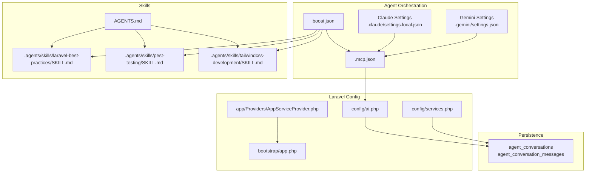
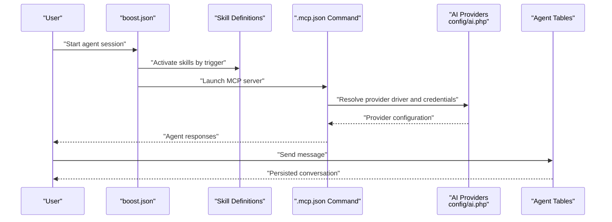
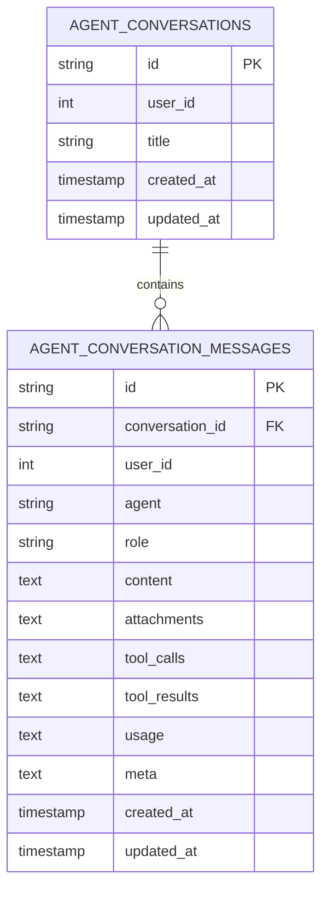
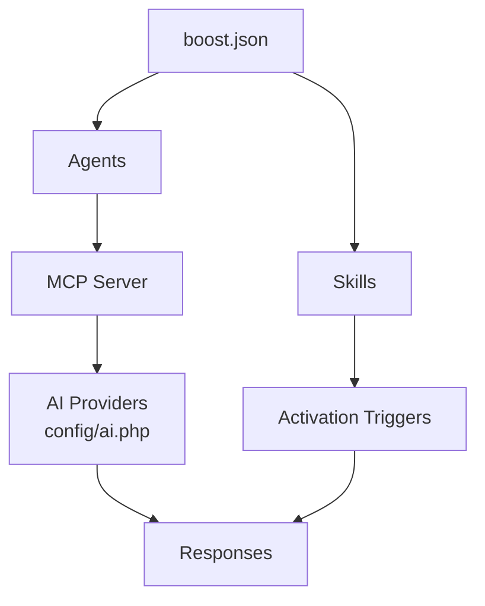
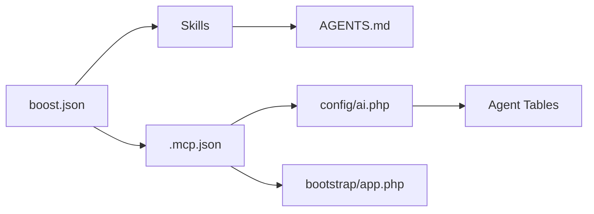

# Agent Configuration

<cite>
**Referenced Files in This Document**
- [boost.json](file://boost.json)
- [.mcp.json](file://.mcp.json)
- [.claude/settings.local.json](file://.claude/settings.local.json)
- [.gemini/settings.json](file://.gemini/settings.json)
- [AGENTS.md](file://AGENTS.md)
- [CLAUDE.md](file://CLAUDE.md)
- [GEMINI.md](file://GEMINI.md)
- [config/ai.php](file://config/ai.php)
- [config/services.php](file://config/services.php)
- [app/Providers/AppServiceProvider.php](file://app/Providers/AppServiceProvider.php)
- [bootstrap/app.php](file://bootstrap/app.php)
- [database/migrations/2026_04_02_115916_create_agent_conversations_table.php](file://database/migrations/2026_04_02_115916_create_agent_conversations_table.php)
- [.agents/skills/laravel-best-practices/SKILL.md](file://.agents/skills/laravel-best-practices/SKILL.md)
- [.agents/skills/pest-testing/SKILL.md](file://.agents/skills/pest-testing/SKILL.md)
- [.agents/skills/tailwindcss-development/SKILL.md](file://.agents/skills/tailwindcss-development/SKILL.md)
</cite>

## Table of Contents
1. [Introduction](#introduction)
2. [Project Structure](#project-structure)
3. [Core Components](#core-components)
4. [Architecture Overview](#architecture-overview)
5. [Detailed Component Analysis](#detailed-component-analysis)
6. [Dependency Analysis](#dependency-analysis)
7. [Performance Considerations](#performance-considerations)
8. [Troubleshooting Guide](#troubleshooting-guide)
9. [Conclusion](#conclusion)
10. [Appendices](#appendices)

## Introduction
This document explains how to configure and operate AI agents in this Laravel application using boost.json and related configuration files. It covers:
- The boost.json configuration structure and how it defines agents and skills
- Agent definition syntax and activation patterns
- Provider-specific settings for Claude, Gemini, and Codex
- The orchestration between boost.json, skills, and AI providers
- Practical examples for creating custom agents and managing lifecycles
- Configuration validation, error handling, debugging, persistence, state management, and performance optimization
- Integration with the Laravel service container and application bootstrapping

## Project Structure
Key directories and files involved in agent configuration and activation:
- Root configuration and agent orchestration
  - boost.json: Declares enabled agents and skills
  - .mcp.json: Defines MCP server command to launch the Laravel Boost MCP server
  - .claude/settings.local.json: Enables MCP servers for Claude
  - .gemini/settings.json: Defines MCP server mapping for Gemini
- Skill definitions
  - .agents/skills/*/SKILL.md: Skill metadata and activation rules
  - AGENTS.md, CLAUDE.md, GEMINI.md: General guidelines and provider-specific notes
- Laravel configuration
  - config/ai.php: AI provider drivers and credentials
  - config/services.php: Third-party service credentials (e.g., Slack)
  - app/Providers/AppServiceProvider.php: Service container registration/boot hooks
  - bootstrap/app.php: Application bootstrap wiring
- Persistence
  - database/migrations/*_create_agent_conversations_table.php: Agent conversation/message schema

**Diagram sources**
- [boost.json:1-17](file://boost.json#L1-L17)
- [.mcp.json:1-11](file://.mcp.json#L1-L11)
- [.claude/settings.local.json:1-7](file://.claude/settings.local.json#L1-L7)
- [.gemini/settings.json:1-11](file://.gemini/settings.json#L1-L11)
- [.agents/skills/laravel-best-practices/SKILL.md:1-190](file://.agents/skills/laravel-best-practices/SKILL.md#L1-L190)
- [.agents/skills/pest-testing/SKILL.md:1-157](file://.agents/skills/pest-testing/SKILL.md#L1-L157)
- [.agents/skills/tailwindcss-development/SKILL.md:1-119](file://.agents/skills/tailwindcss-development/SKILL.md#L1-L119)
- [AGENTS.md:1-155](file://AGENTS.md#L1-L155)
- [config/ai.php:1-132](file://config/ai.php#L1-L132)
- [config/services.php:1-39](file://config/services.php#L1-L39)
- [app/Providers/AppServiceProvider.php:1-25](file://app/Providers/AppServiceProvider.php#L1-L25)
- [bootstrap/app.php:1-19](file://bootstrap/app.php#L1-L19)
- [database/migrations/2026_04_02_115916_create_agent_conversations_table.php:1-51](file://database/migrations/2026_04_02_115916_create_agent_conversations_table.php#L1-L51)

**Section sources**
- [boost.json:1-17](file://boost.json#L1-L17)
- [.mcp.json:1-11](file://.mcp.json#L1-L11)
- [.claude/settings.local.json:1-7](file://.claude/settings.local.json#L1-L7)
- [.gemini/settings.json:1-11](file://.gemini/settings.json#L1-L11)
- [.agents/skills/laravel-best-practices/SKILL.md:1-190](file://.agents/skills/laravel-best-practices/SKILL.md#L1-L190)
- [.agents/skills/pest-testing/SKILL.md:1-157](file://.agents/skills/pest-testing/SKILL.md#L1-L157)
- [.agents/skills/tailwindcss-development/SKILL.md:1-119](file://.agents/skills/tailwindcss-development/SKILL.md#L1-L119)
- [AGENTS.md:1-155](file://AGENTS.md#L1-L155)
- [config/ai.php:1-132](file://config/ai.php#L1-L132)
- [config/services.php:1-39](file://config/services.php#L1-L39)
- [app/Providers/AppServiceProvider.php:1-25](file://app/Providers/AppServiceProvider.php#L1-L25)
- [bootstrap/app.php:1-19](file://bootstrap/app.php#L1-L19)
- [database/migrations/2026_04_02_115916_create_agent_conversations_table.php:1-51](file://database/migrations/2026_04_02_115916_create_agent_conversations_table.php#L1-L51)

## Core Components
- boost.json
  - Declares agents and skills to enable globally
  - Controls optional features like guidelines, MCP, nightwatch_mcp, sail
- Skill definitions
  - YAML frontmatter with name and description
  - Markdown content with rule sets and activation triggers
- Provider settings
  - Claude: .claude/settings.local.json enables MCP servers
  - Gemini: .gemini/settings.json maps MCP server command
  - MCP server: .mcp.json defines the command to run Laravel Boost MCP server
- Laravel AI configuration
  - config/ai.php: Provider drivers, keys, and defaults
  - config/services.php: Additional third-party credentials
- Persistence
  - Agent conversations and messages stored in dedicated tables

**Section sources**
- [boost.json:1-17](file://boost.json#L1-L17)
- [.agents/skills/laravel-best-practices/SKILL.md:1-190](file://.agents/skills/laravel-best-practices/SKILL.md#L1-L190)
- [.agents/skills/pest-testing/SKILL.md:1-157](file://.agents/skills/pest-testing/SKILL.md#L1-L157)
- [.agents/skills/tailwindcss-development/SKILL.md:1-119](file://.agents/skills/tailwindcss-development/SKILL.md#L1-L119)
- [.claude/settings.local.json:1-7](file://.claude/settings.local.json#L1-L7)
- [.gemini/settings.json:1-11](file://.gemini/settings.json#L1-L11)
- [.mcp.json:1-11](file://.mcp.json#L1-L11)
- [config/ai.php:1-132](file://config/ai.php#L1-L132)
- [config/services.php:1-39](file://config/services.php#L1-L39)
- [database/migrations/2026_04_02_115916_create_agent_conversations_table.php:1-51](file://database/migrations/2026_04_02_115916_create_agent_conversations_table.php#L1-L51)

## Architecture Overview
The agent activation pipeline orchestrated by boost.json:
- boost.json enables agents and skills
- Skills are activated based on content triggers and guidelines
- MCP server is launched via .mcp.json command
- Claude and Gemini consume the MCP server configuration
- Laravel AI providers are resolved from config/ai.php
- Conversations and messages persist to database tables

**Diagram sources**
- [boost.json:1-17](file://boost.json#L1-L17)
- [.mcp.json:1-11](file://.mcp.json#L1-L11)
- [config/ai.php:1-132](file://config/ai.php#L1-L132)
- [database/migrations/2026_04_02_115916_create_agent_conversations_table.php:1-51](file://database/migrations/2026_04_02_115916_create_agent_conversations_table.php#L1-L51)

## Detailed Component Analysis

### boost.json Configuration
- Agents: List of agent identifiers to enable (e.g., claude_code, gemini, codex)
- Guidelines: Boolean toggle to include foundational rules
- MCP: Boolean toggle to enable MCP orchestration
- Nightwatch MCP, Sail: Optional toggles for environment features
- Skills: List of skill names to activate globally

Operational implications:
- Enabling agents here ensures the MCP server and provider integrations are wired
- Enabling skills here activates their rule sets and triggers during agent sessions

**Section sources**
- [boost.json:1-17](file://boost.json#L1-L17)

### Skill Activation Patterns
Each skill definition includes:
- Metadata: name, description, license, author
- Rule sets: categorized guidance (e.g., database performance, security, testing)
- Activation triggers: conditions under which the skill should be invoked
- Application guidance: how to apply rules and verify with search-docs

Examples of skills:
- laravel-best-practices: activation for Laravel PHP code tasks
- pest-testing: activation for Pest PHP testing workflows
- tailwindcss-development: activation for Tailwind CSS v4 styling

Activation behavior:
- Skills are activated based on content triggers and project guidelines
- They provide rule-based guidance and can be explored via sub-agent mechanisms

**Section sources**
- [.agents/skills/laravel-best-practices/SKILL.md:1-190](file://.agents/skills/laravel-best-practices/SKILL.md#L1-L190)
- [.agents/skills/pest-testing/SKILL.md:1-157](file://.agents/skills/pest-testing/SKILL.md#L1-L157)
- [.agents/skills/tailwindcss-development/SKILL.md:1-119](file://.agents/skills/tailwindcss-development/SKILL.md#L1-L119)
- [AGENTS.md:24-31](file://AGENTS.md#L24-L31)

### Provider-Specific Settings

#### Claude
- MCP server enablement: .claude/settings.local.json lists enabled MCP servers and global enable flag
- Interaction: When Claude is enabled in boost.json, MCP server launches and provider settings are applied

**Section sources**
- [.claude/settings.local.json:1-7](file://.claude/settings.local.json#L1-L7)
- [boost.json:1-17](file://boost.json#L1-L17)

#### Gemini
- MCP server mapping: .gemini/settings.json defines the MCP server command and args to launch Laravel Boost
- Interaction: When Gemini is enabled in boost.json, MCP server is invoked accordingly

**Section sources**
- [.gemini/settings.json:1-11](file://.gemini/settings.json#L1-L11)
- [boost.json:1-17](file://boost.json#L1-L17)

#### Codex
- Codex configuration is present in the repository structure (.codex/config.toml) and referenced in boost.json as an agent
- Integration follows the same MCP and provider resolution patterns

Note: The Codex configuration file is referenced in the project structure. Ensure the MCP server command resolves correctly when Codex is enabled.

**Section sources**
- [boost.json:1-17](file://boost.json#L1-L17)

### MCP Server Orchestration
- .mcp.json defines the command and arguments to launch the Laravel Boost MCP server
- This server is consumed by Claude and Gemini settings when enabled
- The MCP server bridges agent interactions to Laravel’s AI providers and tools

**Section sources**
- [.mcp.json:1-11](file://.mcp.json#L1-L11)
- [.claude/settings.local.json:1-7](file://.claude/settings.local.json#L1-L7)
- [.gemini/settings.json:1-11](file://.gemini/settings.json#L1-L11)

### Laravel AI Provider Configuration
- config/ai.php defines:
  - Defaults for different modalities (text, images, audio, embeddings, reranking)
  - Provider drivers and credentials (Anthropic, Azure OpenAI, Cohere, DeepSeek, ElevenLabs, Gemini, Groq, Jina, Mistral, Ollama, OpenAI, OpenRouter, VoyageAI, XAI)
  - Caching strategies for embeddings
- config/services.php holds third-party credentials (e.g., Slack) used by tools

Integration:
- Agents resolve providers based on defaults and explicit selections
- Credentials are loaded from environment variables

**Section sources**
- [config/ai.php:1-132](file://config/ai.php#L1-L132)
- [config/services.php:1-39](file://config/services.php#L1-L39)

### Agent Lifecycle and Conversation Persistence
- Agent conversations and messages are persisted in dedicated tables
- Schema includes indexed columns for efficient querying by user and timestamps
- This supports stateful agent sessions and auditability

**Diagram sources**
- [database/migrations/2026_04_02_115916_create_agent_conversations_table.php:1-51](file://database/migrations/2026_04_02_115916_create_agent_conversations_table.php#L1-L51)

**Section sources**
- [database/migrations/2026_04_02_115916_create_agent_conversations_table.php:1-51](file://database/migrations/2026_04_02_115916_create_agent_conversations_table.php#L1-L51)

### Practical Examples

#### Example: Creating a Custom Agent
- Add a new agent identifier to boost.json under agents
- Ensure the MCP server is configured in .mcp.json
- Configure provider credentials in config/ai.php if needed
- Optionally define a skill and add it to boost.json under skills

Validation steps:
- Confirm the agent appears in the agent list
- Verify MCP server command executes without errors
- Test provider resolution using the agent

**Section sources**
- [boost.json:1-17](file://boost.json#L1-L17)
- [.mcp.json:1-11](file://.mcp.json#L1-L11)
- [config/ai.php:1-132](file://config/ai.php#L1-L132)

#### Example: Configuring Provider-Specific Settings
- Claude: Ensure .claude/settings.local.json includes the MCP server and enablement flags
- Gemini: Ensure .gemini/settings.json maps the MCP server command to Laravel Boost
- OpenAI/Azure/Gemini/etc.: Set environment variables and update config/ai.php accordingly

**Section sources**
- [.claude/settings.local.json:1-7](file://.claude/settings.local.json#L1-L7)
- [.gemini/settings.json:1-11](file://.gemini/settings.json#L1-L11)
- [config/ai.php:1-132](file://config/ai.php#L1-L132)

#### Example: Managing Agent Lifecycles
- Start: Launch the MCP server and select the desired agent
- Persist: Use the conversation/message tables to maintain state
- End: Close the session; ensure cleanup of transient resources

**Section sources**
- [.mcp.json:1-11](file://.mcp.json#L1-L11)
- [database/migrations/2026_04_02_115916_create_agent_conversations_table.php:1-51](file://database/migrations/2026_04_02_115916_create_agent_conversations_table.php#L1-L51)

### Relationship Between boost.json, Skills, and Providers
- boost.json orchestrates which agents and skills are active
- Skills provide rule sets and activation triggers
- Providers are resolved from config/ai.php and consumed by the MCP server
- Claude and Gemini settings consume the MCP server configuration

**Diagram sources**
- [boost.json:1-17](file://boost.json#L1-L17)
- [config/ai.php:1-132](file://config/ai.php#L1-L132)

## Dependency Analysis
- boost.json depends on:
  - Skill definitions for activation rules
  - MCP server configuration for runtime orchestration
  - Provider configuration for AI operations
- MCP server depends on:
  - Laravel application bootstrap
  - AI provider configuration
- Skills depend on:
  - AGENTS.md guidelines
  - Content triggers embedded in messages

**Diagram sources**
- [boost.json:1-17](file://boost.json#L1-L17)
- [.mcp.json:1-11](file://.mcp.json#L1-L11)
- [config/ai.php:1-132](file://config/ai.php#L1-L132)
- [AGENTS.md:1-155](file://AGENTS.md#L1-L155)
- [bootstrap/app.php:1-19](file://bootstrap/app.php#L1-L19)
- [database/migrations/2026_04_02_115916_create_agent_conversations_table.php:1-51](file://database/migrations/2026_04_02_115916_create_agent_conversations_table.php#L1-L51)

**Section sources**
- [boost.json:1-17](file://boost.json#L1-L17)
- [.mcp.json:1-11](file://.mcp.json#L1-L11)
- [config/ai.php:1-132](file://config/ai.php#L1-L132)
- [AGENTS.md:1-155](file://AGENTS.md#L1-L155)
- [bootstrap/app.php:1-19](file://bootstrap/app.php#L1-L19)
- [database/migrations/2026_04_02_115916_create_agent_conversations_table.php:1-51](file://database/migrations/2026_04_02_115916_create_agent_conversations_table.php#L1-L51)

## Performance Considerations
- Provider selection: Choose defaults aligned with workload (text, images, audio) to minimize latency
- Embedding caching: Enable and tune caching for embedding generation
- Indexing: Ensure database indexes on conversation/message tables are leveraged for frequent queries
- MCP server startup: Keep the command lightweight and avoid unnecessary warm-up overhead
- Skill rule sets: Limit activation scope to relevant domains to reduce processing overhead

[No sources needed since this section provides general guidance]

## Troubleshooting Guide
Common issues and resolutions:
- MCP server not found
  - Verify .mcp.json command and args
  - Ensure Laravel application is booted and CLI is available
- Provider credentials missing
  - Confirm environment variables for selected providers
  - Validate config/ai.php entries
- Skills not activating
  - Review skill triggers and AGENTS.md guidelines
  - Confirm skill names in boost.json
- Conversation persistence failures
  - Check database connectivity and migrations
  - Verify table permissions and indexes

**Section sources**
- [.mcp.json:1-11](file://.mcp.json#L1-L11)
- [config/ai.php:1-132](file://config/ai.php#L1-L132)
- [AGENTS.md:24-31](file://AGENTS.md#L24-L31)
- [database/migrations/2026_04_02_115916_create_agent_conversations_table.php:1-51](file://database/migrations/2026_04_02_115916_create_agent_conversations_table.php#L1-L51)

## Conclusion
boost.json is the central orchestrator for enabling agents, skills, and MCP-driven interactions. Combined with provider configurations in config/ai.php and MCP server settings in .mcp.json, it enables flexible agent activation across Claude, Gemini, and Codex. Skills provide domain-specific guidance, while the Laravel service container and application bootstrap ensure runtime readiness. Persistence is handled by dedicated tables for conversations and messages, supporting stateful agent sessions.

[No sources needed since this section summarizes without analyzing specific files]

## Appendices

### Appendix A: Configuration Validation Checklist
- boost.json
  - Agents and skills lists are valid
  - Optional toggles are set appropriately
- MCP server
  - .mcp.json command resolves correctly
  - Laravel application is reachable from the command context
- Providers
  - config/ai.php includes required drivers and keys
  - Environment variables are set
- Skills
  - SKILL.md files are present and valid
  - Activation triggers align with intended workflows

**Section sources**
- [boost.json:1-17](file://boost.json#L1-L17)
- [.mcp.json:1-11](file://.mcp.json#L1-L11)
- [config/ai.php:1-132](file://config/ai.php#L1-L132)
- [.agents/skills/laravel-best-practices/SKILL.md:1-190](file://.agents/skills/laravel-best-practices/SKILL.md#L1-L190)
- [.agents/skills/pest-testing/SKILL.md:1-157](file://.agents/skills/pest-testing/SKILL.md#L1-L157)
- [.agents/skills/tailwindcss-development/SKILL.md:1-119](file://.agents/skills/tailwindcss-development/SKILL.md#L1-L119)