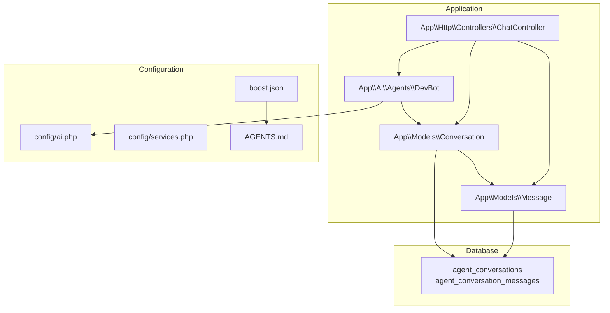
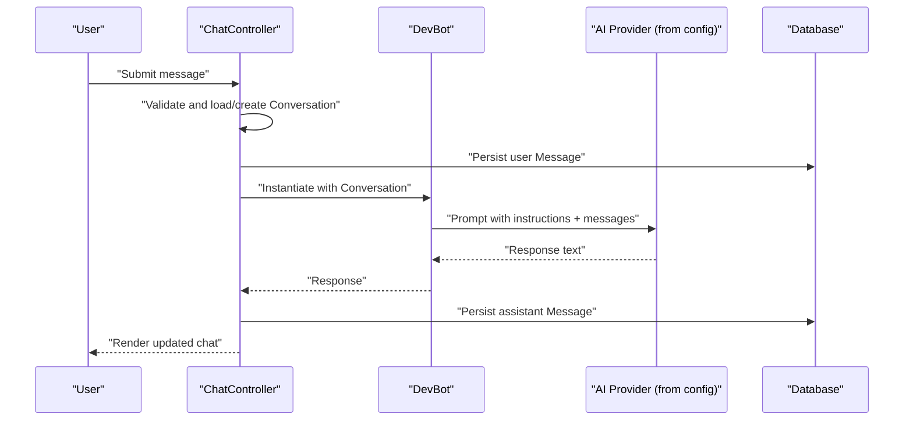
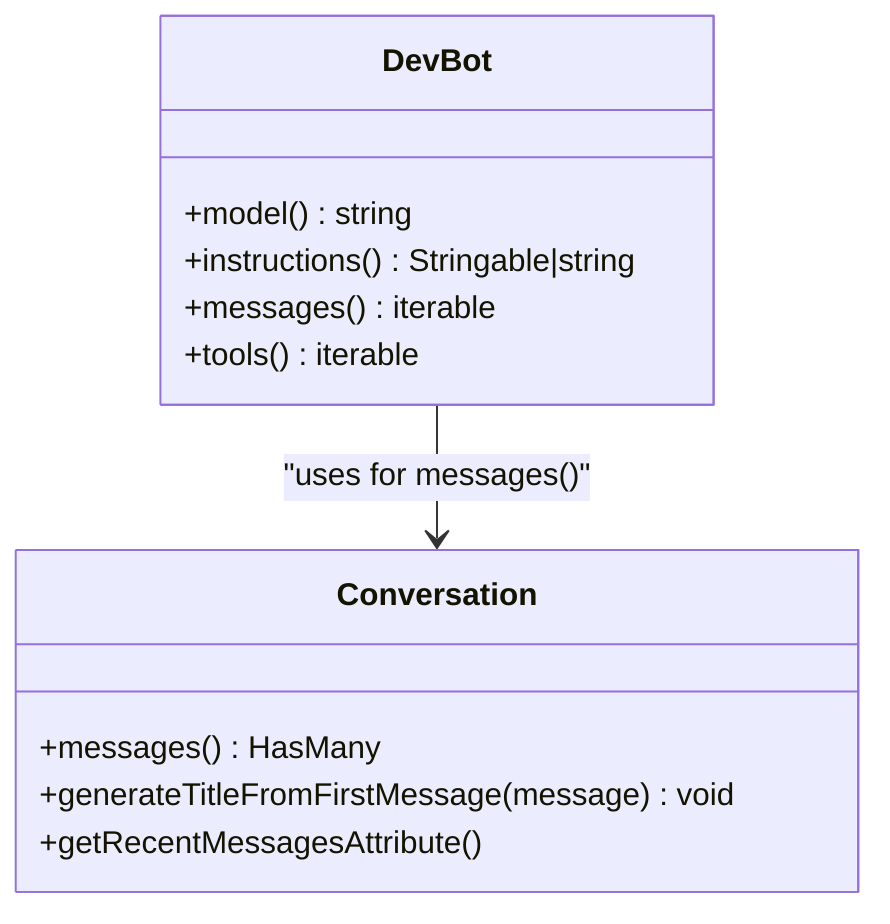
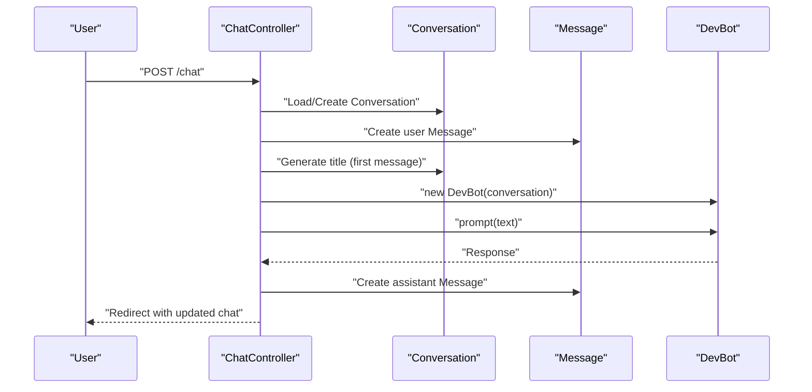
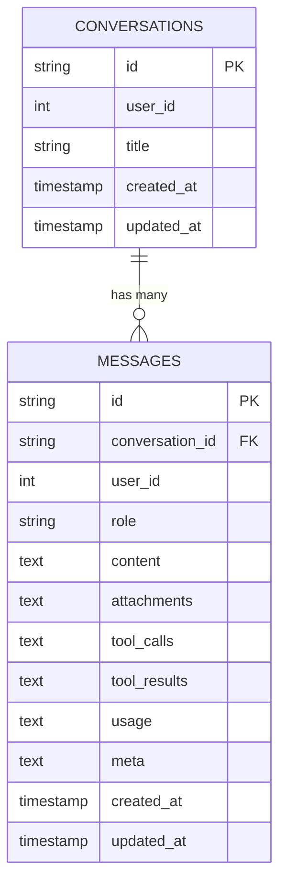
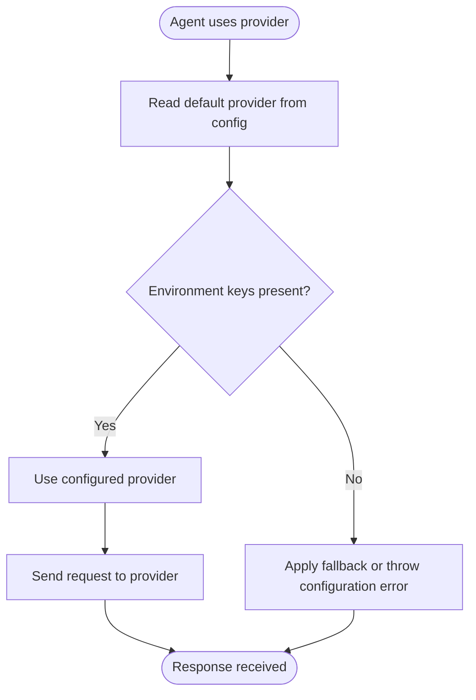
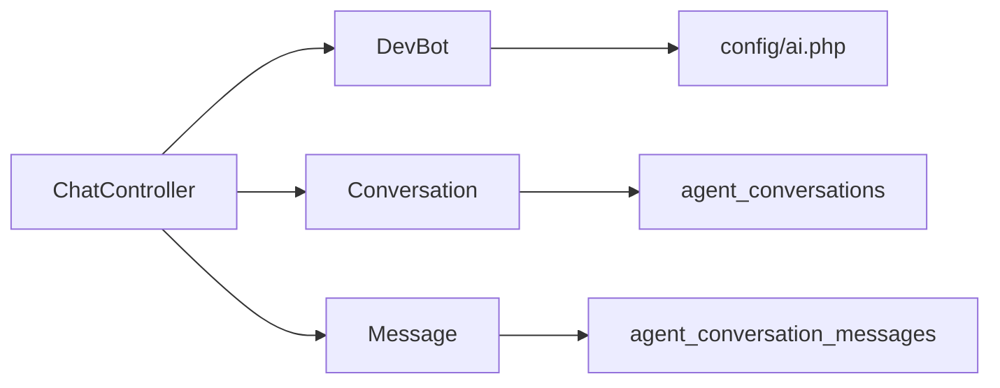

# Agent Integration

<cite>
**Referenced Files in This Document**
- [AGENTS.md](file://AGENTS.md)
- [boost.json](file://boost.json)
- [app/Providers/AppServiceProvider.php](file://app/Providers/AppServiceProvider.php)
- [config/ai.php](file://config/ai.php)
- [config/services.php](file://config/services.php)
- [database/migrations/2026_04_02_115916_create_agent_conversations_table.php](file://database/migrations/2026_04_02_115916_create_agent_conversations_table.php)
- [app/Ai/Agents/DevBot.php](file://app/Ai/Agents/DevBot.php)
- [app/Http/Controllers/ChatController.php](file://app/Http/Controllers/ChatController.php)
- [app/Models/Conversation.php](file://app/Models/Conversation.php)
- [app/Models/Message.php](file://app/Models/Message.php)
- [stubs/agent.stub](file://stubs/agent.stub)
- [stubs/structured-agent.stub](file://stubs/structured-agent.stub)
</cite>

## Table of Contents
1. [Introduction](#introduction)
2. [Project Structure](#project-structure)
3. [Core Components](#core-components)
4. [Architecture Overview](#architecture-overview)
5. [Detailed Component Analysis](#detailed-component-analysis)
6. [Dependency Analysis](#dependency-analysis)
7. [Performance Considerations](#performance-considerations)
8. [Troubleshooting Guide](#troubleshooting-guide)
9. [Conclusion](#conclusion)
10. [Appendices](#appendices)

## Introduction
This document explains how agents integrate with the Laravel application ecosystem in this project. It covers integration patterns between agents, Laravel Boost, and core application services; how agents leverage the Laravel service container, middleware integration, and application lifecycle hooks; the relationship between agents and AI providers; practical usage in controllers, middleware, and service classes; state management, conversation tracking, and persistence strategies; security, error handling, and performance monitoring; testing and development workflow integration; and debugging and troubleshooting techniques.

## Project Structure
The agent integration spans several areas:
- Agent definitions live under the application’s Ai namespace and implement Laravel AI contracts.
- Controllers orchestrate user interactions and delegate AI prompts to agents.
- Models encapsulate conversation and message state and persist them to the database.
- Configuration defines AI providers and defaults used by agents.
- Laravel Boost and skills are configured via dedicated files to streamline developer workflows.

**Diagram sources**
- [app/Ai/Agents/DevBot.php:18-35](file://app/Ai/Agents/DevBot.php#L18-L35)
- [app/Http/Controllers/ChatController.php:67-77](file://app/Http/Controllers/ChatController.php#L67-L77)
- [app/Models/Conversation.php:15-18](file://app/Models/Conversation.php#L15-L18)
- [app/Models/Message.php:20-23](file://app/Models/Message.php#L20-L23)
- [config/ai.php:16](file://config/ai.php#L16)
- [database/migrations/2026_04_02_115916_create_agent_conversations_table.php:14-51](file://database/migrations/2026_04_02_115916_create_agent_conversations_table.php#L14-L51)
- [boost.json:1-17](file://boost.json#L1-L17)
- [AGENTS.md:1-155](file://AGENTS.md#L1-L155)

**Section sources**
- [AGENTS.md:1-155](file://AGENTS.md#L1-L155)
- [boost.json:1-17](file://boost.json#L1-L17)
- [config/ai.php:1-132](file://config/ai.php#L1-L132)
- [database/migrations/2026_04_02_115916_create_agent_conversations_table.php:1-51](file://database/migrations/2026_04_02_115916_create_agent_conversations_table.php#L1-L51)

## Core Components
- Agent definition: DevBot implements the Agent, Conversational, and HasTools contracts, and uses attributes to define provider, max steps, and temperature. It exposes instructions, messages, and tools.
- Controller integration: ChatController handles rendering the chat view and processing user messages, persists user input, delegates to DevBot for AI responses, and persists assistant replies.
- Models: Conversation and Message encapsulate state and persistence, with helpers for formatting and ordering.
- Configuration: config/ai.php centralizes provider selection and credentials; config/services.php manages third-party service credentials.
- Laravel Boost and skills: boost.json enables agents, MCP, and skills; AGENTS.md documents guidelines and workflows.

Key integration touchpoints:
- Agent-to-provider mapping via attributes and configuration.
- Controller-to-agent instantiation and prompt invocation.
- Model-to-database persistence via Eloquent.
- Environment-driven configuration for provider keys and defaults.

**Section sources**
- [app/Ai/Agents/DevBot.php:18-99](file://app/Ai/Agents/DevBot.php#L18-L99)
- [app/Http/Controllers/ChatController.php:17-90](file://app/Http/Controllers/ChatController.php#L17-L90)
- [app/Models/Conversation.php:10-29](file://app/Models/Conversation.php#L10-L29)
- [app/Models/Message.php:10-76](file://app/Models/Message.php#L10-L76)
- [config/ai.php:16-129](file://config/ai.php#L16-L129)
- [config/services.php:1-39](file://config/services.php#L1-L39)
- [AGENTS.md:1-155](file://AGENTS.md#L1-L155)
- [boost.json:1-17](file://boost.json#L1-L17)

## Architecture Overview
The agent integration follows a layered pattern:
- Presentation: Web controller orchestrates user actions.
- Domain: Agent encapsulates AI behavior and conversation state.
- Persistence: Eloquent models manage conversation/message records.
- Configuration: Centralized provider and service settings.
- Infrastructure: Laravel Boost and skills enhance developer workflows.

**Diagram sources**
- [app/Http/Controllers/ChatController.php:35-90](file://app/Http/Controllers/ChatController.php#L35-L90)
- [app/Ai/Agents/DevBot.php:25-35](file://app/Ai/Agents/DevBot.php#L25-L35)
- [config/ai.php:16-129](file://config/ai.php#L16-L129)
- [database/migrations/2026_04_02_115916_create_agent_conversations_table.php:14-51](file://database/migrations/2026_04_02_115916_create_agent_conversations_table.php#L14-L51)

## Detailed Component Analysis

### Agent Definition: DevBot
DevBot integrates with Laravel AI contracts and configuration:
- Implements Agent, Conversational, HasTools.
- Uses attributes to set provider, max steps, and temperature.
- Provides model selection via environment variable.
- Supplies instructions and message history from the current conversation.
- Exposes an empty tool list in this example.

**Diagram sources**
- [app/Ai/Agents/DevBot.php:18-99](file://app/Ai/Agents/DevBot.php#L18-L99)
- [app/Models/Conversation.php:15-29](file://app/Models/Conversation.php#L15-L29)

**Section sources**
- [app/Ai/Agents/DevBot.php:18-99](file://app/Ai/Agents/DevBot.php#L18-L99)

### Controller Integration: ChatController
The controller coordinates user input, conversation persistence, and agent prompting:
- Renders the chat view and optionally preloads a conversation.
- Validates incoming messages and ensures a conversation exists.
- Persists user messages and generates a title from the first message.
- Instantiates DevBot with the current conversation and invokes prompt.
- Persists the assistant’s response and handles errors with logging and user feedback.

**Diagram sources**
- [app/Http/Controllers/ChatController.php:17-90](file://app/Http/Controllers/ChatController.php#L17-L90)
- [app/Ai/Agents/DevBot.php:67-77](file://app/Ai/Agents/DevBot.php#L67-L77)
- [app/Models/Conversation.php:20-23](file://app/Models/Conversation.php#L20-L23)
- [app/Models/Message.php:10-18](file://app/Models/Message.php#L10-L18)

**Section sources**
- [app/Http/Controllers/ChatController.php:17-90](file://app/Http/Controllers/ChatController.php#L17-L90)

### Models: Conversation and Message
- Conversation defines fillable attributes, a has-many relationship to messages, and helpers for title generation and recent messages.
- Message defines fillable attributes, belongs-to relationship, role casting, and formatting utilities for content rendering.

**Diagram sources**
- [database/migrations/2026_04_02_115916_create_agent_conversations_table.php:14-51](file://database/migrations/2026_04_02_115916_create_agent_conversations_table.php#L14-L51)
- [app/Models/Conversation.php:10-18](file://app/Models/Conversation.php#L10-L18)
- [app/Models/Message.php:10-23](file://app/Models/Message.php#L10-L23)

**Section sources**
- [app/Models/Conversation.php:10-29](file://app/Models/Conversation.php#L10-L29)
- [app/Models/Message.php:10-76](file://app/Models/Message.php#L10-L76)

### Configuration: AI Providers and Services
- config/ai.php defines default providers for different modalities and enumerates supported providers with driver, key, and optional URL/api_version/deployment settings.
- Environment variables supply API keys and endpoints.
- config/services.php centralizes third-party service credentials for notifications and integrations.

**Diagram sources**
- [config/ai.php:16-129](file://config/ai.php#L16-L129)
- [config/services.php:1-39](file://config/services.php#L1-L39)

**Section sources**
- [config/ai.php:16-129](file://config/ai.php#L16-L129)
- [config/services.php:1-39](file://config/services.php#L1-L39)

### Laravel Boost and Skills
- boost.json enables agents, MCP, and skills, and lists available skills such as Laravel best practices, Pest testing, and Tailwind CSS development.
- AGENTS.md documents Laravel Boost guidelines, including tools, searching documentation, artisan usage, and testing workflows.

Practical implications:
- Use Boost tools for database queries, schema inspection, and URL resolution.
- Leverage skills for domain-specific guidance during agent development and testing.

**Section sources**
- [boost.json:1-17](file://boost.json#L1-L17)
- [AGENTS.md:1-155](file://AGENTS.md#L1-L155)

### Middleware Integration and Lifecycle Hooks
- The repository does not include custom middleware for agents. Agents are invoked directly in controllers.
- ServiceProvider registration and boot hooks are currently empty; future agent integrations can bind agent instances or configure runtime behavior here.

Recommendations:
- For global agent behavior, register bindings in the service provider and use middleware to inject agent contexts per request.
- Use boot hooks to publish or initialize agent-related assets or configurations.

**Section sources**
- [app/Providers/AppServiceProvider.php:12-23](file://app/Providers/AppServiceProvider.php#L12-L23)

### Service Container Usage
- DevBot is instantiated directly in the controller with a Conversation dependency. This pattern works well for simple flows.
- For broader integration, bind agent implementations to the container and resolve them via dependency injection in controllers or services.

Benefits:
- Enables swapping implementations, testing with mocks, and centralized configuration.

**Section sources**
- [app/Http/Controllers/ChatController.php:67-70](file://app/Http/Controllers/ChatController.php#L67-L70)

### Practical Examples
- Controller usage: See ChatController::sendMessage for instantiating DevBot, invoking prompt, and persisting messages.
- Agent stubs: Use agent.stub and structured-agent.stub to scaffold new agents with proper contracts and promptable traits.

Paths to examples:
- [app/Http/Controllers/ChatController.php:67-77](file://app/Http/Controllers/ChatController.php#L67-L77)
- [stubs/agent.stub:13-44](file://stubs/agent.stub#L13-L44)
- [stubs/structured-agent.stub:15-56](file://stubs/structured-agent.stub#L15-L56)

**Section sources**
- [app/Http/Controllers/ChatController.php:67-77](file://app/Http/Controllers/ChatController.php#L67-L77)
- [stubs/agent.stub:13-44](file://stubs/agent.stub#L13-L44)
- [stubs/structured-agent.stub:15-56](file://stubs/structured-agent.stub#L15-L56)

## Dependency Analysis
- DevBot depends on Laravel AI contracts and configuration for provider selection.
- ChatController depends on DevBot, Conversation, and Message for orchestration and persistence.
- Models depend on Eloquent and database schema defined by migrations.
- Configuration influences provider availability and behavior.

**Diagram sources**
- [app/Http/Controllers/ChatController.php:67-77](file://app/Http/Controllers/ChatController.php#L67-L77)
- [app/Ai/Agents/DevBot.php:18-35](file://app/Ai/Agents/DevBot.php#L18-L35)
- [config/ai.php:16-129](file://config/ai.php#L16-L129)
- [database/migrations/2026_04_02_115916_create_agent_conversations_table.php:14-51](file://database/migrations/2026_04_02_115916_create_agent_conversations_table.php#L14-L51)

**Section sources**
- [app/Http/Controllers/ChatController.php:67-77](file://app/Http/Controllers/ChatController.php#L67-L77)
- [app/Ai/Agents/DevBot.php:18-35](file://app/Ai/Agents/DevBot.php#L18-L35)
- [config/ai.php:16-129](file://config/ai.php#L16-L129)
- [database/migrations/2026_04_02_115916_create_agent_conversations_table.php:14-51](file://database/migrations/2026_04_02_115916_create_agent_conversations_table.php#L14-L51)

## Performance Considerations
- Provider selection and defaults: Ensure appropriate defaults are set in config/ai.php to avoid unnecessary provider switching.
- Caching embeddings: Enable and configure caching stores for embedding generation where applicable.
- Database indexing: The migration includes composite indexes on conversation_id and timestamps to optimize retrieval.
- Request timeouts and retries: Configure provider clients with appropriate timeouts and retry policies.
- Streaming responses: If supported by the provider, consider streaming to improve perceived latency.
- Batch operations: For bulk message processing, batch writes to reduce round-trips.

[No sources needed since this section provides general guidance]

## Troubleshooting Guide
Common issues and resolutions:
- Missing API keys: Verify environment variables for the selected provider are set; otherwise, provider initialization will fail.
- Conversation persistence errors: Confirm migrations are applied and database credentials are correct.
- Agent configuration mismatches: Ensure the agent’s provider attribute aligns with a configured provider in config/ai.php.
- Error logging: ChatController catches exceptions and logs them; check application logs for detailed error context.
- Boost and skills: Use Boost tools to inspect database schema and resolve environment issues quickly.

**Section sources**
- [app/Http/Controllers/ChatController.php:78-87](file://app/Http/Controllers/ChatController.php#L78-L87)
- [database/migrations/2026_04_02_115916_create_agent_conversations_table.php:14-51](file://database/migrations/2026_04_02_115916_create_agent_conversations_table.php#L14-L51)
- [config/ai.php:16-129](file://config/ai.php#L16-L129)

## Conclusion
This project demonstrates a clean integration of agents into Laravel through dedicated agent classes, controller orchestration, and robust persistence models. Configuration centralization via config/ai.php and environment variables enables flexible provider selection. Laravel Boost and skills streamline development workflows. The architecture supports future enhancements such as middleware integration, service container binding, and structured output schemas.

[No sources needed since this section summarizes without analyzing specific files]

## Appendices

### Agent State Management and Conversation Tracking
- State is managed through Conversation and Message models, persisted to the database.
- DevBot’s messages() method delegates to the conversation to provide context.
- First-message title generation sets a human-readable conversation label.

**Section sources**
- [app/Models/Conversation.php:20-23](file://app/Models/Conversation.php#L20-L23)
- [app/Ai/Agents/DevBot.php:81-88](file://app/Ai/Agents/DevBot.php#L81-L88)

### Data Persistence Strategies
- Use Eloquent relationships to maintain referential integrity.
- Indexes on conversation_id and timestamps optimize retrieval.
- Consider partitioning or archiving older conversations for scalability.

**Section sources**
- [database/migrations/2026_04_02_115916_create_agent_conversations_table.php:20-39](file://database/migrations/2026_04_02_115916_create_agent_conversations_table.php#L20-L39)

### Security Considerations
- Restrict agent access via middleware and route policies.
- Sanitize user-provided content before persistence and rendering.
- Use HTTPS endpoints for provider communication and secure environment variables.

[No sources needed since this section provides general guidance]

### Performance Monitoring
- Instrument agent invocations with metrics (latency, token usage).
- Monitor provider quotas and throttling.
- Use database query logging and slow query detection.

[No sources needed since this section provides general guidance]

### Testing and Development Workflow
- Use Pest for feature and unit tests around agent behavior.
- Leverage Boost tools for schema inspection and URL resolution.
- Scaffold new agents using stubs to maintain consistency.

**Section sources**
- [AGENTS.md:146-153](file://AGENTS.md#L146-L153)
- [boost.json:1-17](file://boost.json#L1-L17)
- [stubs/agent.stub:13-44](file://stubs/agent.stub#L13-L44)
- [stubs/structured-agent.stub:15-56](file://stubs/structured-agent.stub#L15-L56)

### Debugging Techniques and Logging
- Capture and log exceptions with context (conversation_id, payload).
- Use application logs to trace agent prompt/response flows.
- Employ Boost tools to inspect runtime state and environment.

**Section sources**
- [app/Http/Controllers/ChatController.php:78-87](file://app/Http/Controllers/ChatController.php#L78-L87)
- [AGENTS.md:92-96](file://AGENTS.md#L92-L96)