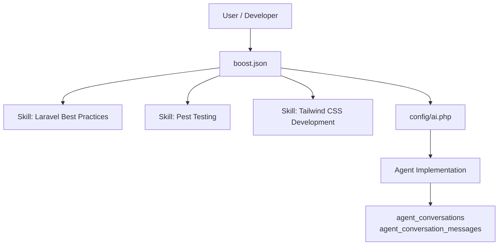
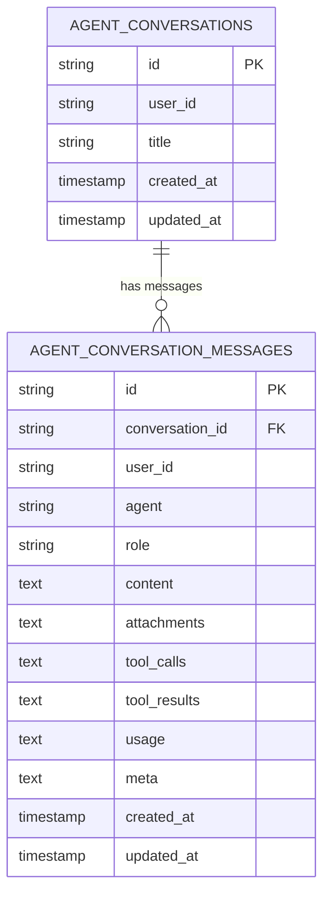
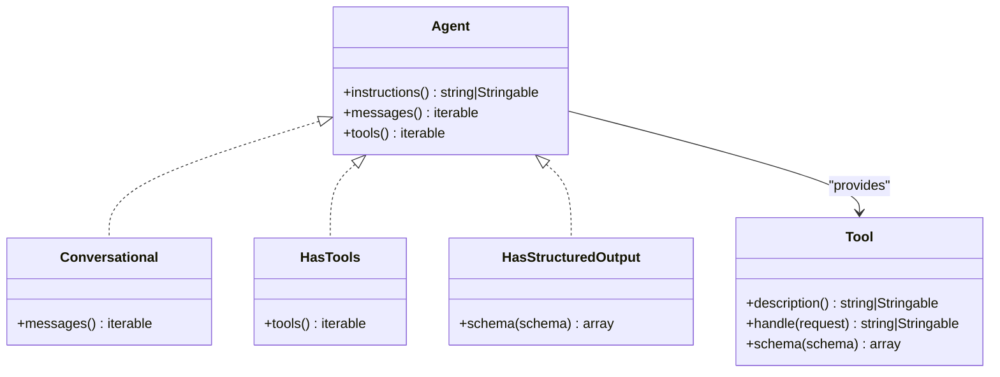
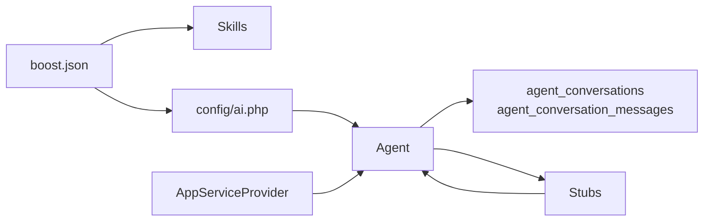
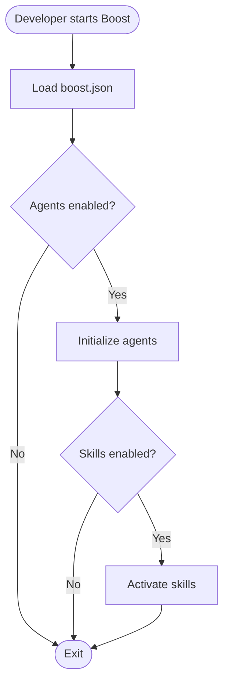

# Agent System

<cite>
**Referenced Files in This Document**
- [boost.json](file://boost.json)
- [AGENTS.md](file://AGENTS.md)
- [CLAUDE.md](file://CLAUDE.md)
- [GEMINI.md](file://GEMINI.md)
- [.agents/skills/laravel-best-practices/SKILL.md](file://.agents/skills/laravel-best-practices/SKILL.md)
- [.agents/skills/pest-testing/SKILL.md](file://.agents/skills/pest-testing/SKILL.md)
- [.agents/skills/tailwindcss-development/SKILL.md](file://.agents/skills/tailwindcss-development/SKILL.md)
- [config/ai.php](file://config/ai.php)
- [database/migrations/2026_04_02_115916_create_agent_conversations_table.php](file://database/migrations/2026_04_02_115916_create_agent_conversations_table.php)
- [stubs/agent.stub](file://stubs/agent.stub)
- [stubs/structured-agent.stub](file://stubs/structured-agent.stub)
- [stubs/tool.stub](file://stubs/tool.stub)
- [app/Providers/AppServiceProvider.php](file://app/Providers/AppServiceProvider.php)
- [README.md](file://README.md)
</cite>

## Table of Contents
1. [Introduction](#introduction)
2. [Project Structure](#project-structure)
3. [Core Components](#core-components)
4. [Architecture Overview](#architecture-overview)
5. [Detailed Component Analysis](#detailed-component-analysis)
6. [Dependency Analysis](#dependency-analysis)
7. [Performance Considerations](#performance-considerations)
8. [Troubleshooting Guide](#troubleshooting-guide)
9. [Conclusion](#conclusion)
10. [Appendices](#appendices)

## Introduction
This document explains the Agent System built on Laravel Boost that enables specialized AI functionality through skills. It covers how agents are configured and activated via boost.json, how skills integrate with Laravel’s ecosystem (Laravel Best Practices, Pest Testing, Tailwind CSS Development), and how agents interact with AI providers. It also documents agent persistence, conversation tracking, state management, and integration with the Laravel service container and application lifecycle.

## Project Structure
The Agent System centers around:
- Agent configuration and skill activation in boost.json
- Skill definitions under .agents/skills
- AI provider configuration in config/ai.php
- Persistence for conversations and messages via database migrations
- Stubs for creating agents and tools
- Laravel service provider hooks for application lifecycle integration

```mermaid
graph TB
subgraph "Configuration"
BJS["boost.json"]
AICFG["config/ai.php"]
end
subgraph "Skills"
LBP[".agents/skills/laravel-best-practices/SKILL.md"]
PT[".agents/skills/pest-testing/SKILL.md"]
TW ".agents/skills/tailwindcss-development/SKILL.md"
end
subgraph "Persistence"
MIG["database/migrations/*_create_agent_conversations_table.php"]
end
subgraph "Stubs"
ASTUB["stubs/agent.stub"]
STUB["stubs/structured-agent.stub"]
TSTUB["stubs/tool.stub"]
end
subgraph "Application"
ASP["app/Providers/AppServiceProvider.php"]
READM["README.md"]
end
BJS --> AICFG
BJS --> LBP
BJS --> PT
BJS --> TW
AICFG --> MIG
ASTUB --> ASP
STUB --> ASP
TSTUB --> ASP
READM --> ASP
```

**Diagram sources**
- [boost.json:1-17](file://boost.json#L1-L17)
- [config/ai.php:1-132](file://config/ai.php#L1-L132)
- [.agents/skills/laravel-best-practices/SKILL.md:1-190](file://.agents/skills/laravel-best-practices/SKILL.md#L1-L190)
- [.agents/skills/pest-testing/SKILL.md:1-157](file://.agents/skills/pest-testing/SKILL.md#L1-L157)
- [.agents/skills/tailwindcss-development/SKILL.md:1-119](file://.agents/skills/tailwindcss-development/SKILL.md#L1-L119)
- [database/migrations/2026_04_02_115916_create_agent_conversations_table.php:1-51](file://database/migrations/2026_04_02_115916_create_agent_conversations_table.php#L1-L51)
- [stubs/agent.stub:1-45](file://stubs/agent.stub#L1-L45)
- [stubs/structured-agent.stub:1-57](file://stubs/structured-agent.stub#L1-L57)
- [stubs/tool.stub:1-38](file://stubs/tool.stub#L1-L38)
- [app/Providers/AppServiceProvider.php:1-25](file://app/Providers/AppServiceProvider.php#L1-L25)
- [README.md:1-59](file://README.md#L1-L59)

**Section sources**
- [boost.json:1-17](file://boost.json#L1-L17)
- [config/ai.php:1-132](file://config/ai.php#L1-L132)
- [database/migrations/2026_04_02_115916_create_agent_conversations_table.php:1-51](file://database/migrations/2026_04_02_115916_create_agent_conversations_table.php#L1-L51)
- [stubs/agent.stub:1-45](file://stubs/agent.stub#L1-L45)
- [stubs/structured-agent.stub:1-57](file://stubs/structured-agent.stub#L1-L57)
- [stubs/tool.stub:1-38](file://stubs/tool.stub#L1-L38)
- [app/Providers/AppServiceProvider.php:1-25](file://app/Providers/AppServiceProvider.php#L1-L25)
- [README.md:32-42](file://README.md#L32-L42)

## Core Components
- Agent configuration and activation: boost.json defines agents and skills to enable for the project.
- Skill system: domain-specific skills for Laravel Best Practices, Pest Testing, and Tailwind CSS Development.
- AI provider configuration: centralized provider settings and defaults for different modalities.
- Conversation persistence: dedicated tables for agent conversations and messages.
- Agent and tool scaffolding: stubs for creating agents and tools aligned with Laravel AI contracts.
- Application lifecycle integration: service provider hooks for registering and bootstrapping agent-related services.

**Section sources**
- [boost.json:1-17](file://boost.json#L1-L17)
- [.agents/skills/laravel-best-practices/SKILL.md:1-190](file://.agents/skills/laravel-best-practices/SKILL.md#L1-L190)
- [.agents/skills/pest-testing/SKILL.md:1-157](file://.agents/skills/pest-testing/SKILL.md#L1-L157)
- [.agents/skills/tailwindcss-development/SKILL.md:1-119](file://.agents/skills/tailwindcss-development/SKILL.md#L1-L119)
- [config/ai.php:1-132](file://config/ai.php#L1-L132)
- [database/migrations/2026_04_02_115916_create_agent_conversations_table.php:1-51](file://database/migrations/2026_04_02_115916_create_agent_conversations_table.php#L1-L51)
- [stubs/agent.stub:1-45](file://stubs/agent.stub#L1-L45)
- [stubs/structured-agent.stub:1-57](file://stubs/structured-agent.stub#L1-L57)
- [stubs/tool.stub:1-38](file://stubs/tool.stub#L1-L38)
- [app/Providers/AppServiceProvider.php:1-25](file://app/Providers/AppServiceProvider.php#L1-L25)

## Architecture Overview
The Agent System integrates Laravel Boost with domain-specific skills and AI providers. Agents are configured via boost.json and can be activated per project. Skills provide contextual guidance and best practices for Laravel development tasks. AI providers are configured centrally and selected by modality. Conversations and messages are persisted to relational tables, enabling stateful interactions across requests.



**Diagram sources**
- [boost.json:1-17](file://boost.json#L1-L17)
- [.agents/skills/laravel-best-practices/SKILL.md:1-190](file://.agents/skills/laravel-best-practices/SKILL.md#L1-L190)
- [.agents/skills/pest-testing/SKILL.md:1-157](file://.agents/skills/pest-testing/SKILL.md#L1-L157)
- [.agents/skills/tailwindcss-development/SKILL.md:1-119](file://.agents/skills/tailwindcss-development/SKILL.md#L1-L119)
- [config/ai.php:1-132](file://config/ai.php#L1-L132)
- [database/migrations/2026_04_02_115916_create_agent_conversations_table.php:1-51](file://database/migrations/2026_04_02_115916_create_agent_conversations_table.php#L1-L51)

## Detailed Component Analysis

### Agent Configuration and Activation (boost.json)
- Defines enabled agents and skills for the project.
- Controls global toggles such as guidelines, MCP, and related features.
- Ensures skills are activated when working in specific domains (e.g., Laravel code, testing, Tailwind CSS).

Practical usage patterns:
- Enable agents and skills during project initialization.
- Keep skills aligned with the current development domain to maximize agent assistance.

**Section sources**
- [boost.json:1-17](file://boost.json#L1-L17)

### Skill System: Laravel Best Practices
- Provides comprehensive guidance for Laravel development, covering performance, security, caching, Eloquent, validation, configuration, testing, queues, routing, HTTP client, events/notifications/mail, error handling, scheduling, architecture, migrations, collections, Blade, and conventions.
- Emphasizes consistency with existing codebase patterns and recommends verifying API syntax with search-docs.

Integration with agents:
- Agents can leverage this skill to review/refactor code, enforce best practices, and suggest improvements aligned with the project’s conventions.

**Section sources**
- [.agents/skills/laravel-best-practices/SKILL.md:1-190](file://.agents/skills/laravel-best-practices/SKILL.md#L1-L190)

### Skill System: Pest Testing
- Focuses on Pest PHP testing in Laravel projects, including test creation, organization, assertions, mocking, datasets, browser testing, smoke testing, visual regression, sharding, and architecture testing.
- Reinforces using Pest exclusively and maintaining existing test suites.

Integration with agents:
- Agents can assist with writing, converting, and refactoring tests to Pest, ensuring adherence to project testing standards.

**Section sources**
- [.agents/skills/pest-testing/SKILL.md:1-157](file://.agents/skills/pest-testing/SKILL.md#L1-L157)

### Skill System: Tailwind CSS Development
- Guides Tailwind CSS v4 usage, emphasizing CSS-first configuration, import syntax, replaced utilities, spacing with gap, dark mode variants, and common layout patterns.
- Advises avoiding deprecated v3 utilities and respecting project conventions.

Integration with agents:
- Agents can help implement responsive layouts, component styling, and dark mode support using Tailwind utilities.

**Section sources**
- [.agents/skills/tailwindcss-development/SKILL.md:1-119](file://.agents/skills/tailwindcss-development/SKILL.md#L1-L119)

### AI Provider Configuration (config/ai.php)
- Centralizes provider drivers, keys, and endpoints.
- Sets defaults for different modalities (text, images, audio, transcription, embeddings, reranking).
- Supports multiple providers (Anthropic, Azure OpenAI, Cohere, DeepSeek, ElevenLabs, Gemini, Groq, Jina, Mistral, Ollama, OpenAI, OpenRouter, VoyageAI, XAI).

Provider selection:
- Agents can choose providers based on task type or configured defaults.
- Environment variables supply credentials and optional overrides.

**Section sources**
- [config/ai.php:1-132](file://config/ai.php#L1-L132)

### Conversation Persistence and State Management
- Dedicated tables persist agent conversations and messages.
- Columns capture roles, content, attachments, tool calls/results, usage metrics, and metadata.
- Indexes optimize lookups by conversation, user, and timestamps.

State management:
- Agents can track conversation history and leverage persisted messages to maintain context across interactions.
- Timestamp indexing supports efficient retrieval and pruning strategies.



**Diagram sources**
- [database/migrations/2026_04_02_115916_create_agent_conversations_table.php:14-39](file://database/migrations/2026_04_02_115916_create_agent_conversations_table.php#L14-L39)

**Section sources**
- [database/migrations/2026_04_02_115916_create_agent_conversations_table.php:1-51](file://database/migrations/2026_04_02_115916_create_agent_conversations_table.php#L1-L51)

### Agent and Tool Scaffolding (Stubs)
- Agent stubs define contracts for instructions, conversation messages, and tools.
- Structured agent stub adds a schema for constrained output.
- Tool stub defines a description, execution handler, and JSON schema.

Usage:
- Use stubs to scaffold agents and tools aligned with Laravel AI contracts.
- Implement instructions, message history, and tool integrations as needed.



**Diagram sources**
- [stubs/agent.stub:13-44](file://stubs/agent.stub#L13-L44)
- [stubs/structured-agent.stub:15-56](file://stubs/structured-agent.stub#L15-L56)
- [stubs/tool.stub:10-37](file://stubs/tool.stub#L10-L37)

**Section sources**
- [stubs/agent.stub:1-45](file://stubs/agent.stub#L1-L45)
- [stubs/structured-agent.stub:1-57](file://stubs/structured-agent.stub#L1-L57)
- [stubs/tool.stub:1-38](file://stubs/tool.stub#L1-L38)

### Application Lifecycle Integration (Service Provider)
- The AppServiceProvider exposes register() and boot() hooks for application-wide initialization.
- Agents and skills can be registered or bootstrapped here as needed.
- Keep lifecycle hooks minimal and defer heavy operations to lazy initialization.

**Section sources**
- [app/Providers/AppServiceProvider.php:1-25](file://app/Providers/AppServiceProvider.php#L1-L25)

### Practical Examples

#### Creating a Custom Agent
- Use the agent stub to scaffold a new agent class.
- Implement instructions(), messages(), and tools() according to your workflow.
- Optionally adopt structured output via the structured agent stub.

Reference paths:
- [Agent stub:13-44](file://stubs/agent.stub#L13-L44)
- [Structured agent stub:15-56](file://stubs/structured-agent.stub#L15-L56)

#### Activating Skills
- Configure skills in boost.json to enable domain-specific guidance.
- Ensure skill names match the directories under .agents/skills.

Reference paths:
- [boost.json:11-15](file://boost.json#L11-L15)

#### Integrating with Laravel Applications
- Leverage Laravel Boost to enhance AI workflows.
- Use README guidance to install and initialize Boost.

Reference paths:
- [README.md:32-42](file://README.md#L32-L42)

## Dependency Analysis
The Agent System exhibits clear separation of concerns:
- Configuration (boost.json) orchestrates agents and skills.
- Skills provide domain expertise.
- AI provider configuration centralizes provider settings.
- Persistence models encapsulate conversation state.
- Stubs standardize agent and tool creation.
- Service provider integrates lifecycle hooks.



**Diagram sources**
- [boost.json:1-17](file://boost.json#L1-L17)
- [config/ai.php:1-132](file://config/ai.php#L1-L132)
- [database/migrations/2026_04_02_115916_create_agent_conversations_table.php:1-51](file://database/migrations/2026_04_02_115916_create_agent_conversations_table.php#L1-L51)
- [stubs/agent.stub:1-45](file://stubs/agent.stub#L1-L45)
- [stubs/structured-agent.stub:1-57](file://stubs/structured-agent.stub#L1-L57)
- [stubs/tool.stub:1-38](file://stubs/tool.stub#L1-L38)
- [app/Providers/AppServiceProvider.php:1-25](file://app/Providers/AppServiceProvider.php#L1-L25)

**Section sources**
- [boost.json:1-17](file://boost.json#L1-L17)
- [config/ai.php:1-132](file://config/ai.php#L1-L132)
- [database/migrations/2026_04_02_115916_create_agent_conversations_table.php:1-51](file://database/migrations/2026_04_02_115916_create_agent_conversations_table.php#L1-L51)
- [stubs/agent.stub:1-45](file://stubs/agent.stub#L1-L45)
- [stubs/structured-agent.stub:1-57](file://stubs/structured-agent.stub#L1-L57)
- [stubs/tool.stub:1-38](file://stubs/tool.stub#L1-L38)
- [app/Providers/AppServiceProvider.php:1-25](file://app/Providers/AppServiceProvider.php#L1-L25)

## Performance Considerations
- Provider selection: Choose providers optimized for the task (text/image/audio/embeddings/reranking) to balance latency and cost.
- Caching: Enable and tune caching for embeddings and other expensive operations where applicable.
- Conversation indexing: Rely on indexed columns to efficiently query recent conversations and messages.
- Lazy initialization: Defer heavy agent initialization to runtime to minimize boot overhead.
- Tool execution: Keep tool handlers lightweight and delegate heavy work to Laravel services or queues.

[No sources needed since this section provides general guidance]

## Troubleshooting Guide
Common areas to verify:
- Agent activation: Confirm agents and skills are enabled in boost.json.
- Provider credentials: Ensure environment variables for provider keys are set and correct.
- Migration status: Verify conversation tables exist and are migrated.
- Tool contracts: Ensure tools implement required methods and schemas.
- Service provider hooks: Confirm lifecycle hooks are not blocking or misconfigured.

**Section sources**
- [boost.json:1-17](file://boost.json#L1-L17)
- [config/ai.php:1-132](file://config/ai.php#L1-L132)
- [database/migrations/2026_04_02_115916_create_agent_conversations_table.php:1-51](file://database/migrations/2026_04_02_115916_create_agent_conversations_table.php#L1-L51)
- [stubs/tool.stub:10-37](file://stubs/tool.stub#L10-L37)
- [app/Providers/AppServiceProvider.php:1-25](file://app/Providers/AppServiceProvider.php#L1-L25)

## Conclusion
The Agent System leverages Laravel Boost to deliver a skill-based AI development workflow. With boost.json controlling activation, skills providing domain expertise, centralized AI provider configuration, and robust conversation persistence, developers can build, configure, and integrate agents that follow Laravel best practices. The stubs streamline agent and tool creation, while the service provider ensures seamless application lifecycle integration.

[No sources needed since this section summarizes without analyzing specific files]

## Appendices

### Appendix A: Agent Activation Flow


[No sources needed since this diagram shows conceptual workflow, not actual code structure]

### Appendix B: Relationship Between Agents and AI Providers
- Agents select providers based on configured defaults and task type.
- Provider credentials and endpoints are managed centrally in config/ai.php.
- Environment variables supply keys and optional overrides.

**Section sources**
- [config/ai.php:16-129](file://config/ai.php#L16-L129)