# DevBot AI Agent System

<cite>
**Referenced Files in This Document**
- [DevBot.php](file://app/Ai/Agents/DevBot.php)
- [ChatController.php](file://app/Http/Controllers/ChatController.php)
- [Conversation.php](file://app/Models/Conversation.php)
- [Message.php](file://app/Models/Message.php)
- [Markdown.php](file://app/Helpers/Markdown.php)
- [ai.php](file://config/ai.php)
- [web.php](file://routes/web.php)
- [chat.blade.php](file://resources/views/chat.blade.php)
- [2026_04_02_123216_create_conversations_table.php](file://database/migrations/2026_04_02_123216_create_conversations_table.php)
- [2026_04_02_123238_create_messages_table.php](file://database/migrations/2026_04_02_123238_create_messages_table.php)
- [AGENTS.md](file://AGENTS.md)
- [CLAUDE.md](file://CLAUDE.md)
- [GEMINI.md](file://GEMINI.md)
- [composer.json](file://composer.json)
</cite>

## Table of Contents
1. [Introduction](#introduction)
2. [System Architecture](#system-architecture)
3. [Core Components](#core-components)
4. [Agent Implementation](#agent-implementation)
5. [Conversation Management](#conversation-management)
6. [User Interface](#user-interface)
7. [AI Provider Configuration](#ai-provider-configuration)
8. [Skills and Capabilities](#skills-and-capabilities)
9. [Database Schema](#database-schema)
10. [API Endpoints](#api-endpoints)
11. [Error Handling](#error-handling)
12. [Performance Considerations](#performance-considerations)
13. [Deployment and Setup](#deployment-and-setup)
14. [Conclusion](#conclusion)

## Introduction

DevBot is an AI-powered development assistant integrated into a Laravel application. This intelligent chat system provides developers with instant access to programming knowledge, code review capabilities, debugging assistance, and architectural guidance. Built with Laravel's AI framework, DevBot serves as a comprehensive development companion that understands Laravel and PHP best practices while offering real-time conversational AI responses.

The system combines modern AI technologies with Laravel's robust framework to create an intuitive development environment where developers can ask questions, receive code examples, and get guidance on best practices. DevBot is particularly focused on Laravel ecosystem development, making it an invaluable tool for PHP developers working within the Laravel framework.

## System Architecture

The DevBot system follows a clean, layered architecture that separates concerns between presentation, business logic, data persistence, and AI integration. The architecture is designed around Laravel's MVC pattern while incorporating modern AI agent capabilities.

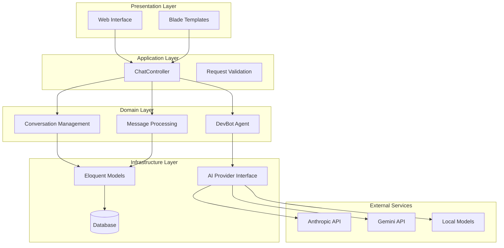

**Diagram sources**
- [ChatController.php:13-113](file://app/Http/Controllers/ChatController.php#L13-L113)
- [DevBot.php:20-99](file://app/Ai/Agents/DevBot.php#L20-L99)
- [Conversation.php:8-45](file://app/Models/Conversation.php#L8-L45)
- [Message.php:9-44](file://app/Models/Message.php#L9-L44)

The architecture ensures clear separation of concerns with the controller handling HTTP requests, the agent managing AI interactions, and the models handling data persistence. This design enables easy maintenance, testing, and extension of functionality.

**Section sources**
- [ChatController.php:13-113](file://app/Http/Controllers/ChatController.php#L13-L113)
- [DevBot.php:20-99](file://app/Ai/Agents/DevBot.php#L20-L99)

## Core Components

### AI Agent System

The heart of DevBot is the DevBot AI agent, which implements Laravel's AI agent interface. This agent is configured with specific parameters optimized for development assistance, including temperature settings for balanced creativity and accuracy.

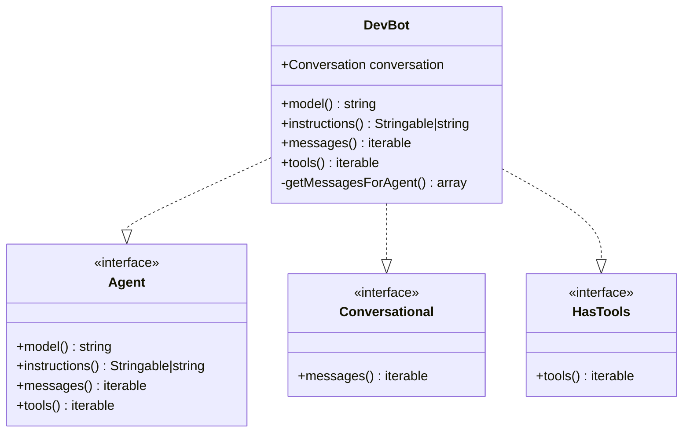

**Diagram sources**
- [DevBot.php:20-99](file://app/Ai/Agents/DevBot.php#L20-L99)

The agent is configured with a maximum step limit of 10 and a temperature setting of 0.7, providing balanced responses that are both helpful and accurate for development scenarios.

**Section sources**
- [DevBot.php:20-99](file://app/Ai/Agents/DevBot.php#L20-L99)

### Controller Layer

The ChatController serves as the primary entry point for user interactions, handling both web interface rendering and API requests. It manages conversation lifecycle, validates user input, and coordinates with the AI agent for responses.

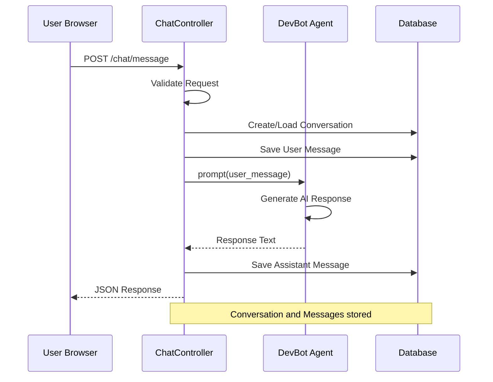

**Diagram sources**
- [ChatController.php:39-113](file://app/Http/Controllers/ChatController.php#L39-L113)

**Section sources**
- [ChatController.php:39-113](file://app/Http/Controllers/ChatController.php#L39-L113)

## Agent Implementation

### Configuration and Behavior

The DevBot agent is configured with specific parameters that optimize its behavior for development assistance. The agent uses environment variables for flexible deployment configurations and includes comprehensive instructions for appropriate responses.

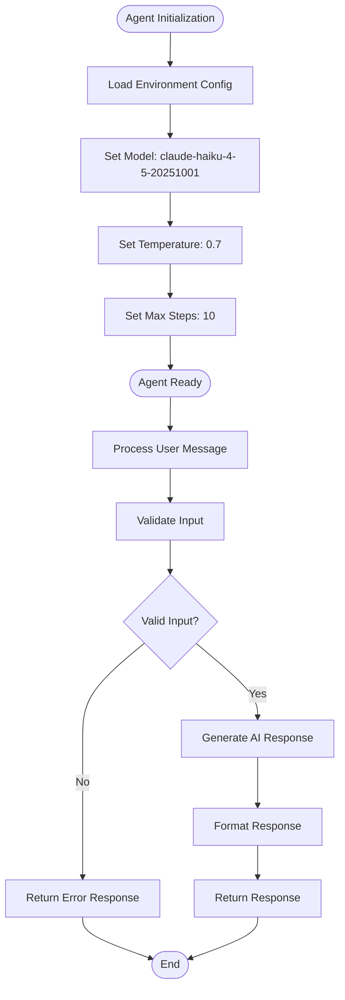

**Diagram sources**
- [DevBot.php:24-34](file://app/Ai/Agents/DevBot.php#L24-L34)
- [DevBot.php:17-19](file://app/Ai/Agents/DevBot.php#L17-L19)

The agent's instructions emphasize development-focused assistance, including Laravel and PHP best practices, code review capabilities, and architectural guidance. This ensures responses remain relevant and helpful for developer use cases.

**Section sources**
- [DevBot.php:17-99](file://app/Ai/Agents/DevBot.php#L17-L99)

## Conversation Management

### Data Persistence Strategy

The conversation management system uses Laravel's Eloquent ORM to persist chat history with efficient querying and relationship management. The system maintains conversation metadata and message sequences for optimal AI context retrieval.

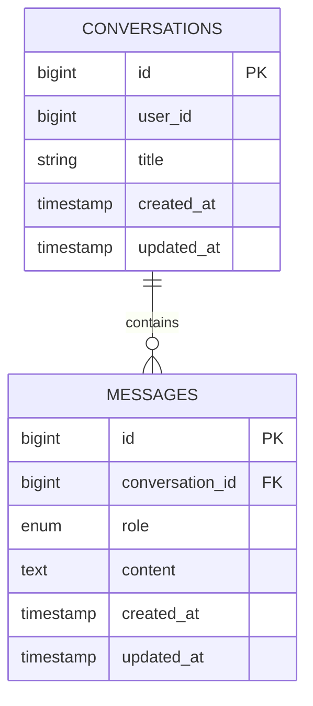

**Diagram sources**
- [2026_04_02_123216_create_conversations_table.php:14-21](file://database/migrations/2026_04_02_123216_create_conversations_table.php#L14-L21)
- [2026_04_02_123238_create_messages_table.php:14-22](file://database/migrations/2026_04_02_123238_create_messages_table.php#L14-L22)

The conversation model includes helper methods for generating titles from initial messages and retrieving recent messages for AI context. The message model provides formatting capabilities using Markdown rendering.

**Section sources**
- [Conversation.php:8-45](file://app/Models/Conversation.php#L8-L45)
- [Message.php:9-44](file://app/Models/Message.php#L9-L44)

### Message Processing Pipeline

The message processing pipeline handles both user and assistant messages with proper formatting and persistence. The system ensures message ordering and provides formatted content for display.

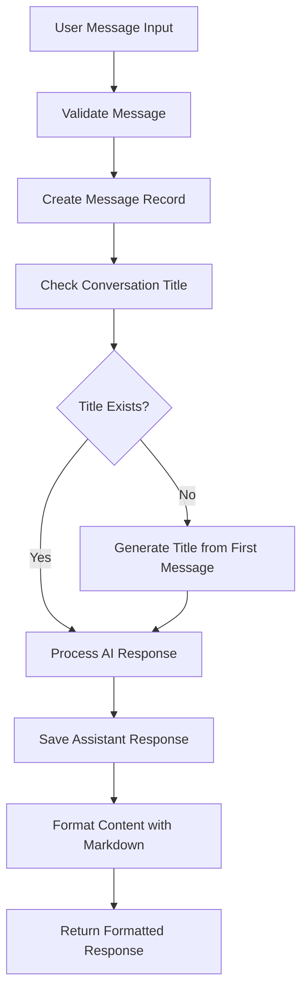

**Diagram sources**
- [ChatController.php:59-81](file://app/Http/Controllers/ChatController.php#L59-L81)
- [Message.php:39-42](file://app/Models/Message.php#L39-L42)

**Section sources**
- [ChatController.php:59-81](file://app/Http/Controllers/ChatController.php#L59-L81)
- [Message.php:39-42](file://app/Models/Message.php#L39-L42)

## User Interface

### Web Interface Design

The user interface provides an intuitive chat experience with responsive design and smooth interactions. The interface supports both traditional page navigation and AJAX-based real-time updates.

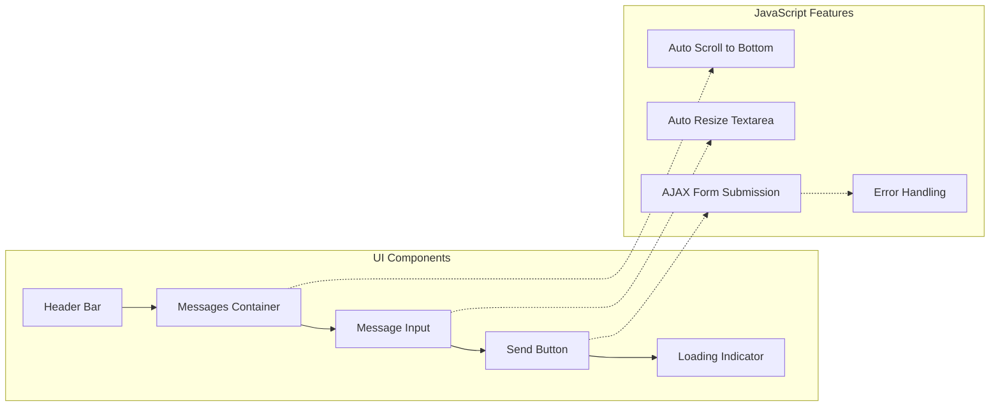

**Diagram sources**
- [chat.blade.php:10-169](file://resources/views/chat.blade.php#L10-L169)

The interface includes sophisticated JavaScript for enhanced user experience, including auto-scrolling to new messages, dynamic textarea resizing, and comprehensive error handling. The design follows modern UI/UX principles with clear visual hierarchy and responsive behavior.

**Section sources**
- [chat.blade.php:10-391](file://resources/views/chat.blade.php#L10-L391)

### Responsive Design Implementation

The interface adapts seamlessly to different screen sizes and devices, ensuring accessibility across desktop, tablet, and mobile platforms. The design uses Tailwind CSS utility classes for consistent styling and responsive breakpoints.

## AI Provider Configuration

### Multi-Provider Support

The system supports multiple AI providers through a unified configuration interface. This allows flexibility in choosing different AI services while maintaining consistent behavior across providers.

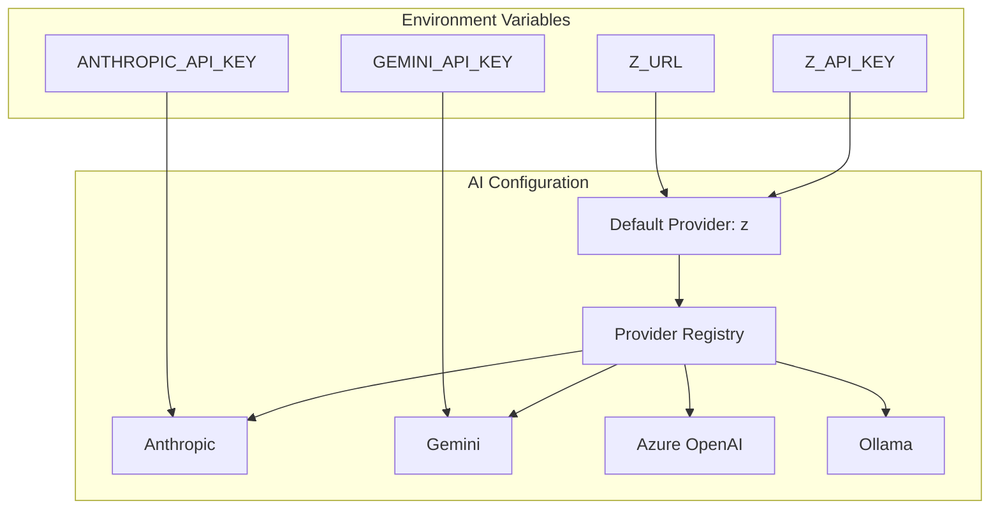

**Diagram sources**
- [ai.php:52-135](file://config/ai.php#L52-L135)

The configuration supports various AI providers including Anthropic, Gemini, Azure OpenAI, and local models through Ollama. This flexibility enables deployment in different environments and cost optimization strategies.

**Section sources**
- [ai.php:52-135](file://config/ai.php#L52-L135)

### Provider Selection Logic

The system uses environment variables for provider configuration, allowing easy switching between different AI services. The default provider is set to 'z' which connects to a custom Anthropic endpoint.

## Skills and Capabilities

### Domain-Specific Skills

The system includes specialized skills for different development domains, enabling targeted assistance in specific areas of Laravel and PHP development.

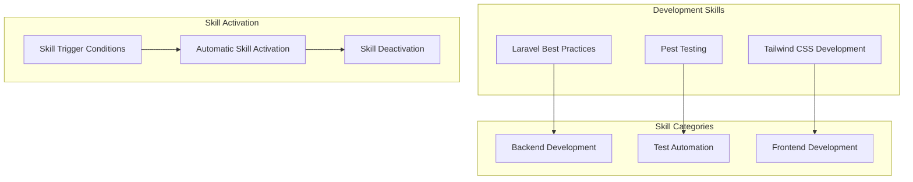

**Diagram sources**
- [AGENTS.md:24-31](file://AGENTS.md#L24-L31)

The skills system includes automatic activation based on context, ensuring developers receive relevant assistance for their specific tasks. The Laravel best practices skill covers comprehensive development guidance, while the Pest testing skill focuses specifically on testing automation.

**Section sources**
- [AGENTS.md:24-31](file://AGENTS.md#L24-L31)

### Laravel Boost Integration

The system integrates with Laravel Boost for enhanced development capabilities, providing access to specialized tools and documentation search functionality.

## Database Schema

### Conversation and Message Storage

The database schema is optimized for efficient conversation and message storage with appropriate indexing for common query patterns.

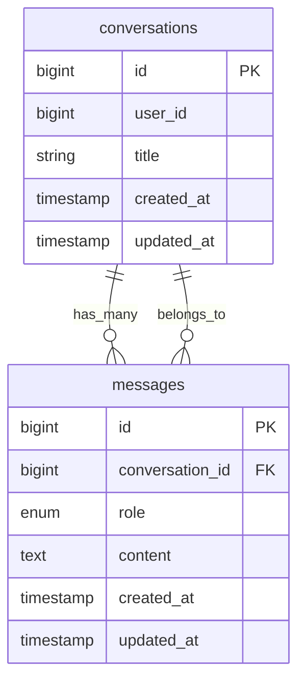

**Diagram sources**
- [2026_04_02_123216_create_conversations_table.php:14-21](file://database/migrations/2026_04_02_123216_create_conversations_table.php#L14-L21)
- [2026_04_02_123238_create_messages_table.php:14-22](file://database/migrations/2026_04_02_123238_create_messages_table.php#L14-L22)

The schema includes foreign key constraints for referential integrity and appropriate indexes for performance optimization. The conversation table includes timestamps for efficient sorting and filtering.

**Section sources**
- [2026_04_02_123216_create_conversations_table.php:14-21](file://database/migrations/2026_04_02_123216_create_conversations_table.php#L14-L21)
- [2026_04_02_123238_create_messages_table.php:14-22](file://database/migrations/2026_04_02_123238_create_messages_table.php#L14-L22)

## API Endpoints

### Route Configuration

The system provides RESTful endpoints for chat functionality with clear URL patterns and HTTP method conventions.

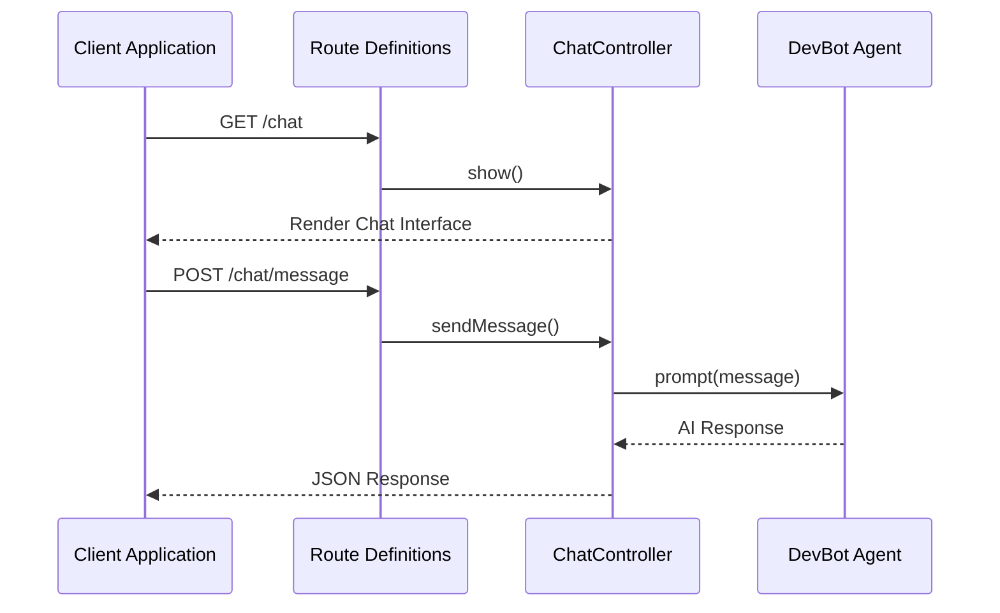

**Diagram sources**
- [web.php:10-11](file://routes/web.php#L10-L11)

The routing system includes both web interface routes and API endpoints for programmatic access. The design follows Laravel's conventional routing patterns for maintainability and predictability.

**Section sources**
- [web.php:10-11](file://routes/web.php#L10-L11)

## Error Handling

### Comprehensive Error Management

The system implements robust error handling across all layers, providing meaningful feedback to users while maintaining system stability.

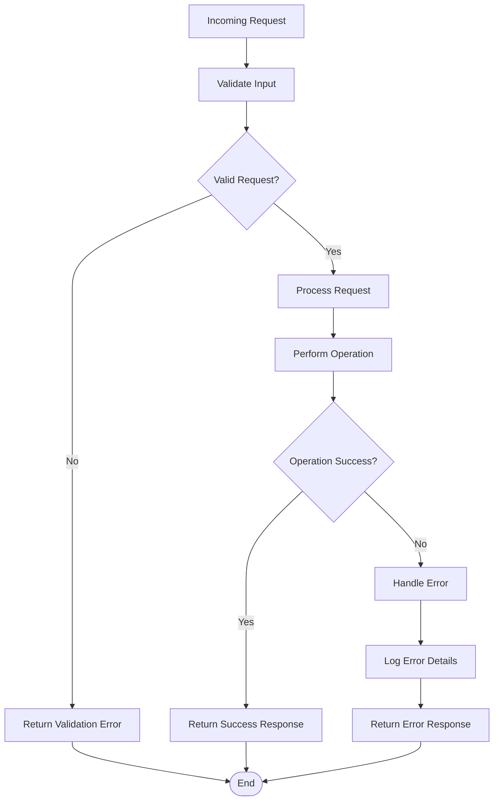

**Diagram sources**
- [ChatController.php:93-110](file://app/Http/Controllers/ChatController.php#L93-L110)

The error handling system includes detailed logging, user-friendly error messages, and graceful degradation when AI services are unavailable. This ensures users receive helpful feedback even when technical issues occur.

**Section sources**
- [ChatController.php:93-110](file://app/Http/Controllers/ChatController.php#L93-L110)

## Performance Considerations

### Optimization Strategies

The system incorporates several performance optimization strategies to ensure responsive interactions and efficient resource utilization.

**Database Performance**
- Proper indexing on conversation_id and created_at fields
- Efficient query patterns for message retrieval
- Limited message history for AI context (50 messages)

**Memory Management**
- Lazy loading of conversation messages
- Efficient model hydration
- Proper garbage collection

**Network Optimization**
- Asynchronous AI API calls
- Response caching where appropriate
- Efficient JSON serialization

## Deployment and Setup

### Installation Requirements

The system requires specific PHP and Laravel versions along with supporting packages for full functionality.

**System Requirements**
- PHP 8.3 or higher
- Laravel Framework 13.x
- Laravel AI 0.x
- Composer for dependency management

**Installation Process**
1. Install dependencies via Composer
2. Configure environment variables
3. Run database migrations
4. Build frontend assets
5. Start development server

**Section sources**
- [composer.json:11-16](file://composer.json#L11-L16)
- [composer.json:41-75](file://composer.json#L41-L75)

### Environment Configuration

The system uses environment variables for flexible deployment across different environments with sensible defaults for local development.

## Conclusion

DevBot represents a comprehensive AI-powered development assistant built on Laravel's robust framework. The system successfully combines modern AI capabilities with enterprise-grade architecture, providing developers with an intuitive platform for getting help with Laravel and PHP development challenges.

Key strengths of the system include its modular architecture, comprehensive error handling, responsive user interface, and flexible AI provider configuration. The integration of domain-specific skills and Laravel Boost enhances the development experience by providing targeted assistance for common development scenarios.

The system's design emphasizes maintainability, scalability, and user experience, making it suitable for both individual developers and development teams. Future enhancements could include additional AI providers, expanded skill sets, and advanced conversation management features.