# DevBot AI Agent System

<cite>
**Referenced Files in This Document**
- [DevBot.php](file://app/Ai/Agents/DevBot.php)
- [ChatController.php](file://app/Http/Controllers/ChatController.php)
- [Conversation.php](file://app/Models/Conversation.php)
- [Message.php](file://app/Models/Message.php)
- [DatabaseQueryTool.php](file://app/Ai/Tools/DatabaseQueryTool.php)
- [DatabaseSchemaTool.php](file://app/Ai/Tools/DatabaseSchemaTool.php)
- [SearchDocsTool.php](file://app/Ai/Tools/SearchDocsTool.php)
- [TinkerTool.php](file://app/Ai/Tools/TinkerTool.php)
- [McpClientService.php](file://app/Services/McpClientService.php)
- [Markdown.php](file://app/Helpers/Markdown.php)
- [ai.php](file://config/ai.php)
- [services.php](file://config/services.php)
- [web.php](file://routes/web.php)
- [chat.blade.php](file://resources/views/chat.blade.php)
- [2026_04_02_123216_create_conversations_table.php](file://database/migrations/2026_04_02_123216_create_conversations_table.php)
- [2026_04_02_123238_create_messages_table.php](file://database/migrations/2026_04_02_123238_create_messages_table.php)
- [composer.json](file://composer.json)
- [AppServiceProvider.php](file://app/Providers/AppServiceProvider.php)
- [AGENTS.md](file://AGENTS.md)
</cite>

## Update Summary
**Changes Made**
- Enhanced MCP tool integration documentation with comprehensive coverage of four new MCP-powered tools
- Updated agent implementation section to reflect MCP tool proxy architecture
- Added detailed MCP client service documentation with configuration and error handling
- Enhanced security considerations section with MCP-specific protections
- Updated system architecture diagrams to include MCP protocol communication layer
- Added MCP tool proxy patterns and integration specifications

## Table of Contents
1. [Introduction](#introduction)
2. [System Architecture](#system-architecture)
3. [Core Components](#core-components)
4. [Agent Implementation](#agent-implementation)
5. [MCP Tool Integration](#mcp-tool-integration)
6. [MCP Client Service](#mcp-client-service)
7. [Conversation Management](#conversation-management)
8. [User Interface](#user-interface)
9. [AI Provider Configuration](#ai-provider-configuration)
10. [Skills and Capabilities](#skills-and-capabilities)
11. [Database Schema](#database-schema)
12. [API Endpoints](#api-endpoints)
13. [Error Handling](#error-handling)
14. [Security Considerations](#security-considerations)
15. [Performance Considerations](#performance-considerations)
16. [Deployment and Setup](#deployment-and-setup)
17. [Conclusion](#conclusion)

## Introduction

DevBot is an AI-powered development assistant integrated into a Laravel application with comprehensive MCP (Model Context Protocol) tool integration. This intelligent chat system provides developers with instant access to programming knowledge, code review capabilities, debugging assistance, architectural guidance, and direct database interaction through specialized MCP-powered tools. Built with Laravel's AI framework and enhanced with MCP protocol communication, DevBot serves as a comprehensive development companion that understands Laravel and PHP best practices while offering real-time conversational AI responses with powerful tool execution capabilities.

The system combines modern AI technologies with Laravel's robust framework and MCP protocol to create an intuitive development environment where developers can ask questions, receive code examples, get guidance on best practices, and directly interact with their application's database and documentation systems through secure MCP tool proxies. DevBot is particularly focused on Laravel ecosystem development, making it an invaluable tool for PHP developers working within the Laravel framework.

## System Architecture

The DevBot system follows a clean, layered architecture that separates concerns between presentation, business logic, data persistence, AI integration, and MCP tool execution. The architecture is designed around Laravel's MVC pattern while incorporating modern AI agent capabilities and comprehensive MCP tool integration with secure external service communication.

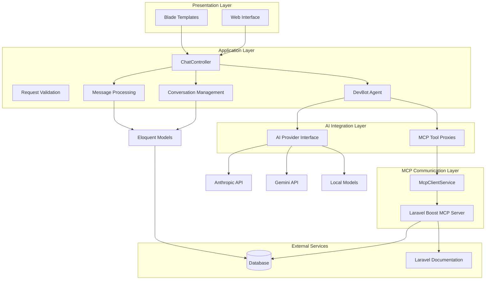

**Diagram sources**
- [ChatController.php:13-113](file://app/Http/Controllers/ChatController.php#L13-L113)
- [DevBot.php:20-108](file://app/Ai/Agents/DevBot.php#L20-L108)
- [McpClientService.php:20-279](file://app/Services/McpClientService.php#L20-L279)
- [AppServiceProvider.php:9-65](file://app/Providers/AppServiceProvider.php#L9-L65)

The architecture ensures clear separation of concerns with the controller handling HTTP requests, the agent managing AI interactions and MCP tool proxy execution, and the models handling data persistence. The MCP tool integration layer provides secure, controlled access to application resources while maintaining system security boundaries through the McpClientService abstraction.

**Section sources**
- [ChatController.php:13-113](file://app/Http/Controllers/ChatController.php#L13-L113)
- [DevBot.php:20-108](file://app/Ai/Agents/DevBot.php#L20-L108)
- [McpClientService.php:20-279](file://app/Services/McpClientService.php#L20-L279)

## Core Components

### AI Agent System

The heart of DevBot is the DevBot AI agent, which implements Laravel's AI agent interface with comprehensive MCP tool proxy integration. This agent is configured with specific parameters optimized for development assistance and includes four specialized MCP-powered tools for enhanced functionality.

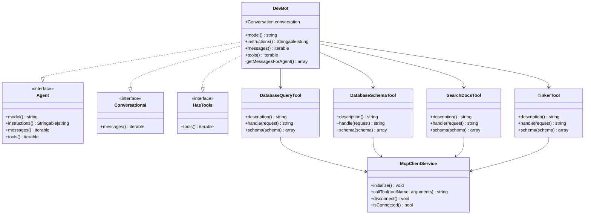

**Diagram sources**
- [DevBot.php:24-106](file://app/Ai/Agents/DevBot.php#L24-L106)
- [DatabaseQueryTool.php:13-84](file://app/Ai/Tools/DatabaseQueryTool.php#L13-L84)
- [DatabaseSchemaTool.php:13-69](file://app/Ai/Tools/DatabaseSchemaTool.php#L13-L69)
- [SearchDocsTool.php:13-75](file://app/Ai/Tools/SearchDocsTool.php#L13-L75)
- [TinkerTool.php:13-89](file://app/Ai/Tools/TinkerTool.php#L13-L89)
- [McpClientService.php:20-279](file://app/Services/McpClientService.php#L20-L279)

The agent is configured with a maximum step limit of 10 and a temperature setting of 0.7, providing balanced responses that are both helpful and accurate for development scenarios. The four integrated MCP tool proxies provide comprehensive development assistance capabilities through secure external service communication.

**Section sources**
- [DevBot.php:24-106](file://app/Ai/Agents/DevBot.php#L24-L106)

### Controller Layer

The ChatController serves as the primary entry point for user interactions, handling both web interface rendering and API requests. It manages conversation lifecycle, validates user input, coordinates with the AI agent for responses, and integrates with the MCP tool proxy system for enhanced functionality.

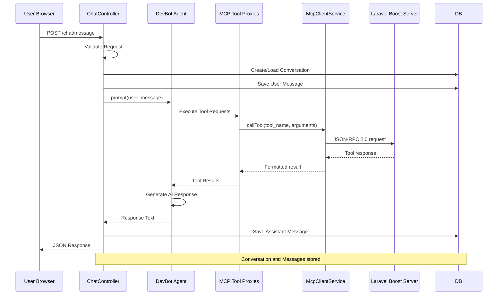

**Diagram sources**
- [ChatController.php:39-113](file://app/Http/Controllers/ChatController.php#L39-L113)

**Section sources**
- [ChatController.php:39-113](file://app/Http/Controllers/ChatController.php#L39-L113)

## Agent Implementation

### Configuration and Behavior

The DevBot agent is configured with specific parameters that optimize its behavior for development assistance and includes comprehensive instructions for appropriate responses. The agent uses environment variables for flexible deployment configurations and includes four specialized MCP-powered tools for enhanced functionality.

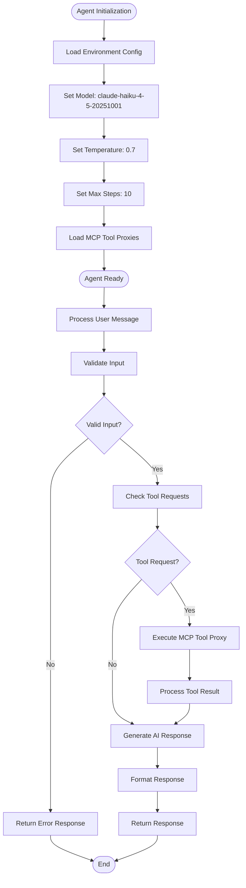

**Diagram sources**
- [DevBot.php:28-38](file://app/Ai/Agents/DevBot.php#L28-L38)
- [DevBot.php:43-77](file://app/Ai/Agents/DevBot.php#L43-L77)
- [DevBot.php:98-106](file://app/Ai/Agents/DevBot.php#L98-L106)

The agent's instructions emphasize development-focused assistance, including Laravel and PHP best practices, code review capabilities, architectural guidance, and MCP tool usage. This ensures responses remain relevant and helpful for developer use cases while leveraging the power of integrated MCP tool proxies.

**Section sources**
- [DevBot.php:28-106](file://app/Ai/Agents/DevBot.php#L28-L106)

## MCP Tool Integration

### Database Query Tool

The DatabaseQueryTool provides secure, read-only SQL query execution against the application database through the MCP protocol. It enforces strict security policies and provides comprehensive error handling for database operations via the Laravel Boost MCP server.

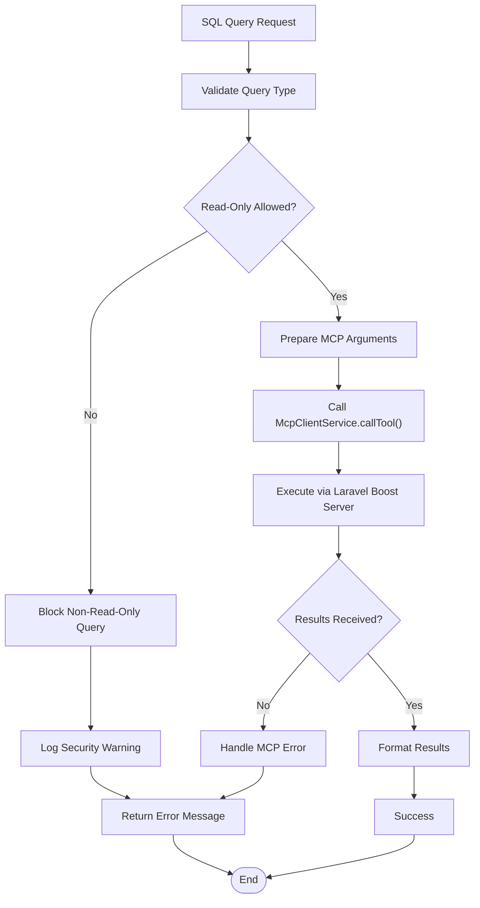

**Diagram sources**
- [DatabaseQueryTool.php:26-69](file://app/Ai/Tools/DatabaseQueryTool.php#L26-L69)

The tool restricts queries to SELECT, SHOW, EXPLAIN, and DESCRIBE statements only, preventing destructive database operations. Results are automatically handled by the McpClientService and returned to the AI agent for processing.

**Section sources**
- [DatabaseQueryTool.php:13-84](file://app/Ai/Tools/DatabaseQueryTool.php#L13-L84)

### Database Schema Tool

The DatabaseSchemaTool provides comprehensive database schema information including table listings, column details, and index information through the MCP protocol. It offers both overview and detailed schema inspection capabilities via the Laravel Boost MCP server.

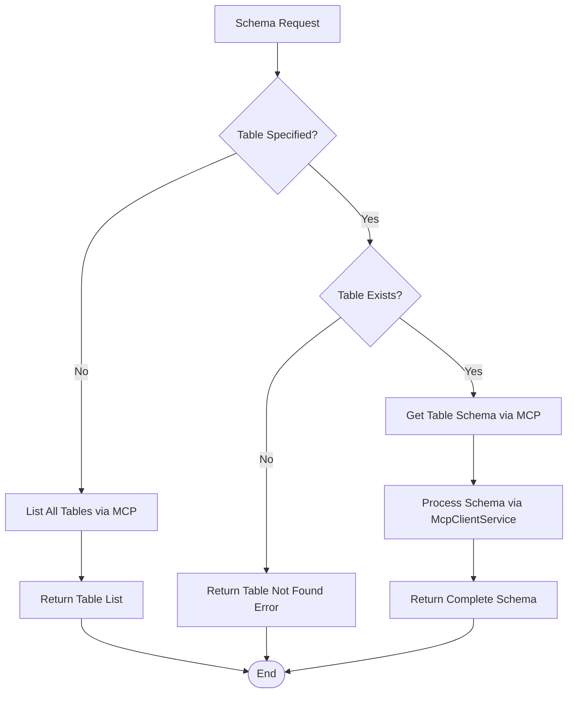

**Diagram sources**
- [DatabaseSchemaTool.php:26-54](file://app/Ai/Tools/DatabaseSchemaTool.php#L26-L54)

The tool filters out internal database system tables and provides detailed information about table structure, column types, and index definitions for comprehensive database understanding through the MCP protocol.

**Section sources**
- [DatabaseSchemaTool.php:13-69](file://app/Ai/Tools/DatabaseSchemaTool.php#L13-L69)

### Search Documentation Tool

The SearchDocsTool provides Laravel and package documentation search capabilities with intelligent result deduplication and relevance scoring through the MCP protocol. It serves as a bridge between the AI agent and external documentation resources via the Laravel Boost MCP server.

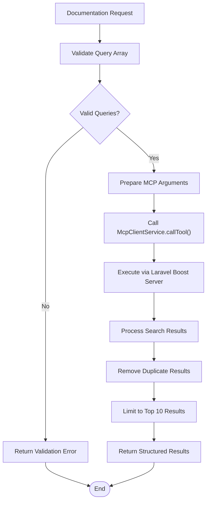

**Diagram sources**
- [SearchDocsTool.php:32-59](file://app/Ai/Tools/SearchDocsTool.php#L32-L59)

The tool accepts multiple search queries and packages, returning relevant documentation snippets with links to authoritative sources. Results are processed through the McpClientService and returned to the AI agent for formatting.

**Section sources**
- [SearchDocsTool.php:13-75](file://app/Ai/Tools/SearchDocsTool.php#L13-L75)

### Tinker Tool

The TinkerTool provides a safe execution environment for PHP code evaluation within the Laravel application context through the MCP protocol. It offers debugging capabilities and code testing functionality with comprehensive error handling via the Laravel Boost MCP server.

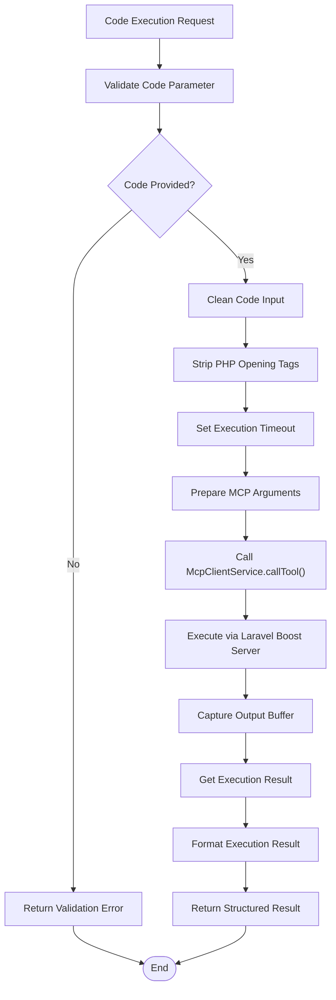

**Diagram sources**
- [TinkerTool.php:31-57](file://app/Ai/Tools/TinkerTool.php#L31-L57)

The tool removes PHP opening tags, validates timeout limits (maximum 60 seconds), captures output buffers, and returns both execution output and return values for comprehensive debugging support through the MCP protocol.

**Section sources**
- [TinkerTool.php:13-89](file://app/Ai/Tools/TinkerTool.php#L13-L89)

## MCP Client Service

### Service Architecture

The McpClientService provides a centralized interface for managing connections to the Laravel Boost MCP server via STDIO transport. It manages connection lifecycle, implements auto-reconnect logic, and provides comprehensive logging for all MCP operations.

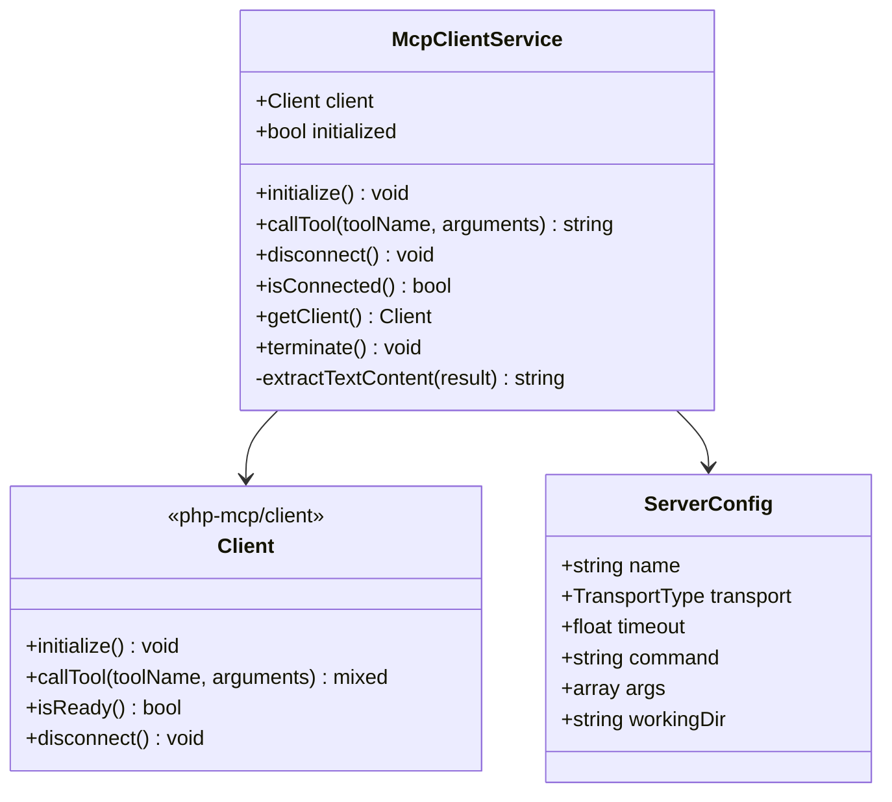

**Diagram sources**
- [McpClientService.php:20-279](file://app/Services/McpClientService.php#L20-L279)

The service creates a new client instance with STDIO transport, configures server parameters, and performs the MCP handshake. It manages connection state to prevent duplicate initialization and provides persistent connections for multiple tool calls.

**Section sources**
- [McpClientService.php:20-279](file://app/Services/McpClientService.php#L20-L279)

### Connection Management

The McpClientService implements sophisticated connection management with automatic initialization, health checks, and graceful shutdown capabilities. It handles connection failures with auto-reconnect logic and exponential backoff.

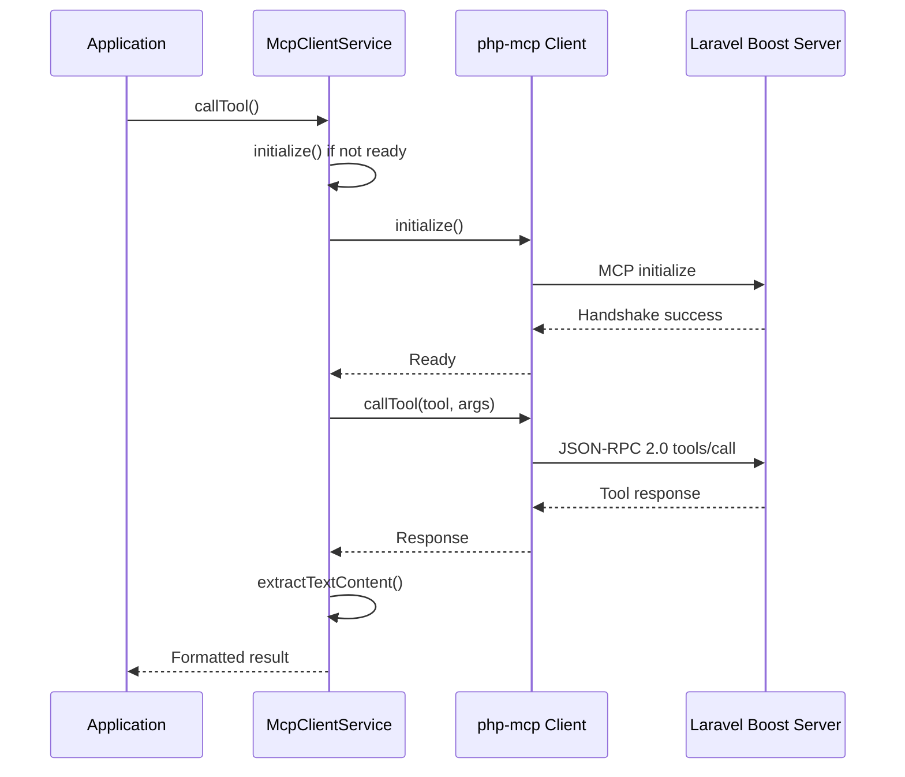

**Diagram sources**
- [McpClientService.php:48-96](file://app/Services/McpClientService.php#L48-L96)
- [McpClientService.php:110-179](file://app/Services/McpClientService.php#L110-L179)

**Section sources**
- [McpClientService.php:48-179](file://app/Services/McpClientService.php#L48-L179)

### Configuration and Error Handling

The McpClientService reads configuration from the services.php configuration file and implements comprehensive error handling with logging and retry mechanisms. It validates configuration settings and handles connection failures gracefully.

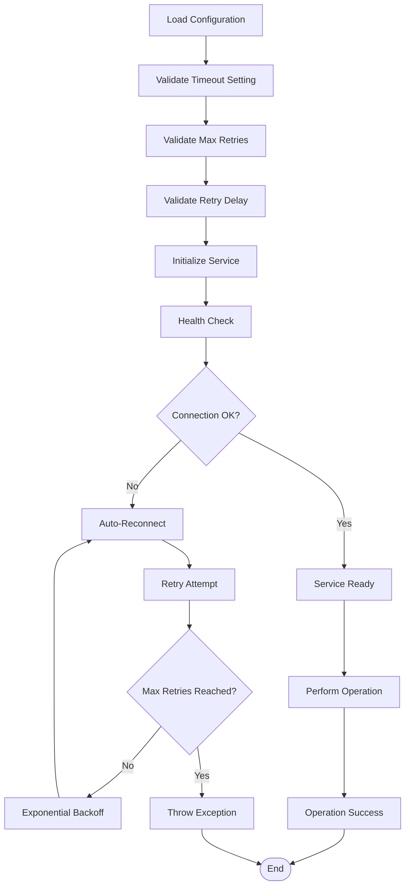

**Diagram sources**
- [services.php:38-43](file://config/services.php#L38-L43)
- [McpClientService.php:110-179](file://app/Services/McpClientService.php#L110-L179)

**Section sources**
- [services.php:38-43](file://config/services.php#L38-L43)
- [McpClientService.php:110-179](file://app/Services/McpClientService.php#L110-L179)

## Conversation Management

### Data Persistence Strategy

The conversation management system uses Laravel's Eloquent ORM to persist chat history with efficient querying and relationship management. The system maintains conversation metadata and message sequences for optimal AI context retrieval, with enhanced support for MCP tool interactions.

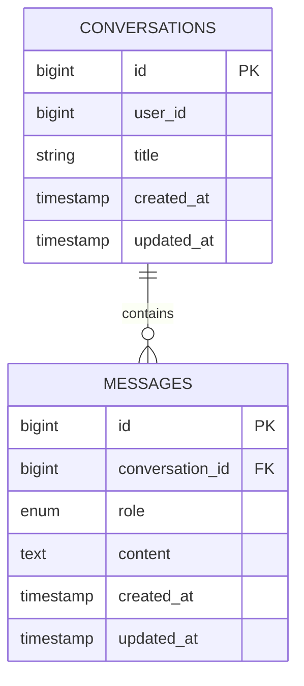

**Diagram sources**
- [2026_04_02_123216_create_conversations_table.php:14-21](file://database/migrations/2026_04_02_123216_create_conversations_table.php#L14-L21)
- [2026_04_02_123238_create_messages_table.php:14-22](file://database/migrations/2026_04_02_123238_create_messages_table.php#L14-L22)

The conversation model includes helper methods for generating titles from initial messages and retrieving recent messages for AI context. The message model provides formatting capabilities using Markdown rendering and supports both user and assistant roles in the conversation history.

**Section sources**
- [Conversation.php:8-45](file://app/Models/Conversation.php#L8-L45)
- [Message.php:9-44](file://app/Models/Message.php#L9-L44)

### Message Processing Pipeline

The message processing pipeline handles both user and assistant messages with proper formatting and persistence, including enhanced support for MCP tool-generated responses. The system ensures message ordering and provides formatted content for display.

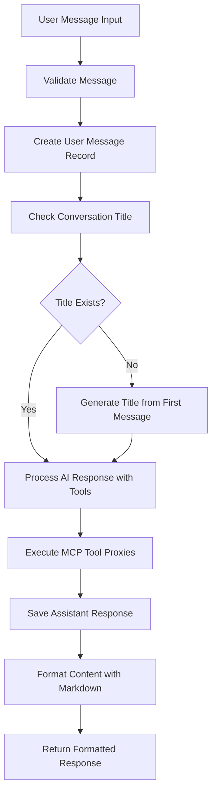

**Diagram sources**
- [ChatController.php:59-81](file://app/Http/Controllers/ChatController.php#L59-L81)
- [Message.php:39-42](file://app/Models/Message.php#L39-L42)

**Section sources**
- [ChatController.php:59-81](file://app/Http/Controllers/ChatController.php#L59-L81)
- [Message.php:39-42](file://app/Models/Message.php#L39-L42)

## User Interface

### Web Interface Design

The user interface provides an intuitive chat experience with responsive design and smooth interactions, enhanced with real-time MCP tool feedback and improved conversation management capabilities.

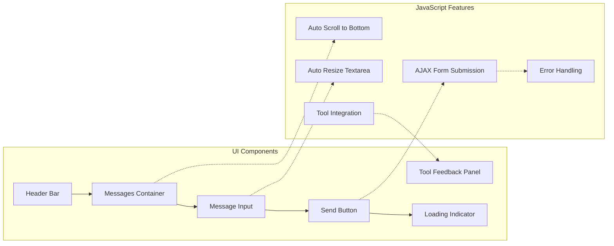

**Diagram sources**
- [chat.blade.php:10-391](file://resources/views/chat.blade.php#L10-L391)

The interface includes sophisticated JavaScript for enhanced user experience, including auto-scrolling to new messages, dynamic textarea resizing, comprehensive error handling, and real-time MCP tool feedback. The design follows modern UI/UX principles with clear visual hierarchy and responsive behavior.

**Section sources**
- [chat.blade.php:10-391](file://resources/views/chat.blade.php#L10-L391)

### Responsive Design Implementation

The interface adapts seamlessly to different screen sizes and devices, ensuring accessibility across desktop, tablet, and mobile platforms. The design uses Tailwind CSS utility classes for consistent styling and responsive breakpoints, with enhanced support for MCP tool interaction indicators.

## AI Provider Configuration

### Multi-Provider Support

The system supports multiple AI providers through a unified configuration interface with enhanced MCP tool integration capabilities. This allows flexibility in choosing different AI services while maintaining consistent behavior across providers.

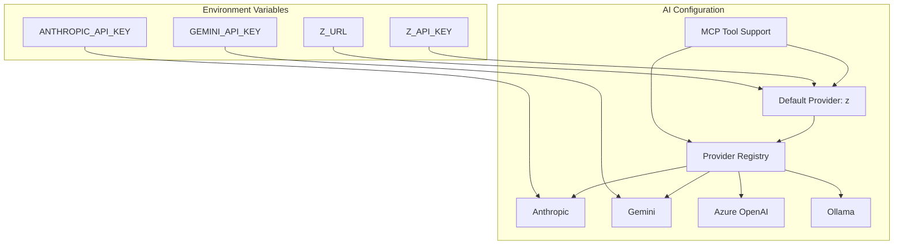

**Diagram sources**
- [ai.php:52-135](file://config/ai.php#L52-L135)

The configuration supports various AI providers including Anthropic, Gemini, Azure OpenAI, and local models through Ollama. The MCP tool integration works seamlessly across all providers, ensuring consistent tool execution regardless of the underlying AI service.

**Section sources**
- [ai.php:52-135](file://config/ai.php#L52-L135)

### Provider Selection Logic

The system uses environment variables for provider configuration, allowing easy switching between different AI services. The default provider is set to 'z' which connects to a custom Anthropic endpoint, with MCP tool support available across all providers.

## Skills and Capabilities

### Domain-Specific Skills

The system includes specialized skills for different development domains, enhanced with comprehensive MCP tool integration for targeted assistance in specific areas of Laravel and PHP development.

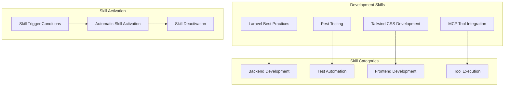

**Diagram sources**
- [AGENTS.md:24-31](file://AGENTS.md#L24-L31)

The skills system includes automatic activation based on context, ensuring developers receive relevant assistance for their specific tasks. The MCP tool integration provides comprehensive development assistance including database operations, documentation search, and code execution capabilities through secure external service communication.

**Section sources**
- [AGENTS.md:24-31](file://AGENTS.md#L24-L31)

### Laravel Boost Integration

The system integrates with Laravel Boost for enhanced development capabilities, providing access to specialized tools and documentation search functionality. The MCP tool integration enhances this capability with direct database and code execution features through the Laravel Boost MCP server.

## Database Schema

### Conversation and Message Storage

The database schema is optimized for efficient conversation and message storage with appropriate indexing for common query patterns and enhanced support for MCP tool interactions.

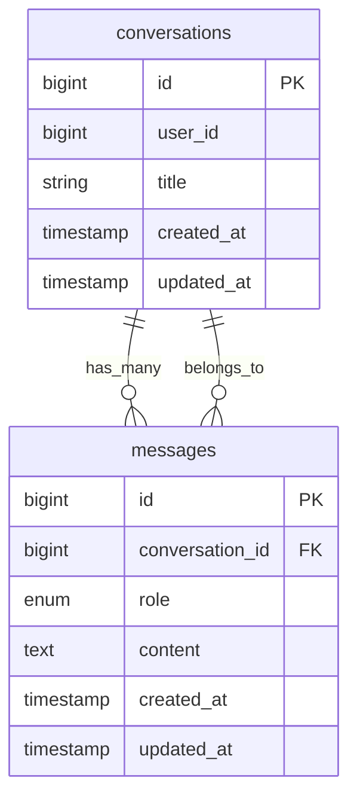

**Diagram sources**
- [2026_04_02_123216_create_conversations_table.php:14-21](file://database/migrations/2026_04_02_123216_create_conversations_table.php#L14-L21)
- [2026_04_02_123238_create_messages_table.php:14-22](file://database/migrations/2026_04_02_123238_create_messages_table.php#L14-L22)

The schema includes foreign key constraints for referential integrity and appropriate indexes for performance optimization. The conversation table includes timestamps for efficient sorting and filtering, supporting the enhanced conversation management capabilities.

**Section sources**
- [2026_04_02_123216_create_conversations_table.php:14-21](file://database/migrations/2026_04_02_123216_create_conversations_table.php#L14-L21)
- [2026_04_02_123238_create_messages_table.php:14-22](file://database/migrations/2026_04_02_123238_create_messages_table.php#L14-L22)

## API Endpoints

### Route Configuration

The system provides RESTful endpoints for chat functionality with clear URL patterns and HTTP method conventions, enhanced with MCP tool integration support.

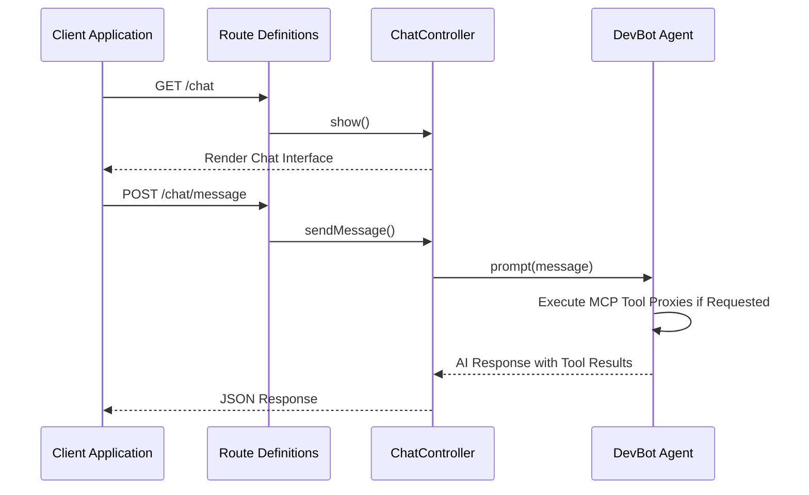

**Diagram sources**
- [web.php:10-11](file://routes/web.php#L10-L11)

The routing system includes both web interface routes and API endpoints for programmatic access, with enhanced support for MCP tool interactions. The design follows Laravel's conventional routing patterns for maintainability and predictability.

**Section sources**
- [web.php:10-11](file://routes/web.php#L10-L11)

## Error Handling

### Comprehensive Error Management

The system implements robust error handling across all layers, providing meaningful feedback to users while maintaining system stability, with enhanced error handling for MCP tool operations.

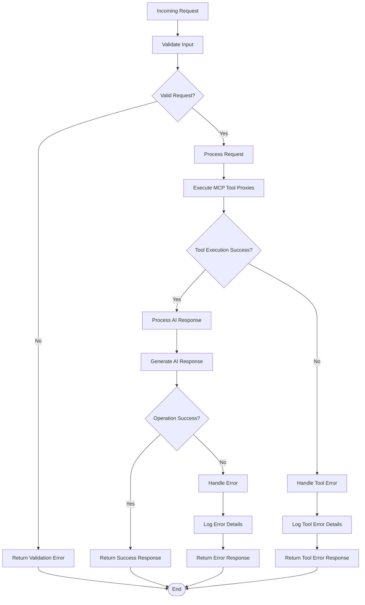

**Diagram sources**
- [ChatController.php:93-110](file://app/Http/Controllers/ChatController.php#L93-L110)

The error handling system includes detailed logging, user-friendly error messages, graceful degradation when AI services are unavailable, and comprehensive error handling for MCP tool operations. This ensures users receive helpful feedback even when technical issues occur.

**Section sources**
- [ChatController.php:93-110](file://app/Http/Controllers/ChatController.php#L93-L110)

## Security Considerations

### MCP Tool Security

The MCP tool integration implements comprehensive security measures to protect the application from malicious tool usage while providing necessary development capabilities. The McpClientService acts as a security boundary between the AI agent and external services.

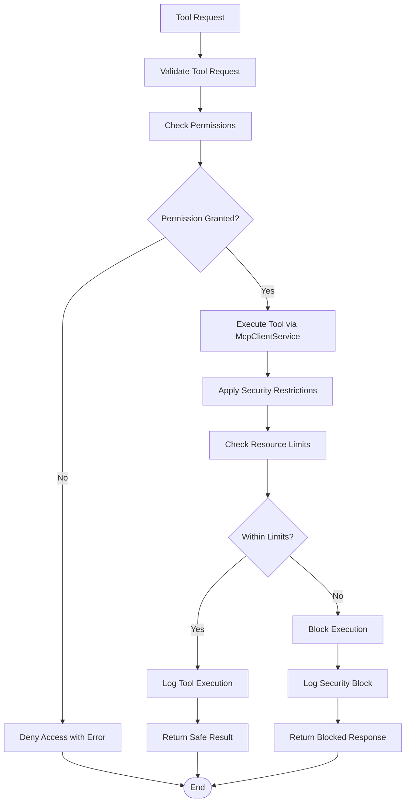

**Diagram sources**
- [DatabaseQueryTool.php:31-49](file://app/Ai/Tools/DatabaseQueryTool.php#L31-L49)
- [TinkerTool.php:35-40](file://app/Ai/Tools/TinkerTool.php#L35-L40)
- [McpClientService.php:140-179](file://app/Services/McpClientService.php#L140-L179)

The security model includes read-only database access restrictions, code execution timeouts, output capture and sanitization, and comprehensive logging for all tool operations. The McpClientService provides a centralized security boundary that validates all tool requests before forwarding them to the Laravel Boost MCP server.

**Section sources**
- [DatabaseQueryTool.php:31-74](file://app/Ai/Tools/DatabaseQueryTool.php#L31-L74)
- [TinkerTool.php:35-60](file://app/Ai/Tools/TinkerTool.php#L35-L60)
- [McpClientService.php:140-179](file://app/Services/McpClientService.php#L140-L179)

## Performance Considerations

### Optimization Strategies

The system incorporates several performance optimization strategies to ensure responsive interactions and efficient resource utilization, with enhanced considerations for MCP tool execution.

**Database Performance**
- Proper indexing on conversation_id and created_at fields
- Efficient query patterns for message retrieval
- Limited message history for AI context (50 messages)
- MCP tool result caching where appropriate

**Memory Management**
- Lazy loading of conversation messages
- Efficient model hydration
- Proper garbage collection
- Tool execution memory limits

**Network Optimization**
- Asynchronous AI API calls
- Response caching where appropriate
- Efficient JSON serialization
- MCP tool batch processing

**Tool Execution Optimization**
- Timeout limits for MCP tool operations
- Result size limiting for database queries
- Output buffering for code execution
- Connection pooling for database operations
- Persistent MCP client connections to reduce startup overhead

## Deployment and Setup

### Installation Requirements

The system requires specific PHP and Laravel versions along with supporting packages for full functionality, including MCP tool integration capabilities.

**System Requirements**
- PHP 8.3 or higher
- Laravel Framework 13.x
- Laravel AI 0.x
- Laravel Boost 2.x (for enhanced features)
- Composer for dependency management
- php-mcp/client library for MCP protocol communication

**Installation Process**
1. Install dependencies via Composer
2. Configure environment variables for AI providers and MCP tools
3. Run database migrations
4. Build frontend assets
5. Start development server

**Section sources**
- [composer.json:11-16](file://composer.json#L11-L16)
- [composer.json:41-75](file://composer.json#L41-L75)

### Environment Configuration

The system uses environment variables for flexible deployment across different environments with sensible defaults for local development, including MCP tool configuration and AI provider settings.

**MCP Client Configuration**
- MCP_CLIENT_COMMAND: Artisan command to run (default: `php artisan boost:mcp`)
- MCP_CLIENT_TIMEOUT: Maximum seconds to wait for tool response (default: 60)
- MCP_CLIENT_MAX_RETRIES: Number of reconnect attempts (default: 3)
- MCP_CLIENT_RETRY_DELAY: Base delay between retries in milliseconds (default: 1000)

**Section sources**
- [services.php:38-43](file://config/services.php#L38-L43)

## Conclusion

DevBot represents a comprehensive AI-powered development assistant built on Laravel's robust framework with extensive MCP tool integration. The system successfully combines modern AI capabilities with enterprise-grade architecture, providing developers with an intuitive platform for getting help with Laravel and PHP development challenges while offering powerful tool execution capabilities through secure MCP protocol communication.

Key strengths of the system include its modular architecture with comprehensive MCP tool proxy integration, robust error handling with enhanced tool security, responsive user interface with real-time tool feedback, and flexible AI provider configuration that supports multiple MCP tool implementations. The integration of four specialized MCP-powered tools (DatabaseQueryTool, DatabaseSchemaTool, SearchDocsTool, and TinkerTool) provides comprehensive development assistance capabilities through secure external service communication.

The system's design emphasizes maintainability, scalability, security, and user experience, making it suitable for both individual developers and development teams. The MCP tool integration ensures that developers can directly interact with their application's database, search documentation, and execute code safely and efficiently through the Laravel Boost MCP server.

Future enhancements could include additional MCP tools, expanded AI provider support, advanced conversation management features, and enhanced tool execution capabilities. The comprehensive foundation established by the current implementation provides an excellent base for continued evolution and improvement of the DevBot system.