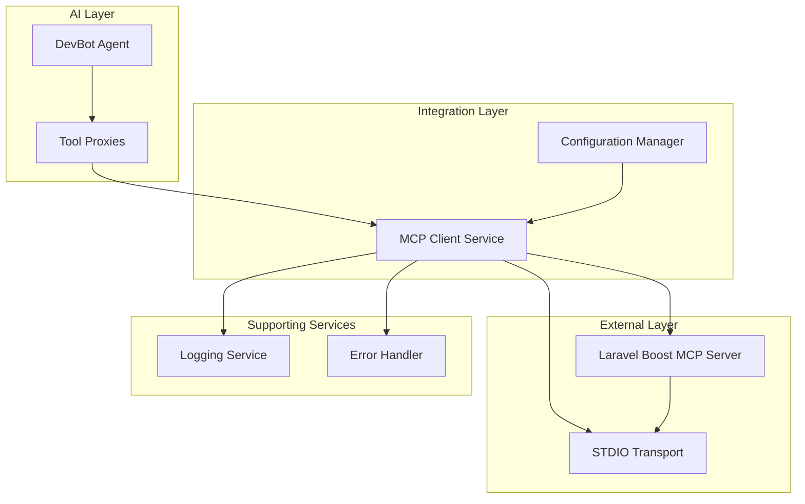
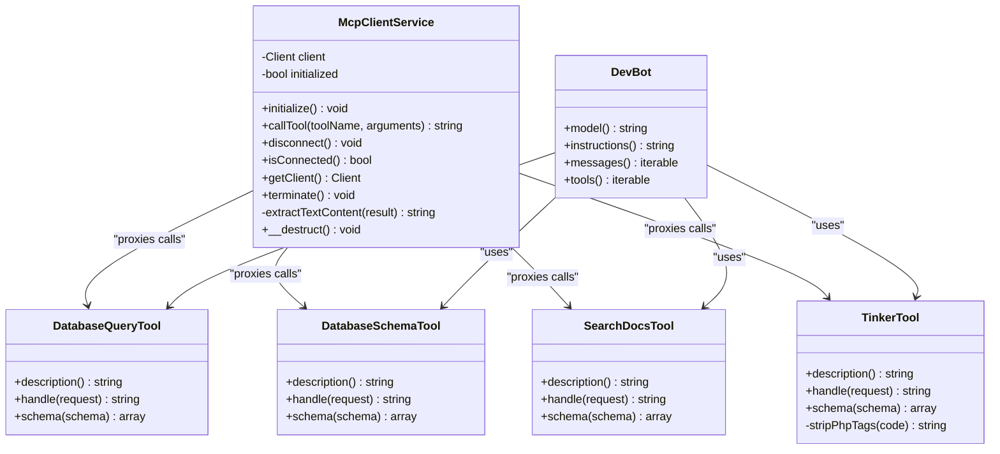
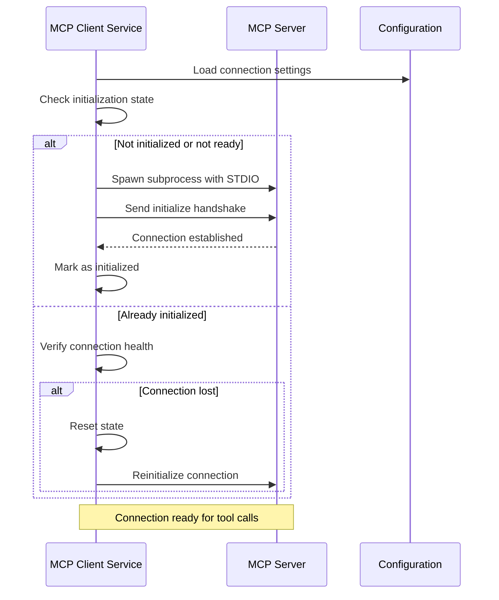
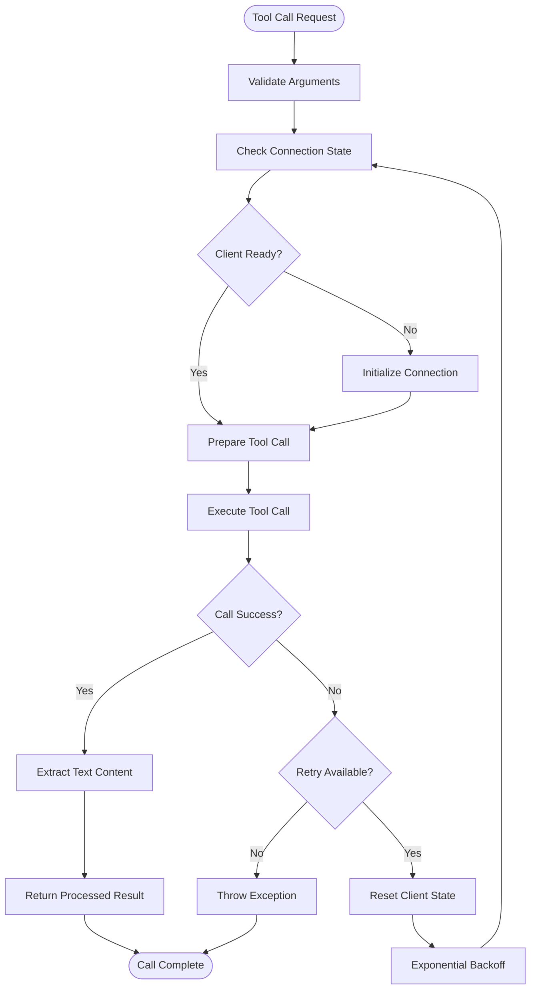
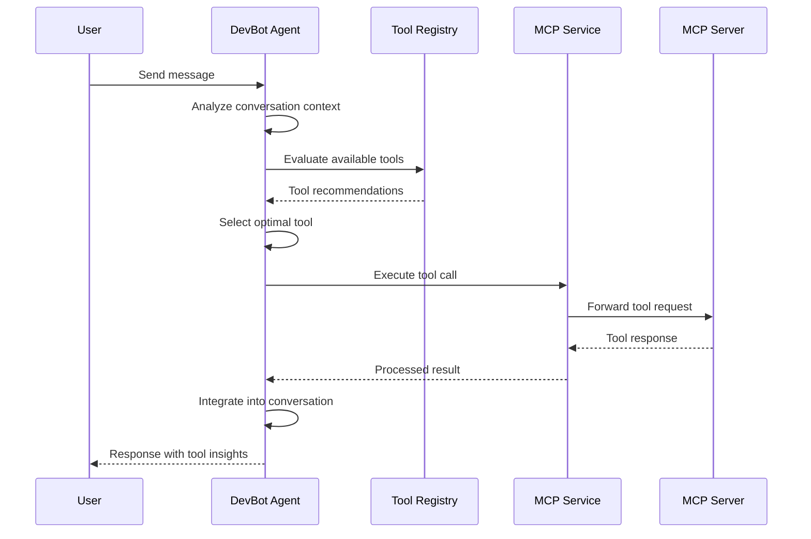
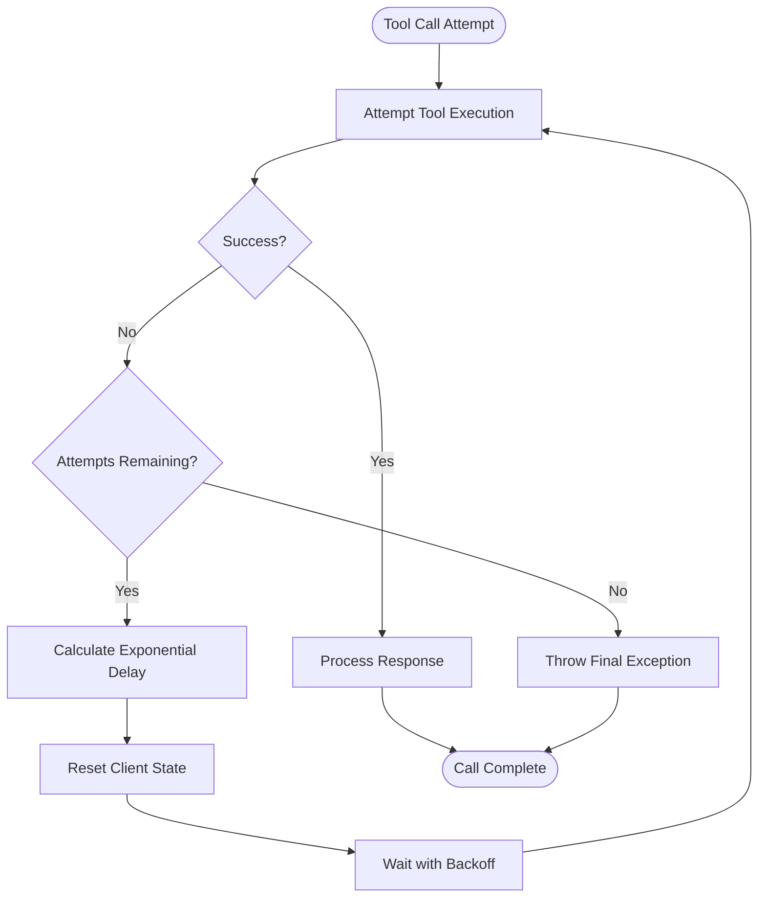
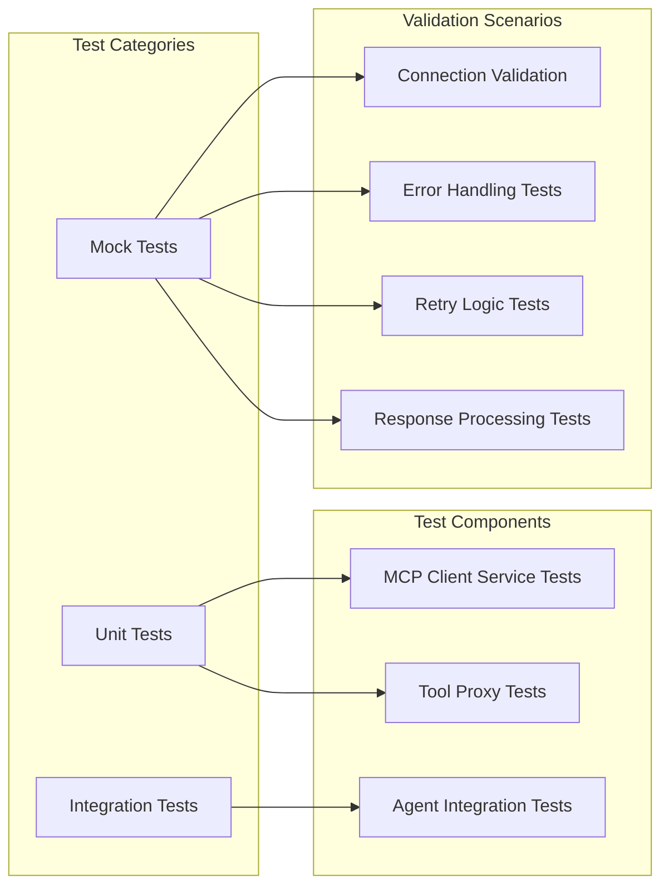

# MCP Client Integration System

<cite>
**Referenced Files in This Document**
- [McpClientService.php](file://app/Services/McpClientService.php)
- [DatabaseQueryTool.php](file://app/Ai/Tools/DatabaseQueryTool.php)
- [DatabaseSchemaTool.php](file://app/Ai/Tools/DatabaseSchemaTool.php)
- [SearchDocsTool.php](file://app/Ai/Tools/SearchDocsTool.php)
- [TinkerTool.php](file://app/Ai/Tools/TinkerTool.php)
- [DevBot.php](file://app/Ai/Agents/DevBot.php)
- [services.php](file://config/services.php)
- [composer.json](file://composer.json)
- [mcp-client-service/spec.md](file://openspec/specs/mcp-client-service/spec.md)
- [mcp-tool-integration/spec.md](file://openspec/specs/mcp-tool-integration/spec.md)
- [mcp-tool-proxy/spec.md](file://openspec/specs/mcp-tool-proxy/spec.md)
- [McpClientServiceTest.php](file://tests/Unit/McpClientServiceTest.php)
- [McpToolsTest.php](file://tests/Unit/McpToolsTest.php)
- [ToolProxyTest.php](file://tests/Unit/ToolProxyTest.php)
</cite>

## Table of Contents
1. [Introduction](#introduction)
2. [System Architecture](#system-architecture)
3. [Core Components](#core-components)
4. [MCP Client Service](#mcp-client-service)
5. [Tool Proxy Implementation](#tool-proxy-implementation)
6. [Agent Integration](#agent-integration)
7. [Configuration Management](#configuration-management)
8. [Error Handling and Resilience](#error-handling-and-resilience)
9. [Testing Framework](#testing-framework)
10. [Performance Considerations](#performance-considerations)
11. [Troubleshooting Guide](#troubleshooting-guide)
12. [Conclusion](#conclusion)

## Introduction

The MCP Client Integration System represents a sophisticated architecture that bridges Laravel's AI agent ecosystem with external MCP (Model Context Protocol) servers through a robust client service. This system enables DevBot, the primary AI agent, to execute development-related tasks such as database queries, schema inspection, documentation searches, and PHP code execution through standardized MCP protocols.

The integration leverages the php-mcp/client library to establish reliable STDIO-based connections to the Laravel Boost MCP server, implementing comprehensive error handling, auto-reconnection mechanisms, and persistent connection management. This architecture ensures seamless communication between the Laravel application and specialized development tools while maintaining the flexibility to extend functionality through additional MCP-compatible tools.

## System Architecture

The MCP Client Integration System follows a layered architecture pattern that separates concerns between the AI agent layer, tool proxy layer, and the underlying MCP client service. This design promotes maintainability, testability, and extensibility while ensuring robust communication with external MCP servers.



**Diagram sources**
- [McpClientService.php:13-279](file://app/Services/McpClientService.php#L13-L279)
- [DevBot.php:24-107](file://app/Ai/Agents/DevBot.php#L24-L107)

The architecture implements a proxy pattern where individual tool classes act as lightweight wrappers around MCP service calls, ensuring that all tool operations are executed through the standardized MCP protocol rather than direct PHP execution. This design provides several advantages including improved security, better resource management, and enhanced scalability.

**Section sources**
- [McpClientService.php:13-279](file://app/Services/McpClientService.php#L13-L279)
- [DevBot.php:24-107](file://app/Ai/Agents/DevBot.php#L24-L107)

## Core Components

The MCP Client Integration System comprises several interconnected components that work together to provide seamless MCP protocol communication within the Laravel ecosystem.

### MCP Client Service Architecture

The central MCP Client Service serves as the primary interface for establishing and managing connections to MCP servers. It implements sophisticated connection lifecycle management, automatic reconnection logic, and comprehensive error handling mechanisms.



**Diagram sources**
- [McpClientService.php:20-279](file://app/Services/McpClientService.php#L20-L279)
- [DatabaseQueryTool.php:13-84](file://app/Ai/Tools/DatabaseQueryTool.php#L13-L84)
- [DatabaseSchemaTool.php:13-69](file://app/Ai/Tools/DatabaseSchemaTool.php#L13-L69)
- [SearchDocsTool.php:13-75](file://app/Ai/Tools/SearchDocsTool.php#L13-L75)
- [TinkerTool.php:13-89](file://app/Ai/Tools/TinkerTool.php#L13-L89)
- [DevBot.php:24-107](file://app/Ai/Agents/DevBot.php#L24-L107)

### Connection Management Strategy

The system implements a sophisticated connection management strategy that balances performance with reliability. The MCP Client Service maintains connection state information and employs intelligent reconnection logic to handle transient failures gracefully.

**Section sources**
- [McpClientService.php:20-279](file://app/Services/McpClientService.php#L20-L279)
- [mcp-client-service/spec.md:15-28](file://openspec/specs/mcp-client-service/spec.md#L15-L28)

## MCP Client Service

The MCP Client Service represents the cornerstone of the integration system, providing robust connection management, tool invocation capabilities, and comprehensive error handling mechanisms.

### Connection Lifecycle Management

The service implements a stateful connection approach that tracks initialization status and client readiness to ensure optimal resource utilization and connection reliability.



**Diagram sources**
- [McpClientService.php:48-96](file://app/Services/McpClientService.php#L48-L96)
- [mcp-client-service/spec.md:7-20](file://openspec/specs/mcp-client-service/spec.md#L7-L20)

### Tool Invocation Mechanism

The tool invocation system provides a unified interface for executing MCP-compatible operations while implementing comprehensive retry logic and error handling.



**Diagram sources**
- [McpClientService.php:110-179](file://app/Services/McpClientService.php#L110-L179)
- [mcp-tool-integration/spec.md:14-29](file://openspec/specs/mcp-tool-integration/spec.md#L14-L29)

### Response Processing and Content Extraction

The service implements sophisticated content extraction logic to handle various MCP response formats and ensure consistent string-based output for downstream consumers.

**Section sources**
- [McpClientService.php:110-279](file://app/Services/McpClientService.php#L110-L279)
- [mcp-tool-integration/spec.md:30-47](file://openspec/specs/mcp-tool-integration/spec.md#L30-L47)

## Tool Proxy Implementation

The tool proxy layer provides specialized implementations for different development tasks while maintaining consistency in the MCP protocol interface. Each tool implements the Laravel AI Tool contract and delegates execution to the MCP client service.

### Database Query Tool

The Database Query Tool provides secure, read-only database query execution through MCP protocol, implementing strict validation to prevent write operations.

```mermaid
classDiagram
class DatabaseQueryTool {
+description() string
+handle(request) string
+schema(schema) array
-validateReadOnlyQuery(query) bool
}
class McpClientService {
+callTool(toolName, arguments) string
}
DatabaseQueryTool --> McpClientService : "delegates to"
note for DatabaseQueryTool : "Validates read-only queries\n(SELECT, SHOW, EXPLAIN, DESCRIBE)\nPrevents SQL injection attacks"
```

**Diagram sources**
- [DatabaseQueryTool.php:13-84](file://app/Ai/Tools/DatabaseQueryTool.php#L13-L84)
- [McpClientService.php:110-179](file://app/Services/McpClientService.php#L110-L179)

### Database Schema Tool

The Database Schema Tool enables comprehensive database schema inspection, supporting both table listing and detailed schema retrieval operations.

### Documentation Search Tool

The Documentation Search Tool provides intelligent Laravel and package documentation search capabilities with support for package scoping and token limiting.

### Tinker Tool

The Tinker Tool offers PHP code execution capabilities within the Laravel application context, implementing safe code validation and execution timeout management.

**Section sources**
- [DatabaseQueryTool.php:13-84](file://app/Ai/Tools/DatabaseQueryTool.php#L13-L84)
- [DatabaseSchemaTool.php:13-69](file://app/Ai/Tools/DatabaseSchemaTool.php#L13-L69)
- [SearchDocsTool.php:13-75](file://app/Ai/Tools/SearchDocsTool.php#L13-L75)
- [TinkerTool.php:13-89](file://app/Ai/Tools/TinkerTool.php#L13-L89)

## Agent Integration

DevBot serves as the primary AI agent that orchestrates tool usage within conversations, implementing sophisticated conversation management and tool selection logic.

### Agent Configuration

The DevBot agent is configured with specific parameters including model selection, instruction sets, and tool availability. The agent maintains conversation state and integrates tool responses into contextual messaging.



**Diagram sources**
- [DevBot.php:24-107](file://app/Ai/Agents/DevBot.php#L24-L107)
- [mcp-tool-proxy/spec.md:121-139](file://openspec/specs/mcp-tool-proxy/spec.md#L121-L139)

### Tool Registration and Management

The agent maintains a registry of available tools, each implementing the Laravel AI Tool contract. This registration system ensures proper tool discovery and execution coordination.

**Section sources**
- [DevBot.php:24-107](file://app/Ai/Agents/DevBot.php#L24-L107)
- [mcp-tool-proxy/spec.md:121-139](file://openspec/specs/mcp-tool-proxy/spec.md#L121-L139)

## Configuration Management

The system implements comprehensive configuration management through Laravel's configuration system, supporting environment-specific customization and runtime adjustments.

### Configuration Structure

The configuration system supports multiple MCP client configurations with flexible parameterization for different deployment scenarios and operational requirements.

| Configuration Key | Default Value | Description |
|-------------------|---------------|-------------|
| `command` | `php artisan boost:mcp` | Artisan command to spawn MCP server |
| `timeout` | `60` | Maximum seconds to wait for tool responses |
| `max_retries` | `3` | Maximum retry attempts for failed calls |
| `retry_delay` | `1000` | Base delay between retries in milliseconds |

### Environment Integration

Configuration values are loaded from environment variables, enabling deployment flexibility across different environments while maintaining security through environment isolation.

**Section sources**
- [services.php:38-43](file://config/services.php#L38-L43)
- [mcp-client-service/spec.md:89-105](file://openspec/specs/mcp-client-service/spec.md#L89-L105)

## Error Handling and Resilience

The system implements comprehensive error handling strategies that ensure graceful degradation and recovery from various failure scenarios while maintaining system stability.

### Retry Logic Implementation

The MCP Client Service implements exponential backoff retry logic that progressively increases delay between retry attempts, reducing load on failing systems and improving recovery success rates.



**Diagram sources**
- [McpClientService.php:110-179](file://app/Services/McpClientService.php#L110-L179)
- [mcp-tool-integration/spec.md:70-77](file://openspec/specs/mcp-tool-integration/spec.md#L70-L77)

### Connection Health Monitoring

The system implements continuous connection health monitoring that detects subprocess termination and automatically triggers reinitialization procedures to restore service continuity.

**Section sources**
- [McpClientService.php:110-279](file://app/Services/McpClientService.php#L110-L279)
- [mcp-client-service/spec.md:78-84](file://openspec/specs/mcp-client-service/spec.md#L78-L84)

## Testing Framework

The system includes comprehensive testing infrastructure that validates MCP client functionality, tool proxy behavior, and integration scenarios through unit tests and integration test suites.

### Test Coverage Areas

The testing framework encompasses multiple testing domains including unit testing for individual components, integration testing for end-to-end workflows, and mock-based testing for external service dependencies.



**Diagram sources**
- [McpClientServiceTest.php:1-193](file://tests/Unit/McpClientServiceTest.php#L1-L193)
- [McpToolsTest.php:1-236](file://tests/Unit/McpToolsTest.php#L1-L236)
- [ToolProxyTest.php:1-313](file://tests/Unit/ToolProxyTest.php#L1-L313)

### Mock-Based Testing Strategy

The testing framework extensively uses mocking to isolate components and validate behavior under controlled conditions, enabling comprehensive testing without requiring external MCP server dependencies.

**Section sources**
- [McpClientServiceTest.php:1-193](file://tests/Unit/McpClientServiceTest.php#L1-L193)
- [ToolProxyTest.php:1-313](file://tests/Unit/ToolProxyTest.php#L1-L313)

## Performance Considerations

The MCP Client Integration System implements several performance optimization strategies that balance resource utilization with responsiveness and reliability.

### Connection Pooling and Reuse

The system maintains persistent connections to reduce overhead associated with repeated connection establishment and teardown operations. This approach minimizes latency for subsequent tool calls while maintaining connection health through periodic validation.

### Memory Management

The service implements careful memory management practices including proper resource cleanup, garbage collection optimization, and connection state management to prevent memory leaks and resource exhaustion.

### Timeout Configuration

Configurable timeout settings allow tuning of response waiting periods based on operational requirements and system capabilities, balancing responsiveness with adequate processing time for complex operations.

## Troubleshooting Guide

Common issues and their resolution strategies for the MCP Client Integration System.

### Connection Issues

**Problem**: MCP server subprocess fails to start
**Solution**: Verify Artisan command accessibility, check process permissions, and validate server dependencies

**Problem**: Connection drops during operation
**Solution**: Monitor retry logs, check system resource limits, and verify network connectivity

### Tool Execution Problems

**Problem**: Tool calls timeout frequently
**Solution**: Adjust timeout configuration, optimize tool parameters, and monitor server performance

**Problem**: Tool responses contain unexpected formatting
**Solution**: Review content extraction logic and validate MCP server response formats

### Configuration Errors

**Problem**: Incorrect MCP server command configuration
**Solution**: Verify environment variable settings and test command execution manually

**Problem**: Retry configuration conflicts
**Solution**: Review retry settings and adjust based on operational requirements

**Section sources**
- [McpClientService.php:141-179](file://app/Services/McpClientService.php#L141-L179)
- [services.php:38-43](file://config/services.php#L38-L43)

## Conclusion

The MCP Client Integration System represents a comprehensive solution for bridging Laravel's AI ecosystem with external MCP-compatible services. Through its robust architecture, the system provides reliable tool execution, comprehensive error handling, and flexible configuration options that support diverse development workflows.

The implementation demonstrates best practices in system design including separation of concerns, test-driven development, and resilient error handling. The proxy pattern implementation ensures that all tool operations adhere to standardized protocols while maintaining the flexibility to extend functionality through additional MCP-compatible tools.

Key strengths of the system include its persistent connection management, sophisticated retry logic, comprehensive logging and monitoring capabilities, and extensive testing coverage. These features combine to create a production-ready integration that enhances Laravel applications with powerful development tool capabilities while maintaining system stability and performance.

The modular design facilitates future enhancements and extensions, supporting the addition of new tool proxies and integration with emerging MCP-compatible services. This foundation positions the system for continued evolution as development tooling requirements advance and new capabilities become available through the MCP ecosystem.