# Laravel Best Practices Skill

<cite>
**Referenced Files in This Document**
- [SKILL.md](file://.agents/skills/laravel-best-practices/SKILL.md)
- [db-performance.md](file://.agents/skills/laravel-best-practices/rules/db-performance.md)
- [eloquent.md](file://.agents/skills/laravel-best-practices/rules/eloquent.md)
- [security.md](file://.agents/skills/laravel-best-practices/rules/security.md)
- [caching.md](file://.agents/skills/laravel-best-practices/rules/caching.md)
- [validation.md](file://.agents/skills/laravel-best-practices/rules/validation.md)
- [testing.md](file://.agents/skills/laravel-best-practices/rules/testing.md)
- [queue-jobs.md](file://.agents/skills/laravel-best-practices/rules/queue-jobs.md)
- [routing.md](file://.agents/skills/laravel-best-practices/rules/routing.md)
- [http-client.md](file://.agents/skills/laravel-best-practices/rules/http-client.md)
- [events-notifications.md](file://.agents/skills/laravel-best-practices/rules/events-notifications.md)
- [error-handling.md](file://.agents/skills/laravel-best-practices/rules/error-handling.md)
- [architecture.md](file://.agents/skills/laravel-best-practices/rules/architecture.md)
- [migrations.md](file://.agents/skills/laravel-best-practices/rules/migrations.md)
- [collections.md](file://.agents/skills/laravel-best-practices/rules/collections.md)
- [blade-views.md](file://.agents/skills/laravel-best-practices/rules/blade-views.md)
- [style.md](file://.agents/skills/laravel-best-practices/rules/style.md)
- [scheduling.md](file://.agents/skills/laravel-best-practices/rules/scheduling.md)
- [mail.md](file://.agents/skills/laravel-best-practices/rules/mail.md)
- [config.md](file://.agents/skills/laravel-best-practices/rules/config.md)
- [advanced-queries.md](file://.agents/skills/laravel-best-practices/rules/advanced-queries.md)
- [app.php](file://bootstrap/app.php)
- [AppServiceProvider.php](file://app/Providers/AppServiceProvider.php)
- [User.php](file://app/Models/User.php)
- [TestCase.php](file://tests/TestCase.php)
- [ExampleTest.php](file://tests/Feature/ExampleTest.php)
- [routes/web.php](file://routes/web.php)
- [routes/console.php](file://routes/console.php)
- [config/queue.php](file://config/queue.php)
- [config/cache.php](file://config/cache.php)
- [config/logging.php](file://config/logging.php)
- [config/mail.php](file://config/mail.php)
- [config/services.php](file://config/services.php)
- [config/database.php](file://config/database.php)
- [config/app.php](file://config/app.php)
- [config/auth.php](file://config/auth.php)
- [config/session.php](file://config/session.php)
- [config/filesystems.php](file://config/filesystems.php)
- [config/ai.php](file://config/ai.php)
- [composer.json](file://composer.json)
- [phpunit.xml](file://phpunit.xml)
- [package.json](file://package.json)
- [vite.config.js](file://vite.config.js)
- [storage/framework/views](file://storage/framework/views)
- [resources/views/welcome.blade.php](file://resources/views/welcome.blade.php)
- [database/factories/UserFactory.php](file://database/factories/UserFactory.php)
- [database/migrations/0001_01_01_000000_create_users_table.php](file://database/migrations/0001_01_01_000000_create_users_table.php)
- [database/migrations/0001_01_01_000002_create_jobs_table.php](file://database/migrations/0001_01_01_000002_create_jobs_table.php)
- [database/migrations/2026_04_02_115916_create_agent_conversations_table.php](file://database/migrations/2026_04_02_115916_create_agent_conversations_table.php)
- [app/Http/Controllers/Controller.php](file://app/Http/Controllers/Controller.php)
- [AGENTS.md](file://AGENTS.md)
- [CLAUDE.md](file://CLAUDE.md)
- [GEMINI.md](file://GEMINI.md)
- [README.md](file://README.md)
- [boost.json](file://boost.json)
</cite>

## Table of Contents
1. [Introduction](#introduction)
2. [Project Structure](#project-structure)
3. [Core Components](#core-components)
4. [Architecture Overview](#architecture-overview)
5. [Detailed Component Analysis](#detailed-component-analysis)
6. [Dependency Analysis](#dependency-analysis)
7. [Performance Considerations](#performance-considerations)
8. [Troubleshooting Guide](#troubleshooting-guide)
9. [Conclusion](#conclusion)
10. [Appendices](#appendices)

## Introduction
This document describes the Laravel Best Practices skill, a rule-based guidance system that provides context-aware recommendations for Laravel PHP development. It focuses on improving code quality, performance, and maintainability across the entire Laravel stack. The skill emphasizes a consistency-first approach, where the recommended patterns align with existing conventions in the codebase. It covers database performance optimization, advanced query patterns, security implementations, caching strategies, Eloquent patterns, validation approaches, configuration management, testing patterns, queue/job configurations, routing/controller patterns, HTTP client usage, events/notifications/mail handling, error handling, task scheduling, architectural decisions, migration practices, collections usage, Blade/view patterns, and coding conventions.

The skill integrates with the Laravel Boost framework by exposing a structured set of rules organized by domain area. Users can activate the skill to receive targeted guidance when writing, reviewing, or refactoring Laravel code, ensuring adherence to proven patterns and avoiding common pitfalls.

## Project Structure
The skill is organized as a set of Markdown rule files grouped by functional area. Each rule file presents best practices with explanations and examples. The top-level skill definition outlines the priority ordering and consistency-first approach.

```mermaid
graph TB
subgraph "Skill Root"
SKILL[".agents/skills/laravel-best-practices/SKILL.md"]
end
subgraph "Rules"
PERF["rules/db-performance.md"]
ADVQ["rules/advanced-queries.md"]
ARCH["rules/architecture.md"]
BLADE["rules/blade-views.md"]
CACHE["rules/caching.md"]
COLLECT["rules/collections.md"]
CONFIG["rules/config.md"]
ELOQUENT["rules/eloquent.md"]
ERRORH["rules/error-handling.md"]
EVENTS["rules/events-notifications.md"]
HTTPC["rules/http-client.md"]
MAILR["rules/mail.md"]
MIGR["rules/migrations.md"]
QUEUE["rules/queue-jobs.md"]
ROUTE["rules/routing.md"]
SCHED["rules/scheduling.md"]
SEC["rules/security.md"]
STYLE["rules/style.md"]
TEST["rules/testing.md"]
VALID["rules/validation.md"]
end
SKILL --> PERF
SKILL --> ADVQ
SKILL --> ARCH
SKILL --> BLADE
SKILL --> CACHE
SKILL --> COLLECT
SKILL --> CONFIG
SKILL --> ELOQUENT
SKILL --> ERRORH
SKILL --> EVENTS
SKILL --> HTTPC
SKILL --> MAILR
SKILL --> MIGR
SKILL --> QUEUE
SKILL --> ROUTE
SKILL --> SCHED
SKILL --> SEC
SKILL --> STYLE
SKILL --> TEST
SKILL --> VALID
```

**Diagram sources**
- [.agents/skills/laravel-best-practices/SKILL.md](file://.agents/skills/laravel-best-practices/SKILL.md)
- [.agents/skills/laravel-best-practices/rules/db-performance.md](file://.agents/skills/laravel-best-practices/rules/db-performance.md)
- [.agents/skills/laravel-best-practices/rules/advanced-queries.md](file://.agents/skills/laravel-best-practices/rules/advanced-queries.md)
- [.agents/skills/laravel-best-practices/rules/architecture.md](file://.agents/skills/laravel-best-practices/rules/architecture.md)
- [.agents/skills/laravel-best-practices/rules/blade-views.md](file://.agents/skills/laravel-best-practices/rules/blade-views.md)
- [.agents/skills/laravel-best-practices/rules/caching.md](file://.agents/skills/laravel-best-practices/rules/caching.md)
- [.agents/skills/laravel-best-practices/rules/collections.md](file://.agents/skills/laravel-best-practices/rules/collections.md)
- [.agents/skills/laravel-best-practices/rules/config.md](file://.agents/skills/laravel-best-practices/rules/config.md)
- [.agents/skills/laravel-best-practices/rules/eloquent.md](file://.agents/skills/laravel-best-practices/rules/eloquent.md)
- [.agents/skills/laravel-best-practices/rules/error-handling.md](file://.agents/skills/laravel-best-practices/rules/error-handling.md)
- [.agents/skills/laravel-best-practices/rules/events-notifications.md](file://.agents/skills/laravel-best-practices/rules/events-notifications.md)
- [.agents/skills/laravel-best-practices/rules/http-client.md](file://.agents/skills/laravel-best-practices/rules/http-client.md)
- [.agents/skills/laravel-best-practices/rules/mail.md](file://.agents/skills/laravel-best-practices/rules/mail.md)
- [.agents/skills/laravel-best-practices/rules/migrations.md](file://.agents/skills/laravel-best-practices/rules/migrations.md)
- [.agents/skills/laravel-best-practices/rules/queue-jobs.md](file://.agents/skills/laravel-best-practices/rules/queue-jobs.md)
- [.agents/skills/laravel-best-practices/rules/routing.md](file://.agents/skills/laravel-best-practices/rules/routing.md)
- [.agents/skills/laravel-best-practices/rules/scheduling.md](file://.agents/skills/laravel-best-practices/rules/scheduling.md)
- [.agents/skills/laravel-best-practices/rules/security.md](file://.agents/skills/laravel-best-practices/rules/security.md)
- [.agents/skills/laravel-best-practices/rules/style.md](file://.agents/skills/laravel-best-practices/rules/style.md)
- [.agents/skills/laravel-best-practices/rules/testing.md](file://.agents/skills/laravel-best-practices/rules/testing.md)
- [.agents/skills/laravel-best-practices/rules/validation.md](file://.agents/skills/laravel-best-practices/rules/validation.md)

**Section sources**
- [.agents/skills/laravel-best-practices/SKILL.md](file://.agents/skills/laravel-best-practices/SKILL.md)

## Core Components
The skill’s core components are the rule categories and their associated guidance. Each category targets a specific aspect of Laravel development and provides actionable recommendations with rationale. The skill defines a priority ordering by impact, encouraging adoption of high-impact practices first.

Key components:
- Consistency-First Principle: Align with existing patterns in the codebase before introducing new ones.
- Priority Ordering: Rules are presented in order of impact, guiding users to address the most critical areas first.
- Rule Categories: Comprehensive coverage spanning database performance, Eloquent, security, caching, validation, testing, queues, routing, HTTP client usage, events/notifications/mail, error handling, scheduling, architecture, migrations, collections, Blade/views, style/conventions, and configuration.

Practical application:
- Activate the skill when working on Laravel code to receive contextual recommendations.
- Identify the file type and select relevant sections (e.g., migrations, controllers, models).
- Check sibling files and related components for established patterns and follow them first.

**Section sources**
- [.agents/skills/laravel-best-practices/SKILL.md](file://.agents/skills/laravel-best-practices/SKILL.md)

## Architecture Overview
The Laravel Best Practices skill operates as a layered guidance system:
- Rule Layer: Each rule file encapsulates best practices for a specific domain.
- Consistency Engine: Ensures recommendations align with existing codebase patterns.
- Integration Layer: Provides guidance hooks for the Laravel Boost framework and sub-agents.

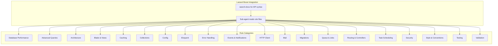

**Diagram sources**
- [.agents/skills/laravel-best-practices/SKILL.md](file://.agents/skills/laravel-best-practices/SKILL.md)

## Detailed Component Analysis

### Database Performance
Focuses on preventing N+1 queries, optimizing queries, indexing strategies, and memory-efficient iteration. Key recommendations include eager loading, selective column retrieval, chunking large datasets, adding appropriate indexes, using withCount for relation counts, cursor-based iteration for read-only workloads, and avoiding queries in Blade templates.

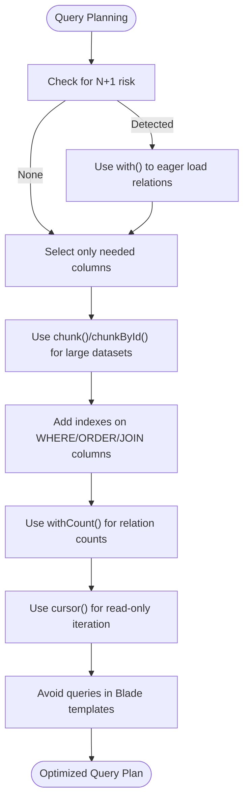

**Diagram sources**
- [.agents/skills/laravel-best-practices/rules/db-performance.md](file://.agents/skills/laravel-best-practices/rules/db-performance.md)

**Section sources**
- [.agents/skills/laravel-best-practices/rules/db-performance.md](file://.agents/skills/laravel-best-practices/rules/db-performance.md)

### Advanced Query Patterns
Teaches sophisticated query techniques such as subqueries with addSelect, dynamic relationships via subquery foreign keys, conditional aggregates using selectRaw, preventing circular N+1 with setRelation, optimized filtering with whereIn + pluck, compound indexes, and correlated subqueries in orderBy for has-many sorting.

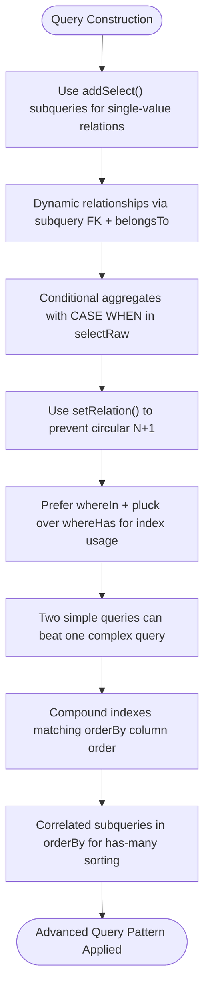

**Diagram sources**
- [.agents/skills/laravel-best-practices/rules/advanced-queries.md](file://.agents/skills/laravel-best-practices/rules/advanced-queries.md)

**Section sources**
- [.agents/skills/laravel-best-practices/rules/advanced-queries.md](file://.agents/skills/laravel-best-practices/rules/advanced-queries.md)

### Security
Emphasizes mass assignment protection via fillable/guarded, authorization using policies/gates, prevention of SQL injection through parameter binding, output escaping to prevent XSS, CSRF protection in forms, throttling for auth/API routes, validating file uploads, secure secret management via config(), and encrypting sensitive database fields.

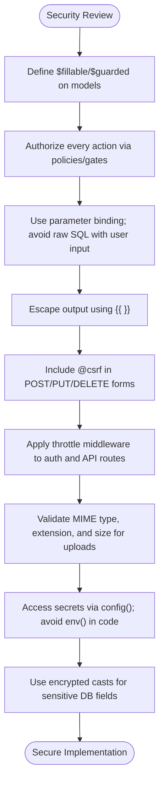

**Diagram sources**
- [.agents/skills/laravel-best-practices/rules/security.md](file://.agents/skills/laravel-best-practices/rules/security.md)

**Section sources**
- [.agents/skills/laravel-best-practices/rules/security.md](file://.agents/skills/laravel-best-practices/rules/security.md)

### Caching Strategies
Highlights using Cache::remember() over manual get/put, stale-while-revalidate with Cache::flexible(), per-request memoization with Cache::memo(), cache tags for group invalidation, atomic conditional writes with Cache::add(), per-request memoization with once(), and failover cache stores in production.

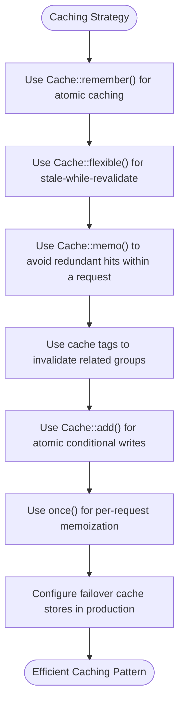

**Diagram sources**
- [.agents/skills/laravel-best-practices/rules/caching.md](file://.agents/skills/laravel-best-practices/rules/caching.md)

**Section sources**
- [.agents/skills/laravel-best-practices/rules/caching.md](file://.agents/skills/laravel-best-practices/rules/caching.md)

### Eloquent Patterns
Covers correct relationship types with return type hints, extracting reusable query constraints via local scopes, sparing use of global scopes, attribute casting in casts(), proper date casting with Carbon, using whereBelongsTo() for cleaner relationship queries, and avoiding hardcoded table names in favor of model table references.

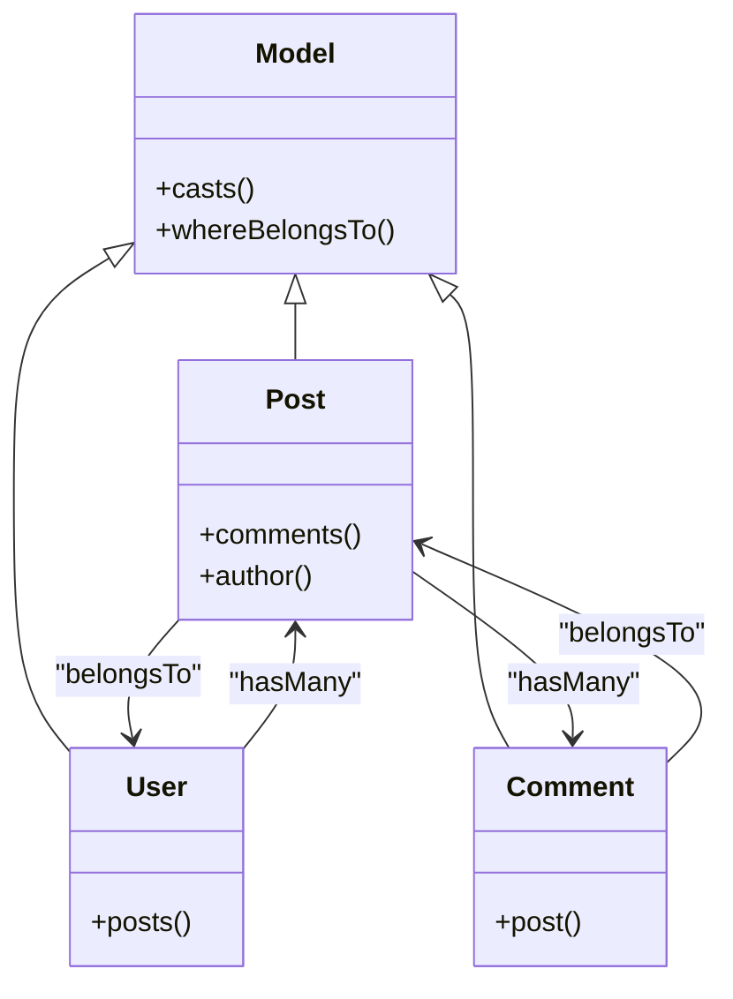

**Diagram sources**
- [.agents/skills/laravel-best-practices/rules/eloquent.md](file://.agents/skills/laravel-best-practices/rules/eloquent.md)

**Section sources**
- [.agents/skills/laravel-best-practices/rules/eloquent.md](file://.agents/skills/laravel-best-practices/rules/eloquent.md)

### Validation & Forms
Recommends using Form Request classes, preferring array notation for rules with Rule:: objects, always using validated() data, conditional validation with Rule::when(), and using after() for custom validation logic depending on multiple fields.

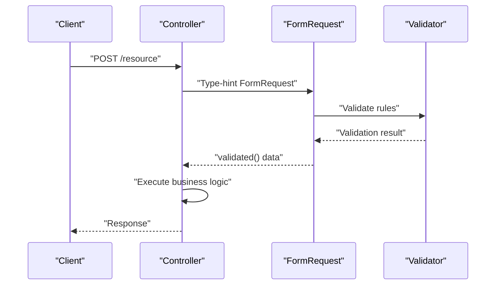

**Diagram sources**
- [.agents/skills/laravel-best-practices/rules/validation.md](file://.agents/skills/laravel-best-practices/rules/validation.md)

**Section sources**
- [.agents/skills/laravel-best-practices/rules/validation.md](file://.agents/skills/laravel-best-practices/rules/validation.md)

### Configuration Management
Advocates for env() only inside config files, using App::environment() or app()->isProduction(), and organizing configuration, language files, and constants over hardcoded text to improve maintainability and portability.

**Section sources**
- [.agents/skills/laravel-best-practices/rules/config.md](file://.agents/skills/laravel-best-practices/rules/config.md)

### Testing Patterns
Promotes LazilyRefreshDatabase over RefreshDatabase for speed, assertModelExists() over raw database assertions, factory states and sequences, using fakes (Event::fake(), Exceptions::fake()) after factory setup, and recycle() to share relationship instances across factories.

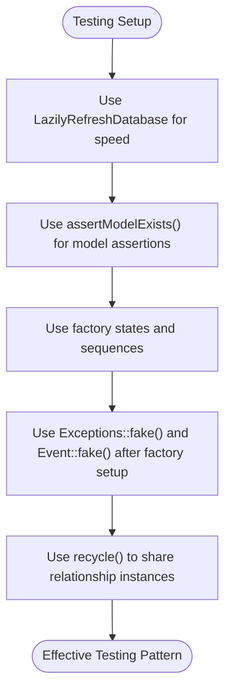

**Diagram sources**
- [.agents/skills/laravel-best-practices/rules/testing.md](file://.agents/skills/laravel-best-practices/rules/testing.md)

**Section sources**
- [.agents/skills/laravel-best-practices/rules/testing.md](file://.agents/skills/laravel-best-practices/rules/testing.md)

### Queue & Job Configurations
Ensures retry_after exceeds job timeout, uses exponential backoff, implements ShouldBeUnique to prevent duplicates, always implements failed(), applies RateLimited middleware for external API calls, batches related jobs with Bus::batch(), uses retryUntil() with $tries = 0, uses WithoutOverlapping::untilProcessing(), and leverages Horizon for complex scenarios.

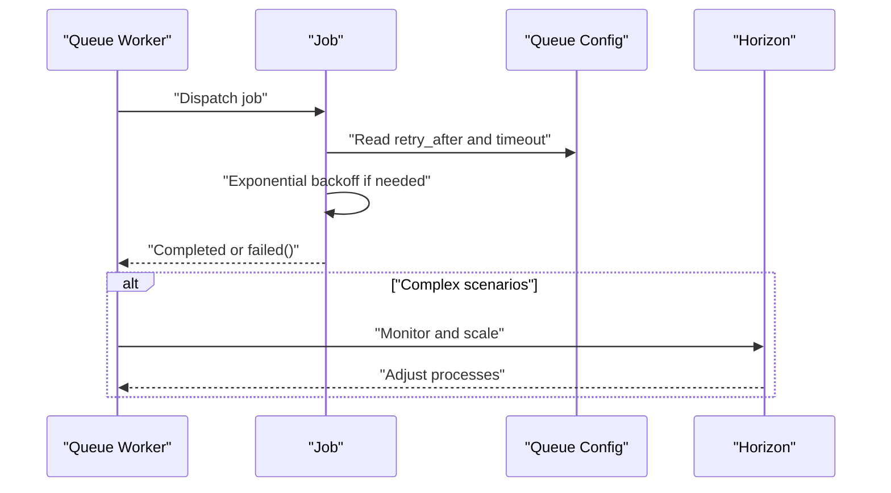

**Diagram sources**
- [.agents/skills/laravel-best-practices/rules/queue-jobs.md](file://.agents/skills/laravel-best-practices/rules/queue-jobs.md)
- [config/queue.php](file://config/queue.php)

**Section sources**
- [.agents/skills/laravel-best-practices/rules/queue-jobs.md](file://.agents/skills/laravel-best-practices/rules/queue-jobs.md)
- [config/queue.php](file://config/queue.php)

### Routing & Controllers
Encourages implicit route model binding, scoped bindings for nested resources, resource controllers, keeping controller methods thin by extracting logic to action/service classes, and type-hinting Form Requests to trigger auto-validation.

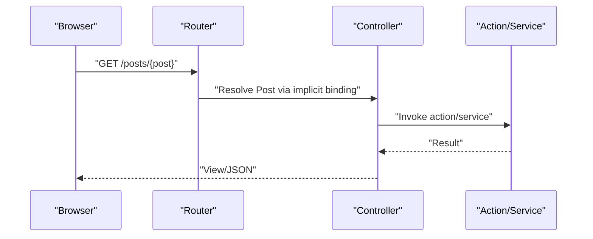

**Diagram sources**
- [.agents/skills/laravel-best-practices/rules/routing.md](file://.agents/skills/laravel-best-practices/rules/routing.md)
- [routes/web.php](file://routes/web.php)

**Section sources**
- [.agents/skills/laravel-best-practices/rules/routing.md](file://.agents/skills/laravel-best-practices/rules/routing.md)
- [routes/web.php](file://routes/web.php)

### HTTP Client Usage
Stresses explicit timeouts and connectTimeout, retry with exponential backoff for external APIs, explicit error handling with throw() or status checks, request pooling for concurrent independent requests, and faking HTTP calls in tests with preventStrayRequests().

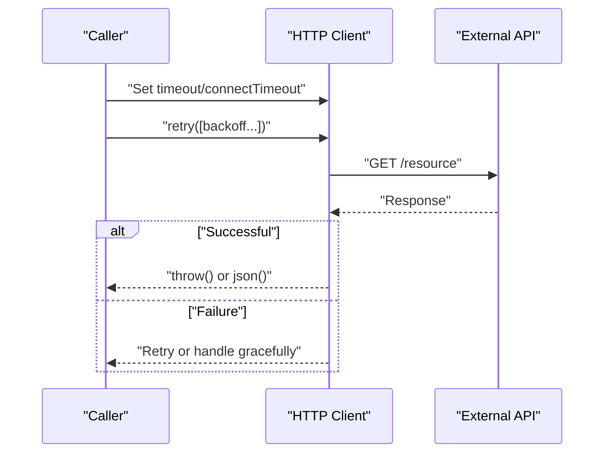

**Diagram sources**
- [.agents/skills/laravel-best-practices/rules/http-client.md](file://.agents/skills/laravel-best-practices/rules/http-client.md)

**Section sources**
- [.agents/skills/laravel-best-practices/rules/http-client.md](file://.agents/skills/laravel-best-practices/rules/http-client.md)

### Events, Notifications & Mail
Promotes event discovery over manual registration, running event:cache in production, using ShouldDispatchAfterCommit inside transactions, queuing notifications and mailables with ShouldQueue, on-demand notifications for non-user recipients, implementing HasLocalePreference on notifiable models, asserting queued notifications, and using markdown mailables for transactional emails.

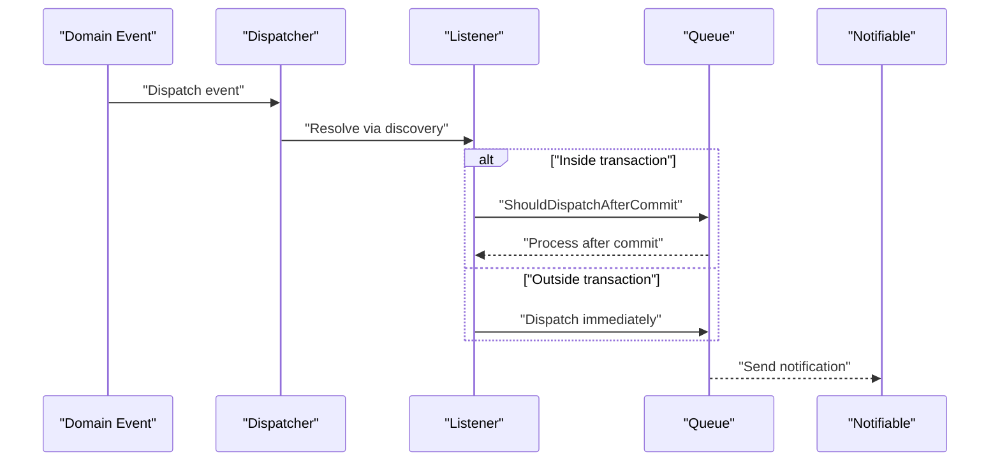

**Diagram sources**
- [.agents/skills/laravel-best-practices/rules/events-notifications.md](file://.agents/skills/laravel-best-practices/rules/events-notifications.md)
- [config/mail.php](file://config/mail.php)

**Section sources**
- [.agents/skills/laravel-best-practices/rules/events-notifications.md](file://.agents/skills/laravel-best-practices/rules/events-notifications.md)
- [config/mail.php](file://config/mail.php)

### Error Handling
Provides two consistent approaches for exception reporting and rendering: co-locating behavior on the exception class or centralizing in bootstrap/app.php. Recommends using ShouldntReport for exceptions that should never log, throttling high-volume exceptions, enabling dontReportDuplicates(), forcing JSON error rendering for API routes, and adding context to exception classes.

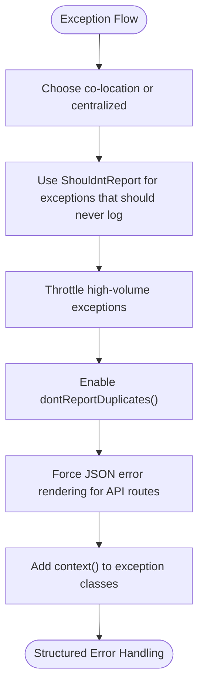

**Diagram sources**
- [.agents/skills/laravel-best-practices/rules/error-handling.md](file://.agents/skills/laravel-best-practices/rules/error-handling.md)
- [bootstrap/app.php](file://bootstrap/app.php)

**Section sources**
- [.agents/skills/laravel-best-practices/rules/error-handling.md](file://.agents/skills/laravel-best-practices/rules/error-handling.md)
- [bootstrap/app.php](file://bootstrap/app.php)

### Task Scheduling
Recommends withoutOverlapping() on variable-duration tasks, onOneServer() on multi-server deployments, runInBackground() for concurrent long tasks, environments() to restrict environments, takeUntilTimeout() for time-bounded processing, and schedule groups for shared configuration.

**Section sources**
- [.agents/skills/laravel-best-practices/rules/scheduling.md](file://.agents/skills/laravel-best-practices/rules/scheduling.md)
- [routes/console.php](file://routes/console.php)

### Architectural Decisions
Encourages single-purpose Action classes, dependency injection over app() helper, coding to interfaces at system boundaries, default sorting by descending (id or created_at), using atomic locks for race conditions, mb_* string functions for UTF-8 safety, defer() for post-response work, Context for request-scoped data, Concurrency::run() for parallel execution, and following Laravel conventions over configuration.

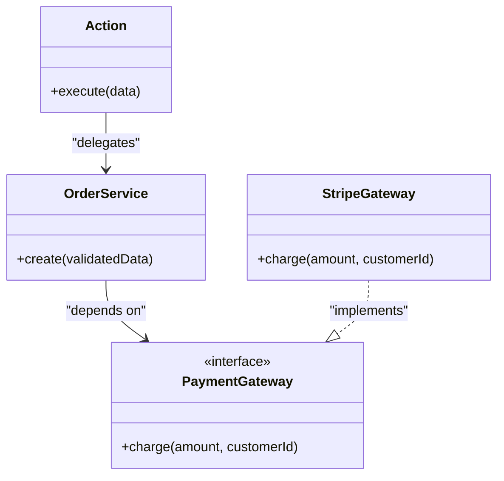

**Diagram sources**
- [.agents/skills/laravel-best-practices/rules/architecture.md](file://.agents/skills/laravel-best-practices/rules/architecture.md)

**Section sources**
- [.agents/skills/laravel-best-practices/rules/architecture.md](file://.agents/skills/laravel-best-practices/rules/architecture.md)

### Migration Practices
Advocates generating migrations with Artisan, using constrained() for foreign keys, never modifying deployed migrations, adding indexes in the migration, mirroring defaults in model attributes, writing reversible down() methods by default, and keeping migrations focused (one concern per migration).

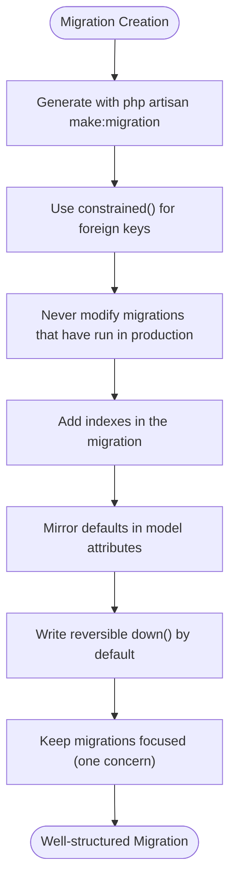

**Diagram sources**
- [.agents/skills/laravel-best-practices/rules/migrations.md](file://.agents/skills/laravel-best-practices/rules/migrations.md)

**Section sources**
- [.agents/skills/laravel-best-practices/rules/migrations.md](file://.agents/skills/laravel-best-practices/rules/migrations.md)

### Collections Usage
Recommends higher-order messages for simple operations, choosing cursor() vs lazy() based on relationship needs, using lazyById() when updating records while iterating, and converting collections to queries for bulk operations.

**Section sources**
- [.agents/skills/laravel-best-practices/rules/collections.md](file://.agents/skills/laravel-best-practices/rules/collections.md)

### Blade & Views
Suggests using $attributes->merge() in component templates, preferring Blade components over @include, using View Composers for shared view data, and employing @aware for deeply nested component props.

**Section sources**
- [.agents/skills/laravel-best-practices/rules/blade-views.md](file://.agents/skills/laravel-best-practices/rules/blade-views.md)
- [resources/views/welcome.blade.php](file://resources/views/welcome.blade.php)

### Coding Conventions
Upholds Laravel naming conventions, prefers Laravel helpers (Str, Arr, Number, Uri, Str::of(), $request->string()), avoids mixing JS/CSS in Blade or HTML in PHP classes, and maintains readability with comments reserved for configuration.

**Section sources**
- [.agents/skills/laravel-best-practices/rules/style.md](file://.agents/skills/laravel-best-practices/rules/style.md)

## Dependency Analysis
The skill interacts with Laravel’s core services and configuration files. It references configuration files for queue, cache, logging, mail, services, database, app, auth, session, filesystems, and AI-related settings. It also integrates with testing frameworks and HTTP client facilities.

```mermaid
graph TB
Skill["Laravel Best Practices Skill"] --> QueueCfg["config/queue.php"]
Skill --> CacheCfg["config/cache.php"]
Skill --> LogCfg["config/logging.php"]
Skill --> MailCfg["config/mail.php"]
Skill --> ServicesCfg["config/services.php"]
Skill --> DB["config/database.php"]
Skill --> AppCfg["config/app.php"]
Skill --> AuthCfg["config/auth.php"]
Skill --> SessionCfg["config/session.php"]
Skill --> FS["config/filesystems.php"]
Skill --> AI["config/ai.php"]
Skill --> Composer["composer.json"]
Skill --> PHPUnit["phpunit.xml"]
Skill --> Vite["vite.config.js"]
Skill --> Views["storage/framework/views"]
Skill --> WebRoutes["routes/web.php"]
Skill --> ConsoleRoutes["routes/console.php"]
Skill --> AppProvider["app/Providers/AppServiceProvider.php"]
Skill --> BootstrapApp["bootstrap/app.php"]
Skill --> Models["app/Models/User.php"]
Skill --> Controllers["app/Http/Controllers/Controller.php"]
Skill --> Tests["tests/TestCase.php"]
Skill --> FeatureTests["tests/Feature/ExampleTest.php"]
Skill --> UserFactory["database/factories/UserFactory.php"]
Skill --> Migrations["database/migrations/*.php"]
```

**Diagram sources**
- [.agents/skills/laravel-best-practices/SKILL.md](file://.agents/skills/laravel-best-practices/SKILL.md)
- [config/queue.php](file://config/queue.php)
- [config/cache.php](file://config/cache.php)
- [config/logging.php](file://config/logging.php)
- [config/mail.php](file://config/mail.php)
- [config/services.php](file://config/services.php)
- [config/database.php](file://config/database.php)
- [config/app.php](file://config/app.php)
- [config/auth.php](file://config/auth.php)
- [config/session.php](file://config/session.php)
- [config/filesystems.php](file://config/filesystems.php)
- [config/ai.php](file://config/ai.php)
- [composer.json](file://composer.json)
- [phpunit.xml](file://phpunit.xml)
- [vite.config.js](file://vite.config.js)
- [storage/framework/views](file://storage/framework/views)
- [routes/web.php](file://routes/web.php)
- [routes/console.php](file://routes/console.php)
- [app/Providers/AppServiceProvider.php](file://app/Providers/AppServiceProvider.php)
- [bootstrap/app.php](file://bootstrap/app.php)
- [app/Models/User.php](file://app/Models/User.php)
- [app/Http/Controllers/Controller.php](file://app/Http/Controllers/Controller.php)
- [tests/TestCase.php](file://tests/TestCase.php)
- [tests/Feature/ExampleTest.php](file://tests/Feature/ExampleTest.php)
- [database/factories/UserFactory.php](file://database/factories/UserFactory.php)
- [database/migrations/0001_01_01_000000_create_users_table.php](file://database/migrations/0001_01_01_000000_create_users_table.php)
- [database/migrations/0001_01_01_000002_create_jobs_table.php](file://database/migrations/0001_01_01_000002_create_jobs_table.php)
- [database/migrations/2026_04_02_115916_create_agent_conversations_table.php](file://database/migrations/2026_04_02_115916_create_agent_conversations_table.php)

**Section sources**
- [.agents/skills/laravel-best-practices/SKILL.md](file://.agents/skills/laravel-best-practices/SKILL.md)

## Performance Considerations
- Database Performance: Eager loading, selective column retrieval, chunking, indexing, withCount, cursor iteration, and avoiding queries in Blade templates.
- Caching: Atomic remember patterns, stale-while-revalidate, per-request memoization, cache tags, atomic conditional writes, and failover stores.
- Queue: Proper retry_after vs timeout alignment, exponential backoff, unique job constraints, failed() handling, rate limiting, batching, and Horizon for scaling.
- HTTP Client: Explicit timeouts, retry with backoff, explicit error handling, request pooling, and test faking.
- Architecture: Single-purpose actions, dependency injection, interface coding, default descending sorts, atomic locks, mb_* functions, defer() for post-response work, Context propagation, Concurrency::run(), and convention over configuration.

[No sources needed since this section provides general guidance]

## Troubleshooting Guide
Common issues and resolutions:
- N+1 Queries: Use with() to eager load relations and constrain selections to include foreign keys.
- Lazy Loading Violations: Enable Model::preventLazyLoading() in development via AppServiceProvider::boot().
- Slow Tests: Use LazilyRefreshDatabase over RefreshDatabase to reduce migration overhead.
- Queue Race Conditions: Use ShouldBeUnique and WithoutOverlapping::untilProcessing(); ensure retry_after > timeout.
- External API Failures: Use retry() with exponential backoff and explicit error handling via throw().
- Event/Notification Timing: Use ShouldDispatchAfterCommit inside transactions and queue notifications with ShouldQueue.
- Logging Noise: Throttle high-volume exceptions and enable dontReportDuplicates().
- Migration Conflicts: Never modify deployed migrations; create new migrations for schema changes.

**Section sources**
- [.agents/skills/laravel-best-practices/rules/db-performance.md](file://.agents/skills/laravel-best-practices/rules/db-performance.md)
- [.agents/skills/laravel-best-practices/rules/testing.md](file://.agents/skills/laravel-best-practices/rules/testing.md)
- [.agents/skills/laravel-best-practices/rules/queue-jobs.md](file://.agents/skills/laravel-best-practices/rules/queue-jobs.md)
- [.agents/skills/laravel-best-practices/rules/http-client.md](file://.agents/skills/laravel-best-practices/rules/http-client.md)
- [.agents/skills/laravel-best-practices/rules/events-notifications.md](file://.agents/skills/laravel-best-practices/rules/events-notifications.md)
- [.agents/skills/laravel-best-practices/rules/error-handling.md](file://.agents/skills/laravel-best-practices/rules/error-handling.md)
- [.agents/skills/laravel-best-practices/rules/migrations.md](file://.agents/skills/laravel-best-practices/rules/migrations.md)

## Conclusion
The Laravel Best Practices skill delivers a comprehensive, priority-ordered, consistency-first guidance system for Laravel development. By aligning recommendations with existing codebase patterns and covering critical domains—from database performance and security to caching, testing, queues, routing, HTTP clients, events/notifications/mail, error handling, scheduling, architecture, migrations, collections, Blade/views, and conventions—it helps teams write robust, maintainable, and performant Laravel applications. Integrating with Laravel Boost enables seamless activation of contextual advice tailored to the file types and scenarios encountered during development.

[No sources needed since this section summarizes without analyzing specific files]

## Appendices
- Practical Examples:
  - Skill Activation: Use a sub-agent to read rule files and explore the skill’s content for context-aware recommendations.
  - Rule Selection Criteria: Identify the file type (e.g., migration → migrations, controller → routing, security → security) and select relevant sections.
  - Consistency-First Application: Check sibling files and related components for established patterns and follow them first.
  - Integration with Laravel Boost: Leverage search-docs for exact API syntax and integrate with Laravel Boost’s sub-agent infrastructure.

**Section sources**
- [.agents/skills/laravel-best-practices/SKILL.md](file://.agents/skills/laravel-best-practices/SKILL.md)