# Pest Testing Skill

<cite>
**Referenced Files in This Document**
- [SKILL.md](file://.agents/skills/pest-testing/SKILL.md)
- [Pest.php](file://tests/Pest.php)
- [TestCase.php](file://tests/TestCase.php)
- [composer.json](file://composer.json)
- [phpunit.xml](file://phpunit.xml)
- [ExampleTest.php (Feature)](file://tests/Feature/ExampleTest.php)
- [ExampleTest.php (Unit)](file://tests/Unit/ExampleTest.php)
- [UserFactory.php](file://database/factories/UserFactory.php)
- [User.php](file://app/Models/User.php)
- [testing.md](file://.agents/skills/laravel-best-practices/rules/testing.md)
</cite>

## Table of Contents
1. [Introduction](#introduction)
2. [Project Structure](#project-structure)
3. [Core Components](#core-components)
4. [Architecture Overview](#architecture-overview)
5. [Detailed Component Analysis](#detailed-component-analysis)
6. [Dependency Analysis](#dependency-analysis)
7. [Performance Considerations](#performance-considerations)
8. [Troubleshooting Guide](#troubleshooting-guide)
9. [Conclusion](#conclusion)

## Introduction
This document explains the Pest Testing skill for Laravel projects. It focuses on how the skill provides specialized AI assistance for PHP testing using the Pest framework, covering expressive syntax, test organization, assertion methods, mocking strategies, datasets, browser and smoke testing, architecture tests, and integration with Laravel’s testing infrastructure. It also outlines practical workflows for test creation and execution, and how the skill supports test-driven development within Laravel applications.

## Project Structure
The repository includes:
- Pest configuration and shared test setup in tests/Pest.php
- Base test case in tests/TestCase.php
- Feature and Unit test examples under tests/Feature and tests/Unit
- Pest and Laravel plugin dependencies declared in composer.json
- PHPUnit configuration for test suites and environment in phpunit.xml
- Eloquent model and factory definitions that integrate with Laravel’s testing ecosystem

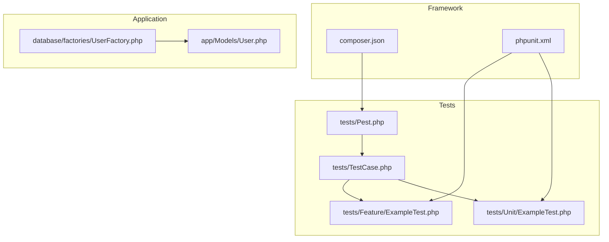

**Diagram sources**
- [Pest.php:1-50](file://tests/Pest.php#L1-L50)
- [TestCase.php:1-11](file://tests/TestCase.php#L1-L11)
- [ExampleTest.php (Feature):1-8](file://tests/Feature/ExampleTest.php#L1-L8)
- [ExampleTest.php (Unit):1-6](file://tests/Unit/ExampleTest.php#L1-L6)
- [composer.json:17-26](file://composer.json#L17-L26)
- [phpunit.xml:1-36](file://phpunit.xml#L1-L36)
- [UserFactory.php:1-46](file://database/factories/UserFactory.php#L1-L46)
- [User.php:1-33](file://app/Models/User.php#L1-L33)

**Section sources**
- [Pest.php:1-50](file://tests/Pest.php#L1-L50)
- [TestCase.php:1-11](file://tests/TestCase.php#L1-L11)
- [composer.json:17-26](file://composer.json#L17-L26)
- [phpunit.xml:1-36](file://phpunit.xml#L1-L36)
- [ExampleTest.php (Feature):1-8](file://tests/Feature/ExampleTest.php#L1-L8)
- [ExampleTest.php (Unit):1-6](file://tests/Unit/ExampleTest.php#L1-L6)
- [UserFactory.php:1-46](file://database/factories/UserFactory.php#L1-L46)
- [User.php:1-33](file://app/Models/User.php#L1-L33)

## Core Components
- Pest configuration and expectations: tests/Pest.php sets up Pest extension and expectation extensions for shared behaviors.
- Base test case: tests/TestCase.php extends Laravel’s base test case to provide common testing utilities.
- Test suites: phpunit.xml defines Unit and Feature test suites and environment variables for testing.
- Pest skill documentation: .agents/skills/pest-testing/SKILL.md documents Pest 4 features, browser testing, smoke testing, architecture tests, datasets, and mocking.
- Application factories and models: database/factories/UserFactory.php and app/Models/User.php integrate with Laravel’s testing ecosystem via factories and model attributes.

Key capabilities enabled by the skill:
- Expressive syntax with it()/expect() and test() blocks
- Feature and unit test organization
- Browser and smoke testing with visit/click/fill
- Architecture tests with arch()
- Datasets for repetitive validations
- Mocking with Pest Laravel plugin
- Integration with Laravel’s RefreshDatabase and model factories

**Section sources**
- [Pest.php:16-33](file://tests/Pest.php#L16-L33)
- [TestCase.php:7-10](file://tests/TestCase.php#L7-L10)
- [SKILL.md:17-41](file://.agents/skills/pest-testing/SKILL.md#L17-L41)
- [SKILL.md:77-118](file://.agents/skills/pest-testing/SKILL.md#L77-L118)
- [SKILL.md:141-149](file://.agents/skills/pest-testing/SKILL.md#L141-L149)
- [UserFactory.php:25-44](file://database/factories/UserFactory.php#L25-L44)
- [User.php:13-31](file://app/Models/User.php#L13-L31)

## Architecture Overview
The skill orchestrates Pest-based testing within Laravel by:
- Extending the base test case with Pest configuration
- Providing expressive assertion helpers and expectation extensions
- Enabling browser and smoke testing through the Pest Laravel plugin
- Supporting architecture tests and datasets for robust coverage
- Integrating with Laravel’s factories and model attributes for realistic test data

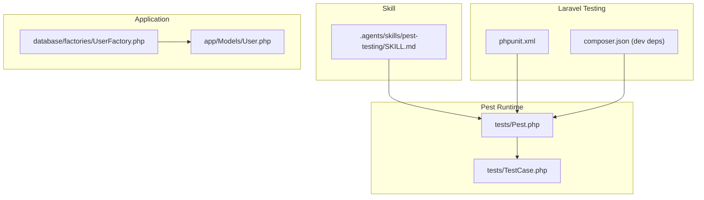

**Diagram sources**
- [SKILL.md:1-157](file://.agents/skills/pest-testing/SKILL.md#L1-L157)
- [Pest.php:16-33](file://tests/Pest.php#L16-L33)
- [TestCase.php:7-10](file://tests/TestCase.php#L7-L10)
- [phpunit.xml:7-14](file://phpunit.xml#L7-L14)
- [composer.json:24-25](file://composer.json#L24-L25)
- [UserFactory.php:25-44](file://database/factories/UserFactory.php#L25-L44)
- [User.php:13-31](file://app/Models/User.php#L13-L31)

## Detailed Component Analysis

### Pest Configuration and Expectations
- The Pest bootstrap file extends the base test case and scopes Pest to Feature tests, enabling shared behaviors and expectations.
- Expectation extensions allow concise, expressive assertions across tests.
- Global helper functions can be exposed for reusable test logic.

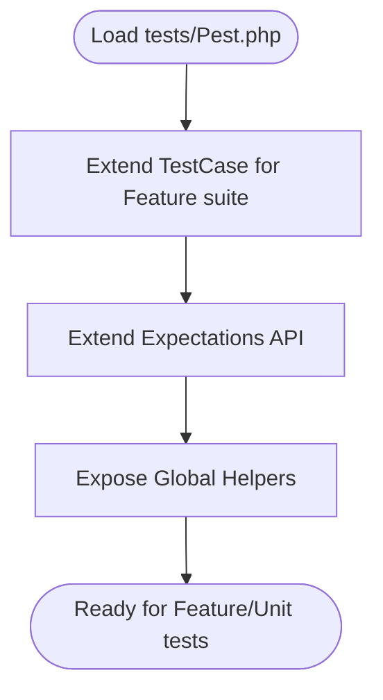

**Diagram sources**
- [Pest.php:16-33](file://tests/Pest.php#L16-L33)
- [Pest.php:31-33](file://tests/Pest.php#L31-L33)
- [Pest.php:46-49](file://tests/Pest.php#L46-L49)

**Section sources**
- [Pest.php:16-33](file://tests/Pest.php#L16-L33)
- [Pest.php:31-33](file://tests/Pest.php#L31-L33)
- [Pest.php:46-49](file://tests/Pest.php#L46-L49)

### Test Organization and Execution
- Feature and Unit tests are organized in dedicated directories.
- PHPUnit configuration defines test suites and environment variables for testing.
- The skill recommends running filtered or compact test runs for iterative development.

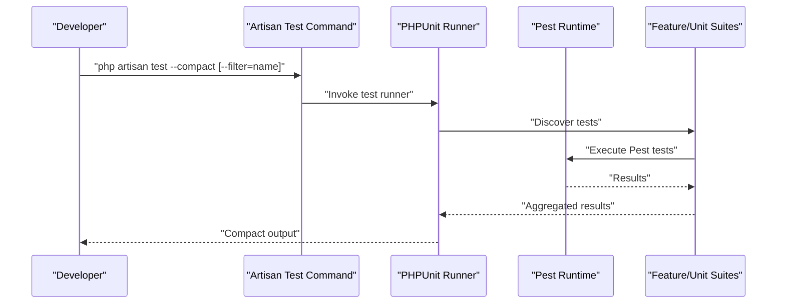

**Diagram sources**
- [SKILL.md:36-41](file://.agents/skills/pest-testing/SKILL.md#L36-L41)
- [phpunit.xml:7-14](file://phpunit.xml#L7-L14)

**Section sources**
- [SKILL.md:21-25](file://.agents/skills/pest-testing/SKILL.md#L21-L25)
- [SKILL.md:36-41](file://.agents/skills/pest-testing/SKILL.md#L36-L41)
- [phpunit.xml:7-14](file://phpunit.xml#L7-L14)

### Assertions and Expressive Syntax
- Prefer expressive assertions over generic status checks for clarity and intent.
- The skill highlights specific assertions and their preferred alternatives.

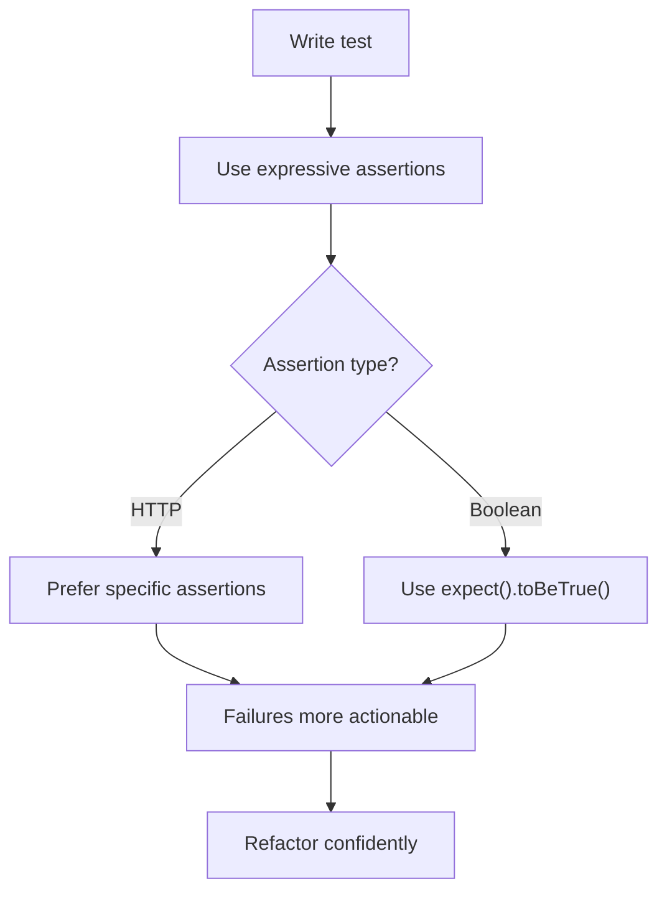

**Diagram sources**
- [SKILL.md:42-57](file://.agents/skills/pest-testing/SKILL.md#L42-L57)
- [ExampleTest.php (Unit):3-5](file://tests/Unit/ExampleTest.php#L3-L5)

**Section sources**
- [SKILL.md:42-57](file://.agents/skills/pest-testing/SKILL.md#L42-L57)
- [ExampleTest.php (Unit):3-5](file://tests/Unit/ExampleTest.php#L3-L5)

### Datasets for Repetitive Validation
- Datasets streamline repetitive validations by parameterizing tests with named sets of inputs.
- The skill demonstrates datasets for email validation and similar scenarios.

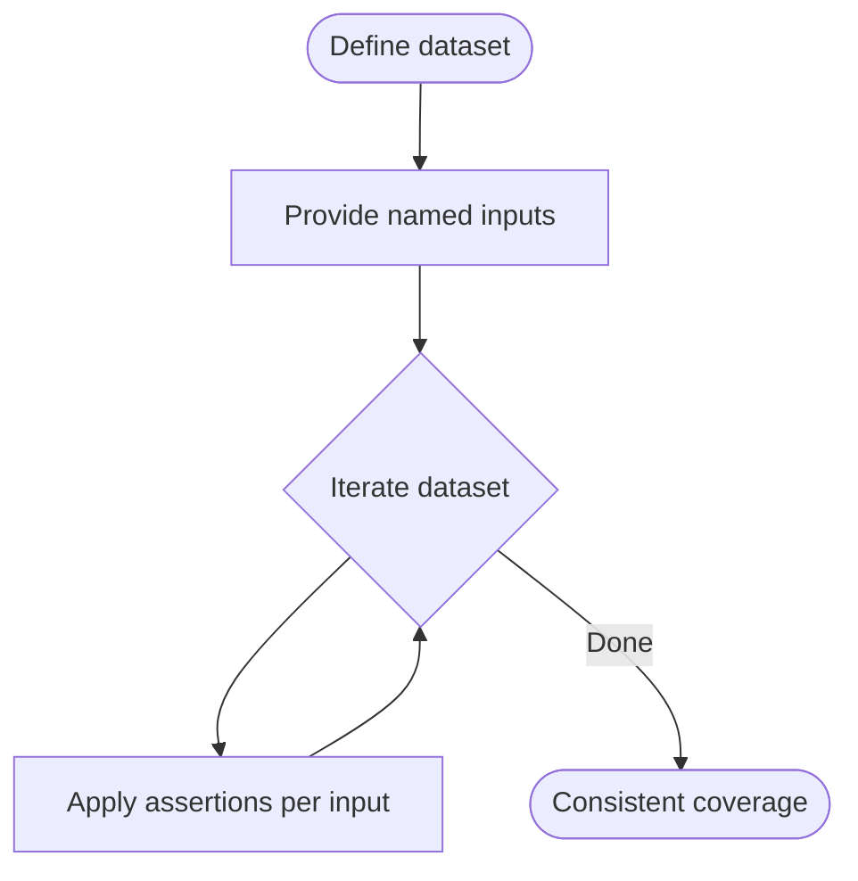

**Diagram sources**
- [SKILL.md:63-75](file://.agents/skills/pest-testing/SKILL.md#L63-L75)

**Section sources**
- [SKILL.md:63-75](file://.agents/skills/pest-testing/SKILL.md#L63-L75)

### Mocking Strategies
- Import the mock function before use to enable mocking within tests.
- The skill emphasizes correct import and usage patterns.

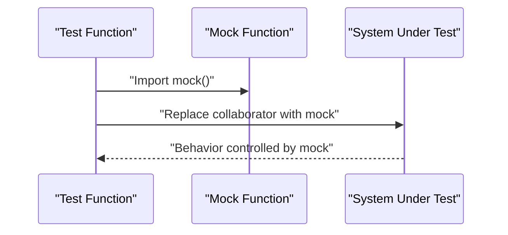

**Diagram sources**
- [SKILL.md:59-61](file://.agents/skills/pest-testing/SKILL.md#L59-L61)

**Section sources**
- [SKILL.md:59-61](file://.agents/skills/pest-testing/SKILL.md#L59-L61)

### Browser and Smoke Testing
- Browser tests run in real browsers for full integration testing.
- Smoke testing validates multiple pages for JavaScript errors quickly.
- The skill outlines interactions, viewport/device testing, and debugging aids.

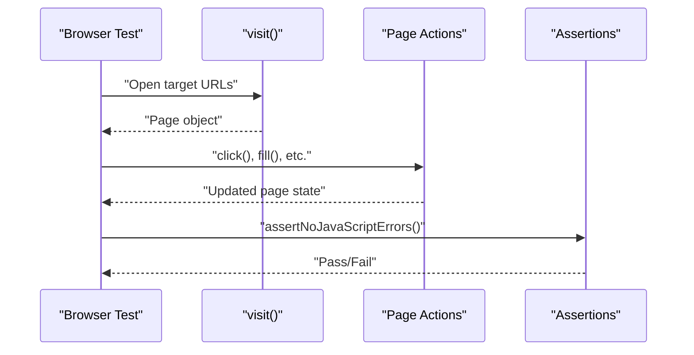

**Diagram sources**
- [SKILL.md:87-118](file://.agents/skills/pest-testing/SKILL.md#L87-L118)

**Section sources**
- [SKILL.md:87-118](file://.agents/skills/pest-testing/SKILL.md#L87-L118)

### Architecture Testing
- Architecture tests enforce code conventions and structure.
- The skill demonstrates arch() usage to validate controller patterns.

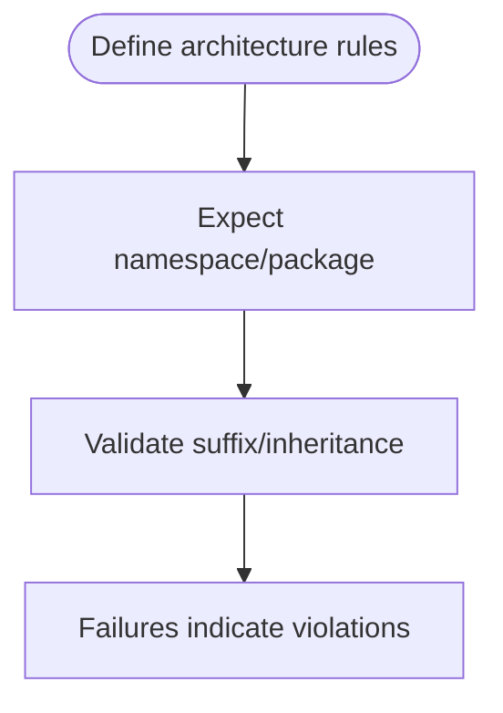

**Diagram sources**
- [SKILL.md:139-149](file://.agents/skills/pest-testing/SKILL.md#L139-L149)

**Section sources**
- [SKILL.md:139-149](file://.agents/skills/pest-testing/SKILL.md#L139-L149)

### Factory Integration and Model Attributes
- Factories define realistic default states and states for tests.
- Model attributes specify fillable and hidden fields, aligning with testing expectations.

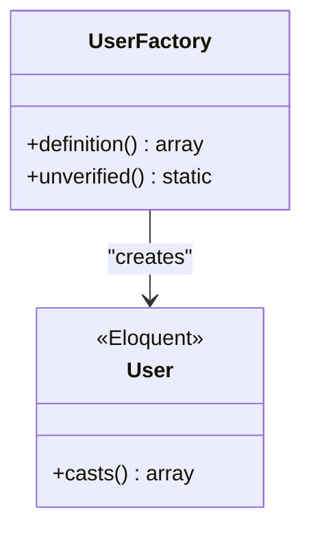

**Diagram sources**
- [UserFactory.php:25-44](file://database/factories/UserFactory.php#L25-L44)
- [User.php:13-31](file://app/Models/User.php#L13-L31)

**Section sources**
- [UserFactory.php:25-44](file://database/factories/UserFactory.php#L25-L44)
- [User.php:13-31](file://app/Models/User.php#L13-L31)

### Practical Workflows and TDD Support
- Create tests with Pest syntax using artisan generators.
- Iterate with compact runs and filtering.
- Convert PHPUnit tests to Pest using the skill’s guidance.
- Leverage datasets, mocks, and architecture tests to drive design decisions.

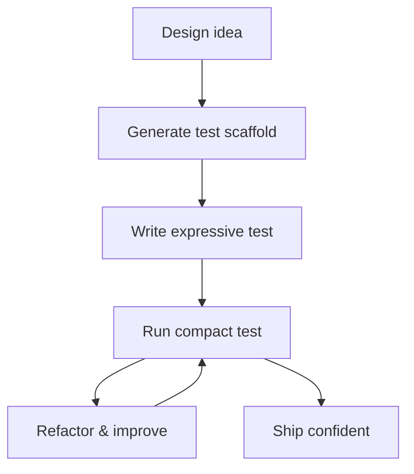

**Diagram sources**
- [SKILL.md:17-19](file://.agents/skills/pest-testing/SKILL.md#L17-L19)
- [SKILL.md:36-41](file://.agents/skills/pest-testing/SKILL.md#L36-L41)

**Section sources**
- [SKILL.md:17-19](file://.agents/skills/pest-testing/SKILL.md#L17-L19)
- [SKILL.md:36-41](file://.agents/skills/pest-testing/SKILL.md#L36-L41)

## Dependency Analysis
- Pest and Laravel plugin dependencies are declared in composer.json for testing.
- Pest runtime configuration depends on the base test case and suite scoping.
- Application factories and models provide realistic data for tests.

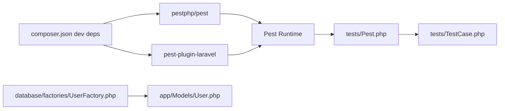

**Diagram sources**
- [composer.json:24-25](file://composer.json#L24-L25)
- [Pest.php:16-18](file://tests/Pest.php#L16-L18)
- [TestCase.php:7-10](file://tests/TestCase.php#L7-L10)
- [UserFactory.php:25-44](file://database/factories/UserFactory.php#L25-L44)
- [User.php:13-31](file://app/Models/User.php#L13-L31)

**Section sources**
- [composer.json:24-25](file://composer.json#L24-L25)
- [Pest.php:16-18](file://tests/Pest.php#L16-L18)
- [TestCase.php:7-10](file://tests/TestCase.php#L7-L10)
- [UserFactory.php:25-44](file://database/factories/UserFactory.php#L25-L44)
- [User.php:13-31](file://app/Models/User.php#L13-L31)

## Performance Considerations
- Prefer expressive assertions to reduce brittle checks and improve maintainability.
- Use datasets to minimize duplication and increase coverage efficiently.
- Follow Laravel best practices for database refresh strategies and model assertions to keep suites fast and reliable.
- Leverage compact test runs during iteration to accelerate feedback loops.

**Section sources**
- [SKILL.md:42-57](file://.agents/skills/pest-testing/SKILL.md#L42-L57)
- [SKILL.md:63-75](file://.agents/skills/pest-testing/SKILL.md#L63-L75)
- [testing.md:3-5](file://.agents/skills/laravel-best-practices/rules/testing.md#L3-L5)
- [testing.md:7-13](file://.agents/skills/laravel-best-practices/rules/testing.md#L7-L13)

## Troubleshooting Guide
Common pitfalls and remedies:
- Missing mock import: ensure the mock function is imported before use.
- Generic status assertions: prefer specific assertions for clearer failures.
- Missing datasets: use datasets for repetitive validations.
- Removing tests without approval: preserve tests as core application code.
- Browser tests missing error checks: include JavaScript error assertions.

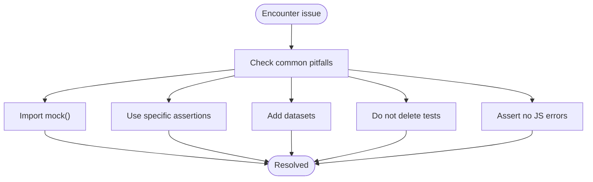

**Diagram sources**
- [SKILL.md:151-157](file://.agents/skills/pest-testing/SKILL.md#L151-L157)

**Section sources**
- [SKILL.md:151-157](file://.agents/skills/pest-testing/SKILL.md#L151-L157)

## Conclusion
The Pest Testing skill streamlines PHP testing in Laravel by providing a cohesive set of patterns and tools: expressive syntax, datasets, mocking, browser and smoke testing, architecture tests, and seamless integration with Laravel’s factories and model attributes. Combined with Laravel best practices for performance and clarity, it accelerates test-driven development and improves confidence in code changes.