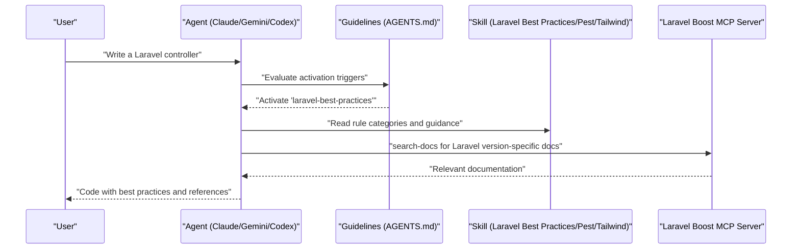
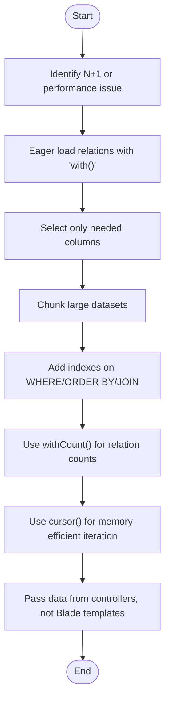
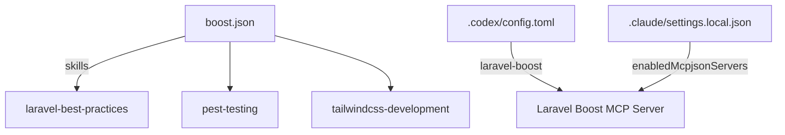

# Skill System

<cite>
**Referenced Files in This Document**
- [AGENTS.md](file://AGENTS.md)
- [CLAUDE.md](file://CLAUDE.md)
- [GEMINI.md](file://GEMINI.md)
- [boost.json](file://boost.json)
- [.codex/config.toml](file://.codex/config.toml)
- [.claude/settings.local.json](file://.claude/settings.local.json)
- [laravel-best-practices/SKILL.md](file://.agents/skills/laravel-best-practices/SKILL.md)
- [laravel-best-practices/rules/db-performance.md](file://.agents/skills/laravel-best-practices/rules/db-performance.md)
- [laravel-best-practices/rules/security.md](file://.agents/skills/laravel-best-practices/rules/security.md)
- [laravel-best-practices/rules/eloquent.md](file://.agents/skills/laravel-best-practices/rules/eloquent.md)
- [laravel-best-practices/rules/validation.md](file://.agents/skills/laravel-best-practices/rules/validation.md)
- [pest-testing/SKILL.md](file://.agents/skills/pest-testing/SKILL.md)
- [tailwindcss-development/SKILL.md](file://.agents/skills/tailwindcss-development/SKILL.md)
</cite>

## Table of Contents
1. [Introduction](#introduction)
2. [Project Structure](#project-structure)
3. [Core Components](#core-components)
4. [Architecture Overview](#architecture-overview)
5. [Detailed Component Analysis](#detailed-component-analysis)
6. [Dependency Analysis](#dependency-analysis)
7. [Performance Considerations](#performance-considerations)
8. [Troubleshooting Guide](#troubleshooting-guide)
9. [Conclusion](#conclusion)
10. [Appendices](#appendices)

## Introduction
This document describes the Skill System that powers domain-specific AI assistance within the Laravel Boost framework. It focuses on three core skills: Laravel Best Practices, Pest Testing, and Tailwind CSS Development. Each skill encapsulates a rule-based guidance system that provides context-aware recommendations and code generation tailored to specific development domains. The document explains activation triggers, configuration options, integration patterns, and practical usage scenarios. It also covers best practices, common use cases, troubleshooting approaches, customization, and how to extend or add new skills following established patterns.

## Project Structure
The Skill System is organized around three primary skill directories under the agents skills path, each containing a skill definition and a set of rule documents. The skills are enabled and orchestrated by the Laravel Boost configuration and MCP server settings.

```mermaid
graph TB
subgraph "Skills"
LBP[".agents/skills/laravel-best-practices"]
PT[".agents/skills/pest-testing"]
TW ".agents/skills/tailwindcss-development"
end
subgraph "Guidelines"
AG["AGENTS.md"]
CL["CLAUDE.md"]
GM["GEMINI.md"]
end
subgraph "Boost Configuration"
BJ["boost.json"]
CT[".codex/config.toml"]
CS[".claude/settings.local.json"]
end
LBP --> AG
PT --> AG
TW --> AG
BJ --> LBP
BJ --> PT
BJ --> TW
CT --> BJ
CS --> BJ
```

**Diagram sources**
- [AGENTS.md:24-30](file://AGENTS.md#L24-L30)
- [boost.json:11-15](file://boost.json#L11-L15)
- [.codex/config.toml:1-5](file://.codex/config.toml#L1-L5)
- [.claude/settings.local.json:1-7](file://.claude/settings.local.json#L1-L7)

**Section sources**
- [AGENTS.md:24-30](file://AGENTS.md#L24-L30)
- [boost.json:11-15](file://boost.json#L11-L15)
- [.codex/config.toml:1-5](file://.codex/config.toml#L1-L5)
- [.claude/settings.local.json:1-7](file://.claude/settings.local.json#L1-L7)

## Core Components
- Laravel Best Practices skill: Provides comprehensive guidance for Laravel backend development, covering database performance, security, Eloquent patterns, validation, routing, queues, scheduling, architecture, migrations, collections, Blade, and conventions. It organizes advice by rule categories and emphasizes consistency with existing codebases.
- Pest Testing skill: Guides creation, organization, and execution of Pest tests in Laravel projects, including basic usage, assertions, mocking, datasets, browser testing, smoke testing, visual regression, sharding, and architecture testing.
- Tailwind CSS Development skill: Focuses on styling HTML templates with Tailwind CSS v4, including CSS-first configuration, import syntax, replaced utilities, spacing, dark mode, layout patterns, and common pitfalls.

Each skill is activated based on explicit triggers described in the guidelines and integrates with the Laravel Boost MCP server for tooling and documentation search.

**Section sources**
- [laravel-best-practices/SKILL.md:1-190](file://.agents/skills/laravel-best-practices/SKILL.md#L1-L190)
- [pest-testing/SKILL.md:1-157](file://.agents/skills/pest-testing/SKILL.md#L1-L157)
- [tailwindcss-development/SKILL.md:1-119](file://.agents/skills/tailwindcss-development/SKILL.md#L1-L119)
- [AGENTS.md:24-30](file://AGENTS.md#L24-L30)

## Architecture Overview
The Skill System operates within the Laravel Boost ecosystem. Agents (Claude, Gemini, Codex) consult the guidelines to determine when to activate a skill. The skill’s rule documents provide context-aware recommendations. Tooling and documentation retrieval are performed via the Boost MCP server, which is configured through project settings.



**Diagram sources**
- [AGENTS.md:24-30](file://AGENTS.md#L24-L30)
- [laravel-best-practices/SKILL.md:184-190](file://.agents/skills/laravel-best-practices/SKILL.md#L184-L190)
- [.codex/config.toml:1-5](file://.codex/config.toml#L1-L5)

## Detailed Component Analysis

### Laravel Best Practices Skill
Purpose: Provide context-aware recommendations for Laravel backend development, emphasizing performance, security, maintainability, and consistency with existing codebases.

Activation triggers:
- Writing, reviewing, or refactoring Laravel PHP code (controllers, models, migrations, form requests, policies, jobs, scheduled commands, service classes, Eloquent queries).
- Detecting N+1 and query performance issues, caching strategies, authorization and security patterns, validation, error handling, queue/job configuration, route definitions, and architectural decisions.

Rule-based guidance system:
- Organized by categories (e.g., database performance, advanced queries, security, caching, Eloquent, validation, configuration, testing, queues, routing, HTTP client, events/notifications/mail, error handling, scheduling, architecture, migrations, collections, Blade, conventions/style).
- Each category references specific rule files that explain what to do and why, with examples and anti-patterns.
- Emphasizes consistency with existing patterns and using search-docs to verify exact API syntax for the installed Laravel version.

Integration patterns:
- Agents should identify the file type and select relevant sections before checking sibling files for existing patterns.
- Use Boost tools (e.g., search-docs, database-query, database-schema) to validate and refine suggestions.

Practical usage scenarios:
- Refactoring a controller to improve query performance by eager loading and selecting only needed columns.
- Securing a model by defining fillable attributes and enforcing authorization via policies.
- Applying Eloquent best practices such as using local scopes, correct relationship types, and proper attribute casting.

Best practices:
- Prefer existing conventions over novel patterns.
- Use sub-agent to read rule files and explore skill content.
- Verify API syntax with search-docs for the installed Laravel version.

Common use cases:
- Database performance tuning (N+1 prevention, indexing, chunking, cursor usage).
- Security hardening (mass assignment protection, output escaping, CSRF, throttling, file validation, secret management).
- Eloquent modeling (correct relationships, local/global scopes, casts, whereBelongsTo, avoiding hardcoded table names).
- Validation patterns (Form Request classes, array notation, validated data usage, Rule::when, after() method).

Troubleshooting approaches:
- If encountering lazy loading violations, enable prevention in development and refactor queries to eager load.
- If tests fail due to missing CSRF tokens or incorrect authorization, ensure forms include CSRF and policies/gates are enforced.
- If UI shows inconsistent dark mode or spacing, align with project conventions and use gap utilities and dark variants consistently.

Customization and extension:
- Extend by adding new rule categories under the skill’s rules directory and linking them in the skill definition.
- Follow the established structure: category-focused markdown files with examples and anti-patterns, linked from the skill’s quick reference.

**Section sources**
- [AGENTS.md:24-30](file://AGENTS.md#L24-L30)
- [laravel-best-practices/SKILL.md:1-190](file://.agents/skills/laravel-best-practices/SKILL.md#L1-L190)
- [laravel-best-practices/rules/db-performance.md:1-192](file://.agents/skills/laravel-best-practices/rules/db-performance.md#L1-L192)
- [laravel-best-practices/rules/security.md:1-198](file://.agents/skills/laravel-best-practices/rules/security.md#L1-L198)
- [laravel-best-practices/rules/eloquent.md:1-148](file://.agents/skills/laravel-best-practices/rules/eloquent.md#L1-L148)
- [laravel-best-practices/rules/validation.md:1-75](file://.agents/skills/laravel-best-practices/rules/validation.md#L1-L75)

#### Database Performance Guidance Flow


**Diagram sources**
- [laravel-best-practices/rules/db-performance.md:3-192](file://.agents/skills/laravel-best-practices/rules/db-performance.md#L3-L192)

### Pest Testing Skill
Purpose: Guide Pest PHP testing in Laravel projects, ensuring tests are well-structured, efficient, and aligned with Pest 4 capabilities.

Activation triggers:
- Writing, editing, fixing, or refactoring tests.
- Converting PHPUnit to Pest, adding datasets, and following TDD workflows.
- When the user asks how to write something in Pest, mentions test files or directories, or needs browser testing, smoke testing, or architecture tests.

Rule-based guidance system:
- Covers basic usage, test organization, assertions, mocking, datasets, browser testing, smoke testing, visual regression, sharding, and architecture testing.
- Emphasizes using Pest-specific features and avoiding common pitfalls.

Integration patterns:
- Use Boost tools to run tests and search documentation for Pest 4 patterns.
- Maintain test directories (Feature, Unit, Browser) and avoid deleting tests without approval.

Practical usage scenarios:
- Creating a basic Pest test with it()/expect().
- Writing dataset-driven tests for validation rules.
- Performing browser tests with visit/click/fill and asserting no JavaScript errors.
- Enforcing architecture rules with Pest arch().

Best practices:
- Use specific assertions (e.g., assertSuccessful instead of assertStatus).
- Import mock function before use.
- Leverage RefreshDatabase for clean state per test.
- Use arch() to enforce code conventions.

Common use cases:
- Unit and feature tests using Pest 4 syntax.
- Browser tests for full integration validation.
- Smoke testing to quickly validate multiple pages for JS errors.
- Visual regression testing to detect UI changes.
- Test sharding for parallel CI runs.
- Architecture testing to ensure controllers follow conventions.

Troubleshooting approaches:
- If mocks fail, ensure the mock function is imported.
- If tests rely on generic status codes, replace with specific assertions.
- If datasets are missing, add datasets for repetitive validation tests.
- If browser tests fail due to missing CSRF or authorization, ensure forms include CSRF and policies are applied.

**Section sources**
- [AGENTS.md:24-30](file://AGENTS.md#L24-L30)
- [pest-testing/SKILL.md:1-157](file://.agents/skills/pest-testing/SKILL.md#L1-L157)

### Tailwind CSS Development Skill
Purpose: Provide guidance for styling HTML templates with Tailwind CSS v4, focusing on CSS-first configuration, import syntax, replaced utilities, spacing, dark mode, and layout patterns.

Activation triggers:
- When the user’s message includes “tailwind”.
- Building responsive grid layouts, flex/grid page structures, styling UI components, adding dark mode variants, fixing spacing or typography, and working with Tailwind v3/v4.

Rule-based guidance system:
- Uses CSS-first configuration with @theme directive and @import "tailwindcss".
- Documents replaced utilities and numeric opacity values.
- Provides patterns for spacing (gap utilities), dark mode, flexbox, and grid layouts.
- Highlights common pitfalls to avoid deprecated v3 utilities and incorrect configuration.

Integration patterns:
- Align with existing Tailwind conventions in the project.
- Extract repeated patterns into components that match project conventions.
- Consider class placement, order, priority, and defaults.

Practical usage scenarios:
- Adding dark mode variants to existing components.
- Building responsive grid layouts and flexbox structures.
- Fixing spacing issues by replacing margins with gap utilities.
- Ensuring Tailwind v4 compatibility by replacing deprecated utilities.

Best practices:
- Use Tailwind CSS v4 and avoid deprecated utilities.
- Configure via @theme directive and import Tailwind with @import.
- Group elements logically and remove redundant classes.
- Support dark mode consistently across pages and components.

Common use cases:
- Styling cards, tables, navbars, pricing sections, forms, inputs, and badges.
- Implementing responsive dashboards with sidebars and mobile-toggle navigation.
- Adapting existing components to Tailwind v4 and maintaining dark mode parity.

Troubleshooting approaches:
- Replace deprecated v3 utilities with their v4 equivalents.
- Use @import "tailwindcss" instead of @tailwind directives.
- Configure via @theme directive instead of tailwind.config.js.
- Use gap utilities instead of margins for spacing between siblings.
- Add dark mode variants when the project supports dark mode.

**Section sources**
- [AGENTS.md:24-30](file://AGENTS.md#L24-L30)
- [tailwindcss-development/SKILL.md:1-119](file://.agents/skills/tailwindcss-development/SKILL.md#L1-L119)

## Dependency Analysis
The Skill System relies on the Laravel Boost configuration and MCP server settings to enable skills and provide tooling. The configuration files define which skills are active and how the MCP server is launched.



**Diagram sources**
- [boost.json:11-15](file://boost.json#L11-L15)
- [.codex/config.toml:1-5](file://.codex/config.toml#L1-L5)
- [.claude/settings.local.json:1-7](file://.claude/settings.local.json#L1-L7)

**Section sources**
- [boost.json:11-15](file://boost.json#L11-L15)
- [.codex/config.toml:1-5](file://.codex/config.toml#L1-L5)
- [.claude/settings.local.json:1-7](file://.claude/settings.local.json#L1-L7)

## Performance Considerations
- Database performance: Eager load relations, select only needed columns, chunk large datasets, add appropriate indexes, use withCount() for relation counts, and iterate with cursor() for read-only operations. Avoid queries in Blade templates.
- Testing performance: Use LazilyRefreshDatabase over RefreshDatabase for speed, leverage datasets for repetitive validations, and employ test sharding for parallel CI runs.
- Frontend bundling: If UI changes are not reflected, run the appropriate build commands as indicated in the guidelines.

[No sources needed since this section provides general guidance]

## Troubleshooting Guide
- Laravel Best Practices:
  - N+1 queries: Enable lazy loading prevention in development and refactor queries to eager load. Use chunk() or chunkById() for large datasets and cursor() for read-only iteration.
  - Security: Define fillable attributes, enforce authorization via policies/gates, escape output with Blade, include CSRF tokens, throttle auth/API routes, validate file uploads, and manage secrets via config().
  - Eloquent: Use correct relationship types with return type hints, local scopes for reusable queries, casts for type conversion, and whereBelongsTo() for relationship queries.
  - Validation: Use Form Request classes, array notation for rules, validated() data, Rule::when() for conditionals, and after() for multi-field validation logic.
- Pest Testing:
  - Common pitfalls include missing mock imports, generic status assertions, missing datasets, deleting tests without approval, and forgetting assertNoJavaScriptErrors() in browser tests.
- Tailwind CSS Development:
  - Common pitfalls include using deprecated v3 utilities, @tailwind directives instead of @import, tailwind.config.js instead of @theme, margins for spacing instead of gap utilities, and missing dark mode variants.

**Section sources**
- [laravel-best-practices/rules/db-performance.md:34-45](file://.agents/skills/laravel-best-practices/rules/db-performance.md#L34-L45)
- [laravel-best-practices/rules/security.md:141-157](file://.agents/skills/laravel-best-practices/rules/security.md#L141-L157)
- [laravel-best-practices/rules/validation.md:38-75](file://.agents/skills/laravel-best-practices/rules/validation.md#L38-L75)
- [pest-testing/SKILL.md:151-157](file://.agents/skills/pest-testing/SKILL.md#L151-L157)
- [tailwindcss-development/SKILL.md:113-119](file://.agents/skills/tailwindcss-development/SKILL.md#L113-L119)

## Conclusion
The Skill System delivers domain-specific AI assistance through three focused skills: Laravel Best Practices, Pest Testing, and Tailwind CSS Development. Each skill provides a rule-based guidance system that promotes best practices, improves performance, and ensures consistency with existing codebases. By activating the appropriate skill based on explicit triggers and integrating with the Laravel Boost MCP server, developers can receive context-aware recommendations and code generation tailored to their development needs. The system is extensible, allowing teams to customize and expand skills following the established patterns.

[No sources needed since this section summarizes without analyzing specific files]

## Appendices
- Activation commands and triggers are defined in the guidelines and mirrored across agent documentation files.
- Configuration options for enabling skills and launching the MCP server are defined in boost.json and MCP server configuration files.

**Section sources**
- [AGENTS.md:24-30](file://AGENTS.md#L24-L30)
- [boost.json:11-15](file://boost.json#L11-L15)
- [.codex/config.toml:1-5](file://.codex/config.toml#L1-L5)
- [.claude/settings.local.json:1-7](file://.claude/settings.local.json#L1-L7)