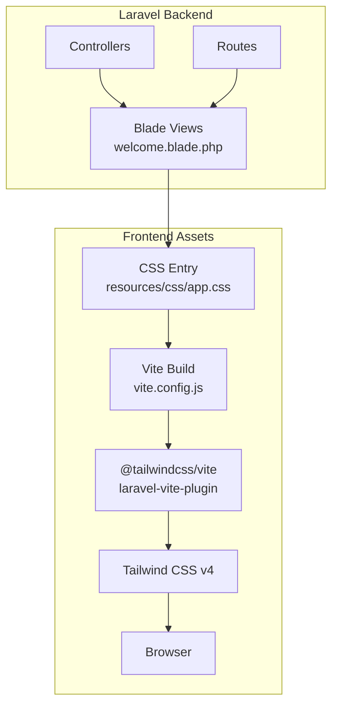
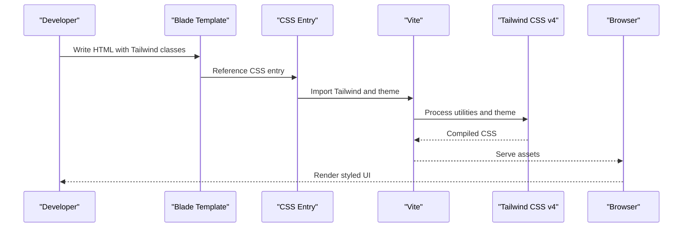
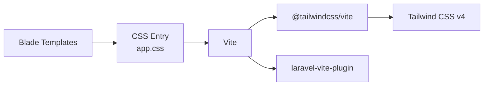

# Tailwind CSS Development Skill

<cite>
**Referenced Files in This Document**
- [SKILL.md](file://.agents/skills/tailwindcss-development/SKILL.md)
- [app.css](file://resources/css/app.css)
- [welcome.blade.php](file://resources/views/welcome.blade.php)
- [vite.config.js](file://vite.config.js)
- [package.json](file://package.json)
- [composer.json](file://composer.json)
</cite>

## Table of Contents
1. [Introduction](#introduction)
2. [Project Structure](#project-structure)
3. [Core Components](#core-components)
4. [Architecture Overview](#architecture-overview)
5. [Detailed Component Analysis](#detailed-component-analysis)
6. [Dependency Analysis](#dependency-analysis)
7. [Performance Considerations](#performance-considerations)
8. [Troubleshooting Guide](#troubleshooting-guide)
9. [Conclusion](#conclusion)

## Introduction
This document explains the Tailwind CSS Development skill and how it accelerates modern CSS development within Laravel projects using Tailwind's utility-first approach. It covers responsive design patterns, component styling strategies, dark mode implementation, and utility class combinations enabled by Tailwind CSS v4. It also documents configuration via the CSS-first `@theme` directive, integration with Laravel's Blade templating system, asset pipeline integration with Vite, and performance optimization techniques. The goal is to help developers build consistent, maintainable UIs that align with Laravel's backend architecture.

## Project Structure
The project integrates Tailwind CSS v4 with Laravel through a streamlined asset pipeline:
- Tailwind CSS is imported via a standard CSS `@import` directive
- Configuration is handled with the CSS-first `@theme` directive
- Blade templates receive Tailwind utility classes for layout, components, and dark mode
- Vite compiles assets with the Tailwind plugin and Laravel plugin

**Diagram sources**
- [app.css:1-11](file://resources/css/app.css#L1-L11)
- [vite.config.js:1-19](file://vite.config.js#L1-L19)
- [package.json:1-18](file://package.json#L1-L18)
- [welcome.blade.php:22-22](file://resources/views/welcome.blade.php#L22-L22)

**Section sources**
- [app.css:1-11](file://resources/css/app.css#L1-L11)
- [vite.config.js:1-19](file://vite.config.js#L1-L19)
- [package.json:1-18](file://package.json#L1-L18)

## Core Components
- Tailwind CSS v4 configuration via `@theme` directive in CSS entry
- Blade templates applying utility classes for layout, components, and dark mode
- Vite build pipeline with Tailwind plugin and Laravel plugin
- Package management for Tailwind and related tooling

Key capabilities:
- CSS-first configuration eliminates the need for a separate `tailwind.config.js`
- Dark mode variants (`dark:`) enable automatic light/dark adaptation
- Utility-first classes enable rapid prototyping and consistent component styling
- Gap utilities replace margins for sibling spacing, simplifying layouts

**Section sources**
- [SKILL.md:21-88](file://.agents/skills/tailwindcss-development/SKILL.md#L21-L88)
- [app.css:8-11](file://resources/css/app.css#L8-L11)
- [welcome.blade.php:22-22](file://resources/views/welcome.blade.php#L22-L22)

## Architecture Overview
The Tailwind CSS Development skill orchestrates a cohesive frontend pipeline:
- Blade templates render semantic HTML with Tailwind utility classes
- CSS entry imports Tailwind and defines theme tokens
- Vite processes CSS and JS, enabling hot module replacement and optimized builds
- Tailwind generates utility classes from the configured theme

**Diagram sources**
- [welcome.blade.php:22-22](file://resources/views/welcome.blade.php#L22-L22)
- [app.css:1-11](file://resources/css/app.css#L1-L11)
- [vite.config.js:1-19](file://vite.config.js#L1-L19)

## Detailed Component Analysis

### Responsive Design Patterns
Tailwind's breakpoint utilities enable adaptive layouts:
- Use container utilities and responsive prefixes to scale layouts across devices
- Combine flexbox and grid utilities with responsive modifiers for complex structures
- Prefer gap utilities over margins for consistent spacing between siblings

Practical patterns:
- Flex layouts with centered alignment and responsive gaps
- Grid layouts with column counts that change at breakpoints
- Aspect ratios and sizing utilities for media containers

**Section sources**
- [SKILL.md:102-111](file://.agents/skills/tailwindcss-development/SKILL.md#L102-L111)
- [welcome.blade.php:53-54](file://resources/views/welcome.blade.php#L53-L54)

### Component Styling Strategies
Components are built using utility-first approaches:
- Base styles via background, border, padding, and shadow utilities
- Typography using font size, line height, and tracking utilities
- Interactive states with hover, focus, and active variants
- Motion utilities for transitions and starting styles

Example patterns:
- Cards with rounded corners, shadows, and controlled paddings
- Navigation items with hover effects and dark mode variants
- Lists with pseudo-elements for decorative elements

**Section sources**
- [SKILL.md:90-111](file://.agents/skills/tailwindcss-development/SKILL.md#L90-L111)
- [welcome.blade.php:53-120](file://resources/views/welcome.blade.php#L53-L120)

### Dark Mode Implementation
Dark mode is implemented using the `dark:` variant:
- Body-level dark mode classes switch color schemes
- Component variants adapt borders, backgrounds, and text colors
- SVG and blend modes adjust for dark backgrounds

Integration patterns:
- Apply dark mode classes on body or wrapper elements
- Use dark variants for interactive states and borders
- Adjust icons and strokes for visibility in dark contexts

**Section sources**
- [SKILL.md:79-88](file://.agents/skills/tailwindcss-development/SKILL.md#L79-L88)
- [welcome.blade.php:22-22](file://resources/views/welcome.blade.php#L22-L22)
- [welcome.blade.php:154-216](file://resources/views/welcome.blade.php#L154-L216)

### Utility Class Combinations
Common combinations include:
- Flex utilities for alignment and spacing
- Grid utilities for multi-column layouts
- Gap utilities for sibling spacing
- Shadow and border utilities for depth and separation
- Transition utilities for smooth interactions

These combinations enable rapid iteration while maintaining consistency.

**Section sources**
- [SKILL.md:67-77](file://.agents/skills/tailwindcss-development/SKILL.md#L67-L77)
- [SKILL.md:90-111](file://.agents/skills/tailwindcss-development/SKILL.md#L90-L111)

### CSS-First Configuration with @theme
Tailwind CSS v4 uses a CSS-first configuration model:
- Replace `tailwind.config.js` with the `@theme` directive in CSS
- Define custom properties for colors, spacing, typography, and other tokens
- Use `@source` directives to include Blade and JS files for purging

Benefits:
- Simplified configuration without external config files
- Seamless integration with CSS preprocessing and Vite
- Theme tokens propagate across utilities automatically

**Section sources**
- [SKILL.md:26-47](file://.agents/skills/tailwindcss-development/SKILL.md#L26-L47)
- [app.css:1-11](file://resources/css/app.css#L1-L11)

### Integration with Laravel Blade
Blade templates integrate Tailwind through:
- Utility classes applied directly to Blade-rendered HTML
- Conditional rendering for navigation and auth states
- Asset inclusion via Vite helpers for development and production

Best practices:
- Keep class ordering logical and grouped by concern
- Extract repeated patterns into reusable Blade components
- Align dark mode variants with project-wide preferences

**Section sources**
- [welcome.blade.php:22-22](file://resources/views/welcome.blade.php#L22-L22)
- [welcome.blade.php:23-50](file://resources/views/welcome.blade.php#L23-L50)

### Asset Pipeline Integration with Vite
The build pipeline integrates Tailwind with Laravel:
- Vite configured with `laravel-vite-plugin` and `@tailwindcss/vite`
- Tailwind CSS imported via `@import 'tailwindcss'` in CSS entry
- Automatic purging of unused styles based on Blade and JS sources

Optimization:
- Use Vite's development server for fast iteration
- Build for production with optimized assets

**Section sources**
- [vite.config.js:1-19](file://vite.config.js#L1-L19)
- [package.json:9-16](file://package.json#L9-L16)
- [app.css:1-6](file://resources/css/app.css#L1-L6)

### Practical Examples
- Building a responsive hero section with image and content areas
- Creating a card grid with consistent spacing and responsive columns
- Implementing a navigation bar with dark mode-aware links and hover states
- Designing a content card with typography, spacing, and subtle shadows

These examples demonstrate how utility classes compose to form complete UI components while preserving responsiveness and accessibility.

**Section sources**
- [SKILL.md:90-111](file://.agents/skills/tailwindcss-development/SKILL.md#L90-L111)
- [welcome.blade.php:53-141](file://resources/views/welcome.blade.php#L53-L141)

## Dependency Analysis
The Tailwind CSS Development skill relies on:
- Tailwind CSS v4 for utility generation and theme processing
- Vite with Tailwind plugin for asset compilation
- Laravel Vite Plugin for seamless integration with Blade
- Blade templates for rendering HTML with Tailwind classes

**Diagram sources**
- [package.json:9-16](file://package.json#L9-L16)
- [vite.config.js:1-19](file://vite.config.js#L1-L19)
- [app.css:1-11](file://resources/css/app.css#L1-L11)

**Section sources**
- [package.json:9-16](file://package.json#L9-L16)
- [vite.config.js:1-19](file://vite.config.js#L1-L19)
- [app.css:1-11](file://resources/css/app.css#L1-L11)

## Performance Considerations
- Use gap utilities instead of margins to simplify layout calculations
- Leverage dark mode variants sparingly to avoid excessive CSS duplication
- Purge unused styles by ensuring Blade and JS sources are included in `@source` directives
- Minimize complex nested utilities; prefer composing simpler utilities
- Use responsive prefixes judiciously to avoid generating unnecessary variants

[No sources needed since this section provides general guidance]

## Troubleshooting Guide
Common pitfalls and resolutions:
- Using deprecated v3 utilities (e.g., opacity utilities) instead of v4 replacements
- Incorrect import syntax (using `@tailwind` directives instead of `@import "tailwindcss"`)
- Attempting to use `tailwind.config.js` instead of the CSS-first `@theme` directive
- Using margins for spacing between siblings instead of gap utilities
- Forgetting to add dark mode variants when the project supports dark mode

Validation steps:
- Confirm Tailwind v4 is installed and configured via `@theme`
- Verify Vite configuration includes the Tailwind plugin and Laravel plugin
- Ensure Blade templates apply dark mode variants consistently
- Review utility class combinations against the documented patterns

**Section sources**
- [SKILL.md:113-119](file://.agents/skills/tailwindcss-development/SKILL.md#L113-L119)
- [app.css:1-11](file://resources/css/app.css#L1-L11)
- [vite.config.js:1-19](file://vite.config.js#L1-L19)

## Conclusion
The Tailwind CSS Development skill streamlines modern UI development within Laravel by combining Tailwind's utility-first approach with Blade templating and Vite asset compilation. By adopting CSS-first configuration, responsive patterns, and dark mode variants, teams can build consistent, maintainable interfaces that scale with Laravel's backend architecture. Following the documented patterns and avoiding common pitfalls ensures reliable, performant frontend experiences.