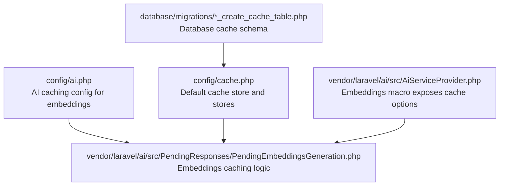
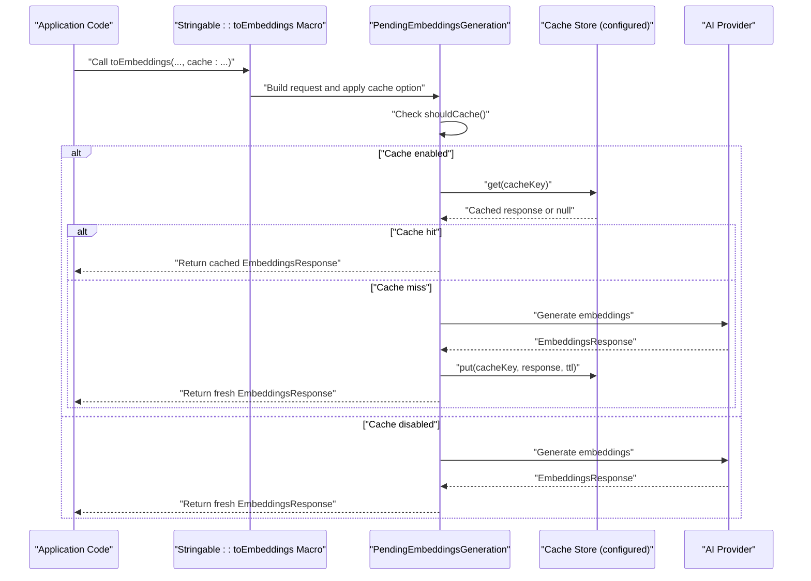
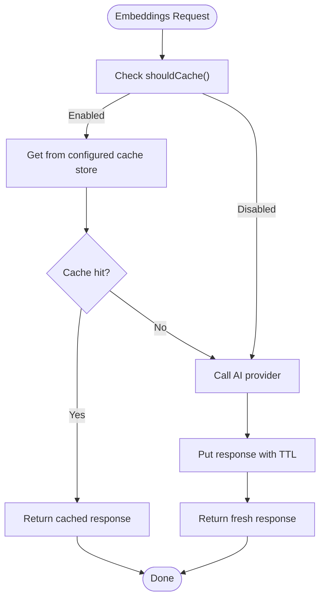
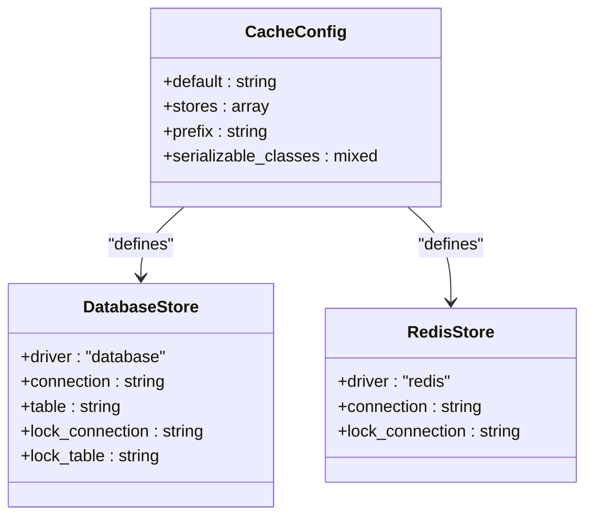
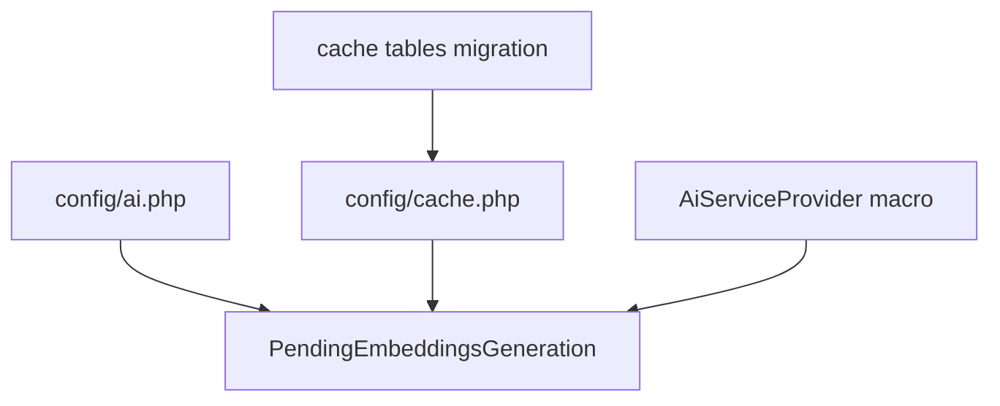

# Caching Strategies

<cite>
**Referenced Files in This Document**
- [config/ai.php](file://config/ai.php)
- [config/cache.php](file://config/cache.php)
- [database/migrations/0001_01_01_000001_create_cache_table.php](file://database/migrations/0001_01_01_000001_create_cache_table.php)
- [vendor/laravel/ai/src/PendingResponses/PendingEmbeddingsGeneration.php](file://vendor/laravel/ai/src/PendingResponses/PendingEmbeddingsGeneration.php)
- [vendor/laravel/ai/src/AiServiceProvider.php](file://vendor/laravel/ai/src/AiServiceProvider.php)
- [.agents/skills/laravel-best-practices/rules/caching.md](file://.agents/skills/laravel-best-practices/rules/caching.md)
- [.claude/skills/laravel-best-practices/rules/caching.md](file://.claude/skills/laravel-best-practices/rules/caching.md)
- [config/database.php](file://config/database.php)
</cite>

## Table of Contents
1. [Introduction](#introduction)
2. [Project Structure](#project-structure)
3. [Core Components](#core-components)
4. [Architecture Overview](#architecture-overview)
5. [Detailed Component Analysis](#detailed-component-analysis)
6. [Dependency Analysis](#dependency-analysis)
7. [Performance Considerations](#performance-considerations)
8. [Troubleshooting Guide](#troubleshooting-guide)
9. [Conclusion](#conclusion)
10. [Appendices](#appendices)

## Introduction
This document provides comprehensive guidance for AI caching strategies in the Laravel Assistant project, focusing on performance optimization and resource management. It documents the embedding caching configuration, cache store selection, database caching, and performance considerations. It also explains caching strategies for different AI operations (embeddings, images, audio), cache invalidation policies, TTL management, cache warming, custom caching layers, monitoring cache effectiveness, coordination across AI providers, and security/access control. Practical examples and diagrams illustrate how caching integrates with the application’s configuration and vendor-provided AI components.

## Project Structure
The caching strategy is primarily configured in application configuration files and leverages the Laravel cache infrastructure. Key locations:
- AI-specific caching configuration for embeddings
- Global cache store definitions and defaults
- Database-backed cache tables for the database store
- Vendor-provided AI embedding generation with built-in caching hooks
- AI macros that expose cache controls to application code

**Diagram sources**
- [config/ai.php:34-39](file://config/ai.php#L34-L39)
- [config/cache.php:18](file://config/cache.php#L18)
- [database/migrations/0001_01_01_000001_create_cache_table.php:14-24](file://database/migrations/0001_01_01_000001_create_cache_table.php#L14-L24)
- [vendor/laravel/ai/src/PendingResponses/PendingEmbeddingsGeneration.php:47-52](file://vendor/laravel/ai/src/PendingResponses/PendingEmbeddingsGeneration.php#L47-L52)
- [vendor/laravel/ai/src/AiServiceProvider.php:41-63](file://vendor/laravel/ai/src/AiServiceProvider.php#L41-L63)

**Section sources**
- [config/ai.php:34-39](file://config/ai.php#L34-L39)
- [config/cache.php:18](file://config/cache.php#L18)
- [database/migrations/0001_01_01_000001_create_cache_table.php:14-24](file://database/migrations/0001_01_01_000001_create_cache_table.php#L14-L24)
- [vendor/laravel/ai/src/PendingResponses/PendingEmbeddingsGeneration.php:47-52](file://vendor/laravel/ai/src/PendingResponses/PendingEmbeddingsGeneration.php#L47-L52)
- [vendor/laravel/ai/src/AiServiceProvider.php:41-63](file://vendor/laravel/ai/src/AiServiceProvider.php#L41-L63)

## Core Components
- AI Embeddings caching configuration
  - Embeddings caching is controlled under the AI configuration with a boolean switch and a store selector. The default store is taken from the environment variable for cache store, with a fallback to the database store.
  - The cache duration for embeddings is configurable and defaults to a long TTL when not explicitly set.

- Cache store configuration
  - The default cache store is configurable via environment variables and supports multiple drivers including database, file, memcached, redis, dynamodb, octane, failover, and null.
  - The database cache store defines connection and table names for cache and cache locks.

- Database-backed cache schema
  - Migrations create dedicated cache and cache_locks tables for the database store, enabling distributed locking and persistence.

- Vendor-provided embedding caching logic
  - The pending embeddings generation class implements cache retrieval and storage, computes a deterministic cache key, and uses the configured cache store.
  - The AI service provider registers a macro that allows consumers to enable caching for embeddings generation with optional TTL.

- Best practices for caching
  - The skill guides provide best practices for cache usage patterns, including atomic reads/writes, stale-while-revalidate, per-request memoization, and failover stores.

**Section sources**
- [config/ai.php:34-39](file://config/ai.php#L34-L39)
- [config/cache.php:18](file://config/cache.php#L18)
- [config/cache.php:42-48](file://config/cache.php#L42-L48)
- [database/migrations/0001_01_01_000001_create_cache_table.php:14-24](file://database/migrations/0001_01_01_000001_create_cache_table.php#L14-L24)
- [vendor/laravel/ai/src/PendingResponses/PendingEmbeddingsGeneration.php:106-140](file://vendor/laravel/ai/src/PendingResponses/PendingEmbeddingsGeneration.php#L106-L140)
- [vendor/laravel/ai/src/AiServiceProvider.php:41-63](file://vendor/laravel/ai/src/AiServiceProvider.php#L41-L63)
- [.agents/skills/laravel-best-practices/rules/caching.md:1-70](file://.agents/skills/laravel-best-practices/rules/caching.md#L1-L70)
- [.claude/skills/laravel-best-practices/rules/caching.md:1-70](file://.claude/skills/laravel-best-practices/rules/caching.md#L1-L70)

## Architecture Overview
The AI caching architecture centers on the AI configuration for embeddings and the Laravel cache infrastructure. The flow below shows how an embedding request is served from cache when enabled and configured.

**Diagram sources**
- [vendor/laravel/ai/src/AiServiceProvider.php:41-63](file://vendor/laravel/ai/src/AiServiceProvider.php#L41-L63)
- [vendor/laravel/ai/src/PendingResponses/PendingEmbeddingsGeneration.php:67-101](file://vendor/laravel/ai/src/PendingResponses/PendingEmbeddingsGeneration.php#L67-L101)
- [vendor/laravel/ai/src/PendingResponses/PendingEmbeddingsGeneration.php:106-140](file://vendor/laravel/ai/src/PendingResponses/PendingEmbeddingsGeneration.php#L106-L140)
- [config/ai.php:34-39](file://config/ai.php#L34-L39)

## Detailed Component Analysis

### Embeddings Caching Configuration
- Purpose: Control whether embeddings are cached and which cache store to use.
- Key options:
  - cache: Boolean flag to enable/disable caching for embeddings.
  - store: Cache store name used for storing embeddings responses.
  - seconds: TTL for cached embeddings (defaults applied when not explicitly set).

- Behavior:
  - When cache is enabled, the pending embeddings generation retrieves a response from cache using a deterministic key derived from provider, model, dimensions, and inputs.
  - If not found, the provider generates embeddings, then stores the response with the configured TTL.

- Practical example paths:
  - Enabling caching with default TTL: [vendor/laravel/ai/src/AiServiceProvider.php:54-56](file://vendor/laravel/ai/src/AiServiceProvider.php#L54-L56)
  - Overriding TTL: [vendor/laravel/ai/src/PendingResponses/PendingEmbeddingsGeneration.php:49](file://vendor/laravel/ai/src/PendingResponses/PendingEmbeddingsGeneration.php#L49)
  - Deterministic cache key: [vendor/laravel/ai/src/PendingResponses/PendingEmbeddingsGeneration.php:145-148](file://vendor/laravel/ai/src/PendingResponses/PendingEmbeddingsGeneration.php#L145-L148)
  - Cache store resolution: [vendor/laravel/ai/src/PendingResponses/PendingEmbeddingsGeneration.php:177-180](file://vendor/laravel/ai/src/PendingResponses/PendingEmbeddingsGeneration.php#L177-L180)

**Diagram sources**
- [vendor/laravel/ai/src/PendingResponses/PendingEmbeddingsGeneration.php:106-140](file://vendor/laravel/ai/src/PendingResponses/PendingEmbeddingsGeneration.php#L106-L140)
- [vendor/laravel/ai/src/PendingResponses/PendingEmbeddingsGeneration.php:177-180](file://vendor/laravel/ai/src/PendingResponses/PendingEmbeddingsGeneration.php#L177-L180)

**Section sources**
- [config/ai.php:34-39](file://config/ai.php#L34-L39)
- [vendor/laravel/ai/src/PendingResponses/PendingEmbeddingsGeneration.php:47-52](file://vendor/laravel/ai/src/PendingResponses/PendingEmbeddingsGeneration.php#L47-L52)
- [vendor/laravel/ai/src/PendingResponses/PendingEmbeddingsGeneration.php:106-140](file://vendor/laravel/ai/src/PendingResponses/PendingEmbeddingsGeneration.php#L106-L140)
- [vendor/laravel/ai/src/PendingResponses/PendingEmbeddingsGeneration.php:145-148](file://vendor/laravel/ai/src/PendingResponses/PendingEmbeddingsGeneration.php#L145-L148)
- [vendor/laravel/ai/src/PendingResponses/PendingEmbeddingsGeneration.php:177-180](file://vendor/laravel/ai/src/PendingResponses/PendingEmbeddingsGeneration.php#L177-L180)
- [vendor/laravel/ai/src/AiServiceProvider.php:41-63](file://vendor/laravel/ai/src/AiServiceProvider.php#L41-L63)

### Cache Store Selection and Database Caching
- Default store and available stores:
  - Default cache store is configurable and supports multiple drivers including database, file, memcached, redis, dynamodb, octane, failover, and null.
  - Database store configuration includes connection and table names for cache and cache locks.

- Database-backed cache:
  - Dedicated cache and cache_locks tables are created by migration, enabling durable cache with distributed locks.

- Practical example paths:
  - Default store selection: [config/cache.php:18](file://config/cache.php#L18)
  - Available stores and database store definition: [config/cache.php:35-102](file://config/cache.php#L35-L102)
  - Database cache schema: [database/migrations/0001_01_01_000001_create_cache_table.php:14-24](file://database/migrations/0001_01_01_000001_create_cache_table.php#L14-L24)
  - Redis cache connection settings: [config/database.php:169-180](file://config/database.php#L169-L180)

**Diagram sources**
- [config/cache.php:18](file://config/cache.php#L18)
- [config/cache.php:35-102](file://config/cache.php#L35-L102)
- [config/database.php:169-180](file://config/database.php#L169-L180)

**Section sources**
- [config/cache.php:18](file://config/cache.php#L18)
- [config/cache.php:35-102](file://config/cache.php#L35-L102)
- [database/migrations/0001_01_01_000001_create_cache_table.php:14-24](file://database/migrations/0001_01_01_000001_create_cache_table.php#L14-L24)
- [config/database.php:169-180](file://config/database.php#L169-L180)

### Cache Invalidation Policies, TTL Management, and Cache Warming
- Invalidation policies:
  - Use cache tags for groups when using compatible stores (redis, memcached, dynamodb). For file or database stores, invalidate by key or implement application-level grouping.
  - Use atomic write primitives to avoid race conditions during updates.

- TTL management:
  - For embeddings, TTL is configurable and defaults to a long period when not explicitly set.
  - For other AI operations, TTL should be tuned based on data volatility and cost.

- Cache warming:
  - Pre-populate frequently accessed embeddings to reduce cold-start latency.
  - Use store-agnostic warming strategies for high-traffic keys.

- Practical example paths:
  - Cache tags and atomic operations: [vendor/laravel/ai/src/PendingResponses/PendingEmbeddingsGeneration.php:106-140](file://vendor/laravel/ai/src/PendingResponses/PendingEmbeddingsGeneration.php#L106-L140)
  - Best practices for cache warming and TTL: [.agents/skills/laravel-best-practices/rules/caching.md:1-70](file://.agents/skills/laravel-best-practices/rules/caching.md#L1-L70), [.claude/skills/laravel-best-practices/rules/caching.md:1-70](file://.claude/skills/laravel-best-practices/rules/caching.md#L1-L70)

**Section sources**
- [vendor/laravel/ai/src/PendingResponses/PendingEmbeddingsGeneration.php:106-140](file://vendor/laravel/ai/src/PendingResponses/PendingEmbeddingsGeneration.php#L106-L140)
- [.agents/skills/laravel-best-practices/rules/caching.md:1-70](file://.agents/skills/laravel-best-practices/rules/caching.md#L1-L70)
- [.claude/skills/laravel-best-practices/rules/caching.md:1-70](file://.claude/skills/laravel-best-practices/rules/caching.md#L1-L70)

### Cache Coordination Across AI Providers and Shared Strategies
- Provider selection:
  - Different operations route to different providers (e.g., embeddings default provider is configured).
  - Ensure consistent cache keys across providers for the same input to maximize cache hits.

- Shared caching strategies:
  - Normalize inputs (provider, model, dimensions) when computing cache keys.
  - Consider a shared cache namespace prefix to avoid collisions across operations.

- Practical example paths:
  - Provider selection for embeddings: [vendor/laravel/ai/src/PendingResponses/PendingEmbeddingsGeneration.php:69-71](file://vendor/laravel/ai/src/PendingResponses/PendingEmbeddingsGeneration.php#L69-L71)
  - Cache key normalization: [vendor/laravel/ai/src/PendingResponses/PendingEmbeddingsGeneration.php:145-148](file://vendor/laravel/ai/src/PendingResponses/PendingEmbeddingsGeneration.php#L145-L148)

**Section sources**
- [vendor/laravel/ai/src/PendingResponses/PendingEmbeddingsGeneration.php:69-71](file://vendor/laravel/ai/src/PendingResponses/PendingEmbeddingsGeneration.php#L69-L71)
- [vendor/laravel/ai/src/PendingResponses/PendingEmbeddingsGeneration.php:145-148](file://vendor/laravel/ai/src/PendingResponses/PendingEmbeddingsGeneration.php#L145-L148)

### Cache Security, Encryption, and Access Control
- Secret exposure:
  - Avoid committing environment variables containing API keys. Access via configuration only.
  - For sensitive fields, consider encrypted casts and hidden attributes.

- Access control:
  - Restrict cache store access to trusted environments.
  - Use secure transport and credentials for external stores (e.g., redis, memcached).

- Practical example paths:
  - Environment-driven secret access: [.agents/skills/laravel-best-practices/rules/security.md:141-157](file://.agents/skills/laravel-best-practices/rules/security.md#L141-L157)
  - Encrypted casts for sensitive data: [.agents/skills/laravel-best-practices/rules/security.md:167-198](file://.agents/skills/laravel-best-practices/rules/security.md#L167-L198)

**Section sources**
- [.agents/skills/laravel-best-practices/rules/security.md:141-157](file://.agents/skills/laravel-best-practices/rules/security.md#L141-L157)
- [.agents/skills/laravel-best-practices/rules/security.md:167-198](file://.agents/skills/laravel-best-practices/rules/security.md#L167-L198)

### Monitoring Cache Effectiveness
- Metrics to track:
  - Cache hit ratio, average latency, and cache size.
  - Store-specific metrics (e.g., redis memory usage, database table size).

- Observability:
  - Instrument cache get/put operations around embedding generation.
  - Log cache key derivation and TTL decisions for debugging.

- Practical example paths:
  - Cache usage patterns and best practices: [.agents/skills/laravel-best-practices/rules/caching.md:1-70](file://.agents/skills/laravel-best-practices/rules/caching.md#L1-L70), [.claude/skills/laravel-best-practices/rules/caching.md:1-70](file://.claude/skills/laravel-best-practices/rules/caching.md#L1-L70)

**Section sources**
- [.agents/skills/laravel-best-practices/rules/caching.md:1-70](file://.agents/skills/laravel-best-practices/rules/caching.md#L1-L70)
- [.claude/skills/laravel-best-practices/rules/caching.md:1-70](file://.claude/skills/laravel-best-practices/rules/caching.md#L1-L70)

## Dependency Analysis
The embedding caching logic depends on:
- AI configuration for enabling caching and selecting the cache store
- Laravel cache infrastructure for storage and retrieval
- Database cache schema when using the database store
- AI provider for generating embeddings when cache misses occur

**Diagram sources**
- [config/ai.php:34-39](file://config/ai.php#L34-L39)
- [config/cache.php:18](file://config/cache.php#L18)
- [database/migrations/0001_01_01_000001_create_cache_table.php:14-24](file://database/migrations/0001_01_01_000001_create_cache_table.php#L14-L24)
- [vendor/laravel/ai/src/PendingResponses/PendingEmbeddingsGeneration.php:106-140](file://vendor/laravel/ai/src/PendingResponses/PendingEmbeddingsGeneration.php#L106-L140)
- [vendor/laravel/ai/src/AiServiceProvider.php:41-63](file://vendor/laravel/ai/src/AiServiceProvider.php#L41-L63)

**Section sources**
- [config/ai.php:34-39](file://config/ai.php#L34-L39)
- [config/cache.php:18](file://config/cache.php#L18)
- [database/migrations/0001_01_01_000001_create_cache_table.php:14-24](file://database/migrations/0001_01_01_000001_create_cache_table.php#L14-L24)
- [vendor/laravel/ai/src/PendingResponses/PendingEmbeddingsGeneration.php:106-140](file://vendor/laravel/ai/src/PendingResponses/PendingEmbeddingsGeneration.php#L106-L140)
- [vendor/laravel/ai/src/AiServiceProvider.php:41-63](file://vendor/laravel/ai/src/AiServiceProvider.php#L41-L63)

## Performance Considerations
- Choose the right cache store:
  - Use redis for low-latency, high-throughput scenarios.
  - Use database store for simplicity and durability.
  - Use memcached for distributed caching with expiration support.

- Optimize TTL:
  - Set TTL based on data volatility and cost of regeneration.
  - Use stale-while-revalidate patterns for high-traffic keys.

- Reduce redundant requests:
  - Use per-request memoization for repeated reads within a single request lifecycle.
  - Avoid manual get/put patterns; prefer atomic helpers.

- Practical example paths:
  - Stale-while-revalidate and memoization patterns: [.agents/skills/laravel-best-practices/rules/caching.md:21-62](file://.agents/skills/laravel-best-practices/rules/caching.md#L21-L62), [.claude/skills/laravel-best-practices/rules/caching.md:21-62](file://.claude/skills/laravel-best-practices/rules/caching.md#L21-L62)

**Section sources**
- [.agents/skills/laravel-best-practices/rules/caching.md:21-62](file://.agents/skills/laravel-best-practices/rules/caching.md#L21-L62)
- [.claude/skills/laravel-best-practices/rules/caching.md:21-62](file://.claude/skills/laravel-best-practices/rules/caching.md#L21-L62)

## Troubleshooting Guide
- Cache not applied:
  - Verify the cache flag is enabled and the store is correctly configured.
  - Confirm TTL is set appropriately.

- Cache key collisions:
  - Ensure cache keys include provider, model, dimensions, and inputs to avoid collisions.

- Store-specific issues:
  - For database store, confirm cache and cache_locks tables exist and are migrated.
  - For redis, verify connectivity and credentials.

- Practical example paths:
  - Cache key computation and store usage: [vendor/laravel/ai/src/PendingResponses/PendingEmbeddingsGeneration.php:145-148](file://vendor/laravel/ai/src/PendingResponses/PendingEmbeddingsGeneration.php#L145-L148), [vendor/laravel/ai/src/PendingResponses/PendingEmbeddingsGeneration.php:177-180](file://vendor/laravel/ai/src/PendingResponses/PendingEmbeddingsGeneration.php#L177-L180)
  - Database cache schema: [database/migrations/0001_01_01_000001_create_cache_table.php:14-24](file://database/migrations/0001_01_01_000001_create_cache_table.php#L14-L24)

**Section sources**
- [vendor/laravel/ai/src/PendingResponses/PendingEmbeddingsGeneration.php:145-148](file://vendor/laravel/ai/src/PendingResponses/PendingEmbeddingsGeneration.php#L145-L148)
- [vendor/laravel/ai/src/PendingResponses/PendingEmbeddingsGeneration.php:177-180](file://vendor/laravel/ai/src/PendingResponses/PendingEmbeddingsGeneration.php#L177-L180)
- [database/migrations/0001_01_01_000001_create_cache_table.php:14-24](file://database/migrations/0001_01_01_000001_create_cache_table.php#L14-L24)

## Conclusion
The Laravel Assistant project provides a robust foundation for AI caching through its AI configuration and Laravel’s cache infrastructure. Embeddings caching is first-class, with deterministic keys, configurable TTL, and flexible store selection. By aligning cache strategies with store capabilities, applying best practices for TTL and invalidation, and instrumenting monitoring, teams can achieve significant performance gains while maintaining reliability and security.

## Appendices
- Practical examples (paths only):
  - Enable caching with default TTL: [vendor/laravel/ai/src/AiServiceProvider.php:54-56](file://vendor/laravel/ai/src/AiServiceProvider.php#L54-L56)
  - Override TTL for embeddings: [vendor/laravel/ai/src/PendingResponses/PendingEmbeddingsGeneration.php:49](file://vendor/laravel/ai/src/PendingResponses/PendingEmbeddingsGeneration.php#L49)
  - Compute cache key: [vendor/laravel/ai/src/PendingResponses/PendingEmbeddingsGeneration.php:145-148](file://vendor/laravel/ai/src/PendingResponses/PendingEmbeddingsGeneration.php#L145-L148)
  - Select cache store: [vendor/laravel/ai/src/PendingResponses/PendingEmbeddingsGeneration.php:177-180](file://vendor/laravel/ai/src/PendingResponses/PendingEmbeddingsGeneration.php#L177-L180)
  - Configure default cache store: [config/cache.php:18](file://config/cache.php#L18)
  - Define database cache store: [config/cache.php:42-48](file://config/cache.php#L42-L48)
  - Database cache schema: [database/migrations/0001_01_01_000001_create_cache_table.php:14-24](file://database/migrations/0001_01_01_000001_create_cache_table.php#L14-L24)
  - Redis cache connection: [config/database.php:169-180](file://config/database.php#L169-L180)
  - Best practices for caching: [.agents/skills/laravel-best-practices/rules/caching.md:1-70](file://.agents/skills/laravel-best-practices/rules/caching.md#L1-L70), [.claude/skills/laravel-best-practices/rules/caching.md:1-70](file://.claude/skills/laravel-best-practices/rules/caching.md#L1-L70)
  - Security guidance: [.agents/skills/laravel-best-practices/rules/security.md:141-198](file://.agents/skills/laravel-best-practices/rules/security.md#L141-L198)