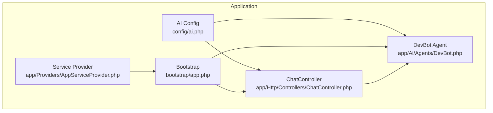
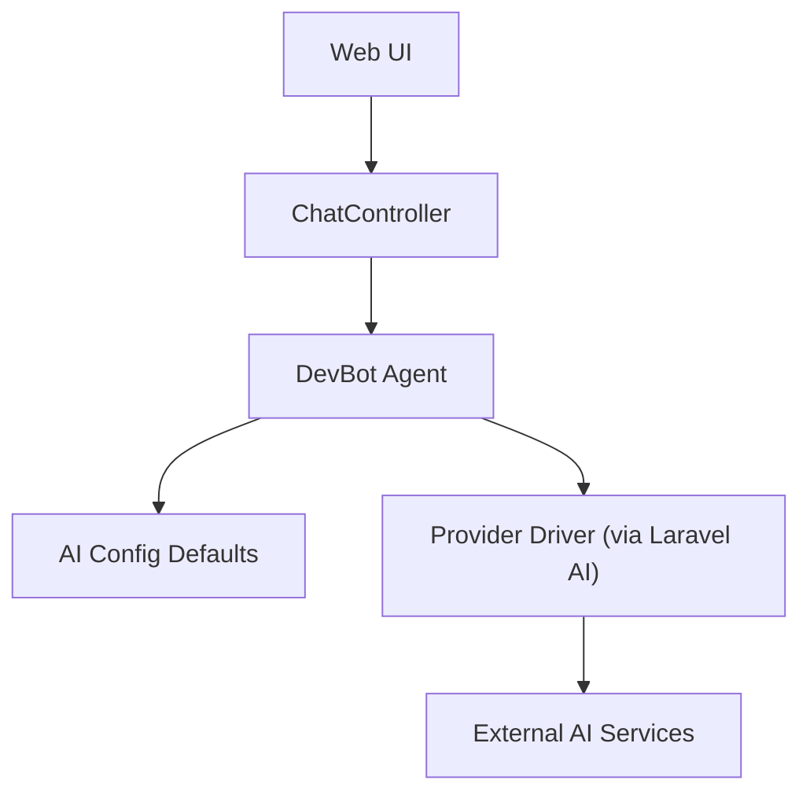
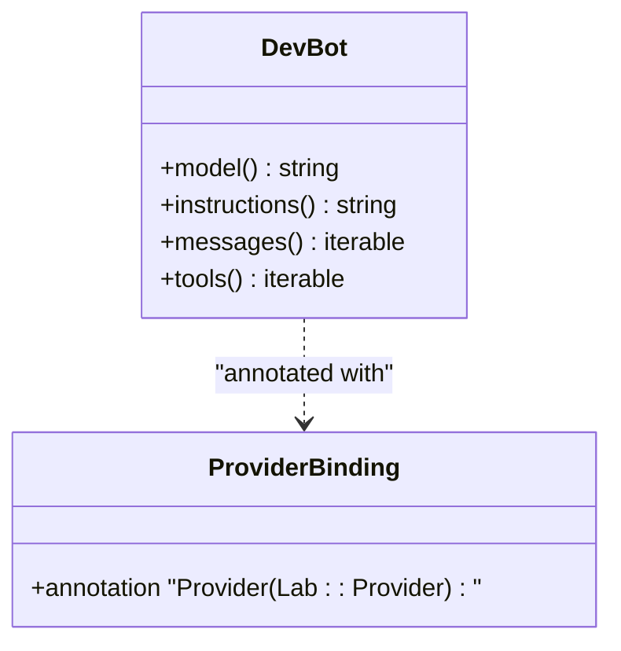
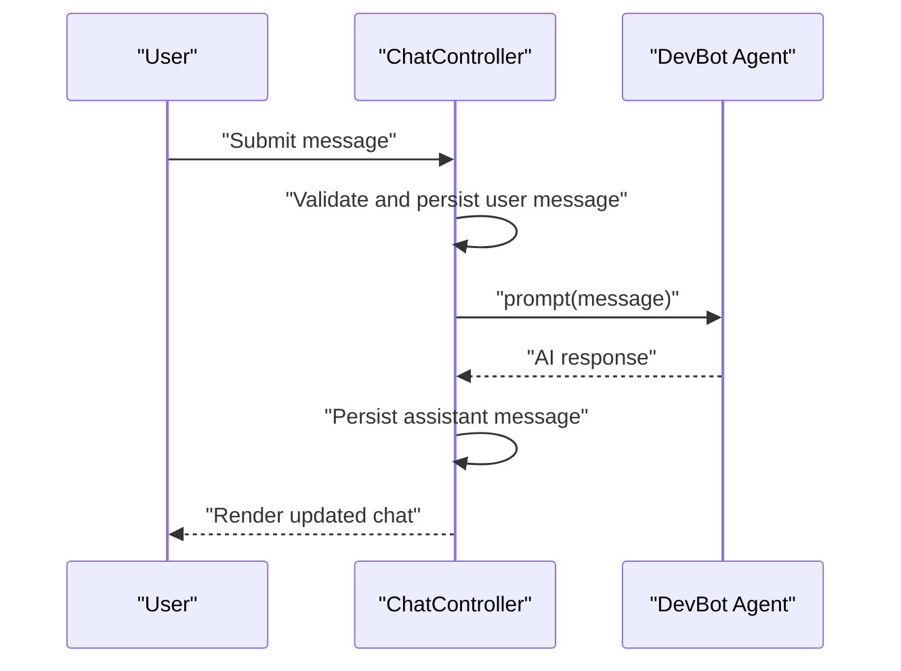
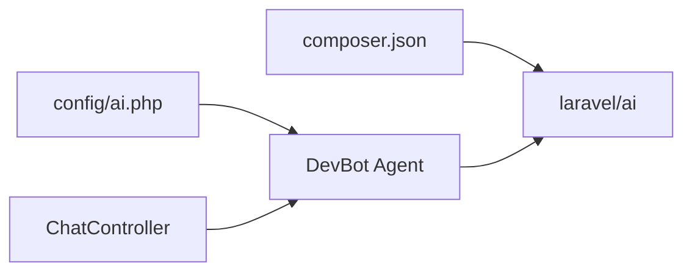

# Provider Integration

<cite>
**Referenced Files in This Document**
- [config/ai.php](file://config/ai.php)
- [composer.json](file://composer.json)
- [app/Ai/Agents/DevBot.php](file://app/Ai/Agents/DevBot.php)
- [app/Http/Controllers/ChatController.php](file://app/Http/Controllers/ChatController.php)
- [bootstrap/app.php](file://bootstrap/app.php)
- [app/Providers/AppServiceProvider.php](file://app/Providers/AppServiceProvider.php)
- [README.md](file://README.md)
- [CLAUDE.md](file://CLAUDE.md)
- [GEMINI.md](file://GEMINI.md)
- [openspec/changes/devbot-ai-agent/specs/devbot-agent/spec.md](file://openspec/changes/devbot-ai-agent/specs/devbot-agent/spec.md)
</cite>

## Table of Contents
1. [Introduction](#introduction)
2. [Project Structure](#project-structure)
3. [Core Components](#core-components)
4. [Architecture Overview](#architecture-overview)
5. [Detailed Component Analysis](#detailed-component-analysis)
6. [Dependency Analysis](#dependency-analysis)
7. [Performance Considerations](#performance-considerations)
8. [Troubleshooting Guide](#troubleshooting-guide)
9. [Conclusion](#conclusion)
10. [Appendices](#appendices)

## Introduction
This document explains the Provider Integration capabilities for multi-provider AI service abstraction in the Laravel Assistant application. It focuses on how the system selects and configures AI providers, how agents are bound to specific providers, and how the configuration supports defaults per task type (text, images, audio, transcription, embeddings, reranking). It also covers service container integration, dependency injection patterns, practical provider selection logic, fallback and load-balancing strategies, provider-specific features and limitations, authentication, rate limiting, cost management, migration strategies, compatibility considerations, and testing approaches for multi-provider deployments.

## Project Structure
The repository integrates the Laravel AI ecosystem to enable multi-provider AI operations. Key elements:
- Provider configuration is centralized in the AI configuration file, defining default providers per capability and provider credentials.
- The DevBot agent is annotated to bind to a specific provider and encapsulates model selection and behavior.
- Controllers orchestrate user interactions and delegate AI prompts to agents.
- The Laravel application bootstrap and service providers integrate the framework’s container and lifecycle.

**Diagram sources**
- [config/ai.php:16](file://config/ai.php#L16)
- [bootstrap/app.php:7](file://bootstrap/app.php#L7)
- [app/Providers/AppServiceProvider.php:12](file://app/Providers/AppServiceProvider.php#L12)
- [app/Http/Controllers/ChatController.php:69](file://app/Http/Controllers/ChatController.php#L69)
- [app/Ai/Agents/DevBot.php:18](file://app/Ai/Agents/DevBot.php#L18)

**Section sources**
- [config/ai.php:16](file://config/ai.php#L16)
- [bootstrap/app.php:7](file://bootstrap/app.php#L7)
- [app/Providers/AppServiceProvider.php:12](file://app/Providers/AppServiceProvider.php#L12)
- [app/Http/Controllers/ChatController.php:69](file://app/Http/Controllers/ChatController.php#L69)
- [app/Ai/Agents/DevBot.php:18](file://app/Ai/Agents/DevBot.php#L18)

## Core Components
- AI configuration defines:
  - Defaults for general and specialized tasks (text, images, audio, transcription, embeddings, reranking).
  - Provider registry with driver, key, and endpoint overrides per provider.
  - Optional caching configuration for embeddings.
- DevBot agent:
  - Declares provider binding via an annotation.
  - Provides model selection and system instructions.
  - Implements conversational and tool-enabled interfaces.
- ChatController:
  - Manages UI flow and delegates prompt execution to the agent.
  - Handles conversation persistence and error logging.

Key configuration and binding references:
- Default provider assignments and per-task defaults.
- Provider registry with driver and key fields.
- Agent provider binding and model selection.

**Section sources**
- [config/ai.php:16](file://config/ai.php#L16)
- [config/ai.php:52](file://config/ai.php#L52)
- [app/Ai/Agents/DevBot.php:18](file://app/Ai/Agents/DevBot.php#L18)
- [app/Ai/Agents/DevBot.php:32](file://app/Ai/Agents/DevBot.php#L32)
- [app/Http/Controllers/ChatController.php:69](file://app/Http/Controllers/ChatController.php#L69)

## Architecture Overview
The system follows a layered architecture:
- Presentation layer: Controller orchestrates user actions.
- Domain layer: Agent encapsulates AI behavior and provider binding.
- Infrastructure layer: AI configuration and provider drivers managed by the Laravel AI package.

**Diagram sources**
- [app/Http/Controllers/ChatController.php:69](file://app/Http/Controllers/ChatController.php#L69)
- [app/Ai/Agents/DevBot.php:18](file://app/Ai/Agents/DevBot.php#L18)
- [config/ai.php:16](file://config/ai.php#L16)

## Detailed Component Analysis

### AI Configuration and Provider Registry
The AI configuration centralizes provider definitions and defaults:
- Defaults per capability:
  - General default, images, audio, transcription, embeddings, reranking.
- Provider registry:
  - Each provider includes driver, key, and optional URL/version/deployment fields depending on the provider.
- Embedding caching:
  - Toggle and cache store selection.

Operational implications:
- Centralized management of provider credentials and endpoints.
- Per-feature default selection simplifies agent configuration.
- Embedding caching can reduce latency and cost for repeated embeddings.

**Section sources**
- [config/ai.php:16](file://config/ai.php#L16)
- [config/ai.php:52](file://config/ai.php#L52)
- [config/ai.php:34](file://config/ai.php#L34)

### Agent Provider Binding and Behavior
DevBot demonstrates:
- Provider binding via an annotation that associates the agent with a specific provider.
- Model selection via environment variable override.
- Instructions and conversational behavior.
- Optional tool integration.

This pattern allows swapping providers by changing the agent’s provider binding and adjusting configuration defaults.

**Diagram sources**
- [app/Ai/Agents/DevBot.php:18](file://app/Ai/Agents/DevBot.php#L18)
- [app/Ai/Agents/DevBot.php:32](file://app/Ai/Agents/DevBot.php#L32)

**Section sources**
- [app/Ai/Agents/DevBot.php:18](file://app/Ai/Agents/DevBot.php#L18)
- [app/Ai/Agents/DevBot.php:32](file://app/Ai/Agents/DevBot.php#L32)

### Controller Integration and Prompt Execution
The controller:
- Validates input and manages conversation persistence.
- Instantiates the agent and invokes the prompt method.
- Persists the assistant’s response.
- Logs and surfaces errors.

**Diagram sources**
- [app/Http/Controllers/ChatController.php:69](file://app/Http/Controllers/ChatController.php#L69)
- [app/Ai/Agents/DevBot.php:18](file://app/Ai/Agents/DevBot.php#L18)

**Section sources**
- [app/Http/Controllers/ChatController.php:69](file://app/Http/Controllers/ChatController.php#L69)

### Service Container and Dependency Injection Patterns
- Laravel’s container resolves dependencies automatically.
- Agent instantiation occurs in the controller; the agent’s provider binding is resolved by the Laravel AI package.
- Environment-driven configuration ensures credentials and endpoints are injected at runtime.

Integration points:
- Bootstrap and service providers establish the container lifecycle.
- Composer dependencies include the Laravel AI package, enabling provider abstractions.

**Section sources**
- [bootstrap/app.php:7](file://bootstrap/app.php#L7)
- [app/Providers/AppServiceProvider.php:12](file://app/Providers/AppServiceProvider.php#L12)
- [composer.json:13](file://composer.json#L13)

### Practical Provider Selection Logic
Recommended selection strategies:
- Capability-based routing:
  - Route text tasks to the general default.
  - Route image tasks to the image default.
  - Route audio/transcription to the audio default.
  - Route embeddings to the embeddings default.
  - Route reranking to the reranking default.
- Feature-based selection:
  - Choose provider based on model availability, cost, or latency characteristics.
- Environment-based selection:
  - Use environment variables to switch providers per deployment stage.

Fallback mechanisms:
- If a provider fails, attempt a secondary provider from the registry.
- Implement retries with exponential backoff and circuit breaker logic.

Load balancing strategies:
- Round-robin across providers for high-throughput scenarios.
- Weighted distribution based on provider capacity or cost per token.

Note: The above strategies are implementation recommendations derived from the configuration’s per-task defaults and the presence of multiple providers in the registry.

**Section sources**
- [config/ai.php:16](file://config/ai.php#L16)
- [config/ai.php:52](file://config/ai.php#L52)

### Provider-Specific Features, Limitations, and Optimizations
- Anthropic (Claude):
  - Strengths: strong reasoning, safety features.
  - Considerations: latency, cost per token.
- Gemini:
  - Strengths: multimodal, strong in image tasks.
  - Considerations: quota limits, regional availability.
- OpenAI:
  - Strengths: broad model family, strong embeddings.
  - Considerations: rate limits, cost management.
- Azure OpenAI:
  - Strengths: enterprise-grade SLAs, compliance.
  - Considerations: deployment configuration, API versioning.
- Local providers (Ollama):
  - Strengths: privacy, offline capability.
  - Considerations: resource constraints, model availability.

Optimization techniques:
- Use embeddings caching for repeated queries.
- Batch requests where supported.
- Tune temperature and max tokens per task type.
- Monitor provider-specific quotas and adjust routing accordingly.

**Section sources**
- [config/ai.php:52](file://config/ai.php#L52)
- [config/ai.php:34](file://config/ai.php#L34)

### Authentication, Rate Limiting, and Cost Management
- Authentication:
  - Each provider’s key is configured centrally; ensure environment variables are set per provider.
- Rate limiting:
  - Implement client-side throttling and provider-side rate limits awareness.
  - Use backpressure and retry policies with jitter.
- Cost management:
  - Track token usage per provider.
  - Route expensive tasks to lower-cost providers when acceptable.
  - Enable caching for embeddings and repeated prompts.

**Section sources**
- [config/ai.php:52](file://config/ai.php#L52)

### Migration Strategies and Compatibility
- Gradual migration:
  - Start with a subset of tasks or routes.
  - Use feature flags to toggle providers per request.
- Compatibility:
  - Normalize input/output schemas across providers.
  - Maintain separate model aliases for provider-specific models.
- Validation:
  - Add tests to ensure parity of behavior across providers.

**Section sources**
- [openspec/changes/devbot-ai-agent/specs/devbot-agent/spec.md:5](file://openspec/changes/devbot-ai-agent/specs/devbot-agent/spec.md#L5)

### Testing Approaches for Multi-Provider Deployments
- Unit tests:
  - Mock provider responses and assert agent behavior.
- Integration tests:
  - Test end-to-end flows with a selected provider.
- Contract tests:
  - Validate consistent output formats across providers.
- Load tests:
  - Simulate provider failures and fallbacks.

**Section sources**
- [CLAUDE.md:28](file://CLAUDE.md#L28)
- [GEMINI.md:28](file://GEMINI.md#L28)

## Dependency Analysis
The application depends on the Laravel AI package for provider abstraction. The configuration and agent annotations define the runtime bindings.

**Diagram sources**
- [composer.json:13](file://composer.json#L13)
- [config/ai.php:52](file://config/ai.php#L52)
- [app/Ai/Agents/DevBot.php:18](file://app/Ai/Agents/DevBot.php#L18)
- [app/Http/Controllers/ChatController.php:69](file://app/Http/Controllers/ChatController.php#L69)

**Section sources**
- [composer.json:13](file://composer.json#L13)
- [config/ai.php:52](file://config/ai.php#L52)
- [app/Ai/Agents/DevBot.php:18](file://app/Ai/Agents/DevBot.php#L18)
- [app/Http/Controllers/ChatController.php:69](file://app/Http/Controllers/ChatController.php#L69)

## Performance Considerations
- Use provider-specific defaults to minimize misconfiguration overhead.
- Enable embedding caching to reduce repeated compute costs.
- Implement intelligent routing to avoid hotspots on a single provider.
- Monitor latency and throughput per provider and adjust defaults accordingly.

[No sources needed since this section provides general guidance]

## Troubleshooting Guide
Common issues and resolutions:
- Missing provider keys:
  - Verify environment variables for the selected provider.
- Provider unavailability:
  - Implement fallback routing to another provider.
- Excessive latency:
  - Switch to a provider with lower latency for the given task type.
- Unexpected model behavior:
  - Confirm the agent’s provider binding and model alias.

**Section sources**
- [config/ai.php:52](file://config/ai.php#L52)
- [app/Ai/Agents/DevBot.php:18](file://app/Ai/Agents/DevBot.php#L18)

## Conclusion
The Laravel Assistant leverages the Laravel AI package and a centralized configuration to support multi-provider AI service abstraction. By combining capability-based defaults, agent provider binding, and environment-driven configuration, the system enables flexible provider selection, robust fallbacks, and scalable operations. Adopting the recommended strategies for authentication, rate limiting, cost management, migration, and testing will further strengthen reliability and maintainability across diverse provider landscapes.

[No sources needed since this section summarizes without analyzing specific files]

## Appendices
- Getting started with Laravel AI and Boost is documented in the project’s README and Boost guidelines.

**Section sources**
- [README.md:34](file://README.md#L34)
- [CLAUDE.md:28](file://CLAUDE.md#L28)
- [GEMINI.md:28](file://GEMINI.md#L28)