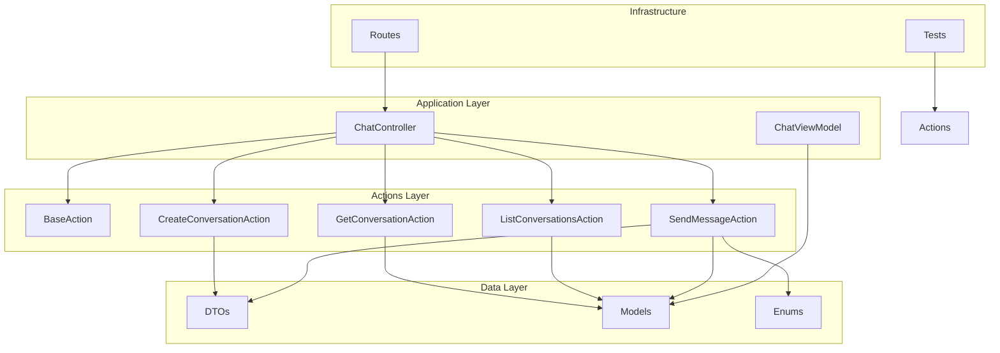
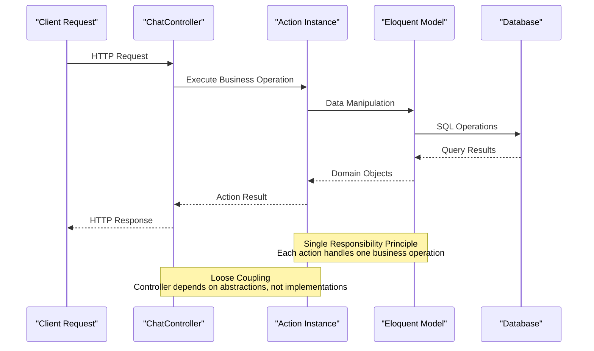
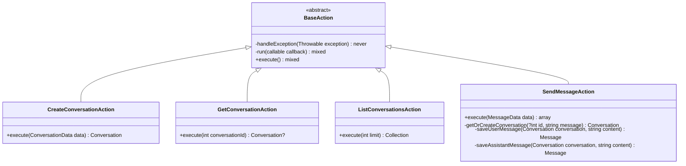
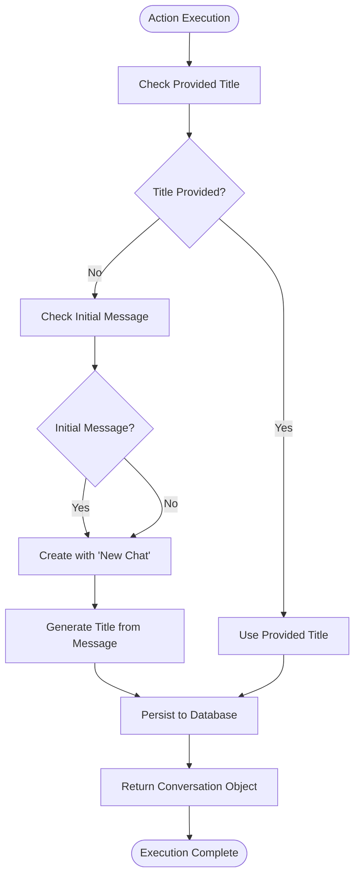
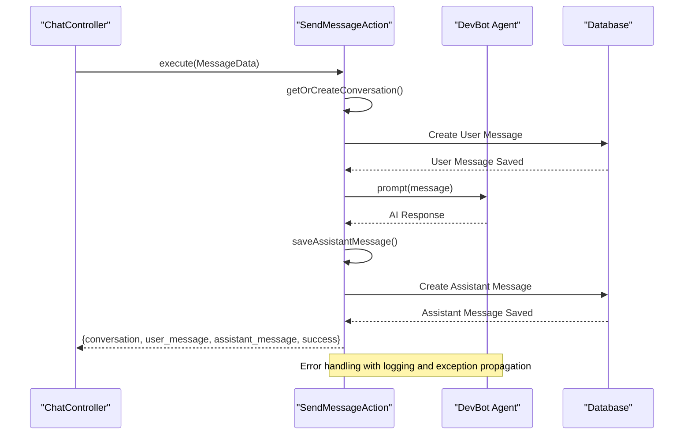
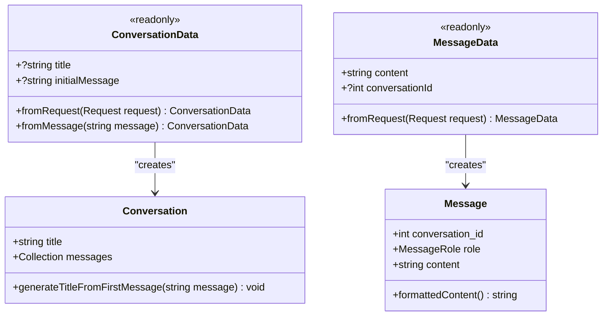
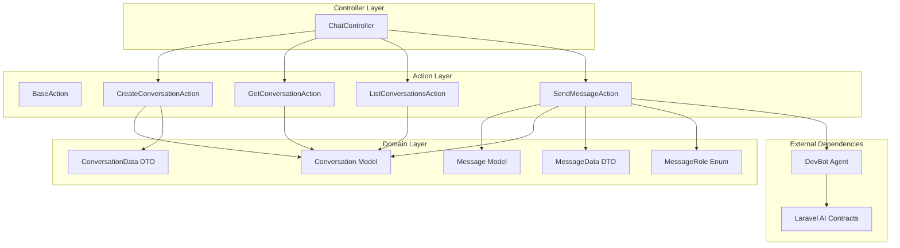

# Actions Layer Specification

<cite>
**Referenced Files in This Document**
- [BaseAction.php](file://app/Actions/BaseAction.php)
- [CreateConversationAction.php](file://app/Actions/CreateConversationAction.php)
- [GetConversationAction.php](file://app/Actions/GetConversationAction.php)
- [ListConversationsAction.php](file://app/Actions/ListConversationsAction.php)
- [SendMessageAction.php](file://app/Actions/SendMessageAction.php)
- [ConversationData.php](file://app/DTOs/ConversationData.php)
- [MessageData.php](file://app/DTOs/MessageData.php)
- [ChatController.php](file://app/Http/Controllers/ChatController.php)
- [Conversation.php](file://app/Models/Conversation.php)
- [Message.php](file://app/Models/Message.php)
- [ConversationStatus.php](file://app/Enums/ConversationStatus.php)
- [MessageRole.php](file://app/Enums/MessageRole.php)
- [ChatViewModel.php](file://app/ViewModels/ChatViewModel.php)
- [web.php](file://routes/web.php)
- [CreateConversationActionTest.php](file://tests/Unit/CreateConversationActionTest.php)
- [ChatTest.php](file://tests/Feature/ChatTest.php)
</cite>

## Table of Contents
1. [Introduction](#introduction)
2. [Project Structure](#project-structure)
3. [Core Components](#core-components)
4. [Architecture Overview](#architecture-overview)
5. [Detailed Component Analysis](#detailed-component-analysis)
6. [Dependency Analysis](#dependency-analysis)
7. [Performance Considerations](#performance-considerations)
8. [Troubleshooting Guide](#troubleshooting-guide)
9. [Conclusion](#conclusion)

## Introduction

The Actions Layer Specification defines a clean, maintainable architecture pattern for encapsulating business logic in the Laravel Assistant application. This specification establishes a standardized approach for implementing single-responsibility actions that handle specific business operations while maintaining loose coupling with controllers, models, and other application components.

The Actions Layer follows the Command Pattern principles, providing a structured way to organize complex business operations into discrete, testable units. Each action encapsulates a specific business operation, handles its own error management, and returns well-defined results through Data Transfer Objects (DTOs).

## Project Structure

The Actions Layer is organized within the `app/Actions` directory and works in conjunction with several supporting components:

**Diagram sources**
- [ChatController.php:19-154](file://app/Http/Controllers/ChatController.php#L19-L154)
- [BaseAction.php:28-58](file://app/Actions/BaseAction.php#L28-L58)
- [CreateConversationAction.php:29-53](file://app/Actions/CreateConversationAction.php#L29-L53)
- [GetConversationAction.php:24-39](file://app/Actions/GetConversationAction.php#L24-L39)
- [ListConversationsAction.php:24-39](file://app/Actions/ListConversationsAction.php#L24-L39)
- [SendMessageAction.php:40-131](file://app/Actions/SendMessageAction.php#L40-L131)

**Section sources**
- [ChatController.php:19-154](file://app/Http/Controllers/ChatController.php#L19-L154)
- [web.php:10-16](file://routes/web.php#L10-L16)

## Core Components

The Actions Layer consists of five primary action classes, each serving a specific business function:

### BaseAction Foundation

The `BaseAction` class serves as the foundation for all action implementations, providing common error handling patterns and execution wrappers.

### Conversation Management Actions

- **CreateConversationAction**: Handles conversation creation with automatic title generation from initial messages
- **GetConversationAction**: Retrieves conversations with properly eager-loaded messages to prevent N+1 queries
- **ListConversationsAction**: Provides paginated conversation listings for sidebar navigation

### Message Processing Action

- **SendMessageAction**: Orchestrates the complete message flow including AI interaction, error handling, and result formatting

### Data Transfer Objects

- **ConversationData**: Immutable DTO for conversation creation parameters
- **MessageData**: Immutable DTO for message transmission parameters

**Section sources**
- [BaseAction.php:28-58](file://app/Actions/BaseAction.php#L28-L58)
- [CreateConversationAction.php:29-53](file://app/Actions/CreateConversationAction.php#L29-L53)
- [GetConversationAction.php:24-39](file://app/Actions/GetConversationAction.php#L24-L39)
- [ListConversationsAction.php:24-39](file://app/Actions/ListConversationsAction.php#L24-L39)
- [SendMessageAction.php:40-131](file://app/Actions/SendMessageAction.php#L40-L131)
- [ConversationData.php:29-58](file://app/DTOs/ConversationData.php#L29-L58)
- [MessageData.php:29-47](file://app/DTOs/MessageData.php#L29-L47)

## Architecture Overview

The Actions Layer follows a layered architecture pattern that separates concerns and maintains clean boundaries between components:

**Diagram sources**
- [ChatController.php:67-152](file://app/Http/Controllers/ChatController.php#L67-L152)
- [BaseAction.php:49-56](file://app/Actions/BaseAction.php#L49-L56)
- [SendMessageAction.php:55-86](file://app/Actions/SendMessageAction.php#L55-L86)

The architecture ensures that:

1. **Single Responsibility**: Each action handles exactly one business operation
2. **Loose Coupling**: Actions depend on abstractions rather than concrete implementations
3. **Testability**: Actions can be easily unit tested in isolation
4. **Reusability**: Actions can be composed to handle complex workflows
5. **Maintainability**: Changes to business logic are localized to specific action classes

## Detailed Component Analysis

### BaseAction Class

The `BaseAction` class provides the foundation for all action implementations with built-in error handling and execution patterns.

**Diagram sources**
- [BaseAction.php:28-58](file://app/Actions/BaseAction.php#L28-L58)
- [CreateConversationAction.php:29-53](file://app/Actions/CreateConversationAction.php#L29-L53)
- [GetConversationAction.php:24-39](file://app/Actions/GetConversationAction.php#L24-L39)
- [ListConversationsAction.php:24-39](file://app/Actions/ListConversationsAction.php#L24-L39)
- [SendMessageAction.php:40-131](file://app/Actions/SendMessageAction.php#L40-L131)

**Section sources**
- [BaseAction.php:28-58](file://app/Actions/BaseAction.php#L28-L58)

### CreateConversationAction

Handles conversation creation with intelligent title generation and persistence logic.

**Diagram sources**
- [CreateConversationAction.php:37-51](file://app/Actions/CreateConversationAction.php#L37-L51)

**Section sources**
- [CreateConversationAction.php:29-53](file://app/Actions/CreateConversationAction.php#L29-L53)

### SendMessageAction

Orchestrates the complete message sending workflow with AI integration and comprehensive error handling.

**Diagram sources**
- [SendMessageAction.php:55-86](file://app/Actions/SendMessageAction.php#L55-L86)
- [ChatController.php:117-152](file://app/Http/Controllers/ChatController.php#L117-L152)

**Section sources**
- [SendMessageAction.php:40-131](file://app/Actions/SendMessageAction.php#L40-L131)

### Data Transfer Objects

Immutable DTOs provide type-safe data transfer between layers and eliminate the use of raw arrays.

**Diagram sources**
- [ConversationData.php:29-58](file://app/DTOs/ConversationData.php#L29-L58)
- [MessageData.php:29-47](file://app/DTOs/MessageData.php#L29-L47)
- [Conversation.php:9-51](file://app/Models/Conversation.php#L9-L51)
- [Message.php:10-45](file://app/Models/Message.php#L10-L45)

**Section sources**
- [ConversationData.php:29-58](file://app/DTOs/ConversationData.php#L29-L58)
- [MessageData.php:29-47](file://app/DTOs/MessageData.php#L29-L47)

## Dependency Analysis

The Actions Layer maintains clean dependency relationships through dependency injection and abstraction principles:

**Diagram sources**
- [ChatController.php:5-17](file://app/Http/Controllers/ChatController.php#L5-L17)
- [SendMessageAction.php:5-11](file://app/Actions/SendMessageAction.php#L5-L11)
- [Conversation.php:6-24](file://app/Models/Conversation.php#L6-L24)
- [Message.php:5-25](file://app/Models/Message.php#L5-L25)

**Section sources**
- [ChatController.php:5-17](file://app/Http/Controllers/ChatController.php#L5-L17)
- [SendMessageAction.php:5-11](file://app/Actions/SendMessageAction.php#L5-L11)

## Performance Considerations

The Actions Layer implements several performance optimization strategies:

### Eager Loading Prevention
- The `GetConversationAction` uses eager loading to prevent N+1 query problems
- Messages are ordered by creation time to optimize display rendering

### Data Limiting
- `ListConversationsAction` limits results to 50 conversations to prevent memory issues
- Conversation models limit recent messages to 50 items

### Efficient Data Transfer
- DTOs provide immutable, type-safe data structures
- Results are serialized efficiently for JSON responses

### Caching Opportunities
- Conversation and message data can benefit from Laravel's caching mechanisms
- Frequent operations like conversation lists can be cached

## Troubleshooting Guide

Common issues and their solutions when working with the Actions Layer:

### Error Handling Patterns

The base action provides a standardized approach to error handling:

1. **Exception Propagation**: All actions inherit the base exception handling pattern
2. **Logging Integration**: AI-related errors are logged with context information
3. **Graceful Degradation**: Partial failures still persist user messages when possible

### Testing Strategies

Actions are designed for comprehensive testing:

1. **Unit Testing**: Individual actions can be tested in isolation
2. **Integration Testing**: End-to-end workflows can be validated
3. **Mocking Support**: External dependencies like AI services can be mocked

### Common Issues

- **Missing Dependencies**: Ensure all required dependencies are properly injected
- **Validation Failures**: DTO validation occurs before action execution
- **Database Constraints**: Eloquent validation handles database constraint violations
- **AI Service Errors**: Network timeouts and service unavailability are handled gracefully

**Section sources**
- [BaseAction.php:36-39](file://app/Actions/BaseAction.php#L36-L39)
- [SendMessageAction.php:77-85](file://app/Actions/SendMessageAction.php#L77-L85)
- [ChatTest.php:335-380](file://tests/Feature/ChatTest.php#L335-L380)

## Conclusion

The Actions Layer Specification provides a robust, maintainable architecture for handling business logic in the Laravel Assistant application. By following the established patterns and principles, developers can create scalable, testable, and maintainable applications that adhere to SOLID principles and clean architecture guidelines.

Key benefits of this specification include:

- **Single Responsibility**: Each action handles exactly one business operation
- **Testability**: Actions can be easily unit tested in isolation
- **Maintainability**: Business logic is centralized and reusable
- **Flexibility**: Actions can be composed to handle complex workflows
- **Performance**: Built-in optimizations prevent common performance pitfalls

The specification establishes a foundation for consistent development practices and provides clear guidelines for extending the application with new business capabilities while maintaining architectural integrity.