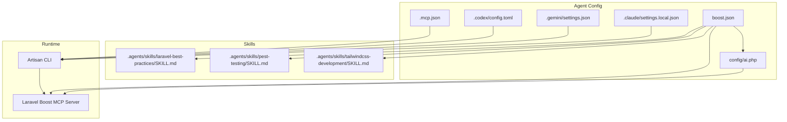
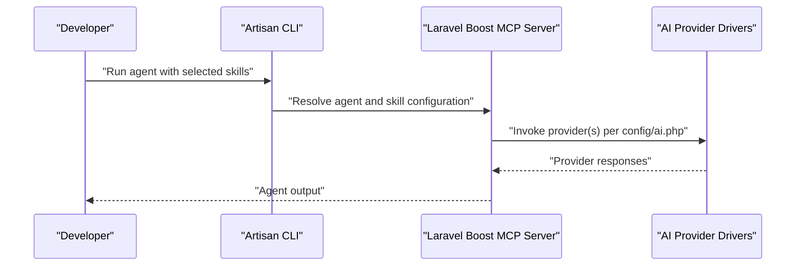
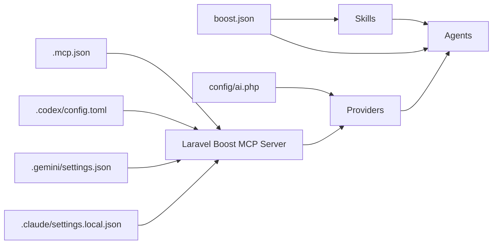

# Agent Configuration

<cite>
**Referenced Files in This Document**
- [boost.json](file://boost.json)
- [ai.php](file://config/ai.php)
- [.mcp.json](file://.mcp.json)
- [.codex/config.toml](file://.codex/config.toml)
- [.gemini/settings.json](file://.gemini/settings.json)
- [.claude/settings.local.json](file://.claude/settings.local.json)
- [SKILL.md (laravel-best-practices)](file://.agents/skills/laravel-best-practices/SKILL.md)
- [SKILL.md (pest-testing)](file://.agents/skills/pest-testing/SKILL.md)
- [SKILL.md (tailwindcss-development)](file://.agents/skills/tailwindcss-development/SKILL.md)
- [composer.json](file://composer.json)
- [AGENTS.md](file://AGENTS.md)
- [CLAUDE.md](file://CLAUDE.md)
- [GEMINI.md](file://GEMINI.md)
</cite>

## Table of Contents
1. [Introduction](#introduction)
2. [Project Structure](#project-structure)
3. [Core Components](#core-components)
4. [Architecture Overview](#architecture-overview)
5. [Detailed Component Analysis](#detailed-component-analysis)
6. [Dependency Analysis](#dependency-analysis)
7. [Performance Considerations](#performance-considerations)
8. [Security and Best Practices](#security-and-best-practices)
9. [Configuration Versioning, Backup, and Migration](#configuration-versioning-backup-and-migration)
10. [Troubleshooting Guide](#troubleshooting-guide)
11. [Conclusion](#conclusion)

## Introduction
This document explains Agent Configuration for Laravel Boost, focusing on how boost.json defines agent and skill activation, how environment variables integrate with AI provider settings in config/ai.php, and how MCP client configurations connect to the Laravel Boost MCP server. It provides practical guidance for validating configuration, managing skill dependencies, handling environment-specific settings, securing sensitive data, and migrating configurations across environments.

## Project Structure
Agent configuration spans several files:
- boost.json: Declares enabled agents and skills, plus global toggles.
- config/ai.php: Centralizes AI provider drivers, keys, and defaults.
- MCP client configs (.mcp.json, .codex/config.toml, .gemini/settings.json, .claude/settings.local.json): Bind local AI clients to the Laravel Boost MCP server.
- Skill metadata files (.agents/skills/*/SKILL.md): Define skill capabilities and recommended usage.
- Composer scripts and package metadata: Drive installation, updates, and Boost integration.

**Diagram sources**
- [boost.json](file://boost.json)
- [ai.php](file://config/ai.php)
- [.mcp.json](file://.mcp.json)
- [.codex/config.toml](file://.codex/config.toml)
- [.gemini/settings.json](file://.gemini/settings.json)
- [.claude/settings.local.json](file://.claude/settings.local.json)
- [SKILL.md (laravel-best-practices)](file://.agents/skills/laravel-best-practices/SKILL.md)
- [SKILL.md (pest-testing)](file://.agents/skills/pest-testing/SKILL.md)
- [SKILL.md (tailwindcss-development)](file://.agents/skills/tailwindcss-development/SKILL.md)

**Section sources**
- [boost.json](file://boost.json)
- [ai.php](file://config/ai.php)
- [.mcp.json](file://.mcp.json)
- [.codex/config.toml](file://.codex/config.toml)
- [.gemini/settings.json](file://.gemini/settings.json)
- [.claude/settings.local.json](file://.claude/settings.local.json)
- [SKILL.md (laravel-best-practices)](file://.agents/skills/laravel-best-practices/SKILL.md)
- [SKILL.md (pest-testing)](file://.agents/skills/pest-testing/SKILL.md)
- [SKILL.md (tailwindcss-development)](file://.agents/skills/tailwindcss-development/SKILL.md)

## Core Components
- boost.json
  - Defines agents, skills, and global toggles (guidelines, MCP, nightwatch_mcp, sail).
  - Controls which skills are active for the agent runtime.
- config/ai.php
  - Declares default providers for different modalities (text, images, audio, embeddings, reranking).
  - Lists provider drivers and credentials via environment variables.
  - Supports caching strategies for embeddings.
- MCP client configs
  - Point Claude, Gemini, Codex, and local MCP to the Laravel Boost MCP server via Artisan command.
- Skill metadata
  - Documents skill scope, triggers, and recommended usage patterns.

**Section sources**
- [boost.json](file://boost.json)
- [ai.php](file://config/ai.php)
- [.mcp.json](file://.mcp.json)
- [.codex/config.toml](file://.codex/config.toml)
- [.gemini/settings.json](file://.gemini/settings.json)
- [.claude/settings.local.json](file://.claude/settings.local.json)
- [SKILL.md (laravel-best-practices)](file://.agents/skills/laravel-best-practices/SKILL.md)
- [SKILL.md (pest-testing)](file://.agents/skills/pest-testing/SKILL.md)
- [SKILL.md (tailwindcss-development)](file://.agents/skills/tailwindcss-development/SKILL.md)

## Architecture Overview
The agent configuration pipeline connects user-defined settings to runtime behavior:
- boost.json selects agents and skills.
- config/ai.php supplies provider credentials and defaults.
- MCP client configs bind external AI tools to the Laravel Boost MCP server.
- Composer scripts and package metadata ensure Boost is updated and available.

**Diagram sources**
- [boost.json](file://boost.json)
- [ai.php](file://config/ai.php)
- [.mcp.json](file://.mcp.json)
- [composer.json](file://composer.json)

**Section sources**
- [boost.json](file://boost.json)
- [ai.php](file://config/ai.php)
- [.mcp.json](file://.mcp.json)
- [composer.json](file://composer.json)

## Detailed Component Analysis

### boost.json: Agents, Skills, and Global Toggles
- Agents: List of agent identifiers enabled for the project.
- Skills: List of skill identifiers activated for the agent runtime.
- Global toggles:
  - guidelines: Whether foundational rules apply.
  - mcp: Whether MCP features are enabled.
  - nightwatch_mcp: Nightwatch MCP integration toggle.
  - sail: Sail environment toggle.
- Implications:
  - Disabling mcp or nightwatch_mcp affects MCP-enabled clients.
  - Disabling sail may alter environment-specific behavior.

Practical customization examples (conceptual):
- Add a new agent identifier to enable a new MCP-capable agent.
- Add a skill identifier to activate domain-specific guidance.
- Toggle sail to align with Docker-based environments.

**Section sources**
- [boost.json](file://boost.json)

### config/ai.php: AI Provider Settings and Defaults
- Defaults:
  - default: Default provider for general text tasks.
  - default_for_images, default_for_audio, default_for_transcription, default_for_embeddings, default_for_reranking: Modality-specific defaults.
- Caching:
  - embeddings: Toggle and store selection via environment variables.
- Providers:
  - Each provider defines driver, key, and optional URL/version/deployment fields.
  - Keys and endpoints are sourced from environment variables for security and environment separation.

Environment variable integration:
- Use environment variables to switch providers, override endpoints, and manage keys per environment.
- Example patterns:
  - Set ANTHROPIC_API_KEY for Anthropic.
  - Set OPENAI_URL to target a custom OpenAI-compatible endpoint.
  - Set AZURE_OPENAI_URL and AZURE_OPENAI_API_VERSION for Azure OpenAI.

Validation and error handling:
- Ensure required environment variables are present before invoking providers.
- Validate provider names against the configured list.
- Use modality-specific defaults to avoid misrouting requests.

**Section sources**
- [ai.php](file://config/ai.php)

### MCP Client Configurations
- .mcp.json: Generic MCP server binding for Laravel Boost.
- .codex/config.toml: Codex MCP server configuration with working directory.
- .gemini/settings.json: Gemini MCP server configuration.
- .claude/settings.local.json: Claude local settings enabling MCP servers.

Integration:
- Clients launch the Laravel Boost MCP server via the Artisan command.
- Ensure the Artisan command resolves to the current project’s server.

**Section sources**
- [.mcp.json](file://.mcp.json)
- [.codex/config.toml](file://.codex/config.toml)
- [.gemini/settings.json](file://.gemini/settings.json)
- [.claude/settings.local.json](file://.claude/settings.local.json)

### Skill Metadata and Dependency Management
- laravel-best-practices:
  - Scope: Backend Laravel PHP code patterns.
  - Triggers: Queries, caching, security, validation, error handling, queues, routing, architecture.
- pest-testing:
  - Scope: Pest PHP testing in Laravel projects.
  - Triggers: Writing, editing, fixing, converting tests; browser and smoke testing.
- tailwindcss-development:
  - Scope: Tailwind CSS v4 utility classes in HTML templates.
  - Triggers: Grids, flex layouts, dark mode, spacing, typography.

Skill dependency management:
- Activate relevant skills before working in a domain to ensure accurate guidance.
- Use skill triggers to prompt the agent to apply best practices or testing patterns.

**Section sources**
- [SKILL.md (laravel-best-practices)](file://.agents/skills/laravel-best-practices/SKILL.md)
- [SKILL.md (pest-testing)](file://.agents/skills/pest-testing/SKILL.md)
- [SKILL.md (tailwindcss-development)](file://.agents/skills/tailwindcss-development/SKILL.md)

### Environment-Specific Settings
- Use environment variables to tailor provider endpoints and keys per environment.
- Example strategies:
  - Local: Use Ollama base URL for local inference.
  - Staging: Override provider URLs to staging endpoints.
  - Production: Lock down keys and disable debug features.

Validation tips:
- Confirm environment variables are loaded and not empty.
- Verify provider defaults align with intended modality routing.

**Section sources**
- [ai.php](file://config/ai.php)

### Composer Scripts and Package Integration
- Composer scripts:
  - setup: Installs dependencies, prepares .env, generates app key, migrates DB, installs npm dependencies, and builds assets.
  - dev: Runs server, queue listener, logs, and Vite concurrently.
  - post-update-cmd: Publishes assets and runs boost:update to keep agent assets current.
- Package metadata:
  - laravel/boost is included as a dev dependency, ensuring Boost tools are available.

Implications:
- After dependency updates, run boost:update to refresh agent assets.
- Use dev script to run a full local stack with Boost MCP server.

**Section sources**
- [composer.json](file://composer.json)

## Dependency Analysis
Agent configuration depends on:
- boost.json for agent and skill selection.
- config/ai.php for provider credentials and defaults.
- MCP client configs for connecting external tools to the Laravel Boost MCP server.
- Skill metadata for domain-specific guidance.
- Composer scripts for lifecycle management and updates.

**Diagram sources**
- [boost.json](file://boost.json)
- [ai.php](file://config/ai.php)
- [.mcp.json](file://.mcp.json)
- [.codex/config.toml](file://.codex/config.toml)
- [.gemini/settings.json](file://.gemini/settings.json)
- [.claude/settings.local.json](file://.claude/settings.local.json)

**Section sources**
- [boost.json](file://boost.json)
- [ai.php](file://config/ai.php)
- [.mcp.json](file://.mcp.json)
- [.codex/config.toml](file://.codex/config.toml)
- [.gemini/settings.json](file://.gemini/settings.json)
- [.claude/settings.local.json](file://.claude/settings.local.json)

## Performance Considerations
- Embedding caching:
  - Configure embedding cache store and toggle via config/ai.php to reduce latency and cost.
- Provider routing:
  - Use modality-specific defaults to avoid unnecessary provider switches.
- Local inference:
  - For local development, consider Ollama or compatible endpoints to reduce network overhead.

[No sources needed since this section provides general guidance]

## Security and Best Practices
- Sensitive data handling:
  - Store API keys in environment variables; do not commit .env or secrets to version control.
  - Use encrypted model casts for sensitive database fields.
- Provider isolation:
  - Keep provider keys scoped to intended environments; avoid reusing keys across environments.
- MCP exposure:
  - Restrict MCP server access to trusted clients and networks.
- Validation:
  - Validate presence and format of environment variables during setup and CI checks.
- Least privilege:
  - Limit provider permissions to required scopes.

**Section sources**
- [ai.php](file://config/ai.php)
- [SKILL.md (laravel-best-practices)](file://.agents/skills/laravel-best-practices/SKILL.md)

## Configuration Versioning, Backup, and Migration
- Versioning:
  - Track boost.json and config/ai.php in version control alongside application code.
  - Use semantic versioning for breaking changes to provider configurations.
- Backup:
  - Back up .env and any environment-specific overrides.
  - Archive MCP client configs for reproducibility.
- Migration:
  - When moving between environments, copy environment variables and update provider URLs accordingly.
  - Validate provider defaults and caches after migration.
  - Re-run boost:update after dependency updates to refresh agent assets.

**Section sources**
- [boost.json](file://boost.json)
- [ai.php](file://config/ai.php)
- [composer.json](file://composer.json)

## Troubleshooting Guide
Common issues and resolutions:
- Missing API keys:
  - Symptom: Provider calls fail or throw configuration errors.
  - Resolution: Set required environment variables for the chosen provider(s).
- Incorrect provider defaults:
  - Symptom: Unexpected provider usage for a given modality.
  - Resolution: Adjust default keys in config/ai.php and confirm modality-specific defaults.
- MCP server not reachable:
  - Symptom: External clients cannot connect to Laravel Boost MCP server.
  - Resolution: Verify MCP client configs point to the correct Artisan command and working directory; ensure the Artisan command is available in the environment.
- Skills not activating:
  - Symptom: Guidance not aligned with the intended domain.
  - Resolution: Confirm skill identifiers in boost.json match the skill metadata and that the skill triggers are present in prompts.
- Environment mismatch:
  - Symptom: Unexpected endpoints or keys in production.
  - Resolution: Review environment variables and ensure they are loaded correctly; confirm provider URLs and keys per environment.

**Section sources**
- [ai.php](file://config/ai.php)
- [.mcp.json](file://.mcp.json)
- [.codex/config.toml](file://.codex/config.toml)
- [.gemini/settings.json](file://.gemini/settings.json)
- [.claude/settings.local.json](file://.claude/settings.local.json)
- [boost.json](file://boost.json)
- [SKILL.md (laravel-best-practices)](file://.agents/skills/laravel-best-practices/SKILL.md)
- [SKILL.md (pest-testing)](file://.agents/skills/pest-testing/SKILL.md)
- [SKILL.md (tailwindcss-development)](file://.agents/skills/tailwindcss-development/SKILL.md)

## Conclusion
Agent Configuration in Laravel Boost centers on three pillars: agent and skill selection via boost.json, secure and environment-aware provider settings in config/ai.php, and MCP client bindings that connect external AI tools to the Laravel Boost MCP server. By validating environment variables, activating relevant skills, and maintaining consistent configuration across environments, teams can reliably operate agents with predictable behavior and strong security posture.