# Agent Development Workflow

<cite>
**Referenced Files in This Document**
- [AGENTS.md](file://AGENTS.md)
- [CLAUDE.md](file://CLAUDE.md)
- [GEMINI.md](file://GEMINI.md)
- [boost.json](file://boost.json)
- [.mcp.json](file://.mcp.json)
- [.claude/settings.local.json](file://.claude/settings.local.json)
- [.codex/config.toml](file://.codex/config.toml)
- [config/ai.php](file://config/ai.php)
- [stubs/agent.stub](file://stubs/agent.stub)
- [database/migrations/2026_04_02_115916_create_agent_conversations_table.php](file://database/migrations/2026_04_02_115916_create_agent_conversations_table.php)
- [.agents/skills/laravel-best-practices/SKILL.md](file://.agents/skills/laravel-best-practices/SKILL.md)
- [.agents/skills/pest-testing/SKILL.md](file://.agents/skills/pest-testing/SKILL.md)
- [.agents/skills/tailwindcss-development/SKILL.md](file://.agents/skills/tailwindcss-development/SKILL.md)
- [composer.json](file://composer.json)
</cite>

## Table of Contents
1. [Introduction](#introduction)
2. [Project Structure](#project-structure)
3. [Core Components](#core-components)
4. [Architecture Overview](#architecture-overview)
5. [Detailed Component Analysis](#detailed-component-analysis)
6. [Dependency Analysis](#dependency-analysis)
7. [Performance Considerations](#performance-considerations)
8. [Troubleshooting Guide](#troubleshooting-guide)
9. [Conclusion](#conclusion)
10. [Appendices](#appendices)

## Introduction
This document explains the Agent Development Workflow for Laravel Boost integration and skill-based AI assistance. It covers the agent system architecture, how skills are activated and used, and how AI coding agents like Claude Code, Cursor, and GitHub Copilot integrate with Laravel development. It documents the skill system including Laravel best practices, Pest testing, and Tailwind CSS development skills, and provides concrete examples from the codebase showing agent interactions, code generation patterns, and development assistance features. It also explains the boost.json configuration, skill dependencies, and how to create custom agent skills. Finally, it addresses common agent-related issues, debugging techniques, and optimization strategies.

## Project Structure
The repository organizes agent-related assets and configuration across several areas:
- Agent guidelines and skill activation rules are documented in AGENTS.md and mirrored in CLAUDE.md and GEMINI.md for Claude and Gemini integrations.
- Agent skills are located under .agents/skills/<skill-name>/ with a SKILL.md per skill.
- Agent scaffolding templates are provided under stubs/.
- Agent conversations and messages are persisted via Laravel Boost’s migration.
- MCP server configuration is centralized in .mcp.json and client-side enablement is configured for Claude and Codex.
- AI provider configuration is defined in config/ai.php.
- Agent selection and skill activation are controlled by boost.json.

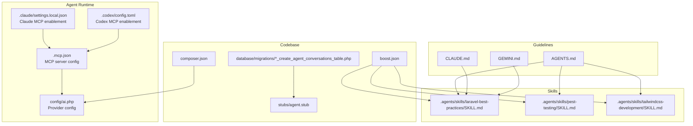

**Diagram sources**
- [.mcp.json:1-11](file://.mcp.json#L1-L11)
- [.claude/settings.local.json:1-7](file://.claude/settings.local.json#L1-L7)
- [.codex/config.toml:1-5](file://.codex/config.toml#L1-L5)
- [config/ai.php:1-132](file://config/ai.php#L1-L132)
- [.agents/skills/laravel-best-practices/SKILL.md:1-190](file://.agents/skills/laravel-best-practices/SKILL.md#L1-L190)
- [.agents/skills/pest-testing/SKILL.md:1-157](file://.agents/skills/pest-testing/SKILL.md#L1-L157)
- [.agents/skills/tailwindcss-development/SKILL.md:1-119](file://.agents/skills/tailwindcss-development/SKILL.md#L1-L119)
- [AGENTS.md:1-155](file://AGENTS.md#L1-L155)
- [CLAUDE.md:1-155](file://CLAUDE.md#L1-L155)
- [GEMINI.md:1-155](file://GEMINI.md#L1-L155)
- [database/migrations/2026_04_02_115916_create_agent_conversations_table.php:1-51](file://database/migrations/2026_04_02_115916_create_agent_conversations_table.php#L1-L51)
- [stubs/agent.stub:1-45](file://stubs/agent.stub#L1-L45)
- [boost.json:1-17](file://boost.json#L1-L17)
- [composer.json:1-93](file://composer.json#L1-L93)

**Section sources**
- [AGENTS.md:1-155](file://AGENTS.md#L1-L155)
- [boost.json:1-17](file://boost.json#L1-L17)
- [.mcp.json:1-11](file://.mcp.json#L1-L11)
- [.claude/settings.local.json:1-7](file://.claude/settings.local.json#L1-L7)
- [.codex/config.toml:1-5](file://.codex/config.toml#L1-L5)
- [config/ai.php:1-132](file://config/ai.php#L1-L132)
- [stubs/agent.stub:1-45](file://stubs/agent.stub#L1-L45)
- [database/migrations/2026_04_02_115916_create_agent_conversations_table.php:1-51](file://database/migrations/2026_04_02_115916_create_agent_conversations_table.php#L1-L51)
- [composer.json:1-93](file://composer.json#L1-L93)

## Core Components
- Agent guidelines and skill activation rules: AGENTS.md defines foundational rules, skills activation triggers, Boost tools, documentation search syntax, Artisan usage, Tinker guidance, PHP and Laravel coding standards, URL generation, testing conventions, Vite error handling, Pint formatting, and Pest usage.
- Skill system: Three skills are enabled by default:
  - laravel-best-practices: Guides Laravel backend PHP code patterns, performance, security, caching, Eloquent, validation, configuration, testing, queues, routing, HTTP client, events/notifications/mail, error handling, scheduling, architecture, migrations, collections, Blade, and conventions.
  - pest-testing: Focuses on Pest PHP testing in Laravel projects, covering test creation, organization, assertions, mocking, datasets, browser testing, smoke testing, visual regression, sharding, architecture testing, and common pitfalls.
  - tailwindcss-development: Provides Tailwind CSS v4 guidance for responsive layouts, dark mode, spacing, and common patterns, with CSS-first configuration and v4-specific utilities.
- Agent scaffolding: The agent.stub template demonstrates the contract-based agent interface and how to implement instructions, messages, and tools.
- Agent conversation persistence: The migration creates tables for agent conversations and messages, enabling persistent history and tool-call/result tracking.
- MCP server and clients: The Laravel Boost MCP server is launched via Artisan and enabled in Claude and Codex configurations. The server is defined centrally in .mcp.json and referenced by client settings.
- AI provider configuration: config/ai.php centralizes provider drivers, keys, and defaults for text, images, audio, transcription, embeddings, and reranking.

**Section sources**
- [AGENTS.md:24-153](file://AGENTS.md#L24-L153)
- [.agents/skills/laravel-best-practices/SKILL.md:1-190](file://.agents/skills/laravel-best-practices/SKILL.md#L1-L190)
- [.agents/skills/pest-testing/SKILL.md:1-157](file://.agents/skills/pest-testing/SKILL.md#L1-L157)
- [.agents/skills/tailwindcss-development/SKILL.md:1-119](file://.agents/skills/tailwindcss-development/SKILL.md#L1-L119)
- [stubs/agent.stub:13-44](file://stubs/agent.stub#L13-L44)
- [database/migrations/2026_04_02_115916_create_agent_conversations_table.php:14-39](file://database/migrations/2026_04_02_115916_create_agent_conversations_table.php#L14-L39)
- [.mcp.json:1-11](file://.mcp.json#L1-L11)
- [.claude/settings.local.json:1-7](file://.claude/settings.local.json#L1-L7)
- [.codex/config.toml:1-5](file://.codex/config.toml#L1-L5)
- [config/ai.php:16-129](file://config/ai.php#L16-L129)

## Architecture Overview
The agent workflow integrates AI providers, MCP tooling, and Laravel-specific skills to assist with Laravel development. The system is orchestrated by Boost and guided by project-specific rules.

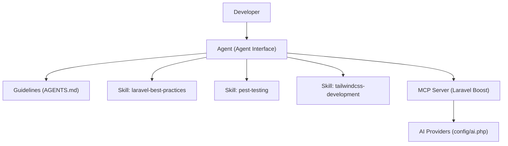

**Diagram sources**
- [AGENTS.md:1-155](file://AGENTS.md#L1-L155)
- [.agents/skills/laravel-best-practices/SKILL.md:1-190](file://.agents/skills/laravel-best-practices/SKILL.md#L1-L190)
- [.agents/skills/pest-testing/SKILL.md:1-157](file://.agents/skills/pest-testing/SKILL.md#L1-L157)
- [.agents/skills/tailwindcss-development/SKILL.md:1-119](file://.agents/skills/tailwindcss-development/SKILL.md#L1-L119)
- [.mcp.json:1-11](file://.mcp.json#L1-L11)
- [config/ai.php:1-132](file://config/ai.php#L1-L132)

## Detailed Component Analysis

### Agent System Architecture
The agent system is contract-driven and integrates with Laravel’s AI ecosystem. Agents implement instructions, messages, and tools, and can leverage Boost MCP tools and Laravel skills.

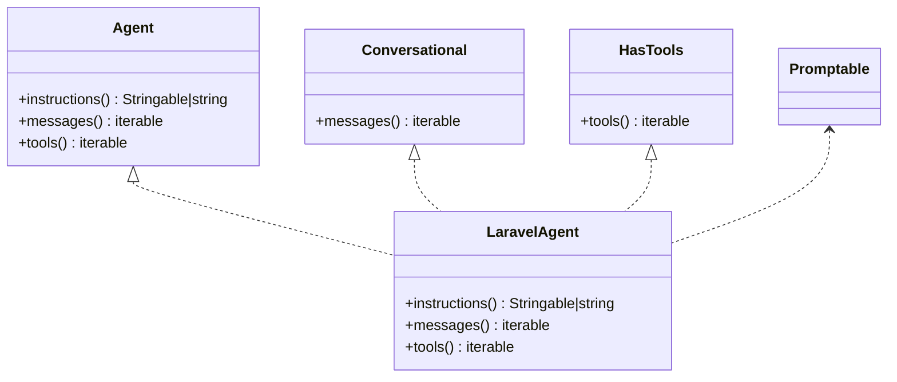

**Diagram sources**
- [stubs/agent.stub:13-44](file://stubs/agent.stub#L13-L44)

**Section sources**
- [stubs/agent.stub:13-44](file://stubs/agent.stub#L13-L44)

### Skill Activation and Usage Patterns
Skills are activated based on user intent and project context. The guidelines specify when to trigger each skill and how to apply them.

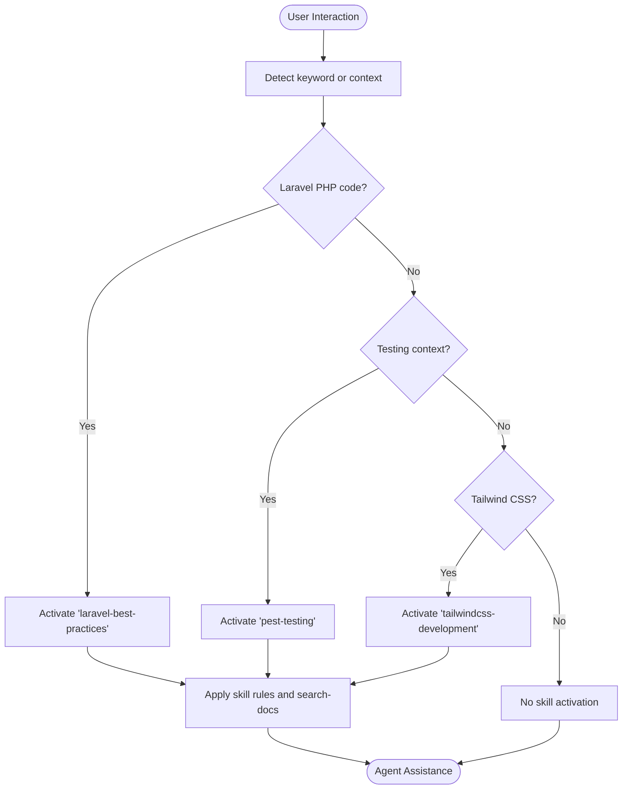

**Diagram sources**
- [AGENTS.md:24-31](file://AGENTS.md#L24-L31)
- [.agents/skills/laravel-best-practices/SKILL.md:1-190](file://.agents/skills/laravel-best-practices/SKILL.md#L1-L190)
- [.agents/skills/pest-testing/SKILL.md:1-157](file://.agents/skills/pest-testing/SKILL.md#L1-L157)
- [.agents/skills/tailwindcss-development/SKILL.md:1-119](file://.agents/skills/tailwindcss-development/SKILL.md#L1-L119)

**Section sources**
- [AGENTS.md:24-31](file://AGENTS.md#L24-L31)
- [.agents/skills/laravel-best-practices/SKILL.md:1-190](file://.agents/skills/laravel-best-practices/SKILL.md#L1-L190)
- [.agents/skills/pest-testing/SKILL.md:1-157](file://.agents/skills/pest-testing/SKILL.md#L1-L157)
- [.agents/skills/tailwindcss-development/SKILL.md:1-119](file://.agents/skills/tailwindcss-development/SKILL.md#L1-L119)

### Agent Interactions and Code Generation Patterns
Agent interactions leverage Boost tools and Laravel skills to guide code generation and refactoring. The guidelines emphasize using Boost tools for database queries, schema inspection, URL resolution, and browser logs, and using search-docs to scope Laravel documentation to installed versions.

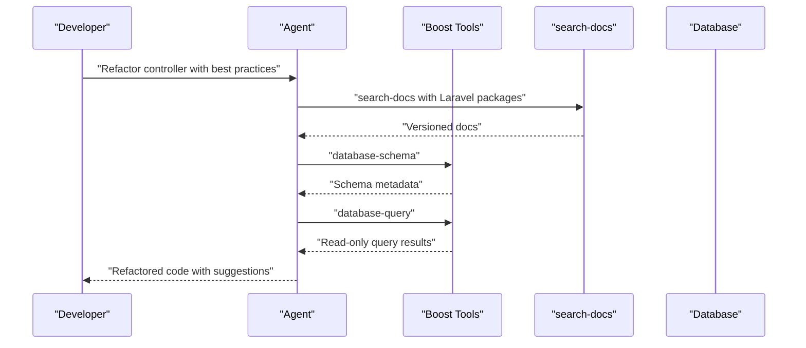

**Diagram sources**
- [AGENTS.md:71-90](file://AGENTS.md#L71-L90)
- [config/ai.php:16-129](file://config/ai.php#L16-L129)

**Section sources**
- [AGENTS.md:71-90](file://AGENTS.md#L71-L90)
- [config/ai.php:16-129](file://config/ai.php#L16-L129)

### Laravel Best Practices Skill
The laravel-best-practices skill provides a comprehensive quick reference across 19 categories, each pointing to detailed rule files. It emphasizes consistency with existing code, performance (N+1 prevention, indexing, chunking), security (authorization, validation, encrypted casts), caching strategies, Eloquent patterns, validation, configuration, testing patterns, queue/job patterns, routing/controllers, HTTP client usage, events/notifications/mail, error handling, scheduling, architecture, migrations, collections, Blade, and conventions.

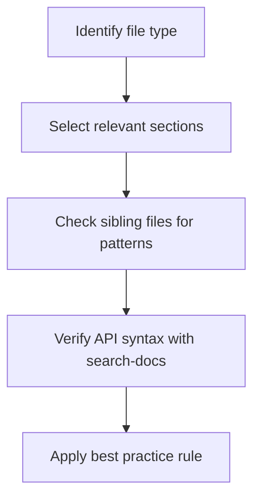

**Diagram sources**
- [.agents/skills/laravel-best-practices/SKILL.md:184-190](file://.agents/skills/laravel-best-practices/SKILL.md#L184-L190)

**Section sources**
- [.agents/skills/laravel-best-practices/SKILL.md:1-190](file://.agents/skills/laravel-best-practices/SKILL.md#L1-L190)

### Pest Testing Skill
The pest-testing skill focuses on Pest 4 features and Laravel testing conventions. It covers creating tests with php artisan make:test --pest, organizing tests in Feature/Unit/Browser directories, using specific assertions, mocking, datasets, browser testing with visit/click/fill, smoke testing, visual regression, sharding, and architecture testing.

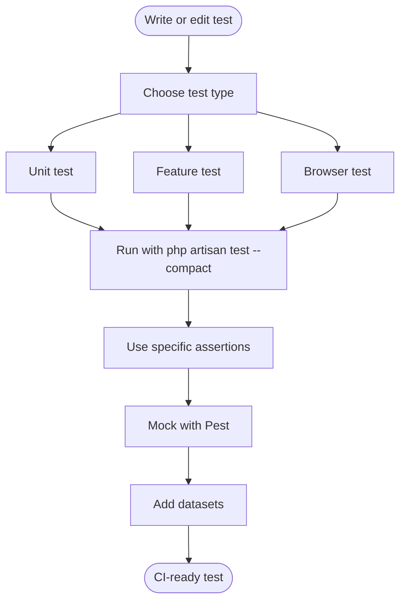

**Diagram sources**
- [.agents/skills/pest-testing/SKILL.md:17-41](file://.agents/skills/pest-testing/SKILL.md#L17-L41)

**Section sources**
- [.agents/skills/pest-testing/SKILL.md:1-157](file://.agents/skills/pest-testing/SKILL.md#L1-L157)

### Tailwind CSS Development Skill
The tailwindcss-development skill guides Tailwind CSS v4 usage, emphasizing CSS-first configuration with @theme, replacing @tailwind directives with @import "tailwindcss", and avoiding deprecated utilities. It includes patterns for spacing with gap, dark mode variants, flexbox, and grid layouts.

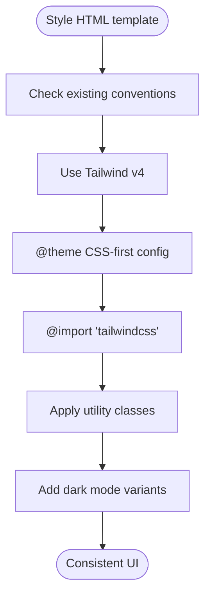

**Diagram sources**
- [.agents/skills/tailwindcss-development/SKILL.md:26-47](file://.agents/skills/tailwindcss-development/SKILL.md#L26-L47)

**Section sources**
- [.agents/skills/tailwindcss-development/SKILL.md:1-119](file://.agents/skills/tailwindcss-development/SKILL.md#L1-L119)

### Agent Conversation Persistence
Agent conversations and messages are persisted in dedicated tables, enabling tool-call/result tracking and usage analytics. The schema includes indexes for efficient querying by user and timestamps.

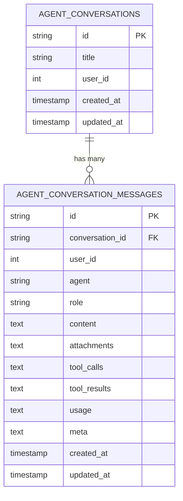

**Diagram sources**
- [database/migrations/2026_04_02_115916_create_agent_conversations_table.php:14-39](file://database/migrations/2026_04_02_115916_create_agent_conversations_table.php#L14-L39)

**Section sources**
- [database/migrations/2026_04_02_115916_create_agent_conversations_table.php:1-51](file://database/migrations/2026_04_02_115916_create_agent_conversations_table.php#L1-L51)

### Boost Configuration and Skill Dependencies
The boost.json file defines which agents are enabled, whether guidelines and MCP are active, and which skills are included. The skills themselves are organized under .agents/skills/<skill-name>/SKILL.md.

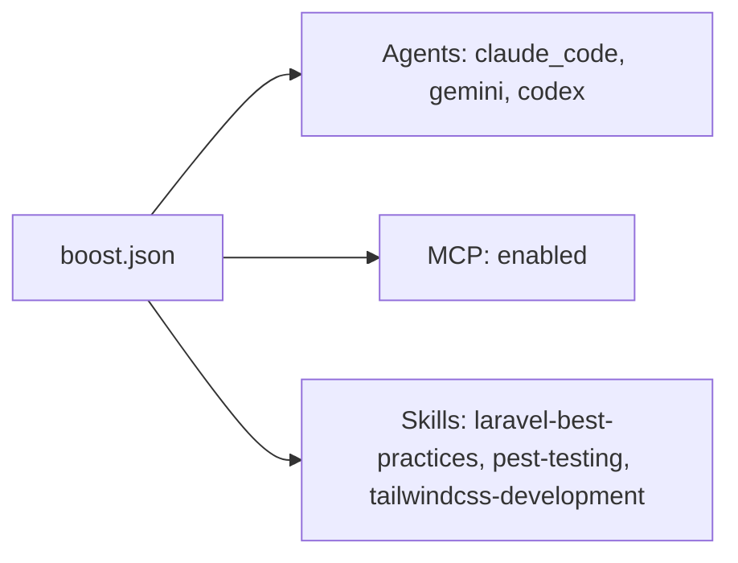

**Diagram sources**
- [boost.json:1-17](file://boost.json#L1-L17)

**Section sources**
- [boost.json:1-17](file://boost.json#L1-L17)

### MCP Server Integration
The MCP server is defined in .mcp.json and launched via php artisan boost:mcp. Clients (Claude and Codex) enable the server globally or per-project.

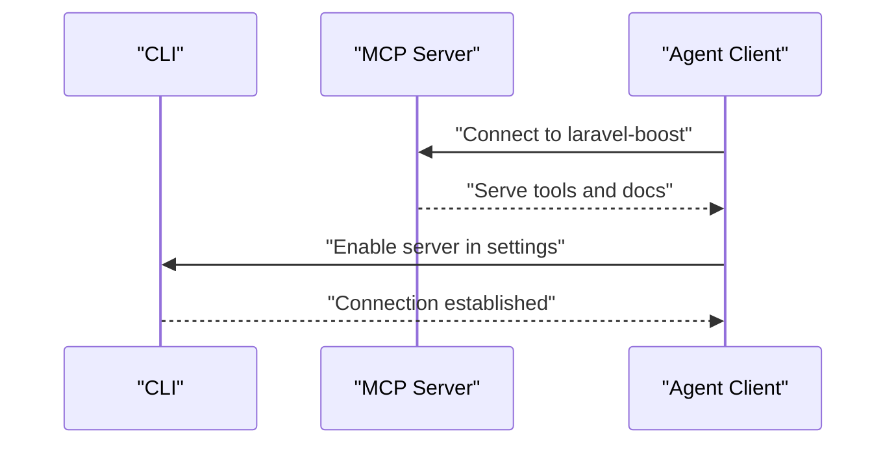

**Diagram sources**
- [.mcp.json:1-11](file://.mcp.json#L1-L11)
- [.claude/settings.local.json:1-7](file://.claude/settings.local.json#L1-L7)
- [.codex/config.toml:1-5](file://.codex/config.toml#L1-L5)

**Section sources**
- [.mcp.json:1-11](file://.mcp.json#L1-L11)
- [.claude/settings.local.json:1-7](file://.claude/settings.local.json#L1-L7)
- [.codex/config.toml:1-5](file://.codex/config.toml#L1-L5)

### AI Provider Configuration
The config/ai.php file centralizes provider drivers and keys, including Anthropic, Azure OpenAI, Cohere, DeepSeek, ElevenLabs, Gemini, Groq, Jina, Mistral, Ollama, OpenAI, OpenRouter, VoyageAI, and xAI. Defaults are set for text, images, audio, transcription, embeddings, and reranking.

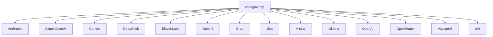

**Diagram sources**
- [config/ai.php:52-129](file://config/ai.php#L52-L129)

**Section sources**
- [config/ai.php:16-129](file://config/ai.php#L16-L129)

### Creating Custom Agent Skills
To create a custom agent skill:
1. Create a directory under .agents/skills/<your-skill-name>/.
2. Add a SKILL.md with metadata, description, and usage guidance.
3. Optionally include rule-specific markdown files under rules/.
4. Update boost.json to include the new skill in the skills array.
5. Ensure the skill’s activation triggers align with your workflow.

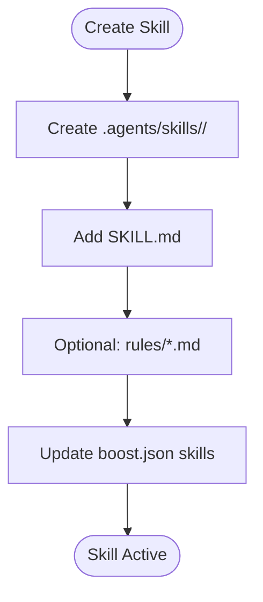

**Diagram sources**
- [boost.json:11-15](file://boost.json#L11-L15)

**Section sources**
- [boost.json:11-15](file://boost.json#L11-L15)

## Dependency Analysis
The agent workflow depends on Laravel Boost, Laravel AI, and Laravel packages. Composer scripts orchestrate setup, dev, and test flows, while Boost updates are executed post-update.

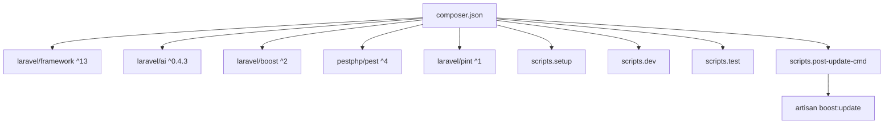

**Diagram sources**
- [composer.json:11-26](file://composer.json#L11-L26)
- [composer.json:39-74](file://composer.json#L39-L74)

**Section sources**
- [composer.json:11-26](file://composer.json#L11-L26)
- [composer.json:39-74](file://composer.json#L39-L74)

## Performance Considerations
- Prefer Boost tools over manual shell commands or file reads to reduce overhead and improve reliability.
- Use database-query for read-only operations and database-schema for pre-writing migrations or models.
- Use search-docs scoped to installed packages to minimize irrelevant results and speed up decision-making.
- Leverage Pest’s architecture testing and sharding to optimize CI runtime.
- Apply Laravel best practices to prevent N+1 queries, use chunking for large datasets, and employ caching strategies to reduce latency.

[No sources needed since this section provides general guidance]

## Troubleshooting Guide
Common issues and resolutions:
- Vite manifest errors: If frontend changes are not reflected, run npm run build or npm run dev, or use composer run dev as indicated by the guidelines.
- Missing frontend assets: Ensure proper bundling and rebuild steps are executed.
- Agent conversation persistence: Verify agent_conversations and agent_conversation_messages tables exist and are indexed appropriately.
- MCP connectivity: Confirm laravel-boost MCP server is enabled in client settings and launched via php artisan boost:mcp.
- Formatting: After modifying PHP files, run vendor/bin/pint --format agent to ensure style compliance.
- Testing: Use php artisan test --compact for minimal runs and filter with --filter for targeted debugging.

**Section sources**
- [AGENTS.md:135-137](file://AGENTS.md#L135-L137)
- [database/migrations/2026_04_02_115916_create_agent_conversations_table.php:14-39](file://database/migrations/2026_04_02_115916_create_agent_conversations_table.php#L14-L39)
- [.claude/settings.local.json:1-7](file://.claude/settings.local.json#L1-L7)
- [.codex/config.toml:1-5](file://.codex/config.toml#L1-L5)
- [AGENTS.md:143-144](file://AGENTS.md#L143-L144)
- [AGENTS.md:150-151](file://AGENTS.md#L150-L151)

## Conclusion
The Agent Development Workflow integrates Laravel Boost, MCP tools, and skill-based AI assistance to streamline Laravel development. By activating the appropriate skills, leveraging Boost tools, and following Laravel best practices, Pest testing, and Tailwind CSS conventions, developers can achieve efficient, reliable, and consistent AI-assisted development. The configuration in boost.json, MCP settings, and provider setup in config/ai.php provide a robust foundation for agent-driven development.

[No sources needed since this section summarizes without analyzing specific files]

## Appendices
- Agent stub reference: Use stubs/agent.stub as a blueprint for implementing agents with instructions, messages, and tools.
- Skill quick reference: Consult .agents/skills/*/SKILL.md for activation triggers and rule sets.
- Provider defaults: Review config/ai.php for default providers and driver configurations.

**Section sources**
- [stubs/agent.stub:13-44](file://stubs/agent.stub#L13-L44)
- [.agents/skills/laravel-best-practices/SKILL.md:1-190](file://.agents/skills/laravel-best-practices/SKILL.md#L1-L190)
- [.agents/skills/pest-testing/SKILL.md:1-157](file://.agents/skills/pest-testing/SKILL.md#L1-L157)
- [.agents/skills/tailwindcss-development/SKILL.md:1-119](file://.agents/skills/tailwindcss-development/SKILL.md#L1-L119)
- [config/ai.php:16-129](file://config/ai.php#L16-L129)