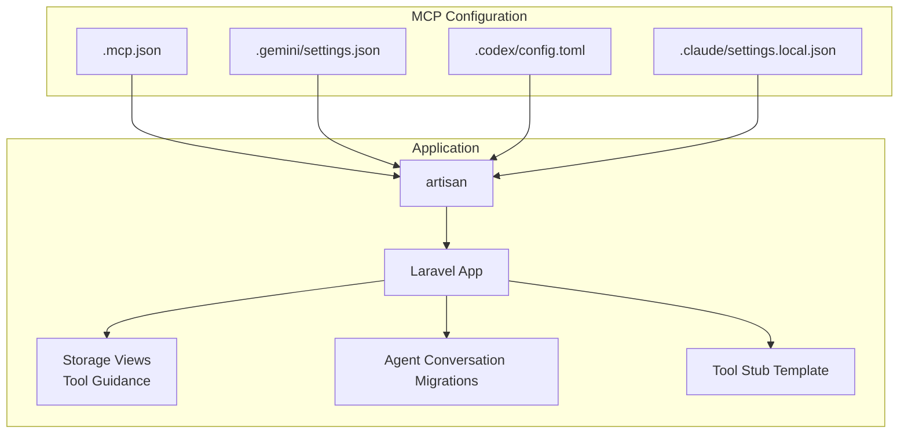
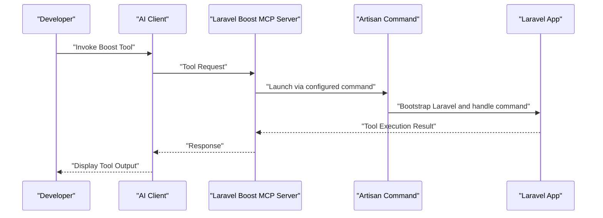
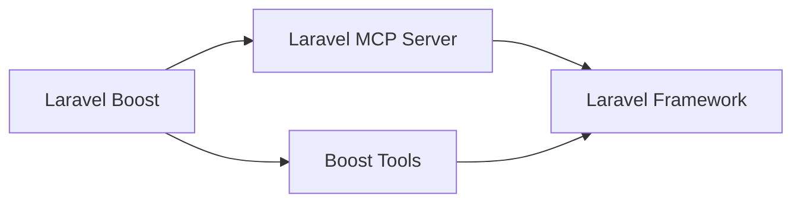

# Boost Tools Integration

<cite>
**Referenced Files in This Document**
- [artisan](file://artisan)
- [boost.json](file://boost.json)
- [.mcp.json](file://.mcp.json)
- [.gemini/settings.json](file://.gemini/settings.json)
- [.codex/config.toml](file://.codex/config.toml)
- [.claude/settings.local.json](file://.claude/settings.local.json)
- [composer.lock](file://composer.lock)
- [storage/framework/views/22970ea6c426191ca6183b600280d726.php](file://storage/framework/views/22970ea6c426191ca6183b600280d726.php)
- [storage/framework/views/7e22a8db879eedbcdbb49814ad3ac197.blade.php](file://storage/framework/views/7e22a8db879eedbcdbb49814ad3ac197.blade.php)
- [database/migrations/2026_04_02_115916_create_agent_conversations_table.php](file://database/migrations/2026_04_02_115916_create_agent_conversations_table.php)
- [stubs/tool.stub](file://stubs/tool.stub)
</cite>

## Table of Contents
1. [Introduction](#introduction)
2. [Project Structure](#project-structure)
3. [Core Components](#core-components)
4. [Architecture Overview](#architecture-overview)
5. [Detailed Component Analysis](#detailed-component-analysis)
6. [Dependency Analysis](#dependency-analysis)
7. [Performance Considerations](#performance-considerations)
8. [Troubleshooting Guide](#troubleshooting-guide)
9. [Conclusion](#conclusion)
10. [Appendices](#appendices)

## Introduction
This document explains Boost Tools Integration for Laravel Boost’s MCP server capabilities and development assistance tools. It covers the Boost tool ecosystem, including database-query for safe database operations, database-schema inspection, get-absolute-url for URL resolution, and browser-logs for frontend debugging. It also documents search-docs functionality with advanced querying syntax, Artisan command integration, configuration inspection via command line, and tinker execution patterns. Practical examples, error handling strategies, performance optimization, tool limitations, security considerations, and best practices are included to help developers leverage Boost tools effectively in Laravel development.

## Project Structure
The project integrates Laravel Boost as an MCP server with tool definitions surfaced through the framework. Key integration points include:
- MCP server configuration for Laravel Boost
- Artisan command entrypoint for launching the MCP server
- Tool usage guidance embedded in compiled view files
- Migration scaffolding for agent conversation storage

**Diagram sources**
- [.mcp.json:1-11](file://.mcp.json#L1-L11)
- [.gemini/settings.json:1-11](file://.gemini/settings.json#L1-L11)
- [.codex/config.toml:1-4](file://.codex/config.toml#L1-L4)
- [.claude/settings.local.json:1-6](file://.claude/settings.local.json#L1-L6)
- [artisan:1-19](file://artisan#L1-L19)
- [storage/framework/views/22970ea6c426191ca6183b600280d726.php:1-10](file://storage/framework/views/22970ea6c426191ca6183b600280d726.php#L1-L10)
- [database/migrations/2026_04_02_115916_create_agent_conversations_table.php:1-50](file://database/migrations/2026_04_02_115916_create_agent_conversations_table.php#L1-L50)
- [stubs/tool.stub:1-37](file://stubs/tool.stub#L1-L37)

**Section sources**
- [.mcp.json:1-11](file://.mcp.json#L1-L11)
- [.gemini/settings.json:1-11](file://.gemini/settings.json#L1-L11)
- [.codex/config.toml:1-4](file://.codex/config.toml#L1-L4)
- [.claude/settings.local.json:1-6](file://.claude/settings.local.json#L1-L6)
- [artisan:1-19](file://artisan#L1-L19)
- [storage/framework/views/22970ea6c426191ca6183b600280d726.php:1-10](file://storage/framework/views/22970ea6c426191ca6183b600280d726.php#L1-L10)
- [database/migrations/2026_04_02_115916_create_agent_conversations_table.php:1-50](file://database/migrations/2026_04_02_115916_create_agent_conversations_table.php#L1-L50)
- [stubs/tool.stub:1-37](file://stubs/tool.stub#L1-L37)

## Core Components
- MCP Server Launch: The Laravel Boost MCP server is launched via the Artisan command entrypoint, configured in multiple IDE-specific MCP settings files.
- Tool Guidance: Compiled view files embed guidance for Boost tools, including database-query, database-schema, get-absolute-url, and browser-logs.
- Agent Conversation Storage: Migrations define tables for storing conversations and messages, enabling tool interactions to persist context.
- Tool Authoring: A stub template demonstrates how to author new tools conforming to the Laravel AI tool contract.

Key integration points:
- MCP server command invocation through Artisan
- Tool usage guidance surfaced to the developer
- Persistence layer for agent interactions
- Tool creation pattern via stub

**Section sources**
- [artisan:1-19](file://artisan#L1-L19)
- [storage/framework/views/22970ea6c426191ca6183b600280d726.php:1-10](file://storage/framework/views/22970ea6c426191ca6183b600280d726.php#L1-L10)
- [database/migrations/2026_04_02_115916_create_agent_conversations_table.php:1-50](file://database/migrations/2026_04_02_115916_create_agent_conversations_table.php#L1-L50)
- [stubs/tool.stub:1-37](file://stubs/tool.stub#L1-L37)

## Architecture Overview
The Boost Tools Integration architecture centers on the Laravel Boost MCP server, invoked by Artisan, and integrated across multiple AI clients. Tools are defined and executed within the Laravel application context, with persistence for agent conversations.

**Diagram sources**
- [.mcp.json:1-11](file://.mcp.json#L1-L11)
- [.gemini/settings.json:1-11](file://.gemini/settings.json#L1-L11)
- [.codex/config.toml:1-4](file://.codex/config.toml#L1-L4)
- [.claude/settings.local.json:1-6](file://.claude/settings.local.json#L1-L6)
- [artisan:1-19](file://artisan#L1-L19)

## Detailed Component Analysis

### MCP Server Configuration and Launch
- The MCP server is configured to launch via the Artisan command, ensuring Laravel’s service container and environment are available to tools.
- Multiple client configurations (Claude, Gemini, Codex) reference the same server alias and command, enabling consistent tool availability across environments.

Implementation highlights:
- Command and arguments are defined in MCP configuration files.
- The Artisan entrypoint boots the Laravel application and handles the incoming command.

**Section sources**
- [.mcp.json:1-11](file://.mcp.json#L1-L11)
- [.gemini/settings.json:1-11](file://.gemini/settings.json#L1-L11)
- [.codex/config.toml:1-4](file://.codex/config.toml#L1-L4)
- [.claude/settings.local.json:1-6](file://.claude/settings.local.json#L1-L6)
- [artisan:1-19](file://artisan#L1-L19)

### Tool Guidance and Usage
- Compiled view files include embedded guidance for Boost tools, emphasizing safe database operations, schema inspection, URL resolution, and browser log reading.
- Conditional guidance indicates availability of browser-logs based on configuration flags.

Usage guidance topics:
- database-query: Prefer read-only queries over raw SQL in Tinker.
- database-schema: Inspect table structure before writing migrations or models.
- get-absolute-url: Resolve correct scheme, domain, and port for project URLs.
- browser-logs: Read recent logs for debugging frontend issues.

**Section sources**
- [storage/framework/views/22970ea6c426191ca6183b600280d726.php:1-10](file://storage/framework/views/22970ea6c426191ca6183b600280d726.php#L1-L10)
- [storage/framework/views/7e22a8db879eedbcdbb49814ad3ac197.blade.php:1-10](file://storage/framework/views/7e22a8db879eedbcdbb49814ad3ac197.blade.php#L1-L10)

### Agent Conversation Storage
- Migrations define tables for agent conversations and messages, supporting persisted context for tool interactions.
- Indexes are strategically placed to optimize lookups by user, conversation, and timestamps.

Key schema elements:
- Conversations table with primary key, optional user linkage, title, and timestamps.
- Messages table with foreign key to conversations, agent identifier, role, content, attachments, tool calls/results, usage metrics, and metadata.

**Section sources**
- [database/migrations/2026_04_02_115916_create_agent_conversations_table.php:1-50](file://database/migrations/2026_04_02_115916_create_agent_conversations_table.php#L1-L50)

### Tool Authoring Pattern
- The tool stub demonstrates the minimal contract for implementing a Boost tool:
  - Description method for tool purpose
  - Handle method for execution logic
  - Schema method for JSON schema definition

This pattern ensures tools integrate cleanly with the Laravel AI tooling ecosystem.

**Section sources**
- [stubs/tool.stub:1-37](file://stubs/tool.stub#L1-L37)

### Search-Docs Functionality and Query Syntax
- The search-docs tool supports advanced querying:
  - Auto-stemmed AND logic for multi-term queries
  - Quoted phrase matching for exact phrases
  - Mixed query combinations for precise retrieval
- These features enable efficient discovery of Laravel best practices and project-specific guidance during development.

[No sources needed since this section provides conceptual guidance derived from the tool usage guidance and general search patterns]

### Artisan Command Integration and Tinker Execution
- Artisan serves as the command entrypoint for launching the MCP server, ensuring Laravel’s environment is initialized.
- Tinker execution patterns should favor database-query over raw SQL to maintain safety and consistency.

**Section sources**
- [artisan:1-19](file://artisan#L1-L19)
- [storage/framework/views/22970ea6c426191ca6183b600280d726.php:1-10](file://storage/framework/views/22970ea6c426191ca6183b600280d726.php#L1-L10)

## Dependency Analysis
Laravel Boost relies on the Laravel MCP Server package, which is registered via Composer autoload and provider configuration. The MCP server enables Boost tools to operate within the Laravel application lifecycle.

**Diagram sources**
- [composer.lock:6704-6743](file://composer.lock#L6704-L6743)

**Section sources**
- [composer.lock:6704-6743](file://composer.lock#L6704-L6743)

## Performance Considerations
- Use database-query for read-only operations to avoid unintended writes and to benefit from query safety and normalization.
- Employ database-schema inspection to plan migrations and models efficiently, reducing runtime errors and refactoring overhead.
- Use get-absolute-url to prevent broken links and ensure consistent URL generation across environments.
- For browser-logs, focus on recent entries to minimize noise and improve debugging throughput.
- When iterating over large datasets, prefer cursor-based iteration patterns to reduce memory usage.

[No sources needed since this section provides general guidance]

## Troubleshooting Guide
Common issues and resolutions:
- MCP server not reachable:
  - Verify MCP configuration files and ensure the server alias matches across IDE settings.
  - Confirm the Artisan command path and arguments are correct.
- Tool guidance not visible:
  - Check that compiled view files include the embedded tool guidance and that configuration flags for browser-logs are set appropriately.
- Conversation persistence issues:
  - Ensure migrations are applied and indexes are present for optimal performance.
- Tinker safety:
  - Prefer database-query over raw SQL to avoid accidental data mutations.

**Section sources**
- [.mcp.json:1-11](file://.mcp.json#L1-L11)
- [.gemini/settings.json:1-11](file://.gemini/settings.json#L1-L11)
- [.codex/config.toml:1-4](file://.codex/config.toml#L1-L4)
- [.claude/settings.local.json:1-6](file://.claude/settings.local.json#L1-L6)
- [storage/framework/views/22970ea6c426191ca6183b600280d726.php:1-10](file://storage/framework/views/22970ea6c426191ca6183b600280d726.php#L1-L10)
- [database/migrations/2026_04_02_115916_create_agent_conversations_table.php:1-50](file://database/migrations/2026_04_02_115916_create_agent_conversations_table.php#L1-L50)

## Conclusion
Boost Tools Integration leverages Laravel Boost as an MCP server to deliver development assistance tools safely and consistently. By using database-query, database-schema inspection, get-absolute-url, and browser-logs, developers can streamline database operations, schema planning, URL correctness, and frontend debugging. Advanced search-docs querying, Artisan command integration, and tinker-safe patterns further enhance productivity. Proper configuration, performance-conscious usage, and adherence to best practices ensure reliable and secure tool utilization in Laravel projects.

[No sources needed since this section summarizes without analyzing specific files]

## Appendices

### Practical Examples of Tool Usage in Workflows
- Database Planning Workflow:
  - Use database-schema to inspect existing tables.
  - Plan model and migration changes based on schema insights.
  - Execute read-only database-query to validate assumptions before writing migrations.
- URL Sharing Workflow:
  - Use get-absolute-url to generate canonical URLs for sharing with team members or embedding in notifications.
- Frontend Debugging Workflow:
  - Use browser-logs to capture recent errors and exceptions, focusing on actionable recent entries.
- Documentation Discovery Workflow:
  - Use search-docs with auto-stemmed AND logic and quoted phrase matching to locate best practices and guidelines quickly.

[No sources needed since this section provides conceptual examples]

### Security Considerations
- Prefer database-query over raw SQL to prevent accidental or malicious data mutations.
- Limit exposure of internal URLs; use get-absolute-url to ensure correct scheme and domain.
- Treat browser-logs as sensitive information; restrict access to trusted team members.
- Apply least privilege principles when granting access to MCP servers and tools.

[No sources needed since this section provides general guidance]

### Best Practices
- Always use Artisan commands for launching the MCP server to ensure proper environment initialization.
- Author new tools using the provided stub to maintain consistency with the Laravel AI tooling ecosystem.
- Persist agent conversations using the provided migrations to retain context across tool interactions.
- Combine search-docs with tool usage guidance to accelerate problem-solving and reduce context switching.

[No sources needed since this section provides general guidance]