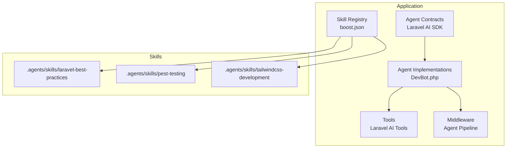
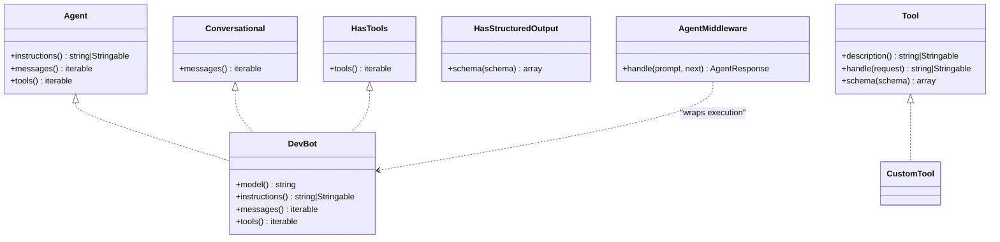
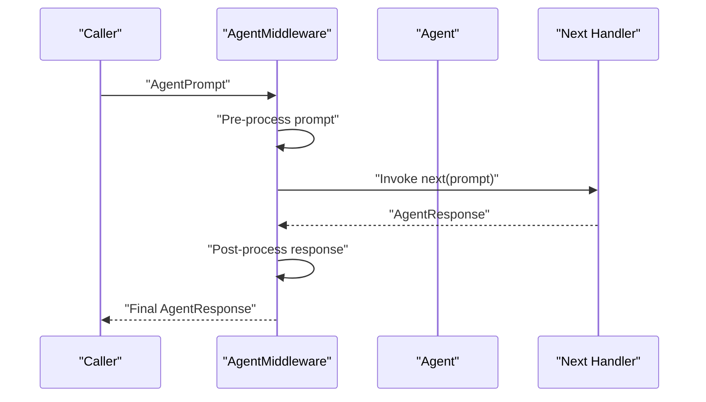
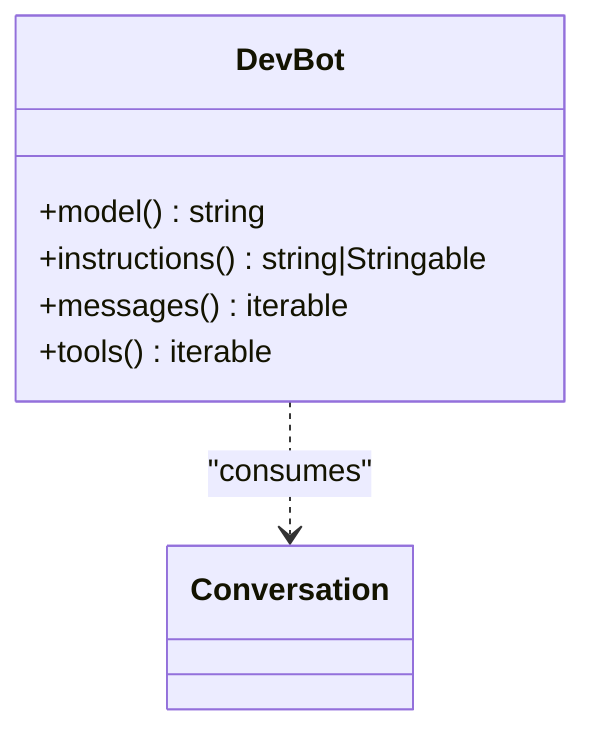
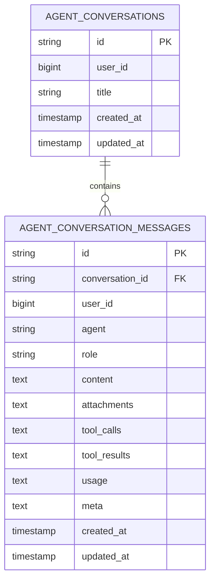
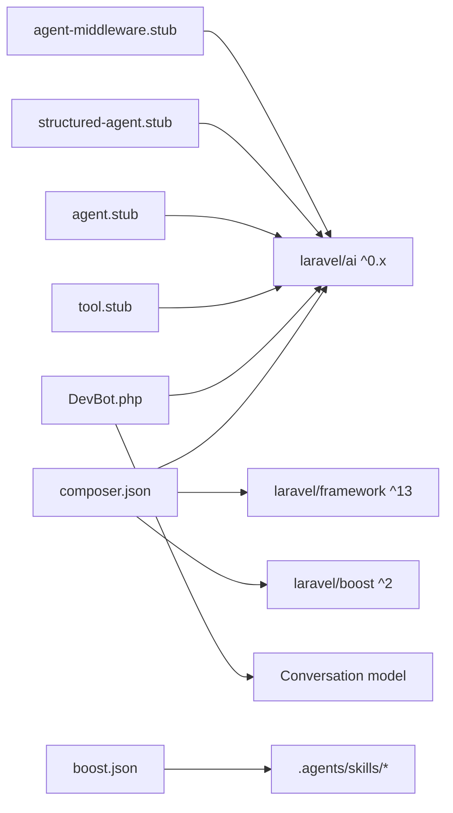

# Custom Skill Development

<cite>
**Referenced Files in This Document**
- [agent.stub](file://stubs/agent.stub)
- [structured-agent.stub](file://stubs/structured-agent.stub)
- [tool.stub](file://stubs/tool.stub)
- [agent-middleware.stub](file://stubs/agent-middleware.stub)
- [boost.json](file://boost.json)
- [AGENTS.md](file://AGENTS.md)
- [composer.json](file://composer.json)
- [DevBot.php](file://app/Ai/Agents/DevBot.php)
- [2026_04_02_115916_create_agent_conversations_table.php](file://database/migrations/2026_04_02_115916_create_agent_conversations_table.php)
- [laravel-best-practices/SKILL.md](file://.agents/skills/laravel-best-practices/SKILL.md)
- [pest-testing/SKILL.md](file://.agents/skills/pest-testing/SKILL.md)
- [tailwindcss-development/SKILL.md](file://.agents/skills/tailwindcss-development/SKILL.md)
</cite>

## Table of Contents
1. [Introduction](#introduction)
2. [Project Structure](#project-structure)
3. [Core Components](#core-components)
4. [Architecture Overview](#architecture-overview)
5. [Detailed Component Analysis](#detailed-component-analysis)
6. [Dependency Analysis](#dependency-analysis)
7. [Performance Considerations](#performance-considerations)
8. [Troubleshooting Guide](#troubleshooting-guide)
9. [Conclusion](#conclusion)
10. [Appendices](#appendices)

## Introduction
This document explains how to develop custom skills for Laravel Boost within this Laravel application. It focuses on the skill creation process using the provided stub templates (agent.stub, structured-agent.stub, tool.stub, agent-middleware.stub), skill architecture patterns, rule definition syntax, and integration with the Laravel ecosystem. It also covers skill packaging, distribution, versioning, testing, debugging, performance optimization, naming conventions, documentation requirements, and community contribution standards.

## Project Structure
Skills in this project are organized under a dedicated skills directory. Each skill is a self-contained unit with metadata and rule documentation. The application integrates skills via configuration and exposes them through the Boost tooling and agent runtime.

**Diagram sources**
- [DevBot.php:18-21](file://app/Ai/Agents/DevBot.php#L18-L21)
- [boost.json:11-15](file://boost.json#L11-L15)

**Section sources**
- [boost.json:11-15](file://boost.json#L11-L15)
- [.agents/skills/laravel-best-practices/SKILL.md:1-190](file://.agents/skills/laravel-best-practices/SKILL.md#L1-L190)
- [.agents/skills/pest-testing/SKILL.md:1-157](file://.agents/skills/pest-testing/SKILL.md#L1-L157)
- [.agents/skills/tailwindcss-development/SKILL.md:1-119](file://.agents/skills/tailwindcss-development/SKILL.md#L1-L119)

## Core Components
- Agent stubs define the baseline agent class structure and required contracts for both basic and structured-output agents.
- Tool stub defines the tool contract and schema-driven input/output.
- Agent middleware stub demonstrates the pipeline hook for intercepting prompts and responses.
- Skill manifests (SKILL.md) define metadata and rule sets for each skill.
- The Boost configuration registers which skills are active.

Key implementation patterns:
- Agents implement contracts for instructions, conversation history, and tool availability.
- Tools implement a description, execution handler, and JSON schema for input validation.
- Middleware participates in the agent pipeline to transform prompts and responses.

**Section sources**
- [agent.stub:13-44](file://stubs/agent.stub#L13-L44)
- [structured-agent.stub:15-56](file://stubs/structured-agent.stub#L15-L56)
- [tool.stub:10-38](file://stubs/tool.stub#L10-L38)
- [agent-middleware.stub:9-21](file://stubs/agent-middleware.stub#L9-L21)
- [boost.json:11-15](file://boost.json#L11-L15)

## Architecture Overview
The skill architecture integrates with Laravel’s AI SDK and Boost tooling. Agents encapsulate behavior and can expose tools. Middleware can wrap agent execution. Skills are registered centrally and surfaced through the application’s guidance and tooling.

**Diagram sources**
- [agent.stub:13-44](file://stubs/agent.stub#L13-L44)
- [structured-agent.stub:15-56](file://stubs/structured-agent.stub#L15-L56)
- [tool.stub:10-38](file://stubs/tool.stub#L10-L38)
- [agent-middleware.stub:9-21](file://stubs/agent-middleware.stub#L9-L21)
- [DevBot.php:21-99](file://app/Ai/Agents/DevBot.php#L21-L99)

## Detailed Component Analysis

### Agent Stubs and Contracts
- Basic agent stub implements the Agent, Conversational, and HasTools contracts. It provides placeholders for instructions, conversation messages, and tool lists.
- Structured agent stub adds HasStructuredOutput and a schema method to constrain tool or agent output to a defined JSON shape.

Implementation highlights:
- Use the Promptable trait to leverage prompt composition utilities.
- Implement instructions() to define role and behavior.
- Implement messages() to supply prior conversation context.
- Implement tools() to expose available tools.

**Section sources**
- [agent.stub:13-44](file://stubs/agent.stub#L13-L44)
- [structured-agent.stub:15-56](file://stubs/structured-agent.stub#L15-L56)

### Tool Stubs and JSON Schema
- Tool stub defines the Tool contract with description(), handle(), and schema().
- The schema() method uses Laravel’s JsonSchema to declare required inputs and types.
- The handle() method receives a Request object and returns a string or Stringable result.

Guidance:
- Keep tool responsibilities narrow and composable.
- Use schema() to enforce strict input validation.
- Return concise, actionable results.

**Section sources**
- [tool.stub:10-38](file://stubs/tool.stub#L10-L38)

### Agent Middleware Pipeline
- Agent middleware stub shows how to intercept AgentPrompt and chain AgentResponse transformations.
- The handle() method receives the prompt and a closure next(), returning a response that can be transformed asynchronously.

Typical use cases:
- Logging and telemetry
- Pre-processing prompts
- Post-processing responses
- Injecting context or constraints

**Diagram sources**
- [agent-middleware.stub:14-19](file://stubs/agent-middleware.stub#L14-L19)

**Section sources**
- [agent-middleware.stub:9-21](file://stubs/agent-middleware.stub#L9-L21)

### Skill Manifests and Rule Definition Syntax
Skills are documented via SKILL.md files containing YAML front matter and rule sections. The front matter includes name, description, and license. Rule sections reference markdown documents that enumerate best practices and patterns.

Patterns:
- Use YAML front matter for metadata.
- Organize rules by topic and reference supporting documents.
- Keep rule syntax concise and actionable.

Examples:
- Laravel best practices skill organizes rules by category and references rule files.
- Pest testing skill enumerates Pest 4 features and recommended usage.
- Tailwind CSS skill documents v4 specifics and common patterns.

**Section sources**
- [.agents/skills/laravel-best-practices/SKILL.md:1-190](file://.agents/skills/laravel-best-practices/SKILL.md#L1-L190)
- [.agents/skills/pest-testing/SKILL.md:1-157](file://.agents/skills/pest-testing/SKILL.md#L1-L157)
- [.agents/skills/tailwindcss-development/SKILL.md:1-119](file://.agents/skills/tailwindcss-development/SKILL.md#L1-L119)

### Agent Implementation Example
DevBot demonstrates a production-ready agent that:
- Uses attributes to configure provider, max steps, and temperature.
- Implements model(), instructions(), messages(), and tools().

**Diagram sources**
- [DevBot.php:18-21](file://app/Ai/Agents/DevBot.php#L18-L21)
- [DevBot.php:32-35](file://app/Ai/Agents/DevBot.php#L32-L35)
- [DevBot.php:40-73](file://app/Ai/Agents/DevBot.php#L40-L73)
- [DevBot.php:81-88](file://app/Ai/Agents/DevBot.php#L81-L88)
- [DevBot.php:95-98](file://app/Ai/Agents/DevBot.php#L95-L98)

**Section sources**
- [DevBot.php:18-21](file://app/Ai/Agents/DevBot.php#L18-L21)
- [DevBot.php:32-35](file://app/Ai/Agents/DevBot.php#L32-L35)
- [DevBot.php:40-73](file://app/Ai/Agents/DevBot.php#L40-L73)
- [DevBot.php:81-88](file://app/Ai/Agents/DevBot.php#L81-L88)
- [DevBot.php:95-98](file://app/Ai/Agents/DevBot.php#L95-L98)

### Conversation Persistence and Data Model
The application persists conversations and messages using dedicated tables. The schema supports indexing for efficient querying and includes fields for attachments, tool calls/results, usage metrics, and metadata.

**Diagram sources**
- [2026_04_02_115916_create_agent_conversations_table.php:14-39](file://database/migrations/2026_04_02_115916_create_agent_conversations_table.php#L14-L39)

**Section sources**
- [2026_04_02_115916_create_agent_conversations_table.php:1-50](file://database/migrations/2026_04_02_115916_create_agent_conversations_table.php#L1-L50)

### Skill Packaging, Distribution, and Version Management
- Skills are distributed as directories under the skills folder with a manifest (SKILL.md) and optional rule documents.
- The Boost configuration file declares which skills are enabled for the project.
- Composer manages Laravel AI SDK and related packages; ensure compatibility with the project’s PHP and Laravel versions.

Version management:
- Align skill behavior with the installed Laravel AI SDK version.
- Keep skill manifests current with package versions and best practices.

**Section sources**
- [boost.json:11-15](file://boost.json#L11-L15)
- [composer.json:11-26](file://composer.json#L11-L26)

### Integration with Laravel Ecosystem
- Use Laravel’s configuration and service container to wire agents and tools.
- Leverage migrations for conversation persistence.
- Follow Laravel conventions for naming, namespaces, and directory layout.
- Use the Boost tooling to discover and manage skills.

**Section sources**
- [composer.json:27-38](file://composer.json#L27-L38)
- [AGENTS.md:8-23](file://AGENTS.md#L8-L23)

## Dependency Analysis
The skill system depends on Laravel AI contracts and the Boost tooling. Agents depend on the conversation model for context, and tools depend on JSON schema validation.

**Diagram sources**
- [composer.json:11-26](file://composer.json#L11-L26)
- [DevBot.php:5-16](file://app/Ai/Agents/DevBot.php#L5-L16)
- [agent.stub:5-11](file://stubs/agent.stub#L5-L11)
- [structured-agent.stub:5-13](file://stubs/structured-agent.stub#L5-L13)
- [tool.stub:5-8](file://stubs/tool.stub#L5-L8)
- [agent-middleware.stub:5-7](file://stubs/agent-middleware.stub#L5-L7)
- [boost.json:11-15](file://boost.json#L11-L15)

**Section sources**
- [composer.json:11-26](file://composer.json#L11-L26)
- [DevBot.php:5-16](file://app/Ai/Agents/DevBot.php#L5-L16)
- [agent.stub:5-11](file://stubs/agent.stub#L5-L11)
- [structured-agent.stub:5-13](file://stubs/structured-agent.stub#L5-L13)
- [tool.stub:5-8](file://stubs/tool.stub#L5-L8)
- [agent-middleware.stub:5-7](file://stubs/agent-middleware.stub#L5-L7)
- [boost.json:11-15](file://boost.json#L11-L15)

## Performance Considerations
- Minimize tool invocation overhead by batching or caching where appropriate.
- Use structured output schemas to reduce parsing ambiguity and improve reliability.
- Keep agent instructions concise and focused to reduce token usage.
- Persist conversation context efficiently with proper indexing.
- Avoid heavy synchronous operations in middleware; prefer async transformations.

## Troubleshooting Guide
Common issues and resolutions:
- Tool schema mismatch: Ensure schema() matches the tool’s expected inputs and handle() returns the expected output type.
- Missing conversation context: Verify the agent’s messages() implementation returns the correct message stream.
- Middleware not applied: Confirm the middleware is registered in the agent pipeline and chained correctly.
- Skill not active: Check boost.json to ensure the skill is listed under the skills array.
- Package version conflicts: Align Laravel AI SDK and related packages with the project’s PHP and Laravel versions.

**Section sources**
- [tool.stub:31-36](file://stubs/tool.stub#L31-L36)
- [agent-middleware.stub:14-19](file://stubs/agent-middleware.stub#L14-L19)
- [boost.json:11-15](file://boost.json#L11-L15)
- [composer.json:11-26](file://composer.json#L11-L26)

## Conclusion
Custom skills in Laravel Boost are built around standardized stubs, clear contracts, and a manifest-driven approach. By following the patterns outlined here—agent and tool contracts, middleware pipeline integration, structured rule definitions, and proper packaging—you can create robust, maintainable skills that integrate seamlessly with the Laravel ecosystem and Boost tooling.

## Appendices

### A. Naming Conventions
- Use kebab-case for skill directories and names.
- Use descriptive class names for agents and tools.
- Keep namespaces aligned with PSR-4 autoloading.

**Section sources**
- [boost.json:11-15](file://boost.json#L11-L15)
- [composer.json:27-38](file://composer.json#L27-L38)

### B. Documentation Requirements
- Include a YAML front matter with name, description, and license.
- Provide a quick-reference index linking to rule documents.
- Keep rule syntax actionable and verifiable with search-docs.

**Section sources**
- [.agents/skills/laravel-best-practices/SKILL.md:1-190](file://.agents/skills/laravel-best-practices/SKILL.md#L1-L190)
- [.agents/skills/pest-testing/SKILL.md:1-157](file://.agents/skills/pest-testing/SKILL.md#L1-L157)
- [.agents/skills/tailwindcss-development/SKILL.md:1-119](file://.agents/skills/tailwindcss-development/SKILL.md#L1-L119)

### C. Community Contribution Standards
- Follow Laravel’s code style and formatting guidelines.
- Keep tests passing and avoid removing tests without approval.
- Use PRs to propose changes to skills and manifests.

**Section sources**
- [AGENTS.md:139-154](file://AGENTS.md#L139-L154)