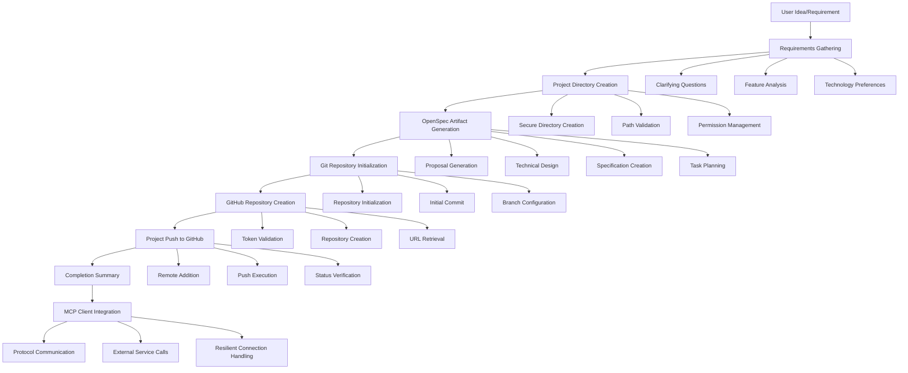
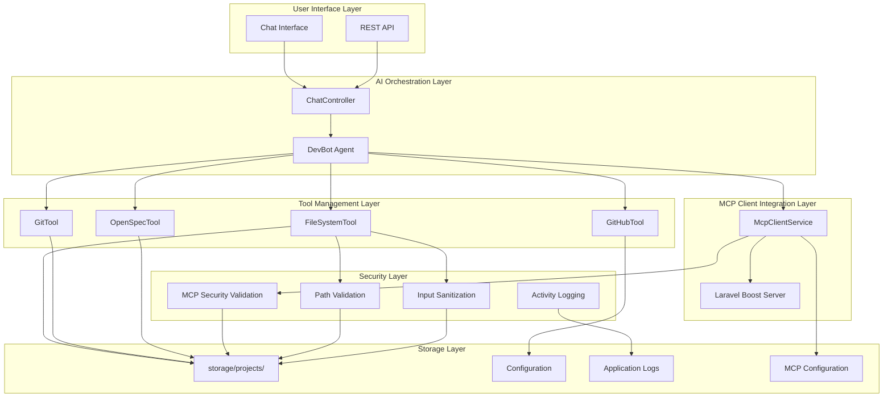
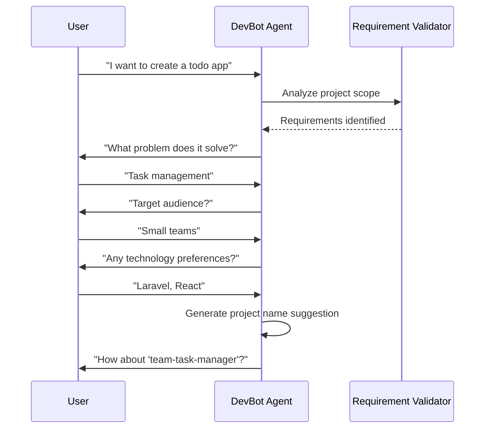
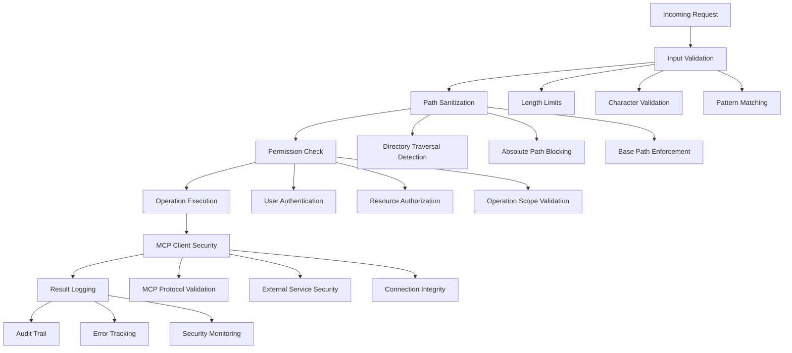

# Project Creation Workflow

<cite>
**Referenced Files in This Document**
- [README.md](file://README.md)
- [AGENTS.md](file://AGENTS.md)
- [SKILL.md](file://.agents/skills/project-creation/SKILL.md)
- [spec.md](file://openspec/specs/project-creation/spec.md)
- [tasks.md](file://openspec/changes/archive/2026-04-04-devbot-project-creation/tasks.md)
- [DevBot.php](file://app/Ai/Agents/DevBot.php)
- [FileSystemTool.php](file://app/Ai/Tools/FileSystemTool.php)
- [GitTool.php](file://app/Ai/Tools/GitTool.php)
- [GitHubTool.php](file://app/Ai/Tools/GitHubTool.php)
- [OpenSpecTool.php](file://app/Ai/Tools/OpenSpecTool.php)
- [McpClientService.php](file://app/Services/McpClientService.php)
- [ai.php](file://config/ai.php)
- [services.php](file://config/services.php)
- [ChatController.php](file://app/Http/Controllers/ChatController.php)
- [web.php](file://routes/web.php)
- [composer.json](file://composer.json)
- [package.json](file://package.json)
- [config.yaml](file://openspec/config.yaml)
- [boost.json](file://boost.json)
</cite>

## Update Summary
**Changes Made**
- Enhanced project creation workflow documentation with comprehensive seven-step process
- Updated to reflect new GitTool, GitHubTool, and FileSystemTool integrations
- Added detailed workflow analysis from requirements gathering to GitHub repository creation
- Expanded tool documentation with specific implementation details
- Updated system architecture to show complete MCP client integration
- Enhanced security and validation sections with path traversal prevention
- Added comprehensive troubleshooting guide for all workflow components

## Table of Contents
1. [Introduction](#introduction)
2. [Workflow Overview](#workflow-overview)
3. [System Architecture](#system-architecture)
4. [Core Components](#core-components)
5. [Detailed Workflow Analysis](#detailed-workflow-analysis)
6. [Security and Validation](#security-and-validation)
7. [Configuration Management](#configuration-management)
8. [Error Handling and Recovery](#error-handling-and-recovery)
9. [Development Setup](#development-setup)
10. [Troubleshooting Guide](#troubleshooting-guide)
11. [Conclusion](#conclusion)

## Introduction

The Laravel Assistant project includes a sophisticated project creation workflow that transforms micro-SaaS ideas into fully functional Laravel applications with automated GitHub integration. This workflow leverages AI-powered agents, secure file operations, comprehensive tooling, and MCP (Model Context Protocol) client integration to streamline the entire development process from concept to deployment.

The system provides an intelligent assistant capable of understanding project requirements, generating complete project structures, managing version control, and creating production-ready repositories on GitHub. The enhanced workflow now includes MCP-powered tools that extend beyond traditional file system operations to include advanced protocol-based communication with external services.

This capability represents a significant advancement in AI-assisted development, offering developers a complete solution for rapid prototyping and project scaffolding with enterprise-grade security and reliability.

## Workflow Overview

The project creation workflow follows a structured seven-step process designed to handle everything from initial concept to deployed repository, now enhanced with MCP client integration for robust external service communication:

**Diagram sources**
- [SKILL.md:13-218](file://.agents/skills/project-creation/SKILL.md#L13-L218)
- [DevBot.php:63-81](file://app/Ai/Agents/DevBot.php#L63-L81)
- [McpClientService.php:48-96](file://app/Services/McpClientService.php#L48-L96)

## System Architecture

The project creation system is built on a modular architecture that separates concerns between AI orchestration, tool management, MCP client integration, and security enforcement:

**Diagram sources**
- [DevBot.php:30-136](file://app/Ai/Agents/DevBot.php#L30-L136)
- [ChatController.php:13-182](file://app/Http/Controllers/ChatController.php#L13-L182)
- [McpClientService.php:20-96](file://app/Services/McpClientService.php#L20-L96)
- [ai.php:52-56](file://config/ai.php#L52-L56)

## Core Components

### DevBot Agent

The DevBot agent serves as the central orchestrator for the project creation workflow, implementing Laravel AI's agent contracts with specialized capabilities for development assistance and project management. The agent now includes enhanced MCP client integration for extended protocol-based communication.

**Key Features:**
- **Multi-provider Support**: Integrates with various AI providers (Anthropic, OpenAI, Gemini, etc.)
- **Tool Integration**: Seamlessly coordinates multiple specialized tools for different aspects of project creation
- **MCP Client Integration**: Leverages McpClientService for protocol-based external service communication
- **Context Management**: Maintains conversation history and project context throughout the workflow
- **Timeout Control**: Implements safety mechanisms to prevent long-running operations

**Section sources**
- [DevBot.php:30-136](file://app/Ai/Agents/DevBot.php#L30-L136)
- [ai.php:69-152](file://config/ai.php#L69-L152)

### FileSystemTool

The FileSystemTool provides secure file operations within a controlled environment, ensuring all project creation activities remain within designated boundaries. The tool now operates within the MCP client framework for enhanced security and reliability.

**Core Functionality:**
- **Project Creation**: Generates new project directories with proper validation
- **File Operations**: Safe read/write operations with path validation
- **Directory Management**: Comprehensive file listing and project existence checks
- **Security Enforcement**: Prevents directory traversal attacks and unauthorized access
- **MCP Integration**: Operates through MCP client for secure protocol communication

**Section sources**
- [FileSystemTool.php:14-298](file://app/Ai/Tools/FileSystemTool.php#L14-L298)

### GitTool

The GitTool manages version control operations with comprehensive error handling and user configuration support. Enhanced with MCP client integration for resilient external service communication.

**Capabilities:**
- **Repository Initialization**: Creates new Git repositories with configurable default branches
- **Commit Management**: Handles staging, committing, and status reporting
- **Remote Operations**: Manages remote repository connections and push operations
- **User Configuration**: Automatically configures Git user information when missing
- **MCP Protocol Support**: Uses MCP client for secure Git operations

**Section sources**
- [GitTool.php:14-324](file://app/Ai/Tools/GitTool.php#L14-L324)

### GitHubTool

The GitHubTool provides seamless integration with GitHub's API for repository management and authentication. Enhanced with MCP client integration for improved reliability and security.

**Features:**
- **Repository Creation**: Automated repository creation with privacy controls
- **Authentication Management**: Token validation and scope verification
- **Repository Information**: Comprehensive repository metadata retrieval
- **Rate Limit Handling**: Intelligent handling of API rate limits and errors
- **MCP Client Integration**: Uses McpClientService for secure GitHub API communication

**Section sources**
- [GitHubTool.php:13-224](file://app/Ai/Tools/GitHubTool.php#L13-L224)

### OpenSpecTool

The OpenSpecTool manages specification-driven development workflows, ensuring projects follow structured planning methodologies. Now includes enhanced MCP client integration for protocol-based specification management.

**Functionality:**
- **Artifact Status Tracking**: Monitors completion of proposal, design, specs, and tasks
- **Workflow Guidance**: Provides detailed instructions for OpenSpec methodology
- **Specification Management**: Coordinates creation and maintenance of development specifications
- **MCP Protocol Support**: Uses MCP client for secure specification operations

**Section sources**
- [OpenSpecTool.php:12-184](file://app/Ai/Tools/OpenSpecTool.php#L12-L184)

### McpClientService

The McpClientService provides centralized MCP client management for connecting to the Laravel Boost MCP server, implementing auto-reconnect logic and comprehensive error handling.

**Core Features:**
- **Connection Management**: Handles MCP client lifecycle and connection state
- **Auto-Reconnect Logic**: Implements exponential backoff retry mechanism
- **Command Parsing**: Parses Artisan commands for MCP server execution
- **Configuration Management**: Reads MCP client settings from services.php
- **Logging and Monitoring**: Comprehensive logging for connection and operation tracking

**Section sources**
- [McpClientService.php:20-279](file://app/Services/McpClientService.php#L20-L279)

## Detailed Workflow Analysis

### Step 1: Requirements Gathering

The workflow begins with intelligent requirements gathering, where the AI agent asks clarifying questions to understand the project scope, target audience, and technical preferences.

**Process Flow:**

**Diagram sources**
- [SKILL.md:15-35](file://.agents/skills/project-creation/SKILL.md#L15-L35)

### Step 2: Project Directory Creation

The system creates a secure project directory within the designated storage area, implementing comprehensive validation and security measures through MCP client integration.

**Security Measures:**
- **Path Validation**: Ensures all paths remain within the base project directory
- **Directory Traversal Prevention**: Blocks attempts to access parent directories
- **Permission Management**: Creates directories with appropriate access permissions
- **Conflict Resolution**: Handles naming conflicts with automatic suffix generation
- **MCP Protocol Security**: All file operations are validated through MCP client

**Section sources**
- [SKILL.md:38-61](file://.agents/skills/project-creation/SKILL.md#L38-L61)
- [FileSystemTool.php:68-99](file://app/Ai/Tools/FileSystemTool.php#L68-L99)

### Step 3: OpenSpec Artifact Generation

The OpenSpec workflow generates comprehensive project specifications including proposal, design documents, detailed specifications, and implementation tasks, now enhanced with MCP client integration for secure protocol-based operations.

**Artifact Types:**
- **Proposal Document**: Defines project purpose, problem statement, and value proposition
- **Technical Design**: Architecture decisions, technology stack selection, and system design
- **Specification Files**: Detailed requirement specifications with behavioral scenarios
- **Implementation Tasks**: Actionable task breakdown for development execution
- **MCP Protocol Support**: All OpenSpec operations are handled through MCP client

**Section sources**
- [SKILL.md:64-92](file://.agents/skills/project-creation/SKILL.md#L64-L92)
- [OpenSpecTool.php:56-95](file://app/Ai/Tools/OpenSpecTool.php#L56-L95)

### Step 4: Git Repository Initialization

Version control setup establishes the foundation for collaborative development with proper configuration and initial commit, now utilizing MCP client for enhanced security and reliability.

**Setup Process:**
- **Repository Initialization**: Creates Git repository with configurable default branch
- **User Configuration**: Automatically sets up Git user information if missing
- **Initial Commit**: Commits all generated OpenSpec artifacts
- **Status Verification**: Confirms repository readiness for collaboration
- **MCP Integration**: Git operations are executed through MCP client for secure protocol communication

**Section sources**
- [SKILL.md:95-133](file://.agents/skills/project-creation/SKILL.md#L95-L133)
- [GitTool.php:80-106](file://app/Ai/Tools/GitTool.php#L80-L106)

### Step 5: GitHub Repository Creation

Remote repository creation enables collaboration and deployment preparation through GitHub integration, now enhanced with MCP client security protocols.

**Integration Process:**
- **Token Validation**: Verifies GitHub authentication credentials
- **Repository Creation**: Creates remote repository with privacy controls
- **URL Retrieval**: Obtains clone URLs for subsequent operations
- **Repository Information**: Stores metadata for project tracking
- **MCP Client Security**: GitHub API calls are handled through MCP client with enhanced security

**Section sources**
- [SKILL.md:135-165](file://.agents/skills/project-creation/SKILL.md#L135-L165)
- [GitHubTool.php:66-119](file://app/Ai/Tools/GitHubTool.php#L66-L119)

### Step 6: Project Push to GitHub

The final deployment step synchronizes local changes with the remote repository, making the project immediately accessible to collaborators, now with enhanced MCP client resilience.

**Push Operations:**
- **Remote Addition**: Configures origin remote with retrieved repository URL
- **Push Execution**: Transfers all committed changes to GitHub
- **Status Verification**: Confirms successful synchronization
- **Access Provision**: Provides direct links to the hosted repository
- **MCP Resilience**: Push operations utilize MCP client's auto-reconnect capabilities

**Section sources**
- [SKILL.md:167-200](file://.agents/skills/project-creation/SKILL.md#L167-L200)
- [GitTool.php:204-229](file://app/Ai/Tools/GitTool.php#L204-L229)

### Step 7: Completion Summary

The workflow concludes with a comprehensive summary providing project details, next steps, and available resources for continued development, now including MCP client integration status.

**Summary Components:**
- **Project Overview**: Name, location, and key characteristics
- **Repository Information**: GitHub URL and access details
- **Artifact Inventory**: Complete list of generated specifications
- **Next Steps**: Recommendations for implementation and further development
- **MCP Status**: MCP client connection health and configuration information

**Section sources**
- [SKILL.md:202-218](file://.agents/skills/project-creation/SKILL.md#L202-L218)

## Security and Validation

The project creation workflow implements comprehensive security measures to prevent unauthorized access and ensure safe operations, now enhanced with MCP client security protocols:

**Enhanced Security Features:**
- **Path Validation**: Prevents directory traversal attacks through comprehensive path sanitization
- **Permission Management**: Ensures all operations occur within designated project directories
- **Input Sanitization**: Validates all user inputs to prevent injection attacks
- **Audit Logging**: Maintains detailed logs of all operations for security monitoring
- **MCP Client Security**: All external service communications are validated through MCP client
- **Protocol Security**: MCP client enforces secure protocol communication with external services
- **Connection Integrity**: MCP client validates connection health and security before operations
- **Rate Limiting**: Implements safeguards against excessive API calls through MCP client

**Section sources**
- [FileSystemTool.php:238-280](file://app/Ai/Tools/FileSystemTool.php#L238-L280)
- [GitTool.php:294-304](file://app/Ai/Tools/GitTool.php#L294-L304)
- [GitHubTool.php:39-61](file://app/Ai/Tools/GitHubTool.php#L39-L61)
- [McpClientService.php:140-179](file://app/Services/McpClientService.php#L140-L179)

## Configuration Management

The system utilizes a centralized configuration approach that supports multiple AI providers, development environments, and MCP client settings:

**Configuration Structure:**
- **Provider Selection**: Dynamic switching between AI providers based on environment
- **Tool Configuration**: Individual settings for each workflow tool
- **MCP Client Configuration**: Command execution, timeout, retry, and connection settings
- **Environment Variables**: Runtime configuration through .env file management
- **Default Values**: Fallback configurations for streamlined setup

**MCP Client Configuration:**
- **Command Execution**: Artisan command for MCP server (`php artisan boost:mcp`)
- **Timeout Settings**: Maximum wait time for tool responses (default: 60 seconds)
- **Retry Mechanism**: Automatic retry attempts with exponential backoff (default: 3 retries)
- **Connection Health**: Connection validation and monitoring

**Section sources**
- [ai.php:52-56](file://config/ai.php#L52-L56)
- [ai.php:69-152](file://config/ai.php#L69-L152)
- [services.php:38-43](file://config/services.php#L38-L43)
- [composer.json:41-77](file://composer.json#L41-L77)

## Error Handling and Recovery

The workflow includes comprehensive error handling mechanisms designed to provide meaningful feedback and enable recovery from common issues, now enhanced with MCP client resilience features:

**Enhanced Error Categories:**
- **Validation Errors**: Input validation failures with specific error messages
- **Permission Errors**: Access control violations with resolution guidance
- **Network Errors**: API connectivity issues with retry mechanisms
- **Operation Failures**: Tool execution errors with detailed troubleshooting
- **MCP Client Errors**: Protocol communication failures with auto-reconnect
- **Connection Errors**: External service connection issues with health checks

**Enhanced Recovery Strategies:**
- **Automatic Retry**: Intelligent retry mechanisms for transient failures
- **Fallback Options**: Alternative approaches when primary methods fail
- **Progress Tracking**: Ability to resume workflows from previous successful steps
- **Diagnostic Information**: Comprehensive error reporting for debugging
- **MCP Resilience**: Auto-reconnect logic for MCP client failures
- **Health Monitoring**: Continuous monitoring of external service connectivity
- **Exponential Backoff**: Progressive retry delays for failing connections

**Section sources**
- [FileSystemTool.php:54-62](file://app/Ai/Tools/FileSystemTool.php#L54-L62)
- [GitTool.php:66-75](file://app/Ai/Tools/GitTool.php#L66-L75)
- [GitHubTool.php:52-61](file://app/Ai/Tools/GitHubTool.php#L52-L61)
- [McpClientService.php:140-179](file://app/Services/McpClientService.php#L140-L179)

## Development Setup

The Laravel Assistant provides streamlined development setup through automated scripts and comprehensive tooling, now including MCP client integration:

**Setup Process:**
- **Dependency Installation**: Automatic installation of PHP and Node.js dependencies
- **Environment Configuration**: Generation of application keys and database setup
- **MCP Client Configuration**: Setup of Laravel Boost MCP server integration
- **Asset Building**: Frontend asset compilation and optimization
- **Development Services**: Concurrent startup of all development components

**Development Commands:**
- **Quick Setup**: Single-command installation and initialization
- **Development Server**: Concurrent service startup with hot reloading
- **MCP Server**: Laravel Boost MCP server for protocol-based operations
- **Testing Framework**: Integrated testing capabilities with coverage reporting
- **Code Quality**: Automated formatting and linting tools

**Section sources**
- [README.md:43-74](file://README.md#L43-L74)
- [composer.json:41-57](file://composer.json#L41-L57)
- [package.json:5-8](file://package.json#L5-L8)

## Troubleshooting Guide

Common issues and their solutions during project creation workflow, now including MCP client-specific troubleshooting:

**GitHub Integration Issues:**
- **Token Configuration**: Verify GITHUB_TOKEN environment variable is set correctly
- **Scope Permissions**: Ensure token has required repo scope permissions
- **Rate Limiting**: Handle API rate limits with appropriate retry strategies
- **Repository Conflicts**: Resolve naming conflicts with unique repository names

**File System Issues:**
- **Permission Errors**: Verify write permissions for storage/projects/ directory
- **Path Validation**: Ensure project names follow kebab-case naming conventions
- **Disk Space**: Monitor available disk space for project creation
- **File Locking**: Handle concurrent access conflicts appropriately

**Network Connectivity:**
- **API Connectivity**: Verify internet connectivity for external service calls
- **Firewall Configuration**: Ensure outbound connections are permitted
- **Proxy Settings**: Configure proxy settings if required by network environment
- **Timeout Handling**: Implement appropriate timeout configurations

**MCP Client Issues:**
- **Connection Failures**: Verify Laravel Boost MCP server is running
- **Command Execution**: Ensure Artisan command `php artisan boost:mcp` is available
- **Protocol Errors**: Check MCP client configuration in services.php
- **Timeout Issues**: Adjust MCP client timeout settings for slow connections
- **Auto-Reconnect**: Monitor MCP client retry attempts and connection health
- **Memory Usage**: Monitor MCP client memory consumption during operations

**Section sources**
- [SKILL.md:252-286](file://.agents/skills/project-creation/SKILL.md#L252-L286)
- [README.md:304-331](file://README.md#L304-L331)
- [McpClientService.php:140-179](file://app/Services/McpClientService.php#L140-L179)

## Conclusion

The Laravel Assistant's project creation workflow represents a comprehensive solution for modern software development, combining AI-powered assistance with robust automation tools and MCP client integration. The system successfully addresses the entire development lifecycle from ideation to deployment, providing developers with a powerful toolkit for rapid prototyping and project scaffolding.

Key strengths of the enhanced workflow include its security-first approach, comprehensive error handling, flexible configuration options, seamless integration with popular development tools, and enterprise-grade MCP client integration. The modular architecture ensures maintainability and extensibility, while the AI agent provides intelligent guidance throughout the development process.

The MCP client integration adds significant value by providing secure protocol-based communication with external services, enhanced connection resilience through auto-reconnect logic, and comprehensive error handling for distributed operations. This integration demonstrates how modern AI-assisted development platforms can leverage emerging protocols to enhance both security and functionality.

This workflow serves as an excellent foundation for AI-assisted development, demonstrating how artificial intelligence can enhance developer productivity while maintaining security standards and operational reliability. The system's comprehensive documentation, MCP client integration, and troubleshooting guidance make it accessible to developers of varying skill levels while providing advanced capabilities for experienced developers seeking to accelerate their development processes.