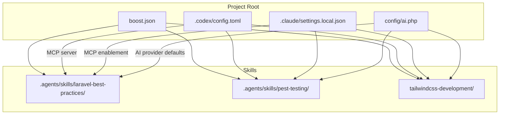
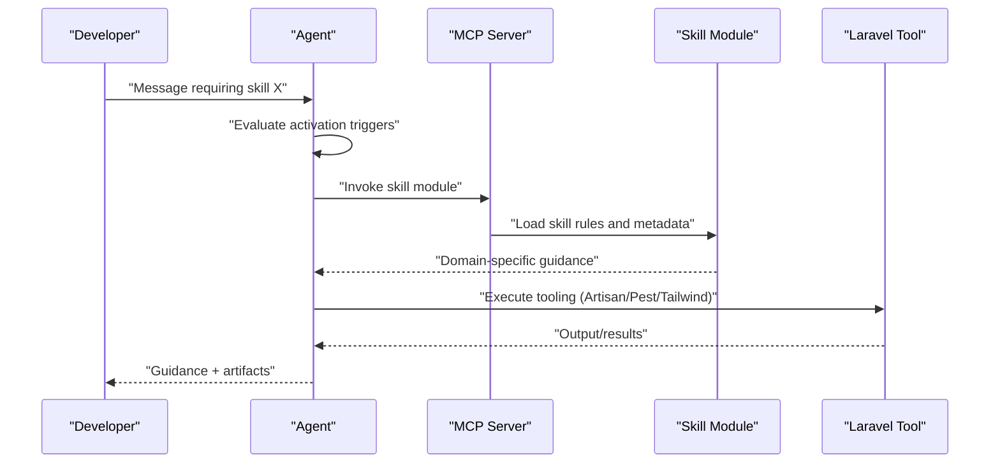
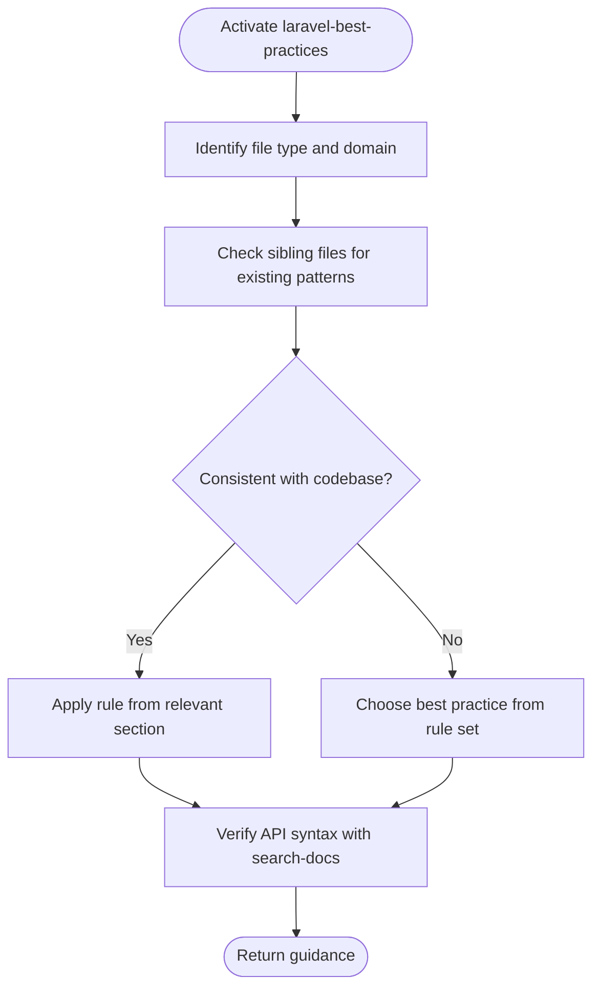
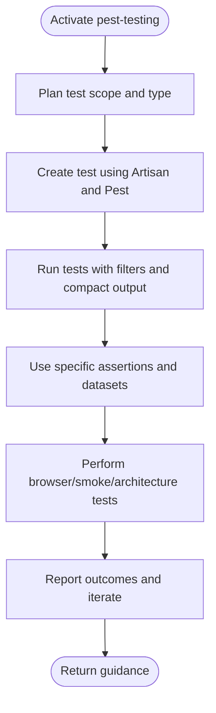
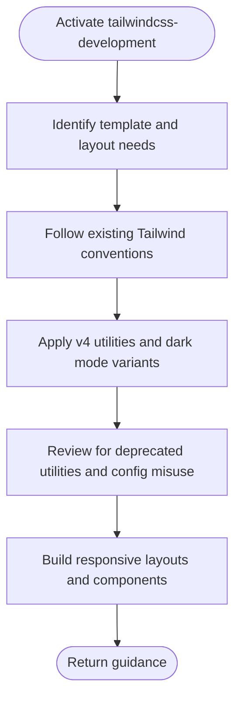
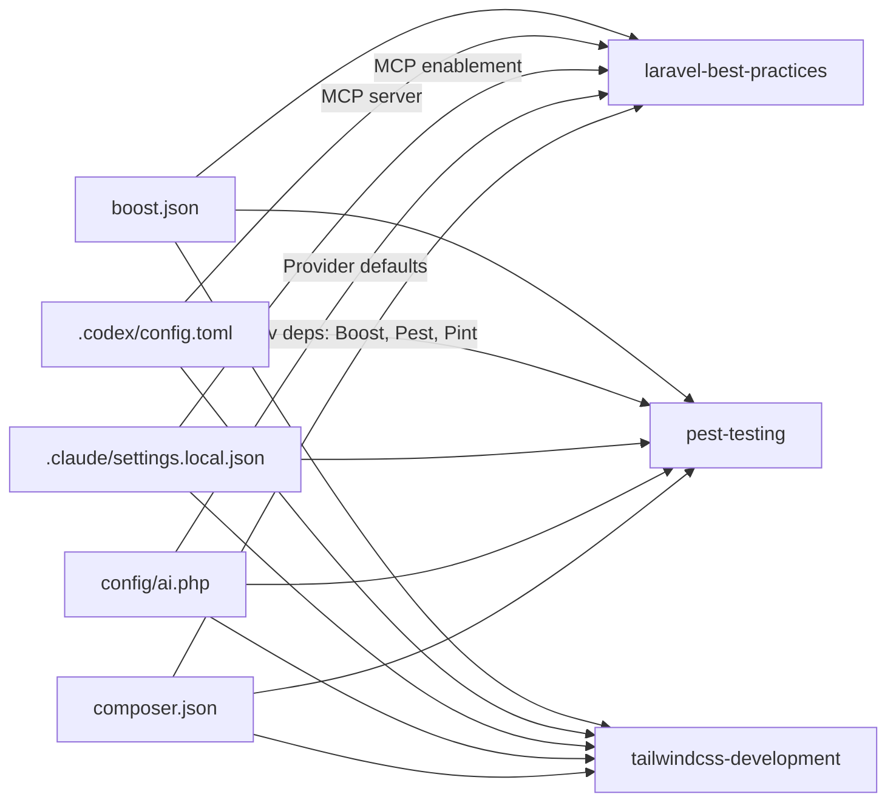

# Skill Management System

<cite>
**Referenced Files in This Document**
- [boost.json](file://boost.json)
- [AGENTS.md](file://AGENTS.md)
- [SKILL.md (laravel-best-practices)](file://.agents/skills/laravel-best-practices/SKILL.md)
- [db-performance.md](file://.agents/skills/laravel-best-practices/rules/db-performance.md)
- [security.md](file://.agents/skills/laravel-best-practices/rules/security.md)
- [testing.md](file://.agents/skills/laravel-best-practices/rules/testing.md)
- [architecture.md](file://.agents/skills/laravel-best-practices/rules/architecture.md)
- [SKILL.md (pest-testing)](file://.agents/skills/pest-testing/SKILL.md)
- [SKILL.md (tailwindcss-development)](file://.agents/skills/tailwindcss-development/SKILL.md)
- [.codex/config.toml](file://.codex/config.toml)
- [.claude/settings.local.json](file://.claude/settings.local.json)
- [composer.json](file://composer.json)
- [config/ai.php](file://config/ai.php)
</cite>

## Table of Contents
1. [Introduction](#introduction)
2. [Project Structure](#project-structure)
3. [Core Components](#core-components)
4. [Architecture Overview](#architecture-overview)
5. [Detailed Component Analysis](#detailed-component-analysis)
6. [Dependency Analysis](#dependency-analysis)
7. [Performance Considerations](#performance-considerations)
8. [Troubleshooting Guide](#troubleshooting-guide)
9. [Conclusion](#conclusion)

## Introduction
This document explains the Skill Management System for Laravel Boost, focusing on how skills are activated, configured, and applied within the Laravel ecosystem. It covers the three core skills:
- laravel-best-practices: PHP code patterns and architecture guidance
- pest-testing: testing workflows using Pest
- tailwindcss-development: frontend styling with Tailwind CSS v4

It documents skill activation triggers, rule-based enforcement, integration with Laravel’s built-in tools, customization and rule modification, best practices for activation timing, conflict resolution, and performance optimization strategies.

## Project Structure
Skills are organized under a dedicated skills directory with a standardized metadata file and rule sets. The system is enabled and configured via project-wide settings and MCP server configuration.

**Diagram sources**
- [boost.json:11-15](file://boost.json#L11-L15)
- [.codex/config.toml:1-5](file://.codex/config.toml#L1-5)
- [.claude/settings.local.json:1-7](file://.claude/settings.local.json#L1-L7)
- [config/ai.php:16-22](file://config/ai.php#L16-L22)

**Section sources**
- [boost.json:11-15](file://boost.json#L11-L15)
- [.codex/config.toml:1-5](file://.codex/config.toml#L1-L5)
- [.claude/settings.local.json:1-7](file://.claude/settings.local.json#L1-L7)
- [config/ai.php:16-22](file://config/ai.php#L16-L22)

## Core Components
- Skill manifests define metadata and purpose for each skill.
- Rule sets codify best practices and enforcement patterns for specific domains.
- Project configuration enables skills and integrates with AI providers and MCP servers.
- Built-in Laravel tools (Artisan, Pest, Tailwind) complement skills to enforce standards.

Key configuration and skill files:
- boost.json: Declares enabled skills and global toggles.
- AGENTS.md: Activation triggers and conventions for skill use.
- Skill SKILL.md files: Domain-specific guidance and rule references.
- Rule files: Concrete best practices for database performance, security, testing, and architecture.
- MCP configs (.codex/config.toml, .claude/settings.local.json): Launch and enable MCP servers backing skills.
- config/ai.php: Provider defaults influencing agent behavior.

**Section sources**
- [boost.json:11-15](file://boost.json#L11-L15)
- [AGENTS.md:24-31](file://AGENTS.md#L24-L31)
- [SKILL.md (laravel-best-practices):1-190](file://.agents/skills/laravel-best-practices/SKILL.md#L1-L190)
- [SKILL.md (pest-testing):1-157](file://.agents/skills/pest-testing/SKILL.md#L1-L157)
- [SKILL.md (tailwindcss-development):1-119](file://.agents/skills/tailwindcss-development/SKILL.md#L1-L119)
- [.codex/config.toml:1-5](file://.codex/config.toml#L1-L5)
- [.claude/settings.local.json:1-7](file://.claude/settings.local.json#L1-L7)
- [config/ai.php:16-22](file://config/ai.php#L16-L22)

## Architecture Overview
The Skill Management System operates through:
- Skill activation triggers defined in AGENTS.md
- MCP server orchestration via .codex/config.toml and .claude/settings.local.json
- Skill rule enforcement grounded in rule files
- Laravel toolchain integration (Artisan, Pest, Tailwind)

**Diagram sources**
- [AGENTS.md:24-31](file://AGENTS.md#L24-L31)
- [.codex/config.toml:1-5](file://.codex/config.toml#L1-L5)
- [.claude/settings.local.json:1-7](file://.claude/settings.local.json#L1-L7)

## Detailed Component Analysis

### Skill Activation Triggers and Timing
- laravel-best-practices: Activate when working on Laravel PHP code (controllers, models, migrations, form requests, policies, jobs, scheduling, service classes, Eloquent queries). Triggered for N+1 and query performance issues, caching strategies, authorization/security patterns, validation, error handling, queue/job configuration, route definitions, and architectural decisions.
- pest-testing: Activate for Pest PHP testing in Laravel projects. Triggered when writing, editing, fixing, or refactoring tests, including converting PHPUnit to Pest, adding datasets, and TDD workflows. Also invoked when mentioning test directories or needing browser/smoke/architecture tests.
- tailwindcss-development: Always invoke when the message includes “tailwind” or when building responsive layouts, styling UI components, adding dark mode variants, fixing spacing/typography, and working with Tailwind v3/v4 utilities in HTML templates.

Activation timing best practices:
- Activate skills proactively when entering a domain, not after encountering issues.
- Use skill-specific triggers to avoid unnecessary overhead.
- Align skill activation with Laravel’s conventions and existing patterns.

**Section sources**
- [AGENTS.md:24-31](file://AGENTS.md#L24-L31)

### laravel-best-practices Skill
Scope and purpose:
- Guides backend PHP code patterns and architecture decisions in Laravel.
- Provides rule references across database performance, security, caching, Eloquent, validation, configuration, testing, queues/jobs, routing/controllers, HTTP client, events/notifications/mail, error handling, scheduling, architecture, migrations, collections, Blade/views, and conventions/style.

Rule-based enforcement highlights:
- Database performance: eager loading, preventing lazy loading, selective column selection, chunking large datasets, indexing strategies, using withCount, cursor iteration, and avoiding queries in Blade.
- Security: mass assignment protection, authorization via policies/gates, preventing SQL injection, output escaping, CSRF protection, throttling auth/API routes, validating file uploads, secret management, dependency auditing, encrypted casts.
- Testing patterns: preferring LazilyRefreshDatabase, expressive model assertions, factory states/sequences, correct mocking order, and recycling relationship instances.
- Architecture: single-purpose action classes, dependency injection, coding to interfaces, default descending sorts, atomic locks, mb_* string functions, defer for post-response work, Context for request-scoped data, Concurrency::run for parallel execution, and convention over configuration.

Integration with Laravel tools:
- Uses Artisan commands for scaffolding and inspection.
- Leverages Pest for testing guidance.
- Aligns with Tailwind for frontend styling when applicable.

Customization and rule modification:
- Follow the Consistency-First principle: adopt patterns already used in the codebase before introducing new ones.
- Explore rule files and use search-docs to verify API syntax for the installed Laravel version.

**Diagram sources**
- [SKILL.md (laravel-best-practices):13-190](file://.agents/skills/laravel-best-practices/SKILL.md#L13-L190)

**Section sources**
- [SKILL.md (laravel-best-practices):1-190](file://.agents/skills/laravel-best-practices/SKILL.md#L1-L190)
- [db-performance.md:1-192](file://.agents/skills/laravel-best-practices/rules/db-performance.md#L1-L192)
- [security.md:1-198](file://.agents/skills/laravel-best-practices/rules/security.md#L1-L198)
- [testing.md:1-43](file://.agents/skills/laravel-best-practices/rules/testing.md#L1-L43)
- [architecture.md:1-202](file://.agents/skills/laravel-best-practices/rules/architecture.md#L1-L202)

### pest-testing Skill
Scope and purpose:
- Focuses exclusively on Pest PHP testing in Laravel projects.
- Covers creating tests, organizing tests, basic structure, running tests, assertions, mocking, datasets, browser testing, smoke testing, visual regression, test sharding, and architecture testing.

Integration with Laravel tools:
- Uses Artisan test commands for running and filtering tests.
- Leverages Pest-specific features and patterns.

Common pitfalls and remedies:
- Ensure proper imports before using mocks.
- Prefer specific assertions over generic status checks.
- Use datasets for repetitive validations.
- Do not delete tests without approval.
- Include no-JavaScript-errors assertions in browser tests.

**Diagram sources**
- [SKILL.md (pest-testing):15-157](file://.agents/skills/pest-testing/SKILL.md#L15-L157)

**Section sources**
- [SKILL.md (pest-testing):1-157](file://.agents/skills/pest-testing/SKILL.md#L1-L157)

### tailwindcss-development Skill
Scope and purpose:
- Activated when messages include “tailwind” or when building responsive layouts, styling UI components, adding dark mode variants, fixing spacing/typography, and working with Tailwind v3/v4 utilities in HTML templates.
- Emphasizes Tailwind CSS v4 specifics: CSS-first configuration with @theme, import syntax using @import "tailwindcss", replacement utilities, spacing with gap, and dark mode variants.

Integration with Laravel tools:
- Works with Blade templates and frontend assets.
- Aligns with Tailwind v4 tooling and configuration.

Common pitfalls and remedies:
- Avoid deprecated v3 utilities.
- Use @import "tailwindcss" instead of @tailwind directives.
- Use @theme directive instead of tailwind.config.js.
- Prefer gap utilities over margins for sibling spacing.
- Include dark mode variants when the project supports dark mode.

**Diagram sources**
- [SKILL.md (tailwindcss-development):15-119](file://.agents/skills/tailwindcss-development/SKILL.md#L15-L119)

**Section sources**
- [SKILL.md (tailwindcss-development):1-119](file://.agents/skills/tailwindcss-development/SKILL.md#L1-L119)

### Skill Dependency System and Rule-Based Enforcement
- Skills are independent modules with rule sets that can be loaded on demand.
- Rule-based enforcement relies on:
  - Consistency with existing codebase patterns
  - Verification of API syntax via search-docs
  - Adherence to Laravel conventions and tooling
- Skill activation triggers minimize unnecessary rule evaluation by scoping guidance to the current task.

Best practices:
- Activate the correct skill early in a task to ensure consistent enforcement.
- Use rule references to guide implementation and avoid ad-hoc deviations.
- Integrate with Laravel tools to validate and apply changes.

**Section sources**
- [SKILL.md (laravel-best-practices):13-190](file://.agents/skills/laravel-best-practices/SKILL.md#L13-L190)
- [AGENTS.md:24-31](file://AGENTS.md#L24-L31)

### Skill Customization and Rule Modification
- Customize by aligning with existing patterns in the codebase before introducing new ones.
- Modify rule interpretation by consulting rule files and verifying syntax with search-docs.
- Adjust activation triggers to match team workflows and project conventions.

Recommendations:
- Document deviations from rule sets and rationale.
- Keep rule modifications scoped to the specific task or feature.
- Validate changes with Laravel tools and tests.

**Section sources**
- [SKILL.md (laravel-best-practices):13-190](file://.agents/skills/laravel-best-practices/SKILL.md#L13-L190)

## Dependency Analysis
The system depends on:
- Project configuration enabling skills and MCP servers
- Composer-managed packages supporting AI, Boost, Pest, and Tailwind
- AI provider defaults influencing agent behavior

**Diagram sources**
- [boost.json:11-15](file://boost.json#L11-L15)
- [.codex/config.toml:1-5](file://.codex/config.toml#L1-L5)
- [.claude/settings.local.json:1-7](file://.claude/settings.local.json#L1-L7)
- [config/ai.php:16-22](file://config/ai.php#L16-L22)
- [composer.json:17-26](file://composer.json#L17-L26)

**Section sources**
- [boost.json:11-15](file://boost.json#L11-L15)
- [.codex/config.toml:1-5](file://.codex/config.toml#L1-L5)
- [.claude/settings.local.json:1-7](file://.claude/settings.local.json#L1-L7)
- [config/ai.php:16-22](file://config/ai.php#L16-L22)
- [composer.json:17-26](file://composer.json#L17-L26)

## Performance Considerations
- Use LazilyRefreshDatabase over RefreshDatabase to speed up test suites.
- Prefer expressive model assertions and factory states to reduce test complexity.
- Apply chunking and cursor iteration for large datasets to avoid memory pressure.
- Use atomic locks and defer for race condition prevention and post-response work.
- Activate skills early to avoid repeated guidance and rework.

[No sources needed since this section provides general guidance]

## Troubleshooting Guide
Common issues and resolutions:
- Skill conflicts:
  - Ensure only the relevant skill is active for the current task.
  - Align with existing codebase patterns to avoid contradictory advice.
- Pest-related issues:
  - Confirm proper imports before using mocks.
  - Prefer specific assertions and use datasets for repetitive validations.
  - Include no-JavaScript-errors assertions in browser tests.
- Tailwind v4 misconfiguration:
  - Use @import "tailwindcss" instead of @tailwind directives.
  - Configure theme via @theme directive instead of tailwind.config.js.
  - Replace deprecated utilities with their v4 equivalents.
- Database performance regressions:
  - Eager-load relationships and avoid N+1 queries.
  - Add indexes for common query patterns.
  - Use chunking and cursor iteration for large datasets.
- Security violations:
  - Define mass assignment protection on models.
  - Authorize every action via policies/gates.
  - Escape output and apply CSRF tokens.
  - Validate file uploads and keep secrets out of code.

**Section sources**
- [SKILL.md (pest-testing):151-157](file://.agents/skills/pest-testing/SKILL.md#L151-L157)
- [SKILL.md (tailwindcss-development):113-119](file://.agents/skills/tailwindcss-development/SKILL.md#L113-L119)
- [db-performance.md:1-192](file://.agents/skills/laravel-best-practices/rules/db-performance.md#L1-L192)
- [security.md:1-198](file://.agents/skills/laravel-best-practices/rules/security.md#L1-L198)

## Conclusion
The Skill Management System integrates three core skills—laravel-best-practices, pest-testing, and tailwindcss-development—into Laravel Boost to enforce best practices, streamline workflows, and improve code quality. By activating skills based on precise triggers, leveraging rule-based enforcement, and integrating with Laravel’s built-in tools, teams can maintain consistency, reduce regressions, and accelerate development. Customization should align with existing patterns, and performance optimizations should be applied consistently across tasks.