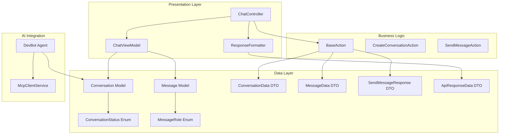
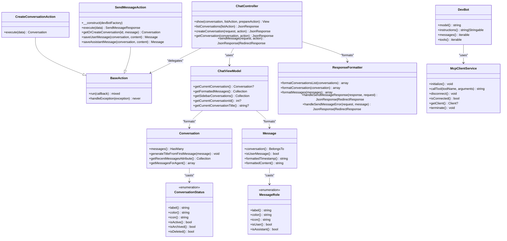
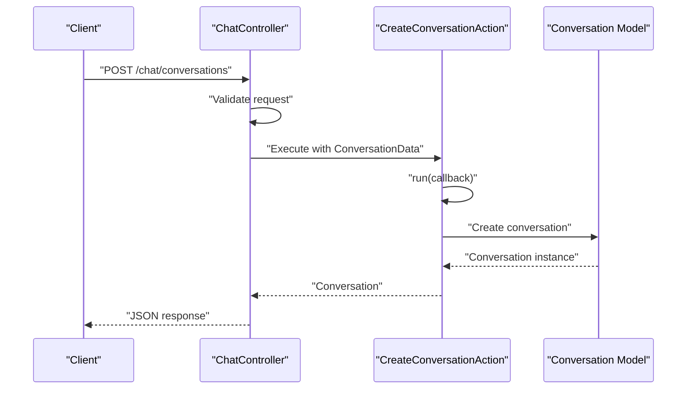
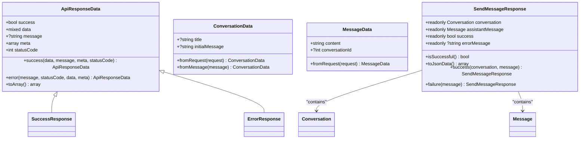
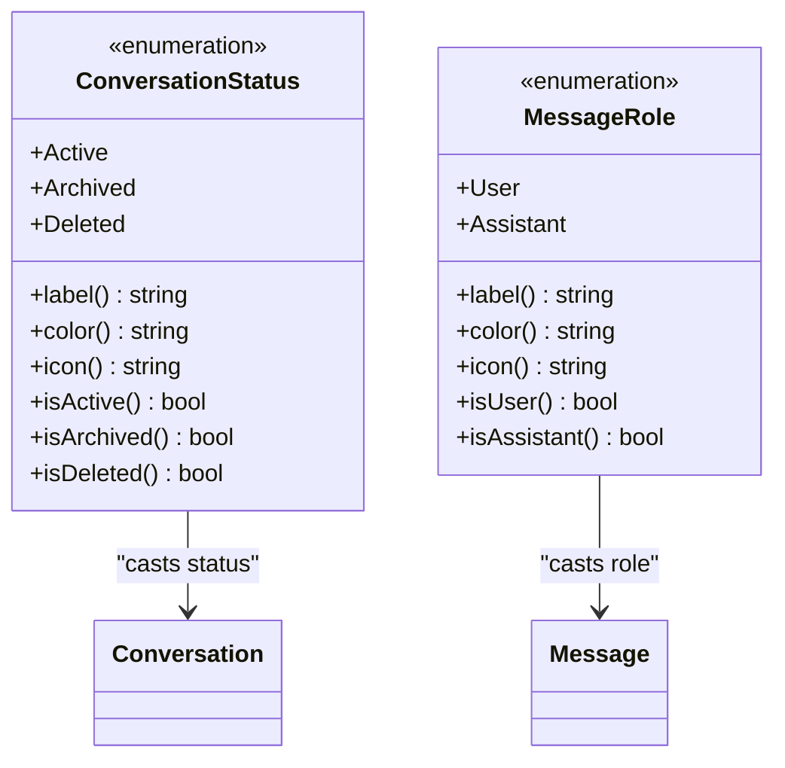
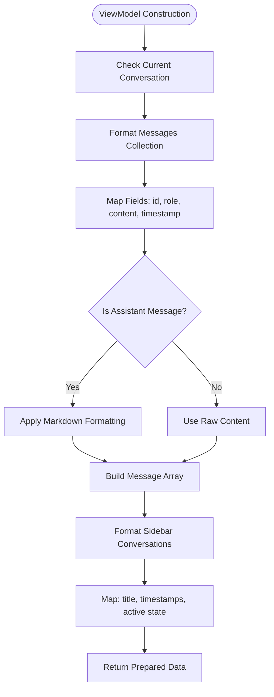
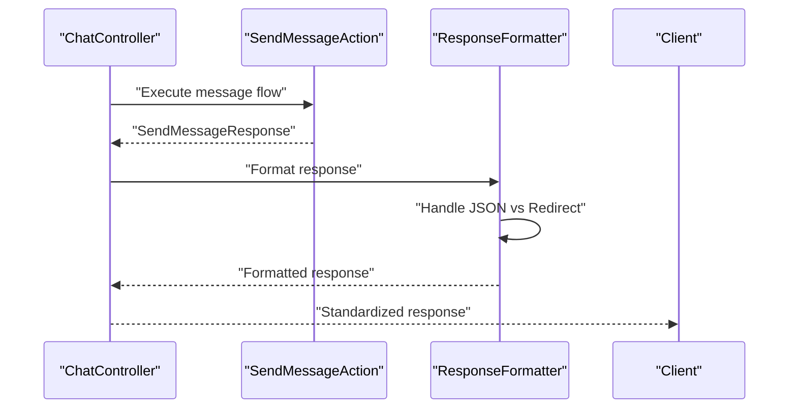
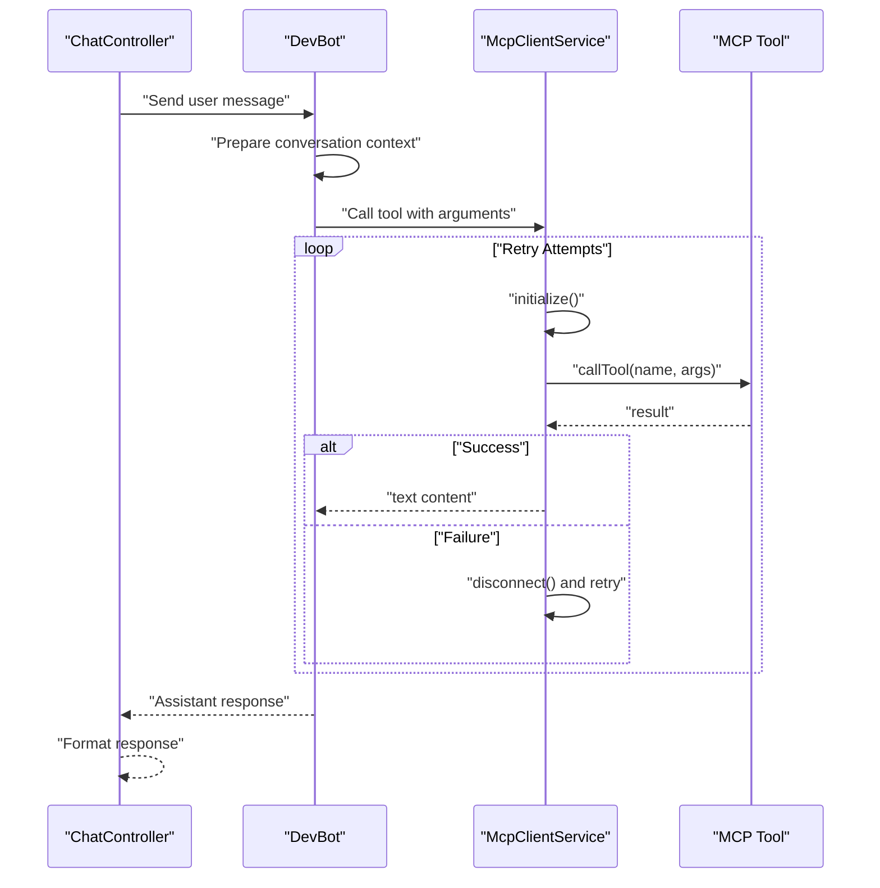
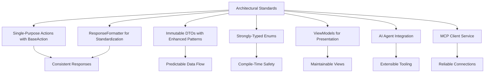
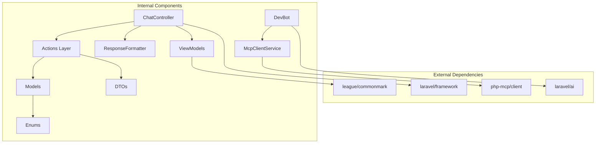

# Architectural Standards Specification

<cite>
**Referenced Files in This Document**
- [BaseAction.php](file://app/Actions/BaseAction.php)
- [CreateConversationAction.php](file://app/Actions/CreateConversationAction.php)
- [SendMessageAction.php](file://app/Actions/SendMessageAction.php)
- [ApiResponseData.php](file://app/DTOs/ApiResponseData.php)
- [ConversationData.php](file://app/DTOs/ConversationData.php)
- [MessageData.php](file://app/DTOs/MessageData.php)
- [SendMessageResponse.php](file://app/DTOs/SendMessageResponse.php)
- [ConversationStatus.php](file://app/Enums/ConversationStatus.php)
- [MessageRole.php](file://app/Enums/MessageRole.php)
- [ChatViewModel.php](file://app/ViewModels/ChatViewModel.php)
- [ChatController.php](file://app/Http/Controllers/ChatController.php)
- [ResponseFormatter.php](file://app/Services/ResponseFormatter.php)
- [Conversation.php](file://app/Models/Conversation.php)
- [Message.php](file://app/Models/Message.php)
- [DevBot.php](file://app/Ai/Agents/DevBot.php)
- [McpClientService.php](file://app/Services/McpClientService.php)
- [architecture.md](file://.agents/skills/laravel-best-practices/rules/architecture.md)
- [SKILL.md](file://.agents/skills/laravel-best-practices/SKILL.md)
- [app.php](file://bootstrap/app.php)
- [composer.json](file://composer.json)
</cite>

## Update Summary
**Changes Made**
- Updated Action Class Architecture section to reflect new BaseAction pattern and single-responsibility implementation
- Enhanced DTO Pattern documentation with new SendMessageResponse DTO and improved data transfer standards
- Expanded Enum Usage section to cover both ConversationStatus and MessageRole implementations
- Updated ViewModel Implementation section with new ChatViewModel enhancements
- Added Response Formatter service documentation as part of architectural standards
- Enhanced AI Agent Integration section with DevBot agent improvements

## Table of Contents
1. [Introduction](#introduction)
2. [Project Structure](#project-structure)
3. [Core Components](#core-components)
4. [Architecture Overview](#architecture-overview)
5. [Detailed Component Analysis](#detailed-component-analysis)
6. [Dependency Analysis](#dependency-analysis)
7. [Performance Considerations](#performance-considerations)
8. [Troubleshooting Guide](#troubleshooting-guide)
9. [Conclusion](#conclusion)

## Introduction
This document defines the architectural standards and design principles for the Laravel Assistant application. It establishes consistent patterns for business logic encapsulation, data transfer, strong typing, presentation layer separation, AI agent integration, and MCP tool connectivity. The standards are derived from the codebase's implementation and the Laravel Best Practices skill, ensuring maintainability, testability, and scalability.

## Project Structure
The application follows Laravel conventions with clear separation of concerns:
- Actions encapsulate business operations with BaseAction inheritance
- DTOs standardize data transfer with immutable patterns
- Enums enforce strong typing for domain values
- ViewModels handle presentation logic
- Controllers orchestrate requests and delegate to Actions
- Models define domain entities with casts and relationships
- AI agents integrate with Laravel AI and MCP tooling
- Services manage external integrations (e.g., MCP client)
- ResponseFormatter centralizes response formatting logic

**Diagram sources**
- [ChatController.php:19-104](file://app/Http/Controllers/ChatController.php#L19-L104)
- [ChatViewModel.php:29-120](file://app/ViewModels/ChatViewModel.php#L29-L120)
- [ResponseFormatter.php:19-112](file://app/Services/ResponseFormatter.php#L19-L112)
- [BaseAction.php:28-58](file://app/Actions/BaseAction.php#L28-L58)
- [Conversation.php:9-56](file://app/Models/Conversation.php#L9-L56)
- [Message.php:10-50](file://app/Models/Message.php#L10-L50)
- [ConversationStatus.php:23-89](file://app/Enums/ConversationStatus.php#L23-L89)
- [MessageRole.php:23-77](file://app/Enums/MessageRole.php#L23-L77)
- [ConversationData.php:29-58](file://app/DTOs/ConversationData.php#L29-L58)
- [MessageData.php:29-47](file://app/DTOs/MessageData.php#L29-L47)
- [SendMessageResponse.php:29-107](file://app/DTOs/SendMessageResponse.php#L29-L107)
- [ApiResponseData.php:31-90](file://app/DTOs/ApiResponseData.php#L31-L90)
- [DevBot.php:30-137](file://app/Ai/Agents/DevBot.php#L30-L137)
- [McpClientService.php:20-279](file://app/Services/McpClientService.php#L20-L279)

**Section sources**
- [ChatController.php:19-104](file://app/Http/Controllers/ChatController.php#L19-L104)
- [ChatViewModel.php:29-120](file://app/ViewModels/ChatViewModel.php#L29-L120)
- [ResponseFormatter.php:19-112](file://app/Services/ResponseFormatter.php#L19-L112)
- [BaseAction.php:28-58](file://app/Actions/BaseAction.php#L28-L58)
- [Conversation.php:9-56](file://app/Models/Conversation.php#L9-L56)
- [Message.php:10-50](file://app/Models/Message.php#L10-L50)
- [DevBot.php:30-137](file://app/Ai/Agents/DevBot.php#L30-L137)
- [McpClientService.php:20-279](file://app/Services/McpClientService.php#L20-L279)

## Core Components
This section outlines the foundational architectural components and their responsibilities:

- BaseAction: Provides consistent error handling and execution wrapping for all business operations with abstract execute method requirement
- Action Classes: Single-responsibility business operations extending BaseAction with type-safe DTO inputs
- DTOs: Immutable data carriers for API responses, conversation creation, message sending, and standardized responses
- Enums: Strongly-typed domain values for conversation status and message roles with metadata methods
- ViewModels: Presentation logic for chat interface data formatting with enhanced type safety
- Controllers: Thin orchestrators delegating to Actions and returning standardized responses via ResponseFormatter
- Models: Domain entities with attribute casting and relationship definitions using enums
- AI Agent: DevBot integrates with Laravel AI and MCP tool ecosystem with comprehensive tool management
- MCP Client Service: Manages connection lifecycle and tool invocation with auto-reconnect and retry logic
- ResponseFormatter: Centralizes response formatting logic to keep controllers thin

**Section sources**
- [BaseAction.php:28-58](file://app/Actions/BaseAction.php#L28-L58)
- [CreateConversationAction.php:29-53](file://app/Actions/CreateConversationAction.php#L29-L53)
- [SendMessageAction.php:42-144](file://app/Actions/SendMessageAction.php#L42-L144)
- [ApiResponseData.php:31-90](file://app/DTOs/ApiResponseData.php#L31-L90)
- [ConversationData.php:29-58](file://app/DTOs/ConversationData.php#L29-L58)
- [MessageData.php:29-47](file://app/DTOs/MessageData.php#L29-L47)
- [SendMessageResponse.php:29-107](file://app/DTOs/SendMessageResponse.php#L29-L107)
- [ConversationStatus.php:23-89](file://app/Enums/ConversationStatus.php#L23-L89)
- [MessageRole.php:23-77](file://app/Enums/MessageRole.php#L23-L77)
- [ChatViewModel.php:29-120](file://app/ViewModels/ChatViewModel.php#L29-L120)
- [ChatController.php:19-104](file://app/Http/Controllers/ChatController.php#L19-L104)
- [Conversation.php:9-56](file://app/Models/Conversation.php#L9-L56)
- [Message.php:10-50](file://app/Models/Message.php#L10-L50)
- [DevBot.php:30-137](file://app/Ai/Agents/DevBot.php#L30-L137)
- [McpClientService.php:20-279](file://app/Services/McpClientService.php#L20-L279)
- [ResponseFormatter.php:19-112](file://app/Services/ResponseFormatter.php#L19-L112)

## Architecture Overview
The system adheres to layered architecture with clear boundaries:
- Presentation: Controllers and ViewModels with ResponseFormatter
- Application: Actions implementing business capabilities with BaseAction inheritance
- Domain: Models with strong typing via Enums
- Infrastructure: AI Agent and MCP client service
- External Systems: Laravel AI, MCP tools, and third-party services

**Diagram sources**
- [BaseAction.php:28-58](file://app/Actions/BaseAction.php#L28-L58)
- [CreateConversationAction.php:29-53](file://app/Actions/CreateConversationAction.php#L29-L53)
- [SendMessageAction.php:42-144](file://app/Actions/SendMessageAction.php#L42-L144)
- [ResponseFormatter.php:19-112](file://app/Services/ResponseFormatter.php#L19-L112)
- [ChatController.php:19-104](file://app/Http/Controllers/ChatController.php#L19-L104)
- [ChatViewModel.php:29-120](file://app/ViewModels/ChatViewModel.php#L29-L120)
- [Conversation.php:9-56](file://app/Models/Conversation.php#L9-L56)
- [Message.php:10-50](file://app/Models/Message.php#L10-L50)
- [ConversationStatus.php:23-89](file://app/Enums/ConversationStatus.php#L23-L89)
- [MessageRole.php:23-77](file://app/Enums/MessageRole.php#L23-L77)
- [DevBot.php:30-137](file://app/Ai/Agents/DevBot.php#L30-L137)
- [McpClientService.php:20-279](file://app/Services/McpClientService.php#L20-L279)

## Detailed Component Analysis

### Business Logic Encapsulation with BaseAction Pattern
Actions encapsulate single-responsibility business operations with consistent error handling through BaseAction inheritance. They provide a uniform execution pattern and enable dependency injection over helper functions.

**Diagram sources**
- [ChatController.php:54-64](file://app/Http/Controllers/ChatController.php#L54-L64)
- [BaseAction.php:49-56](file://app/Actions/BaseAction.php#L49-L56)
- [CreateConversationAction.php:37-51](file://app/Actions/CreateConversationAction.php#L37-L51)
- [Conversation.php:9-56](file://app/Models/Conversation.php#L9-L56)

**Section sources**
- [BaseAction.php:28-58](file://app/Actions/BaseAction.php#L28-L58)
- [CreateConversationAction.php:29-53](file://app/Actions/CreateConversationAction.php#L29-L53)
- [ChatController.php:54-64](file://app/Http/Controllers/ChatController.php#L54-L64)

### Enhanced DTO Pattern Implementation
DTOs ensure immutable data transfer between layers, while ApiResponseData and SendMessageResponse standardize API responses across the application with comprehensive formatting capabilities.

**Diagram sources**
- [ApiResponseData.php:31-90](file://app/DTOs/ApiResponseData.php#L31-L90)
- [ConversationData.php:29-58](file://app/DTOs/ConversationData.php#L29-L58)
- [MessageData.php:29-47](file://app/DTOs/MessageData.php#L29-L47)
- [SendMessageResponse.php:29-107](file://app/DTOs/SendMessageResponse.php#L29-L107)

**Section sources**
- [ApiResponseData.php:31-90](file://app/DTOs/ApiResponseData.php#L31-L90)
- [ConversationData.php:29-58](file://app/DTOs/ConversationData.php#L29-L58)
- [MessageData.php:29-47](file://app/DTOs/MessageData.php#L29-L47)
- [SendMessageResponse.php:29-107](file://app/DTOs/SendMessageResponse.php#L29-L107)

### Strong Typing with Enhanced Enums
Enums provide compile-time safety and metadata methods for UI rendering and filtering, with both ConversationStatus and MessageRole implementations offering comprehensive functionality.

**Diagram sources**
- [ConversationStatus.php:23-89](file://app/Enums/ConversationStatus.php#L23-L89)
- [MessageRole.php:23-77](file://app/Enums/MessageRole.php#L23-L77)
- [Conversation.php:22-24](file://app/Models/Conversation.php#L22-L24)
- [Message.php:23-25](file://app/Models/Message.php#L23-L25)

**Section sources**
- [ConversationStatus.php:23-89](file://app/Enums/ConversationStatus.php#L23-L89)
- [MessageRole.php:23-77](file://app/Enums/MessageRole.php#L23-L77)

### Enhanced Presentation Layer with ViewModels
ViewModels centralize presentation logic, keeping controllers thin and views simple, with enhanced type safety and comprehensive data formatting capabilities.

**Diagram sources**
- [ChatViewModel.php:59-102](file://app/ViewModels/ChatViewModel.php#L59-L102)

**Section sources**
- [ChatViewModel.php:29-120](file://app/ViewModels/ChatViewModel.php#L29-L120)

### Response Formatting and Standardization
ResponseFormatter centralizes response formatting logic, extracting formatting responsibilities from controllers to maintain thin controller architecture and consistent response patterns.

**Diagram sources**
- [ChatController.php:86-102](file://app/Http/Controllers/ChatController.php#L86-L102)
- [ResponseFormatter.php:88-110](file://app/Services/ResponseFormatter.php#L88-L110)
- [SendMessageAction.php:61-94](file://app/Actions/SendMessageAction.php#L61-L94)

**Section sources**
- [ResponseFormatter.php:19-112](file://app/Services/ResponseFormatter.php#L19-L112)
- [ChatController.php:86-102](file://app/Http/Controllers/ChatController.php#L86-L102)

### AI Agent Integration and MCP Tool Connectivity
DevBot integrates with Laravel AI and MCP tools, while McpClientService manages connection lifecycle and reliability with comprehensive retry logic and auto-reconnect capabilities.

**Diagram sources**
- [ChatController.php:86-102](file://app/Http/Controllers/ChatController.php#L86-L102)
- [DevBot.php:109-135](file://app/Ai/Agents/DevBot.php#L109-L135)
- [McpClientService.php:110-179](file://app/Services/McpClientService.php#L110-L179)

**Section sources**
- [DevBot.php:30-137](file://app/Ai/Agents/DevBot.php#L30-L137)
- [McpClientService.php:20-279](file://app/Services/McpClientService.php#L20-L279)

### Conceptual Overview
The architecture emphasizes:
- Separation of concerns through Actions, DTOs, Enums, and ViewModels with BaseAction inheritance
- Consistent error handling via BaseAction.run() wrapper
- Strong typing for domain values through enhanced enum implementations
- Thin controllers delegating to Actions with ResponseFormatter
- Centralized presentation logic in ViewModels with comprehensive data transformation
- Reliable AI tool integration with MCP client service and comprehensive retry logic
- Standardized response formatting through ResponseFormatter service

[No sources needed since this diagram shows conceptual workflow, not actual code structure]

## Dependency Analysis
The application maintains low coupling and high cohesion through clear interfaces and dependency inversion:

**Diagram sources**
- [composer.json:11-28](file://composer.json#L11-L28)
- [ChatController.php:5-18](file://app/Http/Controllers/ChatController.php#L5-L18)
- [DevBot.php:5-24](file://app/Ai/Agents/DevBot.php#L5-L24)
- [McpClientService.php:5-11](file://app/Services/McpClientService.php#L5-L11)

**Section sources**
- [composer.json:11-28](file://composer.json#L11-L28)
- [composer.json:83-94](file://composer.json#L83-L94)

## Performance Considerations
- Database performance: Eager load relations to prevent N+1 queries; use appropriate indexing
- Caching strategies: Leverage Cache::remember and Cache::lock for race conditions
- Query optimization: Use whereBelongsTo, cursor() for memory efficiency, and selective column retrieval
- HTTP client: Set explicit timeouts and retry with exponential backoff
- Queue and jobs: Configure retry_after greater than job timeout; use ShouldBeUnique for deduplication
- Task scheduling: Use withoutOverlapping() and onOneServer() for distributed environments
- String handling: Prefer mb_* functions for UTF-8 safety
- DTO immutability: Leverage readonly DTOs for better memory efficiency
- Enum casting: Use string-backed enums for efficient database storage and comparison

[No sources needed since this section provides general guidance]

## Troubleshooting Guide
Common issues and resolutions:
- Action execution failures: BaseAction.run() wraps callbacks and delegates to handleException(); ensure proper exception propagation
- DTO validation: Use static factory methods (fromRequest, fromMessage) for type-safe data creation
- Enum casting failures: Verify enum casting in models matches expected string values
- ViewModel data formatting: Check collection mapping and field access patterns
- Response formatting: Use ResponseFormatter methods for consistent response patterns
- MCP client connectivity: McpClientService.initialize() handles connection lifecycle; verify configuration and retry logic
- AI tool failures: DevBot.tools() provides available tools; check tool availability and argument formatting
- Database query performance: Use chunk()/chunkById() for large datasets; implement proper indexing
- API response formatting: ApiResponseData and SendMessageResponse ensure consistent response structure

**Section sources**
- [BaseAction.php:36-56](file://app/Actions/BaseAction.php#L36-L56)
- [ConversationData.php:39-44](file://app/DTOs/ConversationData.php#L39-L44)
- [MessageData.php:39-44](file://app/DTOs/MessageData.php#L39-L44)
- [ConversationStatus.php:23-89](file://app/Enums/ConversationStatus.php#L23-L89)
- [MessageRole.php:23-77](file://app/Enums/MessageRole.php#L23-L77)
- [ChatViewModel.php:59-102](file://app/ViewModels/ChatViewModel.php#L59-L102)
- [ResponseFormatter.php:88-110](file://app/Services/ResponseFormatter.php#L88-L110)
- [McpClientService.php:48-96](file://app/Services/McpClientService.php#L48-L96)
- [DevBot.php:123-135](file://app/Ai/Agents/DevBot.php#L123-L135)
- [ApiResponseData.php:31-90](file://app/DTOs/ApiResponseData.php#L31-L90)
- [SendMessageResponse.php:29-107](file://app/DTOs/SendMessageResponse.php#L29-L107)

## Conclusion
The Laravel Assistant enforces architectural standards through consistent patterns: single-purpose Actions with BaseAction inheritance, immutable DTOs with enhanced patterns, strongly-typed Enums, ViewModel-driven presentation with comprehensive formatting, ResponseFormatter for standardized responses, and robust AI/MCP integration. These standards ensure maintainability, testability, and scalability while aligning with Laravel best practices and the project's AI-first design goals.