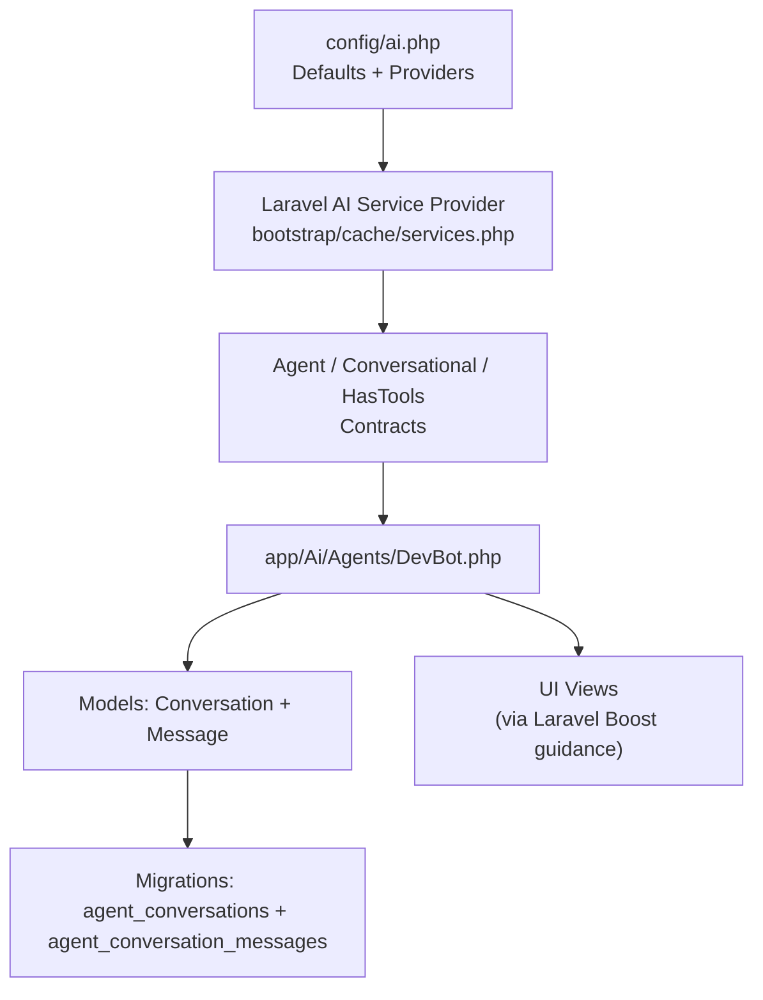
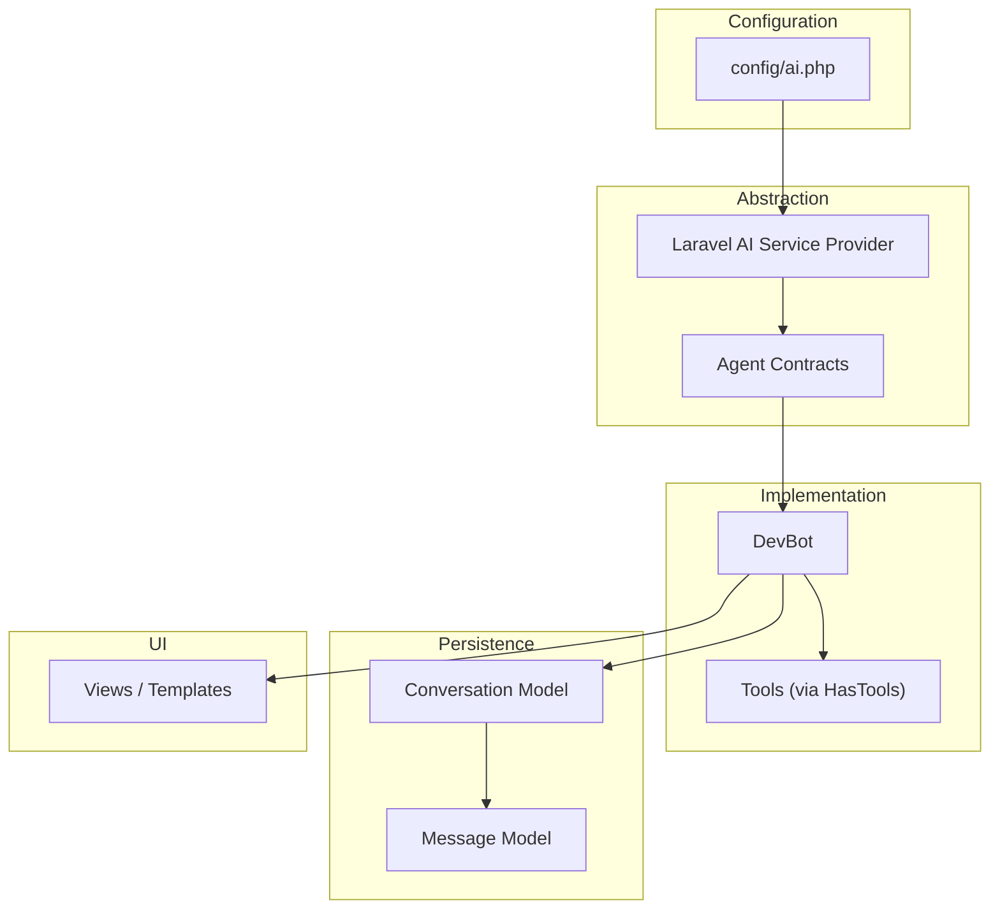
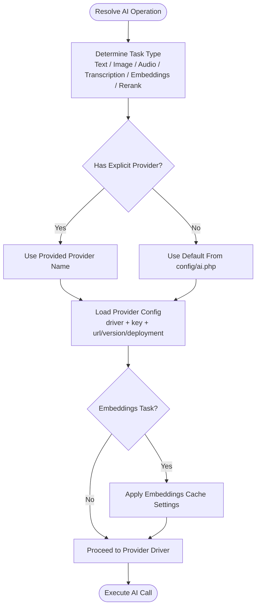
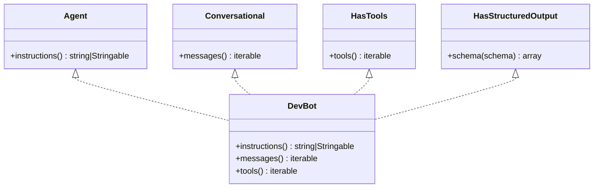
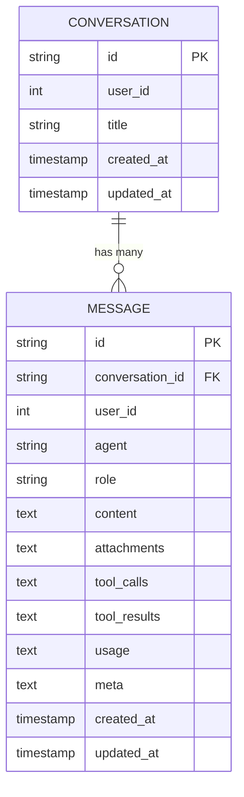
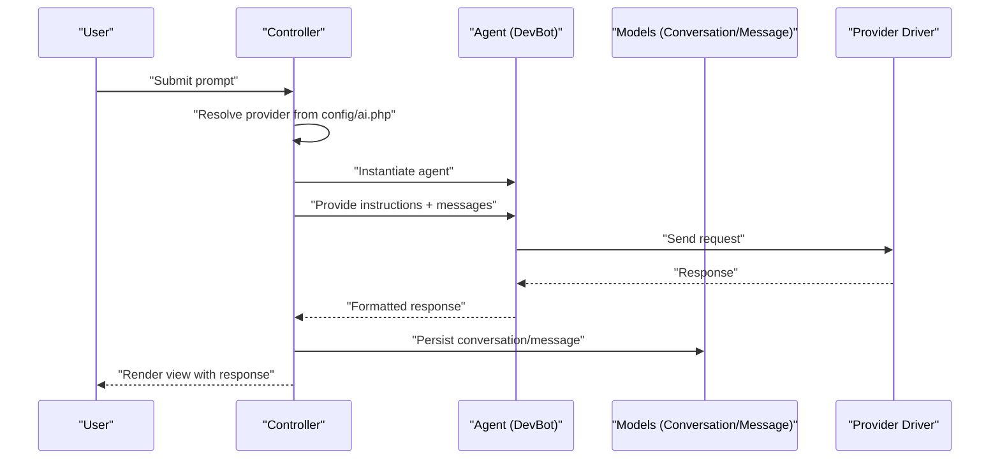
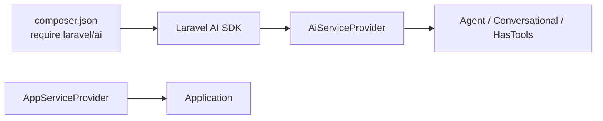

# AI Integration Patterns

<cite>
**Referenced Files in This Document**
- [config/ai.php](file://config/ai.php)
- [composer.json](file://composer.json)
- [bootstrap/cache/services.php](file://bootstrap/cache/services.php)
- [app/Ai/Agents/DevBot.php](file://app/Ai/Agents/DevBot.php)
- [app/Models/Conversation.php](file://app/Models/Conversation.php)
- [app/Models/Message.php](file://app/Models/Message.php)
- [database/migrations/2026_04_02_115916_create_agent_conversations_table.php](file://database/migrations/2026_04_02_115916_create_agent_conversations_table.php)
- [stubs/structured-agent.stub](file://stubs/structured-agent.stub)
- [openspec/changes/devbot-ai-agent/design.md](file://openspec/changes/devbot-ai-agent/design.md)
- [AGENTS.md](file://AGENTS.md)
- [CLAUDE.md](file://CLAUDE.md)
- [GEMINI.md](file://GEMINI.md)
- [app/Http/Controllers/Controller.php](file://app/Http/Controllers/Controller.php)
- [app/Models/User.php](file://app/Models/User.php)
- [bootstrap/providers.php](file://bootstrap/providers.php)
- [app/Providers/AppServiceProvider.php](file://app/Providers/AppServiceProvider.php)
</cite>

## Table of Contents
1. [Introduction](#introduction)
2. [Project Structure](#project-structure)
3. [Core Components](#core-components)
4. [Architecture Overview](#architecture-overview)
5. [Detailed Component Analysis](#detailed-component-analysis)
6. [Dependency Analysis](#dependency-analysis)
7. [Performance Considerations](#performance-considerations)
8. [Troubleshooting Guide](#troubleshooting-guide)
9. [Conclusion](#conclusion)
10. [Appendices](#appendices)

## Introduction
This document explains the AI integration architectural patterns within the Laravel Assistant framework. It focuses on how AI services are abstracted through Laravel’s service container, configured via config/ai.php, and how a multi-provider architecture supports different AI backends (Anthropic, Gemini, Azure OpenAI, Cohere, DeepSeek, ElevenLabs, Groq, Jina, Mistral, Ollama, OpenAI, OpenRouter, Voyage, XAI) through unified interfaces. It also documents the agent skill system, how it extends Laravel’s MVC pattern, caching strategies, provider selection logic, fallback mechanisms, and practical examples of integrating AI into controllers and models. Finally, it addresses performance, error handling, and security implications.

## Project Structure
The Laravel Assistant project integrates the official Laravel AI SDK and introduces agent-centric components layered on top of Laravel’s MVC. Key areas:
- Configuration: config/ai.php defines defaults and provider credentials.
- Service Container: Laravel AI SDK registers its service provider, exposing AI abstractions.
- Agents: app/Ai/Agents/DevBot.php implements the Agent, Conversational, and HasTools contracts.
- Persistence: app/Models/Conversation.php and app/Models/Message.php persist conversations and messages.
- Migrations: database/migrations/...create_agent_conversations_table.php sets up relational storage for agent conversations.
- Stubs and Guidance: stubs/structured-agent.stub and openspec/.../design.md provide patterns and rationale for agent design and UI delivery.

**Diagram sources**
- [config/ai.php:1-132](file://config/ai.php#L1-L132)
- [bootstrap/cache/services.php:27](file://bootstrap/cache/services.php#L27)
- [app/Ai/Agents/DevBot.php:13-44](file://app/Ai/Agents/DevBot.php#L13-L44)
- [app/Models/Conversation.php:8-28](file://app/Models/Conversation.php#L8-L28)
- [app/Models/Message.php:8-33](file://app/Models/Message.php#L8-L33)
- [database/migrations/2026_04_02_115916_create_agent_conversations_table.php:7-39](file://database/migrations/2026_04_02_115916_create_agent_conversations_table.php#L7-L39)

**Section sources**
- [config/ai.php:1-132](file://config/ai.php#L1-L132)
- [bootstrap/cache/services.php:27](file://bootstrap/cache/services.php#L27)
- [app/Ai/Agents/DevBot.php:13-44](file://app/Ai/Agents/DevBot.php#L13-L44)
- [app/Models/Conversation.php:8-28](file://app/Models/Conversation.php#L8-L28)
- [app/Models/Message.php:8-33](file://app/Models/Message.php#L8-L33)
- [database/migrations/2026_04_02_115916_create_agent_conversations_table.php:7-39](file://database/migrations/2026_04_02_115916_create_agent_conversations_table.php#L7-L39)

## Core Components
- AI configuration and provider selection:
  - Defaults for general text, images, audio, transcription, embeddings, and reranking are defined in config/ai.php.
  - Providers include Anthropic, Azure OpenAI, Cohere, DeepSeek, ElevenLabs, Gemini, Groq, Jina, Mistral, Ollama, OpenAI, OpenRouter, Voyage, and XAI.
  - Environment variables supply API keys and optional overrides per provider.
- Agent contracts and implementation:
  - DevBot implements Agent, Conversational, and HasTools, enabling instruction-driven behavior, message history, and tool availability.
  - Structured output agents can be scaffolded using stubs/structured-agent.stub.
- Persistence:
  - Conversation and Message models encapsulate relational storage for agent interactions.
  - Migrations define primary keys, foreign keys, indexes, and JSON-like text fields for attachments, tool calls/results, usage, and metadata.
- Service container integration:
  - The Laravel AI SDK registers its service provider, making AI abstractions available via dependency injection and configuration.

**Section sources**
- [config/ai.php:16-129](file://config/ai.php#L16-L129)
- [app/Ai/Agents/DevBot.php:13-44](file://app/Ai/Agents/DevBot.php#L13-L44)
- [stubs/structured-agent.stub:15-56](file://stubs/structured-agent.stub#L15-L56)
- [app/Models/Conversation.php:10-18](file://app/Models/Conversation.php#L10-L18)
- [app/Models/Message.php:10-18](file://app/Models/Message.php#L10-L18)
- [database/migrations/2026_04_02_115916_create_agent_conversations_table.php:14-39](file://database/migrations/2026_04_02_115916_create_agent_conversations_table.php#L14-L39)
- [bootstrap/cache/services.php:27](file://bootstrap/cache/services.php#L27)

## Architecture Overview
The AI integration follows a layered architecture:
- Configuration layer: config/ai.php centralizes defaults and provider credentials.
- Abstraction layer: Laravel AI SDK contracts define agent behavior, conversation state, and tooling.
- Implementation layer: DevBot and other agents implement contracts; tools can be added to extend capabilities.
- Persistence layer: Eloquent models and migrations store conversation history and metadata.
- UI layer: Views and templates integrate with the agent runtime; Laravel Boost guidelines support Tailwind-based UIs.

**Diagram sources**
- [config/ai.php:16-129](file://config/ai.php#L16-L129)
- [bootstrap/cache/services.php:27](file://bootstrap/cache/services.php#L27)
- [app/Ai/Agents/DevBot.php:13-44](file://app/Ai/Agents/DevBot.php#L13-L44)
- [app/Models/Conversation.php:8-28](file://app/Models/Conversation.php#L8-L28)
- [app/Models/Message.php:8-33](file://app/Models/Message.php#L8-L33)

## Detailed Component Analysis

### AI Configuration and Multi-Provider Architecture
- Defaults:
  - General text: Anthropic
  - Images: Gemini
  - Audio: OpenAI
  - Transcription: OpenAI
  - Embeddings: OpenAI
  - Reranking: Cohere
- Providers:
  - Each provider defines driver, key, and optional URL/version/deployment settings.
  - Environment variables enable secure credential management and override defaults.
- Caching:
  - Embeddings caching can be toggled and routed to a named cache store.

**Diagram sources**
- [config/ai.php:16-39](file://config/ai.php#L16-L39)
- [config/ai.php:52-129](file://config/ai.php#L52-L129)

**Section sources**
- [config/ai.php:16-39](file://config/ai.php#L16-L39)
- [config/ai.php:52-129](file://config/ai.php#L52-L129)

### Agent Skill System and MVC Extension
- Agent contracts:
  - Agent, Conversational, HasTools, and HasStructuredOutput define the agent surface.
  - DevBot demonstrates instructions, message history, and tool availability.
- MVC extension:
  - Controllers orchestrate user input and delegate AI interactions to agents.
  - Models persist conversation state and messages.
  - Views render UI and collect user prompts.
- Structured output:
  - The structured-agent.stub shows how to define a JSON schema for agent output.

**Diagram sources**
- [app/Ai/Agents/DevBot.php:13-44](file://app/Ai/Agents/DevBot.php#L13-L44)
- [stubs/structured-agent.stub:15-56](file://stubs/structured-agent.stub#L15-L56)

**Section sources**
- [app/Ai/Agents/DevBot.php:13-44](file://app/Ai/Agents/DevBot.php#L13-L44)
- [stubs/structured-agent.stub:15-56](file://stubs/structured-agent.stub#L15-L56)

### Conversation and Message Models
- Conversation:
  - Fillable fields include user_id and title.
  - Relationship to messages ordered by creation time.
  - Utility to derive a title from the first message.
  - Accessor to fetch recent messages.
- Message:
  - Fillable fields include conversation_id, role, and content.
  - Role casting to string.
  - Relationship to Conversation.
  - Helpers to identify user messages and format timestamps.

**Diagram sources**
- [database/migrations/2026_04_02_115916_create_agent_conversations_table.php:14-39](file://database/migrations/2026_04_02_115916_create_agent_conversations_table.php#L14-L39)
- [app/Models/Conversation.php:10-18](file://app/Models/Conversation.php#L10-L18)
- [app/Models/Message.php:10-18](file://app/Models/Message.php#L10-L18)

**Section sources**
- [app/Models/Conversation.php:8-28](file://app/Models/Conversation.php#L8-L28)
- [app/Models/Message.php:8-33](file://app/Models/Message.php#L8-L33)
- [database/migrations/2026_04_02_115916_create_agent_conversations_table.php:14-39](file://database/migrations/2026_04_02_115916_create_agent_conversations_table.php#L14-L39)

### Practical Integration Examples

#### Integrating AI into a Controller
- Typical flow:
  - Accept user input via request.
  - Resolve provider from config/ai.php defaults or explicit parameter.
  - Instantiate agent (e.g., DevBot) and optionally attach tools.
  - Persist conversation and messages using models.
  - Render response via view.

[No sources needed since this diagram shows conceptual workflow, not actual code structure]

#### Integrating AI into a Model
- Use models to:
  - Derive conversation titles from first message.
  - Fetch recent messages for context.
  - Attach metadata (usage, tool calls/results) via message fields.

**Section sources**
- [app/Models/Conversation.php:20-23](file://app/Models/Conversation.php#L20-L23)
- [app/Models/Conversation.php:25-28](file://app/Models/Conversation.php#L25-L28)
- [app/Models/Message.php:25-33](file://app/Models/Message.php#L25-L33)

### Agent Design and UI Delivery
- Design rationale:
  - Dedicated agent class implementing contracts improves maintainability and testability.
  - Relational storage via migrations enables robust querying and filtering.
  - UI built with Blade and Tailwind CSS, following Laravel Boost guidelines.
- Delivery pattern:
  - Progressive enhancement from form submission to AJAX as needed.

**Section sources**
- [openspec/changes/devbot-ai-agent/design.md:34-69](file://openspec/changes/devbot-ai-agent/design.md#L34-L69)
- [AGENTS.md:28-30](file://AGENTS.md#L28-L30)

## Dependency Analysis
- Laravel AI SDK:
  - Installed via composer.json and registered via its service provider.
  - Provides contracts and drivers for multiple AI backends.
- Service provider registration:
  - Confirmed in bootstrap/cache/services.php where Laravel AI’s provider appears in eager loading.
- Application providers:
  - AppServiceProvider is present but does not override AI bindings.

**Diagram sources**
- [composer.json:13](file://composer.json#L13)
- [bootstrap/cache/services.php:27](file://bootstrap/cache/services.php#L27)
- [app/Providers/AppServiceProvider.php:7-24](file://app/Providers/AppServiceProvider.php#L7-L24)

**Section sources**
- [composer.json:13](file://composer.json#L13)
- [bootstrap/cache/services.php:27](file://bootstrap/cache/services.php#L27)
- [app/Providers/AppServiceProvider.php:7-24](file://app/Providers/AppServiceProvider.php#L7-L24)

## Performance Considerations
- Embedding caching:
  - config/ai.php supports toggling and selecting a cache store for embeddings to reduce repeated compute costs.
- Indexing:
  - Migrations define composite and single-column indexes on conversation/message tables to optimize lookups by user and updated_at.
- Provider selection:
  - Defaults minimize configuration overhead; explicit provider selection allows routing heavy tasks to specialized providers.
- Structured output:
  - Using HasStructuredOutput reduces ambiguity and retries by constraining model output format.

**Section sources**
- [config/ai.php:34-39](file://config/ai.php#L34-L39)
- [database/migrations/2026_04_02_115916_create_agent_conversations_table.php:20](file://database/migrations/2026_04_02_115916_create_agent_conversations_table.php#L20)
- [database/migrations/2026_04_02_115916_create_agent_conversations_table.php:37](file://database/migrations/2026_04_02_115916_create_agent_conversations_table.php#L37)

## Troubleshooting Guide
- Missing API keys:
  - Ensure environment variables for selected providers are set; config/ai.php reads keys via env().
- Provider misconfiguration:
  - Verify driver, URL, version, and deployment settings for cloud providers.
- Embedding cache issues:
  - Confirm cache store availability and permissions when embeddings caching is enabled.
- Conversation persistence:
  - Check migrations are applied and indexes are present for optimal performance.
- Agent contract compliance:
  - Ensure agents implement required methods (instructions, messages, tools) and return expected types.

**Section sources**
- [config/ai.php:52-129](file://config/ai.php#L52-L129)
- [database/migrations/2026_04_02_115916_create_agent_conversations_table.php:14-39](file://database/migrations/2026_04_02_115916_create_agent_conversations_table.php#L14-L39)

## Conclusion
The Laravel Assistant framework leverages Laravel’s service container and the Laravel AI SDK to deliver a flexible, multi-provider AI platform. Configuration-driven defaults and environment-backed credentials enable seamless provider switching. The agent skill system extends MVC by encapsulating conversational logic in dedicated classes, while Eloquent models and migrations provide robust persistence. With caching, indexing, and structured output, the system balances performance, maintainability, and scalability. Security is addressed through environment-based secrets and controlled exposure of agent capabilities.

## Appendices

### Appendix A: Provider Selection Logic
- Determine task type (text, image, audio, transcription, embeddings, rerank).
- If explicit provider supplied, use it; otherwise, use defaults from config/ai.php.
- Load provider configuration (driver, key, URL/version/deployment).
- For embeddings, apply cache settings.
- Execute provider call and persist results.

**Section sources**
- [config/ai.php:16-39](file://config/ai.php#L16-L39)
- [config/ai.php:52-129](file://config/ai.php#L52-L129)

### Appendix B: Agent Implementation Patterns
- Use DevBot as a baseline for instruction-driven agents.
- Extend HasTools to add capabilities.
- Use HasStructuredOutput for constrained JSON responses.
- Scaffold with stubs/structured-agent.stub.

**Section sources**
- [app/Ai/Agents/DevBot.php:13-44](file://app/Ai/Agents/DevBot.php#L13-L44)
- [stubs/structured-agent.stub:15-56](file://stubs/structured-agent.stub#L15-L56)

### Appendix C: UI and View Integration
- Follow Laravel Boost guidelines for Tailwind-based UIs.
- Progressive enhancement from form submissions to AJAX.
- Use views to render agent skills and interactive chat.

**Section sources**
- [AGENTS.md:28-30](file://AGENTS.md#L28-L30)
- [openspec/changes/devbot-ai-agent/design.md:52-69](file://openspec/changes/devbot-ai-agent/design.md#L52-L69)