# Architecture Overview

<cite>
**Referenced Files in This Document**
- [composer.json](file://composer.json)
- [bootstrap/app.php](file://bootstrap/app.php)
- [config/app.php](file://config/app.php)
- [config/ai.php](file://config/ai.php)
- [config/services.php](file://config/services.php)
- [routes/web.php](file://routes/web.php)
- [app/Providers/AppServiceProvider.php](file://app/Providers/AppServiceProvider.php)
- [app/Http/Controllers/Controller.php](file://app/Http/Controllers/Controller.php)
- [app/Http/Controllers/ChatController.php](file://app/Http/Controllers/ChatController.php)
- [app/Models/User.php](file://app/Models/User.php)
- [app/Models/Conversation.php](file://app/Models/Conversation.php)
- [app/Models/Message.php](file://app/Models/Message.php)
- [app/Actions/BaseAction.php](file://app/Actions/BaseAction.php)
- [app/Actions/CreateConversationAction.php](file://app/Actions/CreateConversationAction.php)
- [app/DTOs/ApiResponseData.php](file://app/DTOs/ApiResponseData.php)
- [app/DTOs/ConversationData.php](file://app/DTOs/ConversationData.php)
- [app/DTOs/MessageData.php](file://app/DTOs/MessageData.php)
- [app/Enums/ConversationStatus.php](file://app/Enums/ConversationStatus.php)
- [app/Enums/MessageRole.php](file://app/Enums/MessageRole.php)
- [app/ViewModels/ChatViewModel.php](file://app/ViewModels/ChatViewModel.php)
- [database/migrations/2026_04_02_123216_create_conversations_table.php](file://database/migrations/2026_04_02_123216_create_conversations_table.php)
- [database/migrations/2026_04_02_123238_create_messages_table.php](file://database/migrations/2026_04_02_123238_create_messages_table.php)
- [stubs/agent.stub](file://stubs/agent.stub)
- [stubs/structured-agent.stub](file://stubs/structured-agent.stub)
- [stubs/tool.stub](file://stubs/tool.stub)
- [AGENTS.md](file://AGENTS.md)
- [package.json](file://package.json)
- [vite.config.js](file://vite.config.js)
- [README.md](file://README.md)
</cite>

## Update Summary
**Changes Made**
- Added comprehensive documentation for the five-layer professional Laravel architecture framework
- Documented Actions layer for business logic orchestration
- Documented DTOs layer for strongly-typed data transfer
- Documented Enums layer for type-safe status management
- Documented ViewModels layer for complex view data preparation
- Updated MVC architecture section to reflect integration with new architectural layers
- Enhanced component interaction diagrams to show new architectural patterns
- Updated dependency analysis to include new architectural components

## Table of Contents
1. [Introduction](#introduction)
2. [Professional Laravel Architecture Framework](#professional-laravel-architecture-framework)
3. [Five Core Architectural Layers](#five-core-architectural-layers)
4. [Project Structure](#project-structure)
5. [Core Components](#core-components)
6. [Architecture Overview](#architecture-overview)
7. [Detailed Component Analysis](#detailed-component-analysis)
8. [Dependency Analysis](#dependency-analysis)
9. [Performance Considerations](#performance-considerations)
10. [Troubleshooting Guide](#troubleshooting-guide)
11. [Conclusion](#conclusion)
12. [Appendices](#appendices)

## Introduction
This document describes the architecture of the Laravel Assistant system, focusing on how Laravel's MVC architecture is extended with AI integration layers through a professional Laravel architecture framework. The system leverages Laravel 13, the Laravel AI SDK, and Laravel Boost to enable an agent-driven development workflow. The framework establishes five core architectural layers: Actions for business logic orchestration, DTOs for strongly-typed data transfer, Enums for type-safe status management, ViewModels for complex view data preparation, and specialized directories under app/ namespace. The system documents the application bootstrap process, service provider registration, routing configuration, and the integration patterns with external AI providers. The document also explains the agent-based development approach and how it extends standard Laravel conventions, including controllers, models, and AI services.

## Professional Laravel Architecture Framework
The Laravel Assistant system implements a professional Laravel architecture framework that organizes code into five distinct layers, each serving a specific architectural responsibility. This framework promotes separation of concerns, improves code maintainability, and enables consistent patterns across the application.

### Five Core Architectural Layers
The framework establishes five core architectural layers that work together to create a robust, maintainable application structure:

1. **Actions Layer**: Business logic orchestration through single-responsibility action classes
2. **DTOs Layer**: Strongly-typed data transfer objects for consistent data handling
3. **Enums Layer**: Type-safe enumerations for status management and role definitions
4. **ViewModels Layer**: Complex view data preparation and presentation logic
5. **Models Layer**: Data persistence and business entity definitions

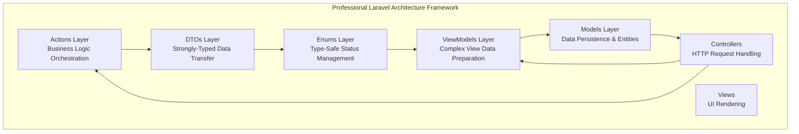

**Diagram sources**
- [app/Actions/BaseAction.php:28-57](file://app/Actions/BaseAction.php#L28-L57)
- [app/DTOs/ConversationData.php:29-57](file://app/DTOs/ConversationData.php#L29-L57)
- [app/Enums/ConversationStatus.php:23-88](file://app/Enums/ConversationStatus.php#L23-L88)
- [app/ViewModels/ChatViewModel.php:29-119](file://app/ViewModels/ChatViewModel.php#L29-L119)
- [app/Models/Conversation.php:9-50](file://app/Models/Conversation.php#L9-L50)

**Section sources**
- [app/Actions/BaseAction.php:28-57](file://app/Actions/BaseAction.php#L28-L57)
- [app/DTOs/ConversationData.php:29-57](file://app/DTOs/ConversationData.php#L29-L57)
- [app/Enums/ConversationStatus.php:23-88](file://app/Enums/ConversationStatus.php#L23-L88)
- [app/ViewModels/ChatViewModel.php:29-119](file://app/ViewModels/ChatViewModel.php#L29-L119)
- [app/Models/Conversation.php:9-50](file://app/Models/Conversation.php#L9-L50)

## Five Core Architectural Layers

### Actions Layer - Business Logic Orchestration
The Actions layer provides single-responsibility business logic orchestration through action classes that encapsulate specific business operations. Each action extends the BaseAction class and implements an execute() method, providing consistent error handling patterns and conventions.

**Key Features:**
- Single responsibility principle enforcement
- Built-in exception handling and error propagation
- Consistent method signatures across all actions
- Easy testability and mocking capabilities

**Implementation Examples:**
- CreateConversationAction: Handles conversation creation logic
- SendMessageAction: Manages message sending and AI interaction
- GetConversationAction: Retrieves conversation data with proper loading
- ListConversationsAction: Provides paginated conversation listings

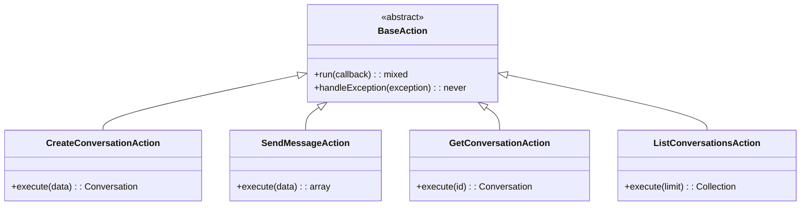

**Diagram sources**
- [app/Actions/BaseAction.php:28-57](file://app/Actions/BaseAction.php#L28-L57)
- [app/Actions/CreateConversationAction.php:29-52](file://app/Actions/CreateConversationAction.php#L29-L52)

**Section sources**
- [app/Actions/BaseAction.php:28-57](file://app/Actions/BaseAction.php#L28-L57)
- [app/Actions/CreateConversationAction.php:29-52](file://app/Actions/CreateConversationAction.php#L29-L52)

### DTOs Layer - Strongly-Typed Data Transfer Objects
The DTOs layer provides immutable data transfer objects that enforce type safety and provide consistent data structures across application boundaries. DTOs replace raw arrays and request objects, ensuring predictable data flow and improved IDE support.

**Key Features:**
- Immutable data structures with readonly properties
- Static factory methods for object creation
- Input validation and transformation
- Consistent serialization to arrays

**Implementation Examples:**
- ConversationData: Encapsulates conversation creation parameters
- MessageData: Handles message submission data
- ApiResponseData: Standardizes API response structures

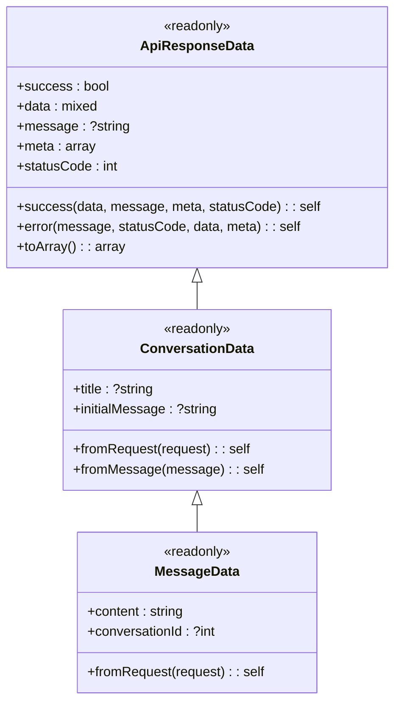

**Diagram sources**
- [app/DTOs/ConversationData.php:29-57](file://app/DTOs/ConversationData.php#L29-L57)
- [app/DTOs/MessageData.php:29-46](file://app/DTOs/MessageData.php#L29-L46)
- [app/DTOs/ApiResponseData.php:31-89](file://app/DTOs/ApiResponseData.php#L31-L89)

**Section sources**
- [app/DTOs/ConversationData.php:29-57](file://app/DTOs/ConversationData.php#L29-L57)
- [app/DTOs/MessageData.php:29-46](file://app/DTOs/MessageData.php#L29-L46)
- [app/DTOs/ApiResponseData.php:31-89](file://app/DTOs/ApiResponseData.php#L31-L89)

### Enums Layer - Type-Safe Status Management
The Enums layer provides type-safe enumerations for status management and role definitions, replacing magic strings and numeric codes with compile-time safe alternatives. Enums include metadata methods for UI display and filtering capabilities.

**Key Features:**
- String-backed enums for database storage compatibility
- Metadata methods for UI rendering (labels, colors, icons)
- Boolean helper methods for status checking
- Automatic casting in Eloquent models

**Implementation Examples:**
- ConversationStatus: Manages conversation lifecycle states
- MessageRole: Defines chat message roles and behaviors

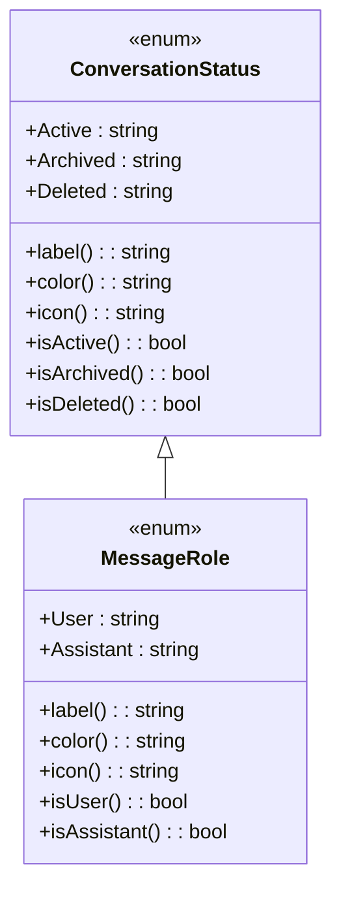

**Diagram sources**
- [app/Enums/ConversationStatus.php:23-88](file://app/Enums/ConversationStatus.php#L23-L88)
- [app/Enums/MessageRole.php:23-76](file://app/Enums/MessageRole.php#L23-L76)

**Section sources**
- [app/Enums/ConversationStatus.php:23-88](file://app/Enums/ConversationStatus.php#L23-L88)
- [app/Enums/MessageRole.php:23-76](file://app/Enums/MessageRole.php#L23-L76)

### ViewModels Layer - Complex View Data Preparation
The ViewModels layer handles complex view data preparation and presentation logic, keeping controllers thin and focused on request handling. ViewModels transform model data into presentation-ready formats and provide computed properties for UI rendering.

**Key Features:**
- Data transformation and formatting for UI consumption
- Computed properties for dynamic view data
- Type-safe collection returns with PHPDoc annotations
- Separation of presentation logic from business logic

**Implementation Example:**
- ChatViewModel: Prepares chat interface data with formatted messages and sidebar conversations

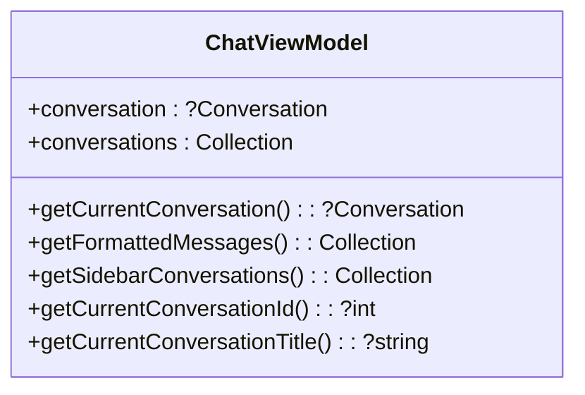

**Diagram sources**
- [app/ViewModels/ChatViewModel.php:29-119](file://app/ViewModels/ChatViewModel.php#L29-L119)

**Section sources**
- [app/ViewModels/ChatViewModel.php:29-119](file://app/ViewModels/ChatViewModel.php#L29-L119)

### Models Layer - Data Persistence and Entities
The Models layer extends Laravel's Eloquent ORM with the new architectural patterns, incorporating Enums for type-safe casting and providing specialized methods for AI integration. Models serve as the data access layer and business entity definitions.

**Key Features:**
- Enum casting for type-safe attribute handling
- Specialized methods for AI agent integration
- Computed properties for frequently accessed data
- Integration with Laravel's query builder and relationships

**Implementation Examples:**
- Conversation: Manages conversation lifecycle and AI message history
- Message: Handles individual chat messages with formatting capabilities

**Section sources**
- [app/Models/Conversation.php:9-50](file://app/Models/Conversation.php#L9-L50)
- [app/Models/Message.php:10-44](file://app/Models/Message.php#L10-L44)

## Project Structure
The project follows Laravel's standard directory layout with additional AI-focused configurations and the new professional architecture framework:

- Application code resides under app/, organized into specialized layers (Actions, DTOs, Enums, ViewModels)
- Configuration is centralized under config/, including AI provider settings and third-party services
- Routes are defined under routes/
- Database migrations for AI conversations are under database/migrations/
- AI scaffolding templates (stubs) are under stubs/
- Frontend tooling is configured via package.json and vite.config.js
- Agent guidelines and skills are documented in AGENTS.md and .agents/skills/

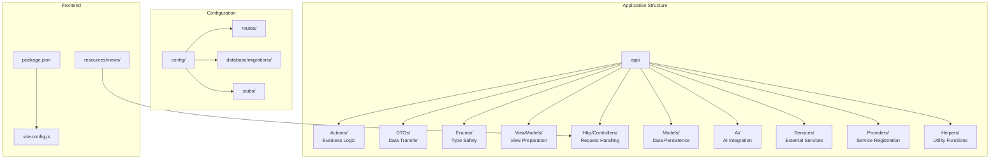

**Diagram sources**
- [bootstrap/app.php:1-19](file://bootstrap/app.php#L1-L19)
- [routes/web.php:1-8](file://routes/web.php#L1-L8)
- [config/app.php:1-127](file://config/app.php#L1-L127)
- [database/migrations/2026_04_02_123216_create_conversations_table.php:1-32](file://database/migrations/2026_04_02_123216_create_conversations_table.php#L1-L32)
- [database/migrations/2026_04_02_123238_create_messages_table.php:1-33](file://database/migrations/2026_04_02_123238_create_messages_table.php#L1-L33)
- [stubs/agent.stub:1-45](file://stubs/agent.stub#L1-L45)
- [package.json:1-18](file://package.json#L1-L18)
- [vite.config.js:1-19](file://vite.config.js#L1-L19)

**Section sources**
- [bootstrap/app.php:1-19](file://bootstrap/app.php#L1-L19)
- [routes/web.php:1-8](file://routes/web.php#L1-L8)
- [config/app.php:1-127](file://config/app.php#L1-L127)
- [composer.json:1-93](file://composer.json#L1-L93)

## Core Components
- Laravel Framework (v13) provides the MVC foundation, routing, service container, and middleware pipeline
- Professional Laravel Architecture Framework with five core layers for enhanced organization
- Laravel AI SDK integrates AI providers and agent tooling for conversational and structured outputs
- Laravel Boost enhances developer productivity with agent skills and tools
- Agent scaffolding stubs define contracts for agents, structured agents, and tools
- AI provider configuration centralizes credentials and defaults for multiple providers
- Database migrations define conversation and message storage for agent interactions

Key implementation references:
- Professional architecture framework: [app/Actions/BaseAction.php:28-57](file://app/Actions/BaseAction.php#L28-L57), [app/DTOs/ConversationData.php:29-57](file://app/DTOs/ConversationData.php#L29-L57)
- MVC enhanced with new layers: [app/Http/Controllers/ChatController.php:19-153](file://app/Http/Controllers/ChatController.php#L19-L153)
- AI provider configuration: [config/ai.php:1-132](file://config/ai.php#L1-L132)
- Agent scaffolding contracts: [stubs/agent.stub:1-45](file://stubs/agent.stub#L1-L45), [stubs/structured-agent.stub:1-57](file://stubs/structured-agent.stub#L1-L57), [stubs/tool.stub:1-38](file://stubs/tool.stub#L1-L38)
- Conversation storage: [database/migrations/2026_04_02_123216_create_conversations_table.php:1-32](file://database/migrations/2026_04_02_123216_create_conversations_table.php#L1-L32), [database/migrations/2026_04_02_123238_create_messages_table.php:1-33](file://database/migrations/2026_04_02_123238_create_messages_table.php#L1-L33)
- Application service provider: [app/Providers/AppServiceProvider.php](file://app/Providers/AppServiceProvider.php)
- Base controller: [app/Http/Controllers/Controller.php:5-8](file://app/Http/Controllers/Controller.php#L5-L8)
- User model: [app/Models/User.php](file://app/Models/User.php)

**Section sources**
- [app/Actions/BaseAction.php:28-57](file://app/Actions/BaseAction.php#L28-L57)
- [app/DTOs/ConversationData.php:29-57](file://app/DTOs/ConversationData.php#L29-L57)
- [app/Http/Controllers/ChatController.php:19-153](file://app/Http/Controllers/ChatController.php#L19-L153)
- [config/ai.php:1-132](file://config/ai.php#L1-L132)
- [stubs/agent.stub:1-45](file://stubs/agent.stub#L1-L45)
- [stubs/structured-agent.stub:1-57](file://stubs/structured-agent.stub#L1-L57)
- [stubs/tool.stub:1-38](file://stubs/tool.stub#L1-L38)
- [database/migrations/2026_04_02_123216_create_conversations_table.php:1-32](file://database/migrations/2026_04_02_123216_create_conversations_table.php#L1-L32)
- [database/migrations/2026_04_02_123238_create_messages_table.php:1-33](file://database/migrations/2026_04_02_123238_create_messages_table.php#L1-L33)
- [app/Providers/AppServiceProvider.php](file://app/Providers/AppServiceProvider.php)
- [app/Http/Controllers/Controller.php:5-8](file://app/Http/Controllers/Controller.php#L5-L8)
- [app/Models/User.php](file://app/Models/User.php)

## Architecture Overview
The system architecture blends Laravel's MVC with AI integration layers through the professional Laravel architecture framework:

- **Professional Architecture Layers**: Five distinct layers (Actions, DTOs, Enums, ViewModels, Models) provide clear separation of concerns
- **MVC Enhancement**: Controllers now delegate business logic to Actions and use ViewModels for complex view preparation
- **AI Integration Layer**: Agents implement conversational logic and tools, interacting with external AI providers configured in config/ai.php
- **Service Container**: Laravel's container resolves dependencies across all architectural layers
- **Routing**: Routes map incoming requests to controllers with enhanced action-based processing
- **Storage**: Agent conversations and messages are persisted via database migrations with Enum casting

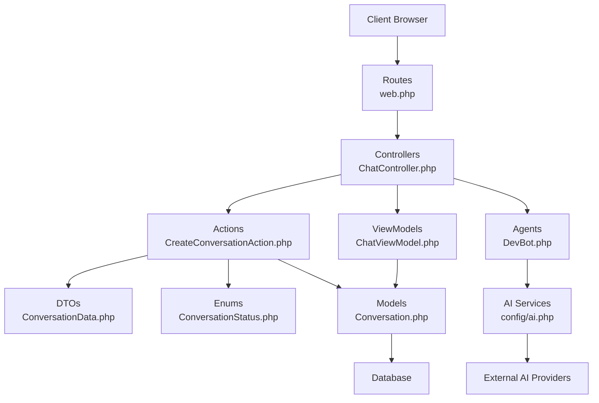

**Diagram sources**
- [routes/web.php:1-8](file://routes/web.php#L1-L8)
- [app/Http/Controllers/ChatController.php:19-153](file://app/Http/Controllers/ChatController.php#L19-L153)
- [app/Actions/CreateConversationAction.php:29-52](file://app/Actions/CreateConversationAction.php#L29-L52)
- [app/DTOs/ConversationData.php:29-57](file://app/DTOs/ConversationData.php#L29-L57)
- [app/Enums/ConversationStatus.php:23-88](file://app/Enums/ConversationStatus.php#L23-L88)
- [app/ViewModels/ChatViewModel.php:29-119](file://app/ViewModels/ChatViewModel.php#L29-L119)
- [app/Models/Conversation.php:9-50](file://app/Models/Conversation.php#L9-L50)
- [stubs/agent.stub:1-45](file://stubs/agent.stub#L1-L45)
- [config/ai.php:1-132](file://config/ai.php#L1-L132)

**Section sources**
- [routes/web.php:1-8](file://routes/web.php#L1-L8)
- [app/Http/Controllers/ChatController.php:19-153](file://app/Http/Controllers/ChatController.php#L19-L153)
- [app/Actions/CreateConversationAction.php:29-52](file://app/Actions/CreateConversationAction.php#L29-L52)
- [app/DTOs/ConversationData.php:29-57](file://app/DTOs/ConversationData.php#L29-L57)
- [app/Enums/ConversationStatus.php:23-88](file://app/Enums/ConversationStatus.php#L23-L88)
- [app/ViewModels/ChatViewModel.php:29-119](file://app/ViewModels/ChatViewModel.php#L29-L119)
- [app/Models/Conversation.php:9-50](file://app/Models/Conversation.php#L9-L50)
- [stubs/agent.stub:1-45](file://stubs/agent.stub#L1-L45)
- [config/ai.php:1-132](file://config/ai.php#L1-L132)

## Detailed Component Analysis

### Professional Architecture Integration with MVC
The professional Laravel architecture framework enhances traditional MVC by introducing specialized layers that handle specific responsibilities:

- **Controllers**: Now focus solely on HTTP request/response handling and delegate business logic to Actions
- **Actions**: Implement single-responsibility business operations with consistent error handling
- **DTOs**: Provide type-safe data transfer between layers and controllers
- **Enums**: Ensure type safety for status management and role definitions
- **ViewModels**: Handle complex view data preparation and presentation logic
- **Models**: Extend Eloquent with Enum casting and AI integration methods

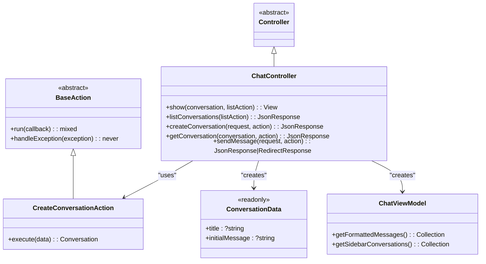

**Diagram sources**
- [app/Http/Controllers/Controller.php:5-8](file://app/Http/Controllers/Controller.php#L5-L8)
- [app/Http/Controllers/ChatController.php:19-153](file://app/Http/Controllers/ChatController.php#L19-L153)
- [app/Actions/BaseAction.php:28-57](file://app/Actions/BaseAction.php#L28-L57)
- [app/Actions/CreateConversationAction.php:29-52](file://app/Actions/CreateConversationAction.php#L29-L52)
- [app/DTOs/ConversationData.php:29-57](file://app/DTOs/ConversationData.php#L29-L57)
- [app/ViewModels/ChatViewModel.php:29-119](file://app/ViewModels/ChatViewModel.php#L29-L119)

**Section sources**
- [app/Http/Controllers/Controller.php:5-8](file://app/Http/Controllers/Controller.php#L5-L8)
- [app/Http/Controllers/ChatController.php:19-153](file://app/Http/Controllers/ChatController.php#L19-L153)
- [app/Actions/BaseAction.php:28-57](file://app/Actions/BaseAction.php#L28-L57)
- [app/Actions/CreateConversationAction.php:29-52](file://app/Actions/CreateConversationAction.php#L29-L52)
- [app/DTOs/ConversationData.php:29-57](file://app/DTOs/ConversationData.php#L29-L57)
- [app/ViewModels/ChatViewModel.php:29-119](file://app/ViewModels/ChatViewModel.php#L29-L119)

### Agent-Based Development Workflow with Professional Architecture
The agent-based development workflow integrates seamlessly with the professional architecture framework:

- **Actions orchestrate**: Business logic execution through typed DTOs and Enum validation
- **ViewModels prepare**: Complex view data for agent interfaces and real-time updates
- **Controllers coordinate**: HTTP request handling with enhanced error management
- **Models persist**: Conversation and message data with AI integration capabilities

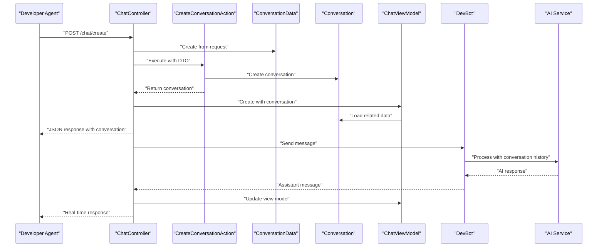

**Diagram sources**
- [app/Http/Controllers/ChatController.php:67-84](file://app/Http/Controllers/ChatController.php#L67-L84)
- [app/Actions/CreateConversationAction.php:37-51](file://app/Actions/CreateConversationAction.php#L37-L51)
- [app/DTOs/ConversationData.php:39-45](file://app/DTOs/ConversationData.php#L39-L45)
- [app/ViewModels/ChatViewModel.php:31-36](file://app/ViewModels/ChatViewModel.php#L31-L36)
- [stubs/agent.stub:1-45](file://stubs/agent.stub#L1-L45)
- [config/ai.php:1-132](file://config/ai.php#L1-L132)

**Section sources**
- [app/Http/Controllers/ChatController.php:67-84](file://app/Http/Controllers/ChatController.php#L67-L84)
- [app/Actions/CreateConversationAction.php:37-51](file://app/Actions/CreateConversationAction.php#L37-L51)
- [app/DTOs/ConversationData.php:39-45](file://app/DTOs/ConversationData.php#L39-L45)
- [app/ViewModels/ChatViewModel.php:31-36](file://app/ViewModels/ChatViewModel.php#L31-L36)
- [stubs/agent.stub:1-45](file://stubs/agent.stub#L1-L45)
- [config/ai.php:1-132](file://config/ai.php#L1-L132)

### Conversation Storage and Data Model with Professional Architecture
The conversation storage system integrates with the professional architecture framework through Enum casting and specialized methods:

- **Enum Casting**: ConversationStatus automatically converts to/from database values
- **Specialized Methods**: Conversation model provides AI integration helpers
- **Type Safety**: MessageRole ensures proper role assignment and validation
- **Computed Properties**: Efficient data access patterns for frequent queries

```mermaid
erDiagram
CONVERSATIONS {
string id PK
string title
enum status
bigint user_id
timestamp created_at
timestamp updated_at
}
CONVERSATION_MESSAGES {
string id PK
bigint conversation_id FK
enum role
text content
timestamp created_at
timestamp updated_at
}
CONVERSATIONS ||--o{ CONVERSATION_MESSAGES : "contains"
note for CONVERSATIONS """
Enum casting:
- status -> ConversationStatus
- Automatic conversion between
string values and enum instances
"""
note for CONVERSATION_MESSAGES """
Enum casting:
- role -> MessageRole
- Provides metadata methods
for UI rendering
"""
```

**Diagram sources**
- [database/migrations/2026_04_02_123216_create_conversations_table.php:14-21](file://database/migrations/2026_04_02_123216_create_conversations_table.php#L14-L21)
- [database/migrations/2026_04_02_123238_create_messages_table.php:14-22](file://database/migrations/2026_04_02_123238_create_messages_table.php#L14-L22)
- [app/Models/Conversation.php:17-19](file://app/Models/Conversation.php#L17-L19)
- [app/Models/Message.php:18-20](file://app/Models/Message.php#L18-L20)

**Section sources**
- [database/migrations/2026_04_02_123216_create_conversations_table.php:14-21](file://database/migrations/2026_04_02_123216_create_conversations_table.php#L14-L21)
- [database/migrations/2026_04_02_123238_create_messages_table.php:14-22](file://database/migrations/2026_04_02_123238_create_messages_table.php#L14-L22)
- [app/Models/Conversation.php:17-19](file://app/Models/Conversation.php#L17-L19)
- [app/Models/Message.php:18-20](file://app/Models/Message.php#L18-L20)

### Routing and Bootstrap Flow with Professional Architecture
The bootstrap and routing flow integrates with the professional architecture framework:

- **Bootstrap Configuration**: Sets up routing, middleware, and service container
- **Controller Resolution**: Laravel automatically injects Actions and ViewModels
- **Dependency Injection**: Professional architecture components resolved via container
- **Middleware Pipeline**: Enhanced with architecture-aware request handling

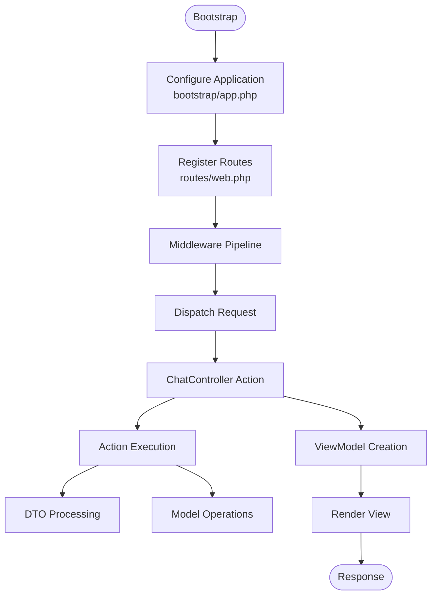

**Diagram sources**
- [bootstrap/app.php:1-19](file://bootstrap/app.php#L1-L19)
- [routes/web.php:1-8](file://routes/web.php#L1-L8)
- [app/Http/Controllers/ChatController.php:24-43](file://app/Http/Controllers/ChatController.php#L24-L43)

**Section sources**
- [bootstrap/app.php:1-19](file://bootstrap/app.php#L1-L19)
- [routes/web.php:1-8](file://routes/web.php#L1-L8)
- [app/Http/Controllers/ChatController.php:24-43](file://app/Http/Controllers/ChatController.php#L24-L43)

## Dependency Analysis
The system relies on Laravel 13 and the Laravel AI SDK, with the professional architecture framework adding additional organizational dependencies. Composer manages PHP dependencies and scripts for setup, development, and testing. Frontend dependencies are managed via npm and Vite.

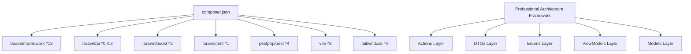

**Diagram sources**
- [composer.json:1-93](file://composer.json#L1-L93)
- [package.json:1-18](file://package.json#L1-L18)
- [app/Actions/BaseAction.php:28-57](file://app/Actions/BaseAction.php#L28-L57)
- [app/DTOs/ConversationData.php:29-57](file://app/DTOs/ConversationData.php#L29-L57)
- [app/Enums/ConversationStatus.php:23-88](file://app/Enums/ConversationStatus.php#L23-L88)
- [app/ViewModels/ChatViewModel.php:29-119](file://app/ViewModels/ChatViewModel.php#L29-L119)
- [app/Models/Conversation.php:9-50](file://app/Models/Conversation.php#L9-L50)

**Section sources**
- [composer.json:1-93](file://composer.json#L1-L93)
- [package.json:1-18](file://package.json#L1-L18)
- [app/Actions/BaseAction.php:28-57](file://app/Actions/BaseAction.php#L28-L57)
- [app/DTOs/ConversationData.php:29-57](file://app/DTOs/ConversationData.php#L29-L57)
- [app/Enums/ConversationStatus.php:23-88](file://app/Enums/ConversationStatus.php#L23-L88)
- [app/ViewModels/ChatViewModel.php:29-119](file://app/ViewModels/ChatViewModel.php#L29-L119)
- [app/Models/Conversation.php:9-50](file://app/Models/Conversation.php#L9-L50)

## Performance Considerations
- Use database indexes on frequently queried columns (e.g., user_id and updated_at) to optimize agent conversation retrieval
- Cache embeddings and other expensive AI operations when enabled in configuration
- Keep controller actions small and delegate heavy logic to specialized Actions
- Use chunking and lazy cursors for large datasets in models
- Leverage Enum casting for type-safe operations without performance overhead
- Utilize ViewModels for pre-computed data to reduce view rendering complexity
- Implement DTO validation early to prevent unnecessary processing in Actions

## Troubleshooting Guide
- If frontend assets are not reflecting changes, rebuild or run the dev server as indicated by the project scripts
- Ensure AI provider keys are configured in environment variables and aligned with the configured defaults
- For Vite manifest errors, rebuild assets or run the development server
- When encountering Action execution errors, check the BaseAction exception handling patterns
- For DTO-related issues, verify proper factory method usage and property immutability
- Enum casting problems typically indicate database value mismatches or missing enum cases
- ViewModel data formatting issues often stem from missing model relationships or eager loading

**Section sources**
- [AGENTS.md:135-138](file://AGENTS.md#L135-L138)
- [config/ai.php:1-132](file://config/ai.php#L1-L132)
- [package.json:1-18](file://package.json#L1-L18)
- [app/Actions/BaseAction.php:36-56](file://app/Actions/BaseAction.php#L36-L56)
- [app/DTOs/ConversationData.php:39-45](file://app/DTOs/ConversationData.php#L39-L45)
- [app/Enums/ConversationStatus.php:25-27](file://app/Enums/ConversationStatus.php#L25-L27)

## Conclusion
The Laravel Assistant system extends Laravel's MVC architecture with AI integration through a professional Laravel architecture framework that establishes five core architectural layers. The framework provides enhanced organization, type safety, and maintainability while preserving Laravel's familiar patterns. The Actions, DTOs, Enums, ViewModels, and Models layers work together to create a robust foundation for AI-enabled applications. The agent-based development approach, guided by Laravel Boost and skills, accelerates building Laravel applications with best practices and consistent conventions while leveraging the benefits of the professional architecture framework.

## Appendices

### Technology Stack and Compatibility
- PHP: ^8.3
- Laravel Framework: ^13
- Laravel AI SDK: ^0.4.3
- Laravel Boost: ^2
- Laravel Pint: ^1
- Pest: ^4
- Vite: ^8
- Tailwind CSS: ^4

**Section sources**
- [composer.json:1-93](file://composer.json#L1-L93)
- [AGENTS.md:10-23](file://AGENTS.md#L10-L23)
- [README.md:32-42](file://README.md#L32-L42)

### Professional Architecture Framework Benefits
- **Enhanced Type Safety**: Enums and DTOs prevent runtime type errors
- **Improved Maintainability**: Clear separation of concerns across five layers
- **Better Testability**: Isolated components with predictable interfaces
- **Consistent Patterns**: Standardized approaches across similar operations
- **Scalable Design**: Professional architecture scales better than traditional MVC
- **Developer Experience**: Better IDE support with comprehensive type hints

### AI Provider Configuration Reference
- Defaults for text, images, audio, transcription, embeddings, and reranking are defined in configuration
- Providers include Anthropic, Azure OpenAI, Cohere, DeepSeek, ElevenLabs, Gemini, Groq, Jina, Mistral, Ollama, OpenAI, OpenRouter, Voyage.ai, and xAI
- Credentials are loaded from environment variables

**Section sources**
- [config/ai.php:1-132](file://config/ai.php#L1-L132)

### Frontend Tooling
- Vite manages asset bundling with Laravel Vite Plugin and Tailwind CSS integration
- Scripts support development and build workflows

**Section sources**
- [package.json:1-18](file://package.json#L1-L18)
- [vite.config.js:1-19](file://vite.config.js#L1-L19)

### Professional Architecture Implementation Patterns
- **Action Pattern**: Single responsibility with consistent execute() method signatures
- **DTO Pattern**: Immutable data objects with static factory methods
- **Enum Pattern**: String-backed enums with metadata methods for UI
- **ViewModel Pattern**: Presentation-focused data transformation
- **Model Pattern**: Eloquent extensions with specialized AI integration methods

**Section sources**
- [app/Actions/BaseAction.php:28-57](file://app/Actions/BaseAction.php#L28-L57)
- [app/DTOs/ConversationData.php:29-57](file://app/DTOs/ConversationData.php#L29-L57)
- [app/Enums/ConversationStatus.php:23-88](file://app/Enums/ConversationStatus.php#L23-L88)
- [app/ViewModels/ChatViewModel.php:29-119](file://app/ViewModels/ChatViewModel.php#L29-L119)
- [app/Models/Conversation.php:9-50](file://app/Models/Conversation.php#L9-L50)