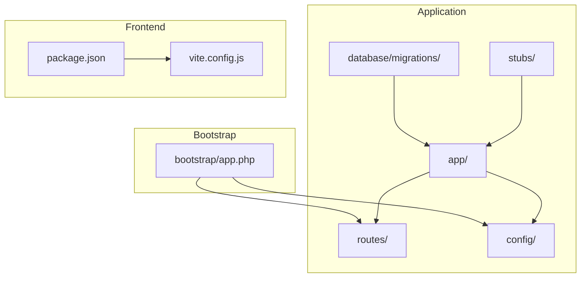
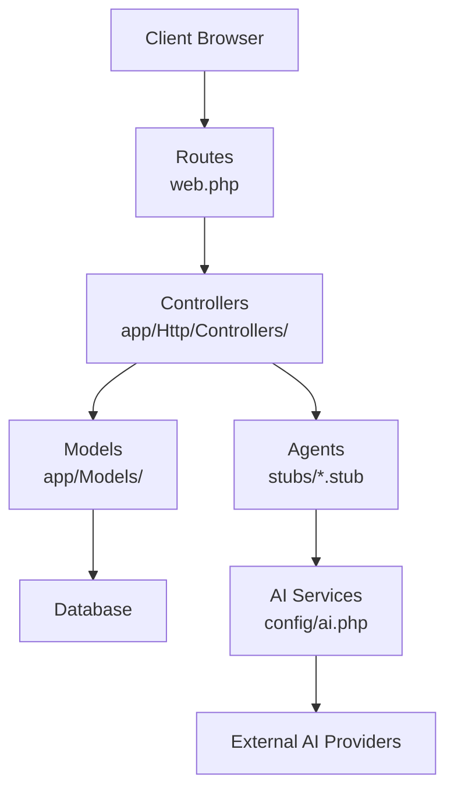
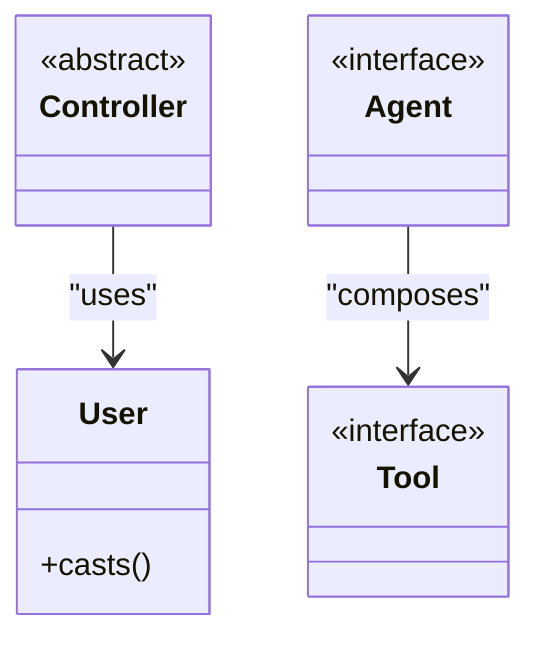
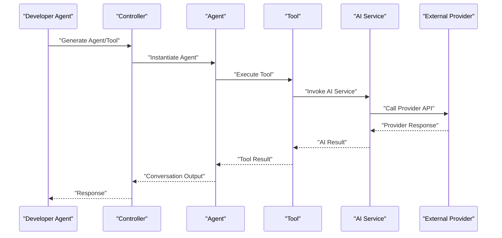
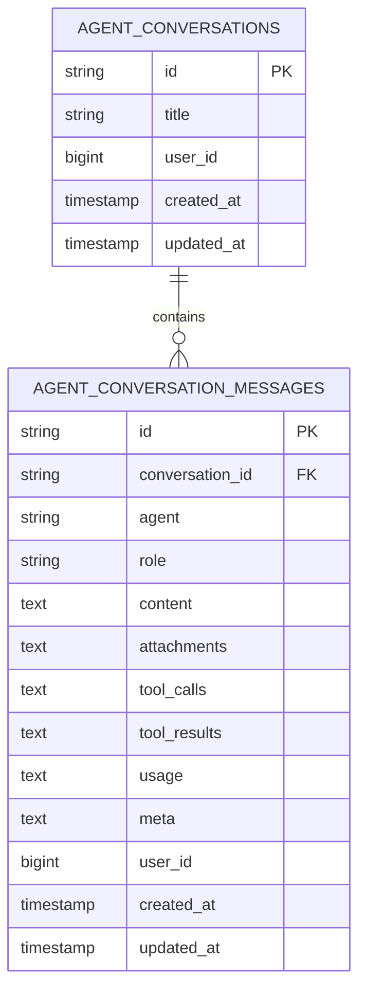
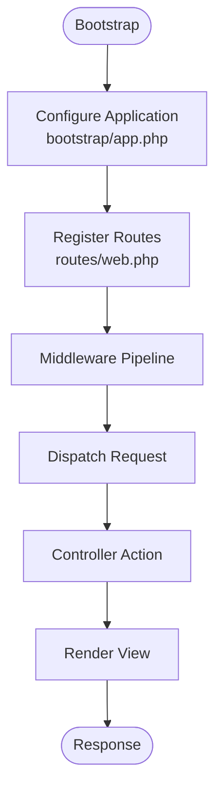
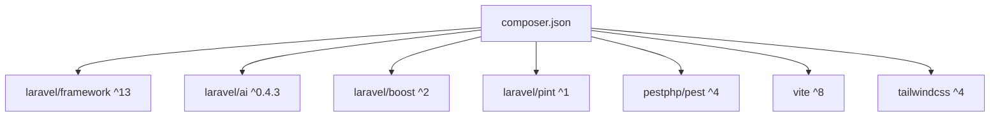

# Architecture Overview

<cite>
**Referenced Files in This Document**
- [composer.json](file://composer.json)
- [bootstrap/app.php](file://bootstrap/app.php)
- [config/app.php](file://config/app.php)
- [config/ai.php](file://config/ai.php)
- [config/services.php](file://config/services.php)
- [routes/web.php](file://routes/web.php)
- [app/Providers/AppServiceProvider.php](file://app/Providers/AppServiceProvider.php)
- [app/Http/Controllers/Controller.php](file://app/Http/Controllers/Controller.php)
- [app/Models/User.php](file://app/Models/User.php)
- [database/migrations/2026_04_02_115916_create_agent_conversations_table.php](file://database/migrations/2026_04_02_115916_create_agent_conversations_table.php)
- [stubs/agent.stub](file://stubs/agent.stub)
- [stubs/structured-agent.stub](file://stubs/structured-agent.stub)
- [stubs/tool.stub](file://stubs/tool.stub)
- [AGENTS.md](file://AGENTS.md)
- [package.json](file://package.json)
- [vite.config.js](file://vite.config.js)
- [README.md](file://README.md)
</cite>

## Table of Contents
1. [Introduction](#introduction)
2. [Project Structure](#project-structure)
3. [Core Components](#core-components)
4. [Architecture Overview](#architecture-overview)
5. [Detailed Component Analysis](#detailed-component-analysis)
6. [Dependency Analysis](#dependency-analysis)
7. [Performance Considerations](#performance-considerations)
8. [Troubleshooting Guide](#troubleshooting-guide)
9. [Conclusion](#conclusion)
10. [Appendices](#appendices)

## Introduction
This document describes the architecture of the Laravel Assistant system, focusing on how Laravel’s MVC architecture is extended with AI integration layers. The system leverages Laravel 13, the Laravel AI SDK, and Laravel Boost to enable an agent-driven development workflow. It documents the application bootstrap process, service provider registration, routing configuration, and the integration patterns with external AI providers. The document also explains the agent-based development approach and how it extends standard Laravel conventions, including controllers, models, and AI services.

## Project Structure
The project follows Laravel’s standard directory layout with additional AI-focused configurations and scaffolding:

- Application code resides under app/, including controllers and models.
- Configuration is centralized under config/, including AI provider settings and third-party services.
- Routes are defined under routes/.
- Database migrations for AI conversations are under database/migrations/.
- AI scaffolding templates (stubs) are under stubs/.
- Frontend tooling is configured via package.json and vite.config.js.
- Agent guidelines and skills are documented in AGENTS.md and .agents/skills/.

**Diagram sources**
- [bootstrap/app.php:1-19](file://bootstrap/app.php#L1-L19)
- [routes/web.php:1-8](file://routes/web.php#L1-L8)
- [config/app.php:1-127](file://config/app.php#L1-L127)
- [database/migrations/2026_04_02_115916_create_agent_conversations_table.php:1-51](file://database/migrations/2026_04_02_115916_create_agent_conversations_table.php#L1-L51)
- [stubs/agent.stub:1-45](file://stubs/agent.stub#L1-L45)
- [package.json:1-18](file://package.json#L1-L18)
- [vite.config.js:1-19](file://vite.config.js#L1-L19)

**Section sources**
- [bootstrap/app.php:1-19](file://bootstrap/app.php#L1-L19)
- [routes/web.php:1-8](file://routes/web.php#L1-L8)
- [config/app.php:1-127](file://config/app.php#L1-L127)
- [composer.json:1-93](file://composer.json#L1-L93)

## Core Components
- Laravel Framework (v13) provides the MVC foundation, routing, service container, and middleware pipeline.
- Laravel AI SDK integrates AI providers and agent tooling for conversational and structured outputs.
- Laravel Boost enhances developer productivity with agent skills and tools.
- Agent scaffolding stubs define contracts for agents, structured agents, and tools.
- AI provider configuration centralizes credentials and defaults for multiple providers.
- Database migrations define conversation and message storage for agent interactions.

Key implementation references:
- Application bootstrap and routing configuration: [bootstrap/app.php:1-19](file://bootstrap/app.php#L1-L19), [routes/web.php:1-8](file://routes/web.php#L1-L8)
- AI provider configuration: [config/ai.php:1-132](file://config/ai.php#L1-L132)
- Agent scaffolding contracts: [stubs/agent.stub:1-45](file://stubs/agent.stub#L1-L45), [stubs/structured-agent.stub:1-57](file://stubs/structured-agent.stub#L1-L57), [stubs/tool.stub:1-38](file://stubs/tool.stub#L1-L38)
- Conversation storage: [database/migrations/2026_04_02_115916_create_agent_conversations_table.php:1-51](file://database/migrations/2026_04_02_115916_create_agent_conversations_table.php#L1-L51)
- Application service provider: [app/Providers/AppServiceProvider.php:1-25](file://app/Providers/AppServiceProvider.php#L1-L25)
- Base controller: [app/Http/Controllers/Controller.php:1-9](file://app/Http/Controllers/Controller.php#L1-L9)
- User model: [app/Models/User.php:1-33](file://app/Models/User.php#L1-L33)

**Section sources**
- [bootstrap/app.php:1-19](file://bootstrap/app.php#L1-L19)
- [routes/web.php:1-8](file://routes/web.php#L1-L8)
- [config/ai.php:1-132](file://config/ai.php#L1-L132)
- [stubs/agent.stub:1-45](file://stubs/agent.stub#L1-L45)
- [stubs/structured-agent.stub:1-57](file://stubs/structured-agent.stub#L1-L57)
- [stubs/tool.stub:1-38](file://stubs/tool.stub#L1-L38)
- [database/migrations/2026_04_02_115916_create_agent_conversations_table.php:1-51](file://database/migrations/2026_04_02_115916_create_agent_conversations_table.php#L1-L51)
- [app/Providers/AppServiceProvider.php:1-25](file://app/Providers/AppServiceProvider.php#L1-L25)
- [app/Http/Controllers/Controller.php:1-9](file://app/Http/Controllers/Controller.php#L1-L9)
- [app/Models/User.php:1-33](file://app/Models/User.php#L1-L33)

## Architecture Overview
The system architecture blends Laravel’s MVC with AI integration layers:

- MVC Layer: Controllers handle requests, Models encapsulate data and business logic, and Views render responses.
- AI Integration Layer: Agents implement conversational logic and tools, interacting with external AI providers configured in config/ai.php.
- Service Container: Laravel’s container resolves dependencies and integrates AI services and providers.
- Routing: Routes map incoming requests to controllers or agent endpoints.
- Storage: Agent conversations and messages are persisted via database migrations.

**Diagram sources**
- [routes/web.php:1-8](file://routes/web.php#L1-L8)
- [app/Http/Controllers/Controller.php:1-9](file://app/Http/Controllers/Controller.php#L1-L9)
- [app/Models/User.php:1-33](file://app/Models/User.php#L1-L33)
- [stubs/agent.stub:1-45](file://stubs/agent.stub#L1-L45)
- [config/ai.php:1-132](file://config/ai.php#L1-L132)

**Section sources**
- [routes/web.php:1-8](file://routes/web.php#L1-L8)
- [app/Http/Controllers/Controller.php:1-9](file://app/Http/Controllers/Controller.php#L1-L9)
- [app/Models/User.php:1-33](file://app/Models/User.php#L1-L33)
- [stubs/agent.stub:1-45](file://stubs/agent.stub#L1-L45)
- [config/ai.php:1-132](file://config/ai.php#L1-L132)

## Detailed Component Analysis

### MVC Enhanced with AI Integration
- Controllers remain responsible for handling HTTP requests and delegating to models or agents.
- Models encapsulate Eloquent logic and integrate with AI services for data transformations or validations.
- Views render UI; frontend assets are managed via Vite and Tailwind.

**Diagram sources**
- [app/Http/Controllers/Controller.php:1-9](file://app/Http/Controllers/Controller.php#L1-L9)
- [app/Models/User.php:1-33](file://app/Models/User.php#L1-L33)
- [stubs/agent.stub:1-45](file://stubs/agent.stub#L1-L45)
- [stubs/tool.stub:1-38](file://stubs/tool.stub#L1-L38)

**Section sources**
- [app/Http/Controllers/Controller.php:1-9](file://app/Http/Controllers/Controller.php#L1-L9)
- [app/Models/User.php:1-33](file://app/Models/User.php#L1-L33)
- [stubs/agent.stub:1-45](file://stubs/agent.stub#L1-L45)
- [stubs/tool.stub:1-38](file://stubs/tool.stub#L1-L38)

### Agent-Based Development Workflow
- Agents implement conversational logic and optional structured output schemas.
- Tools encapsulate capabilities agents can invoke during a conversation.
- The Laravel Boost guidelines define skills and tools to accelerate development.

**Diagram sources**
- [stubs/agent.stub:1-45](file://stubs/agent.stub#L1-L45)
- [stubs/structured-agent.stub:1-57](file://stubs/structured-agent.stub#L1-L57)
- [stubs/tool.stub:1-38](file://stubs/tool.stub#L1-L38)
- [config/ai.php:1-132](file://config/ai.php#L1-L132)

**Section sources**
- [stubs/agent.stub:1-45](file://stubs/agent.stub#L1-L45)
- [stubs/structured-agent.stub:1-57](file://stubs/structured-agent.stub#L1-L57)
- [stubs/tool.stub:1-38](file://stubs/tool.stub#L1-L38)
- [AGENTS.md:1-155](file://AGENTS.md#L1-L155)

### Conversation Storage and Data Model
Agent conversations and messages are persisted using dedicated migrations. The schema supports indexing for efficient querying by user and timestamps.

**Diagram sources**
- [database/migrations/2026_04_02_115916_create_agent_conversations_table.php:1-51](file://database/migrations/2026_04_02_115916_create_agent_conversations_table.php#L1-L51)

**Section sources**
- [database/migrations/2026_04_02_115916_create_agent_conversations_table.php:1-51](file://database/migrations/2026_04_02_115916_create_agent_conversations_table.php#L1-L51)

### Routing and Bootstrap Flow
- The bootstrap file configures routing for web and console, and sets up middleware and exception handling.
- The web route defines a simple homepage view.

**Diagram sources**
- [bootstrap/app.php:1-19](file://bootstrap/app.php#L1-L19)
- [routes/web.php:1-8](file://routes/web.php#L1-L8)

**Section sources**
- [bootstrap/app.php:1-19](file://bootstrap/app.php#L1-L19)
- [routes/web.php:1-8](file://routes/web.php#L1-L8)

## Dependency Analysis
The system relies on Laravel 13 and the Laravel AI SDK. Composer manages PHP dependencies and scripts for setup, development, and testing. Frontend dependencies are managed via npm and Vite.

**Diagram sources**
- [composer.json:1-93](file://composer.json#L1-L93)
- [package.json:1-18](file://package.json#L1-L18)

**Section sources**
- [composer.json:1-93](file://composer.json#L1-L93)
- [package.json:1-18](file://package.json#L1-L18)

## Performance Considerations
- Use database indexes on frequently queried columns (e.g., user_id and updated_at) to optimize agent conversation retrieval.
- Cache embeddings and other expensive AI operations when enabled in configuration.
- Keep controller actions small and delegate heavy logic to services or agents.
- Use chunking and lazy cursors for large datasets in models.

## Troubleshooting Guide
- If frontend assets are not reflecting changes, rebuild or run the dev server as indicated by the project scripts.
- Ensure AI provider keys are configured in environment variables and aligned with the configured defaults.
- For Vite manifest errors, rebuild assets or run the development server.

**Section sources**
- [AGENTS.md:135-138](file://AGENTS.md#L135-L138)
- [config/ai.php:1-132](file://config/ai.php#L1-L132)
- [package.json:1-18](file://package.json#L1-L18)

## Conclusion
The Laravel Assistant system extends Laravel’s MVC architecture with AI integration through agents, tools, and provider configurations. The bootstrap and routing layers remain standard, while the AI layer adds conversational and structured-output capabilities. The agent-based development approach, guided by Laravel Boost and skills, accelerates building Laravel applications with best practices and consistent conventions.

## Appendices

### Technology Stack and Compatibility
- PHP: ^8.3
- Laravel Framework: ^13
- Laravel AI SDK: ^0.4.3
- Laravel Boost: ^2
- Laravel Pint: ^1
- Pest: ^4
- Vite: ^8
- Tailwind CSS: ^4

**Section sources**
- [composer.json:1-93](file://composer.json#L1-L93)
- [AGENTS.md:10-23](file://AGENTS.md#L10-L23)
- [README.md:32-42](file://README.md#L32-L42)

### AI Provider Configuration Reference
- Defaults for text, images, audio, transcription, embeddings, and reranking are defined in configuration.
- Providers include Anthropic, Azure OpenAI, Cohere, DeepSeek, ElevenLabs, Gemini, Groq, Jina, Mistral, Ollama, OpenAI, OpenRouter, Voyage.ai, and xAI.
- Credentials are loaded from environment variables.

**Section sources**
- [config/ai.php:1-132](file://config/ai.php#L1-L132)

### Frontend Tooling
- Vite manages asset bundling with Laravel Vite Plugin and Tailwind CSS integration.
- Scripts support development and build workflows.

**Section sources**
- [package.json:1-18](file://package.json#L1-L18)
- [vite.config.js:1-19](file://vite.config.js#L1-L19)