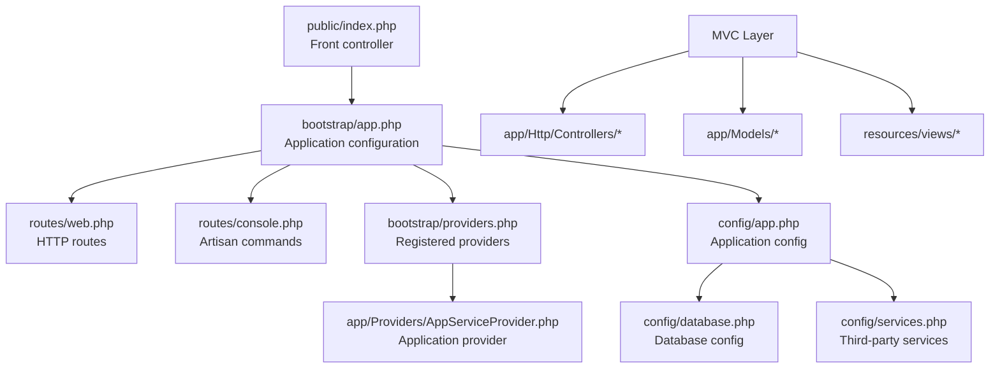
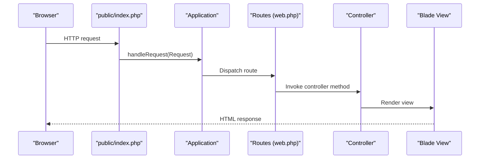
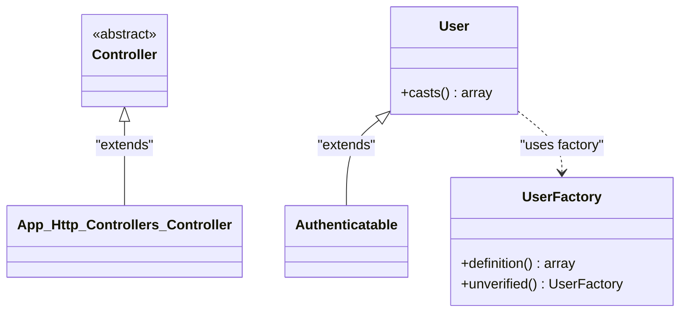
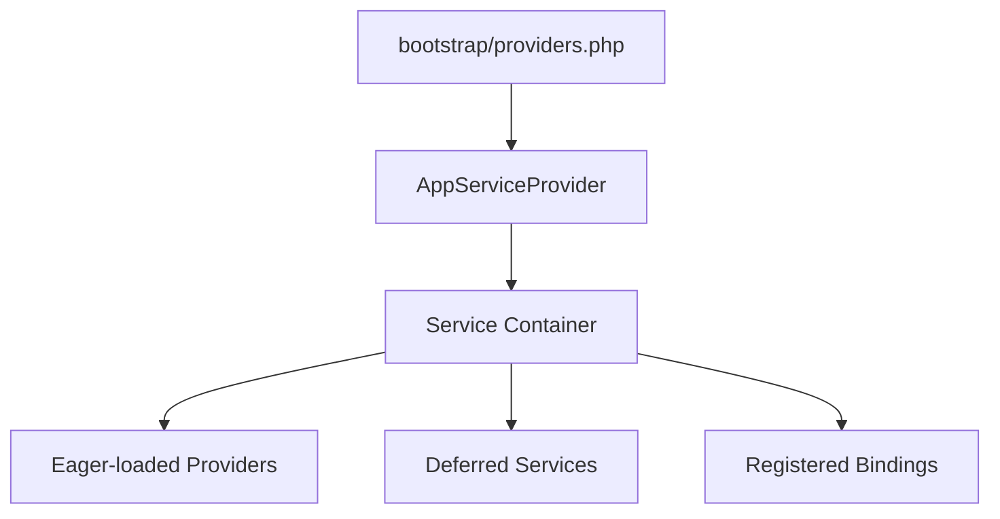
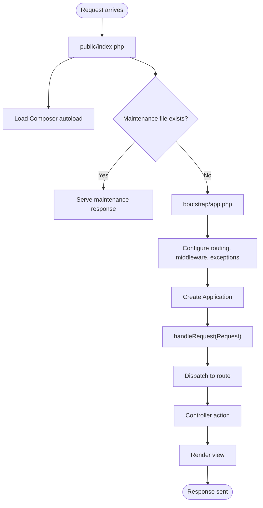
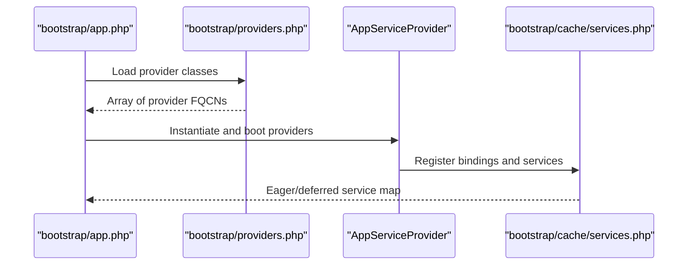
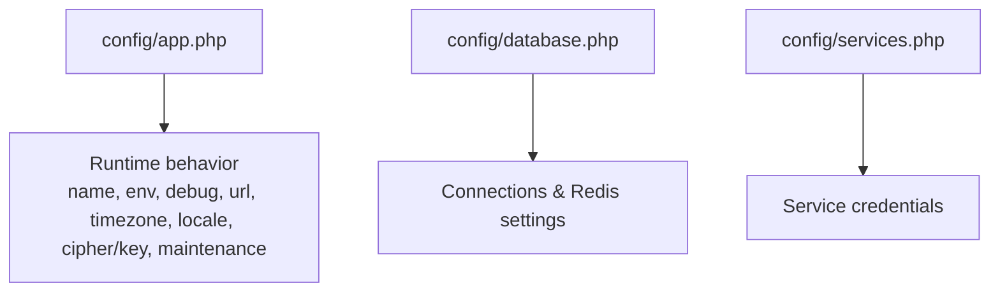
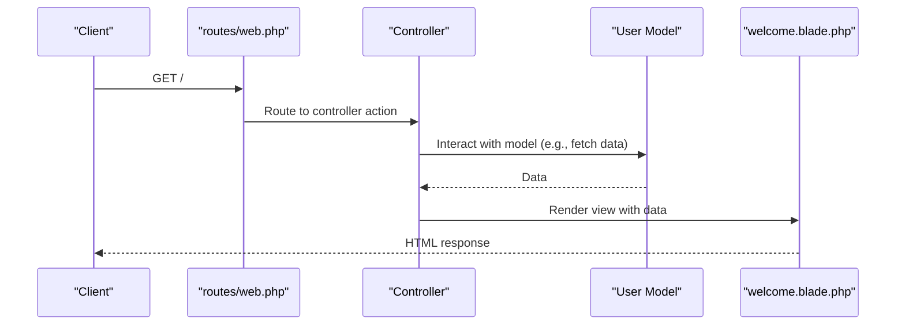
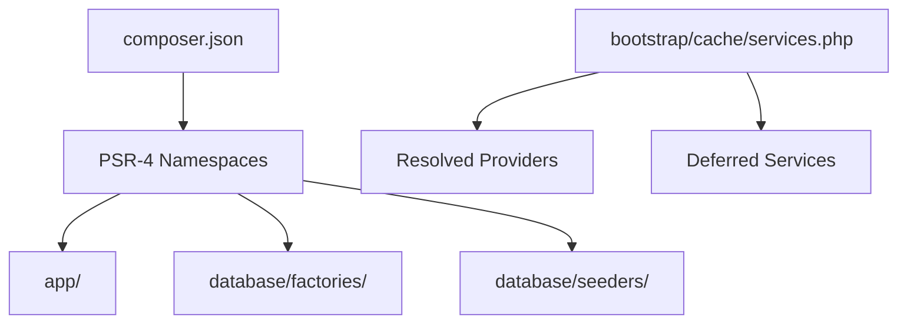

# Core Laravel Architecture

<cite>
**Referenced Files in This Document**
- [bootstrap/app.php](file://bootstrap/app.php)
- [public/index.php](file://public/index.php)
- [routes/web.php](file://routes/web.php)
- [routes/console.php](file://routes/console.php)
- [bootstrap/providers.php](file://bootstrap/providers.php)
- [app/Providers/AppServiceProvider.php](file://app/Providers/AppServiceProvider.php)
- [config/app.php](file://config/app.php)
- [config/database.php](file://config/database.php)
- [config/services.php](file://config/services.php)
- [app/Http/Controllers/Controller.php](file://app/Http/Controllers/Controller.php)
- [app/Models/User.php](file://app/Models/User.php)
- [database/factories/UserFactory.php](file://database/factories/UserFactory.php)
- [resources/views/welcome.blade.php](file://resources/views/welcome.blade.php)
- [composer.json](file://composer.json)
- [bootstrap/cache/services.php](file://bootstrap/cache/services.php)
</cite>

## Table of Contents
1. [Introduction](#introduction)
2. [Project Structure](#project-structure)
3. [Core Components](#core-components)
4. [Architecture Overview](#architecture-overview)
5. [Detailed Component Analysis](#detailed-component-analysis)
6. [Dependency Analysis](#dependency-analysis)
7. [Performance Considerations](#performance-considerations)
8. [Troubleshooting Guide](#troubleshooting-guide)
9. [Conclusion](#conclusion)
10. [Appendices](#appendices)

## Introduction
This document explains the core Laravel architecture components and how they work together in this project. It covers the MVC pattern implementation, service container organization, dependency injection principles, application bootstrap, routing and middleware configuration, exception handling, service provider registration, and the relationship between configuration files and runtime behavior. Practical examples illustrate how controllers, models, and services interact, along with guidance on separation of concerns, naming conventions, and Laravel’s convention-over-configuration philosophy.

## Project Structure
At a high level, the Laravel application follows the standard structure:
- Front controller: public/index.php initializes the framework and handles incoming requests.
- Bootstrap: bootstrap/app.php configures routing, middleware, and exceptions, then creates the Application instance.
- Routes: routes/web.php defines HTTP routes; routes/console.php registers Artisan commands.
- Providers: bootstrap/providers.php lists providers to load; app/Providers/AppServiceProvider.php is the primary application provider.
- Config: config/*.php files define runtime behavior (application, database, services, etc.).
- MVC: app/Http/Controllers/* for controllers, app/Models/* for Eloquent models, resources/views/* for Blade templates.
- Autoload: composer.json defines PSR-4 namespaces for app/, database/factories/, and database/seeders/.

**Diagram sources**
- [public/index.php:1-21](file://public/index.php#L1-L21)
- [bootstrap/app.php:1-19](file://bootstrap/app.php#L1-L19)
- [routes/web.php:1-8](file://routes/web.php#L1-L8)
- [routes/console.php:1-9](file://routes/console.php#L1-L9)
- [bootstrap/providers.php:1-8](file://bootstrap/providers.php#L1-L8)
- [app/Providers/AppServiceProvider.php:1-25](file://app/Providers/AppServiceProvider.php#L1-L25)
- [config/app.php:1-127](file://config/app.php#L1-L127)
- [config/database.php:1-185](file://config/database.php#L1-L185)
- [config/services.php:1-39](file://config/services.php#L1-L39)

**Section sources**
- [public/index.php:1-21](file://public/index.php#L1-L21)
- [bootstrap/app.php:1-19](file://bootstrap/app.php#L1-L19)
- [routes/web.php:1-8](file://routes/web.php#L1-L8)
- [routes/console.php:1-9](file://routes/console.php#L1-L9)
- [bootstrap/providers.php:1-8](file://bootstrap/providers.php#L1-L8)
- [app/Providers/AppServiceProvider.php:1-25](file://app/Providers/AppServiceProvider.php#L1-L25)
- [config/app.php:1-127](file://config/app.php#L1-L127)
- [config/database.php:1-185](file://config/database.php#L1-L185)
- [config/services.php:1-39](file://config/services.php#L1-L39)

## Core Components
- MVC Pattern
  - Controllers: app/Http/Controllers/Controller.php defines the base controller class. Concrete controllers would live under app/Http/Controllers/.
  - Models: app/Models/User.php extends the framework’s authenticatable user model and uses Eloquent features like attributes and notifications.
  - Views: resources/views/welcome.blade.php renders the homepage using Blade templating.
- Service Container and Providers
  - bootstrap/providers.php registers AppServiceProvider.
  - app/Providers/AppServiceProvider.php is the application-level provider where bindings and bootstrapping logic are typically placed.
  - bootstrap/cache/services.php lists all resolved service providers and deferred services, showing eager vs deferred loading.
- Configuration
  - config/app.php controls application metadata, environment, debug mode, URL, timezone, locale, encryption, and maintenance mode.
  - config/database.php centralizes database connections and Redis settings.
  - config/services.php stores third-party service credentials.
- Routing and Middleware
  - bootstrap/app.php wires routes/web.php and routes/console.php and exposes hooks for middleware and exception configuration.
  - routes/web.php defines a simple GET route returning a view.
  - routes/console.php registers an Artisan command.
- Request Lifecycle
  - public/index.php captures the request and delegates to the Application via handleRequest.

**Section sources**
- [app/Http/Controllers/Controller.php:1-9](file://app/Http/Controllers/Controller.php#L1-L9)
- [app/Models/User.php:1-33](file://app/Models/User.php#L1-L33)
- [resources/views/welcome.blade.php:1-226](file://resources/views/welcome.blade.php#L1-L226)
- [bootstrap/providers.php:1-8](file://bootstrap/providers.php#L1-L8)
- [app/Providers/AppServiceProvider.php:1-25](file://app/Providers/AppServiceProvider.php#L1-L25)
- [bootstrap/cache/services.php:1-270](file://bootstrap/cache/services.php#L1-L270)
- [config/app.php:1-127](file://config/app.php#L1-L127)
- [config/database.php:1-185](file://config/database.php#L1-L185)
- [config/services.php:1-39](file://config/services.php#L1-L39)
- [bootstrap/app.php:1-19](file://bootstrap/app.php#L1-L19)
- [routes/web.php:1-8](file://routes/web.php#L1-L8)
- [routes/console.php:1-9](file://routes/console.php#L1-L9)
- [public/index.php:1-21](file://public/index.php#L1-L21)

## Architecture Overview
The Laravel application lifecycle begins at the front controller, proceeds through the Application bootstrap, routing, middleware, and finally reaches the controller/view layer. Configuration files influence runtime behavior, while service providers integrate framework services and application-specific bindings.

**Diagram sources**
- [public/index.php:16-21](file://public/index.php#L16-L21)
- [bootstrap/app.php:7-18](file://bootstrap/app.php#L7-L18)
- [routes/web.php:5-7](file://routes/web.php#L5-L7)
- [resources/views/welcome.blade.php:1-226](file://resources/views/welcome.blade.php#L1-L226)

## Detailed Component Analysis

### MVC Pattern Implementation
- Controllers
  - Base controller class exists in app/Http/Controllers/Controller.php. Concrete controllers would inherit from this base class and implement actions mapped by routes.
- Models
  - User model in app/Models/User.php extends the framework’s authenticatable user and uses Eloquent features such as attributes and notifications. It leverages database factories defined in database/factories/UserFactory.php.
- Views
  - resources/views/welcome.blade.php demonstrates Blade templating, configuration-driven locale retrieval, and route helpers for navigation.

**Diagram sources**
- [app/Http/Controllers/Controller.php:5-8](file://app/Http/Controllers/Controller.php#L5-L8)
- [app/Models/User.php:15-32](file://app/Models/User.php#L15-L32)
- [database/factories/UserFactory.php:13-45](file://database/factories/UserFactory.php#L13-L45)

**Section sources**
- [app/Http/Controllers/Controller.php:1-9](file://app/Http/Controllers/Controller.php#L1-L9)
- [app/Models/User.php:1-33](file://app/Models/User.php#L1-L33)
- [database/factories/UserFactory.php:1-46](file://database/factories/UserFactory.php#L1-L46)
- [resources/views/welcome.blade.php:1-226](file://resources/views/welcome.blade.php#L1-L226)

### Service Container Organization and Dependency Injection
- Provider Registration
  - bootstrap/providers.php registers AppServiceProvider, ensuring it runs during application bootstrap.
  - app/Providers/AppServiceProvider.php is the standard place to bind interfaces to implementations and perform bootstrapping tasks.
- Deferred and Eager Services
  - bootstrap/cache/services.php enumerates providers and deferred services, showing which are eagerly loaded versus lazily resolved.
- Dependency Injection Principles
  - Use constructor injection to receive dependencies from the container. Avoid resolving services via global helpers inside classes.
  - Bind interfaces to concrete implementations in a provider’s register() method for testability and flexibility.

**Diagram sources**
- [bootstrap/providers.php:5-7](file://bootstrap/providers.php#L5-L7)
- [app/Providers/AppServiceProvider.php:12-23](file://app/Providers/AppServiceProvider.php#L12-L23)
- [bootstrap/cache/services.php:38-62](file://bootstrap/cache/services.php#L38-L62)
- [bootstrap/cache/services.php:64-224](file://bootstrap/cache/services.php#L64-L224)

**Section sources**
- [bootstrap/providers.php:1-8](file://bootstrap/providers.php#L1-L8)
- [app/Providers/AppServiceProvider.php:1-25](file://app/Providers/AppServiceProvider.php#L1-L25)
- [bootstrap/cache/services.php:1-270](file://bootstrap/cache/services.php#L1-L270)

### Application Bootstrap Process
- Front Controller
  - public/index.php loads Composer autoload, checks for maintenance mode, boots the Application via bootstrap/app.php, and delegates request handling.
- Application Configuration
  - bootstrap/app.php configures routing (web and console), middleware, and exception handlers, then creates the Application instance.
- Routing and Console Commands
  - routes/web.php defines a simple route returning a view.
  - routes/console.php registers an Artisan command.

**Diagram sources**
- [public/index.php:8-21](file://public/index.php#L8-L21)
- [bootstrap/app.php:7-18](file://bootstrap/app.php#L7-L18)
- [routes/web.php:5-7](file://routes/web.php#L5-L7)

**Section sources**
- [public/index.php:1-21](file://public/index.php#L1-L21)
- [bootstrap/app.php:1-19](file://bootstrap/app.php#L1-L19)
- [routes/web.php:1-8](file://routes/web.php#L1-L8)
- [routes/console.php:1-9](file://routes/console.php#L1-L9)

### Service Provider Registration Mechanism
- Registration Point
  - bootstrap/providers.php returns an array of provider classes to be registered early in the bootstrap process.
- AppServiceProvider
  - app/Providers/AppServiceProvider.php is where application-specific bindings and bootstrapping occur.
- Provider Resolution
  - bootstrap/cache/services.php shows the resolved provider list and which services are deferred, aiding understanding of lazy-loading behavior.

**Diagram sources**
- [bootstrap/app.php:7-18](file://bootstrap/app.php#L7-L18)
- [bootstrap/providers.php:5-7](file://bootstrap/providers.php#L5-L7)
- [app/Providers/AppServiceProvider.php:12-23](file://app/Providers/AppServiceProvider.php#L12-L23)
- [bootstrap/cache/services.php:38-62](file://bootstrap/cache/services.php#L38-L62)

**Section sources**
- [bootstrap/providers.php:1-8](file://bootstrap/providers.php#L1-L8)
- [app/Providers/AppServiceProvider.php:1-25](file://app/Providers/AppServiceProvider.php#L1-L25)
- [bootstrap/cache/services.php:1-270](file://bootstrap/cache/services.php#L1-L270)

### Relationship Between Configuration Files and Runtime Behavior
- Application Settings
  - config/app.php controls application name, environment, debug mode, URL, timezone, locale, encryption, and maintenance mode. These values influence logging, localization, encryption, and maintenance behavior.
- Database Connectivity
  - config/database.php defines default connection, supported drivers (sqlite, mysql, mariadb, pgsql, sqlsrv), connection parameters, migration repository, and Redis client options.
- Third-Party Services
  - config/services.php centralizes credentials for services like Postmark, Resend, SES, and Slack, enabling consistent configuration across the application.

**Diagram sources**
- [config/app.php:16-124](file://config/app.php#L16-L124)
- [config/database.php:20-184](file://config/database.php#L20-L184)
- [config/services.php:17-38](file://config/services.php#L17-L38)

**Section sources**
- [config/app.php:1-127](file://config/app.php#L1-L127)
- [config/database.php:1-185](file://config/database.php#L1-L185)
- [config/services.php:1-39](file://config/services.php#L1-L39)

### Practical Examples: Controllers, Models, and Services Interaction
- Typical Request-Response Cycle
  - A browser request hits routes/web.php, which dispatches to a controller action. The controller interacts with models (e.g., Eloquent) and returns a view rendered from resources/views/welcome.blade.php.
- Naming Conventions and Separation of Concerns
  - Controllers handle HTTP input and orchestrate responses.
  - Models encapsulate data and business rules.
  - Views render presentation logic.
  - Providers integrate services and bindings.
- Convention Over Configuration
  - Laravel’s defaults (routing, providers, configuration) reduce boilerplate. For example, routes/web.php is auto-configured by bootstrap/app.php, and PSR-4 autoload maps app/, database/factories/, and database/seeders/.

**Diagram sources**
- [routes/web.php:5-7](file://routes/web.php#L5-L7)
- [app/Models/User.php:15-32](file://app/Models/User.php#L15-L32)
- [resources/views/welcome.blade.php:1-226](file://resources/views/welcome.blade.php#L1-L226)

**Section sources**
- [routes/web.php:1-8](file://routes/web.php#L1-L8)
- [app/Models/User.php:1-33](file://app/Models/User.php#L1-L33)
- [resources/views/welcome.blade.php:1-226](file://resources/views/welcome.blade.php#L1-L226)

## Dependency Analysis
- Autoload and Namespaces
  - composer.json defines PSR-4 namespaces for app/, database/factories/, and database/seeders/, ensuring classes are autoloaded consistently.
- Provider and Service Resolution
  - bootstrap/cache/services.php reveals the provider graph and deferred services, indicating which services are eagerly loaded versus lazily resolved.

**Diagram sources**
- [composer.json:27-32](file://composer.json#L27-L32)
- [bootstrap/cache/services.php:38-62](file://bootstrap/cache/services.php#L38-L62)
- [bootstrap/cache/services.php:64-224](file://bootstrap/cache/services.php#L64-L224)

**Section sources**
- [composer.json:1-93](file://composer.json#L1-L93)
- [bootstrap/cache/services.php:1-270](file://bootstrap/cache/services.php#L1-L270)

## Performance Considerations
- Optimize autoload and cache
  - Ensure Composer autoload is optimized and cached where applicable.
- Minimize heavy operations in middleware
  - Keep middleware lightweight to avoid request latency.
- Use eager loading judiciously
  - Prefer eager loading for relationships to prevent N+1 queries.
- Leverage configuration caching
  - Cache configuration and routes in production environments to reduce I/O overhead.

[No sources needed since this section provides general guidance]

## Troubleshooting Guide
- Maintenance Mode
  - public/index.php checks for a maintenance file and serves a maintenance response if present.
- Configuration Issues
  - Verify config/app.php values (e.g., APP_ENV, APP_DEBUG, APP_KEY) and ensure environment variables are set appropriately.
- Provider Registration
  - Confirm bootstrap/providers.php includes AppServiceProvider and that app/Providers/AppServiceProvider.php is correctly implemented.
- Service Resolution
  - Review bootstrap/cache/services.php to understand which services are eager vs deferred and diagnose binding issues.

**Section sources**
- [public/index.php:8-11](file://public/index.php#L8-L11)
- [config/app.php:29-124](file://config/app.php#L29-L124)
- [bootstrap/providers.php:5-7](file://bootstrap/providers.php#L5-L7)
- [app/Providers/AppServiceProvider.php:12-23](file://app/Providers/AppServiceProvider.php#L12-L23)
- [bootstrap/cache/services.php:38-62](file://bootstrap/cache/services.php#L38-L62)

## Conclusion
This Laravel project demonstrates a clean separation of concerns with MVC, a robust service container and provider system, and a streamlined bootstrap process. Configuration files govern runtime behavior, while routing and middleware define request handling. By adhering to Laravel’s conventions and dependency injection principles, developers can build maintainable, testable applications with predictable behavior.

[No sources needed since this section summarizes without analyzing specific files]

## Appendices
- Additional Configuration References
  - config/database.php: database and Redis configuration.
  - config/services.php: third-party service credentials.
  - routes/console.php: Artisan command registration.

**Section sources**
- [config/database.php:1-185](file://config/database.php#L1-L185)
- [config/services.php:1-39](file://config/services.php#L1-L39)
- [routes/console.php:1-9](file://routes/console.php#L1-L9)