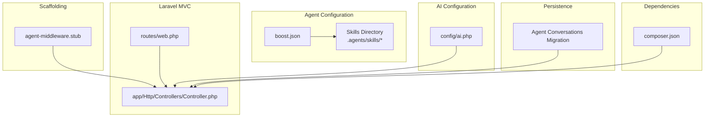
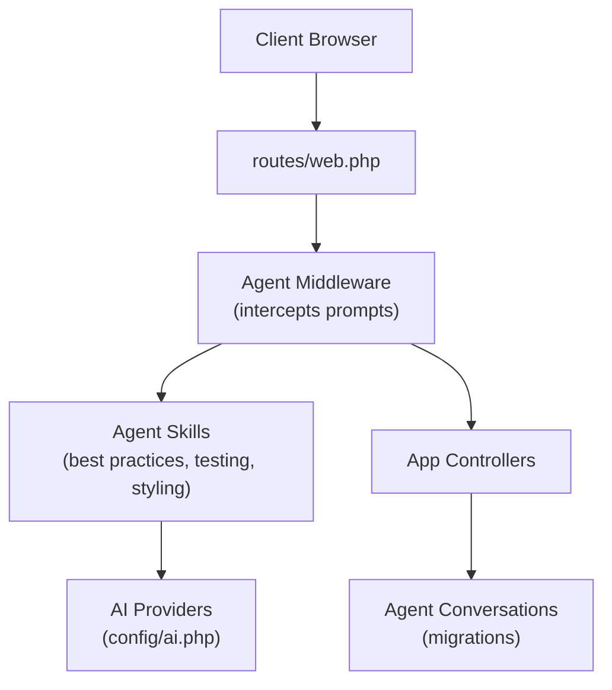
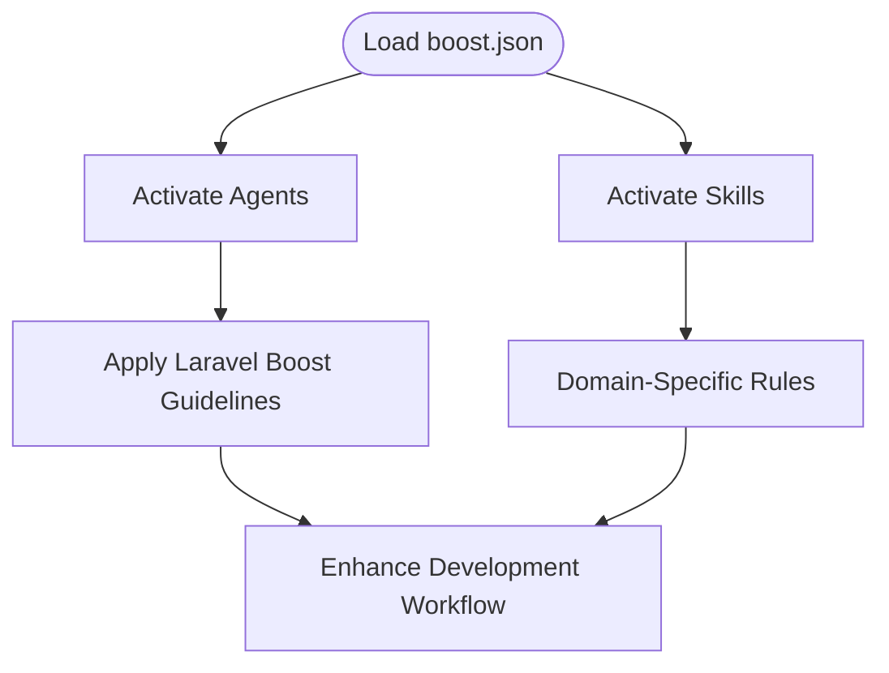
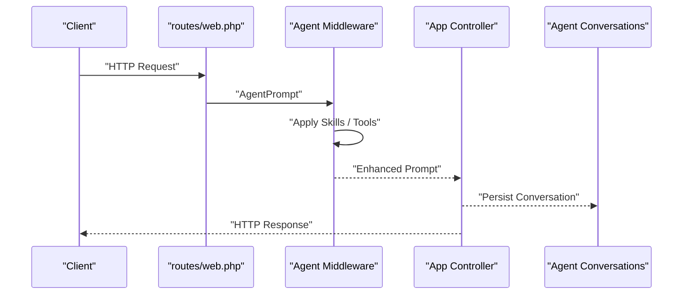
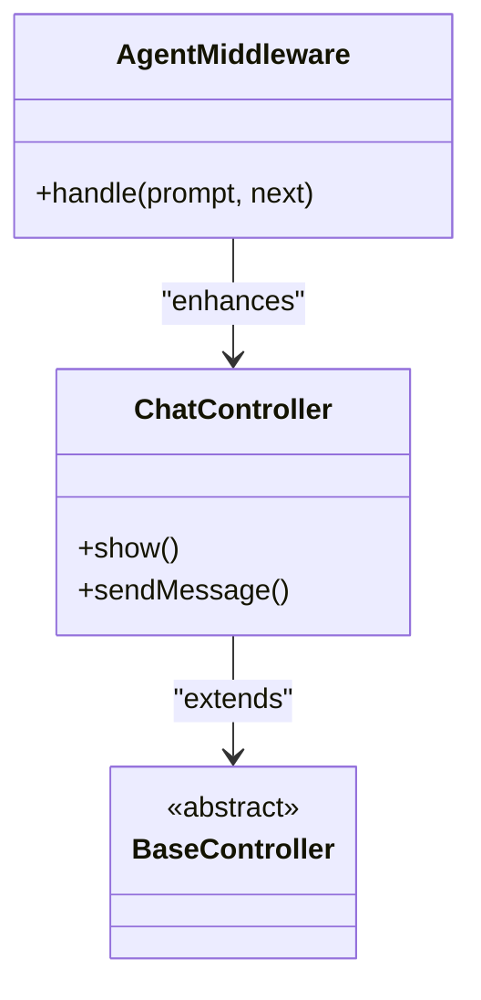
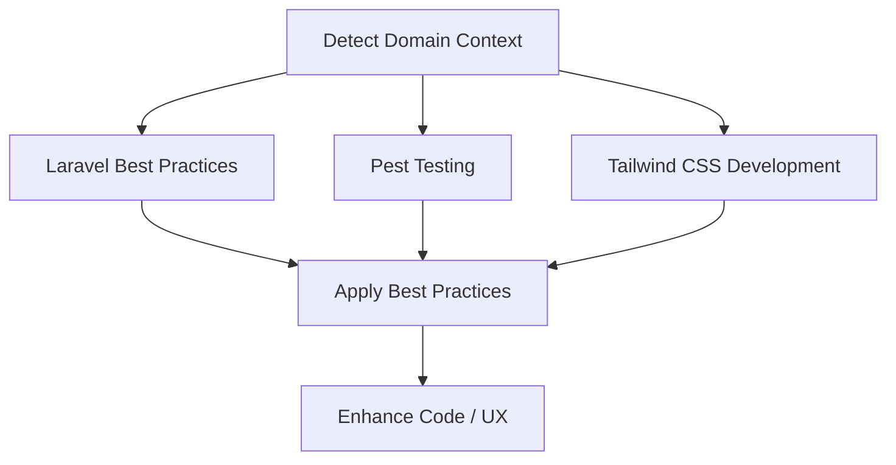
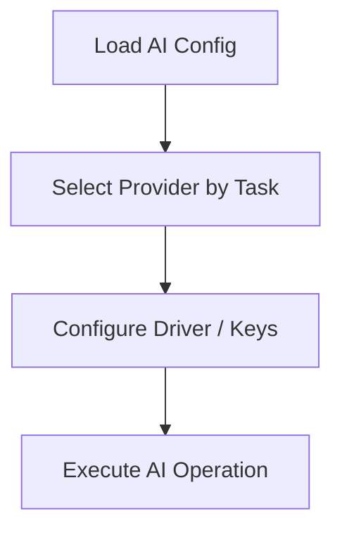
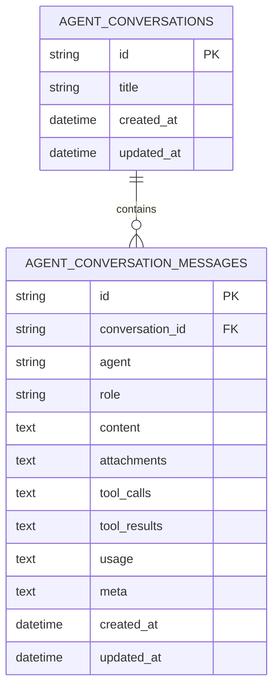
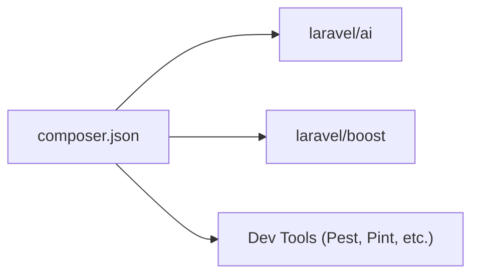
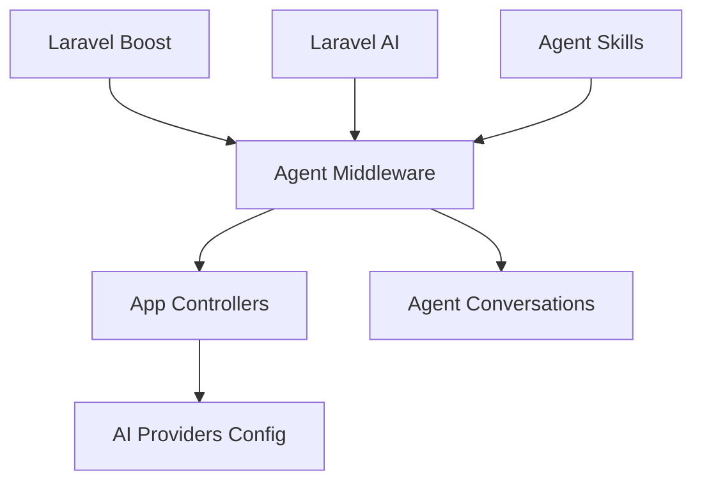

# Development Workflow Architecture

<cite>
**Referenced Files in This Document**
- [boost.json](file://boost.json)
- [AGENTS.md](file://AGENTS.md)
- [.agents/skills/laravel-best-practices/SKILL.md](file://.agents/skills/laravel-best-practices/SKILL.md)
- [.agents/skills/pest-testing/SKILL.md](file://.agents/skills/pest-testing/SKILL.md)
- [.agents/skills/tailwindcss-development/SKILL.md](file://.agents/skills/tailwindcss-development/SKILL.md)
- [stubs/agent-middleware.stub](file://stubs/agent-middleware.stub)
- [app/Http/Controllers/Controller.php](file://app/Http/Controllers/Controller.php)
- [routes/web.php](file://routes/web.php)
- [config/ai.php](file://config/ai.php)
- [database/migrations/2026_04_02_115916_create_agent_conversations_table.php](file://database/migrations/2026_04_02_115916_create_agent_conversations_table.php)
- [composer.json](file://composer.json)
- [README.md](file://README.md)
</cite>

## Table of Contents
1. [Introduction](#introduction)
2. [Project Structure](#project-structure)
3. [Core Components](#core-components)
4. [Architecture Overview](#architecture-overview)
5. [Detailed Component Analysis](#detailed-component-analysis)
6. [Dependency Analysis](#dependency-analysis)
7. [Performance Considerations](#performance-considerations)
8. [Troubleshooting Guide](#troubleshooting-guide)
9. [Conclusion](#conclusion)
10. [Appendices](#appendices)

## Introduction
This document explains the architectural design of an agent-based development workflow system layered atop Laravel’s conventional MVC architecture. The system leverages Laravel Boost and the Laravel AI ecosystem to integrate AI agents into everyday development tasks. The boost.json configuration defines which agents and skills are active, while the agent skill system codifies best practices and domain expertise. The agent middleware and scaffolding stubs enable interception and enhancement of standard Laravel operations, including controllers, routing, and database interactions. The goal is to maintain full Laravel compatibility while augmenting developer productivity with AI-powered assistance, automated code generation, and guided scaffolding.

## Project Structure
The repository organizes agent configuration, skills, scaffolding templates, and Laravel application code cohesively:
- Agent configuration and skills: boost.json and .agents/skills
- Agent middleware scaffolding: stubs/agent-middleware.stub
- Laravel MVC entry points: routes/web.php and app/Http/Controllers
- AI provider configuration: config/ai.php
- Agent conversation persistence: database/migrations
- Composer-managed dependencies: composer.json
- Project overview and installation guidance: README.md

**Diagram sources**
- [boost.json:1-17](file://boost.json#L1-L17)
- [.agents/skills/laravel-best-practices/SKILL.md:1-190](file://.agents/skills/laravel-best-practices/SKILL.md#L1-L190)
- [stubs/agent-middleware.stub:1-21](file://stubs/agent-middleware.stub#L1-L21)
- [routes/web.php:1-12](file://routes/web.php#L1-L12)
- [app/Http/Controllers/Controller.php:1-9](file://app/Http/Controllers/Controller.php#L1-L9)
- [config/ai.php:1-132](file://config/ai.php#L1-L132)
- [database/migrations/2026_04_02_115916_create_agent_conversations_table.php:1-51](file://database/migrations/2026_04_02_115916_create_agent_conversations_table.php#L1-L51)
- [composer.json:1-93](file://composer.json#L1-L93)

**Section sources**
- [boost.json:1-17](file://boost.json#L1-L17)
- [stubs/agent-middleware.stub:1-21](file://stubs/agent-middleware.stub#L1-L21)
- [routes/web.php:1-12](file://routes/web.php#L1-L12)
- [config/ai.php:1-132](file://config/ai.php#L1-L132)
- [database/migrations/2026_04_02_115916_create_agent_conversations_table.php:1-51](file://database/migrations/2026_04_02_115916_create_agent_conversations_table.php#L1-L51)
- [composer.json:1-93](file://composer.json#L1-L93)
- [README.md:32-42](file://README.md#L32-L42)

## Core Components
- Agent configuration and skills: boost.json activates agents and skills, enabling contextual AI assistance aligned with Laravel conventions.
- Agent middleware scaffolding: agent-middleware.stub provides a template for intercepting prompts and enhancing responses in the HTTP pipeline.
- Laravel MVC integration: routes/web.php and app/Http/Controllers/Controller.php demonstrate how controllers fit into the agent-enhanced workflow.
- AI provider configuration: config/ai.php centralizes provider credentials and defaults for AI operations.
- Conversation persistence: agent conversation tables persist chat history and tool interactions for reproducible agent sessions.
- Dependencies: composer.json installs Laravel AI and Boost, ensuring compatibility and tool availability.

**Section sources**
- [boost.json:1-17](file://boost.json#L1-L17)
- [stubs/agent-middleware.stub:1-21](file://stubs/agent-middleware.stub#L1-L21)
- [routes/web.php:1-12](file://routes/web.php#L1-L12)
- [app/Http/Controllers/Controller.php:1-9](file://app/Http/Controllers/Controller.php#L1-L9)
- [config/ai.php:1-132](file://config/ai.php#L1-L132)
- [database/migrations/2026_04_02_115916_create_agent_conversations_table.php:1-51](file://database/migrations/2026_04_02_115916_create_agent_conversations_table.php#L1-L51)
- [composer.json:1-93](file://composer.json#L1-L93)

## Architecture Overview
The agent-based workflow augments Laravel’s MVC by introducing an agent middleware layer that intercepts prompts, applies skills, and enhances responses before passing control to controllers. The system preserves Laravel’s routing and controller paradigms while adding AI-driven scaffolding, best practice enforcement, and automated assistance.

**Diagram sources**
- [routes/web.php:1-12](file://routes/web.php#L1-L12)
- [stubs/agent-middleware.stub:1-21](file://stubs/agent-middleware.stub#L1-L21)
- [.agents/skills/laravel-best-practices/SKILL.md:1-190](file://.agents/skills/laravel-best-practices/SKILL.md#L1-L190)
- [.agents/skills/pest-testing/SKILL.md:1-157](file://.agents/skills/pest-testing/SKILL.md#L1-L157)
- [.agents/skills/tailwindcss-development/SKILL.md:1-119](file://.agents/skills/tailwindcss-development/SKILL.md#L1-L119)
- [config/ai.php:1-132](file://config/ai.php#L1-L132)
- [database/migrations/2026_04_02_115916_create_agent_conversations_table.php:1-51](file://database/migrations/2026_04_02_115916_create_agent_conversations_table.php#L1-L51)

## Detailed Component Analysis

### Agent Configuration and Skills
- boost.json activates agents and skills, enabling contextual AI assistance. Agents include claude_code, gemini, and codex. Skills include laravel-best-practices, pest-testing, and tailwindcss-development.
- AGENTS.md documents foundational rules, conventions, and tool usage for Laravel Boost, ensuring agents follow Laravel conventions and leverage available tools.

**Diagram sources**
- [boost.json:1-17](file://boost.json#L1-L17)
- [AGENTS.md:1-155](file://AGENTS.md#L1-L155)

**Section sources**
- [boost.json:1-17](file://boost.json#L1-L17)
- [AGENTS.md:1-155](file://AGENTS.md#L1-L155)

### Agent Middleware and Enhancement Layer
- The agent middleware scaffold (agent-middleware.stub) defines an interception point for prompts, allowing agents to process input, apply skills, and modify responses before controllers handle requests.
- This middleware preserves Laravel’s controller lifecycle while adding AI-driven preprocessing and postprocessing hooks.

**Diagram sources**
- [stubs/agent-middleware.stub:1-21](file://stubs/agent-middleware.stub#L1-L21)
- [routes/web.php:1-12](file://routes/web.php#L1-L12)
- [database/migrations/2026_04_02_115916_create_agent_conversations_table.php:1-51](file://database/migrations/2026_04_02_115916_create_agent_conversations_table.php#L1-L51)

**Section sources**
- [stubs/agent-middleware.stub:1-21](file://stubs/agent-middleware.stub#L1-L21)

### Laravel MVC Integration
- routes/web.php defines routes for UI and chat endpoints, integrating with controllers that can be enhanced by agent middleware.
- app/Http/Controllers/Controller.php provides a base controller class, establishing a conventional foundation for agent-enhanced actions.

**Diagram sources**
- [app/Http/Controllers/Controller.php:1-9](file://app/Http/Controllers/Controller.php#L1-L9)
- [routes/web.php:1-12](file://routes/web.php#L1-L12)
- [stubs/agent-middleware.stub:1-21](file://stubs/agent-middleware.stub#L1-L21)

**Section sources**
- [routes/web.php:1-12](file://routes/web.php#L1-L12)
- [app/Http/Controllers/Controller.php:1-9](file://app/Http/Controllers/Controller.php#L1-L9)

### Agent Skills and Best Practices
- laravel-best-practices skill enforces database performance, security, caching, Eloquent patterns, validation, testing, queues, routing, HTTP client usage, events/notifications/mail, error handling, scheduling, architecture, migrations, collections, Blade/views, and conventions/style.
- pest-testing skill focuses on Pest PHP testing patterns, browser testing, smoke testing, architecture testing, and avoiding misuse outside test contexts.
- tailwindcss-development skill guides Tailwind CSS v4 usage, CSS-first configuration, import syntax, replaced utilities, spacing, dark mode, and common layout patterns.

**Diagram sources**
- [.agents/skills/laravel-best-practices/SKILL.md:1-190](file://.agents/skills/laravel-best-practices/SKILL.md#L1-L190)
- [.agents/skills/pest-testing/SKILL.md:1-157](file://.agents/skills/pest-testing/SKILL.md#L1-L157)
- [.agents/skills/tailwindcss-development/SKILL.md:1-119](file://.agents/skills/tailwindcss-development/SKILL.md#L1-L119)

**Section sources**
- [.agents/skills/laravel-best-practices/SKILL.md:1-190](file://.agents/skills/laravel-best-practices/SKILL.md#L1-L190)
- [.agents/skills/pest-testing/SKILL.md:1-157](file://.agents/skills/pest-testing/SKILL.md#L1-L157)
- [.agents/skills/tailwindcss-development/SKILL.md:1-119](file://.agents/skills/tailwindcss-development/SKILL.md#L1-L119)

### AI Provider Configuration
- config/ai.php centralizes provider drivers, keys, and defaults for text, images, audio, transcription, embeddings, and reranking, enabling agents to select appropriate providers for different tasks.

**Diagram sources**
- [config/ai.php:1-132](file://config/ai.php#L1-L132)

**Section sources**
- [config/ai.php:1-132](file://config/ai.php#L1-L132)

### Conversation Persistence
- The agent conversations migration establishes tables for storing conversations and messages, enabling agent sessions to persist across requests and supporting reproducible development assistance.

**Diagram sources**
- [database/migrations/2026_04_02_115916_create_agent_conversations_table.php:1-51](file://database/migrations/2026_04_02_115916_create_agent_conversations_table.php#L1-L51)

**Section sources**
- [database/migrations/2026_04_02_115916_create_agent_conversations_table.php:1-51](file://database/migrations/2026_04_02_115916_create_agent_conversations_table.php#L1-L51)

### Dependency Management and Tooling
- composer.json installs Laravel AI and Boost, along with development tools, ensuring the agent-based workflow is integrated into the project lifecycle and toolchain.

**Diagram sources**
- [composer.json:1-93](file://composer.json#L1-L93)

**Section sources**
- [composer.json:1-93](file://composer.json#L1-L93)
- [README.md:32-42](file://README.md#L32-L42)

## Dependency Analysis
The agent-based workflow depends on Laravel AI and Boost for agent orchestration, skills, and tools. The middleware depends on agent prompt/response abstractions, while controllers remain unchanged. Skills depend on Laravel conventions documented in AGENTS.md.

**Diagram sources**
- [composer.json:1-93](file://composer.json#L1-L93)
- [stubs/agent-middleware.stub:1-21](file://stubs/agent-middleware.stub#L1-L21)
- [config/ai.php:1-132](file://config/ai.php#L1-L132)
- [database/migrations/2026_04_02_115916_create_agent_conversations_table.php:1-51](file://database/migrations/2026_04_02_115916_create_agent_conversations_table.php#L1-L51)

**Section sources**
- [composer.json:1-93](file://composer.json#L1-L93)
- [stubs/agent-middleware.stub:1-21](file://stubs/agent-middleware.stub#L1-L21)
- [config/ai.php:1-132](file://config/ai.php#L1-L132)
- [database/migrations/2026_04_02_115916_create_agent_conversations_table.php:1-51](file://database/migrations/2026_04_02_115916_create_agent_conversations_table.php#L1-L51)

## Performance Considerations
- Provider selection: Use config/ai.php defaults judiciously to balance latency and cost; consider caching for embeddings and frequently accessed operations.
- Middleware overhead: Keep agent middleware lightweight; defer heavy processing to background jobs or tools.
- Conversation storage: Index agent conversation tables appropriately to optimize read/write performance.
- Skill application: Apply skills selectively to reduce unnecessary processing during routine operations.

## Troubleshooting Guide
- Installation and setup: Follow the Laravel Boost installation steps described in README.md to ensure proper tool activation.
- Agent configuration: Verify boost.json agents and skills lists match intended workflows.
- Provider credentials: Confirm environment variables for AI providers are set according to config/ai.php expectations.
- Conversation persistence: Ensure migrations are applied so agent conversations can be stored and retrieved.

**Section sources**
- [README.md:32-42](file://README.md#L32-L42)
- [boost.json:1-17](file://boost.json#L1-L17)
- [config/ai.php:1-132](file://config/ai.php#L1-L132)
- [database/migrations/2026_04_02_115916_create_agent_conversations_table.php:1-51](file://database/migrations/2026_04_02_115916_create_agent_conversations_table.php#L1-L51)

## Conclusion
The agent-based development workflow extends Laravel’s MVC architecture by layering an agent middleware that intercepts and enhances standard operations. Through boost.json and agent skills, developers gain AI-powered best practices, testing guidance, and UI assistance while maintaining full Laravel compatibility. The scaffolding templates, provider configuration, and conversation persistence enable scalable, reproducible agent-assisted development.

## Appendices
- Extending with custom agents and skills: Add new skills under .agents/skills and register them in boost.json. Implement agent middleware using stubs/agent-middleware.stub to intercept prompts and integrate tools.
- Maintaining compatibility: Keep controllers and routes unchanged; rely on middleware and skills to augment behavior without altering core application logic.