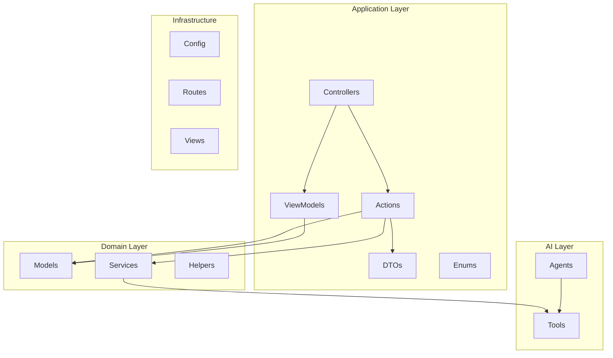
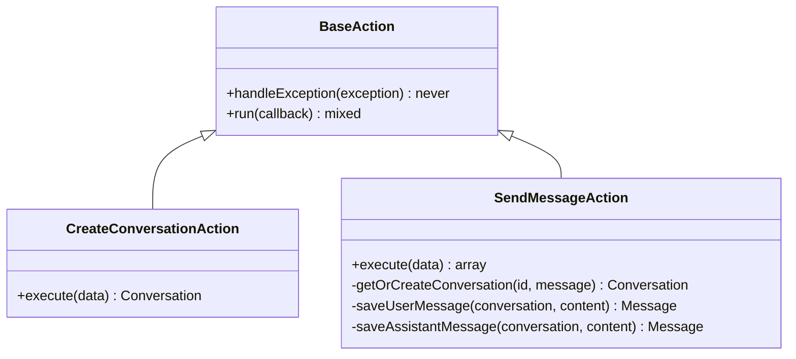
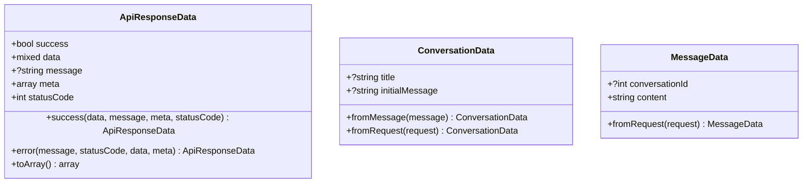
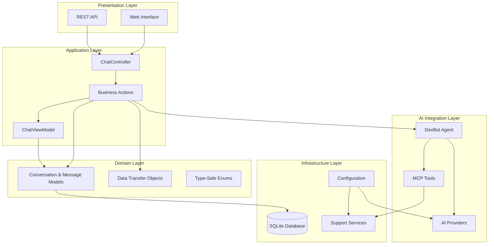
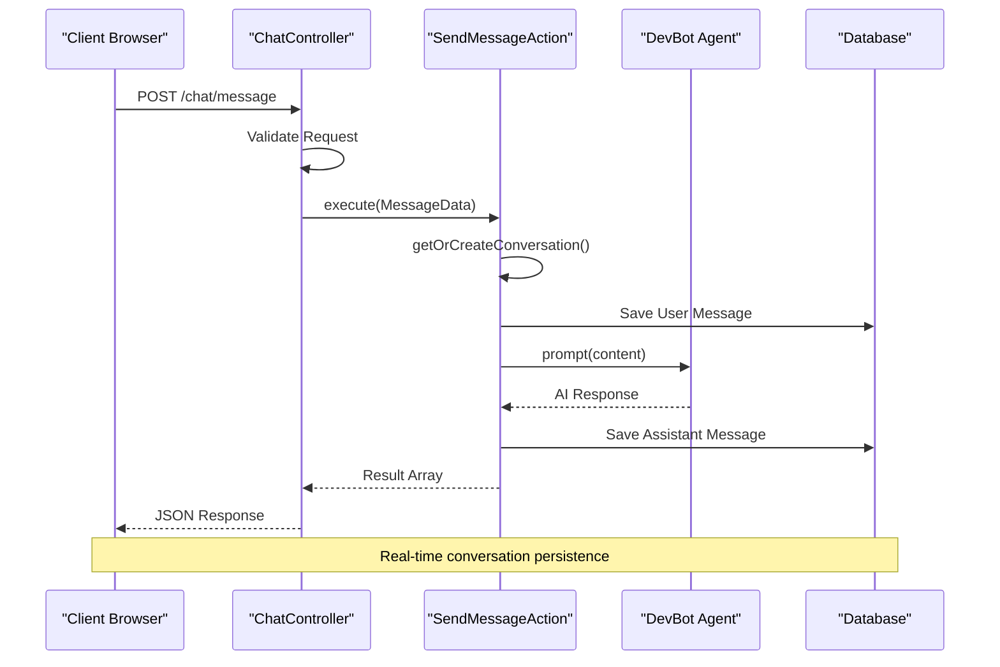
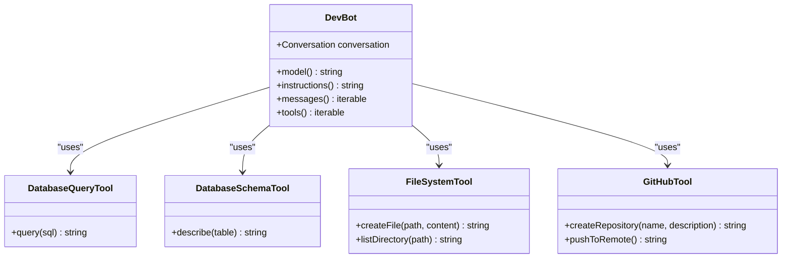
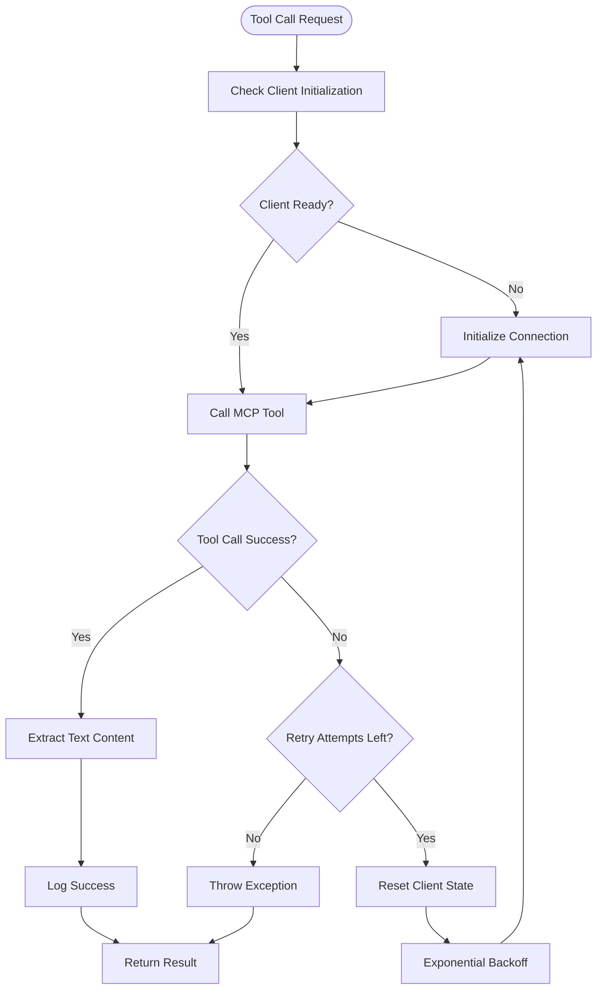
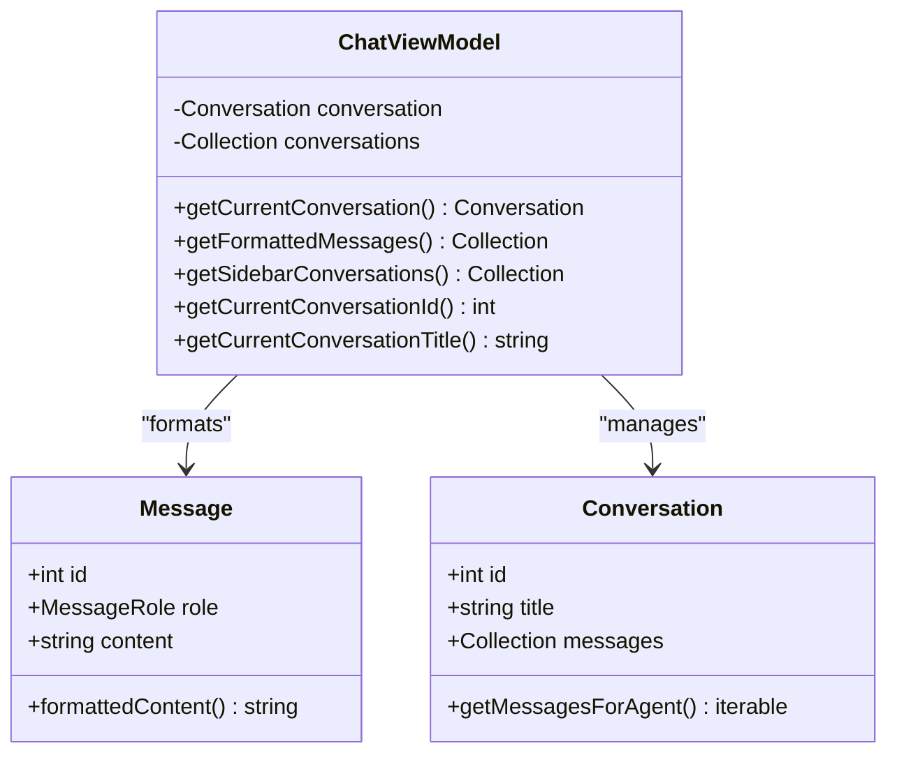
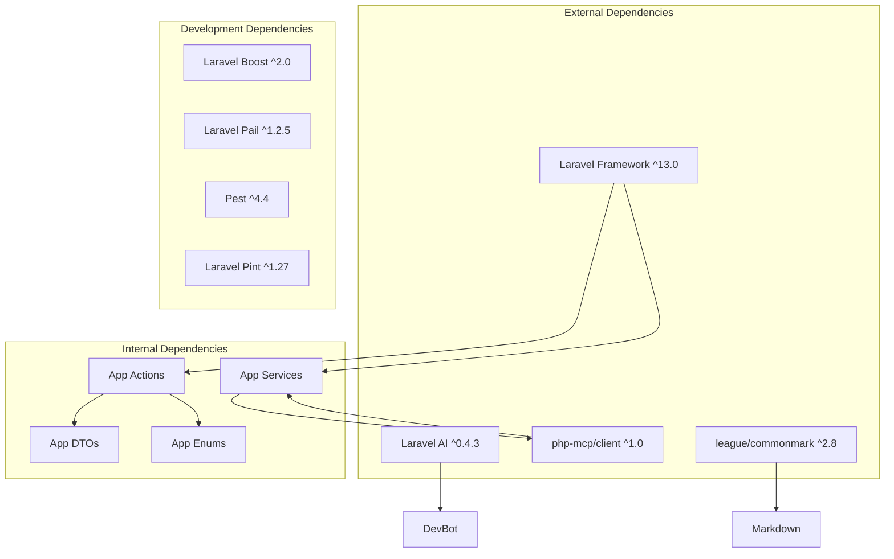

# Professional Laravel Architecture Framework

<cite>
**Referenced Files in This Document**
- [README.md](file://README.md)
- [composer.json](file://composer.json)
- [routes/web.php](file://routes/web.php)
- [config/ai.php](file://config/ai.php)
- [app/Http/Controllers/ChatController.php](file://app/Http/Controllers/ChatController.php)
- [app/Actions/BaseAction.php](file://app/Actions/BaseAction.php)
- [app/Actions/CreateConversationAction.php](file://app/Actions/CreateConversationAction.php)
- [app/Actions/SendMessageAction.php](file://app/Actions/SendMessageAction.php)
- [app/DTOs/ApiResponseData.php](file://app/DTOs/ApiResponseData.php)
- [app/DTOs/ConversationData.php](file://app/DTOs/ConversationData.php)
- [app/DTOs/MessageData.php](file://app/DTOs/MessageData.php)
- [app/ViewModels/ChatViewModel.php](file://app/ViewModels/ChatViewModel.php)
- [app/Enums/ConversationStatus.php](file://app/Enums/ConversationStatus.php)
- [app/Enums/MessageRole.php](file://app/Enums/MessageRole.php)
- [app/Ai/Agents/DevBot.php](file://app/Ai/Agents/DevBot.php)
- [app/Services/McpClientService.php](file://app/Services/McpClientService.php)
- [app/Helpers/Markdown.php](file://app/Helpers/Markdown.php)
</cite>

## Table of Contents
1. [Introduction](#introduction)
2. [Project Structure](#project-structure)
3. [Core Components](#core-components)
4. [Architecture Overview](#architecture-overview)
5. [Detailed Component Analysis](#detailed-component-analysis)
6. [Dependency Analysis](#dependency-analysis)
7. [Performance Considerations](#performance-considerations)
8. [Troubleshooting Guide](#troubleshooting-guide)
9. [Conclusion](#conclusion)

## Introduction

The Laravel Assistant project is a sophisticated AI-powered development environment built with Laravel 13 and PHP 8.3+. It serves as an interactive chat interface for developers seeking assistance with programming questions, code review, debugging, architecture decisions, and best practices. The system integrates multiple AI providers through Laravel AI v0.4+ and incorporates advanced MCP (Model Context Protocol) tool integration for enhanced capabilities.

Key architectural innovations include a comprehensive action pattern for business logic separation, robust DTO (Data Transfer Object) system for type-safe data handling, and a sophisticated ViewModel pattern for presentation layer concerns. The framework supports multiple AI providers including Anthropic, OpenAI, Google Gemini, and others, making it highly adaptable to different development environments and requirements.

## Project Structure

The project follows a modern Laravel architecture with clear separation of concerns and professional development practices:

**Diagram sources**
- [app/Http/Controllers/ChatController.php:1-154](file://app/Http/Controllers/ChatController.php#L1-L154)
- [app/Actions/BaseAction.php:1-58](file://app/Actions/BaseAction.php#L1-L58)
- [app/ViewModels/ChatViewModel.php:1-120](file://app/ViewModels/ChatViewModel.php#L1-L120)

The architecture emphasizes clean separation between presentation, business logic, domain models, and infrastructure concerns, enabling maintainability and testability at scale.

**Section sources**
- [README.md:161-197](file://README.md#L161-L197)
- [composer.json:29-40](file://composer.json#L29-L40)

## Core Components

### Action Pattern Architecture

The framework implements a sophisticated action pattern that encapsulates business logic in single-purpose classes. The `BaseAction` class provides common error handling and execution patterns, while specialized actions handle specific business operations.

**Diagram sources**
- [app/Actions/BaseAction.php:28-57](file://app/Actions/BaseAction.php#L28-L57)
- [app/Actions/CreateConversationAction.php:29-52](file://app/Actions/CreateConversationAction.php#L29-L52)
- [app/Actions/SendMessageAction.php:40-130](file://app/Actions/SendMessageAction.php#L40-L130)

### Data Transfer Objects (DTOs)

The DTO system ensures type safety and consistent data handling across the application. The `ApiResponseData` class provides standardized API response formatting, while `ConversationData` and `MessageData` encapsulate request-specific data structures.

**Diagram sources**
- [app/DTOs/ApiResponseData.php:31-89](file://app/DTOs/ApiResponseData.php#L31-L89)
- [app/DTOs/ConversationData.php](file://app/DTOs/ConversationData.php)
- [app/DTOs/MessageData.php](file://app/DTOs/MessageData.php)

### Enum System

The enum-based approach provides type-safe constants for conversation status and message roles, enhancing code reliability and developer experience through IDE support and compile-time checking.

**Section sources**
- [app/Actions/BaseAction.php:1-58](file://app/Actions/BaseAction.php#L1-L58)
- [app/DTOs/ApiResponseData.php:1-90](file://app/DTOs/ApiResponseData.php#L1-L90)
- [app/Enums/ConversationStatus.php:1-89](file://app/Enums/ConversationStatus.php#L1-L89)
- [app/Enums/MessageRole.php:1-77](file://app/Enums/MessageRole.php#L1-L77)

## Architecture Overview

The Laravel Assistant employs a layered architecture that separates concerns effectively while maintaining flexibility for future enhancements:

**Diagram sources**
- [app/Http/Controllers/ChatController.php:19-153](file://app/Http/Controllers/ChatController.php#L19-L153)
- [app/Ai/Agents/DevBot.php:30-136](file://app/Ai/Agents/DevBot.php#L30-L136)
- [app/Services/McpClientService.php:20-278](file://app/Services/McpClientService.php#L20-L278)

The architecture supports horizontal scaling through service abstraction and maintains clean boundaries between layers, enabling independent development and testing.

## Detailed Component Analysis

### Chat Controller Implementation

The `ChatController` serves as the primary entry point for chat functionality, implementing RESTful endpoints for conversation management and message handling. It demonstrates excellent separation of concerns by delegating business logic to specialized actions.

**Diagram sources**
- [app/Http/Controllers/ChatController.php:117-152](file://app/Http/Controllers/ChatController.php#L117-L152)
- [app/Actions/SendMessageAction.php:55-86](file://app/Actions/SendMessageAction.php#L55-L86)

The controller implements proper error handling with dual response formats (JSON for AJAX, redirects for traditional requests) and maintains conversation context through the action pattern.

**Section sources**
- [app/Http/Controllers/ChatController.php:1-154](file://app/Http/Controllers/ChatController.php#L1-L154)

### DevBot AI Agent Architecture

The `DevBot` agent implements Laravel AI's agent contracts and provides sophisticated conversational capabilities with integrated MCP tool access. The agent configuration includes provider selection, temperature settings, and step limits for controlled AI behavior.

**Diagram sources**
- [app/Ai/Agents/DevBot.php:30-136](file://app/Ai/Agents/DevBot.php#L30-L136)
- [app/Services/McpClientService.php:20-278](file://app/Services/McpClientService.php#L20-L278)

The agent implements comprehensive project creation workflows, database introspection, and file system operations while maintaining strict security boundaries.

**Section sources**
- [app/Ai/Agents/DevBot.php:1-137](file://app/Ai/Agents/DevBot.php#L1-L137)

### MCP Client Service Implementation

The `McpClientService` provides robust connection management for the Laravel Boost MCP server with automatic reconnection, exponential backoff, and comprehensive logging capabilities.

**Diagram sources**
- [app/Services/McpClientService.php:110-179](file://app/Services/McpClientService.php#L110-L179)

The service implements sophisticated error handling with detailed logging, graceful disconnection on shutdown, and flexible configuration for different deployment scenarios.

**Section sources**
- [app/Services/McpClientService.php:1-279](file://app/Services/McpClientService.php#L1-L279)

### ViewModel Pattern Implementation

The `ChatViewModel` encapsulates presentation logic and data transformation, keeping controllers thin and views focused on presentation concerns. The ViewModel handles message formatting, conversation metadata, and UI-specific data preparation.

**Diagram sources**
- [app/ViewModels/ChatViewModel.php:29-119](file://app/ViewModels/ChatViewModel.php#L29-L119)

The ViewModel pattern enables complex data transformations while maintaining separation between business logic and presentation concerns.

**Section sources**
- [app/ViewModels/ChatViewModel.php:1-120](file://app/ViewModels/ChatViewModel.php#L1-L120)

## Dependency Analysis

The project maintains excellent dependency management through Composer and follows SOLID principles throughout the codebase:

**Diagram sources**
- [composer.json:11-28](file://composer.json#L11-L28)
- [app/Ai/Agents/DevBot.php:5-12](file://app/Ai/Agents/DevBot.php#L5-L12)
- [app/Services/McpClientService.php:5-11](file://app/Services/McpClientService.php#L5-L11)

The dependency graph reveals a well-structured application where internal components depend on external libraries but maintain clear boundaries and minimal coupling.

**Section sources**
- [composer.json:1-95](file://composer.json#L1-L95)

## Performance Considerations

The architecture incorporates several performance optimization strategies:

- **Lazy Loading**: Eager loading of conversation messages prevents N+1 query problems
- **Caching Strategy**: Configurable caching for AI embeddings and other expensive operations  
- **Connection Pooling**: Reusable MCP client connections with automatic reconnection
- **Memory Management**: Proper resource cleanup and graceful shutdown handling
- **Response Optimization**: Efficient JSON serialization and minimal data transfer

The framework supports horizontal scaling through service abstraction and provides monitoring hooks for performance tracking.

## Troubleshooting Guide

Common issues and their solutions:

### Vite Asset Errors
- **Symptom**: "Unable to locate file in Vite manifest"
- **Solution**: Run `npm run build` or start development server with `npm run dev`

### MCP Connection Issues  
- **Symptom**: Tool calls failing with connection errors
- **Solution**: Check Laravel Pail logs with `php artisan pail` and verify MCP server availability

### Database Problems
- **Symptom**: Migration or connection failures
- **Solution**: Reset database with `php artisan migrate:fresh`

### AI Provider Configuration
- **Symptom**: API calls failing or incorrect responses
- **Solution**: Verify environment variables and provider credentials in configuration

**Section sources**
- [README.md:304-331](file://README.md#L304-L331)

## Conclusion

The Laravel Assistant project exemplifies professional Laravel architecture through its implementation of clean patterns, comprehensive error handling, and scalable design principles. The codebase demonstrates:

- **Clean Architecture**: Clear separation of concerns with well-defined boundaries
- **Type Safety**: Extensive use of enums, DTOs, and strict typing
- **Maintainability**: Single-responsibility actions and reusable components
- **Extensibility**: Plugin-friendly architecture supporting multiple AI providers
- **Production Readiness**: Robust error handling, logging, and monitoring capabilities

The framework provides an excellent foundation for AI-powered development tools and can serve as a reference implementation for enterprise Laravel applications requiring sophisticated AI integration and professional development practices.