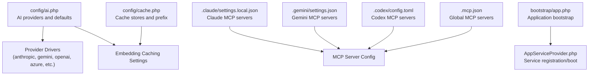
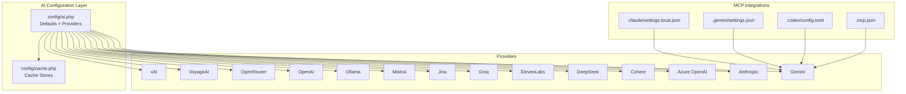
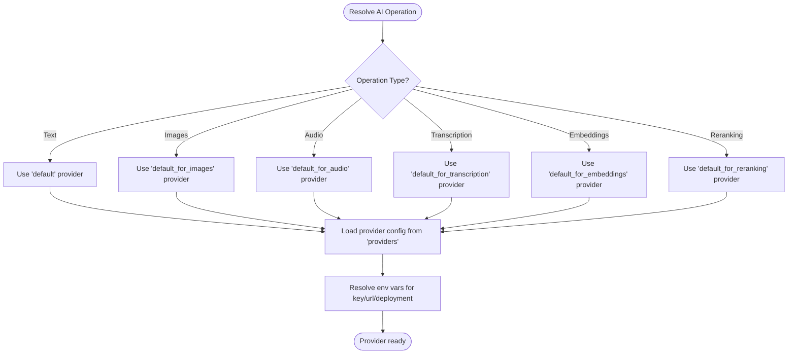
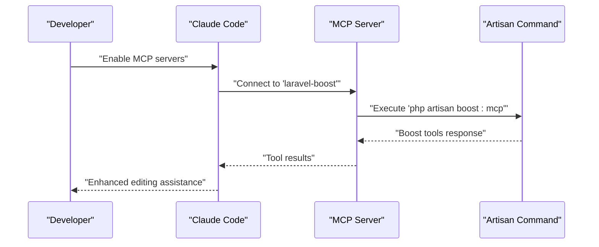
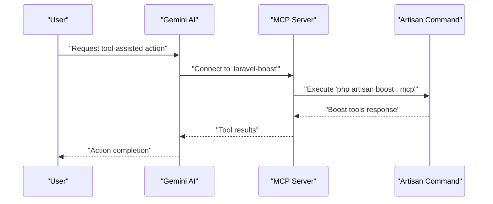
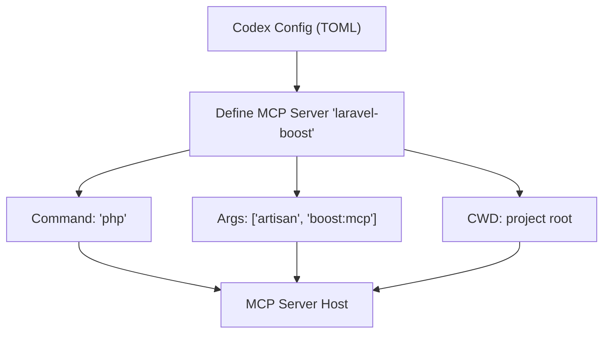
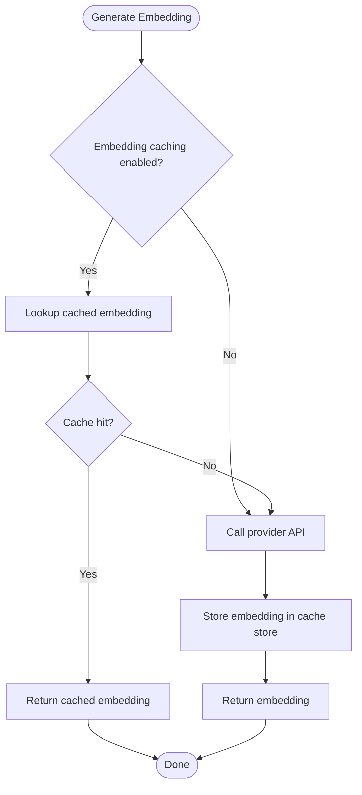
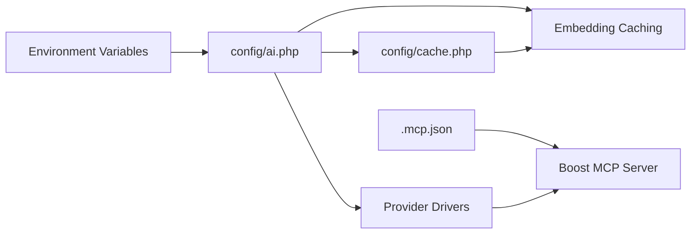

# AI Service Configuration

<cite>
**Referenced Files in This Document**
- [config/ai.php](file://config/ai.php)
- [.claude/settings.local.json](file://.claude/settings.local.json)
- [.gemini/settings.json](file://.gemini/settings.json)
- [.codex/config.toml](file://.codex/config.toml)
- [.mcp.json](file://.mcp.json)
- [config/cache.php](file://config/cache.php)
- [bootstrap/app.php](file://bootstrap/app.php)
- [app/Providers/AppServiceProvider.php](file://app/Providers/AppServiceProvider.php)
- [CLAUDE.md](file://CLAUDE.md)
- [GEMINI.md](file://GEMINI.md)
- [AGENTS.md](file://AGENTS.md)
</cite>

## Table of Contents
1. [Introduction](#introduction)
2. [Project Structure](#project-structure)
3. [Core Components](#core-components)
4. [Architecture Overview](#architecture-overview)
5. [Detailed Component Analysis](#detailed-component-analysis)
6. [Dependency Analysis](#dependency-analysis)
7. [Performance Considerations](#performance-considerations)
8. [Troubleshooting Guide](#troubleshooting-guide)
9. [Conclusion](#conclusion)
10. [Appendices](#appendices)

## Introduction
This document explains the AI Service Configuration for Laravel Assistant’s multi-provider AI integration system. It covers the AI service abstraction layer, provider-specific configuration options, environment-based fallback mechanisms, and how Claude Code, Gemini AI, and Codex MCP support are set up. It also documents caching strategies, rate limiting considerations, performance optimization settings, practical configuration examples, troubleshooting, provider switching, and the relationship between AI configuration and agent functionality.

## Project Structure
The AI configuration is primarily centralized in the AI configuration file, complemented by provider-specific settings for Claude Code, Gemini AI, and Codex MCP. Cache configuration is handled separately. The application bootstrap and service provider files are minimal in this project and do not override AI configuration.

**Diagram sources**
- [config/ai.php:1-131](file://config/ai.php#L1-L131)
- [.claude/settings.local.json:1-7](file://.claude/settings.local.json#L1-L7)
- [.gemini/settings.json:1-11](file://.gemini/settings.json#L1-L11)
- [.codex/config.toml:1-5](file://.codex/config.toml#L1-L5)
- [.mcp.json:1-11](file://.mcp.json#L1-L11)
- [config/cache.php:1-131](file://config/cache.php#L1-L131)
- [bootstrap/app.php:1-19](file://bootstrap/app.php#L1-L19)
- [app/Providers/AppServiceProvider.php:1-25](file://app/Providers/AppServiceProvider.php#L1-L25)

**Section sources**
- [config/ai.php:1-131](file://config/ai.php#L1-L131)
- [config/cache.php:1-131](file://config/cache.php#L1-L131)
- [bootstrap/app.php:1-19](file://bootstrap/app.php#L1-L19)
- [app/Providers/AppServiceProvider.php:1-25](file://app/Providers/AppServiceProvider.php#L1-L25)

## Core Components
- AI Providers and Defaults
  - Default provider selection per task type: text, images, audio, transcription, embeddings, reranking.
  - Provider registry with driver and credential fields; many include optional URL overrides and provider-specific parameters.
- Embedding Caching
  - Centralized embedding caching toggle and store selection, inheriting cache store from environment.
- MCP Servers for Claude, Gemini, and Global
  - Local Claude settings enable MCP servers and project-wide MCP server activation.
  - Gemini settings define MCP server command and arguments.
  - Codex and global MCP JSON define MCP server command and working directory.

Practical configuration examples (paths only):
- Set default providers: [config/ai.php:16-21](file://config/ai.php#L16-L21)
- Configure Anthropic: [config/ai.php:53-57](file://config/ai.php#L53-L57)
- Configure Azure OpenAI: [config/ai.php:59-66](file://config/ai.php#L59-L66)
- Configure Cohere: [config/ai.php:68-71](file://config/ai.php#L68-L71)
- Configure Gemini: [config/ai.php:83-86](file://config/ai.php#L83-L86)
- Configure Ollama: [config/ai.php:103-107](file://config/ai.php#L103-L107)
- Configure OpenAI: [config/ai.php:109-113](file://config/ai.php#L109-L113)
- Enable embedding caching: [config/ai.php:34-39](file://config/ai.php#L34-L39)
- Claude MCP settings: [.claude/settings.local.json:1-7](file://.claude/settings.local.json#L1-L7)
- Gemini MCP settings: [.gemini/settings.json:1-11](file://.gemini/settings.json#L1-L11)
- Codex MCP settings: [.codex/config.toml:1-5](file://.codex/config.toml#L1-L5)
- Global MCP settings: [.mcp.json:1-11](file://.mcp.json#L1-L11)

**Section sources**
- [config/ai.php:16-129](file://config/ai.php#L16-L129)
- [config/ai.php:34-39](file://config/ai.php#L34-L39)
- [.claude/settings.local.json:1-7](file://.claude/settings.local.json#L1-L7)
- [.gemini/settings.json:1-11](file://.gemini/settings.json#L1-L11)
- [.codex/config.toml:1-5](file://.codex/config.toml#L1-L5)
- [.mcp.json:1-11](file://.mcp.json#L1-L11)

## Architecture Overview
The AI service abstraction layer selects a provider based on the operation type and environment defaults. Provider credentials and endpoints are resolved from environment variables. Embedding generation can leverage configured cache stores. MCP server configurations enable Claude Code and Gemini AI integrations.

**Diagram sources**
- [config/ai.php:16-129](file://config/ai.php#L16-L129)
- [config/cache.php:1-131](file://config/cache.php#L1-131)
- [.claude/settings.local.json:1-7](file://.claude/settings.local.json#L1-L7)
- [.gemini/settings.json:1-11](file://.gemini/settings.json#L1-L11)
- [.codex/config.toml:1-5](file://.codex/config.toml#L1-L5)
- [.mcp.json:1-11](file://.mcp.json#L1-L11)

## Detailed Component Analysis

### AI Provider Abstraction and Defaults
- Default provider selection per capability:
  - Text generation default: anthropic
  - Images default: gemini
  - Audio default: openai
  - Transcription default: openai
  - Embeddings default: openai
  - Reranking default: cohere
- Provider registry supports multiple drivers with environment-backed keys and optional endpoint overrides.

**Diagram sources**
- [config/ai.php:16-21](file://config/ai.php#L16-L21)
- [config/ai.php:52-129](file://config/ai.php#L52-L129)

**Section sources**
- [config/ai.php:16-21](file://config/ai.php#L16-L21)
- [config/ai.php:52-129](file://config/ai.php#L52-L129)

### Claude Code Integration Settings
- Local Claude settings enable MCP servers and allow enabling all project MCP servers.
- MCP server definition points to the Laravel Boost Artisan command.

**Diagram sources**
- [.claude/settings.local.json:1-7](file://.claude/settings.local.json#L1-L7)
- [.mcp.json:1-11](file://.mcp.json#L1-L11)

**Section sources**
- [.claude/settings.local.json:1-7](file://.claude/settings.local.json#L1-L7)
- [.mcp.json:1-11](file://.mcp.json#L1-L11)
- [CLAUDE.md:1-155](file://CLAUDE.md#L1-L155)

### Gemini AI Configuration
- MCP server configuration defines the command and arguments to launch the Boost MCP server.
- Gemini settings integrate with the same Boost MCP server used by Claude.

**Diagram sources**
- [.gemini/settings.json:1-11](file://.gemini/settings.json#L1-L11)
- [.mcp.json:1-11](file://.mcp.json#L1-L11)

**Section sources**
- [.gemini/settings.json:1-11](file://.gemini/settings.json#L1-L11)
- [.mcp.json:1-11](file://.mcp.json#L1-L11)
- [GEMINI.md:1-155](file://GEMINI.md#L1-L155)

### Codex MCP Support Setup
- Codex TOML configuration defines the MCP server command, arguments, and working directory.
- This enables MCP-based tooling for environments preferring TOML-based configuration.

**Diagram sources**
- [.codex/config.toml:1-5](file://.codex/config.toml#L1-L5)

**Section sources**
- [.codex/config.toml:1-5](file://.codex/config.toml#L1-L5)

### Embedding Caching Strategy
- Embedding caching is controlled centrally and can be toggled on/off.
- The cache store is resolved from the environment and defaults to the database cache store.
- Cache key prefixing is inherited from the application cache configuration.

**Diagram sources**
- [config/ai.php:34-39](file://config/ai.php#L34-L39)
- [config/cache.php:18](file://config/cache.php#L18)
- [config/cache.php:115](file://config/cache.php#L115)

**Section sources**
- [config/ai.php:34-39](file://config/ai.php#L34-L39)
- [config/cache.php:18](file://config/cache.php#L18)
- [config/cache.php:115](file://config/cache.php#L115)

### Environment-Based Fallback Mechanisms
- Provider keys and optional endpoints are resolved from environment variables.
- Defaults are provided for common scenarios (e.g., default API URLs, Azure API version, deployment names).
- Cache store defaults to the database cache store when not explicitly set.

Practical environment variable examples (paths only):
- Anthropic: [config/ai.php:55](file://config/ai.php#L55), [config/ai.php:56](file://config/ai.php#L56)
- Azure OpenAI: [config/ai.php:61](file://config/ai.php#L61), [config/ai.php:62](file://config/ai.php#L62), [config/ai.php:63](file://config/ai.php#L63), [config/ai.php:64](file://config/ai.php#L64), [config/ai.php:65](file://config/ai.php#L65)
- Cohere: [config/ai.php:70](file://config/ai.php#L70)
- Gemini: [config/ai.php:85](file://config/ai.php#L85)
- Ollama: [config/ai.php:105](file://config/ai.php#L105), [config/ai.php:106](file://config/ai.php#L106)
- OpenAI: [config/ai.php:111](file://config/ai.php#L111), [config/ai.php:112](file://config/ai.php#L112)
- Cache store: [config/ai.php:37](file://config/ai.php#L37), [config/cache.php:18](file://config/cache.php#L18)

**Section sources**
- [config/ai.php:55-113](file://config/ai.php#L55-L113)
- [config/ai.php:37](file://config/ai.php#L37)
- [config/cache.php:18](file://config/cache.php#L18)

### Practical Configuration Examples
- Configure Anthropic:
  - Set key and optional URL in provider config.
  - Reference: [config/ai.php:53-57](file://config/ai.php#L53-L57)
- Configure Azure OpenAI:
  - Set key, URL, API version, deployment, and embedding deployment.
  - Reference: [config/ai.php:59-66](file://config/ai.php#L59-L66)
- Configure Cohere:
  - Set key for reranking/embeddings.
  - Reference: [config/ai.php:68-71](file://config/ai.php#L68-L71)
- Configure Gemini:
  - Set key for image/audio/text tasks.
  - Reference: [config/ai.php:83-86](file://config/ai.php#L83-L86)
- Configure Ollama:
  - Set optional key and base URL for local inference.
  - Reference: [config/ai.php:103-107](file://config/ai.php#L103-L107)
- Configure OpenAI:
  - Set key and optional URL for audio/transcription/embeddings.
  - Reference: [config/ai.php:109-113](file://config/ai.php#L109-L113)
- Enable embedding caching:
  - Toggle and select cache store.
  - Reference: [config/ai.php:34-39](file://config/ai.php#L34-L39)
- Claude MCP:
  - Enable MCP servers and project-wide MCP activation.
  - Reference: [.claude/settings.local.json:1-7](file://.claude/settings.local.json#L1-L7)
- Gemini MCP:
  - Define MCP server command and args.
  - Reference: [.gemini/settings.json:1-11](file://.gemini/settings.json#L1-L11)
- Codex MCP:
  - Define MCP server command, args, and working directory.
  - Reference: [.codex/config.toml:1-5](file://.codex/config.toml#L1-L5)
- Global MCP:
  - Define MCP server command and args.
  - Reference: [.mcp.json:1-11](file://.mcp.json#L1-L11)

**Section sources**
- [config/ai.php:53-113](file://config/ai.php#L53-L113)
- [config/ai.php:34-39](file://config/ai.php#L34-L39)
- [.claude/settings.local.json:1-7](file://.claude/settings.local.json#L1-L7)
- [.gemini/settings.json:1-11](file://.gemini/settings.json#L1-L11)
- [.codex/config.toml:1-5](file://.codex/config.toml#L1-L5)
- [.mcp.json:1-11](file://.mcp.json#L1-L11)

### Agent Functionality and Provider Impact
- Agents rely on the AI configuration to select appropriate providers for different modalities (text, images, audio, transcription, embeddings, reranking).
- Provider choice affects latency, cost, quality, and feature availability.
- MCP integrations (Claude Code and Gemini AI) enhance agent capabilities by providing tool access via the Boost MCP server.

Relationship overview:
- Default provider selection influences agent behavior for each task type.
- Embedding caching reduces repeated API calls for vector operations.
- MCP servers enable richer agent actions through Boost tools.

References:
- Defaults and providers: [config/ai.php:16-129](file://config/ai.php#L16-L129)
- Embedding caching: [config/ai.php:34-39](file://config/ai.php#L34-L39)
- MCP settings: [.claude/settings.local.json:1-7](file://.claude/settings.local.json#L1-L7), [.gemini/settings.json:1-11](file://.gemini/settings.json#L1-L11), [.codex/config.toml:1-5](file://.codex/config.toml#L1-L5), [.mcp.json:1-11](file://.mcp.json#L1-L11)
- Agent guidelines: [AGENTS.md:1-155](file://AGENTS.md#L1-L155)

**Section sources**
- [config/ai.php:16-129](file://config/ai.php#L16-L129)
- [config/ai.php:34-39](file://config/ai.php#L34-L39)
- [.claude/settings.local.json:1-7](file://.claude/settings.local.json#L1-L7)
- [.gemini/settings.json:1-11](file://.gemini/settings.json#L1-L11)
- [.codex/config.toml:1-5](file://.codex/config.toml#L1-L5)
- [.mcp.json:1-11](file://.mcp.json#L1-L11)
- [AGENTS.md:1-155](file://AGENTS.md#L1-L155)

## Dependency Analysis
- AI configuration depends on environment variables for keys and optional endpoints.
- Embedding caching depends on the cache store configuration and prefix.
- MCP integrations depend on the presence of the Boost MCP server command and working directory configuration.

**Diagram sources**
- [config/ai.php:16-129](file://config/ai.php#L16-L129)
- [config/cache.php:1-131](file://config/cache.php#L1-131)
- [.mcp.json:1-11](file://.mcp.json#L1-L11)

**Section sources**
- [config/ai.php:16-129](file://config/ai.php#L16-L129)
- [config/cache.php:1-131](file://config/cache.php#L1-131)
- [.mcp.json:1-11](file://.mcp.json#L1-L11)

## Performance Considerations
- Embedding caching reduces redundant API calls and improves latency for vector operations.
- Selecting providers optimized for specific modalities (images, audio, embeddings) can improve throughput and cost.
- Using appropriate cache stores (e.g., Redis or database) and setting cache prefixes helps avoid collisions and improves cache efficiency.
- Rate limiting is not explicitly configured in the examined files; consider provider-side limits and implement application-level throttling if needed.

[No sources needed since this section provides general guidance]

## Troubleshooting Guide
Common issues and resolutions:
- Missing API Keys
  - Symptom: Authentication failures when calling providers.
  - Resolution: Ensure environment variables for provider keys are set and loaded.
  - References: [config/ai.php:55](file://config/ai.php#L55), [config/ai.php:61](file://config/ai.php#L61), [config/ai.php:70](file://config/ai.php#L70), [config/ai.php:85](file://config/ai.php#L85), [config/ai.php:105](file://config/ai.php#L105), [config/ai.php:111](file://config/ai.php#L111)
- Incorrect Provider Selection
  - Symptom: Unexpected provider used for a task.
  - Resolution: Verify default provider settings for the operation type.
  - References: [config/ai.php:16-21](file://config/ai.php#L16-L21)
- Embedding Caching Not Working
  - Symptom: Embeddings not cached or cache misses.
  - Resolution: Confirm caching toggle and cache store configuration.
  - References: [config/ai.php:34-39](file://config/ai.php#L34-L39), [config/cache.php:18](file://config/cache.php#L18)
- MCP Server Issues
  - Symptom: Claude Code or Gemini AI cannot connect to tools.
  - Resolution: Verify MCP server command, args, and working directory; ensure Boost command exists.
  - References: [.claude/settings.local.json:1-7](file://.claude/settings.local.json#L1-L7), [.gemini/settings.json:1-11](file://.gemini/settings.json#L1-L11), [.codex/config.toml:1-5](file://.codex/config.toml#L1-L5), [.mcp.json:1-11](file://.mcp.json#L1-L11)
- Provider-Specific Parameters
  - Symptom: Endpoint or deployment mismatch.
  - Resolution: Set provider URL and deployment parameters as needed.
  - References: [config/ai.php:56](file://config/ai.php#L56), [config/ai.php:62](file://config/ai.php#L62), [config/ai.php:63](file://config/ai.php#L63), [config/ai.php:64](file://config/ai.php#L64), [config/ai.php:65](file://config/ai.php#L65), [config/ai.php:106](file://config/ai.php#L106)

**Section sources**
- [config/ai.php:16-129](file://config/ai.php#L16-L129)
- [config/ai.php:34-39](file://config/ai.php#L34-L39)
- [config/cache.php:18](file://config/cache.php#L18)
- [.claude/settings.local.json:1-7](file://.claude/settings.local.json#L1-L7)
- [.gemini/settings.json:1-11](file://.gemini/settings.json#L1-L11)
- [.codex/config.toml:1-5](file://.codex/config.toml#L1-L5)
- [.mcp.json:1-11](file://.mcp.json#L1-L11)

## Conclusion
Laravel Assistant’s AI Service Configuration provides a flexible, environment-driven abstraction across multiple providers and modalities. Defaults guide provider selection, while MCP integrations extend agent capabilities. Embedding caching and cache store configuration help optimize performance. Proper environment setup and provider-specific parameters ensure reliable operation and predictable agent behavior.

[No sources needed since this section summarizes without analyzing specific files]

## Appendices
- Agent guidelines and tool usage references:
  - [AGENTS.md:1-155](file://AGENTS.md#L1-L155)
  - [CLAUDE.md:1-155](file://CLAUDE.md#L1-L155)
  - [GEMINI.md:1-155](file://GEMINI.md#L1-L155)

**Section sources**
- [AGENTS.md:1-155](file://AGENTS.md#L1-L155)
- [CLAUDE.md:1-155](file://CLAUDE.md#L1-L155)
- [GEMINI.md:1-155](file://GEMINI.md#L1-L155)