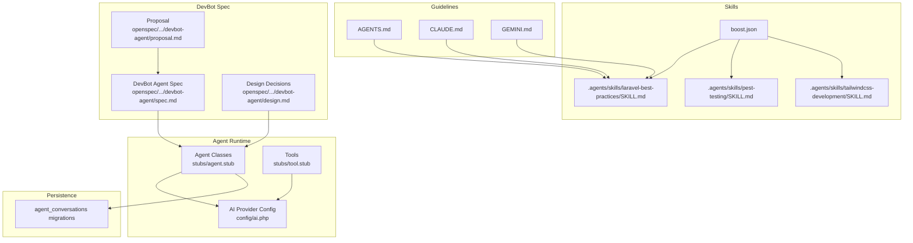
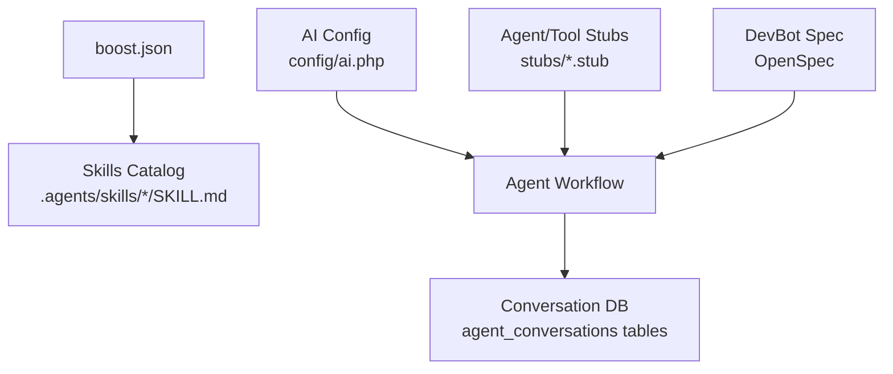
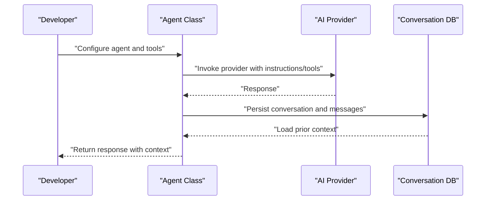
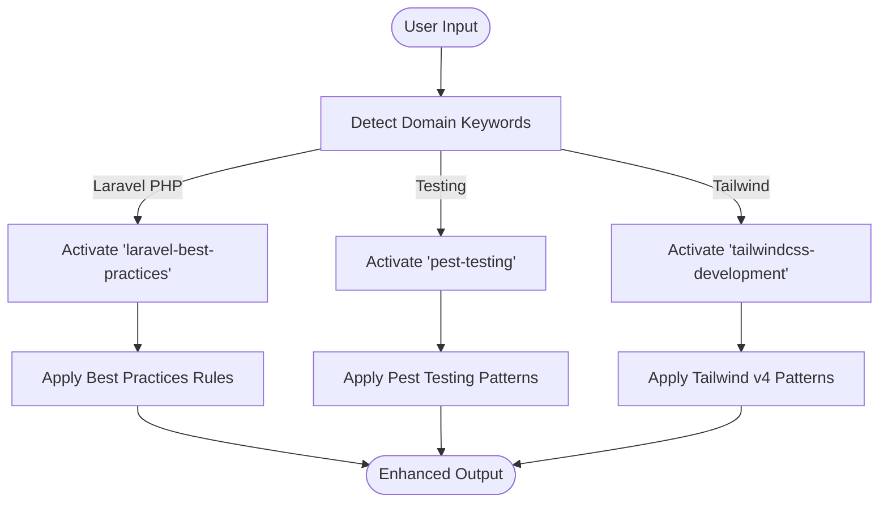
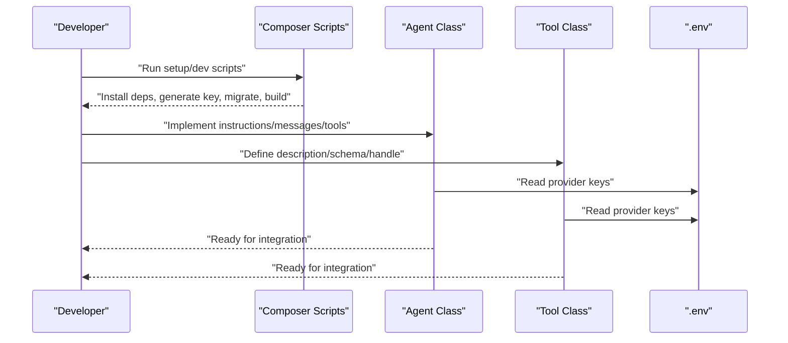
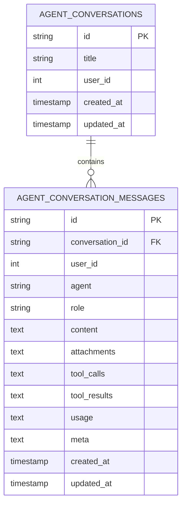
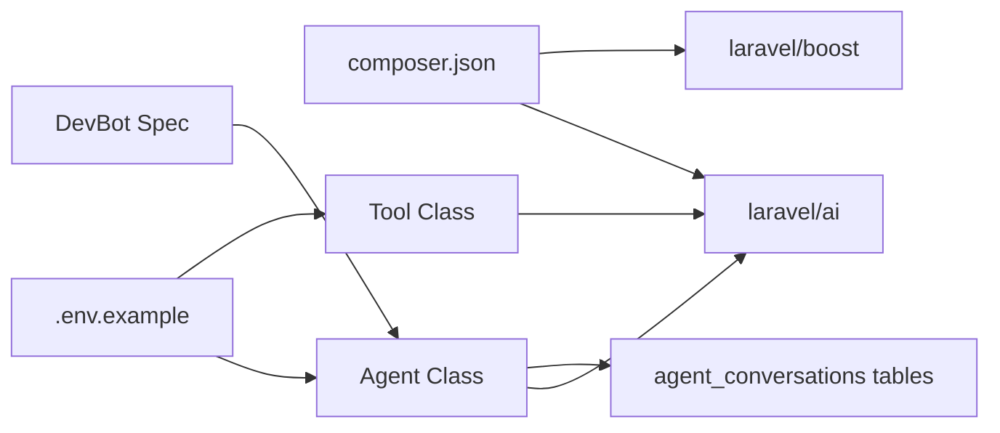

# Agent and Skill Configuration

<cite>
**Referenced Files in This Document**
- [boost.json](file://boost.json)
- [AGENTS.md](file://AGENTS.md)
- [CLAUDE.md](file://CLAUDE.md)
- [GEMINI.md](file://GEMINI.md)
- [ai.php](file://config/ai.php)
- [2026_04_02_115916_create_agent_conversations_table.php](file://database/migrations/2026_04_02_115916_create_agent_conversations_table.php)
- [laravel-best-practices/SKILL.md](file://.agents/skills/laravel-best-practices/SKILL.md)
- [pest-testing/SKILL.md](file://.agents/skills/pest-testing/SKILL.md)
- [tailwindcss-development/SKILL.md](file://.agents/skills/tailwindcss-development/SKILL.md)
- [agent.stub](file://stubs/agent.stub)
- [tool.stub](file://stubs/tool.stub)
- [composer.json](file://composer.json)
- [.env.example](file://.env.example)
- [spec.md](file://openspec/changes/devbot-ai-agent/specs/devbot-agent/spec.md)
- [design.md](file://openspec/changes/devbot-ai-agent/design.md)
- [proposal.md](file://openspec/changes/devbot-ai-agent/proposal.md)
</cite>

## Table of Contents
1. [Introduction](#introduction)
2. [Project Structure](#project-structure)
3. [Core Components](#core-components)
4. [Architecture Overview](#architecture-overview)
5. [Detailed Component Analysis](#detailed-component-analysis)
6. [Dependency Analysis](#dependency-analysis)
7. [Performance Considerations](#performance-considerations)
8. [Troubleshooting Guide](#troubleshooting-guide)
9. [Conclusion](#conclusion)
10. [Appendices](#appendices)

## Introduction
This document explains Agent and Skill Configuration for Laravel Assistant’s AI agent development system. It covers:
- Agent configuration structure and lifecycle
- Skill activation mechanisms and skill-based development patterns
- Development workflow setup and tooling
- boost.json configuration for agent and skill management
- Practical examples for configuring existing agents, activating skills, and creating new agent capabilities
- Performance optimization, memory management, and resource allocation
- Monitoring and debugging techniques
- Extending the agent system with custom functionality

## Project Structure
The repository organizes agent and skill assets around a few key areas:
- Agent configuration and provider selection in config/ai.php
- Skill definitions under .agents/skills/<skill-name>/SKILL.md
- Agent conversation persistence via database migrations
- Stubs for creating agents and tools
- Project-wide configuration and environment variables
- OpenSpec artifacts defining DevBot agent behavior and UI

**Diagram sources**
- [ai.php:1-132](file://config/ai.php#L1-L132)
- [agent.stub:1-45](file://stubs/agent.stub#L1-L45)
- [tool.stub:1-38](file://stubs/tool.stub#L1-L38)
- [laravel-best-practices/SKILL.md:1-190](file://.agents/skills/laravel-best-practices/SKILL.md#L1-L190)
- [pest-testing/SKILL.md:1-157](file://.agents/skills/pest-testing/SKILL.md#L1-L157)
- [tailwindcss-development/SKILL.md:1-119](file://.agents/skills/tailwindcss-development/SKILL.md#L1-L119)
- [2026_04_02_115916_create_agent_conversations_table.php:1-51](file://database/migrations/2026_04_02_115916_create_agent_conversations_table.php#L1-L51)
- [AGENTS.md:1-155](file://AGENTS.md#L1-L155)
- [CLAUDE.md:1-155](file://CLAUDE.md#L1-L155)
- [GEMINI.md:1-155](file://GEMINI.md#L1-L155)
- [spec.md:1-26](file://openspec/changes/devbot-ai-agent/specs/devbot-agent/spec.md#L1-L26)
- [design.md:34-69](file://openspec/changes/devbot-ai-agent/design.md#L34-L69)
- [proposal.md:1-26](file://openspec/changes/devbot-ai-agent/proposal.md#L1-L26)

**Section sources**
- [boost.json:1-17](file://boost.json#L1-L17)
- [ai.php:1-132](file://config/ai.php#L1-L132)
- [2026_04_02_115916_create_agent_conversations_table.php:1-51](file://database/migrations/2026_04_02_115916_create_agent_conversations_table.php#L1-L51)
- [agent.stub:1-45](file://stubs/agent.stub#L1-L45)
- [tool.stub:1-38](file://stubs/tool.stub#L1-L38)
- [AGENTS.md:1-155](file://AGENTS.md#L1-L155)
- [CLAUDE.md:1-155](file://CLAUDE.md#L1-L155)
- [GEMINI.md:1-155](file://GEMINI.md#L1-L155)
- [laravel-best-practices/SKILL.md:1-190](file://.agents/skills/laravel-best-practices/SKILL.md#L1-L190)
- [pest-testing/SKILL.md:1-157](file://.agents/skills/pest-testing/SKILL.md#L1-L157)
- [tailwindcss-development/SKILL.md:1-119](file://.agents/skills/tailwindcss-development/SKILL.md#L1-L119)
- [spec.md:1-26](file://openspec/changes/devbot-ai-agent/specs/devbot-agent/spec.md#L1-L26)
- [design.md:34-69](file://openspec/changes/devbot-ai-agent/design.md#L34-L69)
- [proposal.md:1-26](file://openspec/changes/devbot-ai-agent/proposal.md#L1-L26)

## Core Components
- Agent configuration and provider selection: Centralized in config/ai.php with defaults and provider credentials.
- Skill definitions: Domain-specific guidance and rule sets under .agents/skills/<skill>/SKILL.md.
- Agent lifecycle and persistence: Conversation and message tables enable agent state management.
- Development workflow: Stubs for agents and tools, plus Laravel AI SDK integration.
- Project configuration: Composer scripts, environment variables, and OpenSpec-driven DevBot agent.

Key configuration highlights:
- AI provider defaults and per-capability defaults (text, images, audio, embeddings, reranking).
- Environment-driven provider keys and optional overrides.
- Agent stubs define the contracts and patterns for building agents and tools.

**Section sources**
- [ai.php:16-132](file://config/ai.php#L16-L132)
- [agent.stub:13-44](file://stubs/agent.stub#L13-L44)
- [tool.stub:10-37](file://stubs/tool.stub#L10-L37)
- [composer.json:11-26](file://composer.json#L11-L26)
- [.env.example:67-69](file://.env.example#L67-L69)

## Architecture Overview
The agent system integrates configuration, skills, and runtime components to deliver a cohesive development assistant experience.

**Diagram sources**
- [ai.php:1-132](file://config/ai.php#L1-L132)
- [laravel-best-practices/SKILL.md:1-190](file://.agents/skills/laravel-best-practices/SKILL.md#L1-L190)
- [pest-testing/SKILL.md:1-157](file://.agents/skills/pest-testing/SKILL.md#L1-L157)
- [tailwindcss-development/SKILL.md:1-119](file://.agents/skills/tailwindcss-development/SKILL.md#L1-L119)
- [boost.json:1-17](file://boost.json#L1-L17)
- [agent.stub:1-45](file://stubs/agent.stub#L1-L45)
- [tool.stub:1-38](file://stubs/tool.stub#L1-L38)
- [2026_04_02_115916_create_agent_conversations_table.php:14-39](file://database/migrations/2026_04_02_115916_create_agent_conversations_table.php#L14-L39)
- [spec.md:1-26](file://openspec/changes/devbot-ai-agent/specs/devbot-agent/spec.md#L1-L26)

## Detailed Component Analysis

### Agent Configuration and Lifecycle
- Provider selection and defaults: config/ai.php defines default providers for various modalities and lists supported providers with driver, key, and URL settings.
- Environment integration: API keys and endpoints are loaded from environment variables (.env.example).
- Agent lifecycle: Conversation and message persistence are modeled via dedicated database tables, enabling retrieval and continuation of agent interactions.

**Diagram sources**
- [ai.php:52-129](file://config/ai.php#L52-L129)
- [2026_04_02_115916_create_agent_conversations_table.php:14-39](file://database/migrations/2026_04_02_115916_create_agent_conversations_table.php#L14-L39)
- [agent.stub:20-43](file://stubs/agent.stub#L20-L43)

**Section sources**
- [ai.php:16-132](file://config/ai.php#L16-L132)
- [.env.example:67-69](file://.env.example#L67-L69)
- [2026_04_02_115916_create_agent_conversations_table.php:14-39](file://database/migrations/2026_04_02_115916_create_agent_conversations_table.php#L14-L39)
- [agent.stub:13-44](file://stubs/agent.stub#L13-L44)

### Skill Activation Mechanisms
- Skill catalog: Three domain skills are defined with metadata and rule sets.
- Activation triggers: Skills are activated based on user intent and domain keywords (e.g., “tailwind”).
- Skill guidelines: AGENTS.md, CLAUDE.md, and GEMINI.md provide consistent activation rules and conventions.

**Diagram sources**
- [laravel-best-practices/SKILL.md:1-190](file://.agents/skills/laravel-best-practices/SKILL.md#L1-L190)
- [pest-testing/SKILL.md:1-157](file://.agents/skills/pest-testing/SKILL.md#L1-L157)
- [tailwindcss-development/SKILL.md:1-119](file://.agents/skills/tailwindcss-development/SKILL.md#L1-L119)
- [AGENTS.md:24-31](file://AGENTS.md#L24-L31)
- [CLAUDE.md:24-31](file://CLAUDE.md#L24-L31)
- [GEMINI.md:24-31](file://GEMINI.md#L24-L31)

**Section sources**
- [boost.json:11-15](file://boost.json#L11-L15)
- [laravel-best-practices/SKILL.md:1-190](file://.agents/skills/laravel-best-practices/SKILL.md#L1-L190)
- [pest-testing/SKILL.md:1-157](file://.agents/skills/pest-testing/SKILL.md#L1-L157)
- [tailwindcss-development/SKILL.md:1-119](file://.agents/skills/tailwindcss-development/SKILL.md#L1-L119)
- [AGENTS.md:24-31](file://AGENTS.md#L24-L31)
- [CLAUDE.md:24-31](file://CLAUDE.md#L24-L31)
- [GEMINI.md:24-31](file://GEMINI.md#L24-L31)

### Development Workflow Setup
- Agent and tool scaffolding: Use stubs to implement agents and tools following Laravel AI contracts.
- Composer scripts: Setup and dev orchestration integrate Laravel, queue, logs, and frontend tooling.
- Environment configuration: API keys and model identifiers are configured via environment variables.

**Diagram sources**
- [composer.json:40-74](file://composer.json#L40-L74)
- [agent.stub:13-44](file://stubs/agent.stub#L13-L44)
- [tool.stub:10-37](file://stubs/tool.stub#L10-L37)
- [.env.example:67-69](file://.env.example#L67-L69)

**Section sources**
- [composer.json:40-74](file://composer.json#L40-L74)
- [agent.stub:13-44](file://stubs/agent.stub#L13-L44)
- [tool.stub:10-37](file://stubs/tool.stub#L10-L37)
- [.env.example:67-69](file://.env.example#L67-L69)

### boost.json Configuration
- Agents list: Declares which agents are available (e.g., claude_code, gemini, codex).
- Skills list: Declares available skills (e.g., laravel-best-practices, pest-testing, tailwindcss-development).
- Flags: Controls additional features like guidelines, MCP, nightwatch_mcp, sail.

Practical usage:
- Enable or disable agents and skills by editing the arrays.
- Toggle flags to include or exclude specific workflows during development.

**Section sources**
- [boost.json:1-17](file://boost.json#L1-L17)

### Skill Definition Patterns
- Metadata and description: Each skill declares metadata and a concise description.
- Rule sets: Skills organize guidance into rule categories (e.g., database performance, security, caching).
- Activation guidance: Clear triggers and contexts for when to apply each skill.

Examples of patterns:
- Best practices skill: Organizes rules by category and directs to rule files.
- Pest testing skill: Documents Pest 4 features, browser testing, datasets, and architecture testing.
- Tailwind CSS skill: Details v4 specifics, CSS-first configuration, and common patterns.

**Section sources**
- [laravel-best-practices/SKILL.md:1-190](file://.agents/skills/laravel-best-practices/SKILL.md#L1-L190)
- [pest-testing/SKILL.md:1-157](file://.agents/skills/pest-testing/SKILL.md#L1-L157)
- [tailwindcss-development/SKILL.md:1-119](file://.agents/skills/tailwindcss-development/SKILL.md#L1-L119)

### Agent Lifecycle Management
- Conversation persistence: Dedicated tables store conversations and messages with indexing for efficient retrieval.
- Message metadata: Stores roles, content, attachments, tool calls/results, usage metrics, and metadata.
- Lifecycle hooks: Agents expose instructions, message history, and tools; persistence ensures continuity across interactions.

**Diagram sources**
- [2026_04_02_115916_create_agent_conversations_table.php:14-39](file://database/migrations/2026_04_02_115916_create_agent_conversations_table.php#L14-L39)

**Section sources**
- [2026_04_02_115916_create_agent_conversations_table.php:14-39](file://database/migrations/2026_04_02_115916_create_agent_conversations_table.php#L14-L39)

### Practical Examples

#### Configure an Existing Agent
- Set provider defaults and keys in config/ai.php and .env.example.
- Reference the DevBot specification for model and instruction alignment.

References:
- [ai.php:16-132](file://config/ai.php#L16-L132)
- [.env.example:67-69](file://.env.example#L67-L69)
- [spec.md:7-13](file://openspec/changes/devbot-ai-agent/specs/devbot-agent/spec.md#L7-L13)

#### Activate a Skill
- Use the skills list in boost.json to enable desired skills.
- Follow activation triggers described in AGENTS.md, CLAUDE.md, or GEMINI.md.

References:
- [boost.json:11-15](file://boost.json#L11-L15)
- [AGENTS.md:24-31](file://AGENTS.md#L24-L31)
- [CLAUDE.md:24-31](file://CLAUDE.md#L24-L31)
- [GEMINI.md:24-31](file://GEMINI.md#L24-L31)

#### Create a New Agent Capability
- Implement a new agent class using the agent stub and define instructions, messages, and tools.
- Optionally create a tool class using the tool stub to extend capabilities.

References:
- [agent.stub:13-44](file://stubs/agent.stub#L13-L44)
- [tool.stub:10-37](file://stubs/tool.stub#L10-L37)

#### Manage Skill Dependencies
- Align skill rule sets with project conventions documented in AGENTS.md, CLAUDE.md, and GEMINI.md.
- Keep skill metadata and descriptions current to guide activation.

References:
- [AGENTS.md:32-37](file://AGENTS.md#L32-L37)
- [CLAUDE.md:32-37](file://CLAUDE.md#L32-L37)
- [GEMINI.md:32-37](file://GEMINI.md#L32-L37)

## Dependency Analysis
The agent system depends on:
- Laravel AI SDK for agent contracts and provider integration
- Composer scripts for setup and development orchestration
- Environment variables for provider credentials
- Database migrations for conversation persistence
- OpenSpec artifacts for DevBot behavior and UI

**Diagram sources**
- [composer.json:11-26](file://composer.json#L11-L26)
- [agent.stub:5-11](file://stubs/agent.stub#L5-L11)
- [tool.stub:5-8](file://stubs/tool.stub#L5-L8)
- [2026_04_02_115916_create_agent_conversations_table.php:14-39](file://database/migrations/2026_04_02_115916_create_agent_conversations_table.php#L14-L39)
- [.env.example:67-69](file://.env.example#L67-L69)
- [spec.md:1-26](file://openspec/changes/devbot-ai-agent/specs/devbot-agent/spec.md#L1-L26)

**Section sources**
- [composer.json:11-26](file://composer.json#L11-L26)
- [agent.stub:5-11](file://stubs/agent.stub#L5-L11)
- [tool.stub:5-8](file://stubs/tool.stub#L5-L8)
- [2026_04_02_115916_create_agent_conversations_table.php:14-39](file://database/migrations/2026_04_02_115916_create_agent_conversations_table.php#L14-L39)
- [.env.example:67-69](file://.env.example#L67-L69)
- [spec.md:1-26](file://openspec/changes/devbot-ai-agent/specs/devbot-agent/spec.md#L1-L26)

## Performance Considerations
- Provider defaults and caching: Use config/ai.php to select optimal providers and enable caching for embeddings where appropriate.
- Memory management: Prefer streaming or chunked processing for large datasets; leverage cursor-based iteration patterns.
- Resource allocation: Tune queue workers and concurrency based on workload; monitor provider rate limits.
- Conversation pruning: Limit stored message history to reduce overhead; keep only essential context.
- Tool invocation: Batch or debounce tool calls to minimize latency and cost.

[No sources needed since this section provides general guidance]

## Troubleshooting Guide
Common issues and remedies:
- Provider configuration errors: Verify API keys and endpoints in config/ai.php and .env.example.
- Conversation persistence failures: Confirm migrations are applied and tables exist.
- Skill activation mismatches: Ensure skills are enabled in boost.json and activation triggers match user intent.
- DevBot behavior drift: Align agent instructions and capabilities with the DevBot spec.

References:
- [ai.php:52-129](file://config/ai.php#L52-L129)
- [.env.example:67-69](file://.env.example#L67-L69)
- [2026_04_02_115916_create_agent_conversations_table.php:14-39](file://database/migrations/2026_04_02_115916_create_agent_conversations_table.php#L14-L39)
- [boost.json:11-15](file://boost.json#L11-L15)
- [spec.md:1-26](file://openspec/changes/devbot-ai-agent/specs/devbot-agent/spec.md#L1-L26)

**Section sources**
- [ai.php:52-129](file://config/ai.php#L52-L129)
- [.env.example:67-69](file://.env.example#L67-L69)
- [2026_04_02_115916_create_agent_conversations_table.php:14-39](file://database/migrations/2026_04_02_115916_create_agent_conversations_table.php#L14-L39)
- [boost.json:11-15](file://boost.json#L11-L15)
- [spec.md:1-26](file://openspec/changes/devbot-ai-agent/specs/devbot-agent/spec.md#L1-L26)

## Conclusion
Laravel Assistant’s agent and skill configuration system provides a structured, extensible foundation for AI-assisted development. By leveraging boost.json for agent and skill management, config/ai.php for provider configuration, and database-backed conversation persistence, teams can build reliable, maintainable agent capabilities. Following the stub patterns and OpenSpec-defined behaviors ensures consistency and scalability across custom agent extensions.

[No sources needed since this section summarizes without analyzing specific files]

## Appendices

### Appendix A: Agent and Tool Stubs
- Agent stub: Defines the agent contract, instructions, messages, and tools.
- Tool stub: Defines tool description, execution, and JSON schema.

References:
- [agent.stub:13-44](file://stubs/agent.stub#L13-L44)
- [tool.stub:10-37](file://stubs/tool.stub#L10-L37)

### Appendix B: DevBot Agent Specification
- Behavior: Initialization, development-focused instructions, model selection, and step/temperature tuning.
- UI: Chat interface route and message submission endpoint with conversation persistence.

References:
- [spec.md:7-13](file://openspec/changes/devbot-ai-agent/specs/devbot-agent/spec.md#L7-L13)
- [design.md:34-69](file://openspec/changes/devbot-ai-agent/design.md#L34-L69)
- [proposal.md:7-12](file://openspec/changes/devbot-ai-agent/proposal.md#L7-L12)