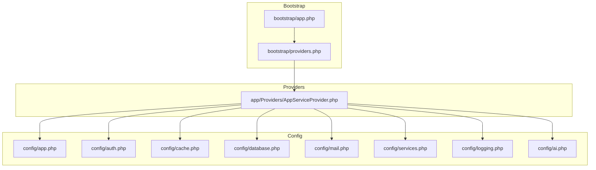
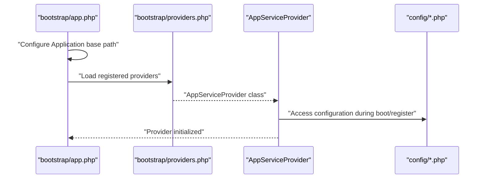
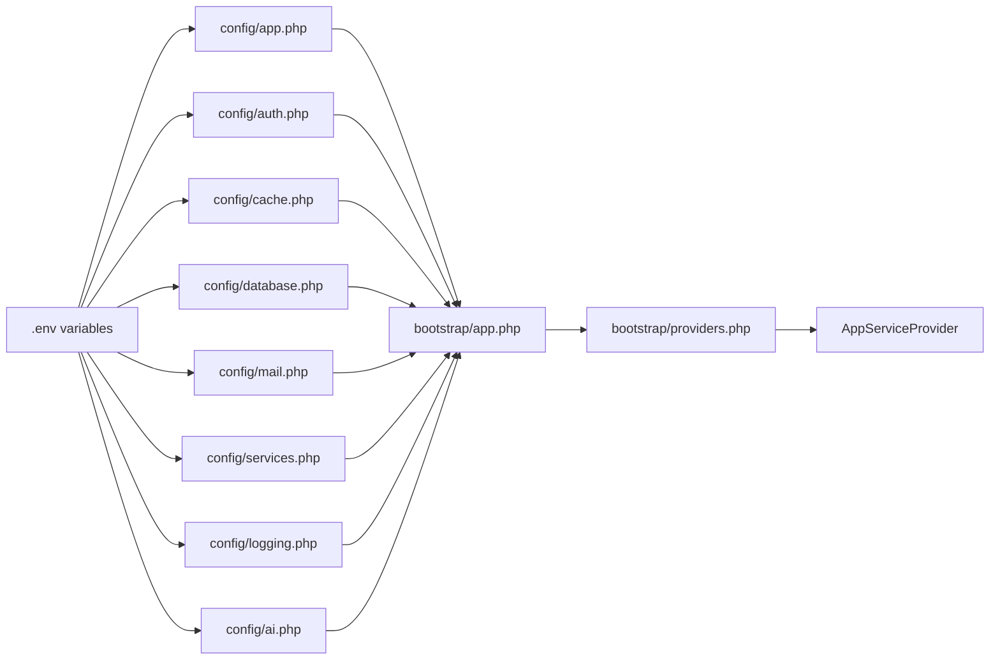

# Application Settings

<cite>
**Referenced Files in This Document**
- [config/app.php](file://config/app.php)
- [bootstrap/app.php](file://bootstrap/app.php)
- [bootstrap/providers.php](file://bootstrap/providers.php)
- [app/Providers/AppServiceProvider.php](file://app/Providers/AppServiceProvider.php)
- [config/auth.php](file://config/auth.php)
- [config/cache.php](file://config/cache.php)
- [config/database.php](file://config/database.php)
- [config/mail.php](file://config/mail.php)
- [config/services.php](file://config/services.php)
- [config/logging.php](file://config/logging.php)
- [config/ai.php](file://config/ai.php)
- [composer.json](file://composer.json)
- [.claude/skills/laravel-best-practices/rules/config.md](file://.claude/skills/laravel-best-practices/rules/config.md)
</cite>

## Table of Contents
1. [Introduction](#introduction)
2. [Project Structure](#project-structure)
3. [Core Components](#core-components)
4. [Architecture Overview](#architecture-overview)
5. [Detailed Component Analysis](#detailed-component-analysis)
6. [Dependency Analysis](#dependency-analysis)
7. [Performance Considerations](#performance-considerations)
8. [Troubleshooting Guide](#troubleshooting-guide)
9. [Conclusion](#conclusion)

## Introduction
This document explains Laravel Assistant’s core application settings that govern behavior across environments. It focuses on fundamental parameters such as application name, environment, debug mode, URL configuration, timezone, and locale management. It also covers encryption key configuration, maintenance mode drivers, security settings, authentication configuration, service provider registration, and application-wide settings. Practical examples illustrate development versus production setups, custom encryption keys, and locale-specific configurations. Security considerations for sensitive configuration values, environment variable management, and best practices for customization are included, along with troubleshooting guidance for common configuration issues.

## Project Structure
The application uses a standard Laravel layout with configuration files under config/, service providers registered in bootstrap/providers.php, and the Application instance configured in bootstrap/app.php. Authentication defaults and guards are defined in config/auth.php, while caching, database, mail, logging, and AI providers are configured in their respective config files.

**Diagram sources**
- [bootstrap/app.php:1-19](file://bootstrap/app.php#L1-L19)
- [bootstrap/providers.php:1-8](file://bootstrap/providers.php#L1-L8)
- [app/Providers/AppServiceProvider.php:1-25](file://app/Providers/AppServiceProvider.php#L1-L25)
- [config/app.php:1-127](file://config/app.php#L1-L127)
- [config/auth.php:1-118](file://config/auth.php#L1-L118)
- [config/cache.php:1-131](file://config/cache.php#L1-L131)
- [config/database.php:1-185](file://config/database.php#L1-L185)
- [config/mail.php:1-119](file://config/mail.php#L1-L119)
- [config/services.php:1-39](file://config/services.php#L1-L39)
- [config/logging.php:1-133](file://config/logging.php#L1-L133)
- [config/ai.php:1-132](file://config/ai.php#L1-L132)

**Section sources**
- [bootstrap/app.php:1-19](file://bootstrap/app.php#L1-L19)
- [bootstrap/providers.php:1-8](file://bootstrap/providers.php#L1-L8)
- [app/Providers/AppServiceProvider.php:1-25](file://app/Providers/AppServiceProvider.php#L1-L25)

## Core Components
This section documents the primary application settings and their roles.

- Application name, environment, debug mode, URL, timezone, and locale
  - Application name influences notifications and UI displays.
  - Environment affects service configuration and behavior.
  - Debug mode toggles detailed error reporting.
  - URL is used for CLI-generated URLs and route helpers.
  - Timezone sets default PHP date/time functions.
  - Locale and fallback/locale control translation/localization defaults.
- Encryption key and cipher
  - Cipher defines the encryption algorithm.
  - Key must be a 32-character random string for security.
  - previous_keys support key rotation.
- Maintenance mode driver
  - driver selects persistence mechanism ("file" or "cache").
  - store indicates the cache store used by the cache driver.

These settings are defined in config/app.php and are loaded during application bootstrap.

**Section sources**
- [config/app.php:15-124](file://config/app.php#L15-L124)

## Architecture Overview
The Application instance is configured in bootstrap/app.php, which wires routing, middleware, and exception handling. Service providers are registered via bootstrap/providers.php and can modify configuration during boot. The AppServiceProvider is the primary hook for registering and bootstrapping application services.

**Diagram sources**
- [bootstrap/app.php:7-18](file://bootstrap/app.php#L7-L18)
- [bootstrap/providers.php:5-7](file://bootstrap/providers.php#L5-L7)
- [app/Providers/AppServiceProvider.php:12-23](file://app/Providers/AppServiceProvider.php#L12-L23)

**Section sources**
- [bootstrap/app.php:7-18](file://bootstrap/app.php#L7-L18)
- [bootstrap/providers.php:5-7](file://bootstrap/providers.php#L5-L7)
- [app/Providers/AppServiceProvider.php:12-23](file://app/Providers/AppServiceProvider.php#L12-L23)

## Detailed Component Analysis

### Application Settings (config/app.php)
Key areas:
- Basic identity and environment: name, env, debug, url
- Localization: locale, fallback_locale, faker_locale
- Security: cipher, key, previous_keys
- Maintenance: maintenance.driver, maintenance.store

Behavioral impact:
- name and url influence CLI and route URL generation.
- debug toggles verbose error pages.
- timezone affects date/time functions.
- locale and fallback_locale determine default translations.
- cipher and key must be set securely; missing key causes encryption failures.
- maintenance driver controls how maintenance mode is persisted.

Security considerations:
- Ensure APP_KEY is set to a 32-character random string.
- Use previous_keys for safe key rotation.
- Avoid enabling debug in production.

Practical examples:
- Development vs production:
  - Set APP_ENV to local or production.
  - APP_DEBUG false in production; true in development.
  - APP_URL to the domain in production.
- Custom encryption keys:
  - Generate a new 32-character key and set APP_KEY.
  - Add old keys to APP_PREVIOUS_KEYS for backward compatibility.
- Locale-specific settings:
  - Set APP_LOCALE to desired BCP-47 tag (e.g., en, es, fr).
  - Configure APP_FALLBACK_LOCALE accordingly.

**Section sources**
- [config/app.php:15-124](file://config/app.php#L15-L124)

### Authentication Configuration (config/auth.php)
Highlights:
- defaults.guard and defaults.passwords select the default guard and password broker.
- guards.web uses session storage with the users provider.
- providers.users driver can be "eloquent" or "database"; model is configurable.
- passwords.users table, expire, and throttle settings control reset behavior.
- password_timeout controls password confirmation expiration.

Integration points:
- Guard drivers and providers are resolved at runtime.
- Password reset tokens table and expiry/throttle affect security posture.

Best practices:
- Keep default guard aligned with application needs (session for web).
- Configure provider.model to match the application User model.
- Adjust password reset expire/throttle to balance usability and security.

**Section sources**
- [config/auth.php:18-115](file://config/auth.php#L18-L115)

### Service Provider Registration
- bootstrap/providers.php lists AppServiceProvider for registration.
- AppServiceProvider contains empty register() and boot() hooks for customization.

Impact:
- Providers can bind services, publish configuration, and adjust behavior during application lifecycle.

**Section sources**
- [bootstrap/providers.php:5-7](file://bootstrap/providers.php#L5-L7)
- [app/Providers/AppServiceProvider.php:12-23](file://app/Providers/AppServiceProvider.php#L12-L23)

### Cache Configuration (config/cache.php)
Highlights:
- default store selection via CACHE_STORE.
- stores include array, database, file, memcached, redis, dynamodb, octane, failover, null.
- prefix derived from APP_NAME to avoid collisions.
- serializable_classes disabled by default to mitigate gadget chain risks.

Operational notes:
- Use database or redis stores for multi-instance deployments.
- Ensure proper credentials for external stores (e.g., redis, dynamodb).

**Section sources**
- [config/cache.php:18-129](file://config/cache.php#L18-L129)

### Database Configuration (config/database.php)
Highlights:
- default connection via DB_CONNECTION (sqlite by default).
- connections for sqlite, mysql, mariadb, pgsql, sqlsrv with environment-driven settings.
- redis client, options, and named connections (default, cache) with environment overrides.

Operational notes:
- For sqlite, DB_DATABASE points to the database file path.
- For mysql/mariadb, charset and collation are configurable.
- Redis options include cluster, prefix, persistent, and retry/backoff settings.

**Section sources**
- [config/database.php:20-182](file://config/database.php#L20-L182)

### Mail Configuration (config/mail.php)
Highlights:
- default mailer via MAIL_MAILER (log by default).
- mailers include smtp, ses, postmark, resend, sendmail, log, array, failover, roundrobin.
- from address/name controlled centrally.

Operational notes:
- SMTP host/port/credentials are environment-driven.
- MAIL_LOG_CHANNEL can direct logs to a specific channel.

**Section sources**
- [config/mail.php:17-116](file://config/mail.php#L17-L116)

### Logging Configuration (config/logging.php)
Highlights:
- default channel via LOG_CHANNEL (stack by default).
- channels include stack, single, daily, slack, papertrail, stderr, syslog, errorlog, null.
- deprecations channel and trace toggle.

Operational notes:
- Use daily for rotated logs; adjust days via LOG_DAILY_DAYS.
- Slack channel requires webhook URL; stderr for containerized environments.

**Section sources**
- [config/logging.php:21-130](file://config/logging.php#L21-L130)

### AI Providers Configuration (config/ai.php)
Highlights:
- default provider selections for text, images, audio, transcription, embeddings, reranking.
- caching.embeddings can enable cache with a store selection.
- providers include anthropic, azure, cohere, deepseek, eleven, gemini, groq, jina, mistral, ollama, openai, openrouter, voyageai, xai with environment-driven keys and URLs.

Operational notes:
- Set provider-specific environment variables for API access.
- Configure default providers per content type to streamline agent workflows.

**Section sources**
- [config/ai.php:16-129](file://config/ai.php#L16-L129)

### Composer Scripts and Environment Management (composer.json)
Highlights:
- scripts include setup, dev, test, and autoload/post-update hooks.
- post-create-project-cmd generates APP_KEY and runs migrations.

Operational notes:
- Use setup script to initialize a new environment.
- Ensure APP_KEY is generated and .env is populated before running migrations.

**Section sources**
- [composer.json:40-74](file://composer.json#L40-L74)

### Security and Environment Variable Best Practices
- Use encrypted environment files for production secrets.
- Prefer platform-native secret stores for cloud deployments.
- Avoid direct env() usage outside config files; read via config() after caching.
- Use App::environment() checks instead of env() comparisons.

**Section sources**
- [.claude/skills/laravel-best-practices/rules/config.md:3-54](file://.claude/skills/laravel-best-practices/rules/config.md#L3-L54)

## Dependency Analysis
The application’s configuration depends on environment variables and provider registration. The following diagram shows how core configuration files relate to each other and to the provider registration pipeline.

**Diagram sources**
- [config/app.php:15-124](file://config/app.php#L15-L124)
- [config/auth.php:18-115](file://config/auth.php#L18-L115)
- [config/cache.php:18-129](file://config/cache.php#L18-L129)
- [config/database.php:20-182](file://config/database.php#L20-L182)
- [config/mail.php:17-116](file://config/mail.php#L17-L116)
- [config/services.php:17-36](file://config/services.php#L17-L36)
- [config/logging.php:21-130](file://config/logging.php#L21-L130)
- [config/ai.php:16-129](file://config/ai.php#L16-L129)
- [bootstrap/app.php:7-18](file://bootstrap/app.php#L7-L18)
- [bootstrap/providers.php:5-7](file://bootstrap/providers.php#L5-L7)
- [app/Providers/AppServiceProvider.php:12-23](file://app/Providers/AppServiceProvider.php#L12-L23)

**Section sources**
- [bootstrap/app.php:7-18](file://bootstrap/app.php#L7-L18)
- [bootstrap/providers.php:5-7](file://bootstrap/providers.php#L5-L7)
- [app/Providers/AppServiceProvider.php:12-23](file://app/Providers/AppServiceProvider.php#L12-L23)

## Performance Considerations
- Use cache stores appropriate for deployment scale (database, redis, memcached).
- Tune cache prefix and store combinations to avoid collisions in shared environments.
- Select maintenance driver "cache" for multi-instance deployments to coordinate maintenance mode.
- Choose database connections optimized for workload characteristics (e.g., read replicas for reads).
- Enable logging channels suited to infrastructure (daily rotation, stderr for containers).

[No sources needed since this section provides general guidance]

## Troubleshooting Guide
Common issues and resolutions:
- Missing or invalid APP_KEY
  - Symptom: Encryption failures or inability to decrypt values.
  - Resolution: Generate a 32-character APP_KEY and clear/rebuild configuration cache.
- Debug mode in production
  - Symptom: Detailed error pages visible to users.
  - Resolution: Set APP_DEBUG=false and APP_ENV=production.
- Incorrect APP_URL
  - Symptom: Misgenerated URLs in CLI or redirects.
  - Resolution: Set APP_URL to the application root URL.
- Maintenance mode not respected
  - Symptom: Users still access the app during maintenance.
  - Resolution: Verify APP_MAINTENANCE_DRIVER and APP_MAINTENANCE_STORE; ensure cache connectivity if using "cache".
- Locale not applied
  - Symptom: Translations default to fallback or English.
  - Resolution: Set APP_LOCALE and APP_FALLBACK_LOCALE appropriately; ensure language files exist.
- Mail delivery issues
  - Symptom: Emails not sent or logged only.
  - Resolution: Configure MAIL_MAILER and associated credentials; verify MAIL_FROM settings.
- Logging not captured
  - Symptom: No logs or rotated logs not retained.
  - Resolution: Set LOG_CHANNEL and LOG_LEVEL; configure daily rotation and retention.

**Section sources**
- [config/app.php:42](file://config/app.php#L42)
- [config/app.php:55](file://config/app.php#L55)
- [config/app.php:121-124](file://config/app.php#L121-L124)
- [config/app.php:81](file://config/app.php#L81)
- [config/mail.php:17](file://config/mail.php#L17)
- [config/logging.php:21](file://config/logging.php#L21)

## Conclusion
Laravel Assistant’s application settings are centralized in config/app.php and complemented by specialized configuration files for authentication, caching, database, mail, logging, and AI providers. Proper environment variable management, secure encryption key handling, and thoughtful provider registration ensure reliable behavior across development and production. Following the best practices outlined here will improve security, maintainability, and operability of the application.