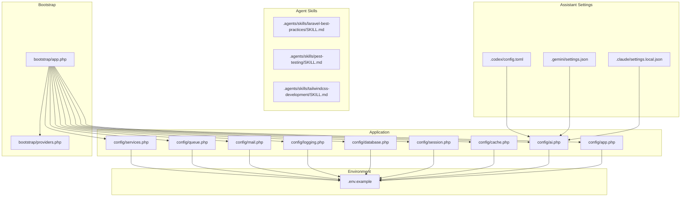
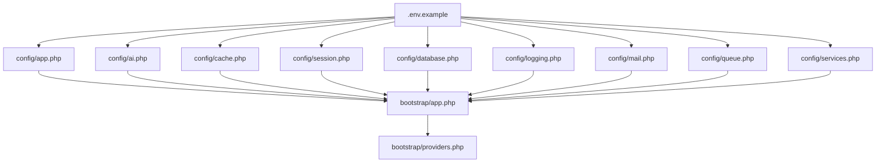
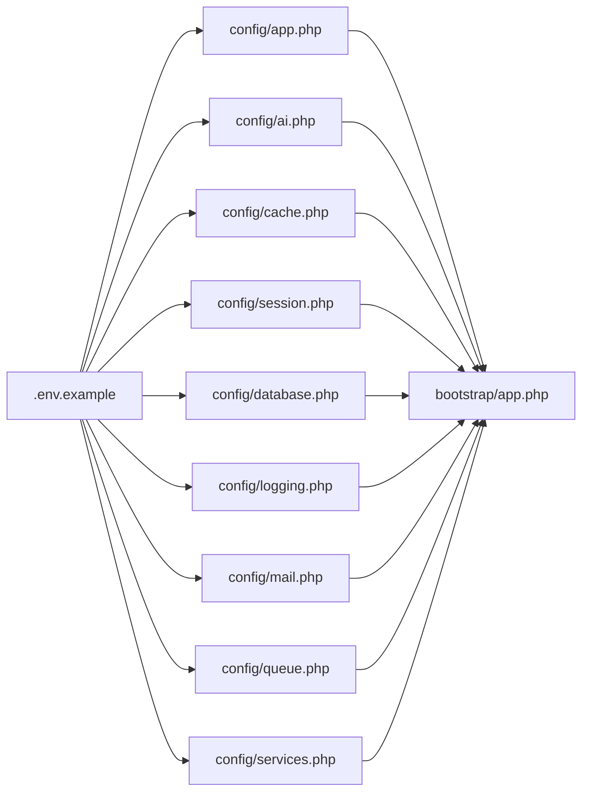

# Configuration and Customization

<cite>
**Referenced Files in This Document**
- [config/app.php](file://config/app.php)
- [config/ai.php](file://config/ai.php)
- [config/cache.php](file://config/cache.php)
- [config/session.php](file://config/session.php)
- [config/database.php](file://config/database.php)
- [config/services.php](file://config/services.php)
- [config/logging.php](file://config/logging.php)
- [config/mail.php](file://config/mail.php)
- [config/queue.php](file://config/queue.php)
- [.env.example](file://.env.example)
- [.agents/skills/laravel-best-practices/SKILL.md](file://.agents/skills/laravel-best-practices/SKILL.md)
- [.agents/skills/pest-testing/SKILL.md](file://.agents/skills/pest-testing/SKILL.md)
- [.agents/skills/tailwindcss-development/SKILL.md](file://.agents/skills/tailwindcss-development/SKILL.md)
- [bootstrap/app.php](file://bootstrap/app.php)
- [bootstrap/providers.php](file://bootstrap/providers.php)
- [AGENTS.md](file://AGENTS.md)
- [CLAUDE.md](file://CLAUDE.md)
- [GEMINI.md](file://GEMINI.md)
- [.claude/settings.local.json](file://.claude/settings.local.json)
- [.codex/config.toml](file://.codex/config.toml)
- [.gemini/settings.json](file://.gemini/settings.json)
- [composer.json](file://composer.json)
</cite>

## Table of Contents
1. [Introduction](#introduction)
2. [Project Structure](#project-structure)
3. [Core Components](#core-components)
4. [Architecture Overview](#architecture-overview)
5. [Detailed Component Analysis](#detailed-component-analysis)
6. [Dependency Analysis](#dependency-analysis)
7. [Performance Considerations](#performance-considerations)
8. [Troubleshooting Guide](#troubleshooting-guide)
9. [Conclusion](#conclusion)
10. [Appendices](#appendices)

## Introduction
This document explains how to configure and customize Laravel Assistant across environment-based settings, application behavior, cache and session backends, database connectivity, AI service providers, and agent/skill development workflows. It consolidates configuration options from Laravel’s standard configuration files, environment variables, and assistant-specific directories (.claude, .gemini, .codex). Practical examples illustrate common scenarios, production deployment settings, and extension points for custom providers, skills, and development workflows. Security, performance tuning, and monitoring are addressed alongside troubleshooting guidance.

## Project Structure
Laravel Assistant follows a standard Laravel layout with dedicated configuration files and assistant-specific directories. Key areas:
- Standard Laravel configuration under config/ for app, cache, session, database, logging, mail, queue, services, and AI.
- Environment variables in .env.example for local development and production parity.
- Agent skills under .agents/skills/ with Markdown-based skill definitions.
- Assistant provider settings under .claude/, .gemini/, and .codex/.

**Diagram sources**
- [config/app.php:1-127](file://config/app.php#L1-L127)
- [config/ai.php:1-132](file://config/ai.php#L1-L132)
- [config/cache.php:1-131](file://config/cache.php#L1-L131)
- [config/session.php:1-234](file://config/session.php#L1-L234)
- [config/database.php:1-185](file://config/database.php#L1-L185)
- [config/logging.php:1-133](file://config/logging.php#L1-L133)
- [config/mail.php:1-119](file://config/mail.php#L1-L119)
- [config/queue.php:1-130](file://config/queue.php#L1-L130)
- [config/services.php:1-39](file://config/services.php#L1-L39)
- [.env.example:1-66](file://.env.example#L1-L66)
- [.claude/settings.local.json](file://.claude/settings.local.json)
- [.gemini/settings.json](file://.gemini/settings.json)
- [.codex/config.toml](file://.codex/config.toml)
- [.agents/skills/laravel-best-practices/SKILL.md:1-190](file://.agents/skills/laravel-best-practices/SKILL.md#L1-L190)
- [.agents/skills/pest-testing/SKILL.md:1-157](file://.agents/skills/pest-testing/SKILL.md#L1-L157)
- [.agents/skills/tailwindcss-development/SKILL.md:1-119](file://.agents/skills/tailwindcss-development/SKILL.md#L1-L119)
- [bootstrap/app.php:1-19](file://bootstrap/app.php#L1-L19)
- [bootstrap/providers.php:1-8](file://bootstrap/providers.php#L1-L8)

**Section sources**
- [config/app.php:1-127](file://config/app.php#L1-L127)
- [config/ai.php:1-132](file://config/ai.php#L1-L132)
- [config/cache.php:1-131](file://config/cache.php#L1-L131)
- [config/session.php:1-234](file://config/session.php#L1-L234)
- [config/database.php:1-185](file://config/database.php#L1-L185)
- [config/logging.php:1-133](file://config/logging.php#L1-L133)
- [config/mail.php:1-119](file://config/mail.php#L1-L119)
- [config/queue.php:1-130](file://config/queue.php#L1-L130)
- [config/services.php:1-39](file://config/services.php#L1-L39)
- [.env.example:1-66](file://.env.example#L1-L66)
- [.agents/skills/laravel-best-practices/SKILL.md:1-190](file://.agents/skills/laravel-best-practices/SKILL.md#L1-L190)
- [.agents/skills/pest-testing/SKILL.md:1-157](file://.agents/skills/pest-testing/SKILL.md#L1-L157)
- [.agents/skills/tailwindcss-development/SKILL.md:1-119](file://.agents/skills/tailwindcss-development/SKILL.md#L1-L119)
- [bootstrap/app.php:1-19](file://bootstrap/app.php#L1-L19)
- [bootstrap/providers.php:1-8](file://bootstrap/providers.php#L1-L8)

## Core Components
- Application identity, environment, debug mode, URL, timezone, locales, encryption key, and maintenance driver are defined centrally and influenced by environment variables.
- AI configuration centralizes provider selection and credentials, enabling multi-provider orchestration by default category (text, images, audio, embeddings, reranking).
- Cache and session backends are configurable with environment-driven stores and connection details.
- Database connections support SQLite, MySQL/MariaDB, PostgreSQL, and SQL Server, with Redis options and SSL/TLS settings.
- Logging, mail, and queue systems are environment-aware with multiple channels/transports and failover strategies.
- Assistant skills define specialized capabilities for Laravel best practices, Pest testing, and Tailwind CSS development.

**Section sources**
- [config/app.php:16-124](file://config/app.php#L16-L124)
- [config/ai.php:16-129](file://config/ai.php#L16-L129)
- [config/cache.php:18-115](file://config/cache.php#L18-L115)
- [config/session.php:21-232](file://config/session.php#L21-L232)
- [config/database.php:20-182](file://config/database.php#L20-L182)
- [config/logging.php:21-130](file://config/logging.php#L21-L130)
- [config/mail.php:17-116](file://config/mail.php#L17-L116)
- [config/queue.php:16-127](file://config/queue.php#L16-L127)
- [.agents/skills/laravel-best-practices/SKILL.md:1-190](file://.agents/skills/laravel-best-practices/SKILL.md#L1-L190)
- [.agents/skills/pest-testing/SKILL.md:1-157](file://.agents/skills/pest-testing/SKILL.md#L1-L157)
- [.agents/skills/tailwindcss-development/SKILL.md:1-119](file://.agents/skills/tailwindcss-development/SKILL.md#L1-L119)

## Architecture Overview
The configuration system is layered:
- Environment variables drive defaults across Laravel’s config files.
- AI configuration selects providers and categories, with optional caching for embeddings.
- Cache and session backends integrate with database, Redis, Memcached, DynamoDB, and Octane.
- Database configuration supports multiple drivers and Redis-backed options.
- Logging, mail, and queue backends are environment-aware with failover and rotation strategies.
- Bootstrap wiring ties routing, middleware, and exception handling to the application lifecycle.

**Diagram sources**
- [.env.example:1-66](file://.env.example#L1-L66)
- [config/app.php:1-127](file://config/app.php#L1-L127)
- [config/ai.php:1-132](file://config/ai.php#L1-L132)
- [config/cache.php:1-131](file://config/cache.php#L1-L131)
- [config/session.php:1-234](file://config/session.php#L1-L234)
- [config/database.php:1-185](file://config/database.php#L1-L185)
- [config/logging.php:1-133](file://config/logging.php#L1-L133)
- [config/mail.php:1-119](file://config/mail.php#L1-L119)
- [config/queue.php:1-130](file://config/queue.php#L1-L130)
- [config/services.php:1-39](file://config/services.php#L1-L39)
- [bootstrap/app.php:1-19](file://bootstrap/app.php#L1-L19)
- [bootstrap/providers.php:1-8](file://bootstrap/providers.php#L1-L8)

## Detailed Component Analysis

### Environment-Based Configuration System
- Centralized via .env.example and Laravel’s env() helpers in config files.
- Typical categories: application identity, environment, debug, URL, timezone, locales, encryption key, maintenance driver/store.
- Environment variables enable safe separation of secrets and environment-specific behavior.

Practical example scenarios:
- Local development: APP_ENV=local, APP_DEBUG=true, CACHE_STORE=file, SESSION_DRIVER=file.
- Staging/Production: APP_ENV=production, APP_DEBUG=false, CACHE_STORE=database or redis, SESSION_DRIVER=database or redis.

**Section sources**
- [.env.example:1-66](file://.env.example#L1-L66)
- [config/app.php:16-124](file://config/app.php#L16-L124)

### Application Settings
- Identity and environment: name, env, debug, url.
- Localization: locale, fallback_locale, faker_locale.
- Security: cipher, key, previous_keys.
- Maintenance: driver and store selection.

Customization tips:
- Set APP_KEY during deployment and rotate keys using APP_PREVIOUS_KEYS.
- Choose maintenance driver=file for single-node or cache for multi-node deployments.

**Section sources**
- [config/app.php:16-124](file://config/app.php#L16-L124)

### Cache Configuration
- Default store and individual stores: array, database, file, memcached, redis, dynamodb, octane, failover, null.
- Database store supports custom connection, table, lock connection, and lock table.
- Redis store supports connection and lock connection.
- Key prefix derived from APP_NAME to avoid collisions.
- Serializable classes disabled by default for security.

Performance and security:
- Use database or redis for production.
- Enable CACHE_PREFIX to isolate environments.
- Avoid enabling serializable_classes unless absolutely necessary.

**Section sources**
- [config/cache.php:18-115](file://config/cache.php#L18-L115)

### Session Configuration
- Driver selection: file, cookie, database, memcached, redis, dynamodb, array.
- Lifetime and expiration on close.
- Encryption toggle.
- Database table and connection.
- Cookie name, path, domain, secure, http_only, same_site, partitioned.
- Serialization strategy.

Security and compliance:
- Set SESSION_SECURE_COOKIE=true behind HTTPS.
- Use SESSION_SAME_SITE=lax or strict depending on deployment.
- Use database or redis for distributed sessions.

**Section sources**
- [config/session.php:21-232](file://config/session.php#L21-L232)

### Database Connection Setup
- Default connection: sqlite by default; override with DB_CONNECTION.
- Supported drivers: sqlite, mysql, mariadb, pgsql, sqlsrv.
- SSL/TLS options for MySQL/MariaDB via PDO attributes.
- Redis client, cluster prefix, persistent connections, retry/backoff settings.

Operational guidance:
- Use sqlite for development; migrate to mysql/mariadb/pgsql/sqlsrv for production.
- Configure SSL CA for MySQL/MariaDB when required.
- Separate Redis databases for default and cache if using Redis-backed stores.

**Section sources**
- [config/database.php:20-182](file://config/database.php#L20-L182)

### Logging Configuration
- Default channel and deprecation channel.
- Channels: stack, single, daily, slack, papertrail, stderr, syslog, errorlog, null, emergency.
- Slack/Papertrail/Stderr processors and formatting.

Monitoring and alerting:
- Use slack channel for critical alerts.
- Daily rotation with configurable retention.
- Stack multiple channels for centralized logging.

**Section sources**
- [config/logging.php:21-130](file://config/logging.php#L21-L130)

### Mail Configuration
- Default mailer and mailers: smtp, ses, postmark, resend, sendmail, log, array, failover, roundrobin.
- Global From address/name.
- URL/host/port/username/password/env overrides.

Reliability:
- Use failover or roundrobin for high availability.
- Log mailer for development/testing.

**Section sources**
- [config/mail.php:17-116](file://config/mail.php#L17-L116)

### Queue Configuration
- Default connection: database by default; others include sync, beanstalkd, sqs, redis, deferred, background, failover.
- Retry behavior and batching configuration.
- Failed jobs storage driver and table.

Scalability:
- Use redis or sqs for high throughput.
- Configure retry_after and block_for appropriately.

**Section sources**
- [config/queue.php:16-127](file://config/queue.php#L16-L127)

### AI Service Configuration and Multi-Provider Management
- Default provider selection by task category: default, default_for_images, default_for_audio, default_for_transcription, default_for_embeddings, default_for_reranking.
- Provider registry includes anthropic, azure, cohere, deepseek, eleven, gemini, groq, jina, mistral, ollama, openai, openrouter, voyageai, xai.
- Each provider defines driver and key; Azure adds url, api_version, deployment, embedding_deployment; Ollama adds url and optional key.

Embeddings caching:
- Embeddings caching can be enabled/disabled and routed to a cache store.

Multi-provider orchestration:
- Select provider per operation by name.
- Use default categories to route common tasks automatically.

**Section sources**
- [config/ai.php:16-129](file://config/ai.php#L16-L129)

### Agent Skills and Development Workflows
- Laravel Best Practices skill: comprehensive guidance for database performance, security, caching, Eloquent, validation, testing, queues, routing, HTTP client, events/notifications/mail, error handling, scheduling, architecture, migrations, collections, Blade/views, and conventions/style.
- Pest Testing skill: Pest 4 usage, datasets, browser testing, smoke testing, visual regression, sharding, architecture testing.
- Tailwind CSS Development skill: Tailwind v4 usage, CSS-first configuration, import syntax, replaced utilities, spacing, dark mode, common patterns.

Customization:
- Extend skills by adding new Markdown-based skills under .agents/skills/.
- Use skill metadata and rules to guide agent behavior.

**Section sources**
- [.agents/skills/laravel-best-practices/SKILL.md:1-190](file://.agents/skills/laravel-best-practices/SKILL.md#L1-L190)
- [.agents/skills/pest-testing/SKILL.md:1-157](file://.agents/skills/pest-testing/SKILL.md#L1-L157)
- [.agents/skills/tailwindcss-development/SKILL.md:1-119](file://.agents/skills/tailwindcss-development/SKILL.md#L1-L119)

### Bootstrap and Provider Registration
- Application bootstrap wires routing, middleware, and exception handling.
- Provider registration lists application service providers.

Extensibility:
- Add custom AppServiceProvider entries in bootstrap/providers.php.
- Register additional service providers for custom AI drivers or integrations.

**Section sources**
- [bootstrap/app.php:1-19](file://bootstrap/app.php#L1-L19)
- [bootstrap/providers.php:1-8](file://bootstrap/providers.php#L1-L8)

### Assistant Provider Settings
- Claude: local settings under .claude/settings.local.json.
- Gemini: settings under .gemini/settings.json.
- Codex: configuration under .codex/config.toml.

These files complement config/ai.php by providing provider-specific runtime settings and local overrides.

**Section sources**
- [.claude/settings.local.json](file://.claude/settings.local.json)
- [.gemini/settings.json](file://.gemini/settings.json)
- [.codex/config.toml](file://.codex/config.toml)

### Composer Dependencies
- composer.json enumerates project dependencies and autoload configuration.

Ensure all AI-related packages and assistant extensions are declared here for proper autoloading and installation.

**Section sources**
- [composer.json](file://composer.json)

## Dependency Analysis
Configuration dependencies across components:
- Environment variables feed into Laravel config files and AI provider settings.
- Cache and session backends depend on database or Redis configuration.
- Logging and mail rely on environment variables for channel selection and credentials.
- Queue backends depend on database or Redis configuration.
- Bootstrap integrates routing and providers with configuration.

**Diagram sources**
- [.env.example:1-66](file://.env.example#L1-L66)
- [config/app.php:1-127](file://config/app.php#L1-L127)
- [config/ai.php:1-132](file://config/ai.php#L1-L132)
- [config/cache.php:1-131](file://config/cache.php#L1-L131)
- [config/session.php:1-234](file://config/session.php#L1-L234)
- [config/database.php:1-185](file://config/database.php#L1-L185)
- [config/logging.php:1-133](file://config/logging.php#L1-L133)
- [config/mail.php:1-119](file://config/mail.php#L1-L119)
- [config/queue.php:1-130](file://config/queue.php#L1-L130)
- [config/services.php:1-39](file://config/services.php#L1-L39)
- [bootstrap/app.php:1-19](file://bootstrap/app.php#L1-L19)

**Section sources**
- [.env.example:1-66](file://.env.example#L1-L66)
- [config/app.php:1-127](file://config/app.php#L1-L127)
- [config/ai.php:1-132](file://config/ai.php#L1-L132)
- [config/cache.php:1-131](file://config/cache.php#L1-L131)
- [config/session.php:1-234](file://config/session.php#L1-L234)
- [config/database.php:1-185](file://config/database.php#L1-L185)
- [config/logging.php:1-133](file://config/logging.php#L1-L133)
- [config/mail.php:1-119](file://config/mail.php#L1-L119)
- [config/queue.php:1-130](file://config/queue.php#L1-L130)
- [config/services.php:1-39](file://config/services.php#L1-L39)
- [bootstrap/app.php:1-19](file://bootstrap/app.php#L1-L19)

## Performance Considerations
- Cache and session backends:
  - Use database or redis for production; enable CACHE_PREFIX and appropriate TTLs.
  - Tune session lifetime and encryption based on performance and security needs.
- Database:
  - Prefer mysql/mariadb/pgsql/sqlsrv in production; configure SSL/TLS and connection pooling.
  - Use Redis for cache and session when applicable.
- Logging:
  - Use daily rotation and stack channels to balance verbosity and disk usage.
- Mail and Queue:
  - Use failover/roundrobin for resilience; tune retry_after and block_for.
- AI:
  - Enable embeddings caching for frequently accessed vectors.
  - Select providers with low latency and adequate quotas for production.

[No sources needed since this section provides general guidance]

## Troubleshooting Guide
Common configuration issues and resolutions:
- Missing APP_KEY or invalid key rotation:
  - Ensure APP_KEY is set and use APP_PREVIOUS_KEYS for seamless rotation.
- Cache/store misconfiguration:
  - Verify CACHE_STORE and associated connection/table settings; confirm CACHE_PREFIX uniqueness.
- Session driver mismatch:
  - Align SESSION_DRIVER with infrastructure; use database or redis for distributed deployments.
- Database connectivity:
  - Confirm DB_CONNECTION and driver-specific credentials; enable SSL CA when required.
- Logging channels:
  - Validate LOG_CHANNEL and channel-specific settings; use stack for centralized logging.
- Mail delivery failures:
  - Check MAIL_MAILER and credentials; enable failover transport.
- Queue backends:
  - Verify QUEUE_CONNECTION and retry_after; ensure database or Redis availability.
- AI provider credentials:
  - Confirm provider keys and URLs; validate default provider selections per category.
- Environment parity:
  - Keep .env.example up to date and review environment variables across stages.

**Section sources**
- [config/app.php:16-124](file://config/app.php#L16-L124)
- [config/cache.php:18-115](file://config/cache.php#L18-L115)
- [config/session.php:21-232](file://config/session.php#L21-L232)
- [config/database.php:20-182](file://config/database.php#L20-L182)
- [config/logging.php:21-130](file://config/logging.php#L21-L130)
- [config/mail.php:17-116](file://config/mail.php#L17-L116)
- [config/queue.php:16-127](file://config/queue.php#L16-L127)
- [config/ai.php:16-129](file://config/ai.php#L16-L129)
- [.env.example:1-66](file://.env.example#L1-L66)

## Conclusion
Laravel Assistant’s configuration system leverages environment variables and Laravel’s standard configuration files to deliver flexible, secure, and scalable setups. By aligning environment variables with cache/session/database/logging/mail/queue/AI settings, teams can tailor behavior per environment, optimize performance, and maintain robust monitoring. Extending the system involves adding custom providers, skills, and service providers, guided by the documented configuration options and assistant-specific directories.

[No sources needed since this section summarizes without analyzing specific files]

## Appendices

### Practical Configuration Scenarios
- Local development:
  - APP_ENV=local, APP_DEBUG=true, CACHE_STORE=file, SESSION_DRIVER=file, DB_CONNECTION=sqlite.
- Staging:
  - APP_ENV=staging, APP_DEBUG=false, CACHE_STORE=database, SESSION_DRIVER=database, DB_CONNECTION=mysql.
- Production:
  - APP_ENV=production, APP_DEBUG=false, CACHE_STORE=redis, SESSION_DRIVER=redis, DB_CONNECTION=mysql, LOG_CHANNEL=daily, MAIL_MAILER=ses, QUEUE_CONNECTION=redis.

**Section sources**
- [.env.example:1-66](file://.env.example#L1-L66)
- [config/cache.php:18-115](file://config/cache.php#L18-L115)
- [config/session.php:21-232](file://config/session.php#L21-L232)
- [config/database.php:20-182](file://config/database.php#L20-L182)
- [config/logging.php:21-130](file://config/logging.php#L21-L130)
- [config/mail.php:17-116](file://config/mail.php#L17-L116)
- [config/queue.php:16-127](file://config/queue.php#L16-L127)

### Security Configuration Checklist
- Set APP_KEY and rotate using APP_PREVIOUS_KEYS.
- Use HTTPS-only cookies and http_only for sessions.
- Configure same_site and partitioned cookies as appropriate.
- Disable serializable_classes unless required.
- Use failover transports for mail and queue.
- Restrict log levels and channels in production.

**Section sources**
- [config/app.php:16-124](file://config/app.php#L16-L124)
- [config/session.php:172-215](file://config/session.php#L172-L215)
- [config/mail.php:82-98](file://config/mail.php#L82-L98)
- [config/queue.php:84-90](file://config/queue.php#L84-L90)
- [config/logging.php:21-130](file://config/logging.php#L21-L130)

### Monitoring Setup
- Use daily log rotation and critical-level Slack alerts.
- Integrate Papertrail for remote log aggregation.
- Monitor queue backends and failed job storage.

**Section sources**
- [config/logging.php:68-95](file://config/logging.php#L68-L95)
- [config/queue.php:123-127](file://config/queue.php#L123-L127)

### Extending the System
- Custom AI providers:
  - Add a new provider entry in config/ai.php with driver and key; optionally set url/api_version/deployment for cloud providers.
- Additional agent skills:
  - Create a new Markdown skill under .agents/skills/<name>/SKILL.md with metadata and rules.
- Modified development workflows:
  - Adjust bootstrap/app.php routing and middleware; register additional providers in bootstrap/providers.php.

**Section sources**
- [config/ai.php:52-129](file://config/ai.php#L52-L129)
- [.agents/skills/laravel-best-practices/SKILL.md:1-190](file://.agents/skills/laravel-best-practices/SKILL.md#L1-L190)
- [bootstrap/app.php:1-19](file://bootstrap/app.php#L1-L19)
- [bootstrap/providers.php:1-8](file://bootstrap/providers.php#L1-L8)