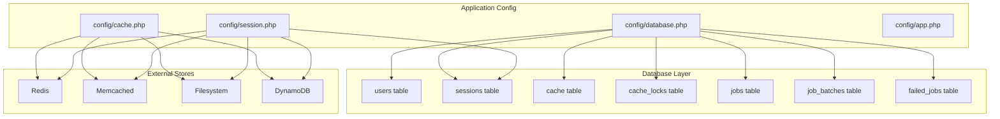
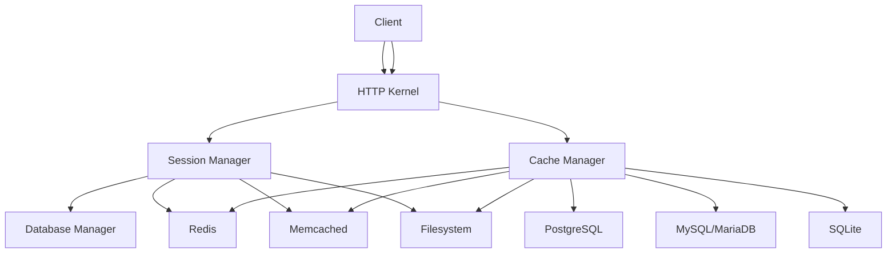
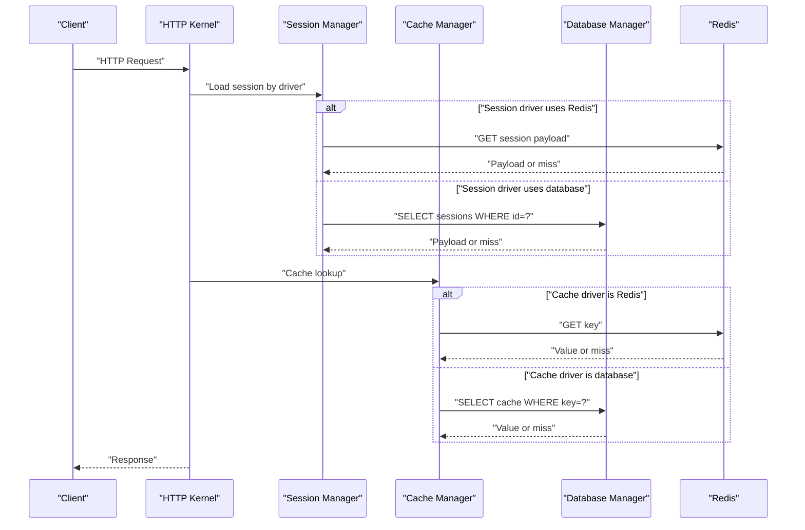
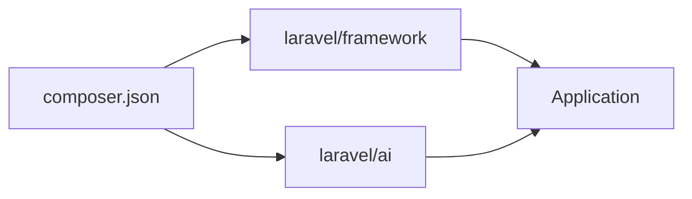

# Database, Cache, and Session Configuration

<cite>
**Referenced Files in This Document**
- [config/database.php](file://config/database.php)
- [config/cache.php](file://config/cache.php)
- [config/session.php](file://config/session.php)
- [config/app.php](file://config/app.php)
- [database/migrations/0001_01_01_000000_create_users_table.php](file://database/migrations/0001_01_01_000000_create_users_table.php)
- [database/migrations/0001_01_01_000001_create_cache_table.php](file://database/migrations/0001_01_01_000001_create_cache_table.php)
- [database/migrations/0001_01_01_000002_create_jobs_table.php](file://database/migrations/0001_01_01_000002_create_jobs_table.php)
- [composer.json](file://composer.json)
- [.agents/skills/laravel-best-practices/rules/config.md](file://.agents/skills/laravel-best-practices/rules/config.md)
- [.agents/skills/laravel-best-practices/rules/caching.md](file://.agents/skills/laravel-best-practices/rules/caching.md)
- [.agents/skills/laravel-best-practices/rules/db-performance.md](file://.agents/skills/laravel-best-practices/rules/db-performance.md)
</cite>

## Table of Contents
1. [Introduction](#introduction)
2. [Project Structure](#project-structure)
3. [Core Components](#core-components)
4. [Architecture Overview](#architecture-overview)
5. [Detailed Component Analysis](#detailed-component-analysis)
6. [Dependency Analysis](#dependency-analysis)
7. [Performance Considerations](#performance-considerations)
8. [Troubleshooting Guide](#troubleshooting-guide)
9. [Conclusion](#conclusion)

## Introduction
This document explains how Database, Cache, and Session are configured and operate in the Laravel Assistant application. It focuses on:
- Database connection configuration, multi-database setups, and Redis-backed database features
- Cache store configuration (Redis, Memcached, file, database, DynamoDB, Octane, failover)
- Session management settings, cookie configuration, and session driver options
- Practical examples for different backends, performance tuning, and failover strategies
- Impact on performance, consistency, and user experience, plus troubleshooting guidance

## Project Structure
The configuration for persistence and state management lives primarily in three config files:
- Database: config/database.php
- Cache: config/cache.php
- Session: config/session.php

Supporting database schema is defined in migrations under database/migrations/, including:
- Users and sessions tables
- Cache and cache_locks tables
- Jobs, job_batches, and failed_jobs tables

**Diagram sources**
- [config/database.php](file://config/database.php)
- [config/cache.php](file://config/cache.php)
- [config/session.php](file://config/session.php)
- [database/migrations/0001_01_01_000000_create_users_table.php](file://database/migrations/0001_01_01_000000_create_users_table.php)
- [database/migrations/0001_01_01_000001_create_cache_table.php](file://database/migrations/0001_01_01_000001_create_cache_table.php)
- [database/migrations/0001_01_01_000002_create_jobs_table.php](file://database/migrations/0001_01_01_000002_create_jobs_table.php)

**Section sources**
- [config/database.php](file://config/database.php)
- [config/cache.php](file://config/cache.php)
- [config/session.php](file://config/session.php)
- [database/migrations/0001_01_01_000000_create_users_table.php](file://database/migrations/0001_01_01_000000_create_users_table.php)
- [database/migrations/0001_01_01_000001_create_cache_table.php](file://database/migrations/0001_01_01_000001_create_cache_table.php)
- [database/migrations/0001_01_01_000002_create_jobs_table.php](file://database/migrations/0001_01_01_000002_create_jobs_table.php)

## Core Components
- Database connections: sqlite, mysql, mariadb, pgsql, sqlsrv; Redis client and cluster options; migration repository table
- Cache stores: array, database, file, memcached, redis, dynamodb, octane, failover; key prefix; serializable classes policy
- Sessions: driver selection, lifetime, encryption, file location, database/redis table/connection, cookie policy, sweeping lottery, serialization

Key defaults and environment-driven values are defined in the respective config files. The application’s maintenance mode integrates with a cache store.

**Section sources**
- [config/database.php](file://config/database.php)
- [config/cache.php](file://config/cache.php)
- [config/session.php](file://config/session.php)
- [config/app.php](file://config/app.php)

## Architecture Overview
The persistence and state subsystems are layered as follows:
- Database layer: relational tables for users, sessions, cache, jobs, and migrations
- Cache layer: pluggable stores backed by Redis, Memcached, DynamoDB, or local filesystem
- Session layer: driver-backed sessions persisted to database, Redis, Memcached, DynamoDB, or files; cookie policy enforced by the framework

**Diagram sources**
- [config/session.php](file://config/session.php)
- [config/cache.php](file://config/cache.php)
- [config/database.php](file://config/database.php)

## Detailed Component Analysis

### Database Configuration
- Default connection name is environment-driven and defaults to sqlite
- Supported drivers include sqlite, mysql, mariadb, pgsql, sqlsrv
- SSL/TLS options for MySQL/MariaDB via PDO attributes
- Migration repository table name and publish behavior
- Redis client configuration for database-related features:
  - Client type, cluster mode, key prefix, persistent connections
  - Separate default and cache Redis endpoints with retry/backoff policies

Operational notes:
- SQLite is enabled by default for quick local development
- For production, choose mysql/mariadb or pgsql/sqlsrv depending on infrastructure
- Redis options enable high availability patterns and retries for database-backed stores

**Section sources**
- [config/database.php](file://config/database.php)

### Cache Store Configuration
- Default store is environment-driven and set to database
- Available stores: array, database, file, memcached, redis, dynamodb, octane, failover
- Database store supports separate connection/table and optional lock connection/table
- File store path and lock path are configurable
- Memcached store supports SASL credentials, servers list, and options
- Redis store supports connection selection and lock connection
- DynamoDB store supports AWS credentials, region, table, and endpoint
- Octane store integrates with Laravel Octane for in-memory caching
- Failover store enables automatic fallback between primary and secondary stores

Key environment variables:
- CACHE_STORE selects the default cache backend
- DB_CACHE_CONNECTION, DB_CACHE_TABLE, DB_CACHE_LOCK_CONNECTION, DB_CACHE_LOCK_TABLE for database-backed cache
- REDIS_CACHE_CONNECTION, REDIS_CACHE_LOCK_CONNECTION for Redis-backed cache
- MEMCACHED_* for Memcached connectivity
- AWS_* for DynamoDB
- CACHE_PREFIX for cache key prefixing

**Section sources**
- [config/cache.php](file://config/cache.php)

### Session Management
- Default driver is environment-driven and set to database
- Lifetime in minutes and expiration-on-close behavior
- Optional encryption of session data
- File driver path configuration
- Database driver connection and table name
- Cache-backed session store selection
- Sweeping lottery for garbage collection
- Cookie policy: name, path, domain, secure, http-only, same-site, partitioned
- Serialization strategy

Environment variables:
- SESSION_DRIVER, SESSION_LIFETIME, SESSION_EXPIRE_ON_CLOSE
- SESSION_ENCRYPT
- SESSION_CONNECTION, SESSION_TABLE
- SESSION_STORE
- SESSION_COOKIE, SESSION_PATH, SESSION_DOMAIN
- SESSION_SECURE_COOKIE, SESSION_HTTP_ONLY, SESSION_SAME_SITE, SESSION_PARTITIONED_COOKIE

**Section sources**
- [config/session.php](file://config/session.php)

### Supporting Schemas
- Users and sessions tables are created by migrations
- Cache and cache_locks tables support database-backed cache
- Jobs, job_batches, and failed_jobs tables support queue persistence

These tables underpin database and cache stores and inform operational decisions around indexing and maintenance.

**Section sources**
- [database/migrations/0001_01_01_000000_create_users_table.php](file://database/migrations/0001_01_01_000000_create_users_table.php)
- [database/migrations/0001_01_01_000001_create_cache_table.php](file://database/migrations/0001_01_01_000001_create_cache_table.php)
- [database/migrations/0001_01_01_000002_create_jobs_table.php](file://database/migrations/0001_01_01_000002_create_jobs_table.php)

### Practical Configuration Examples

- Database backends
  - SQLite: default for local development; minimal setup
  - MySQL/MariaDB: enable strict mode and charset/collation; configure SSL CA when applicable
  - PostgreSQL: configure sslmode and schema search path
  - SQL Server: adjust charset and driver-specific options

- Cache performance
  - Prefer Redis for high-throughput scenarios; configure max retries and backoff
  - Use Memcached for low-latency caching; tune connect timeouts and server weights
  - Use database-backed cache for simplicity; ensure dedicated cache and cache_locks tables
  - Use DynamoDB for managed NoSQL caching; configure region and table
  - Enable failover cache stores to improve resilience

- Session clustering
  - Use Redis or Memcached for distributed sessions
  - Configure database sessions with proper indexing on last_activity
  - Align cookie SameSite and Secure flags with deployment environment

- Environment and maintenance
  - Use encrypted environment variables for secrets
  - Configure maintenance mode to use a cache store for multi-instance deployments

**Section sources**
- [config/database.php](file://config/database.php)
- [config/cache.php](file://config/cache.php)
- [config/session.php](file://config/session.php)
- [config/app.php](file://config/app.php)
- [.agents/skills/laravel-best-practices/rules/config.md](file://.agents/skills/laravel-best-practices/rules/config.md)
- [.agents/skills/laravel-best-practices/rules/caching.md](file://.agents/skills/laravel-best-practices/rules/caching.md)

### Database, Cache, and Session Interactions

**Diagram sources**
- [config/session.php](file://config/session.php)
- [config/cache.php](file://config/cache.php)
- [config/database.php](file://config/database.php)

## Dependency Analysis
- The application depends on Laravel Framework and Laravel AI for assistant features
- Composer scripts automate setup, including migration execution and asset building
- Database, cache, and session configurations are environment-driven and support multiple backends

**Diagram sources**
- [composer.json](file://composer.json)

**Section sources**
- [composer.json](file://composer.json)

## Performance Considerations
- Database
  - Use appropriate drivers and connection parameters for workload
  - Apply indexing strategies and avoid N+1 queries; leverage eager loading and chunking
  - Consider read replicas and connection pooling at the DBMS level

- Cache
  - Choose Redis or Memcached for high throughput; configure retry/backoff and prefixes
  - Use cache tagging (where supported) to invalidate groups efficiently
  - Employ flexible and memoization patterns to reduce redundant work

- Sessions
  - Use Redis or Memcached for horizontal scaling
  - Tune cookie SameSite and Secure flags for modern browsers and HTTPS deployments
  - Adjust session lifetime and sweeping lottery to balance memory and cleanup overhead

- Maintenance and Resilience
  - Use failover cache stores to maintain availability during partial outages
  - Encrypt environment variables and secrets; avoid committing sensitive data

**Section sources**
- [.agents/skills/laravel-best-practices/rules/db-performance.md](file://.agents/skills/laravel-best-practices/rules/db-performance.md)
- [.agents/skills/laravel-best-practices/rules/caching.md](file://.agents/skills/laravel-best-practices/rules/caching.md)
- [.agents/skills/laravel-best-practices/rules/config.md](file://.agents/skills/laravel-best-practices/rules/config.md)

## Troubleshooting Guide
Common issues and remedies:
- Database
  - Connection failures: verify host/port/credentials; confirm driver availability; check SSL/TLS settings
  - Slow queries: review indexing; avoid SELECT *; use eager loading and chunking
  - Migration inconsistencies: ensure migration table exists and permissions are correct

- Cache
  - Miss rate spikes: increase TTL or adopt flexible caching; reduce contention with memoization
  - Lock contention: use atomic operations and separate cache databases
  - Backend unavailability: enable failover stores to degrade gracefully

- Sessions
  - Session loss across nodes: switch to Redis/Memcached; ensure consistent cookie domain/path
  - Excessive disk I/O with file driver: migrate to Redis/Memcached or database sessions
  - Cookie policy errors: align SameSite/Secure/HttpOnly with deployment; test browser compatibility

Operational checks:
- Confirm environment variables are loaded and not cached incorrectly
- Validate maintenance mode store configuration for multi-instance environments
- Monitor Redis backoff and retry metrics; adjust max_retries and backoff parameters

**Section sources**
- [config/database.php](file://config/database.php)
- [config/cache.php](file://config/cache.php)
- [config/session.php](file://config/session.php)
- [.agents/skills/laravel-best-practices/rules/caching.md](file://.agents/skills/laravel-best-practices/rules/caching.md)
- [.agents/skills/laravel-best-practices/rules/db-performance.md](file://.agents/skills/laravel-best-practices/rules/db-performance.md)

## Conclusion
Laravel Assistant’s persistence and state management are highly configurable and designed for flexibility across development and production environments. By selecting appropriate database, cache, and session backends, applying performance tuning, and implementing robust failover and maintenance strategies, teams can achieve reliable, scalable, and user-friendly experiences. Environment-driven configuration, clear separation of concerns, and adherence to best practices ensure predictable behavior and easier troubleshooting.