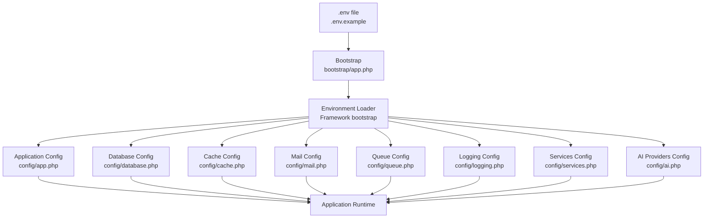
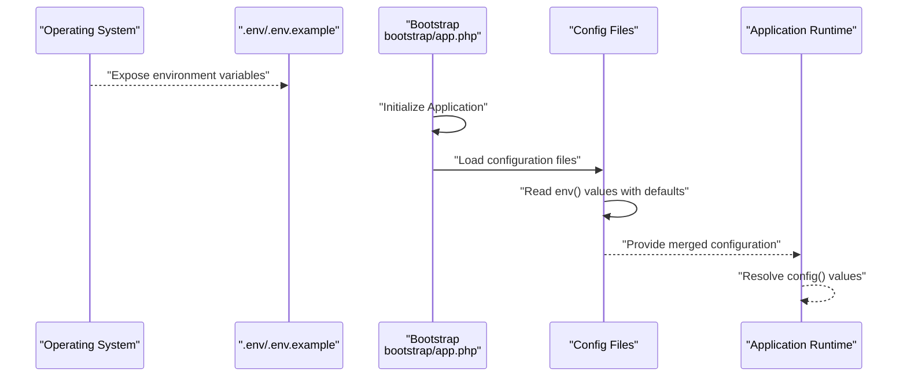
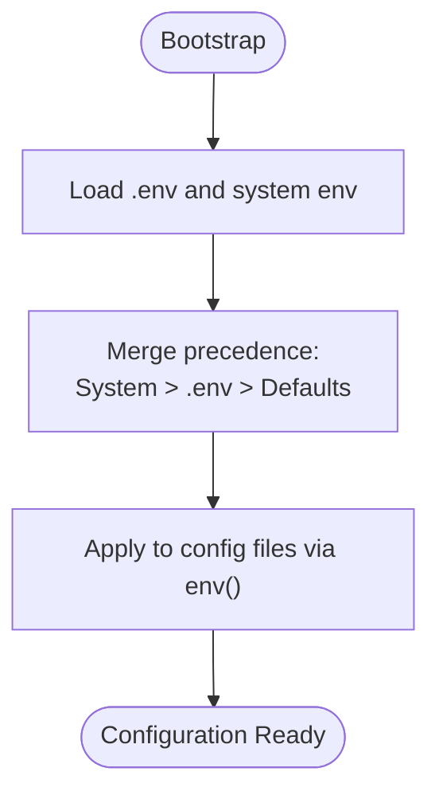
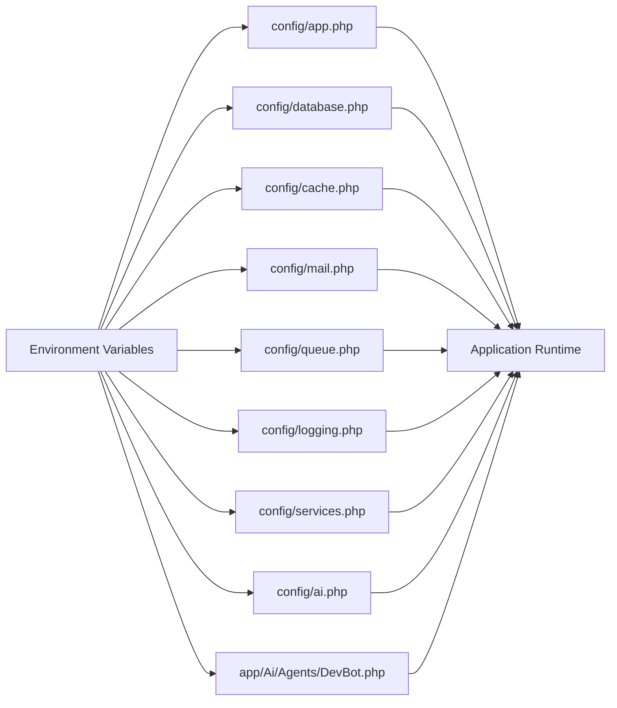

# Environment Variable Management

<cite>
**Referenced Files in This Document**
- [.env.example](file://.env.example)
- [bootstrap/app.php](file://bootstrap/app.php)
- [config/app.php](file://config/app.php)
- [config/database.php](file://config/database.php)
- [config/cache.php](file://config/cache.php)
- [config/mail.php](file://config/mail.php)
- [config/queue.php](file://config/queue.php)
- [config/logging.php](file://config/logging.php)
- [config/services.php](file://config/services.php)
- [config/ai.php](file://config/ai.php)
- [app/Ai/Agents/DevBot.php](file://app/Ai/Agents/DevBot.php)
- [composer.json](file://composer.json)
- [.agents/skills/laravel-best-practices/rules/config.md](file://.agents/skills/laravel-best-practices/rules/config.md)
</cite>

## Table of Contents
1. [Introduction](#introduction)
2. [Project Structure](#project-structure)
3. [Core Components](#core-components)
4. [Architecture Overview](#architecture-overview)
5. [Detailed Component Analysis](#detailed-component-analysis)
6. [Dependency Analysis](#dependency-analysis)
7. [Performance Considerations](#performance-considerations)
8. [Troubleshooting Guide](#troubleshooting-guide)
9. [Conclusion](#conclusion)
10. [Appendices](#appendices)

## Introduction
This document explains how Laravel Assistant manages environment variables and configuration across environments. It covers the .env file structure, environment variable precedence, configuration loading order, and how environment variables integrate with application configuration. It also documents security best practices for sensitive data, environment-specific patterns, validation strategies, configuration caching, and CI/CD integration guidance.

## Project Structure
Environment variables are loaded early in the boot process and consumed by configuration files. The typical flow is:
- Bootstrap initializes the Application and registers routing and middleware.
- Environment variables are loaded from the .env file and system environment.
- Configuration files read environment variables via the env() helper and populate runtime configuration.
- Application code retrieves configuration via the config() helper, ensuring compatibility with cached configuration.

**Diagram sources**
- [bootstrap/app.php:1-19](file://bootstrap/app.php#L1-L19)
- [config/app.php:1-127](file://config/app.php#L1-L127)
- [config/database.php:1-185](file://config/database.php#L1-L185)
- [config/cache.php:1-131](file://config/cache.php#L1-L131)
- [config/mail.php:1-119](file://config/mail.php#L1-L119)
- [config/queue.php:1-130](file://config/queue.php#L1-L130)
- [config/logging.php:1-133](file://config/logging.php#L1-L133)
- [config/services.php:1-39](file://config/services.php#L1-L39)
- [config/ai.php:1-132](file://config/ai.php#L1-L132)

**Section sources**
- [bootstrap/app.php:1-19](file://bootstrap/app.php#L1-L19)

## Core Components
- .env file: Holds environment-specific values. The repository includes a template (.env.example) with common variables for local development.
- Configuration files: Each config file reads environment variables via env() and sets defaults for safe operation.
- Application runtime: Reads configuration via config(), which works whether configuration is cached or not.

Key environment variables used across the application:
- Application identity and behavior: APP_NAME, APP_ENV, APP_KEY, APP_DEBUG, APP_URL, APP_LOCALE, APP_FALLBACK_LOCALE, APP_FAKER_LOCALE, APP_MAINTENANCE_DRIVER, APP_MAINTENANCE_STORE
- Database: DB_CONNECTION, DB_URL, DB_HOST, DB_PORT, DB_DATABASE, DB_USERNAME, DB_PASSWORD, DB_CHARSET, DB_COLLATION, DB_SOCKET, DB_FOREIGN_KEYS
- Cache and Redis: CACHE_STORE, CACHE_PREFIX, REDIS_CLIENT, REDIS_HOST, REDIS_PASSWORD, REDIS_PORT, REDIS_DB, REDIS_CACHE_DB, REDIS_URL, REDIS_CLUSTER, REDIS_PREFIX, REDIS_PERSISTENT, REDIS_CACHE_CONNECTION, REDIS_CACHE_LOCK_CONNECTION, REDIS_MAX_RETRIES, REDIS_BACKOFF_ALGORITHM, REDIS_BACKOFF_BASE, REDIS_BACKOFF_CAP
- Mail: MAIL_MAILER, MAIL_SCHEME, MAIL_HOST, MAIL_PORT, MAIL_USERNAME, MAIL_PASSWORD, MAIL_FROM_ADDRESS, MAIL_FROM_NAME, MAIL_EHLO_DOMAIN, MAIL_URL, MAIL_SENDMAIL_PATH, MAIL_LOG_CHANNEL
- Queues: QUEUE_CONNECTION, DB_QUEUE_CONNECTION, DB_QUEUE_TABLE, DB_QUEUE, DB_QUEUE_RETRY_AFTER, BEANSTALKD_QUEUE_HOST, BEANSTALKD_QUEUE, BEANSTALKD_QUEUE_RETRY_AFTER, SQS_PREFIX, SQS_QUEUE, SQS_SUFFIX, AWS_ACCESS_KEY_ID, AWS_SECRET_ACCESS_KEY, AWS_DEFAULT_REGION, REDIS_QUEUE_CONNECTION, REDIS_QUEUE, REDIS_QUEUE_RETRY_AFTER
- Logging: LOG_CHANNEL, LOG_STACK, LOG_DEPRECATIONS_CHANNEL, LOG_LEVEL, LOG_DAILY_DAYS, LOG_SLACK_WEBHOOK_URL, LOG_SLACK_USERNAME, LOG_SLACK_EMOJI, LOG_PAPERTRAIL_HANDLER, PAPERTRAIL_URL, PAPERTRAIL_PORT, LOG_STDERR_FORMATTER, LOG_SYSLOG_FACILITY
- AI Providers: ANTHROPIC_API_KEY, AZURE_OPENAI_API_KEY, AZURE_OPENAI_URL, AZURE_OPENAI_API_VERSION, AZURE_OPENAI_DEPLOYMENT, AZURE_OPENAI_EMBEDDING_DEPLOYMENT, COHERE_API_KEY, DEEPSEEK_API_KEY, ELEVENLABS_API_KEY, GEMINI_API_KEY, GROQ_API_KEY, JINA_API_KEY, MISTRAL_API_KEY, OLLAMA_API_KEY, OLLAMA_BASE_URL, OPENAI_API_KEY, OPENAI_URL, OPENROUTER_API_KEY, VOYAGEAI_API_KEY, XAI_API_KEY, DEVBOT_MODEL
- AWS and Cloud Storage: AWS_ACCESS_KEY_ID, AWS_SECRET_ACCESS_KEY, AWS_DEFAULT_REGION, AWS_BUCKET, AWS_USE_PATH_STYLE_ENDPOINT

**Section sources**
- [.env.example:1-69](file://.env.example#L1-L69)
- [config/app.php:16-124](file://config/app.php#L16-L124)
- [config/database.php:20-182](file://config/database.php#L20-L182)
- [config/cache.php:18-115](file://config/cache.php#L18-L115)
- [config/mail.php:17-116](file://config/mail.php#L17-L116)
- [config/queue.php:16-127](file://config/queue.php#L16-L127)
- [config/logging.php:21-129](file://config/logging.php#L21-L129)
- [config/services.php:17-36](file://config/services.php#L17-L36)
- [config/ai.php:52-129](file://config/ai.php#L52-L129)
- [app/Ai/Agents/DevBot.php:32-35](file://app/Ai/Agents/DevBot.php#L32-L35)

## Architecture Overview
Environment variables flow into configuration files, which are consumed by the application runtime. The framework’s bootstrap process loads environment variables before configuration is evaluated. This ensures that configuration values reflect the current environment.

**Diagram sources**
- [bootstrap/app.php:7-18](file://bootstrap/app.php#L7-L18)
- [config/app.php:16-124](file://config/app.php#L16-L124)
- [config/database.php:20-182](file://config/database.php#L20-L182)
- [config/cache.php:18-115](file://config/cache.php#L18-L115)
- [config/mail.php:17-116](file://config/mail.php#L17-L116)
- [config/queue.php:16-127](file://config/queue.php#L16-L127)
- [config/logging.php:21-129](file://config/logging.php#L21-L129)
- [config/services.php:17-36](file://config/services.php#L17-L36)
- [config/ai.php:52-129](file://config/ai.php#L52-L129)

## Detailed Component Analysis

### Environment Variable Precedence and Loading Order
- Environment variables are loaded during bootstrap before configuration files are processed.
- Values from the .env file override defaults in configuration files.
- System environment variables override .env values when both are present.
- Defaults in configuration files ensure graceful fallback when variables are missing.

**Diagram sources**
- [bootstrap/app.php:7-18](file://bootstrap/app.php#L7-L18)
- [config/app.php:16-124](file://config/app.php#L16-L124)

**Section sources**
- [bootstrap/app.php:7-18](file://bootstrap/app.php#L7-L18)
- [config/app.php:16-124](file://config/app.php#L16-L124)

### Application Identity and Behavior
- Application name, environment, debug mode, URL, and locale are read from environment variables with sensible defaults.
- Encryption key and previous keys are managed via APP_KEY and APP_PREVIOUS_KEYS.
- Maintenance driver and store are configurable.

Practical guidance:
- Set APP_ENV per environment (development, staging, production).
- Enable APP_DEBUG only in development.
- Ensure APP_KEY is generated and unique per environment.

**Section sources**
- [config/app.php:16-124](file://config/app.php#L16-L124)

### Database Configuration
- Default connection is controlled by DB_CONNECTION.
- Supports SQLite, MySQL, MariaDB, PostgreSQL, SQL Server.
- URL-based connections via DB_URL are supported for all drivers.
- SSL/TLS options for MySQL/MariaDB are conditionally applied.
- Redis client and options are configurable.

Practical guidance:
- Use DB_URL for simplified configuration in containerized environments.
- Configure SSL/TLS for production databases when required.
- Separate credentials per environment using environment variables.

**Section sources**
- [config/database.php:20-182](file://config/database.php#L20-L182)

### Cache and Redis
- Default cache store is CACHE_STORE with a key prefix derived from APP_NAME.
- Redis client, host, port, database indices, and retry/backoff policies are environment-driven.
- Failover and lock connections are configurable.

Practical guidance:
- Use separate Redis databases for default and cache stores in production.
- Configure max retries and backoff for resilience.
- Set CACHE_PREFIX to avoid cross-environment key collisions.

**Section sources**
- [config/cache.php:18-115](file://config/cache.php#L18-L115)
- [config/database.php:146-182](file://config/database.php#L146-L182)

### Mail Configuration
- Default mailer is MAIL_MAILER with SMTP host/port/credentials.
- From address and name are configurable, including dynamic interpolation from APP_NAME.
- EHLO domain defaults to APP_URL host.

Practical guidance:
- Use dedicated mailer credentials per environment.
- Prefer secure ports and TLS in production.
- Use MAIL_LOG_CHANNEL for development to avoid sending real emails.

**Section sources**
- [config/mail.php:17-116](file://config/mail.php#L17-L116)

### Queue Configuration
- Default queue connection is QUEUE_CONNECTION.
- Supports database, beanstalkd, SQS, and Redis backends.
- SQS configuration uses AWS credentials and region.
- Retry and block timing are environment-configurable.

Practical guidance:
- Use Redis queues for high-throughput workloads.
- Configure SQS prefixes and regions per environment.
- Tune retry_after and block_for settings for latency-sensitive jobs.

**Section sources**
- [config/queue.php:16-127](file://config/queue.php#L16-L127)

### Logging Configuration
- Default channel is LOG_CHANNEL with stacked channels from LOG_STACK.
- Daily rotation, Slack, Papertrail, syslog, stderr, and null handlers are supported.
- Levels and retention days are environment-controlled.

Practical guidance:
- Use daily rotation and appropriate log levels per environment.
- Route critical logs to Slack or external systems in production.
- Disable verbose logging in production to reduce overhead.

**Section sources**
- [config/logging.php:21-129](file://config/logging.php#L21-L129)

### AI Providers and Credentials
- Multiple AI providers are configured with keys and optional base URLs.
- Default providers for different modalities are defined.
- Embedding caching store is configurable via CACHE_STORE.

Practical guidance:
- Store provider keys in environment variables per provider.
- Use distinct deployments and regions per environment.
- Disable embedding cache in development for rapid iteration.

**Section sources**
- [config/ai.php:52-129](file://config/ai.php#L52-L129)

### DevBot Agent Model Selection
- The DevBot agent selects its model from DEVBOT_MODEL with a default fallback.
- This enables environment-specific model selection (e.g., cheaper models in development).

**Section sources**
- [app/Ai/Agents/DevBot.php:32-35](file://app/Ai/Agents/DevBot.php#L32-L35)

## Dependency Analysis
Environment variables are consumed by configuration files and indirectly influence application behavior. The following diagram shows how environment variables flow into configuration and runtime behavior.

**Diagram sources**
- [config/app.php:16-124](file://config/app.php#L16-L124)
- [config/database.php:20-182](file://config/database.php#L20-L182)
- [config/cache.php:18-115](file://config/cache.php#L18-L115)
- [config/mail.php:17-116](file://config/mail.php#L17-L116)
- [config/queue.php:16-127](file://config/queue.php#L16-L127)
- [config/logging.php:21-129](file://config/logging.php#L21-L129)
- [config/services.php:17-36](file://config/services.php#L17-L36)
- [config/ai.php:52-129](file://config/ai.php#L52-L129)
- [app/Ai/Agents/DevBot.php:32-35](file://app/Ai/Agents/DevBot.php#L32-L35)

**Section sources**
- [config/app.php:16-124](file://config/app.php#L16-L124)
- [config/database.php:20-182](file://config/database.php#L20-L182)
- [config/cache.php:18-115](file://config/cache.php#L18-L115)
- [config/mail.php:17-116](file://config/mail.php#L17-L116)
- [config/queue.php:16-127](file://config/queue.php#L16-L127)
- [config/logging.php:21-129](file://config/logging.php#L21-L129)
- [config/services.php:17-36](file://config/services.php#L17-L36)
- [config/ai.php:52-129](file://config/ai.php#L52-L129)
- [app/Ai/Agents/DevBot.php:32-35](file://app/Ai/Agents/DevBot.php#L32-L35)

## Performance Considerations
- Prefer URL-based connections (DB_URL, REDIS_URL) for simplified configuration and reduced parsing overhead.
- Use Redis for high-throughput caching and queuing; tune retry/backoff and connection pools.
- Limit verbose logging in production to reduce I/O overhead.
- Avoid unnecessary environment checks in hot paths; rely on configuration caching and environment-specific deployments.

## Troubleshooting Guide
Common issues and resolutions:
- Missing or empty APP_KEY leads to encryption failures. Ensure APP_KEY is set and unique per environment.
- Misconfigured database credentials cause connection errors. Verify DB_* variables and DB_URL.
- Incorrect mailer settings lead to delivery failures. Confirm MAIL_MAILER, host, port, and credentials.
- Queue workers failing due to missing AWS credentials or incorrect region. Validate AWS_* variables and region.
- Logging misconfiguration prevents proper diagnostics. Adjust LOG_CHANNEL and LOG_LEVEL per environment.
- AI provider errors indicate missing API keys. Confirm provider-specific variables are set.

Validation and verification steps:
- Confirm environment variables are present and correct in .env and system environment.
- Use config:clear and config:cache to refresh configuration after changes.
- Run tests that depend on environment variables to catch misconfigurations early.

**Section sources**
- [config/app.php:98-106](file://config/app.php#L98-L106)
- [config/database.php:37-54](file://config/database.php#L37-L54)
- [config/mail.php:42-49](file://config/mail.php#L42-L49)
- [config/queue.php:58-63](file://config/queue.php#L58-L63)
- [config/logging.php:21-64](file://config/logging.php#L21-L64)
- [config/ai.php:54-128](file://config/ai.php#L54-L128)

## Conclusion
Environment variables are central to Laravel Assistant’s configuration model. By structuring .env files per environment, setting sensible defaults in configuration files, and following security best practices, teams can maintain reliable, secure, and scalable deployments across development, staging, and production.

## Appendices

### Security Best Practices
- Never commit secrets to version control. Use encrypted environment files or platform secret stores.
- Rotate keys regularly and use APP_PREVIOUS_KEYS for seamless transitions.
- Limit environment checks in application code; prefer config-driven behavior.
- Use separate credentials and endpoints per environment.

**Section sources**
- [.agents/skills/laravel-best-practices/rules/config.md:21-40](file://.agents/skills/laravel-best-practices/rules/config.md#L21-L40)
- [config/app.php:98-106](file://config/app.php#L98-L106)

### Environment-Specific Patterns
- Development: APP_ENV=local, APP_DEBUG=true, LOG_LEVEL=debug, MAIL_MAILER=log, CACHE_STORE=array or file.
- Staging: APP_ENV=staging, APP_DEBUG=false, LOG_LEVEL=warning, stricter cache and queue settings.
- Production: APP_ENV=production, APP_DEBUG=false, LOG_LEVEL=error, secure mailer and database settings, robust Redis and queue backends.

**Section sources**
- [.env.example:1-69](file://.env.example#L1-L69)
- [config/app.php:29](file://config/app.php#L29)
- [config/logging.php:64](file://config/logging.php#L64)

### Configuration Caching Strategies
- Clear configuration cache before changing environment variables.
- Rebuild configuration cache after verifying environment variables.
- Use environment-specific cache stores to avoid cross-environment collisions.

**Section sources**
- [.agents/skills/laravel-best-practices/rules/config.md:3-19](file://.agents/skills/laravel-best-practices/rules/config.md#L3-L19)

### CI/CD Integration Guidance
- Inject environment variables at deploy time using your platform’s secret store.
- Use separate .env files per environment and encrypt production secrets.
- Validate environment variables during pipeline stages (e.g., linting, unit tests).
- Automate key generation and cache warm-up in deployment scripts.

**Section sources**
- [composer.json:40-74](file://composer.json#L40-L74)