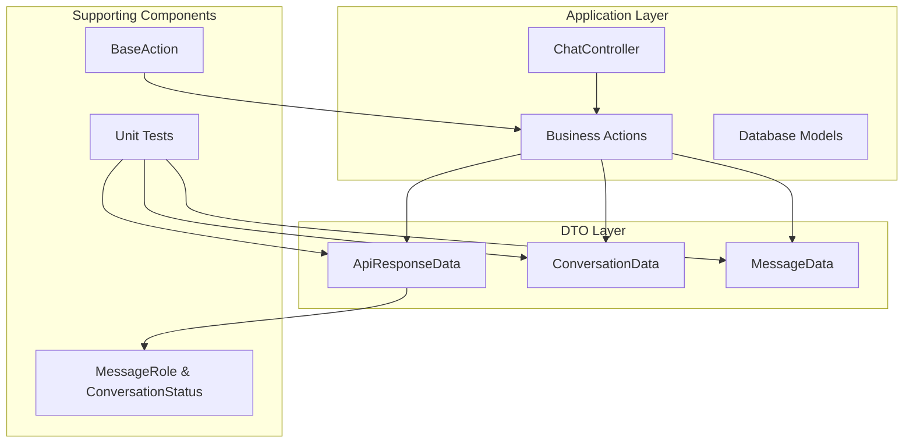
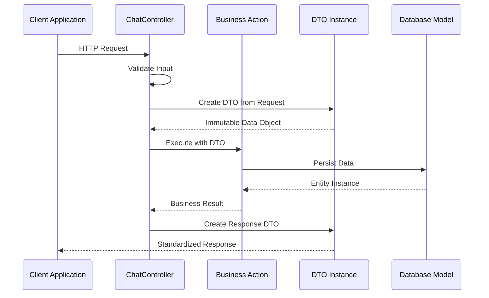
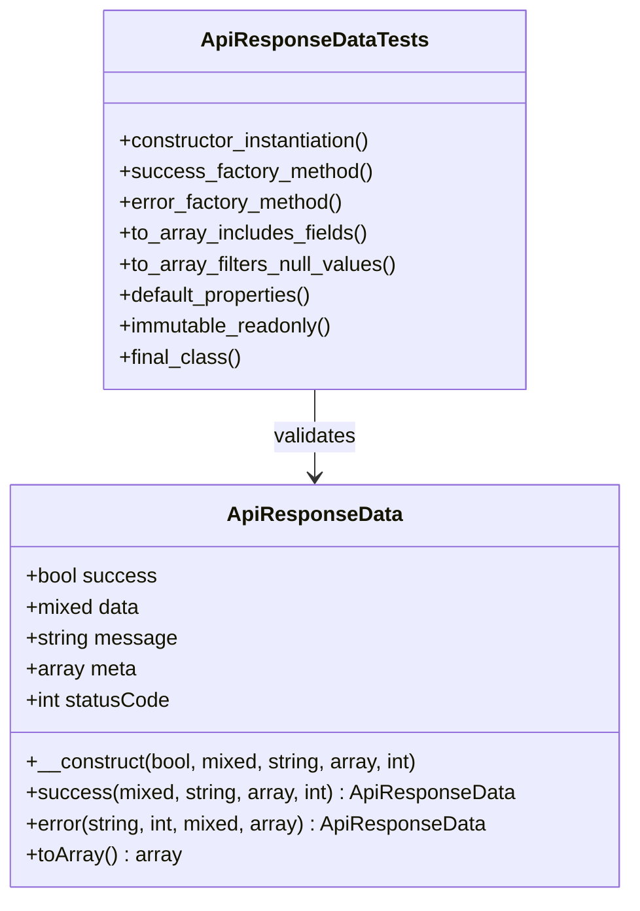
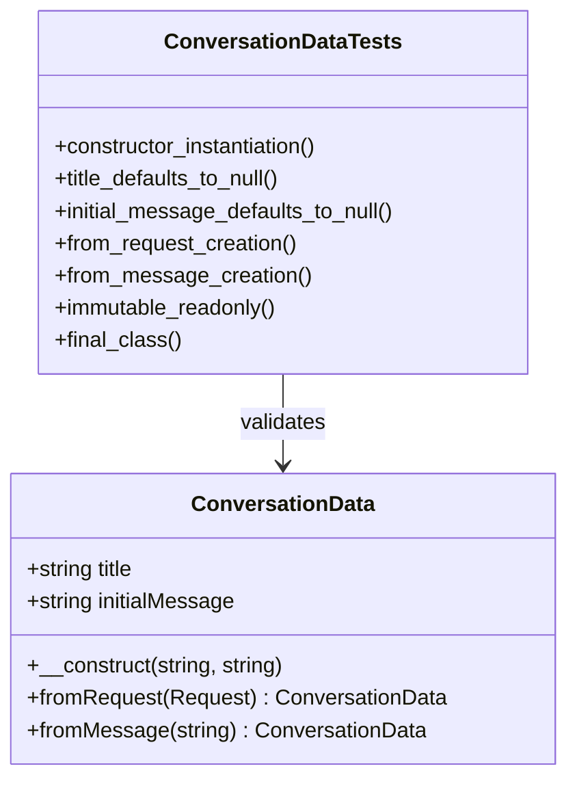
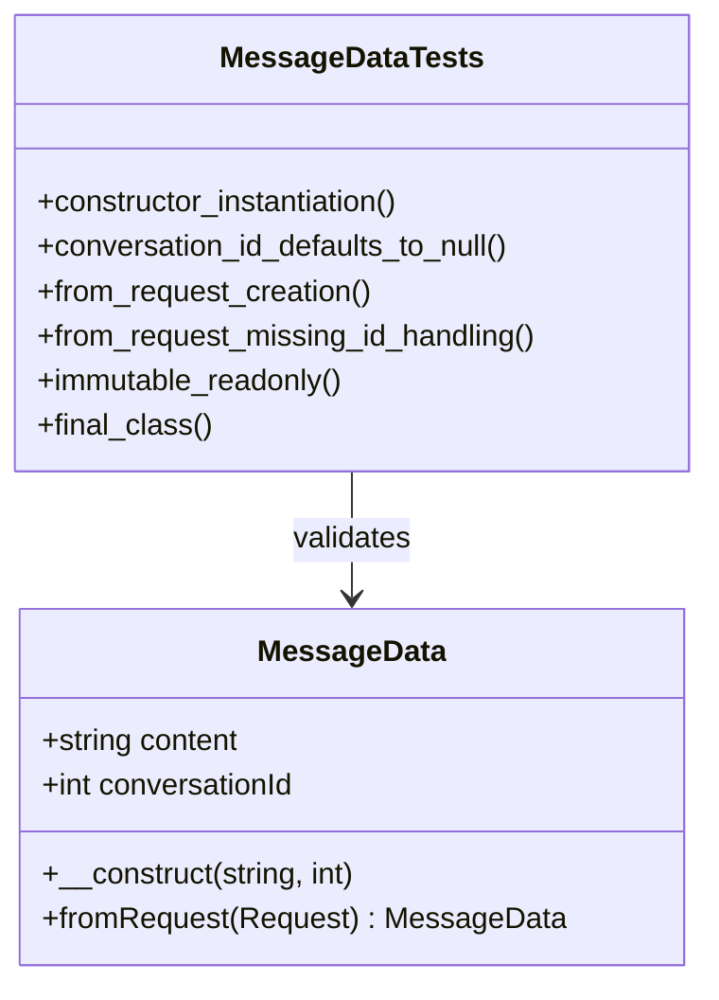
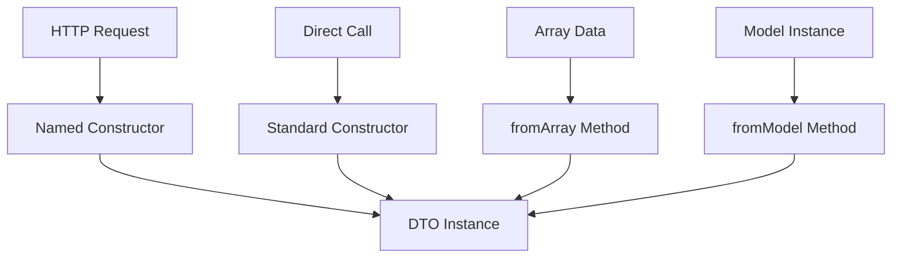
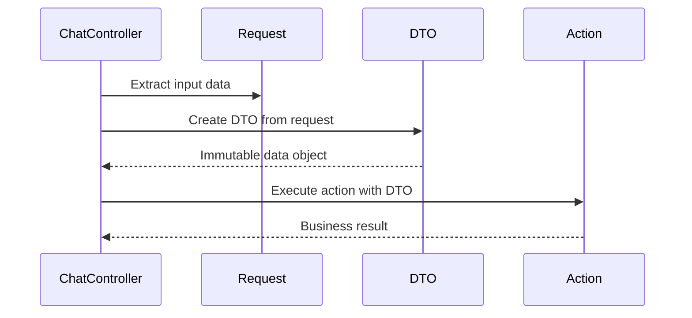
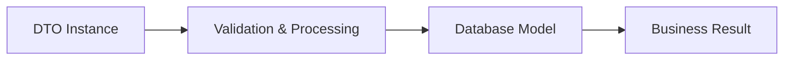
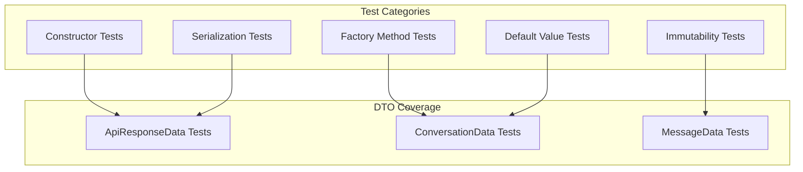
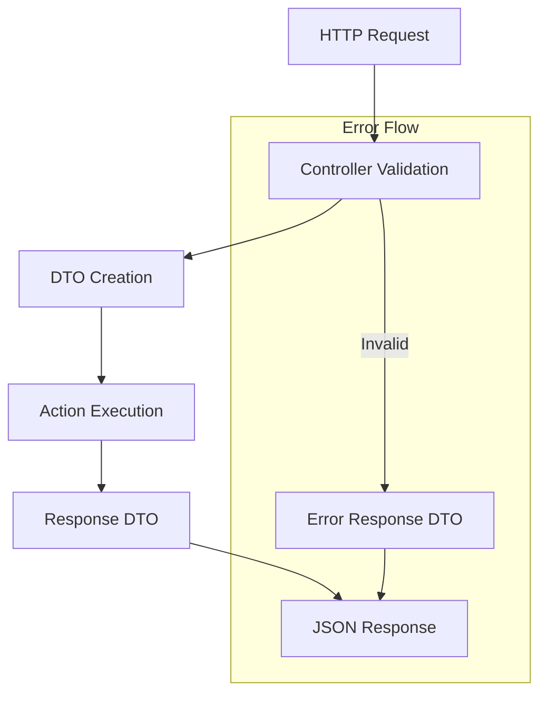

# Data Transfer Objects Specification

<cite>
**Referenced Files in This Document**
- [ApiResponseData.php](file://app/DTOs/ApiResponseData.php)
- [ConversationData.php](file://app/DTOs/ConversationData.php)
- [MessageData.php](file://app/DTOs/MessageData.php)
- [data-transfer-objects/spec.md](file://openspec/changes/professional-laravel-architecture/specs/data-transfer-objects/spec.md)
- [ApiResponseDataTest.php](file://tests/Unit/ApiResponseDataTest.php)
- [ConversationDataTest.php](file://tests/Unit/ConversationDataTest.php)
- [MessageDataTest.php](file://tests/Unit/MessageDataTest.php)
- [CreateConversationAction.php](file://app/Actions/CreateConversationAction.php)
- [SendMessageAction.php](file://app/Actions/SendMessageAction.php)
- [ChatController.php](file://app/Http/Controllers/ChatController.php)
- [BaseAction.php](file://app/Actions/BaseAction.php)
- [ConversationStatus.php](file://app/Enums/ConversationStatus.php)
- [MessageRole.php](file://app/Enums/MessageRole.php)
</cite>

## Table of Contents
1. [Introduction](#introduction)
2. [Project Structure](#project-structure)
3. [Core Components](#core-components)
4. [Architecture Overview](#architecture-overview)
5. [Detailed Component Analysis](#detailed-component-analysis)
6. [Specification Compliance](#specification-compliance)
7. [Usage Patterns](#usage-patterns)
8. [Testing Strategy](#testing-strategy)
9. [Best Practices](#best-practices)
10. [Conclusion](#conclusion)

## Introduction

This document provides a comprehensive specification for Data Transfer Objects (DTOs) in the Laravel Assistant application. DTOs serve as immutable data containers that facilitate clean data transfer between different layers of the application architecture. They ensure type safety, improve code maintainability, and provide consistent interfaces for data exchange.

The DTO system in this application follows modern PHP practices with PHP 8.3 readonly properties and constructor property promotion, ensuring immutability and type safety across all data transfer boundaries.

## Project Structure

The DTO implementation is organized within the application's architecture following Laravel's conventional structure:

**Diagram sources**
- [ChatController.php:19-154](file://app/Http/Controllers/ChatController.php#L19-L154)
- [CreateConversationAction.php:29-53](file://app/Actions/CreateConversationAction.php#L29-L53)
- [SendMessageAction.php:40-131](file://app/Actions/SendMessageAction.php#L40-L131)

**Section sources**
- [ChatController.php:19-154](file://app/Http/Controllers/ChatController.php#L19-L154)
- [CreateConversationAction.php:29-53](file://app/Actions/CreateConversationAction.php#L29-L53)
- [SendMessageAction.php:40-131](file://app/Actions/SendMessageAction.php#L40-L131)

## Core Components

The DTO system consists of three primary data transfer objects, each serving specific use cases within the application's chat functionality:

### ApiResponseData

The `ApiResponseData` DTO provides a standardized structure for all API responses, ensuring consistent formatting and error handling across the application.

### ConversationData

The `ConversationData` DTO encapsulates conversation creation parameters, supporting both explicit title specification and automatic title generation from initial messages.

### MessageData

The `MessageData` DTO handles chat message transmission, managing content and conversation association with proper type casting.

**Section sources**
- [ApiResponseData.php:31-89](file://app/DTOs/ApiResponseData.php#L31-L89)
- [ConversationData.php:29-57](file://app/DTOs/ConversationData.php#L29-L57)
- [MessageData.php:29-46](file://app/DTOs/MessageData.php#L29-L46)

## Architecture Overview

The DTO architecture follows a layered pattern where data flows through distinct boundaries:

**Diagram sources**
- [ChatController.php:67-84](file://app/Http/Controllers/ChatController.php#L67-L84)
- [CreateConversationAction.php:37-51](file://app/Actions/CreateConversationAction.php#L37-L51)
- [ApiResponseData.php:44-75](file://app/DTOs/ApiResponseData.php#L44-L75)

The architecture ensures that:
- Controllers receive validated requests and transform them into DTOs
- Actions operate on immutable data objects
- Responses are standardized through dedicated DTOs
- Business logic remains separate from data transfer concerns

## Detailed Component Analysis

### ApiResponseData Implementation

The `ApiResponseData` class implements a comprehensive response standardization system:

**Diagram sources**
- [ApiResponseData.php:31-89](file://app/DTOs/ApiResponseData.php#L31-L89)
- [ApiResponseDataTest.php:5-109](file://tests/Unit/ApiResponseDataTest.php#L5-L109)

**Key Features:**
- **Immutable Design**: Uses PHP 8.3 readonly properties with constructor promotion
- **Factory Methods**: Provides `success()` and `error()` static constructors
- **Flexible Serialization**: `toArray()` method with null value filtering
- **Type Safety**: Strongly typed constructor parameters with sensible defaults

**Section sources**
- [ApiResponseData.php:31-89](file://app/DTOs/ApiResponseData.php#L31-L89)
- [ApiResponseDataTest.php:5-109](file://tests/Unit/ApiResponseDataTest.php#L5-L109)

### ConversationData Implementation

The `ConversationData` DTO manages conversation creation parameters with flexible instantiation patterns:

**Diagram sources**
- [ConversationData.php:29-57](file://app/DTOs/ConversationData.php#L29-L57)
- [ConversationDataTest.php:6-62](file://tests/Unit/ConversationDataTest.php#L6-L62)

**Usage Patterns:**
- **Request-based Creation**: Extracts data from HTTP requests with proper type casting
- **Message-based Creation**: Supports automatic conversation creation from initial messages
- **Direct Instantiation**: Allows manual construction for programmatic usage

**Section sources**
- [ConversationData.php:29-57](file://app/DTOs/ConversationData.php#L29-L57)
- [ConversationDataTest.php:6-62](file://tests/Unit/ConversationDataTest.php#L6-L62)

### MessageData Implementation

The `MessageData` DTO handles chat message transmission with robust request processing:

**Diagram sources**
- [MessageData.php:29-46](file://app/DTOs/MessageData.php#L29-L46)
- [MessageDataTest.php:6-61](file://tests/Unit/MessageDataTest.php#L6-L61)

**Request Processing:**
- **Content Extraction**: Retrieves message content from request input
- **ID Type Casting**: Converts conversation ID to integer with proper validation
- **Missing Value Handling**: Manages nullable fields with appropriate defaults

**Section sources**
- [MessageData.php:29-46](file://app/DTOs/MessageData.php#L29-L46)
- [MessageDataTest.php:6-61](file://tests/Unit/MessageDataTest.php#L6-L61)

## Specification Compliance

The DTO implementation adheres to the established professional Laravel architecture standards:

### PHP 8.3 Readonly Properties with Constructor Promotion

All DTOs utilize modern PHP features for immutability and type safety:

| Requirement | Implementation Status | Details |
|-------------|----------------------|---------|
| **Readonly Properties** | ✅ Fully Implemented | All properties declared as readonly |
| **Constructor Promotion** | ✅ Fully Implemented | Properties promoted directly in constructor |
| **Immutability** | ✅ Fully Implemented | No setters or mutable state allowed |
| **Final Classes** | ✅ Fully Implemented | All DTOs are declared as final |

### Named Constructors for Common Patterns

Each DTO provides specialized factory methods for different instantiation scenarios:

**Diagram sources**
- [ConversationData.php:39-56](file://app/DTOs/ConversationData.php#L39-L56)
- [MessageData.php:39-44](file://app/DTOs/MessageData.php#L39-L44)
- [ApiResponseData.php:44-75](file://app/DTOs/ApiResponseData.php#L44-L75)

### Business Logic Separation

DTOs maintain strict separation from business logic:

| Component | Responsibilities | Business Logic Location |
|-----------|------------------|------------------------|
| **DTOs** | Data container, type casting, transformation | ❌ Not Allowed |
| **Actions** | Business operations, validation, orchestration | ✅ Primary Location |
| **Controllers** | HTTP request handling, response formatting | ✅ Primary Location |
| **Services** | Cross-cutting concerns, external integrations | ✅ Primary Location |

**Section sources**
- [data-transfer-objects/spec.md:3-53](file://openspec/changes/professional-laravel-architecture/specs/data-transfer-objects/spec.md#L3-L53)
- [BaseAction.php:28-57](file://app/Actions/BaseAction.php#L28-L57)

## Usage Patterns

### Controller-to-Action Data Flow

Controllers extract data from HTTP requests and transform them into DTOs before delegating to business actions:

**Diagram sources**
- [ChatController.php:117-152](file://app/Http/Controllers/ChatController.php#L117-L152)
- [SendMessageAction.php:55-86](file://app/Actions/SendMessageAction.php#L55-L86)

### Action-to-Model Interaction

Business actions receive DTOs and interact with database models:

**Diagram sources**
- [CreateConversationAction.php:37-51](file://app/Actions/CreateConversationAction.php#L37-L51)
- [SendMessageAction.php:55-86](file://app/Actions/SendMessageAction.php#L55-L86)

**Section sources**
- [ChatController.php:67-84](file://app/Http/Controllers/ChatController.php#L67-L84)
- [ChatController.php:117-152](file://app/Http/Controllers/ChatController.php#L117-L152)
- [CreateConversationAction.php:37-51](file://app/Actions/CreateConversationAction.php#L37-L51)
- [SendMessageAction.php:55-86](file://app/Actions/SendMessageAction.php#L55-L86)

## Testing Strategy

The DTO testing approach emphasizes immutability, type safety, and proper behavior validation:

### Test Categories

| Test Type | Focus Area | Implementation |
|-----------|------------|----------------|
| **Constructor Tests** | Basic instantiation and property assignment | Validates all constructor parameters |
| **Factory Method Tests** | Named constructors and special patterns | Tests `fromRequest()`, `fromMessage()`, etc. |
| **Immutability Tests** | Read-only property enforcement | Verifies no mutations after instantiation |
| **Serialization Tests** | Array conversion and filtering | Validates `toArray()` behavior |
| **Default Value Tests** | Parameter defaults and fallbacks | Ensures sensible defaults |

### Test Coverage Examples

**Diagram sources**
- [ApiResponseDataTest.php:5-109](file://tests/Unit/ApiResponseDataTest.php#L5-L109)
- [ConversationDataTest.php:6-62](file://tests/Unit/ConversationDataTest.php#L6-L62)
- [MessageDataTest.php:6-61](file://tests/Unit/MessageDataTest.php#L6-L61)

**Section sources**
- [ApiResponseDataTest.php:5-109](file://tests/Unit/ApiResponseDataTest.php#L5-L109)
- [ConversationDataTest.php:6-62](file://tests/Unit/ConversationDataTest.php#L6-L62)
- [MessageDataTest.php:6-61](file://tests/Unit/MessageDataTest.php#L6-L61)

## Best Practices

### DTO Design Principles

1. **Immutability First**: All DTOs are readonly with constructor promotion
2. **Single Responsibility**: Each DTO represents a specific data contract
3. **Type Safety**: Strong typing with proper validation and casting
4. **Clear Contracts**: Well-defined interfaces with explicit property names
5. **Flexible Construction**: Multiple instantiation patterns for different use cases

### Usage Guidelines

| Principle | Implementation | Benefits |
|-----------|----------------|----------|
| **Layer Separation** | DTOs only, no business logic | Cleaner architecture, easier testing |
| **Consistent Naming** | Descriptive property names | Self-documenting code |
| **Proper Validation** | Input validation in controllers | Reliable data flow |
| **Error Handling** | Standardized response DTOs | Consistent error reporting |
| **Performance** | Minimal overhead | Efficient data transfer |

### Common Patterns

**Diagram sources**
- [ChatController.php:119-151](file://app/Http/Controllers/ChatController.php#L119-L151)
- [ApiResponseData.php:62-75](file://app/DTOs/ApiResponseData.php#L62-L75)

## Conclusion

The Data Transfer Object implementation in Laravel Assistant demonstrates a mature approach to data architecture that prioritizes immutability, type safety, and clean separation of concerns. The system successfully bridges the gap between HTTP requests and business logic while maintaining consistency and reliability across the application.

Key achievements include:

- **Modern PHP Implementation**: Leveraging PHP 8.3 features for optimal performance and safety
- **Comprehensive Testing**: Thorough test coverage ensuring reliability and maintainability
- **Clean Architecture**: Proper separation of concerns with clear data flow boundaries
- **Developer Experience**: Intuitive APIs with multiple instantiation patterns and IDE support

The DTO system provides a solid foundation for future development while maintaining the architectural standards established in the professional Laravel architecture specification. This implementation serves as a reference pattern for similar applications requiring robust data transfer mechanisms.