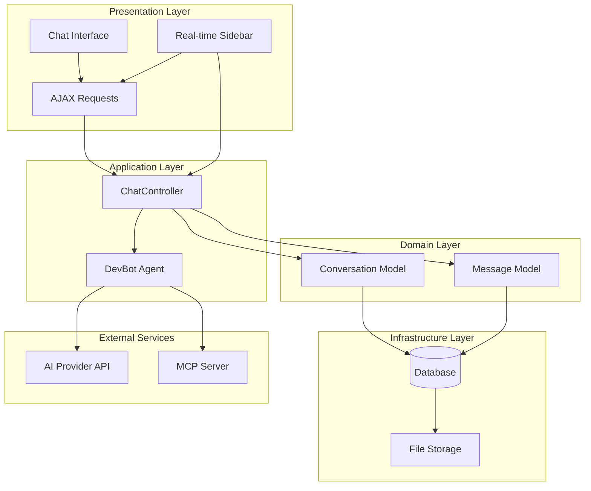
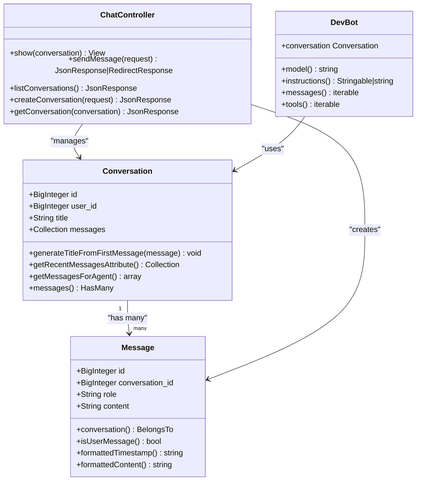
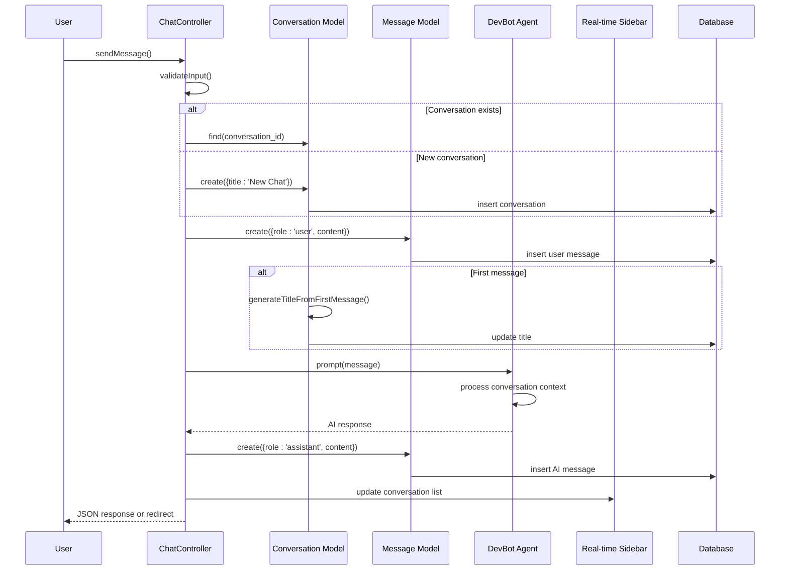
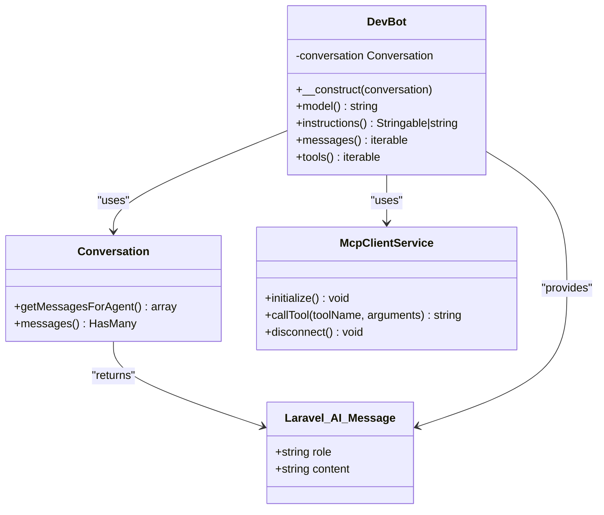
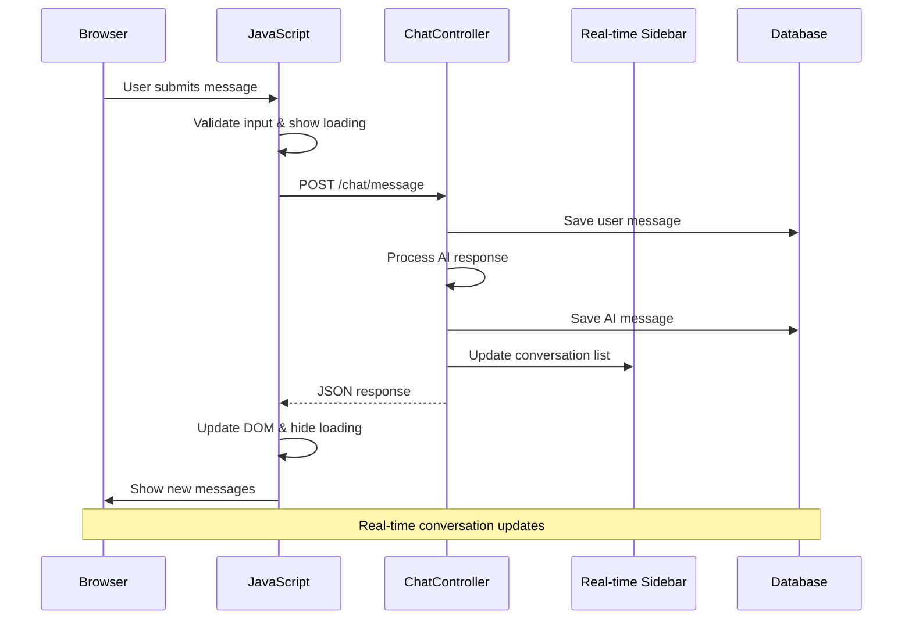
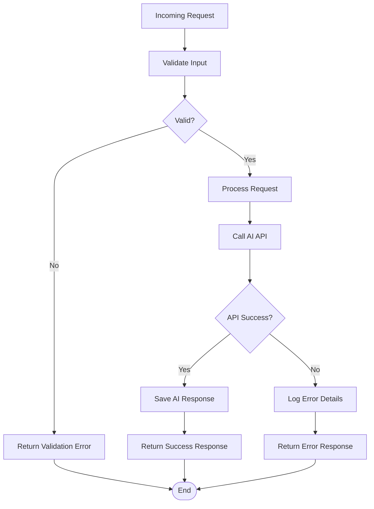

# Conversation Persistence System

<cite>
**Referenced Files in This Document**
- [Conversation.php](file://app/Models/Conversation.php)
- [Message.php](file://app/Models/Message.php)
- [ChatController.php](file://app/Http/Controllers/ChatController.php)
- [DevBot.php](file://app/Ai/Agents/DevBot.php)
- [chat.blade.php](file://resources/views/chat.blade.php)
- [web.php](file://routes/web.php)
- [2026_04_02_123216_create_conversations_table.php](file://database/migrations/2026_04_02_123216_create_conversations_table.php)
- [2026_04_02_123238_create_messages_table.php](file://database/migrations/2026_04_02_123238_create_messages_table.php)
- [Markdown.php](file://app/Helpers/Markdown.php)
- [ChatTest.php](file://tests/Feature/ChatTest.php)
- [composer.json](file://composer.json)
- [McpClientService.php](file://app/Services/McpClientService.php)
</cite>

## Update Summary
**Changes Made**
- Enhanced conversation lifecycle management with AJAX conversation switching capabilities
- Added comprehensive real-time sidebar updates with conversation search and filtering
- Implemented multi-conversation support with automatic conversation creation and management
- Expanded database schema to include user association capabilities
- Enhanced frontend JavaScript with sophisticated conversation switching and real-time updates
- Updated performance considerations for multi-conversation scalability
- Enhanced testing strategy to cover AJAX conversation switching and real-time updates

## Table of Contents
1. [Introduction](#introduction)
2. [System Architecture](#system-architecture)
3. [Core Data Models](#core-data-models)
4. [Conversation Lifecycle](#conversation-lifecycle)
5. [Message Persistence](#message-persistence)
6. [Agent Integration](#agent-integration)
7. [UI Integration](#ui-integration)
8. [Database Schema](#database-schema)
9. [Error Handling](#error-handling)
10. [Testing Strategy](#testing-strategy)
11. [Performance Considerations](#performance-considerations)
12. [Conclusion](#conclusion)

## Introduction

The Laravel Assistant conversation persistence system provides a robust framework for storing and managing conversational data between users and AI agents. Built on Laravel's Eloquent ORM, this system enables persistent chat sessions with automatic conversation title generation, message ordering, and seamless integration with the DevBot AI agent.

**Updated** The system now supports comprehensive multi-conversation management with automatic title generation, message ordering, AJAX conversation switching, real-time sidebar updates, and agent-ready formatting for scalable conversation handling.

The system supports both authenticated user conversations and anonymous chat sessions, with comprehensive error handling and responsive UI integration. It leverages Laravel's built-in features including model relationships, database migrations, and view rendering to create a cohesive conversation management solution with advanced real-time capabilities.

## System Architecture

The conversation persistence system follows a layered architecture pattern with clear separation of concerns and enhanced AJAX capabilities for real-time conversation management.

**Diagram sources**
- [ChatController.php:13-182](file://app/Http/Controllers/ChatController.php#L13-L182)
- [Conversation.php:8-45](file://app/Models/Conversation.php#L8-L45)
- [Message.php:9-44](file://app/Models/Message.php#L9-L44)
- [DevBot.php:20-108](file://app/Ai/Agents/DevBot.php#L20-L108)
- [McpClientService.php:20-279](file://app/Services/McpClientService.php#L20-L279)

The architecture ensures loose coupling between components while maintaining clear data flow patterns. The system handles both synchronous and asynchronous communication patterns, supporting traditional form submissions and modern AJAX interactions with real-time updates.

## Core Data Models

The conversation persistence system is built around two primary Eloquent models that define the relationship between conversations and messages, now with enhanced multi-conversation support.

### Conversation Model

The Conversation model serves as the primary container for chat sessions, managing metadata and establishing relationships with individual messages. **Enhanced** with user association capabilities for multi-user conversation management.

**Diagram sources**
- [Conversation.php:8-45](file://app/Models/Conversation.php#L8-L45)
- [Message.php:9-44](file://app/Models/Message.php#L9-L44)
- [ChatController.php:13-182](file://app/Http/Controllers/ChatController.php#L13-L182)
- [DevBot.php:24-108](file://app/Ai/Agents/DevBot.php#L24-L108)

### Message Model

The Message model encapsulates individual conversation turns, supporting both user and AI-generated responses with proper formatting capabilities.

**Section sources**
- [Conversation.php:8-45](file://app/Models/Conversation.php#L8-L45)
- [Message.php:9-44](file://app/Models/Message.php#L9-L44)

## Conversation Lifecycle

The conversation lifecycle encompasses the complete journey from initial creation through message exchange and persistence, now supporting comprehensive multi-conversation management with AJAX conversation switching.

**Diagram sources**
- [ChatController.php:107-180](file://app/Http/Controllers/ChatController.php#L107-L180)
- [Conversation.php:20-24](file://app/Models/Conversation.php#L20-L24)
- [DevBot.php:80-87](file://app/Ai/Agents/DevBot.php#L80-L87)

The lifecycle ensures data consistency by creating user messages before attempting AI processing, preventing orphaned conversation records when external API calls fail. **Updated** The system now supports seamless multi-conversation switching and management through conversation IDs with real-time sidebar updates.

**Section sources**
- [ChatController.php:107-180](file://app/Http/Controllers/ChatController.php#L107-L180)
- [ChatTest.php:155-171](file://tests/Feature/ChatTest.php#L155-L171)

## Message Persistence

Message persistence follows strict ordering and formatting standards to ensure reliable conversation history management, now with comprehensive multi-conversation support and AJAX conversation switching.

### Message Ordering and Retrieval

The system maintains chronological order through database indexing and Eloquent relationships, automatically sorting messages by creation time for consistent display. **Enhanced** with AJAX conversation switching that preserves message ordering across conversation changes.

**Diagram sources**
- [ChatController.php:127-149](file://app/Http/Controllers/ChatController.php#L127-L149)
- [Conversation.php:20-24](file://app/Models/Conversation.php#L20-L24)

### Content Formatting

The system provides sophisticated content formatting through the Markdown helper, supporting GitHub-flavored markdown with security considerations.

**Section sources**
- [Message.php:36-42](file://app/Models/Message.php#L36-L42)
- [Markdown.php:10-62](file://app/Helpers/Markdown.php#L10-L62)

## Agent Integration

The DevBot agent integrates seamlessly with the conversation persistence system through the Conversational interface, providing automatic context management for multi-conversation support with MCP tool integration.

### Agent-Model Interaction

**Diagram sources**
- [DevBot.php:24-108](file://app/Ai/Agents/DevBot.php#L24-L108)
- [Conversation.php:31-43](file://app/Models/Conversation.php#L31-L43)
- [McpClientService.php:20-279](file://app/Services/McpClientService.php#L20-L279)

The agent receives pre-formatted message arrays with role and content properties, enabling clean context passing to external AI services. **Updated** The agent-ready formatting now supports multi-conversation contexts with proper message ordering and conversation scoping, enhanced with MCP tool integration for database queries and documentation search.

**Section sources**
- [DevBot.php:80-87](file://app/Ai/Agents/DevBot.php#L80-L87)
- [Conversation.php:31-43](file://app/Models/Conversation.php#L31-L43)

## UI Integration

The chat interface provides both traditional form submission and modern AJAX capabilities with responsive design and real-time updates, now supporting comprehensive multi-conversation navigation with instant sidebar updates.

### Frontend-Backend Communication

**Diagram sources**
- [chat.blade.php:319-426](file://resources/views/chat.blade.php#L319-L426)
- [ChatController.php:107-180](file://app/Http/Controllers/ChatController.php#L107-L180)

The frontend implementation includes sophisticated error handling, loading indicators, and automatic scrolling to enhance user experience during AJAX operations. **Updated** The interface now supports conversation switching and maintains conversation context across different chat sessions with real-time sidebar updates and conversation search functionality.

**Section sources**
- [chat.blade.php:134-168](file://resources/views/chat.blade.php#L134-L168)
- [chat.blade.php:271-378](file://resources/views/chat.blade.php#L271-L378)

## Database Schema

The system employs a normalized relational schema optimized for conversation and message storage with appropriate indexing strategies for multi-conversation support and user association capabilities.

### Database Design

**Diagram sources**
- [2026_04_02_123216_create_conversations_table.php:14-21](file://database/migrations/2026_04_02_123216_create_conversations_table.php#L14-L21)
- [2026_04_02_123238_create_messages_table.php:14-22](file://database/migrations/2026_04_02_123238_create_messages_table.php#L14-L22)

**Updated** The schema includes strategic indexes on `created_at` for conversations and `conversation_id, created_at` for messages to optimize common query patterns. **Enhanced** The system now supports user association through nullable `user_id` foreign keys, enabling multi-user conversation management with conversation search and filtering capabilities.

**Section sources**
- [2026_04_02_123216_create_conversations_table.php:14-21](file://database/migrations/2026_04_02_123216_create_conversations_table.php#L14-L21)
- [2026_04_02_123238_create_messages_table.php:14-22](file://database/migrations/2026_04_02_123238_create_messages_table.php#L14-L22)

## Error Handling

The system implements comprehensive error handling strategies to ensure graceful degradation and informative user feedback, now with multi-conversation awareness and AJAX error recovery.

### Error Recovery Patterns

**Diagram sources**
- [ChatController.php:162-179](file://app/Http/Controllers/ChatController.php#L162-L179)

The error handling strategy prioritizes user experience by ensuring user messages are persisted even when AI API calls fail, maintaining conversation continuity. **Updated** Error responses now include conversation context to maintain session state across failures and provide AJAX-compatible error handling.

**Section sources**
- [ChatController.php:162-179](file://app/Http/Controllers/ChatController.php#L162-L179)
- [ChatTest.php:315-334](file://tests/Feature/ChatTest.php#L315-L334)

## Testing Strategy

The conversation persistence system includes comprehensive test coverage validating both positive and negative scenarios, now expanded for multi-conversation support with AJAX conversation switching and real-time updates.

### Test Coverage Areas

The testing strategy encompasses several critical areas:

- **Interface Display**: Validates chat page loading and message display functionality
- **Message Persistence**: Ensures proper message creation and retrieval
- **Validation Logic**: Tests input validation and error responses
- **Conversation Management**: Validates conversation creation and reuse patterns
- **Multi-Conversation Support**: Tests conversation switching and context preservation
- **AJAX Conversation Switching**: Tests real-time conversation loading and sidebar updates
- **Integration Flow**: Tests complete conversation lifecycle with mocked AI responses
- **Real-time Updates**: Tests AJAX conversation switching and sidebar synchronization

**Updated** Tests now validate conversation ID persistence, multi-conversation switching, AJAX conversation loading, real-time sidebar updates, and agent-ready message formatting for comprehensive system coverage.

**Section sources**
- [ChatTest.php:23-77](file://tests/Feature/ChatTest.php#L23-L77)
- [ChatTest.php:178-236](file://tests/Feature/ChatTest.php#L178-L236)
- [ChatTest.php:243-308](file://tests/Feature/ChatTest.php#L243-L308)

## Performance Considerations

The system incorporates several performance optimizations and considerations for multi-conversation scalability with AJAX conversation switching capabilities.

### Database Optimization

- **Index Strategy**: Strategic indexing on frequently queried columns (`created_at`, `conversation_id`)
- **Query Limiting**: Recent message retrieval limited to 50 most recent entries per conversation
- **Eager Loading**: Automatic message loading for conversation display
- **Multi-User Scaling**: User association through `user_id` foreign keys for user-specific conversation filtering
- **Conversation List Optimization**: Limited to 50 most recent conversations for sidebar performance

### Memory Management

- **Lazy Loading**: Messages loaded only when needed through Eloquent relationships
- **Content Processing**: Markdown conversion cached through singleton pattern
- **Response Optimization**: JSON responses minimize payload size for AJAX operations
- **Sidebar Caching**: Conversation lists cached for real-time updates

### Scalability Factors

**Updated** The system now supports multi-user conversation scaling through user association:

- **User Association**: Implement user_id foreign key constraints for multi-user environments
- **Pagination**: Extend recent message retrieval beyond 50-message limit per conversation
- **Caching**: Implement Redis caching for frequently accessed conversations
- **Database Partitioning**: Consider partitioning strategies for high-volume conversation data
- **AJAX Optimization**: Minimize server requests through intelligent conversation switching
- **Real-time Updates**: Efficient WebSocket or polling mechanisms for live conversation updates

**Section sources**
- [Conversation.php:26-29](file://app/Models/Conversation.php#L26-L29)
- [Markdown.php:12-33](file://app/Helpers/Markdown.php#L12-L33)

## Conclusion

The Laravel Assistant conversation persistence system provides a robust foundation for AI-powered chat applications with comprehensive multi-conversation support and real-time capabilities. Its architecture balances simplicity with extensibility, offering:

**Key Strengths:**
- Clean separation of concerns with layered architecture
- Comprehensive error handling ensuring data integrity
- Responsive UI with both traditional and AJAX interaction patterns
- Extensive test coverage validating critical functionality
- Optimized database schema for efficient querying
- **Multi-conversation support with automatic context management**
- **Real-time sidebar updates with conversation search and filtering**
- **AJAX conversation switching for seamless user experience**

**Implementation Highlights:**
- Automatic conversation title generation from first messages
- Seamless integration with Laravel AI agent framework
- Support for both authenticated and anonymous user sessions
- Sophisticated content formatting with markdown support
- Comprehensive validation and error reporting
- **Automatic message ordering and chronological display**
- **Agent-ready formatting for multi-conversation compatibility**
- **Real-time conversation synchronization across tabs and windows**
- **MCP tool integration for database queries and documentation search**

**Future Enhancement Opportunities:**
- **Advanced conversation search and filtering capabilities**
- **Enhanced message pagination and archival features**
- **Real-time conversation synchronization using WebSockets**
- **Conversation analytics and usage metrics collection**
- **Multi-user conversation management with user permissions**
- **Conversation sharing and collaboration features**
- **Voice-to-text and text-to-speech integration**

The system successfully demonstrates Laravel's capabilities for building modern, AI-integrated web applications while maintaining clean code organization and comprehensive functionality. **Updated** The comprehensive conversation management system now provides a solid foundation for scalable, multi-user AI chat applications with automatic conversation handling, seamless user experience, and real-time conversation synchronization across multiple tabs and devices.