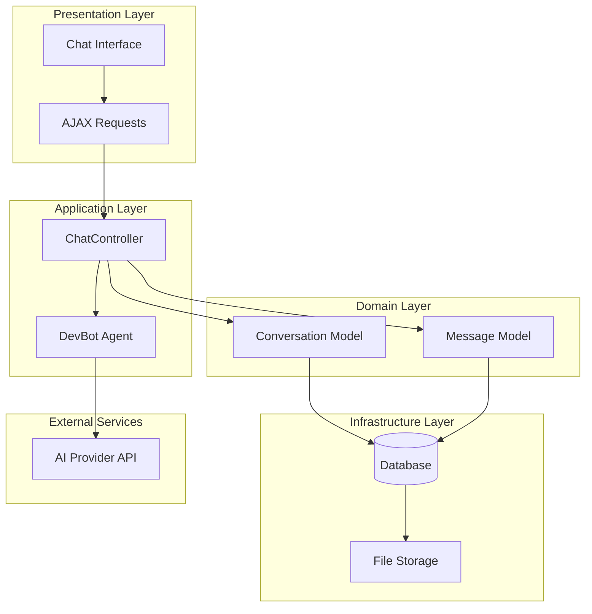
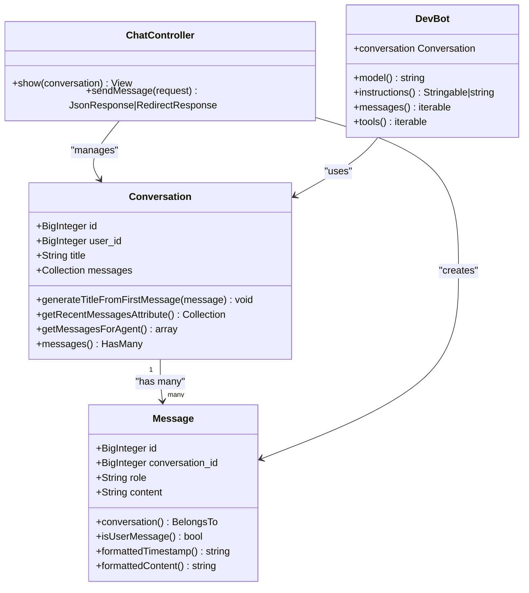
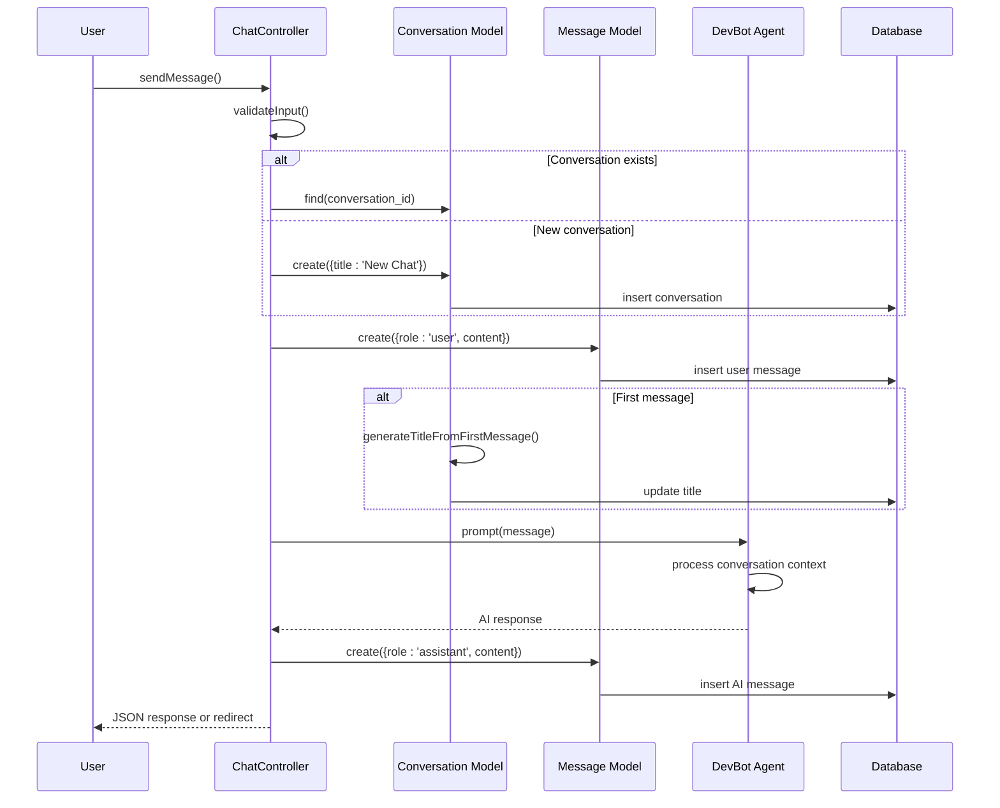
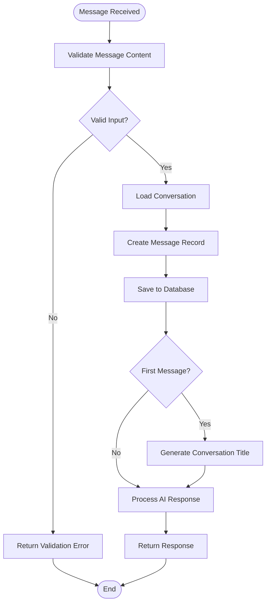
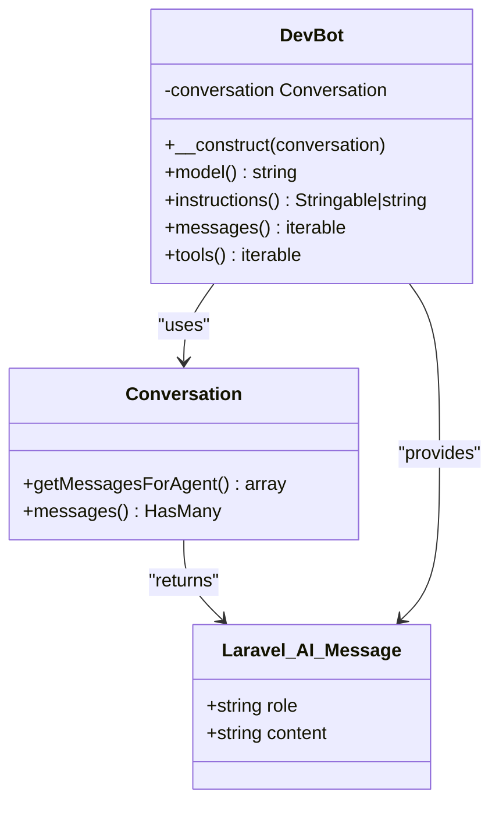
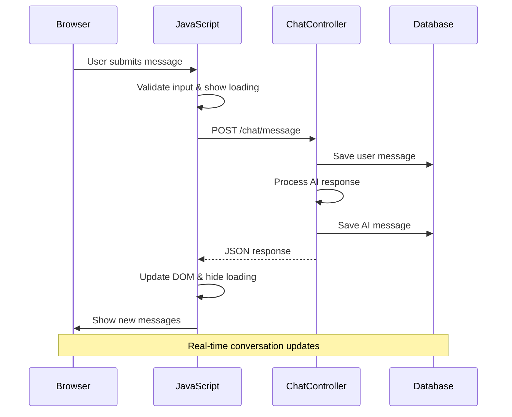
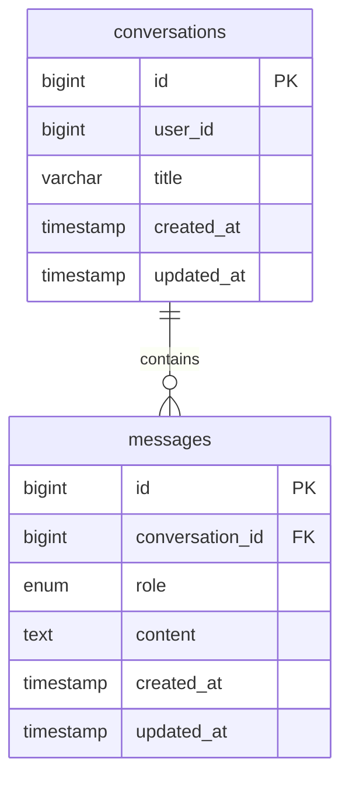

# Conversation Persistence System

<cite>
**Referenced Files in This Document**
- [Conversation.php](file://app/Models/Conversation.php)
- [Message.php](file://app/Models/Message.php)
- [ChatController.php](file://app/Http/Controllers/ChatController.php)
- [DevBot.php](file://app/Ai/Agents/DevBot.php)
- [chat.blade.php](file://resources/views/chat.blade.php)
- [web.php](file://routes/web.php)
- [2026_04_02_123216_create_conversations_table.php](file://database/migrations/2026_04_02_123216_create_conversations_table.php)
- [2026_04_02_123238_create_messages_table.php](file://database/migrations/2026_04_02_123238_create_messages_table.php)
- [Markdown.php](file://app/Helpers/Markdown.php)
- [ChatTest.php](file://tests/Feature/ChatTest.php)
- [composer.json](file://composer.json)
</cite>

## Table of Contents
1. [Introduction](#introduction)
2. [System Architecture](#system-architecture)
3. [Core Data Models](#core-data-models)
4. [Conversation Lifecycle](#conversation-lifecycle)
5. [Message Persistence](#message-persistence)
6. [Agent Integration](#agent-integration)
7. [UI Integration](#ui-integration)
8. [Database Schema](#database-schema)
9. [Error Handling](#error-handling)
10. [Testing Strategy](#testing-strategy)
11. [Performance Considerations](#performance-considerations)
12. [Conclusion](#conclusion)

## Introduction

The Laravel Assistant conversation persistence system provides a robust framework for storing and managing conversational data between users and AI agents. Built on Laravel's Eloquent ORM, this system enables persistent chat sessions with automatic conversation title generation, message ordering, and seamless integration with the DevBot AI agent.

The system supports both authenticated user conversations and anonymous chat sessions, with comprehensive error handling and responsive UI integration. It leverages Laravel's built-in features including model relationships, database migrations, and view rendering to create a cohesive conversation management solution.

## System Architecture

The conversation persistence system follows a layered architecture pattern with clear separation of concerns:

**Diagram sources**
- [ChatController.php:13-113](file://app/Http/Controllers/ChatController.php#L13-L113)
- [Conversation.php:8-45](file://app/Models/Conversation.php#L8-L45)
- [Message.php:9-44](file://app/Models/Message.php#L9-L44)
- [DevBot.php:20-99](file://app/Ai/Agents/DevBot.php#L20-L99)

The architecture ensures loose coupling between components while maintaining clear data flow patterns. The system handles both synchronous and asynchronous communication patterns, supporting traditional form submissions and modern AJAX interactions.

## Core Data Models

The conversation persistence system is built around two primary Eloquent models that define the relationship between conversations and messages.

### Conversation Model

The Conversation model serves as the primary container for chat sessions, managing metadata and establishing relationships with individual messages.

**Diagram sources**
- [Conversation.php:8-45](file://app/Models/Conversation.php#L8-L45)
- [Message.php:9-44](file://app/Models/Message.php#L9-L44)
- [ChatController.php:13-113](file://app/Http/Controllers/ChatController.php#L13-L113)
- [DevBot.php:20-99](file://app/Ai/Agents/DevBot.php#L20-L99)

### Message Model

The Message model encapsulates individual conversation turns, supporting both user and AI-generated responses with proper formatting capabilities.

**Section sources**
- [Conversation.php:8-45](file://app/Models/Conversation.php#L8-L45)
- [Message.php:9-44](file://app/Models/Message.php#L9-L44)

## Conversation Lifecycle

The conversation lifecycle encompasses the complete journey from initial creation through message exchange and persistence.

**Diagram sources**
- [ChatController.php:39-111](file://app/Http/Controllers/ChatController.php#L39-L111)
- [Conversation.php:20-24](file://app/Models/Conversation.php#L20-L24)
- [DevBot.php:80-87](file://app/Ai/Agents/DevBot.php#L80-L87)

The lifecycle ensures data consistency by creating user messages before attempting AI processing, preventing orphaned conversation records when external API calls fail.

**Section sources**
- [ChatController.php:39-111](file://app/Http/Controllers/ChatController.php#L39-L111)
- [ChatTest.php:155-171](file://tests/Feature/ChatTest.php#L155-L171)

## Message Persistence

Message persistence follows strict ordering and formatting standards to ensure reliable conversation history management.

### Message Ordering and Retrieval

The system maintains chronological order through database indexing and Eloquent relationships:

**Diagram sources**
- [ChatController.php:41-81](file://app/Http/Controllers/ChatController.php#L41-L81)
- [Conversation.php:20-24](file://app/Models/Conversation.php#L20-L24)

### Content Formatting

The system provides sophisticated content formatting through the Markdown helper, supporting GitHub-flavored markdown with security considerations.

**Section sources**
- [Message.php:36-42](file://app/Models/Message.php#L36-L42)
- [Markdown.php:10-62](file://app/Helpers/Markdown.php#L10-L62)

## Agent Integration

The DevBot agent integrates seamlessly with the conversation persistence system through the Conversational interface, providing automatic context management.

### Agent-Model Interaction

**Diagram sources**
- [DevBot.php:24-87](file://app/Ai/Agents/DevBot.php#L24-L87)
- [Conversation.php:31-43](file://app/Models/Conversation.php#L31-L43)

The agent receives pre-formatted message arrays with role and content properties, enabling clean context passing to external AI services.

**Section sources**
- [DevBot.php:80-87](file://app/Ai/Agents/DevBot.php#L80-L87)
- [Conversation.php:31-43](file://app/Models/Conversation.php#L31-L43)

## UI Integration

The chat interface provides both traditional form submission and modern AJAX capabilities with responsive design and real-time updates.

### Frontend-Backend Communication

**Diagram sources**
- [chat.blade.php:271-378](file://resources/views/chat.blade.php#L271-L378)
- [ChatController.php:39-111](file://app/Http/Controllers/ChatController.php#L39-L111)

The frontend implementation includes sophisticated error handling, loading indicators, and automatic scrolling to enhance user experience during AJAX operations.

**Section sources**
- [chat.blade.php:134-168](file://resources/views/chat.blade.php#L134-L168)
- [chat.blade.php:271-378](file://resources/views/chat.blade.php#L271-L378)

## Database Schema

The system employs a normalized relational schema optimized for conversation and message storage with appropriate indexing strategies.

### Database Design

**Diagram sources**
- [2026_04_02_123216_create_conversations_table.php:14-21](file://database/migrations/2026_04_02_123216_create_conversations_table.php#L14-L21)
- [2026_04_02_123238_create_messages_table.php:14-22](file://database/migrations/2026_04_02_123238_create_messages_table.php#L14-L22)

The schema includes strategic indexes on `created_at` for conversations and `conversation_id, created_at` for messages to optimize common query patterns.

**Section sources**
- [2026_04_02_123216_create_conversations_table.php:14-21](file://database/migrations/2026_04_02_123216_create_conversations_table.php#L14-L21)
- [2026_04_02_123238_create_messages_table.php:14-22](file://database/migrations/2026_04_02_123238_create_messages_table.php#L14-L22)

## Error Handling

The system implements comprehensive error handling strategies to ensure graceful degradation and informative user feedback.

### Error Recovery Patterns

**Diagram sources**
- [ChatController.php:93-110](file://app/Http/Controllers/ChatController.php#L93-L110)

The error handling strategy prioritizes user experience by ensuring user messages are persisted even when AI API calls fail, maintaining conversation continuity.

**Section sources**
- [ChatController.php:93-110](file://app/Http/Controllers/ChatController.php#L93-L110)
- [ChatTest.php:315-334](file://tests/Feature/ChatTest.php#L315-L334)

## Testing Strategy

The conversation persistence system includes comprehensive test coverage validating both positive and negative scenarios.

### Test Coverage Areas

The testing strategy encompasses several critical areas:

- **Interface Display**: Validates chat page loading and message display functionality
- **Message Persistence**: Ensures proper message creation and retrieval
- **Validation Logic**: Tests input validation and error responses
- **Conversation Management**: Validates conversation creation and reuse patterns
- **Integration Flow**: Tests complete conversation lifecycle with mocked AI responses

**Section sources**
- [ChatTest.php:23-77](file://tests/Feature/ChatTest.php#L23-L77)
- [ChatTest.php:178-236](file://tests/Feature/ChatTest.php#L178-L236)
- [ChatTest.php:243-308](file://tests/Feature/ChatTest.php#L243-L308)

## Performance Considerations

The system incorporates several performance optimizations and considerations:

### Database Optimization

- **Index Strategy**: Strategic indexing on frequently queried columns (`created_at`, `conversation_id`)
- **Query Limiting**: Recent message retrieval limited to 50 most recent entries
- **Eager Loading**: Automatic message loading for conversation display

### Memory Management

- **Lazy Loading**: Messages loaded only when needed through Eloquent relationships
- **Content Processing**: Markdown conversion cached through singleton pattern
- **Response Optimization**: JSON responses minimize payload size for AJAX operations

### Scalability Factors

The current implementation focuses on single-user chat experiences. For multi-user scaling, consider:

- **User Association**: Implement user_id foreign key constraints
- **Pagination**: Extend recent message retrieval beyond 50-message limit
- **Caching**: Implement Redis caching for frequently accessed conversations

**Section sources**
- [Conversation.php:26-29](file://app/Models/Conversation.php#L26-L29)
- [Markdown.php:12-33](file://app/Helpers/Markdown.php#L12-L33)

## Conclusion

The Laravel Assistant conversation persistence system provides a robust foundation for AI-powered chat applications. Its architecture balances simplicity with extensibility, offering:

**Key Strengths:**
- Clean separation of concerns with layered architecture
- Comprehensive error handling ensuring data integrity
- Responsive UI with both traditional and AJAX interaction patterns
- Extensive test coverage validating critical functionality
- Optimized database schema for efficient querying

**Implementation Highlights:**
- Automatic conversation title generation from first messages
- Seamless integration with Laravel AI agent framework
- Support for both authenticated and anonymous user sessions
- Sophisticated content formatting with markdown support
- Comprehensive validation and error reporting

**Future Enhancement Opportunities:**
- Multi-user conversation support with user associations
- Advanced conversation search and filtering capabilities
- Enhanced message pagination and archival features
- Real-time conversation synchronization using WebSockets
- Conversation analytics and usage metrics collection

The system successfully demonstrates Laravel's capabilities for building modern, AI-integrated web applications while maintaining clean code organization and comprehensive functionality.