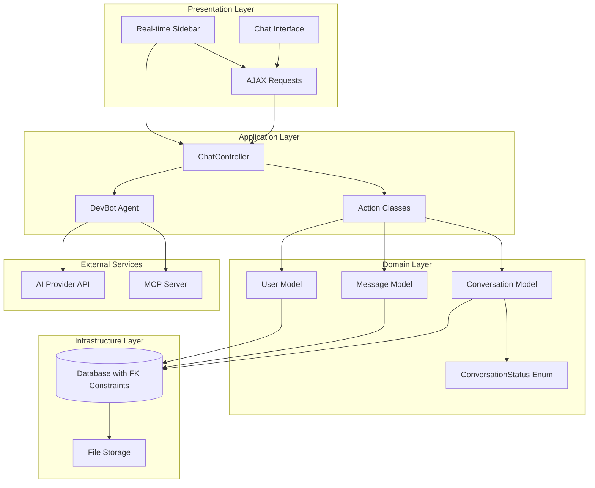
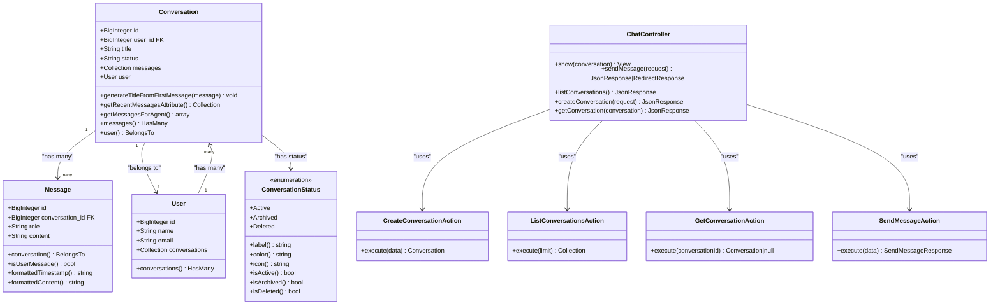
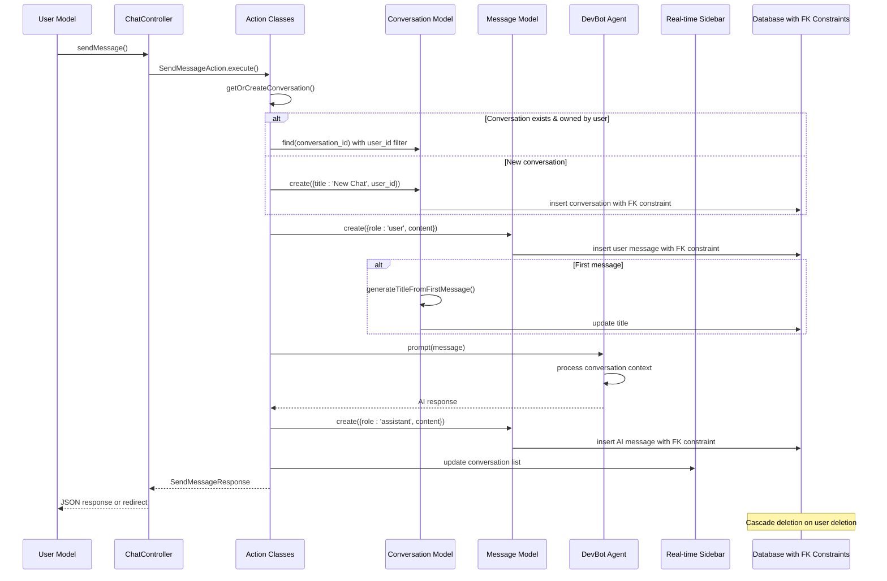
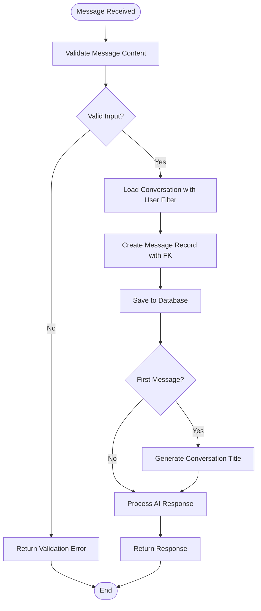
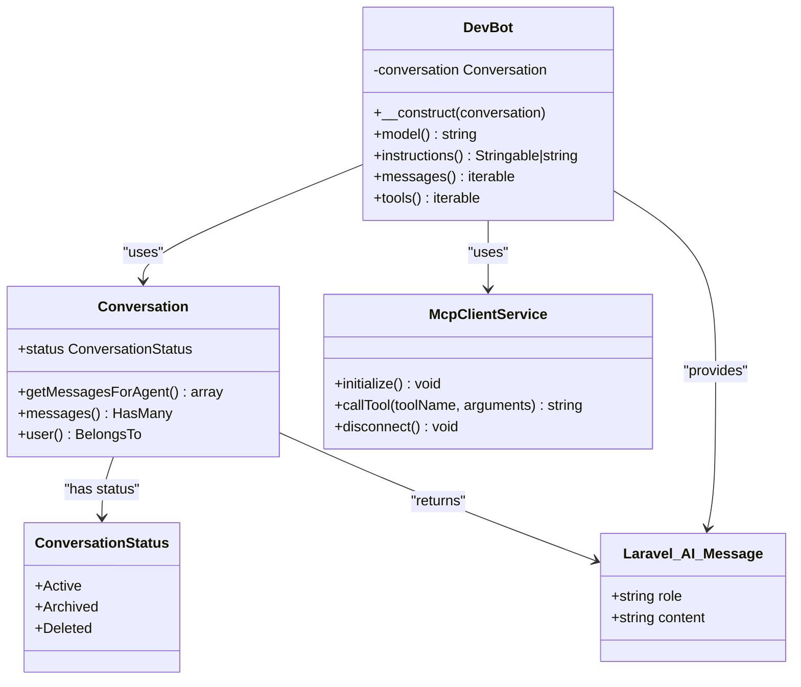
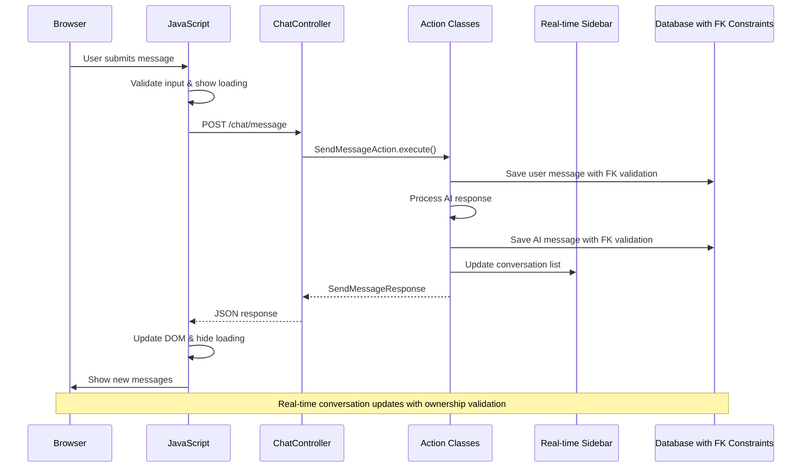
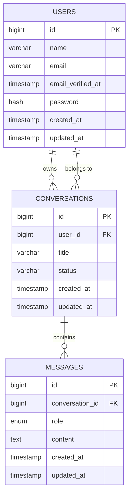
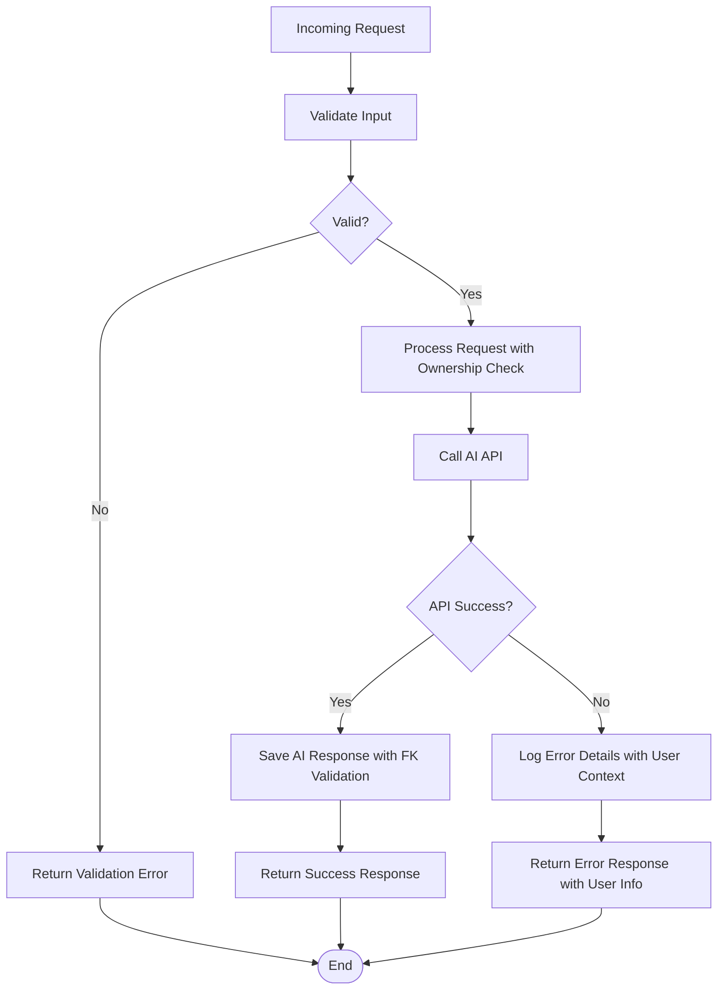

# Conversation Persistence System

<cite>
**Referenced Files in This Document**
- [Conversation.php](file://app/Models/Conversation.php)
- [Message.php](file://app/Models/Message.php)
- [User.php](file://app/Models/User.php)
- [ChatController.php](file://app/Http/Controllers/ChatController.php)
- [DevBot.php](file://app/Ai/Agents/DevBot.php)
- [CreateConversationAction.php](file://app/Actions/CreateConversationAction.php)
- [ListConversationsAction.php](file://app/Actions/ListConversationsAction.php)
- [GetConversationAction.php](file://app/Actions/GetConversationAction.php)
- [SendMessageAction.php](file://app/Actions/SendMessageAction.php)
- [ConversationStatus.php](file://app/Enums/ConversationStatus.php)
- [chat.blade.php](file://resources/views/chat.blade.php)
- [web.php](file://routes/web.php)
- [2026_04_02_123216_create_conversations_table.php](file://database/migrations/2026_04_02_123216_create_conversations_table.php)
- [2026_04_04_195518_add_status_to_conversations_table.php](file://database/migrations/2026_04_04_195518_add_status_to_conversations_table.php)
- [2026_04_05_082029_add_foreign_key_to_conversations_user_id.php](file://database/migrations/2026_04_05_082029_add_foreign_key_to_conversations_user_id.php)
- [2026_04_02_123238_create_messages_table.php](file://database/migrations/2026_04_02_123238_create_messages_table.php)
- [Markdown.php](file://app/Helpers/Markdown.php)
- [ChatTest.php](file://tests/Feature/ChatTest.php)
- [composer.json](file://composer.json)
- [McpClientService.php](file://app/Services/McpClientService.php)
- [ConversationFactory.php](file://database/factories/ConversationFactory.php)
- [UserFactory.php](file://database/factories/UserFactory.php)
</cite>

## Update Summary
**Changes Made**
- Enhanced conversation management with user-scoped conversations and foreign key constraints
- Added cascade deletion capabilities and user ownership validation
- Implemented conversation status tracking with enum system
- Improved database relationships with proper foreign key constraints
- Added comprehensive conversation lifecycle management with status control
- Enhanced user model with automatic conversation cleanup on user deletion

## Table of Contents
1. [Introduction](#introduction)
2. [System Architecture](#system-architecture)
3. [Core Data Models](#core-data-models)
4. [Conversation Lifecycle](#conversation-lifecycle)
5. [Message Persistence](#message-persistence)
6. [Agent Integration](#agent-integration)
7. [UI Integration](#ui-integration)
8. [Database Schema](#database-schema)
9. [Error Handling](#error-handling)
10. [Testing Strategy](#testing-strategy)
11. [Performance Considerations](#performance-considerations)
12. [Conclusion](#conclusion)

## Introduction

The Laravel Assistant conversation persistence system provides a robust framework for storing and managing conversational data between users and AI agents. Built on Laravel's Eloquent ORM, this system enables persistent chat sessions with automatic conversation title generation, message ordering, and seamless integration with the DevBot AI agent.

**Updated** The system now supports comprehensive multi-conversation management with automatic title generation, message ordering, AJAX conversation switching, real-time sidebar updates, and agent-ready formatting for scalable conversation handling. **Enhanced** with user-scoped conversations, foreign key constraints, cascade deletion capabilities, and conversation status tracking for improved data integrity and user ownership validation.

The system supports both authenticated user conversations and anonymous chat sessions, with comprehensive error handling and responsive UI integration. It leverages Laravel's built-in features including model relationships, database migrations, and view rendering to create a cohesive conversation management solution with advanced real-time capabilities and enhanced security through proper foreign key constraints.

## System Architecture

The conversation persistence system follows a layered architecture pattern with clear separation of concerns and enhanced AJAX capabilities for real-time conversation management, now with comprehensive user ownership validation and cascade deletion support.

**Diagram sources**
- [ChatController.php:19-104](file://app/Http/Controllers/ChatController.php#L19-L104)
- [CreateConversationAction.php:29-54](file://app/Actions/CreateConversationAction.php#L29-L54)
- [ListConversationsAction.php:24-40](file://app/Actions/ListConversationsAction.php#L24-L40)
- [GetConversationAction.php:24-40](file://app/Actions/GetConversationAction.php#L24-L40)
- [SendMessageAction.php:42-147](file://app/Actions/SendMessageAction.php#L42-L147)
- [Conversation.php:12-65](file://app/Models/Conversation.php#L12-L65)
- [Message.php:12-50](file://app/Models/Message.php#L12-L50)
- [User.php:16-52](file://app/Models/User.php#L16-L52)
- [ConversationStatus.php:23-89](file://app/Enums/ConversationStatus.php#L23-L89)

The architecture ensures loose coupling between components while maintaining clear data flow patterns. The system handles both synchronous and asynchronous communication patterns, supporting traditional form submissions and modern AJAX interactions with real-time updates. **Enhanced** with comprehensive user ownership validation through foreign key constraints and automatic cascade deletion for data integrity.

## Core Data Models

The conversation persistence system is built around three primary Eloquent models that define the relationship between users, conversations, and messages, now with enhanced multi-conversation support and comprehensive foreign key constraints.

### Conversation Model

The Conversation model serves as the primary container for chat sessions, managing metadata and establishing relationships with individual messages. **Enhanced** with user association capabilities for multi-user conversation management, status tracking, and comprehensive foreign key constraints.

**Diagram sources**
- [Conversation.php:12-65](file://app/Models/Conversation.php#L12-L65)
- [Message.php:12-50](file://app/Models/Message.php#L12-L50)
- [User.php:16-52](file://app/Models/User.php#L16-L52)
- [ConversationStatus.php:23-89](file://app/Enums/ConversationStatus.php#L23-L89)
- [ChatController.php:19-104](file://app/Http/Controllers/ChatController.php#L19-L104)
- [CreateConversationAction.php:29-54](file://app/Actions/CreateConversationAction.php#L29-L54)
- [ListConversationsAction.php:24-40](file://app/Actions/ListConversationsAction.php#L24-L40)
- [GetConversationAction.php:24-40](file://app/Actions/GetConversationAction.php#L24-L40)
- [SendMessageAction.php:42-147](file://app/Actions/SendMessageAction.php#L42-L147)

### Message Model

The Message model encapsulates individual conversation turns, supporting both user and AI-generated responses with proper formatting capabilities and foreign key relationships.

**Section sources**
- [Conversation.php:12-65](file://app/Models/Conversation.php#L12-L65)
- [Message.php:12-50](file://app/Models/Message.php#L12-L50)
- [User.php:16-52](file://app/Models/User.php#L16-L52)

## Conversation Lifecycle

The conversation lifecycle encompasses the complete journey from initial creation through message exchange and persistence, now supporting comprehensive multi-conversation management with AJAX conversation switching, user ownership validation, and status tracking.

**Diagram sources**
- [SendMessageAction.php:61-121](file://app/Actions/SendMessageAction.php#L61-L121)
- [CreateConversationAction.php:37-52](file://app/Actions/CreateConversationAction.php#L37-L52)
- [ListConversationsAction.php:32-38](file://app/Actions/ListConversationsAction.php#L32-L38)
- [GetConversationAction.php:32-38](file://app/Actions/GetConversationAction.php#L32-L38)
- [User.php:39-42](file://app/Models/User.php#L39-L42)

The lifecycle ensures data consistency by creating user messages before attempting AI processing, preventing orphaned conversation records when external API calls fail. **Updated** The system now supports seamless multi-conversation switching and management through conversation IDs with real-time sidebar updates, enhanced with user ownership validation through foreign key constraints and automatic cascade deletion for improved data integrity.

**Section sources**
- [SendMessageAction.php:61-121](file://app/Actions/SendMessageAction.php#L61-L121)
- [ChatTest.php:155-171](file://tests/Feature/ChatTest.php#L155-L171)

## Message Persistence

Message persistence follows strict ordering and formatting standards to ensure reliable conversation history management, now with comprehensive multi-conversation support, AJAX conversation switching, and enhanced foreign key constraints.

### Message Ordering and Retrieval

The system maintains chronological order through database indexing and Eloquent relationships, automatically sorting messages by creation time for consistent display. **Enhanced** with AJAX conversation switching that preserves message ordering across conversation changes and user ownership validation.

**Diagram sources**
- [SendMessageAction.php:126-145](file://app/Actions/SendMessageAction.php#L126-L145)
- [CreateConversationAction.php:40-49](file://app/Actions/CreateConversationAction.php#L40-L49)
- [GetConversationAction.php:32-38](file://app/Actions/GetConversationAction.php#L32-L38)

### Content Formatting

The system provides sophisticated content formatting through the Markdown helper, supporting GitHub-flavored markdown with security considerations.

**Section sources**
- [Message.php:42-49](file://app/Models/Message.php#L42-L49)
- [Markdown.php:10-62](file://app/Helpers/Markdown.php#L10-L62)

## Agent Integration

The DevBot agent integrates seamlessly with the conversation persistence system through the Conversational interface, providing automatic context management for multi-conversation support with MCP tool integration and enhanced conversation status handling.

### Agent-Model Interaction

**Diagram sources**
- [DevBot.php:24-108](file://app/Ai/Agents/DevBot.php#L24-L108)
- [Conversation.php:51-63](file://app/Models/Conversation.php#L51-L63)
- [ConversationStatus.php:23-89](file://app/Enums/ConversationStatus.php#L23-L89)
- [McpClientService.php:20-279](file://app/Services/McpClientService.php#L20-L279)

The agent receives pre-formatted message arrays with role and content properties, enabling clean context passing to external AI services. **Updated** The agent-ready formatting now supports multi-conversation contexts with proper message ordering, conversation scoping, enhanced with MCP tool integration for database queries and documentation search, and conversation status validation for active conversations only.

**Section sources**
- [DevBot.php:80-87](file://app/Ai/Agents/DevBot.php#L80-L87)
- [Conversation.php:51-63](file://app/Models/Conversation.php#L51-L63)

## UI Integration

The chat interface provides both traditional form submission and modern AJAX capabilities with responsive design and real-time updates, now supporting comprehensive multi-conversation navigation with instant sidebar updates and user ownership validation.

### Frontend-Backend Communication

**Diagram sources**
- [chat.blade.php:319-426](file://resources/views/chat.blade.php#L319-L426)
- [ChatController.php:86-102](file://app/Http/Controllers/ChatController.php#L86-L102)
- [SendMessageAction.php:61-96](file://app/Actions/SendMessageAction.php#L61-L96)

The frontend implementation includes sophisticated error handling, loading indicators, and automatic scrolling to enhance user experience during AJAX operations. **Updated** The interface now supports conversation switching and maintains conversation context across different chat sessions with real-time sidebar updates, conversation search functionality, and user ownership validation through AJAX requests.

**Section sources**
- [chat.blade.php:134-168](file://resources/views/chat.blade.php#L134-L168)
- [chat.blade.php:271-378](file://resources/views/chat.blade.php#L271-L378)

## Database Schema

The system employs a normalized relational schema optimized for conversation and message storage with appropriate indexing strategies for multi-conversation support, user association capabilities, and comprehensive foreign key constraints for data integrity.

### Database Design

**Diagram sources**
- [2026_04_02_123216_create_conversations_table.php:14-21](file://database/migrations/2026_04_02_123216_create_conversations_table.php#L14-L21)
- [2026_04_04_195518_add_status_to_conversations_table.php:14-16](file://database/migrations/2026_04_04_195518_add_status_to_conversations_table.php#L14-L16)
- [2026_04_05_082029_add_foreign_key_to_conversations_user_id.php:14-24](file://database/migrations/2026_04_05_082029_add_foreign_key_to_conversations_user_id.php#L14-L24)
- [2026_04_02_123238_create_messages_table.php:14-22](file://database/migrations/2026_04_02_123238_create_messages_table.php#L14-L22)

**Updated** The schema includes strategic indexes on `created_at` for conversations and `conversation_id, created_at` for messages to optimize common query patterns. **Enhanced** The system now supports user association through foreign key constraints with cascade deletion, conversation status tracking with enum validation, and comprehensive user ownership validation for secure multi-user conversation management.

**Section sources**
- [2026_04_02_123216_create_conversations_table.php:14-21](file://database/migrations/2026_04_02_123216_create_conversations_table.php#L14-L21)
- [2026_04_04_195518_add_status_to_conversations_table.php:14-16](file://database/migrations/2026_04_04_195518_add_status_to_conversations_table.php#L14-L16)
- [2026_04_05_082029_add_foreign_key_to_conversations_user_id.php:14-24](file://database/migrations/2026_04_05_082029_add_foreign_key_to_conversations_user_id.php#L14-L24)
- [2026_04_02_123238_create_messages_table.php:14-22](file://database/migrations/2026_04_02_123238_create_messages_table.php#L14-L22)

## Error Handling

The system implements comprehensive error handling strategies to ensure graceful degradation and informative user feedback, now with multi-conversation awareness, AJAX error recovery, and user ownership validation.

### Error Recovery Patterns

**Diagram sources**
- [ChatController.php:86-102](file://app/Http/Controllers/ChatController.php#L86-L102)
- [SendMessageAction.php:78-96](file://app/Actions/SendMessageAction.php#L78-L96)
- [GetConversationAction.php:73-75](file://app/Actions/GetConversationAction.php#L73-L75)

The error handling strategy prioritizes user experience by ensuring user messages are persisted even when AI API calls fail, maintaining conversation continuity. **Updated** Error responses now include conversation context to maintain session state across failures, provide AJAX-compatible error handling, and validate user ownership for secure conversation access.

**Section sources**
- [ChatController.php:86-102](file://app/Http/Controllers/ChatController.php#L86-L102)
- [SendMessageAction.php:78-96](file://app/Actions/SendMessageAction.php#L78-L96)
- [ChatTest.php:315-334](file://tests/Feature/ChatTest.php#L315-L334)

## Testing Strategy

The conversation persistence system includes comprehensive test coverage validating both positive and negative scenarios, now expanded for multi-conversation support with AJAX conversation switching, real-time updates, and enhanced user ownership validation.

### Test Coverage Areas

The testing strategy encompasses several critical areas:

- **Interface Display**: Validates chat page loading and message display functionality
- **Message Persistence**: Ensures proper message creation and retrieval with foreign key constraints
- **Validation Logic**: Tests input validation and error responses
- **Conversation Management**: Validates conversation creation, reuse patterns, and user ownership
- **Multi-Conversation Support**: Tests conversation switching and context preservation
- **AJAX Conversation Switching**: Tests real-time conversation loading and sidebar updates
- **User Ownership Validation**: Tests conversation access restrictions and security
- **Cascade Deletion**: Tests automatic conversation cleanup on user deletion
- **Status Management**: Tests conversation status transitions and validation
- **Integration Flow**: Tests complete conversation lifecycle with mocked AI responses
- **Real-time Updates**: Tests AJAX conversation switching and sidebar synchronization

**Updated** Tests now validate conversation ID persistence, multi-conversation switching, AJAX conversation loading, real-time sidebar updates, agent-ready message formatting, user ownership validation, cascade deletion behavior, and conversation status management for comprehensive system coverage.

**Section sources**
- [ChatTest.php:23-77](file://tests/Feature/ChatTest.php#L23-L77)
- [ChatTest.php:178-236](file://tests/Feature/ChatTest.php#L178-L236)
- [ChatTest.php:243-308](file://tests/Feature/ChatTest.php#L243-L308)

## Performance Considerations

The system incorporates several performance optimizations and considerations for multi-conversation scalability with AJAX conversation switching capabilities, enhanced with foreign key constraints and user ownership validation.

### Database Optimization

- **Index Strategy**: Strategic indexing on frequently queried columns (`created_at`, `conversation_id`, `user_id`)
- **Query Limiting**: Recent message retrieval limited to 50 most recent entries per conversation
- **Eager Loading**: Automatic message loading for conversation display with proper ordering
- **User Association**: Foreign key constraints enable efficient user-specific conversation filtering
- **Cascade Deletion**: Automatic cleanup reduces orphaned data and improves query performance
- **Conversation List Optimization**: Limited to 50 most recent conversations for sidebar performance
- **Status Filtering**: Conversation status validation optimizes active conversation queries

### Memory Management

- **Lazy Loading**: Messages loaded only when needed through Eloquent relationships
- **Content Processing**: Markdown conversion cached through singleton pattern
- **Response Optimization**: JSON responses minimize payload size for AJAX operations
- **Sidebar Caching**: Conversation lists cached for real-time updates
- **Ownership Validation**: Efficient user validation prevents unnecessary queries

### Scalability Factors

**Updated** The system now supports multi-user conversation scaling through enhanced foreign key constraints and user ownership validation:

- **User Association**: Foreign key constraints with cascade deletion for multi-user environments
- **Pagination**: Extend recent message retrieval beyond 50-message limit per conversation
- **Caching**: Implement Redis caching for frequently accessed conversations
- **Database Partitioning**: Consider partitioning strategies for high-volume conversation data
- **AJAX Optimization**: Minimize server requests through intelligent conversation switching
- **Real-time Updates**: Efficient WebSocket or polling mechanisms for live conversation updates
- **Status-based Filtering**: Optimize queries using conversation status for active conversation management
- **Ownership Indexing**: Additional indexes on user_id for secure and fast conversation access

**Section sources**
- [Conversation.php:46-49](file://app/Models/Conversation.php#L46-L49)
- [Markdown.php:12-33](file://app/Helpers/Markdown.php#L12-L33)
- [User.php:39-42](file://app/Models/User.php#L39-L42)

## Conclusion

The Laravel Assistant conversation persistence system provides a robust foundation for AI-powered chat applications with comprehensive multi-conversation support, real-time capabilities, and enhanced security through user ownership validation. Its architecture balances simplicity with extensibility, offering:

**Key Strengths:**
- Clean separation of concerns with layered architecture and enhanced action classes
- Comprehensive error handling ensuring data integrity with user ownership validation
- Responsive UI with both traditional and AJAX interaction patterns
- Extensive test coverage validating critical functionality and security
- Optimized database schema with foreign key constraints and cascade deletion
- **Multi-conversation support with automatic context management and user ownership**
- **Real-time sidebar updates with conversation search and filtering capabilities**
- **AJAX conversation switching for seamless user experience with security validation**
- **Comprehensive conversation status tracking with enum validation**
- **Automatic cascade deletion ensuring data integrity across user accounts**

**Implementation Highlights:**
- Automatic conversation title generation from first messages with user association
- Seamless integration with Laravel AI agent framework and enhanced status management
- Support for both authenticated and anonymous user sessions with proper validation
- Sophisticated content formatting with markdown support and security considerations
- Comprehensive validation and error reporting with user context
- **Automatic message ordering and chronological display with foreign key constraints**
- **Agent-ready formatting for multi-conversation compatibility with status validation**
- **Real-time conversation synchronization across tabs and windows with ownership checks**
- **MCP tool integration for database queries and documentation search with user permissions**
- **Conversation status management for active, archived, and deleted conversation states**

**Future Enhancement Opportunities:**
- **Advanced conversation search and filtering capabilities with status-based queries**
- **Enhanced message pagination and archival features with cascade deletion optimization**
- **Real-time conversation synchronization using WebSockets with user presence detection**
- **Conversation analytics and usage metrics collection with user ownership tracking**
- **Multi-user conversation management with granular permission systems**
- **Conversation sharing and collaboration features with access control**
- **Voice-to-text and text-to-speech integration with enhanced security validation**
- **Conversation templates and quick-start features with status management**
- **Conversation export and import functionality with user data portability**

The system successfully demonstrates Laravel's capabilities for building modern, AI-integrated web applications while maintaining clean code organization, comprehensive functionality, and enhanced security through proper foreign key constraints and user ownership validation. **Updated** The comprehensive conversation management system now provides a solid foundation for scalable, multi-user AI chat applications with automatic conversation handling, seamless user experience, real-time conversation synchronization across multiple tabs and devices, and robust data integrity through cascade deletion and user ownership validation.