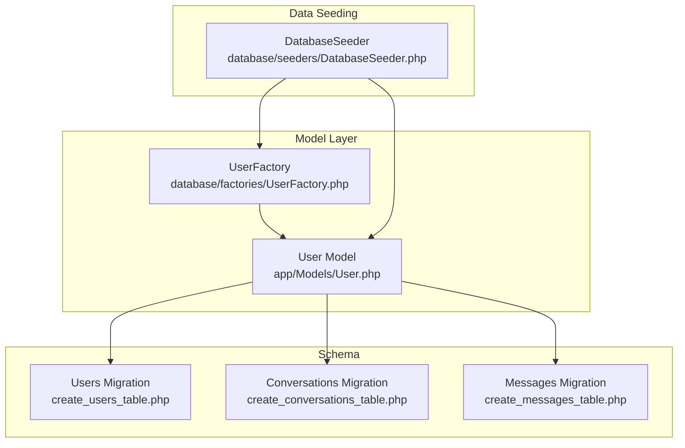
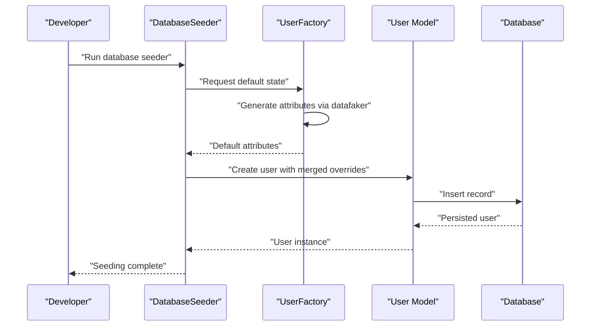
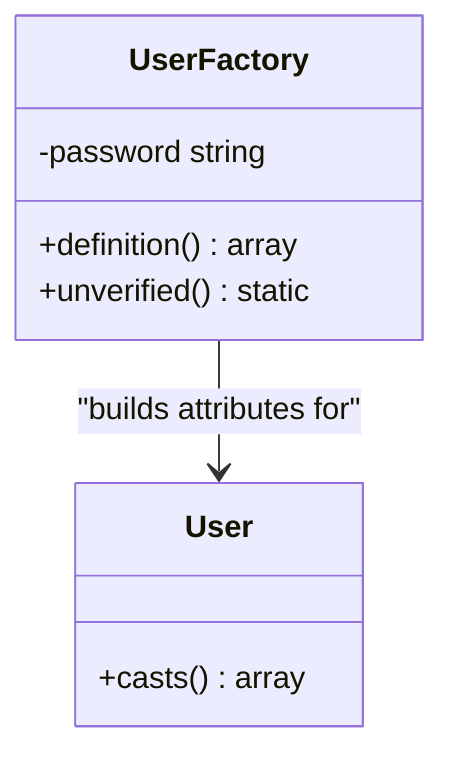
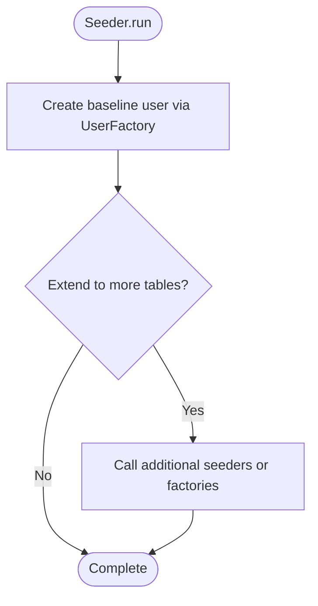
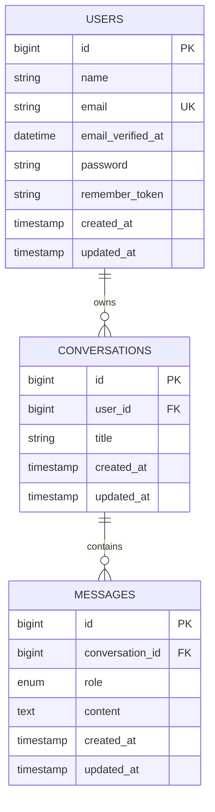
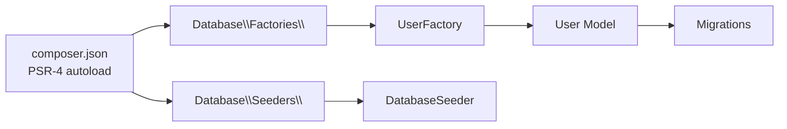

# Data Generation with Factories and Seeders

<cite>
**Referenced Files in This Document**
- [UserFactory.php](file://database/factories/UserFactory.php)
- [User.php](file://app/Models/User.php)
- [DatabaseSeeder.php](file://database/seeders/DatabaseSeeder.php)
- [0001_01_01_000000_create_users_table.php](file://database/migrations/0001_01_01_000000_create_users_table.php)
- [2026_04_02_123216_create_conversations_table.php](file://database/migrations/2026_04_02_123216_create_conversations_table.php)
- [2026_04_02_123238_create_messages_table.php](file://database/migrations/2026_04_02_123238_create_messages_table.php)
- [composer.json](file://composer.json)
- [Pest.php](file://tests/Pest.php)
- [TestCase.php](file://tests/TestCase.php)
- [testing.md](file://.agents/skills/laravel-best-practices/rules/testing.md)
</cite>

## Table of Contents
1. [Introduction](#introduction)
2. [Project Structure](#project-structure)
3. [Core Components](#core-components)
4. [Architecture Overview](#architecture-overview)
5. [Detailed Component Analysis](#detailed-component-analysis)
6. [Dependency Analysis](#dependency-analysis)
7. [Performance Considerations](#performance-considerations)
8. [Troubleshooting Guide](#troubleshooting-guide)
9. [Conclusion](#conclusion)
10. [Appendices](#appendices)

## Introduction
This document explains how the project generates realistic and scalable test/demo data using Laravel Eloquent factories and seeders. It focuses on:
- The UserFactory implementation, including attribute definition, datafaker integration, and custom states
- The DatabaseSeeder orchestration pattern and how it composes factory-driven data creation
- Practical examples for generating simple and complex datasets, including relational data
- Integration patterns between factories and seeders, bulk generation strategies, and performance considerations
- Testing data management, isolation, and cleanup

## Project Structure
The data generation stack centers around three areas:
- Model and factory: the User model and its associated factory define default attributes and custom states
- Seeder: the DatabaseSeeder coordinates seeding tasks
- Migrations: database schema defines the shape of generated data and supports relationships

**Diagram sources**
- [User.php:15-32](file://app/Models/User.php#L15-L32)
- [UserFactory.php:13-45](file://database/factories/UserFactory.php#L13-L45)
- [DatabaseSeeder.php:9-25](file://database/seeders/DatabaseSeeder.php#L9-L25)
- [0001_01_01_000000_create_users_table.php:14-22](file://database/migrations/0001_01_01_000000_create_users_table.php#L14-L22)
- [2026_04_02_123216_create_conversations_table.php:14-21](file://database/migrations/2026_04_02_123216_create_conversations_table.php#L14-L21)
- [2026_04_02_123238_create_messages_table.php:14-22](file://database/migrations/2026_04_02_123238_create_messages_table.php#L14-L22)

**Section sources**
- [User.php:15-32](file://app/Models/User.php#L15-L32)
- [UserFactory.php:13-45](file://database/factories/UserFactory.php#L13-L45)
- [DatabaseSeeder.php:9-25](file://database/seeders/DatabaseSeeder.php#L9-L25)
- [0001_01_01_000000_create_users_table.php:14-22](file://database/migrations/0001_01_01_000000_create_users_table.php#L14-L22)
- [2026_04_02_123216_create_conversations_table.php:14-21](file://database/migrations/2026_04_02_123216_create_conversations_table.php#L14-L21)
- [2026_04_02_123238_create_messages_table.php:14-22](file://database/migrations/2026_04_02_123238_create_messages_table.php#L14-L22)

## Core Components
- UserFactory: Defines default attributes and a custom state for unverified emails. It integrates datafaker via the global helper and ensures consistent hashing for passwords.
- User model: Declares factory binding and attribute casting for verification timestamps and hashed passwords.
- DatabaseSeeder: Orchestrates seeding by invoking the User factory to create a controlled baseline dataset.
- Migrations: Establish the users table and related tables that support richer relational datasets.

Key responsibilities:
- Attribute definition and faker integration
- Custom states and reusable transformations
- Bulk creation and per-test isolation
- Orchestration of multi-table seeding

**Section sources**
- [UserFactory.php:25-44](file://database/factories/UserFactory.php#L25-L44)
- [User.php:17-31](file://app/Models/User.php#L17-L31)
- [DatabaseSeeder.php:16-24](file://database/seeders/DatabaseSeeder.php#L16-L24)
- [0001_01_01_000000_create_users_table.php:14-22](file://database/migrations/0001_01_01_000000_create_users_table.php#L14-L22)

## Architecture Overview
The data generation pipeline connects factories to the database through the model and seeder orchestration.

**Diagram sources**
- [DatabaseSeeder.php:16-24](file://database/seeders/DatabaseSeeder.php#L16-L24)
- [UserFactory.php:25-34](file://database/factories/UserFactory.php#L25-L34)
- [User.php:17-18](file://app/Models/User.php#L17-L18)

## Detailed Component Analysis

### UserFactory: Attributes, States, and Faker Integration
- Default state composition:
  - Name and email via datafaker
  - Unique email constraint satisfied during generation
  - Verified timestamp included by default
  - Password hashing applied once and reused across instances
  - Random remember token for session support
- Custom state:
  - Unverified state clears the verification timestamp to simulate pending verification
- Integration:
  - Uses the global faker helper for randomized data
  - Leverages hashing and string utilities for secure defaults

**Diagram sources**
- [UserFactory.php:25-44](file://database/factories/UserFactory.php#L25-L44)
- [User.php:25-31](file://app/Models/User.php#L25-L31)

**Section sources**
- [UserFactory.php:25-44](file://database/factories/UserFactory.php#L25-L44)
- [User.php:17-31](file://app/Models/User.php#L17-L31)

### DatabaseSeeder: Orchestration and Composition
- Role:
  - Provides a single entry point to seed the database
  - Demonstrates controlled creation of a known baseline user
  - Can be extended to chain additional seeders for multi-table datasets
- Current behavior:
  - Creates a single user with explicit name and email
- Extension patterns:
  - Add calls to other model factories or dedicated seeders
  - Use transactions to group related inserts
  - Apply batch sizes for large-scale inserts

**Diagram sources**
- [DatabaseSeeder.php:16-24](file://database/seeders/DatabaseSeeder.php#L16-L24)

**Section sources**
- [DatabaseSeeder.php:16-24](file://database/seeders/DatabaseSeeder.php#L16-L24)

### Relational Data Generation Patterns
With the presence of conversations and messages tables, you can generate hierarchical datasets:
- Create a user, then create multiple conversations owned by that user
- Create conversations, then create messages under those conversations with roles and timestamps
- Use factory states to vary verification and message roles

**Diagram sources**
- [0001_01_01_000000_create_users_table.php:14-22](file://database/migrations/0001_01_01_000000_create_users_table.php#L14-L22)
- [2026_04_02_123216_create_conversations_table.php:14-21](file://database/migrations/2026_04_02_123216_create_conversations_table.php#L14-L21)
- [2026_04_02_123238_create_messages_table.php:14-22](file://database/migrations/2026_04_02_123238_create_messages_table.php#L14-L22)

**Section sources**
- [0001_01_01_000000_create_users_table.php:14-22](file://database/migrations/0001_01_01_000000_create_users_table.php#L14-L22)
- [2026_04_02_123216_create_conversations_table.php:14-21](file://database/migrations/2026_04_02_123216_create_conversations_table.php#L14-L21)
- [2026_04_02_123238_create_messages_table.php:14-22](file://database/migrations/2026_04_02_123238_create_messages_table.php#L14-L22)

### Factory-to-Seeder Integration Patterns
- Direct creation from seeder:
  - Use the User factory to create a known baseline user
- Bulk generation:
  - Invoke the factory multiple times or with counts for demo/test datasets
- Chaining seeders:
  - Extend the seeder to call additional model factories or seeder classes for related tables
- Transactional batches:
  - Wrap large insertions in transactions to improve performance and maintain consistency

**Section sources**
- [DatabaseSeeder.php:16-24](file://database/seeders/DatabaseSeeder.php#L16-L24)
- [UserFactory.php:25-34](file://database/factories/UserFactory.php#L25-L34)

## Dependency Analysis
- Composer autoloading maps factories and seeders to namespaces for automatic discovery
- The User model binds to the UserFactory, enabling factory-driven creation
- Migrations define the schema that supports both simple and complex datasets

**Diagram sources**
- [composer.json:27-32](file://composer.json#L27-L32)
- [UserFactory.php:3-8](file://database/factories/UserFactory.php#L3-L8)
- [DatabaseSeeder.php:3-7](file://database/seeders/DatabaseSeeder.php#L3-L7)
- [User.php:6-18](file://app/Models/User.php#L6-L18)

**Section sources**
- [composer.json:27-32](file://composer.json#L27-L32)
- [UserFactory.php:3-8](file://database/factories/UserFactory.php#L3-L8)
- [DatabaseSeeder.php:3-7](file://database/seeders/DatabaseSeeder.php#L3-L7)
- [User.php:6-18](file://app/Models/User.php#L6-L18)

## Performance Considerations
- Prefer factory states and sequences to avoid repeated manual setup
- Use batched creation for large datasets to reduce overhead
- Wrap heavy seeding in transactions to minimize round-trips
- Reuse computed defaults (e.g., hashed passwords) to avoid recomputation
- For extensive relational datasets, create parent records first, then children in controlled batches
- Keep faker usage efficient; avoid excessive uniqueness checks when not needed

[No sources needed since this section provides general guidance]

## Troubleshooting Guide
- Unique constraint violations:
  - Ensure uniqueness is requested appropriately in factories (e.g., unique email)
  - For seeded datasets, consider disabling strict uniqueness checks during development if acceptable
- Verification state mismatches:
  - Use the unverified state to simulate pending verification
- Event interference in tests:
  - Configure testing frameworks to avoid silencing model events before factory creation
- Isolation between test runs:
  - Use refresh or lazy refresh strategies to reset schema and data consistently
- Cleanup:
  - Clear test databases after runs or truncate tables between test suites

**Section sources**
- [UserFactory.php:39-44](file://database/factories/UserFactory.php#L39-L44)
- [testing.md:3-33](file://.agents/skills/laravel-best-practices/rules/testing.md#L3-L33)

## Conclusion
The project’s data generation strategy leverages a clean separation of concerns: factories define realistic defaults and states, the model binds factories to creation, and the seeder orchestrates seeding. With the provided migrations, you can extend this pattern to generate both simple and complex relational datasets. Following the performance and testing practices outlined here will help you scale data generation safely and efficiently.

[No sources needed since this section summarizes without analyzing specific files]

## Appendices

### Practical Examples Index
- Baseline user creation from seeder:
  - See [DatabaseSeeder.php:20-23](file://database/seeders/DatabaseSeeder.php#L20-L23)
- Unverified user via factory state:
  - See [UserFactory.php:39-44](file://database/factories/UserFactory.php#L39-L44)
- Faker integration in attributes:
  - See [UserFactory.php:27-33](file://database/factories/UserFactory.php#L27-L33)
- Model factory binding and casts:
  - See [User.php:6-18](file://app/Models/User.php#L6-L18) and [User.php:25-31](file://app/Models/User.php#L25-L31)
- Relational schema for conversations and messages:
  - Users to Conversations: [0001_01_01_000000_create_users_table.php:14-22](file://database/migrations/0001_01_01_000000_create_users_table.php#L14-L22), [2026_04_02_123216_create_conversations_table.php:14-21](file://database/migrations/2026_04_02_123216_create_conversations_table.php#L14-L21)
  - Conversations to Messages: [2026_04_02_123238_create_messages_table.php:14-22](file://database/migrations/2026_04_02_123238_create_messages_table.php#L14-L22)

### Testing Data Management References
- Test harness extension and configuration:
  - See [Pest.php:16-18](file://tests/Pest.php#L16-L18)
  - See [TestCase.php:7-10](file://tests/TestCase.php#L7-L10)
- Best practices for factory usage and database refresh:
  - See [testing.md:3-33](file://.agents/skills/laravel-best-practices/rules/testing.md#L3-L33)