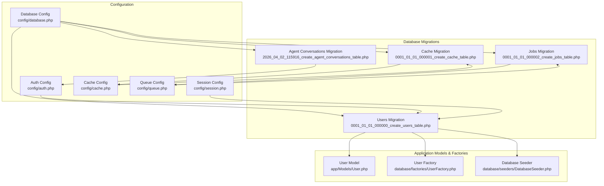
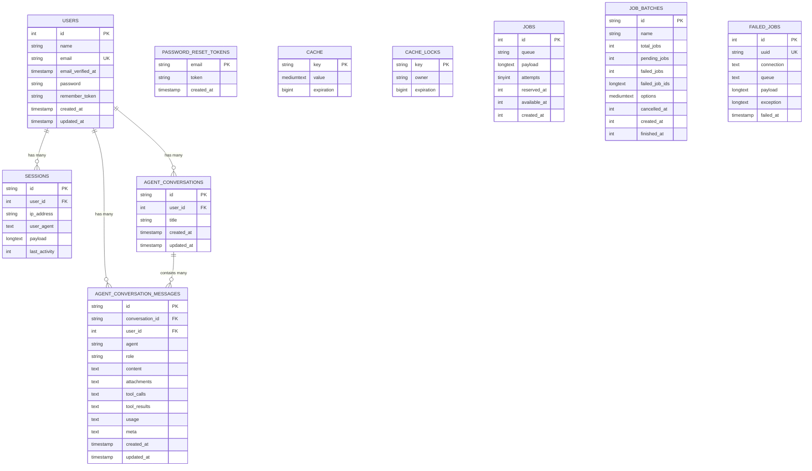
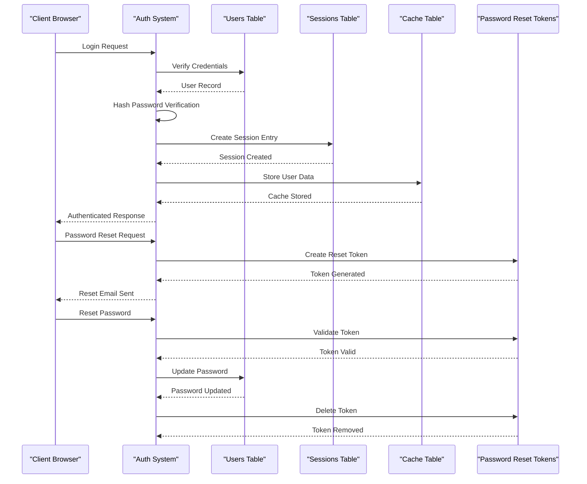
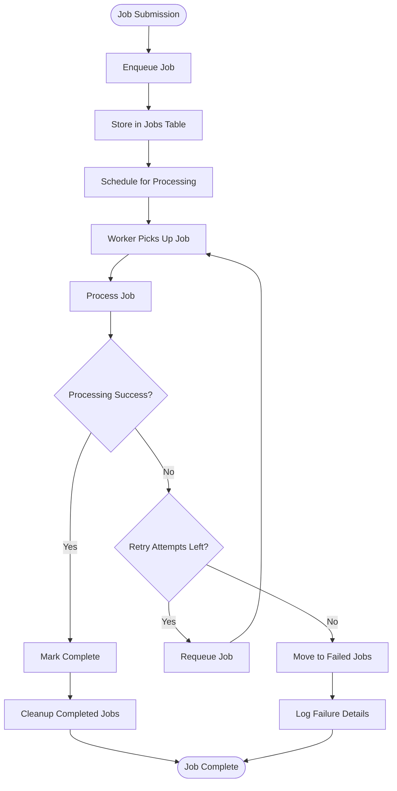
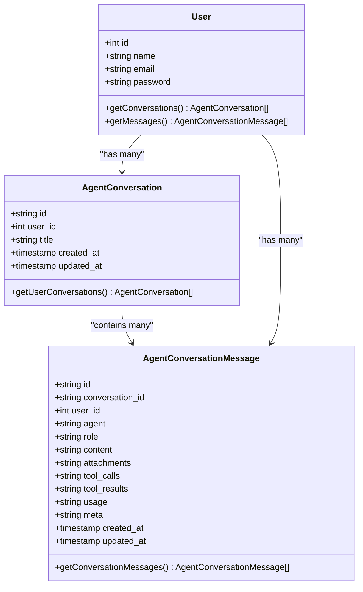
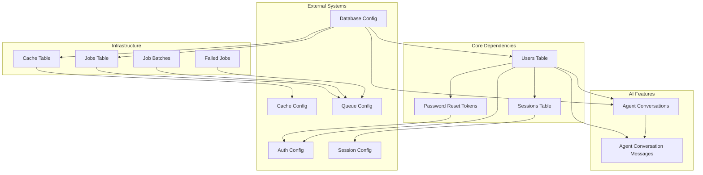

# Database Schema Design

<cite>
**Referenced Files in This Document**
- [0001_01_01_000000_create_users_table.php](file://database/migrations/0001_01_01_000000_create_users_table.php)
- [0001_01_01_000001_create_cache_table.php](file://database/migrations/0001_01_01_000001_create_cache_table.php)
- [0001_01_01_000002_create_jobs_table.php](file://database/migrations/0001_01_01_000002_create_jobs_table.php)
- [2026_04_02_115916_create_agent_conversations_table.php](file://database/migrations/2026_04_02_115916_create_agent_conversations_table.php)
- [User.php](file://app/Models/User.php)
- [UserFactory.php](file://database/factories/UserFactory.php)
- [DatabaseSeeder.php](file://database/seeders/DatabaseSeeder.php)
- [database.php](file://config/database.php)
- [auth.php](file://config/auth.php)
- [session.php](file://config/session.php)
- [cache.php](file://config/cache.php)
- [queue.php](file://config/queue.php)
</cite>

## Table of Contents
1. [Introduction](#introduction)
2. [Project Structure](#project-structure)
3. [Core Components](#core-components)
4. [Architecture Overview](#architecture-overview)
5. [Detailed Component Analysis](#detailed-component-analysis)
6. [Dependency Analysis](#dependency-analysis)
7. [Performance Considerations](#performance-considerations)
8. [Troubleshooting Guide](#troubleshooting-guide)
9. [Conclusion](#conclusion)

## Introduction
This document provides comprehensive database schema documentation for the Laravel Assistant application. It details the complete database structure including:
- Users table with authentication fields
- Password reset tokens table
- Sessions table for user session management
- Agent conversations table for AI interaction tracking
- Cache table for application caching
- Jobs table for background processing

The document explains field definitions, data types, primary keys, foreign keys, unique constraints, and indexes. It also describes the relationships between tables and how they support the application's core functionality, including authentication, session management, caching, queue processing, and AI conversation tracking.

## Project Structure
The database schema is defined through Laravel migrations located in the database/migrations directory. Configuration files in config/ define how Laravel interacts with the database, including authentication, session storage, caching, and queue processing.

**Diagram sources**
- [0001_01_01_000000_create_users_table.php:1-50](file://database/migrations/0001_01_01_000000_create_users_table.php#L1-L50)
- [0001_01_01_000001_create_cache_table.php:1-36](file://database/migrations/0001_01_01_000001_create_cache_table.php#L1-L36)
- [0001_01_01_000002_create_jobs_table.php:1-58](file://database/migrations/0001_01_01_000002_create_jobs_table.php#L1-L58)
- [2026_04_02_115916_create_agent_conversations_table.php:1-51](file://database/migrations/2026_04_02_115916_create_agent_conversations_table.php#L1-L51)
- [User.php:1-33](file://app/Models/User.php#L1-L33)
- [UserFactory.php:1-46](file://database/factories/UserFactory.php#L1-L46)
- [DatabaseSeeder.php:1-26](file://database/seeders/DatabaseSeeder.php#L1-L26)
- [database.php:1-185](file://config/database.php#L1-L185)
- [auth.php:1-118](file://config/auth.php#L1-L118)
- [session.php:1-234](file://config/session.php#L1-L234)
- [cache.php:1-131](file://config/cache.php#L1-L131)
- [queue.php:1-130](file://config/queue.php#L1-L130)

**Section sources**
- [0001_01_01_000000_create_users_table.php:1-50](file://database/migrations/0001_01_01_000000_create_users_table.php#L1-L50)
- [0001_01_01_000001_create_cache_table.php:1-36](file://database/migrations/0001_01_01_000001_create_cache_table.php#L1-L36)
- [0001_01_01_000002_create_jobs_table.php:1-58](file://database/migrations/0001_01_01_000002_create_jobs_table.php#L1-L58)
- [2026_04_02_115916_create_agent_conversations_table.php:1-51](file://database/migrations/2026_04_02_115916_create_agent_conversations_table.php#L1-L51)
- [User.php:1-33](file://app/Models/User.php#L1-L33)
- [UserFactory.php:1-46](file://database/factories/UserFactory.php#L1-L46)
- [DatabaseSeeder.php:1-26](file://database/seeders/DatabaseSeeder.php#L1-L26)
- [database.php:1-185](file://config/database.php#L1-L185)
- [auth.php:1-118](file://config/auth.php#L1-L118)
- [session.php:1-234](file://config/session.php#L1-L234)
- [cache.php:1-131](file://config/cache.php#L1-L131)
- [queue.php:1-130](file://config/queue.php#L1-L130)

## Core Components
This section documents each table in the database schema, including field definitions, data types, constraints, and indexes. It also explains how each table supports the application's core functionality.

### Users Table
The users table stores user account information and is central to Laravel's authentication system.

Field definitions:
- id: Auto-incrementing integer primary key
- name: String field for user's display name
- email: String field for user's email address (unique constraint)
- email_verified_at: Timestamp field indicating when email was verified (nullable)
- password: String field containing hashed password
- remember_token: String field for "remember me" functionality
- created_at: Timestamp for record creation
- updated_at: Timestamp for record updates

Constraints and indexes:
- Primary key on id
- Unique constraint on email
- Timestamps automatically managed by Laravel

Relationships:
- No foreign keys; serves as the base user model for authentication

Rationale:
- Follows Laravel's default authentication schema
- Uses hashed passwords for security
- Supports email verification workflow
- Provides remember token functionality for persistent sessions

**Section sources**
- [0001_01_01_000000_create_users_table.php:14-22](file://database/migrations/0001_01_01_000000_create_users_table.php#L14-L22)
- [User.php:13-31](file://app/Models/User.php#L13-L31)
- [UserFactory.php:25-34](file://database/factories/UserFactory.php#L25-L34)

### Password Reset Tokens Table
The password reset tokens table manages password reset requests and tokens.

Field definitions:
- email: String field serving as primary key (unique identifier for reset requests)
- token: String field containing the reset token
- created_at: Timestamp for token creation (nullable)

Constraints and indexes:
- Primary key on email
- Token field is not unique (multiple tokens can exist for the same email)
- No additional indexes

Relationships:
- No foreign keys; acts as a temporary storage for reset tokens

Rationale:
- Aligns with Laravel's password reset mechanism
- Uses email as the primary key to ensure one active reset token per user
- Supports configurable expiration and throttling through auth configuration

**Section sources**
- [0001_01_01_000000_create_users_table.php:24-28](file://database/migrations/0001_01_01_000000_create_users_table.php#L24-L28)
- [auth.php:95-102](file://config/auth.php#L95-L102)

### Sessions Table
The sessions table stores user session data for session-based authentication.

Field definitions:
- id: String field serving as primary key (session ID)
- user_id: Foreign ID referencing users table (nullable)
- ip_address: String field for client IP address (max length 45)
- user_agent: Text field for client user agent
- payload: Long text field containing serialized session data
- last_activity: Integer field storing Unix timestamp of last activity (indexed)

Constraints and indexes:
- Primary key on id
- user_id is indexed for performance
- last_activity is indexed for cleanup operations
- user_id is nullable to support guest sessions

Relationships:
- Foreign key relationship to users table via user_id

Rationale:
- Implements Laravel's database session driver
- Supports user identification and session persistence
- Indexes optimize session cleanup and user lookup
- Allows guest sessions without user association

**Section sources**
- [0001_01_01_000000_create_users_table.php:30-37](file://database/migrations/0001_01_01_000000_create_users_table.php#L30-L37)
- [session.php:21-89](file://config/session.php#L21-L89)

### Cache Table
The cache table provides database-backed caching for the application.

Field definitions:
- key: String field serving as primary key (cache key)
- value: Medium text field containing cached data
- expiration: Big integer field storing Unix timestamp expiration (indexed)

Constraints and indexes:
- Primary key on key
- expiration is indexed for efficient cleanup

Additional table:
- cache_locks: Separate table for distributed locking with:
  - key: String primary key
  - owner: String field identifying lock owner
  - expiration: Big integer indexed field

Relationships:
- No foreign keys; standalone caching infrastructure

Rationale:
- Implements Laravel's database cache driver
- Supports distributed caching and locking
- Indexed expiration enables efficient cache cleanup
- Separates locks from cache data for better organization

**Section sources**
- [0001_01_01_000001_create_cache_table.php:14-24](file://database/migrations/0001_01_01_000001_create_cache_table.php#L14-L24)
- [cache.php:42-48](file://config/cache.php#L42-L48)

### Jobs Table
The jobs table manages background job processing through Laravel's queue system.

Primary table - jobs:
- id: Auto-incrementing integer primary key
- queue: String field for queue name (indexed)
- payload: Long text field containing job data
- attempts: Unsigned tiny integer for retry count
- reserved_at: Unsigned integer timestamp for reservation (nullable)
- available_at: Unsigned integer timestamp for availability
- created_at: Unsigned integer timestamp for creation

Additional tables:
- job_batches: Batch job management with:
  - id: String primary key
  - name: String field
  - total_jobs: Integer for total job count
  - pending_jobs: Integer for remaining jobs
  - failed_jobs: Integer for failed job count
  - failed_job_ids: Long text containing failed job identifiers
  - options: Medium text for batch options (nullable)
  - cancelled_at: Integer timestamp for cancellation (nullable)
  - created_at: Integer timestamp for creation
  - finished_at: Integer timestamp for completion (nullable)
- failed_jobs: Failed job logging with:
  - id: Auto-incrementing integer primary key
  - uuid: String unique identifier
  - connection: Text field for queue connection
  - queue: Text field for queue name
  - payload: Long text field containing job data
  - exception: Long text field containing exception details
  - failed_at: Timestamp with default current time

Constraints and indexes:
- Primary keys on id for jobs and failed_jobs
- Unique constraint on uuid for failed_jobs
- Indexed queue field for job retrieval
- Indexed timestamps for scheduling and cleanup

Relationships:
- No explicit foreign keys; relies on string identifiers for associations

Rationale:
- Implements Laravel's database queue driver
- Supports job batching for coordinated processing
- Provides comprehensive failure tracking
- Optimized indexing for high-throughput job processing

**Section sources**
- [0001_01_01_000002_create_jobs_table.php:14-45](file://database/migrations/0001_01_01_000002_create_jobs_table.php#L14-L45)
- [queue.php:38-45](file://config/queue.php#L38-L45)

### Agent Conversations Table
The agent conversations table tracks AI interactions and conversation history.

Primary table - agent_conversations:
- id: String field (36 characters) serving as primary key
- user_id: Foreign ID referencing users table (nullable)
- title: String field for conversation title
- created_at: Timestamp for conversation creation
- updated_at: Timestamp for conversation updates

Indexes:
- Composite index on (user_id, updated_at) for efficient user conversation lists

Related table - agent_conversation_messages:
- id: String field (36 characters) serving as primary key
- conversation_id: String field (36 characters) indexed for message lookup
- user_id: Foreign ID referencing users table (nullable)
- agent: String field identifying the AI agent
- role: String field (max 25 characters) for message role (user, assistant, system)
- content: Text field containing message content
- attachments: Text field for attachment metadata
- tool_calls: Text field for tool invocation details
- tool_results: Text field for tool execution results
- usage: Text field for token usage metrics
- meta: Text field for additional metadata
- created_at: Timestamp for message creation
- updated_at: Timestamp for message updates

Indexes:
- Composite index on (conversation_id, user_id, updated_at) named "conversation_index"
- Individual index on user_id for user-specific message queries

Relationships:
- Foreign key relationship from agent_conversation_messages.user_id to users.id
- Foreign key relationship from agent_conversation_messages.conversation_id to agent_conversations.id
- Composite foreign key relationship from agent_conversations.user_id to users.id

Rationale:
- Designed for AI agent interactions with flexible message types
- Supports both authenticated and anonymous conversations
- Comprehensive indexing for efficient conversation and message retrieval
- Structured storage for tool interactions and usage metrics

**Section sources**
- [2026_04_02_115916_create_agent_conversations_table.php:14-39](file://database/migrations/2026_04_02_115916_create_agent_conversations_table.php#L14-L39)

## Architecture Overview
The database architecture follows Laravel's standard patterns while adding specialized tables for AI conversation tracking. The design emphasizes performance through strategic indexing and separation of concerns across authentication, session management, caching, queuing, and AI interaction tracking.

**Diagram sources**
- [0001_01_01_000000_create_users_table.php:14-37](file://database/migrations/0001_01_01_000000_create_users_table.php#L14-L37)
- [0001_01_01_000001_create_cache_table.php:14-24](file://database/migrations/0001_01_01_000001_create_cache_table.php#L14-L24)
- [0001_01_01_000002_create_jobs_table.php:14-45](file://database/migrations/0001_01_01_000002_create_jobs_table.php#L14-L45)
- [2026_04_02_115916_create_agent_conversations_table.php:14-39](file://database/migrations/2026_04_02_115916_create_agent_conversations_table.php#L14-L39)

## Detailed Component Analysis

### Authentication and Session Management Flow
The authentication system integrates multiple tables to provide secure user management and session persistence.

**Diagram sources**
- [0001_01_01_000000_create_users_table.php:14-37](file://database/migrations/0001_01_01_000000_create_users_table.php#L14-L37)
- [auth.php:95-102](file://config/auth.php#L95-L102)
- [session.php:21-89](file://config/session.php#L21-L89)
- [cache.php:42-48](file://config/cache.php#L42-L48)

### Queue Processing Architecture
The queue system handles background job processing with support for batching and failure tracking.

**Diagram sources**
- [0001_01_01_000002_create_jobs_table.php:14-45](file://database/migrations/0001_01_01_000002_create_jobs_table.php#L14-L45)
- [queue.php:38-45](file://config/queue.php#L38-L45)

### AI Conversation Tracking
The AI conversation system provides structured storage for agent interactions with comprehensive metadata.

**Diagram sources**
- [2026_04_02_115916_create_agent_conversations_table.php:14-39](file://database/migrations/2026_04_02_115916_create_agent_conversations_table.php#L14-L39)
- [User.php:13-31](file://app/Models/User.php#L13-L31)

**Section sources**
- [0001_01_01_000000_create_users_table.php:14-37](file://database/migrations/0001_01_01_000000_create_users_table.php#L14-L37)
- [0001_01_01_000001_create_cache_table.php:14-24](file://database/migrations/0001_01_01_000001_create_cache_table.php#L14-L24)
- [0001_01_01_000002_create_jobs_table.php:14-45](file://database/migrations/0001_01_01_000002_create_jobs_table.php#L14-L45)
- [2026_04_02_115916_create_agent_conversations_table.php:14-39](file://database/migrations/2026_04_02_115916_create_agent_conversations_table.php#L14-L39)
- [User.php:13-31](file://app/Models/User.php#L13-L31)

## Dependency Analysis
The database schema exhibits clear dependency relationships that support Laravel's modular architecture.

**Diagram sources**
- [0001_01_01_000000_create_users_table.php:14-37](file://database/migrations/0001_01_01_000000_create_users_table.php#L14-L37)
- [0001_01_01_000001_create_cache_table.php:14-24](file://database/migrations/0001_01_01_000001_create_cache_table.php#L14-L24)
- [0001_01_01_000002_create_jobs_table.php:14-45](file://database/migrations/0001_01_01_000002_create_jobs_table.php#L14-L45)
- [2026_04_02_115916_create_agent_conversations_table.php:14-39](file://database/migrations/2026_04_02_115916_create_agent_conversations_table.php#L14-L39)
- [database.php:1-185](file://config/database.php#L1-L185)
- [auth.php:1-118](file://config/auth.php#L1-L118)
- [session.php:1-234](file://config/session.php#L1-L234)
- [cache.php:1-131](file://config/cache.php#L1-L131)
- [queue.php:1-130](file://config/queue.php#L1-L130)

Key dependency observations:
- Users table is the foundation for authentication and session management
- Sessions depend on Users for user identification
- Password reset tokens depend on Users for email-based identification
- Cache and queue systems operate independently but integrate with the database configuration
- AI conversation tables depend on Users for user attribution
- All tables depend on database configuration for connectivity and behavior

**Section sources**
- [database.php:1-185](file://config/database.php#L1-L185)
- [auth.php:1-118](file://config/auth.php#L1-L118)
- [session.php:1-234](file://config/session.php#L1-L234)
- [cache.php:1-131](file://config/cache.php#L1-L131)
- [queue.php:1-130](file://config/queue.php#L1-L130)

## Performance Considerations
The database schema incorporates several performance optimizations:

Indexing Strategy:
- Sessions table includes indexes on user_id and last_activity for efficient cleanup and user lookup
- Cache table indexes expiration for timely cleanup operations
- Jobs table indexes queue for optimal job retrieval
- Agent conversations include composite indexes for user-specific queries
- Agent messages include composite indexes for conversation and user filtering

Data Type Selection:
- Uses appropriate integer sizes for timestamps (unsigned integers)
- Employs medium text for cache values to balance storage and performance
- Utilizes long text for job payloads and message content
- String lengths optimized for UUIDs (36 characters) and role constraints (25 characters)

Connection Management:
- Database configuration supports multiple connection types (SQLite, MySQL, PostgreSQL, SQL Server)
- Redis integration for caching and session storage
- Configurable connection pooling and timeouts

Storage Patterns:
- Separate cache and cache_locks tables for distributed locking
- Dedicated failed_jobs table for error tracking and monitoring
- Job batching for coordinated processing of multiple related jobs

## Troubleshooting Guide
Common database-related issues and their resolutions:

Authentication Issues:
- Verify users table has unique email constraint
- Check password reset tokens table for expired entries
- Ensure remember_token field is properly managed

Session Problems:
- Monitor sessions table for cleanup operations
- Verify user_id foreign key constraints
- Check last_activity index for performance issues

Cache Failures:
- Monitor cache expiration cleanup
- Verify cache_locks table for distributed locking conflicts
- Check database connection for cache operations

Queue Problems:
- Monitor failed_jobs table for error tracking
- Verify job_batches table for batch processing status
- Check queue index for job retrieval performance

AI Conversation Issues:
- Verify foreign key relationships between conversations and messages
- Check composite indexes for query performance
- Monitor user_id indexing for user-specific queries

**Section sources**
- [0001_01_01_000000_create_users_table.php:14-37](file://database/migrations/0001_01_01_000000_create_users_table.php#L14-L37)
- [0001_01_01_000001_create_cache_table.php:14-24](file://database/migrations/0001_01_01_000001_create_cache_table.php#L14-L24)
- [0001_01_01_000002_create_jobs_table.php:14-45](file://database/migrations/0001_01_01_000002_create_jobs_table.php#L14-L45)
- [2026_04_02_115916_create_agent_conversations_table.php:14-39](file://database/migrations/2026_04_02_115916_create_agent_conversations_table.php#L14-L39)

## Conclusion
The Laravel Assistant database schema demonstrates a well-architected design that aligns with Laravel's authentication and session management patterns while extending functionality for AI conversation tracking. The schema incorporates strategic indexing, appropriate data types, and clear dependency relationships that support both current functionality and future scalability.

Key design strengths include:
- Comprehensive authentication infrastructure with password reset support
- Efficient session management with proper indexing
- Robust caching system with distributed locking
- Scalable queue processing with batch and failure management
- Specialized AI conversation tracking with structured metadata storage

The schema follows Laravel conventions while providing the flexibility needed for AI-assisted development workflows. The configuration-driven approach ensures compatibility across different deployment environments and database systems.