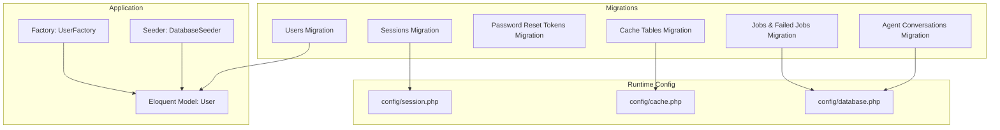
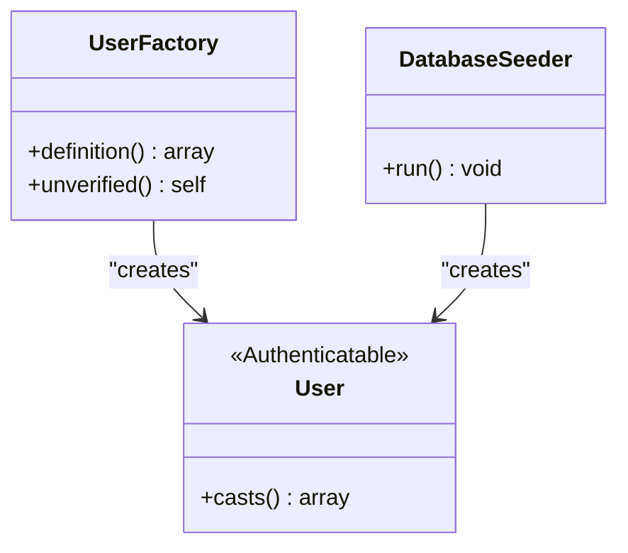
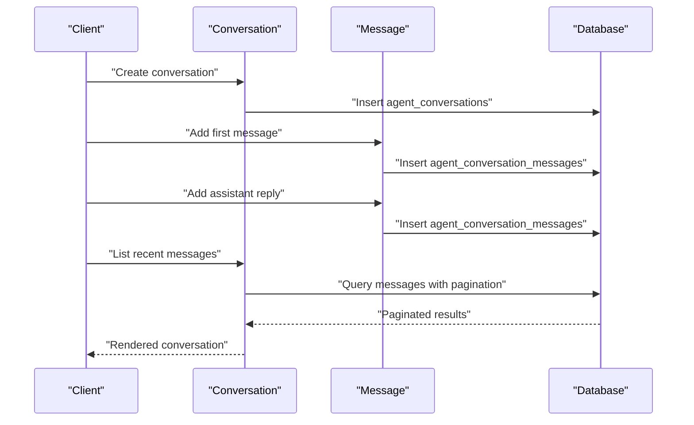
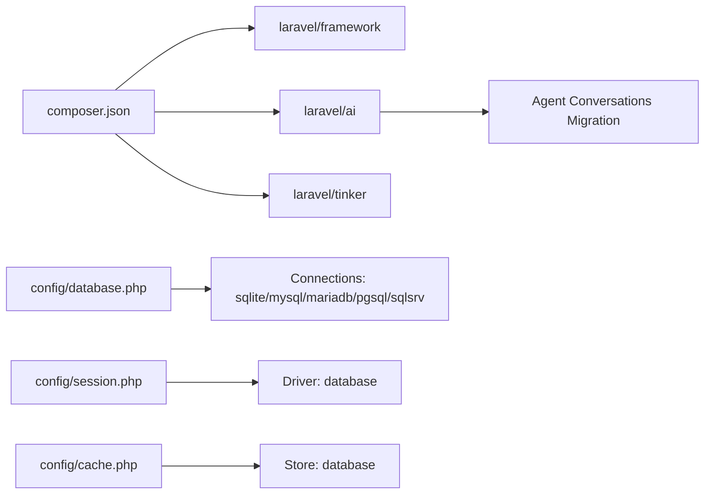

# Database and Data Management

<cite>
**Referenced Files in This Document**
- [0001_01_01_000000_create_users_table.php](file://database/migrations/0001_01_01_000000_create_users_table.php)
- [0001_01_01_000001_create_cache_table.php](file://database/migrations/0001_01_01_000001_create_cache_table.php)
- [0001_01_01_000002_create_jobs_table.php](file://database/migrations/0001_01_01_000002_create_jobs_table.php)
- [2026_04_02_115916_create_agent_conversations_table.php](file://database/migrations/2026_04_02_115916_create_agent_conversations_table.php)
- [User.php](file://app/Models/User.php)
- [UserFactory.php](file://database/factories/UserFactory.php)
- [DatabaseSeeder.php](file://database/seeders/DatabaseSeeder.php)
- [database.php](file://config/database.php)
- [session.php](file://config/session.php)
- [cache.php](file://config/cache.php)
- [composer.json](file://composer.json)
- [design.md](file://openspec/changes/devbot-ai-agent/design.md)
- [spec.md](file://openspec/changes/devbot-ai-agent/specs/conversation-storage/spec.md)
- [advanced-queries.md](file://.agents/skills/laravel-best-practices/rules/advanced-queries.md)
- [db-performance.md](file://.agents/skills/laravel-best-practices/rules/db-performance.md)
</cite>

## Table of Contents
1. [Introduction](#introduction)
2. [Project Structure](#project-structure)
3. [Core Components](#core-components)
4. [Architecture Overview](#architecture-overview)
5. [Detailed Component Analysis](#detailed-component-analysis)
6. [Dependency Analysis](#dependency-analysis)
7. [Performance Considerations](#performance-considerations)
8. [Troubleshooting Guide](#troubleshooting-guide)
9. [Conclusion](#conclusion)
10. [Appendices](#appendices)

## Introduction
This document provides comprehensive database and data management documentation for the Laravel Assistant application. It covers the database schema, migration system, factory and seeder patterns, session and cache storage, Eloquent model relationships, attribute casting, indexing strategies, and performance considerations. It also outlines data lifecycle, retention policies, access patterns, and security measures derived from the repository’s configuration and migration definitions.

## Project Structure
The database layer is organized around Laravel’s standard conventions:
- Migrations define the schema for users, sessions, password reset tokens, cache tables, jobs, failed jobs, job batches, and agent conversation tables.
- Eloquent models encapsulate business logic and relationships.
- Factories and seeders support development and testing data generation.
- Configuration files define database connections, session storage, and cache stores.



**Diagram sources**
- [0001_01_01_000000_create_users_table.php:14-37](file://database/migrations/0001_01_01_000000_create_users_table.php#L14-L37)
- [0001_01_01_000001_create_cache_table.php:14-24](file://database/migrations/0001_01_01_000001_create_cache_table.php#L14-L24)
- [0001_01_01_000002_create_jobs_table.php:14-45](file://database/migrations/0001_01_01_000002_create_jobs_table.php#L14-L45)
- [2026_04_02_115916_create_agent_conversations_table.php:14-39](file://database/migrations/2026_04_02_115916_create_agent_conversations_table.php#L14-L39)
- [User.php:15-32](file://app/Models/User.php#L15-L32)
- [UserFactory.php:25-44](file://database/factories/UserFactory.php#L25-L44)
- [DatabaseSeeder.php:16-24](file://database/seeders/DatabaseSeeder.php#L16-L24)
- [database.php:20-115](file://config/database.php#L20-L115)
- [session.php:21-89](file://config/session.php#L21-L89)
- [cache.php:18-48](file://config/cache.php#L18-L48)

**Section sources**
- [0001_01_01_000000_create_users_table.php:1-50](file://database/migrations/0001_01_01_000000_create_users_table.php#L1-L50)
- [0001_01_01_000001_create_cache_table.php:1-36](file://database/migrations/0001_01_01_000001_create_cache_table.php#L1-L36)
- [0001_01_01_000002_create_jobs_table.php:1-58](file://database/migrations/0001_01_01_000002_create_jobs_table.php#L1-L58)
- [2026_04_02_115916_create_agent_conversations_table.php:1-51](file://database/migrations/2026_04_02_115916_create_agent_conversations_table.php#L1-L51)
- [User.php:1-33](file://app/Models/User.php#L1-L33)
- [UserFactory.php:1-46](file://database/factories/UserFactory.php#L1-L46)
- [DatabaseSeeder.php:1-26](file://database/seeders/DatabaseSeeder.php#L1-L26)
- [database.php:1-185](file://config/database.php#L1-L185)
- [session.php:1-234](file://config/session.php#L1-L234)
- [cache.php:1-131](file://config/cache.php#L1-L131)

## Core Components
- Users table: Stores user identities, credentials, verification timestamps, and remember tokens.
- Password reset tokens table: Stores email-based tokens for secure password resets.
- Sessions table: Stores session metadata and payloads for database-backed sessions.
- Cache tables: Key-value and lock tables for database cache store.
- Jobs tables: Queue, batches, and failed jobs for asynchronous processing.
- Agent conversations tables: Conversations and messages for AI-assisted chat, including indexes optimized for user-scoped queries.

Key configuration highlights:
- Default connection is SQLite by default, with optional MySQL/MariaDB/PostgreSQL/SQLServer drivers.
- Session driver defaults to database with configurable table and lifetime.
- Cache store defaults to database with configurable table and lock table.

**Section sources**
- [0001_01_01_000000_create_users_table.php:14-37](file://database/migrations/0001_01_01_000000_create_users_table.php#L14-L37)
- [0001_01_01_000001_create_cache_table.php:14-24](file://database/migrations/0001_01_01_000001_create_cache_table.php#L14-L24)
- [0001_01_01_000002_create_jobs_table.php:14-45](file://database/migrations/0001_01_01_000002_create_jobs_table.php#L14-L45)
- [2026_04_02_115916_create_agent_conversations_table.php:14-39](file://database/migrations/2026_04_02_115916_create_agent_conversations_table.php#L14-L39)
- [database.php:20-115](file://config/database.php#L20-L115)
- [session.php:21-89](file://config/session.php#L21-L89)
- [cache.php:18-48](file://config/cache.php#L18-L48)

## Architecture Overview
The database architecture integrates:
- Relational tables for identity, sessions, cache, queues, and agent conversations.
- Eloquent models for domain logic and relationships.
- Factories and seeders for controlled data generation.
- Configuration-driven runtime behavior for sessions and cache.

```mermaid
erDiagram
USERS {
bigint id PK
string name
string email UK
timestamp email_verified_at
string password
string remember_token
timestamps created_at, updated_at
}
PASSWORD_RESET_TOKENS {
string email PK
string token
timestamp created_at
}
SESSIONS {
string id PK
bigint user_id FK
string ip_address
text user_agent
longtext payload
integer last_activity I
}
CACHE {
string key PK
mediumtext value
integer expiration I
}
CACHE_LOCKS {
string key PK
string owner
integer expiration I
}
JOBS {
bigint id PK
string queue I
longtext payload
tinyint attempts
integer reserved_at
integer available_at
integer created_at
}
JOB_BATCHES {
string id PK
string name
int total_jobs
int pending_jobs
int failed_jobs
longtext failed_job_ids
mediumtext options
integer cancelled_at
integer created_at
integer finished_at
}
FAILED_JOBS {
bigint id PK
string uuid UK
text connection
text queue
longtext payload
text exception
timestamp failed_at
}
AGENT_CONVERSATIONS {
string id PK
bigint user_id FK
string title
timestamps created_at, updated_at
}
AGENT_CONVERSATION_MESSAGES {
string id PK
string conversation_id FK
bigint user_id FK
string agent
string role
text content
text attachments
text tool_calls
text tool_results
text usage
text meta
timestamps created_at, updated_at
}
USERS ||--o{ SESSIONS : "authenticates"
USERS ||--o{ AGENT_CONVERSATIONS : "owns"
AGENT_CONVERSATIONS ||--o{ AGENT_CONVERSATION_MESSAGES : "contains"
```

**Diagram sources**
- [0001_01_01_000000_create_users_table.php:14-37](file://database/migrations/0001_01_01_000000_create_users_table.php#L14-L37)
- [0001_01_01_000001_create_cache_table.php:14-24](file://database/migrations/0001_01_01_000001_create_cache_table.php#L14-L24)
- [0001_01_01_000002_create_jobs_table.php:14-45](file://database/migrations/0001_01_01_000002_create_jobs_table.php#L14-L45)
- [2026_04_02_115916_create_agent_conversations_table.php:14-39](file://database/migrations/2026_04_02_115916_create_agent_conversations_table.php#L14-L39)

## Detailed Component Analysis

### Users and Authentication Entities
- Users table includes identity fields, verification timestamp, hashed password, and remember token.
- Password reset tokens table uses email as primary key for token management.
- Sessions table persists session identifiers, user associations, IP, user agent, serialized payload, and activity index for pruning.

Implementation notes:
- Eloquent model defines fillable and hidden attributes and applies casting for verification and password fields.
- Factories generate realistic default states and support unverified emails.
- Seeder creates a baseline user for development/testing.



**Diagram sources**
- [User.php:15-32](file://app/Models/User.php#L15-L32)
- [UserFactory.php:25-44](file://database/factories/UserFactory.php#L25-L44)
- [DatabaseSeeder.php:16-24](file://database/seeders/DatabaseSeeder.php#L16-L24)

**Section sources**
- [0001_01_01_000000_create_users_table.php:14-37](file://database/migrations/0001_01_01_000000_create_users_table.php#L14-L37)
- [User.php:13-32](file://app/Models/User.php#L13-L32)
- [UserFactory.php:25-44](file://database/factories/UserFactory.php#L25-L44)
- [DatabaseSeeder.php:16-24](file://database/seeders/DatabaseSeeder.php#L16-L24)

### Agent Conversations and Messages
- Conversations table stores conversation identifiers, optional user association, and title.
- Messages table stores message metadata, roles, content, attachments, tool artifacts, usage, and metadata, with composite indexes for efficient querying by user and conversation.

Operational context:
- The design decision documents specify relational storage for conversations and messages, enabling Eloquent relationships and filtering.
- Specification documents describe models, relationships, and pagination behavior for message retrieval.



**Diagram sources**
- [2026_04_02_115916_create_agent_conversations_table.php:14-39](file://database/migrations/2026_04_02_115916_create_agent_conversations_table.php#L14-L39)
- [design.md:30-41](file://openspec/changes/devbot-ai-agent/design.md#L30-L41)
- [spec.md:41-76](file://openspec/changes/devbot-ai-agent/specs/conversation-storage/spec.md#L41-L76)

**Section sources**
- [2026_04_02_115916_create_agent_conversations_table.php:14-39](file://database/migrations/2026_04_02_115916_create_agent_conversations_table.php#L14-L39)
- [design.md:30-41](file://openspec/changes/devbot-ai-agent/design.md#L30-L41)
- [spec.md:41-76](file://openspec/changes/devbot-ai-agent/specs/conversation-storage/spec.md#L41-L76)

### Sessions and Cache Storage
- Sessions are persisted to the sessions table with database driver enabled by default.
- Cache store can be backed by database tables with key/value and lock semantics.
- Jobs and failed jobs tables support asynchronous task processing.

Configuration highlights:
- Session lifetime, encryption, cookie attributes, and database table are configurable.
- Cache store supports database with separate lock table and configurable prefixes.

**Section sources**
- [session.php:21-232](file://config/session.php#L21-L232)
- [cache.php:18-101](file://config/cache.php#L18-L101)
- [0001_01_01_000001_create_cache_table.php:14-24](file://database/migrations/0001_01_01_000001_create_cache_table.php#L14-L24)
- [0001_01_01_000002_create_jobs_table.php:14-45](file://database/migrations/0001_01_01_000002_create_jobs_table.php#L14-L45)

## Dependency Analysis
- Composer dependencies include the Laravel AI SDK, which informs the agent conversation migration class.
- Runtime configuration drives connection selection, session driver, and cache store behavior.



**Diagram sources**
- [composer.json:11-26](file://composer.json#L11-L26)
- [database.php:20-115](file://config/database.php#L20-L115)
- [session.php:21-89](file://config/session.php#L21-L89)
- [cache.php:18-48](file://config/cache.php#L18-L48)
- [2026_04_02_115916_create_agent_conversations_table.php:5-5](file://database/migrations/2026_04_02_115916_create_agent_conversations_table.php#L5-L5)

**Section sources**
- [composer.json:11-26](file://composer.json#L11-L26)
- [database.php:20-115](file://config/database.php#L20-L115)
- [session.php:21-89](file://config/session.php#L21-L89)
- [cache.php:18-48](file://config/cache.php#L18-L48)

## Performance Considerations
Indexing and query strategies:
- Composite indexes on user-scoped queries enable efficient filtering and sorting.
- Correlated subqueries and selective aggregates reduce redundant queries.
- Cursor-based iteration minimizes memory footprint for large reads.
- Avoid queries in templates; pre-load with eager loading to prevent N+1.

Practical guidance:
- Use compound indexes matching ORDER BY column order.
- Prefer whereIn with subqueries over whereHas for index-friendly lookups.
- Use addSelect with correlated subqueries to fetch single values without loading entire relationships.

**Section sources**
- [2026_04_02_115916_create_agent_conversations_table.php:20-38](file://database/migrations/2026_04_02_115916_create_agent_conversations_table.php#L20-L38)
- [advanced-queries.md:81-106](file://.agents/skills/laravel-best-practices/rules/advanced-queries.md#L81-L106)
- [db-performance.md:152-192](file://.agents/skills/laravel-best-practices/rules/db-performance.md#L152-L192)

## Troubleshooting Guide
Common areas to inspect:
- Database connectivity and driver configuration in the default connection.
- Session driver and table configuration for database-backed sessions.
- Cache store configuration and table existence for database cache.
- Job and failed job table presence for queue processing.

Operational checks:
- Verify migrations have been executed for all tables.
- Confirm session and cache table names align with configuration.
- Review queue worker setup for job processing.

**Section sources**
- [database.php:20-115](file://config/database.php#L20-L115)
- [session.php:21-89](file://config/session.php#L21-L89)
- [cache.php:18-48](file://config/cache.php#L18-L48)
- [0001_01_01_000002_create_jobs_table.php:14-45](file://database/migrations/0001_01_01_000002_create_jobs_table.php#L14-L45)

## Conclusion
The Laravel Assistant database layer follows Laravel conventions with clear separation of concerns across migrations, models, factories, and configuration. The schema supports user authentication, session persistence, caching, queue processing, and agent conversation storage. Performance guidance emphasizes indexing, correlated subqueries, and cursor-based iteration. Security is addressed through attribute casting and hidden fields, with additional guidance for encrypted casts in sensitive contexts.

## Appendices

### Field Definitions and Constraints
- Users: auto-increment ID, unique email, nullable email verification timestamp, hashed password, remember token, timestamps.
- Password reset tokens: email as primary key, token string, optional creation timestamp.
- Sessions: session ID primary key, optional user ID with index, IP address, user agent, payload, last activity integer with index.
- Cache: key primary key, value, expiration with index.
- Jobs: queue indexed, payload, attempts, reserved/available timestamps, created timestamp.
- Job batches: batch identifiers, counts, failure tracking, options, timestamps.
- Failed jobs: unique UUID, connection/queue, payload, exception, failed timestamp.
- Agent conversations: UUID primary key, optional user ID, title, timestamps, composite index on user and updated_at.
- Agent conversation messages: UUID primary key, conversation ID indexed, optional user ID, agent identifier, role, content, attachments/tool artifacts/usage/meta, timestamps, composite index on conversation, user, and updated_at, additional user index.

**Section sources**
- [0001_01_01_000000_create_users_table.php:14-37](file://database/migrations/0001_01_01_000000_create_users_table.php#L14-L37)
- [0001_01_01_000001_create_cache_table.php:14-24](file://database/migrations/0001_01_01_000001_create_cache_table.php#L14-L24)
- [0001_01_01_000002_create_jobs_table.php:14-45](file://database/migrations/0001_01_01_000002_create_jobs_table.php#L14-L45)
- [2026_04_02_115916_create_agent_conversations_table.php:14-39](file://database/migrations/2026_04_02_115916_create_agent_conversations_table.php#L14-L39)

### Data Lifecycle and Retention Policies
- Sessions: lifetime governed by configuration; sweeping governed by lottery odds; database table configurable.
- Cache: expiration-based eviction; separate lock table for distributed locking.
- Jobs: attempts and reserved timestamps; failed jobs captured for diagnostics.
- Agent conversations/messages: timestamps maintained; composite indexes optimize user-scoped queries.

**Section sources**
- [session.php:35-117](file://config/session.php#L35-L117)
- [cache.php:18-48](file://config/cache.php#L18-L48)
- [0001_01_01_000002_create_jobs_table.php:14-45](file://database/migrations/0001_01_01_000002_create_jobs_table.php#L14-L45)
- [2026_04_02_115916_create_agent_conversations_table.php:20-38](file://database/migrations/2026_04_02_115916_create_agent_conversations_table.php#L20-L38)

### Data Access Patterns and Security Measures
- Eloquent models define fillable and hidden attributes; casting ensures consistent types.
- Attribute casting for passwords and verification timestamps.
- Additional guidance for encrypted casts for sensitive fields.

**Section sources**
- [User.php:13-32](file://app/Models/User.php#L13-L32)
- [db-performance.md:170-192](file://.agents/skills/laravel-best-practices/rules/db-performance.md#L170-L192)

### Migration Paths, Versioning, and Rollbacks
- Migrations are timestamped and executed in order; rollback removes tables in reverse.
- Migration repository table name is configurable.
- Composer scripts automate setup and migration execution.

**Section sources**
- [0001_01_01_000000_create_users_table.php:43-48](file://database/migrations/0001_01_01_000000_create_users_table.php#L43-L48)
- [0001_01_01_000001_create_cache_table.php:30-34](file://database/migrations/0001_01_01_000001_create_cache_table.php#L30-L34)
- [0001_01_01_000002_create_jobs_table.php:51-56](file://database/migrations/0001_01_01_000002_create_jobs_table.php#L51-L56)
- [2026_04_02_115916_create_agent_conversations_table.php:45-49](file://database/migrations/2026_04_02_115916_create_agent_conversations_table.php#L45-L49)
- [database.php:130-133](file://config/database.php#L130-L133)
- [composer.json:40-74](file://composer.json#L40-L74)