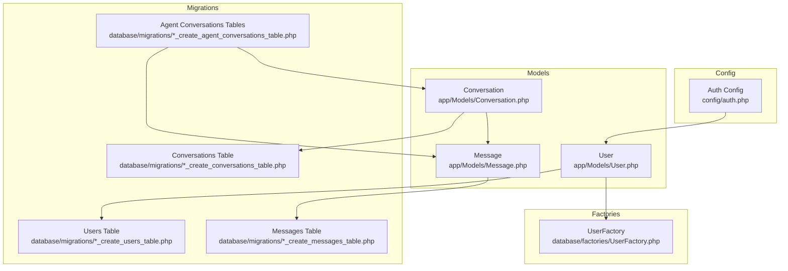
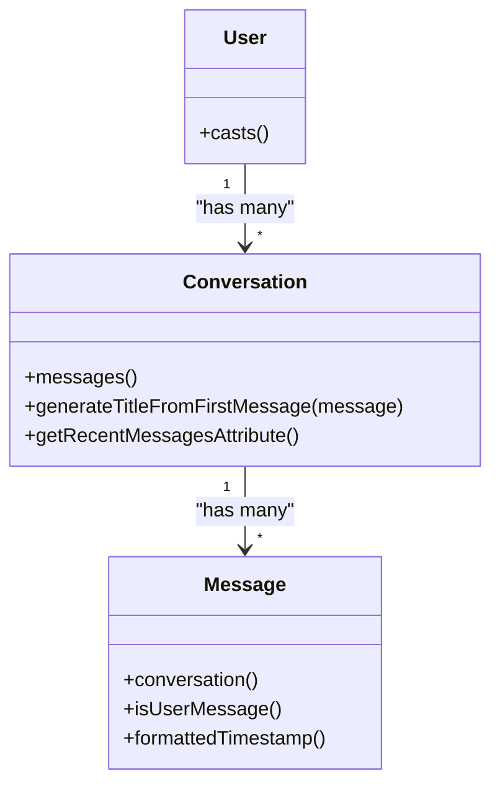
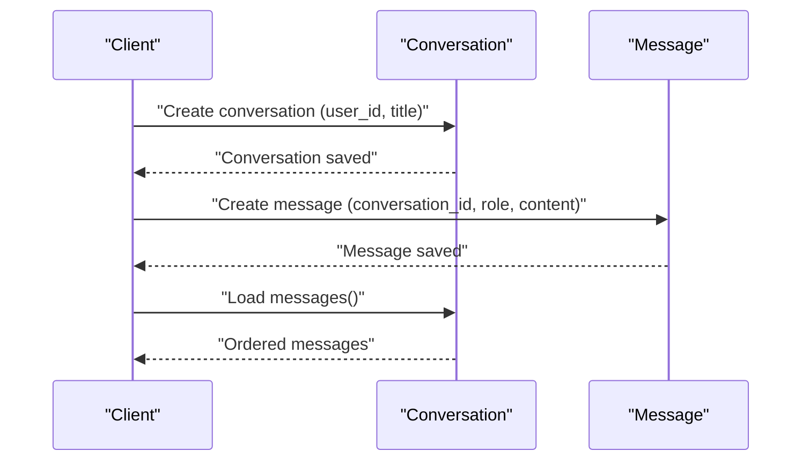
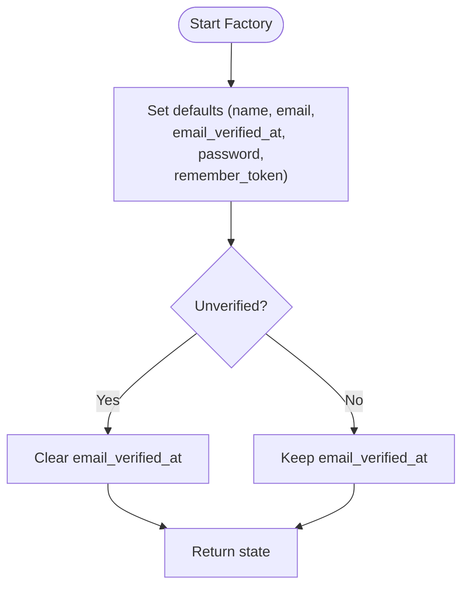
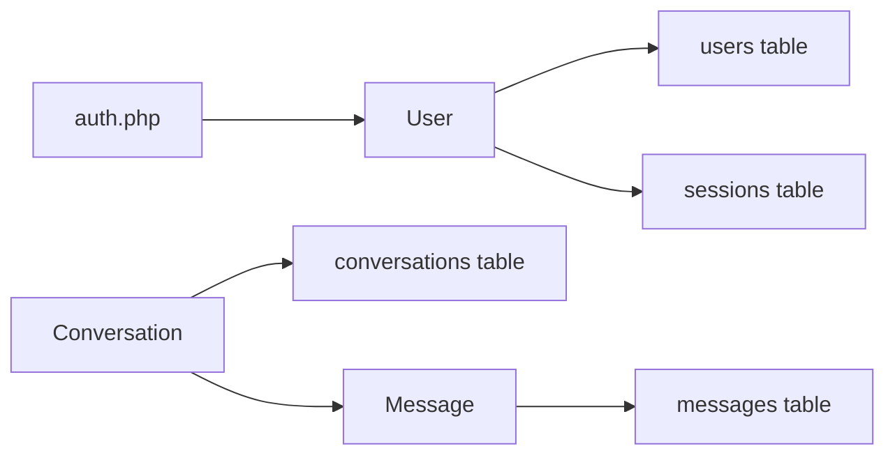

# Eloquent Models and Relationships

<cite>
**Referenced Files in This Document**
- [User.php](file://app/Models/User.php)
- [UserFactory.php](file://database/factories/UserFactory.php)
- [0001_01_01_000000_create_users_table.php](file://database/migrations/0001_01_01_000000_create_users_table.php)
- [2026_04_02_115916_create_agent_conversations_table.php](file://database/migrations/2026_04_02_115916_create_agent_conversations_table.php)
- [2026_04_02_123216_create_conversations_table.php](file://database/migrations/2026_04_02_123216_create_conversations_table.php)
- [2026_04_02_123238_create_messages_table.php](file://database/migrations/2026_04_02_123238_create_messages_table.php)
- [Conversation.php](file://app/Models/Conversation.php)
- [Message.php](file://app/Models/Message.php)
- [auth.php](file://config/auth.php)
- [web.php](file://routes/web.php)
</cite>

## Table of Contents
1. [Introduction](#introduction)
2. [Project Structure](#project-structure)
3. [Core Components](#core-components)
4. [Architecture Overview](#architecture-overview)
5. [Detailed Component Analysis](#detailed-component-analysis)
6. [Dependency Analysis](#dependency-analysis)
7. [Performance Considerations](#performance-considerations)
8. [Troubleshooting Guide](#troubleshooting-guide)
9. [Conclusion](#conclusion)

## Introduction
This document explains the Eloquent model implementation and relationships in the Laravel Assistant application. It focuses on the User model, authentication integration, attribute casting, hidden fields, factory patterns, and model relationships with conversations and messages. It also covers practical usage patterns, validation, performance optimization, and troubleshooting guidance grounded in the repository’s code.

## Project Structure
The application organizes Eloquent models under app/Models, database factories under database/factories, and migrations under database/migrations. Authentication configuration resides in config/auth.php, and routing is minimal in routes/web.php.

**Diagram sources**
- [User.php:1-33](file://app/Models/User.php#L1-L33)
- [Conversation.php:1-30](file://app/Models/Conversation.php#L1-L30)
- [Message.php:1-35](file://app/Models/Message.php#L1-L35)
- [UserFactory.php:1-46](file://database/factories/UserFactory.php#L1-L46)
- [0001_01_01_000000_create_users_table.php:1-50](file://database/migrations/0001_01_01_000000_create_users_table.php#L1-L50)
- [2026_04_02_123216_create_conversations_table.php:1-31](file://database/migrations/2026_04_02_123216_create_conversations_table.php#L1-L31)
- [2026_04_02_123238_create_messages_table.php:1-32](file://database/migrations/2026_04_02_123238_create_messages_table.php#L1-L32)
- [2026_04_02_115916_create_agent_conversations_table.php:1-51](file://database/migrations/2026_04_02_115916_create_agent_conversations_table.php#L1-L51)
- [auth.php:1-118](file://config/auth.php#L1-L118)

**Section sources**
- [User.php:1-33](file://app/Models/User.php#L1-L33)
- [UserFactory.php:1-46](file://database/factories/UserFactory.php#L1-L46)
- [0001_01_01_000000_create_users_table.php:1-50](file://database/migrations/0001_01_01_000000_create_users_table.php#L1-L50)
- [2026_04_02_123216_create_conversations_table.php:1-31](file://database/migrations/2026_04_02_123216_create_conversations_table.php#L1-L31)
- [2026_04_02_123238_create_messages_table.php:1-32](file://database/migrations/2026_04_02_123238_create_messages_table.php#L1-L32)
- [2026_04_02_115916_create_agent_conversations_table.php:1-51](file://database/migrations/2026_04_02_115916_create_agent_conversations_table.php#L1-L51)
- [auth.php:1-118](file://config/auth.php#L1-L118)
- [web.php:1-8](file://routes/web.php#L1-L8)

## Core Components
- User model
  - Extends the framework’s authenticatable base and integrates notifications.
  - Uses attributes-based fillable and hidden declarations.
  - Defines attribute casting for password hashing and email verification timestamps.
  - Associated factory is configured via HasFactory and a dedicated factory class.
- Conversation model
  - Defines fillable fields and a hasMany relationship to Message.
  - Includes helpers for generating titles and accessing recent messages.
- Message model
  - Defines fillable fields, role casting, and a belongsTo relationship to Conversation.
  - Provides helpers to identify user-originated messages and format timestamps.
- Factories
  - UserFactory generates realistic defaults, including hashed passwords and remember tokens, and supports an unverified state.
- Authentication configuration
  - Eloquent provider bound to the User model, with session guard and password reset token table configuration.

**Section sources**
- [User.php:13-31](file://app/Models/User.php#L13-L31)
- [UserFactory.php:25-44](file://database/factories/UserFactory.php#L25-L44)
- [Conversation.php:10-28](file://app/Models/Conversation.php#L10-L28)
- [Message.php:10-33](file://app/Models/Message.php#L10-L33)
- [auth.php:64-74](file://config/auth.php#L64-L74)

## Architecture Overview
The application uses Eloquent models to represent domain entities and relationships. Users are authenticated via the session guard and Eloquent provider. Conversations and messages form a nested relationship, while agent conversation tables provide an alternate AI-focused structure. Factories seed test data and demonstrate relationship seeding strategies.

**Diagram sources**
- [User.php:15-31](file://app/Models/User.php#L15-L31)
- [Conversation.php:15-18](file://app/Models/Conversation.php#L15-L18)
- [Message.php:20-33](file://app/Models/Message.php#L20-L33)

## Detailed Component Analysis

### User Model
- Authentication traits and configuration
  - Inherits from the framework’s authenticatable base class and uses the Notifiable trait.
  - Authentication provider is configured to use the Eloquent driver with the User model.
- Attribute casting and hidden fields
  - Password is cast to a hashed representation.
  - Email verification timestamp is cast to a datetime.
  - Sensitive fields (password, remember token) are hidden from serialization.
- Fillable properties
  - Whitelisted fields include name, email, and password.
- Factory integration
  - The HasFactory trait is used with a dedicated factory class.
- Email verification
  - The model does not currently require email verification at runtime; however, the email_verified_at column exists in the schema and is cast appropriately.

Practical usage examples
- Controllers and services typically resolve the authenticated user via the session guard and operate on the User model for retrieval, updates, and relationship access.
- Factories are used in tests to create users with consistent defaults and optional unverified states.

**Section sources**
- [User.php:13-31](file://app/Models/User.php#L13-L31)
- [auth.php:64-74](file://config/auth.php#L64-L74)
- [0001_01_01_000000_create_users_table.php:14-22](file://database/migrations/0001_01_01_000000_create_users_table.php#L14-L22)
- [UserFactory.php:25-44](file://database/factories/UserFactory.php#L25-L44)

### User-Session Associations
- Sessions table
  - The sessions table includes a foreign key to the users table and indexing for efficient lookup.
  - This enables associating HTTP sessions with authenticated users.
- Authentication guard
  - The session guard retrieves and persists the authenticated user via the Eloquent provider.

Usage pattern
- After login, the session is populated with the user identifier, enabling subsequent requests to resolve the current user.

**Section sources**
- [0001_01_01_000000_create_users_table.php:30-37](file://database/migrations/0001_01_01_000000_create_users_table.php#L30-L37)
- [auth.php:40-44](file://config/auth.php#L40-L44)

### Agent Conversation Ownership
- Agent conversation tables
  - The agent conversation schema includes a nullable user_id foreign key, allowing conversations to be associated with users.
  - Indexes on user_id and updated_at optimize queries for a user’s latest conversations.
- Practical implication
  - When a user initiates an agent conversation, set the user_id to tie ownership to the authenticated user.

**Section sources**
- [2026_04_02_115916_create_agent_conversations_table.php:14-21](file://database/migrations/2026_04_02_115916_create_agent_conversations_table.php#L14-L21)

### Conversation and Message Models
- Conversation model
  - Fillable fields include user_id and title.
  - Relationship to messages is ordered by creation time.
  - Helper to generate a title from the first message and an accessor to fetch recent messages.
- Message model
  - Fillable fields include conversation_id, role, and content.
  - Role is cast to a string; helper methods identify user-originated messages and format timestamps.
- Relationship direction
  - Messages belong to a single conversation; conversations have many messages.

**Diagram sources**
- [Conversation.php:15-18](file://app/Models/Conversation.php#L15-L18)
- [Message.php:20-23](file://app/Models/Message.php#L20-L23)

**Section sources**
- [Conversation.php:10-28](file://app/Models/Conversation.php#L10-L28)
- [Message.php:10-33](file://app/Models/Message.php#L10-L33)
- [2026_04_02_123216_create_conversations_table.php:14-21](file://database/migrations/2026_04_02_123216_create_conversations_table.php#L14-L21)
- [2026_04_02_123238_create_messages_table.php:14-22](file://database/migrations/2026_04_02_123238_create_messages_table.php#L14-L22)

### Factory Patterns and Seeding Strategies
- UserFactory
  - Generates realistic defaults for name, email, email_verified_at, password, and remember_token.
  - Provides an unverified state by clearing the email verification timestamp.
  - Passwords are hashed securely using the framework’s hashing facility.
- Relationship seeding
  - Factories can be extended to create related records (e.g., create a user and their conversations/messages) in tests.
  - Use the factory’s state methods to vary attributes (e.g., verified/unverified) for comprehensive coverage.

**Diagram sources**
- [UserFactory.php:25-44](file://database/factories/UserFactory.php#L25-L44)

**Section sources**
- [UserFactory.php:25-44](file://database/factories/UserFactory.php#L25-L44)

### Model Events
- No explicit model events are defined in the User, Conversation, or Message models in the repository.
- Consider adding boot methods or registering observers for lifecycle hooks (e.g., before/after save, delete) if future requirements demand auditing or derived data maintenance.

[No sources needed since this section provides general guidance]

### Validation, Mutators, Accessors, and Query Scopes
- Validation
  - Validation logic is typically encapsulated in Form Request classes or controller-level validation. The repository demonstrates best practices for extracting validation into dedicated classes and using validated data for mass assignment.
- Mutators and accessors
  - No custom mutators or accessors are present in the User, Conversation, or Message models.
  - Accessors are used in Message to compute formatted timestamps and to detect user-originated messages.
- Query scopes
  - No local scopes are defined in the models. Consider adding scopes for common filters (e.g., recent conversations, user-owned items) to improve query readability and reuse.

**Section sources**
- [Message.php:30-33](file://app/Models/Message.php#L30-L33)

## Dependency Analysis
- Model-to-table dependencies
  - User depends on the users table schema and the sessions table for authentication.
  - Conversation depends on the conversations table and the messages table for nested relationships.
  - Message depends on the messages table and the Conversation model.
- Authentication dependencies
  - The auth configuration binds the Eloquent provider to the User model and sets the session guard.
- Routing and controllers
  - Minimal routing is present; controllers would typically resolve the authenticated user and interact with models.

**Diagram sources**
- [auth.php:64-74](file://config/auth.php#L64-L74)
- [User.php:15-31](file://app/Models/User.php#L15-L31)
- [Conversation.php:15-18](file://app/Models/Conversation.php#L15-L18)
- [Message.php:20-23](file://app/Models/Message.php#L20-L23)
- [0001_01_01_000000_create_users_table.php:14-37](file://database/migrations/0001_01_01_000000_create_users_table.php#L14-L37)
- [2026_04_02_123216_create_conversations_table.php:14-21](file://database/migrations/2026_04_02_123216_create_conversations_table.php#L14-L21)
- [2026_04_02_123238_create_messages_table.php:14-22](file://database/migrations/2026_04_02_123238_create_messages_table.php#L14-L22)

**Section sources**
- [auth.php:64-74](file://config/auth.php#L64-L74)
- [User.php:15-31](file://app/Models/User.php#L15-L31)
- [Conversation.php:15-18](file://app/Models/Conversation.php#L15-L18)
- [Message.php:20-23](file://app/Models/Message.php#L20-L23)

## Performance Considerations
- Eager loading
  - When retrieving conversations with messages, use eager loading to prevent N+1 query problems.
  - Example: load conversations with their messages preloaded to minimize round-trips.
- Relationship constraints
  - Use whereHas or whereBelongsTo to filter by related model presence or identity efficiently.
- Indexes
  - The conversations and messages tables include indexes on timestamps and foreign keys to accelerate common queries.
- Casting and serialization
  - Casting to datetime and hashed password reduces overhead and ensures consistent types.
- Hidden fields
  - Keeping sensitive fields hidden avoids unnecessary serialization costs.

[No sources needed since this section provides general guidance]

## Troubleshooting Guide
- Authentication issues
  - Ensure the session guard is configured and the Eloquent provider targets the User model.
  - Confirm the sessions table schema matches the guard expectations.
- Missing relationships
  - Verify foreign key constraints and indexes on related tables.
  - Confirm relationship method signatures and return types in models.
- Factory-generated data
  - If passwords appear invalid, confirm the factory hashes passwords and that the User model casts passwords to hashed.
- Email verification
  - If email verification is required, ensure the email_verified_at column is set appropriately and that the model’s casting aligns with expected behavior.

**Section sources**
- [auth.php:40-74](file://config/auth.php#L40-L74)
- [0001_01_01_000000_create_users_table.php:30-37](file://database/migrations/0001_01_01_000000_create_users_table.php#L30-L37)
- [UserFactory.php:31-32](file://database/factories/UserFactory.php#L31-L32)
- [User.php:25-31](file://app/Models/User.php#L25-L31)

## Conclusion
The Laravel Assistant application implements clean, secure Eloquent models with appropriate casting, hidden fields, and factory-driven data generation. Relationships between users, conversations, and messages are straightforward and extensible. Authentication is configured via the session guard and Eloquent provider. By leveraging eager loading, relationship constraints, and the existing schema indexes, the application can maintain strong performance and scalability as features evolve.