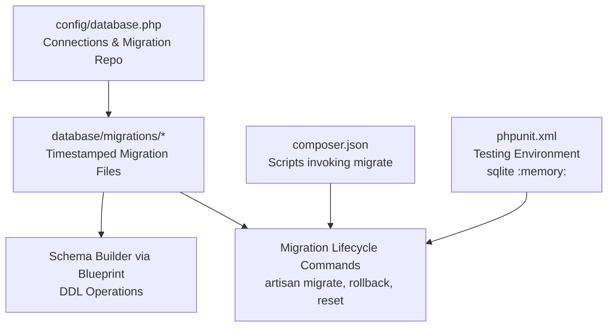
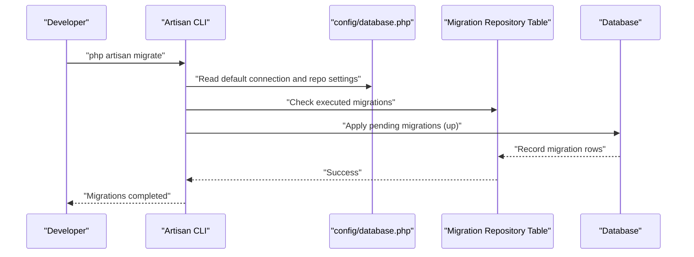
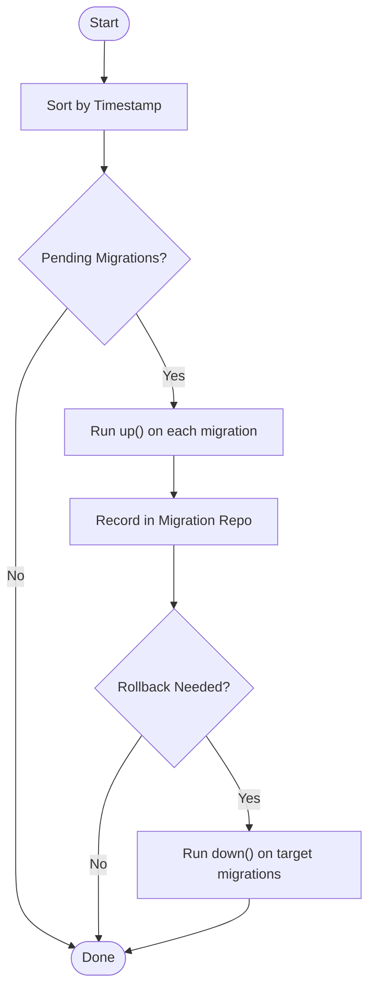
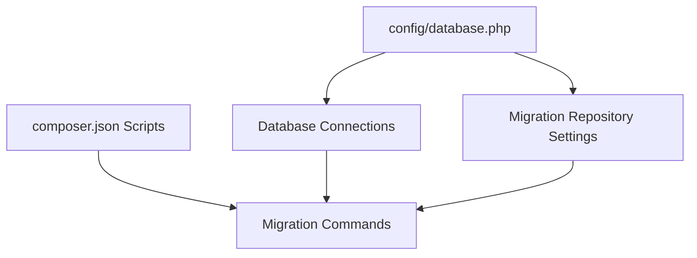

# Migration System and Database Evolution

<cite>
**Referenced Files in This Document**
- [0001_01_01_000000_create_users_table.php](file://database/migrations/0001_01_01_000000_create_users_table.php)
- [0001_01_01_000001_create_cache_table.php](file://database/migrations/0001_01_01_000001_create_cache_table.php)
- [0001_01_01_000002_create_jobs_table.php](file://database/migrations/0001_01_01_000002_create_jobs_table.php)
- [2026_04_02_115916_create_agent_conversations_table.php](file://database/migrations/2026_04_02_115916_create_agent_conversations_table.php)
- [database.php](file://config/database.php)
- [migrations.md](file://.agents/skills/laravel-best-practices/rules/migrations.md)
- [console.php](file://routes/console.php)
- [composer.json](file://composer.json)
- [DatabaseSeeder.php](file://database/seeders/DatabaseSeeder.php)
- [UserFactory.php](file://database/factories/UserFactory.php)
- [phpunit.xml](file://phpunit.xml)
</cite>

## Table of Contents
1. [Introduction](#introduction)
2. [Project Structure](#project-structure)
3. [Core Components](#core-components)
4. [Architecture Overview](#architecture-overview)
5. [Detailed Component Analysis](#detailed-component-analysis)
6. [Dependency Analysis](#dependency-analysis)
7. [Performance Considerations](#performance-considerations)
8. [Troubleshooting Guide](#troubleshooting-guide)
9. [Conclusion](#conclusion)
10. [Appendices](#appendices)

## Introduction
This document explains the Laravel migration system and database evolution strategies used in this project. It covers migration file structure, naming conventions, execution order, lifecycle (creation, running, rolling back, resetting), schema builder usage, best practices for maintainability and versioning, and production deployment considerations. It also includes testing strategies, environment-specific behaviors, and troubleshooting guidance.

## Project Structure
The migration system centers around the database/migrations directory and configuration in config/database.php. The project includes foundational tables for users, sessions, cache, jobs, and specialized agent conversation tables. Environment configuration drives database connectivity and migration repository behavior.

**Diagram sources**
- [database.php:130-133](file://config/database.php#L130-L133)
- [composer.json:44](file://composer.json#L44)
- [phpunit.xml:26-27](file://phpunit.xml#L26-L27)

**Section sources**
- [database.php:33-133](file://config/database.php#L33-L133)
- [composer.json:44](file://composer.json#L44)
- [phpunit.xml:26-27](file://phpunit.xml#L26-L27)

## Core Components
- Migration files define schema changes using the Schema Builder and Blueprint. Each migration encapsulates a reversible change with up() and down() methods.
- The migration repository table tracks which migrations have been executed.
- Configuration controls database connections and migration repository settings.
- Composer scripts automate initial migration execution during setup and project creation.
- Testing configuration uses sqlite in-memory database for fast, isolated test runs.

Key migration files in this project:
- Users, sessions, and password reset tokens
- Cache and cache locks
- Jobs, job batches, and failed jobs
- Agent conversations and messages with indexes and foreign keys

**Section sources**
- [0001_01_01_000000_create_users_table.php:12-48](file://database/migrations/0001_01_01_000000_create_users_table.php#L12-L48)
- [0001_01_01_000001_create_cache_table.php:12-34](file://database/migrations/0001_01_01_000001_create_cache_table.php#L12-L34)
- [0001_01_01_000002_create_jobs_table.php:12-56](file://database/migrations/0001_01_01_000002_create_jobs_table.php#L12-L56)
- [2026_04_02_115916_create_agent_conversations_table.php:12-49](file://database/migrations/2026_04_02_115916_create_agent_conversations_table.php#L12-L49)
- [database.php:130-133](file://config/database.php#L130-L133)
- [composer.json:44](file://composer.json#L44)
- [phpunit.xml:26-27](file://phpunit.xml#L26-L27)

## Architecture Overview
The migration lifecycle integrates with Laravel’s Artisan command system and the configured database connections. Migrations are applied in timestamp order, tracked in the migration repository table, and can be rolled back individually or en masse.

**Diagram sources**
- [database.php:20](file://config/database.php#L20)
- [database.php:130-133](file://config/database.php#L130-L133)

## Detailed Component Analysis

### Migration File Structure and Naming Conventions
- Timestamped filenames ensure deterministic execution order. Examples:
  - 0001_01_01_000000_create_users_table.php
  - 0001_01_01_000001_create_cache_table.php
  - 0001_01_01_000002_create_jobs_table.php
  - 2026_04_02_115916_create_agent_conversations_table.php
- Each migration returns a closure extending the Migration base class, implementing up() and down() methods.
- The AiMigration base class is used for specialized agent conversation migrations.

Best practices for naming and structure are documented in the project’s best practices guide.

**Section sources**
- [0001_01_01_000000_create_users_table.php:1-50](file://database/migrations/0001_01_01_000000_create_users_table.php#L1-L50)
- [0001_01_01_000001_create_cache_table.php:1-36](file://database/migrations/0001_01_01_000001_create_cache_table.php#L1-L36)
- [0001_01_01_000002_create_jobs_table.php:1-58](file://database/migrations/0001_01_01_000002_create_jobs_table.php#L1-L58)
- [2026_04_02_115916_create_agent_conversations_table.php:1-51](file://database/migrations/2026_04_02_115916_create_agent_conversations_table.php#L1-L51)
- [migrations.md:3-16](file://.agents/skills/laravel-best-practices/rules/migrations.md#L3-L16)

### Execution Order and Lifecycle
- Execution order is determined by filename timestamps. Earlier timestamps run first.
- Lifecycle stages:
  - Creation: Use Artisan to generate migrations with proper naming.
  - Running: Apply pending migrations via migrate.
  - Rolling back: Undo the last batch or specific migrations via rollback/reset.
  - Resetting: Fully revert and re-run migrations (use cautiously in production).
- Composer scripts demonstrate automated migration execution during setup and project creation.

**Diagram sources**
- [database.php:130-133](file://config/database.php#L130-L133)
- [composer.json:44](file://composer.json#L44)

**Section sources**
- [composer.json:44](file://composer.json#L44)
- [database.php:130-133](file://config/database.php#L130-L133)

### Schema Builder Methods and Patterns
Common patterns observed in the project’s migrations:
- Creating tables with Schema::create and defining columns via Blueprint.
- Adding primary keys, unique constraints, nullable timestamps, and indexes.
- Defining foreign keys and indexes on frequently queried columns.
- Dropping tables with Schema::dropIfExists in reverse operations.

Examples of schema operations visible in the migrations:
- Users table creation with unique email and remember token support.
- Sessions table with foreign key to users and indexes for performance.
- Jobs, job batches, and failed jobs with appropriate indexing and constraints.
- Agent conversations and messages with composite indexes and foreign keys.

**Section sources**
- [0001_01_01_000000_create_users_table.php:14-37](file://database/migrations/0001_01_01_000000_create_users_table.php#L14-L37)
- [0001_01_01_000001_create_cache_table.php:14-24](file://database/migrations/0001_01_01_000001_create_cache_table.php#L14-L24)
- [0001_01_01_000002_create_jobs_table.php:14-45](file://database/migrations/0001_01_01_000002_create_jobs_table.php#L14-L45)
- [2026_04_02_115916_create_agent_conversations_table.php:14-39](file://database/migrations/2026_04_02_115916_create_agent_conversations_table.php#L14-L39)

### Best Practices for Maintainable Migrations
- Always generate migrations with Artisan to ensure consistent naming and timestamps.
- Use constrained() for foreign keys to enforce referential integrity automatically.
- Never modify deployed migrations; create new migrations to adjust schema.
- Add indexes during table creation for columns used in WHERE, ORDER BY, and JOIN.
- Mirror database defaults in model attributes for predictable initial values.
- Implement reversible down() methods by default; clearly document intentionally irreversible changes.
- Keep migrations focused: separate DDL (schema) from DML (data) operations.

These practices are documented in the project’s best practices guide.

**Section sources**
- [migrations.md:3-16](file://.agents/skills/laravel-best-practices/rules/migrations.md#L3-L16)
- [migrations.md:18-27](file://.agents/skills/laravel-best-practices/rules/migrations.md#L18-L27)
- [migrations.md:29-45](file://.agents/skills/laravel-best-practices/rules/migrations.md#L29-L45)
- [migrations.md:47-70](file://.agents/skills/laravel-best-practices/rules/migrations.md#L47-L70)
- [migrations.md:72-84](file://.agents/skills/laravel-best-practices/rules/migrations.md#L72-L84)
- [migrations.md:86-97](file://.agents/skills/laravel-best-practices/rules/migrations.md#L86-L97)
- [migrations.md:101-121](file://.agents/skills/laravel-best-practices/rules/migrations.md#L101-L121)

### Data Transformations and Seeding
- Data seeding is handled separately via DatabaseSeeder and model factories.
- Factories define default states and optional states (e.g., unverified).
- Seeders orchestrate initial dataset creation for development and testing.

**Section sources**
- [DatabaseSeeder.php:16-24](file://database/seeders/DatabaseSeeder.php#L16-L24)
- [UserFactory.php:25-44](file://database/factories/UserFactory.php#L25-L44)

### Environment-Specific Migrations and Testing
- Default database connection is sqlite; testing uses sqlite with an in-memory database (:memory:).
- Migration repository table name is configurable and supports date updates on publish.
- Composer scripts run migrations during setup and project creation.

**Section sources**
- [database.php:20](file://config/database.php#L20)
- [database.php:130-133](file://config/database.php#L130-L133)
- [composer.json:44](file://composer.json#L44)
- [phpunit.xml:26-27](file://phpunit.xml#L26-L27)

### Production Deployment Considerations
- Treat already-run migrations as immutable; introduce new migrations for changes.
- Prefer reversible down() methods to enable safe rollbacks in CI and production failures.
- Keep migrations focused to avoid partial failures that leave inconsistent states.
- Use composer scripts to automate migrations during setup and deployment.

**Section sources**
- [migrations.md:29-45](file://.agents/skills/laravel-best-practices/rules/migrations.md#L29-L45)
- [migrations.md:86-97](file://.agents/skills/laravel-best-practices/rules/migrations.md#L86-L97)
- [migrations.md:101-121](file://.agents/skills/laravel-best-practices/rules/migrations.md#L101-L121)
- [composer.json:44](file://composer.json#L44)

## Dependency Analysis
The migration system depends on:
- config/database.php for connection settings and migration repository configuration.
- Composer scripts to run migrations during setup and project creation.
- Artisan console commands for migration lifecycle operations.

**Diagram sources**
- [database.php:20](file://config/database.php#L20)
- [database.php:130-133](file://config/database.php#L130-L133)
- [composer.json:44](file://composer.json#L44)

**Section sources**
- [database.php:20](file://config/database.php#L20)
- [database.php:130-133](file://config/database.php#L130-L133)
- [composer.json:44](file://composer.json#L44)

## Performance Considerations
- Add indexes during table creation to optimize queries on columns used in filtering, ordering, and joins.
- Use composite indexes where appropriate (e.g., multi-column indexes on user_id and updated_at).
- Keep migrations small and focused to minimize downtime and reduce risk.
- Prefer lazy refresh strategies in tests to avoid unnecessary full migrations runs.

[No sources needed since this section provides general guidance]

## Troubleshooting Guide
Common issues and resolutions:
- Partial failures: Keep DDL and DML in separate migrations to prevent inconsistent states.
- Irreversible changes: Clearly document intentionally irreversible migrations and provide forward-fix migrations.
- Foreign key constraint errors: Use constrained() for automatic naming and referential integrity.
- Indexing regressions: Add indexes during table creation; avoid post-hoc index additions in production.
- Test isolation: Use sqlite in-memory database for tests to ensure clean state and fast execution.

**Section sources**
- [migrations.md:101-121](file://.agents/skills/laravel-best-practices/rules/migrations.md#L101-L121)
- [migrations.md:18-27](file://.agents/skills/laravel-best-practices/rules/migrations.md#L18-L27)
- [migrations.md:47-70](file://.agents/skills/laravel-best-practices/rules/migrations.md#L47-L70)
- [phpunit.xml:26-27](file://phpunit.xml#L26-L27)

## Conclusion
This project demonstrates a robust migration strategy with timestamped migrations, reversible schema changes, and strong adherence to best practices. Configuration supports flexible environments, automated setup, and reliable testing. By following the outlined practices—generating migrations with Artisan, adding indexes at creation time, keeping migrations focused, and maintaining reversible down() methods—you can evolve the database safely and predictably across development, testing, and production environments.

[No sources needed since this section summarizes without analyzing specific files]

## Appendices

### Appendix A: Migration Commands Reference
- Create a new migration: use Artisan to generate migrations with proper naming and timestamps.
- Run migrations: apply pending migrations in timestamp order.
- Rollback: undo the last batch or specific migrations.
- Reset: revert and re-run all migrations (use carefully in production).

**Section sources**
- [migrations.md:3-16](file://.agents/skills/laravel-best-practices/rules/migrations.md#L3-L16)
- [composer.json:44](file://composer.json#L44)

### Appendix B: Example Migration Scenarios
- Creating foundational tables (users, sessions, cache, jobs) with appropriate constraints and indexes.
- Introducing specialized domain tables (agent conversations and messages) with composite indexes and foreign keys.
- Adding indexes and constraints incrementally via new migrations rather than modifying existing ones.

**Section sources**
- [0001_01_01_000000_create_users_table.php:14-37](file://database/migrations/0001_01_01_000000_create_users_table.php#L14-L37)
- [0001_01_01_000001_create_cache_table.php:14-24](file://database/migrations/0001_01_01_000001_create_cache_table.php#L14-L24)
- [0001_01_01_000002_create_jobs_table.php:14-45](file://database/migrations/0001_01_01_000002_create_jobs_table.php#L14-L45)
- [2026_04_02_115916_create_agent_conversations_table.php:14-39](file://database/migrations/2026_04_02_115916_create_agent_conversations_table.php#L14-L39)