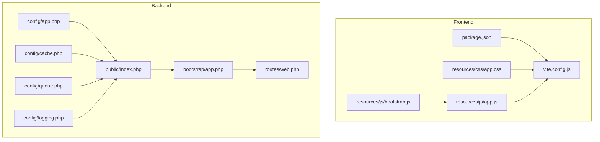
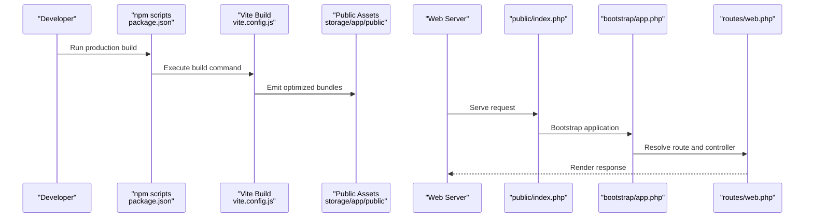
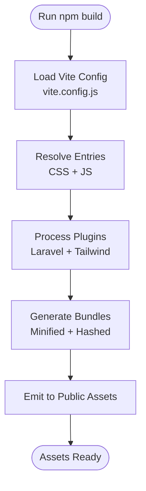
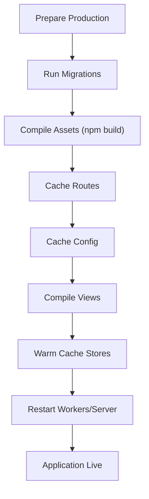
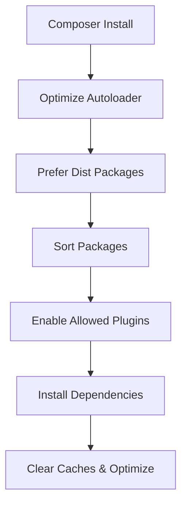
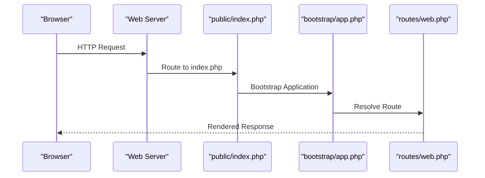
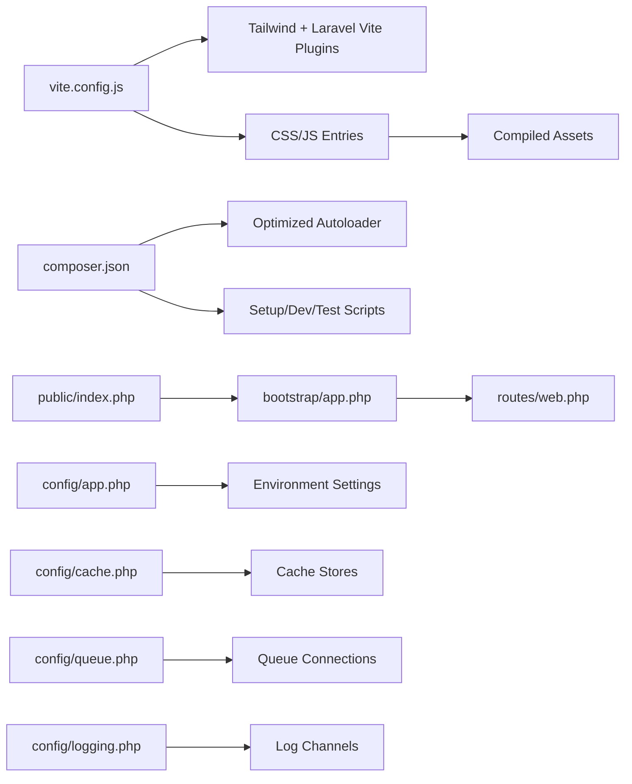

# Build and Optimization

<cite>
**Referenced Files in This Document**
- [vite.config.js](file://vite.config.js)
- [package.json](file://package.json)
- [composer.json](file://composer.json)
- [resources/css/app.css](file://resources/css/app.css)
- [resources/js/app.js](file://resources/js/app.js)
- [resources/js/bootstrap.js](file://resources/js/bootstrap.js)
- [public/index.php](file://public/index.php)
- [bootstrap/app.php](file://bootstrap/app.php)
- [config/app.php](file://config/app.php)
- [config/cache.php](file://config/cache.php)
- [config/queue.php](file://config/queue.php)
- [config/logging.php](file://config/logging.php)
- [routes/web.php](file://routes/web.php)
</cite>

## Table of Contents
1. [Introduction](#introduction)
2. [Project Structure](#project-structure)
3. [Core Components](#core-components)
4. [Architecture Overview](#architecture-overview)
5. [Detailed Component Analysis](#detailed-component-analysis)
6. [Dependency Analysis](#dependency-analysis)
7. [Performance Considerations](#performance-considerations)
8. [Troubleshooting Guide](#troubleshooting-guide)
9. [Conclusion](#conclusion)
10. [Appendices](#appendices)

## Introduction
This document explains how to prepare Laravel Assistant for production deployment with a focus on build and optimization. It covers the production asset compilation pipeline using Vite, Laravel application optimizations (route, config, and view compilation), Composer optimizations for production, and practical examples of build scripts and performance monitoring. It also addresses common build issues, optimization strategies for different deployment scenarios, and best practices for maintaining optimal performance in production.

## Project Structure
The build and optimization surface spans frontend assets, backend configuration, and Composer scripts. Key areas:
- Frontend build: Vite configuration and npm scripts
- Asset sources: Tailwind CSS and JavaScript entry points
- Backend bootstrapping and runtime: public/index.php and bootstrap/app.php
- Laravel configuration for production readiness: app, cache, queue, logging
- Routes and basic application wiring

**Diagram sources**
- [vite.config.js](file://vite.config.js)
- [package.json](file://package.json)
- [resources/css/app.css](file://resources/css/app.css)
- [resources/js/app.js](file://resources/js/app.js)
- [resources/js/bootstrap.js](file://resources/js/bootstrap.js)
- [public/index.php](file://public/index.php)
- [bootstrap/app.php](file://bootstrap/app.php)
- [config/app.php](file://config/app.php)
- [config/cache.php](file://config/cache.php)
- [config/queue.php](file://config/queue.php)
- [config/logging.php](file://config/logging.php)
- [routes/web.php](file://routes/web.php)

**Section sources**
- [vite.config.js](file://vite.config.js)
- [package.json](file://package.json)
- [resources/css/app.css](file://resources/css/app.css)
- [resources/js/app.js](file://resources/js/app.js)
- [resources/js/bootstrap.js](file://resources/js/bootstrap.js)
- [public/index.php](file://public/index.php)
- [bootstrap/app.php](file://bootstrap/app.php)
- [config/app.php](file://config/app.php)
- [config/cache.php](file://config/cache.php)
- [config/queue.php](file://config/queue.php)
- [config/logging.php](file://config/logging.php)
- [routes/web.php](file://routes/web.php)

## Core Components
- Vite build pipeline: Defines asset entry points and integrates Tailwind CSS for production builds.
- Laravel runtime bootstrap: Initializes the application, routes, middleware, and exceptions handling.
- Production configuration: Sets environment, debug mode, cache store, queue connections, and logging channels appropriate for production.
- Composer scripts: Provides development and setup scripts; production builds rely on npm scripts and Composer’s optimized autoloader.

Key production-ready settings and scripts:
- Environment defaults indicate production-focused configuration.
- Composer configuration enables optimized autoloader generation and preferred installation method.
- Vite script for production build is exposed via npm.

Practical examples (paths only):
- Production asset build: [package.json](file://package.json)
- Laravel application bootstrap: [bootstrap/app.php](file://bootstrap/app.php)
- Runtime entrypoint: [public/index.php](file://public/index.php)
- Composer configuration and scripts: [composer.json](file://composer.json)

**Section sources**
- [config/app.php](file://config/app.php)
- [config/cache.php](file://config/cache.php)
- [config/queue.php](file://config/queue.php)
- [config/logging.php](file://config/logging.php)
- [package.json](file://package.json)
- [composer.json](file://composer.json)
- [bootstrap/app.php](file://bootstrap/app.php)
- [public/index.php](file://public/index.php)

## Architecture Overview
The production build and runtime flow connects frontend asset compilation with Laravel’s request lifecycle.

**Diagram sources**
- [package.json](file://package.json)
- [vite.config.js](file://vite.config.js)
- [public/index.php](file://public/index.php)
- [bootstrap/app.php](file://bootstrap/app.php)
- [routes/web.php](file://routes/web.php)

## Detailed Component Analysis

### Vite Asset Compilation Pipeline
Production asset compilation uses Vite with Laravel plugin and Tailwind CSS integration. The configuration defines entry points and server behavior, while npm scripts expose the build command.

- Entry points: CSS and JS entries are declared for bundling.
- Plugins: Laravel Vite plugin and Tailwind CSS plugin are enabled.
- Server watch behavior: Views directory is excluded from watching to reduce overhead during development.

Optimization strategies:
- Minification and chunking are handled by Vite in production builds.
- Tailwind CSS purging is driven by the Tailwind plugin and configured sources in the CSS entry.
- Use environment-specific Vite configuration for CDN base paths and asset hashing if needed.

Practical examples (paths only):
- Vite configuration: [vite.config.js](file://vite.config.js)
- NPM build script: [package.json](file://package.json)
- CSS entry with Tailwind sources: [resources/css/app.css](file://resources/css/app.css)
- JS entry and bootstrap: [resources/js/app.js](file://resources/js/app.js), [resources/js/bootstrap.js](file://resources/js/bootstrap.js)

**Diagram sources**
- [vite.config.js](file://vite.config.js)
- [package.json](file://package.json)
- [resources/css/app.css](file://resources/css/app.css)
- [resources/js/app.js](file://resources/js/app.js)
- [resources/js/bootstrap.js](file://resources/js/bootstrap.js)

**Section sources**
- [vite.config.js](file://vite.config.js)
- [package.json](file://package.json)
- [resources/css/app.css](file://resources/css/app.css)
- [resources/js/app.js](file://resources/js/app.js)
- [resources/js/bootstrap.js](file://resources/js/bootstrap.js)

### Laravel Application Optimization for Production
Laravel provides built-in commands to optimize application performance in production. The recommended steps include:
- Route caching: Caches route definitions to avoid runtime discovery.
- Configuration caching: Preloads configuration to reduce disk reads.
- View compilation: Compiles Blade views into PHP for faster rendering.

These optimizations are typically executed during deployment after running migrations and asset builds.

Practical examples (paths only):
- Route caching command: [composer.json](file://composer.json)
- Config caching command: [composer.json](file://composer.json)
- View compilation command: [composer.json](file://composer.json)

**Diagram sources**
- [composer.json](file://composer.json)

**Section sources**
- [composer.json](file://composer.json)

### Composer Optimization for Production
Composer is configured for production-grade performance and reliability:
- Optimized autoloader: Enabled globally for faster class resolution.
- Preferred installation: Uses dist packages for smaller installs.
- Package sorting: Ensures deterministic installs.
- Plugin allowances: Enables specific development plugins.

Additional production steps:
- Install dependencies with production flags to exclude dev-only packages.
- Clear caches and optimize configuration after deployment.

Practical examples (paths only):
- Composer configuration: [composer.json](file://composer.json)
- Setup script invoking Composer install: [composer.json](file://composer.json)

**Diagram sources**
- [composer.json](file://composer.json)

**Section sources**
- [composer.json](file://composer.json)

### Request Lifecycle in Production
The production request lifecycle starts at the web server and reaches Laravel through the public entrypoint, which boots the application and resolves routes.

**Diagram sources**
- [public/index.php](file://public/index.php)
- [bootstrap/app.php](file://bootstrap/app.php)
- [routes/web.php](file://routes/web.php)

**Section sources**
- [public/index.php](file://public/index.php)
- [bootstrap/app.php](file://bootstrap/app.php)
- [routes/web.php](file://routes/web.php)

## Dependency Analysis
The build and runtime depend on coordinated configuration across frontend and backend:

- Vite depends on Tailwind CSS and Laravel Vite plugin; entries are defined in the Vite config.
- Laravel runtime depends on Composer autoload and configuration files.
- Production readiness depends on environment variables and cache/queue/log settings.

**Diagram sources**
- [vite.config.js](file://vite.config.js)
- [composer.json](file://composer.json)
- [public/index.php](file://public/index.php)
- [bootstrap/app.php](file://bootstrap/app.php)
- [routes/web.php](file://routes/web.php)
- [config/app.php](file://config/app.php)
- [config/cache.php](file://config/cache.php)
- [config/queue.php](file://config/queue.php)
- [config/logging.php](file://config/logging.php)

**Section sources**
- [vite.config.js](file://vite.config.js)
- [composer.json](file://composer.json)
- [public/index.php](file://public/index.php)
- [bootstrap/app.php](file://bootstrap/app.php)
- [routes/web.php](file://routes/web.php)
- [config/app.php](file://config/app.php)
- [config/cache.php](file://config/cache.php)
- [config/queue.php](file://config/queue.php)
- [config/logging.php](file://config/logging.php)

## Performance Considerations
- Use production builds for assets to enable minification and chunking.
- Choose appropriate cache stores (e.g., Redis or database) and configure prefixes for multi-instance deployments.
- Configure queue connections suited to workload (e.g., database or Redis) and monitor failed jobs.
- Enable appropriate logging channels and retention policies for production.
- Keep Composer configuration optimized and prefer dist packages for faster deployments.
- Warm caches and precompile views after deployment to minimize first-request latency.

[No sources needed since this section provides general guidance]

## Troubleshooting Guide
Common build and deployment issues and remedies:
- Assets not updating in production:
  - Ensure production build is run and compiled assets are served from the public directory.
  - Verify Vite configuration entries and Tailwind sources.
  - Confirm web server rewrite rules and public directory permissions.
  - References: [vite.config.js](file://vite.config.js), [resources/css/app.css](file://resources/css/app.css), [package.json](file://package.json)
- Slow initial requests:
  - Run route, config, and view caches after deployment.
  - Warm cache stores and queue workers.
  - References: [composer.json](file://composer.json), [config/cache.php](file://config/cache.php), [config/queue.php](file://config/queue.php)
- Logging and observability gaps:
  - Configure log channels and retention for production.
  - References: [config/logging.php](file://config/logging.php)
- Composer install failures:
  - Use production flags and ensure environment variables are set.
  - References: [composer.json](file://composer.json)

**Section sources**
- [vite.config.js](file://vite.config.js)
- [resources/css/app.css](file://resources/css/app.css)
- [package.json](file://package.json)
- [composer.json](file://composer.json)
- [config/cache.php](file://config/cache.php)
- [config/queue.php](file://config/queue.php)
- [config/logging.php](file://config/logging.php)

## Conclusion
Preparing Laravel Assistant for production involves a coordinated effort across frontend asset compilation with Vite and Tailwind, Laravel application optimizations, and Composer configuration tuned for performance. By following the build scripts, caching strategies, and operational configurations outlined here, teams can achieve reliable, fast, and maintainable production deployments.

[No sources needed since this section summarizes without analyzing specific files]

## Appendices
- Practical build scripts and commands:
  - Frontend build: [package.json](file://package.json)
  - Laravel optimizations: [composer.json](file://composer.json)
- Configuration references for production:
  - Application: [config/app.php](file://config/app.php)
  - Cache: [config/cache.php](file://config/cache.php)
  - Queue: [config/queue.php](file://config/queue.php)
  - Logging: [config/logging.php](file://config/logging.php)
- Runtime references:
  - Entry point: [public/index.php](file://public/index.php)
  - Bootstrap: [bootstrap/app.php](file://bootstrap/app.php)
  - Routes: [routes/web.php](file://routes/web.php)