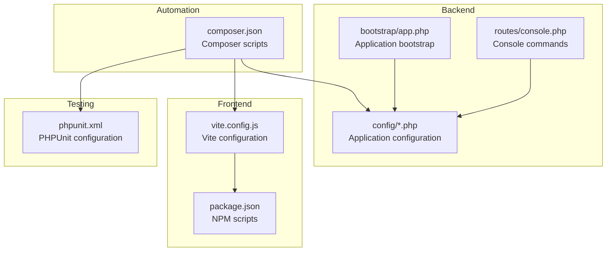
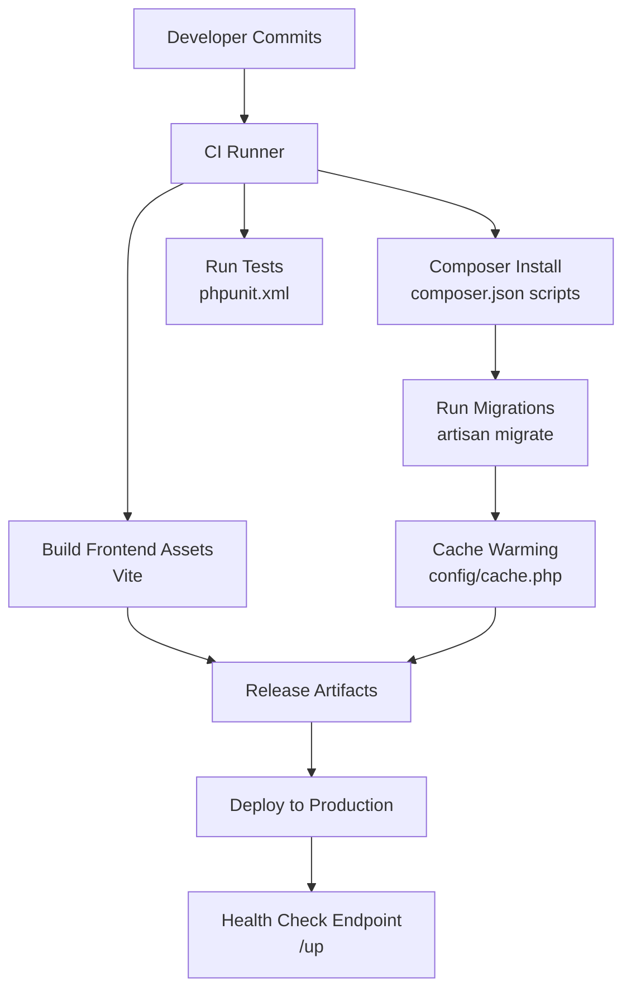
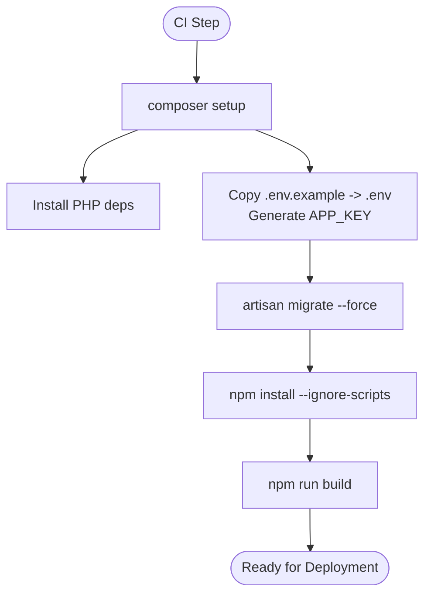
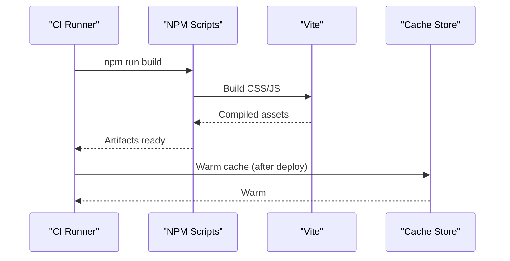
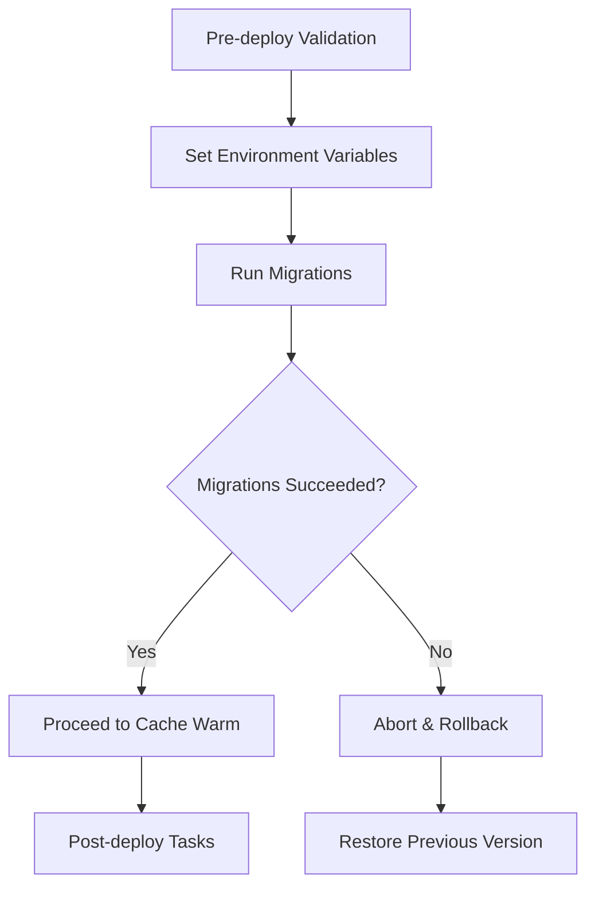
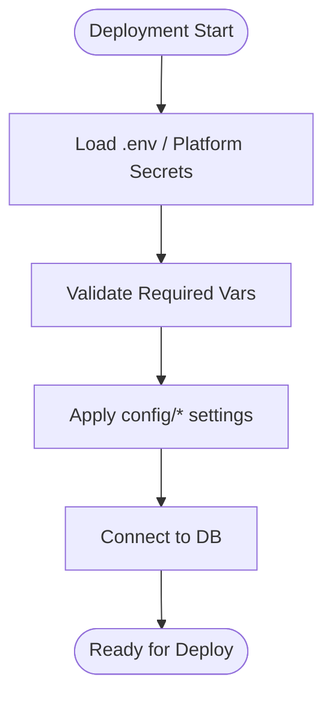
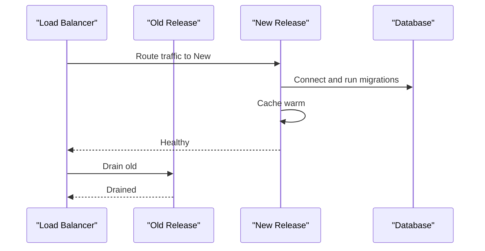
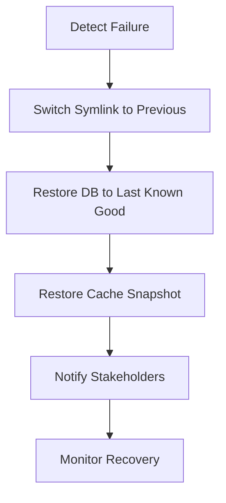
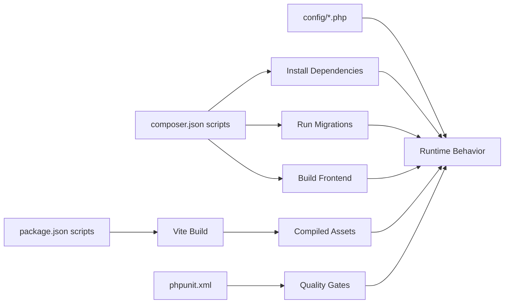

# Deployment Workflows

<cite>
**Referenced Files in This Document**
- [composer.json](file://composer.json)
- [package.json](file://package.json)
- [vite.config.js](file://vite.config.js)
- [phpunit.xml](file://phpunit.xml)
- [bootstrap/app.php](file://bootstrap/app.php)
- [config/app.php](file://config/app.php)
- [config/cache.php](file://config/cache.php)
- [config/database.php](file://config/database.php)
- [config/queue.php](file://config/queue.php)
- [routes/console.php](file://routes/console.php)
- [.claude/skills/laravel-best-practices/rules/config.md](file://.claude/skills/laravel-best-practices/rules/config.md)
- [.claude/skills/laravel-best-practices/rules/migrations.md](file://.claude/skills/laravel-best-practices/rules/migrations.md)
- [resources/views/welcome.blade.php](file://resources/views/welcome.blade.php)
</cite>

## Table of Contents
1. [Introduction](#introduction)
2. [Project Structure](#project-structure)
3. [Core Components](#core-components)
4. [Architecture Overview](#architecture-overview)
5. [Detailed Component Analysis](#detailed-component-analysis)
6. [Dependency Analysis](#dependency-analysis)
7. [Performance Considerations](#performance-considerations)
8. [Troubleshooting Guide](#troubleshooting-guide)
9. [Conclusion](#conclusion)
10. [Appendices](#appendices)

## Introduction
This document provides a comprehensive guide to automating and managing Laravel Assistant deployments to production environments. It covers CI/CD pipeline setup, automated deployment strategies, rollback procedures, deployment script creation, environment synchronization, database migration execution, and coordinated frontend/backend deployment processes including asset pre-compilation and cache warming. Practical examples reference existing scripts and configuration in the repository to help teams implement robust, repeatable, and low-risk deployment workflows.

## Project Structure
The repository follows a standard Laravel application layout with clear separation of concerns:
- Backend: Laravel application with configuration, routes, models, and service providers
- Frontend: Vite-powered assets (CSS/JS) configured via laravel-vite-plugin
- Testing: PHPUnit configuration for unit and feature tests
- Scripts: Composer scripts for setup, development, testing, and post-update actions

**Diagram sources**
- [composer.json:39-74](file://composer.json#L39-L74)
- [vite.config.js:1-19](file://vite.config.js#L1-L19)
- [package.json:1-18](file://package.json#L1-L18)
- [phpunit.xml:1-37](file://phpunit.xml#L1-L37)
- [bootstrap/app.php:1-19](file://bootstrap/app.php#L1-L19)
- [routes/console.php:1-9](file://routes/console.php#L1-L9)

**Section sources**
- [composer.json:39-74](file://composer.json#L39-L74)
- [vite.config.js:1-19](file://vite.config.js#L1-L19)
- [package.json:1-18](file://package.json#L1-L18)
- [phpunit.xml:1-37](file://phpunit.xml#L1-L37)
- [bootstrap/app.php:1-19](file://bootstrap/app.php#L1-L19)
- [routes/console.php:1-9](file://routes/console.php#L1-L9)

## Core Components
Key components for deployment automation:
- Composer scripts orchestrate installation, key generation, migrations, and asset builds
- NPM/Vite handles frontend asset compilation
- PHPUnit configuration defines testing behavior in CI contexts
- Laravel configuration files define environment-specific behavior (cache, queues, database)
- Bootstrap and route files define runtime behavior and health endpoint

Practical deployment implications:
- Use Composer scripts to standardize setup and build steps
- Separate frontend and backend build steps to enable independent rollouts
- Configure environment variables via platform secrets and avoid committing sensitive data
- Leverage Laravel’s built-in maintenance mode and health endpoint for safe deployments

**Section sources**
- [composer.json:39-74](file://composer.json#L39-L74)
- [package.json:5-8](file://package.json#L5-L8)
- [vite.config.js:6-12](file://vite.config.js#L6-L12)
- [phpunit.xml:20-35](file://phpunit.xml#L20-L35)
- [config/app.php:28-124](file://config/app.php#L28-L124)
- [config/cache.php:18-102](file://config/cache.php#L18-L102)
- [config/database.php:20-184](file://config/database.php#L20-L184)
- [config/queue.php:16-127](file://config/queue.php#L16-L127)
- [bootstrap/app.php:7-18](file://bootstrap/app.php#L7-L18)

## Architecture Overview
The deployment architecture integrates Composer-based backend automation, Vite-based frontend asset compilation, and Laravel configuration-driven runtime behavior. The following diagram maps actual files to deployment stages.

**Diagram sources**
- [composer.json:39-74](file://composer.json#L39-L74)
- [phpunit.xml:1-37](file://phpunit.xml#L1-L37)
- [vite.config.js:1-19](file://vite.config.js#L1-L19)
- [config/cache.php:18-102](file://config/cache.php#L18-L102)
- [bootstrap/app.php:11](file://bootstrap/app.php#L11)

## Detailed Component Analysis

### Composer Scripts for Deployment Automation
Composer scripts encapsulate repeatable deployment steps:
- setup: installs dependencies, prepares environment, generates keys, runs migrations, installs JS dependencies, and builds assets
- test: clears config cache and executes tests
- post-update-cmd: publishes vendor assets and updates boost
- post-create-project-cmd: generates app key, ensures SQLite exists, and migrates

Recommended usage in CI/CD:
- Use setup as the canonical initialization step for ephemeral runners
- Run test before deploy to gate releases
- Use post-update-cmd to keep vendor assets current after dependency updates

**Diagram sources**
- [composer.json:40-47](file://composer.json#L40-L47)

**Section sources**
- [composer.json:39-74](file://composer.json#L39-L74)

### Frontend Asset Pre-Compilation and Cache Warming
Frontend build pipeline:
- Vite compiles CSS/JS using laravel-vite-plugin
- NPM scripts define dev and build targets
- Tailwind integration is configured for CSS processing

Deployment strategy:
- Build assets in CI and upload artifacts or deploy compiled assets to production
- Warm caches after deployment to reduce initial latency

**Diagram sources**
- [package.json:5-8](file://package.json#L5-L8)
- [vite.config.js:6-12](file://vite.config.js#L6-L12)
- [config/cache.php:18-102](file://config/cache.php#L18-L102)

**Section sources**
- [package.json:1-18](file://package.json#L1-L18)
- [vite.config.js:1-19](file://vite.config.js#L1-L19)
- [config/cache.php:18-102](file://config/cache.php#L18-L102)

### Database Migration Execution During Deployment
Laravel’s migration configuration and environment variables drive safe, repeatable schema updates:
- Default connection is sqlite locally; production should override via environment variables
- Migration repository table and update-on-publish behavior are configurable
- Queue and cache backends are environment-driven

Deployment best practices:
- Always run migrations as part of the deployment pipeline
- Use graceful or force flags depending on environment
- Ensure rollback methods are implemented for reversible schema changes

**Diagram sources**
- [config/database.php:20-133](file://config/database.php#L20-L133)
- [composer.json:44](file://composer.json#L44)

**Section sources**
- [config/database.php:20-133](file://config/database.php#L20-L133)
- [composer.json:44](file://composer.json#L44)
- [.claude/skills/laravel-best-practices/rules/migrations.md:86-97](file://.claude/skills/laravel-best-practices/rules/migrations.md#L86-L97)

### Environment Synchronization and Secrets Management
Environment configuration:
- Application environment, debug, URL, timezone, locale, and maintenance mode are configured via environment variables
- Cache, database, and queue stores are driven by environment variables
- Maintenance mode driver and store are configurable

Secrets and best practices:
- Avoid committing secrets to version control
- Prefer platform-native secret stores and inject at runtime
- Use encrypted environment files for local development when necessary

**Diagram sources**
- [config/app.php:28-124](file://config/app.php#L28-L124)
- [config/cache.php:18-102](file://config/cache.php#L18-L102)
- [config/database.php:20-184](file://config/database.php#L20-L184)
- [config/queue.php:16-127](file://config/queue.php#L16-L127)
- [.claude/skills/laravel-best-practices/rules/config.md:21-40](file://.claude/skills/laravel-best-practices/rules/config.md#L21-L40)

**Section sources**
- [config/app.php:28-124](file://config/app.php#L28-L124)
- [config/cache.php:18-102](file://config/cache.php#L18-L102)
- [config/database.php:20-184](file://config/database.php#L20-L184)
- [config/queue.php:16-127](file://config/queue.php#L16-L127)
- [.claude/skills/laravel-best-practices/rules/config.md:21-40](file://.claude/skills/laravel-best-practices/rules/config.md#L21-L40)

### Zero-Downtime Deployment Strategies
Zero-downtime deployment requires careful sequencing:
- Use a release directory pattern and atomic symlink switching
- Pre-warm caches and compile assets before switching traffic
- Use maintenance mode or blue/green routing to minimize downtime
- Health check endpoint (/up) enables readiness probes

**Diagram sources**
- [bootstrap/app.php:11](file://bootstrap/app.php#L11)
- [config/cache.php:18-102](file://config/cache.php#L18-L102)
- [composer.json:44](file://composer.json#L44)

**Section sources**
- [bootstrap/app.php:11](file://bootstrap/app.php#L11)
- [config/cache.php:18-102](file://config/cache.php#L18-L102)
- [composer.json:44](file://composer.json#L44)

### Automated Testing in Deployment Pipelines
Testing in CI:
- PHPUnit configuration sets environment variables for a fast, isolated test run
- Testsuites include Unit and Feature directories
- Environment overrides ensure deterministic behavior

Deployment gating:
- Fail the pipeline on test failures
- Optionally run only subset of tests for quick feedback, then full suite on merge

**Section sources**
- [phpunit.xml:1-37](file://phpunit.xml#L1-L37)
- [composer.json:52-55](file://composer.json#L52-L55)

### Rollback Procedures
Rollback strategy:
- Maintain previous application version alongside new release
- Reverse migrations if necessary
- Restore previous cache and configuration snapshots
- Switch symlinks back to the previous release

**Diagram sources**
- [composer.json:44](file://composer.json#L44)
- [.claude/skills/laravel-best-practices/rules/migrations.md:86-97](file://.claude/skills/laravel-best-practices/rules/migrations.md#L86-L97)

**Section sources**
- [composer.json:44](file://composer.json#L44)
- [.claude/skills/laravel-best-practices/rules/migrations.md:86-97](file://.claude/skills/laravel-best-practices/rules/migrations.md#L86-L97)

### Monitoring Deployment Success
Monitoring checklist:
- Health endpoint (/up) should return success before switching traffic
- Post-deploy tests verify core functionality
- Cache warming reduces initial latency spikes
- Logging and metrics capture errors during deployment

**Section sources**
- [bootstrap/app.php:11](file://bootstrap/app.php#L11)
- [config/cache.php:18-102](file://config/cache.php#L18-L102)

## Dependency Analysis
The deployment pipeline depends on:
- Composer scripts to orchestrate installation, migrations, and asset builds
- NPM/Vite for frontend asset compilation
- Laravel configuration for environment-specific behavior
- PHPUnit for quality gates

**Diagram sources**
- [composer.json:39-74](file://composer.json#L39-L74)
- [package.json:5-8](file://package.json#L5-L8)
- [vite.config.js:6-12](file://vite.config.js#L6-L12)
- [phpunit.xml:1-37](file://phpunit.xml#L1-L37)
- [config/app.php:28-124](file://config/app.php#L28-L124)

**Section sources**
- [composer.json:39-74](file://composer.json#L39-L74)
- [package.json:5-8](file://package.json#L5-L8)
- [vite.config.js:6-12](file://vite.config.js#L6-L12)
- [phpunit.xml:1-37](file://phpunit.xml#L1-L37)
- [config/app.php:28-124](file://config/app.php#L28-L124)

## Performance Considerations
- Pre-warm caches after deployment to reduce cold-start latency
- Use optimized autoloaders and preferred install distributions
- Minimize downtime by compiling assets and warming caches in parallel
- Choose appropriate cache and queue backends for production workloads

[No sources needed since this section provides general guidance]

## Troubleshooting Guide
Common deployment issues and resolutions:
- Missing environment variables cause configuration failures; validate required variables before deploy
- Migration errors halt deployments; ensure rollback methods exist and test migrations in staging
- Asset build failures indicate missing dependencies; run npm install and rebuild
- Cache/store connectivity issues require verifying credentials and network access

**Section sources**
- [config/app.php:28-124](file://config/app.php#L28-L124)
- [config/cache.php:18-102](file://config/cache.php#L18-L102)
- [config/database.php:20-184](file://config/database.php#L20-L184)
- [config/queue.php:16-127](file://config/queue.php#L16-L127)
- [composer.json:44](file://composer.json#L44)

## Conclusion
By leveraging Composer scripts, Vite asset builds, and Laravel’s environment-driven configuration, teams can implement reliable, repeatable, and low-risk deployment workflows. Integrating automated testing, zero-downtime strategies, and robust rollback procedures ensures production stability while maintaining fast delivery cadence.

[No sources needed since this section summarizes without analyzing specific files]

## Appendices

### Practical Examples and References
- Deployment script creation: Use the setup script as the canonical initialization step for ephemeral environments
- Environment synchronization: Define environment variables via platform secrets and apply them consistently across config files
- Database migration execution: Run migrations as part of the deployment pipeline with proper rollback methods
- Automated testing: Gate deployments on test success using the existing PHPUnit configuration
- Frontend/backend coordination: Build assets in CI and warm caches after deployment; coordinate with backend migrations and configuration updates

**Section sources**
- [composer.json:40-47](file://composer.json#L40-L47)
- [phpunit.xml:1-37](file://phpunit.xml#L1-L37)
- [vite.config.js:6-12](file://vite.config.js#L6-L12)
- [config/database.php:20-133](file://config/database.php#L20-L133)
- [resources/views/welcome.blade.php:111-119](file://resources/views/welcome.blade.php#L111-L119)