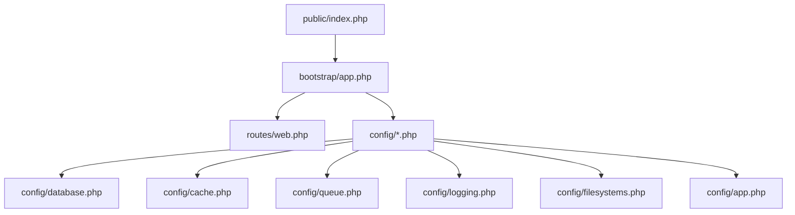
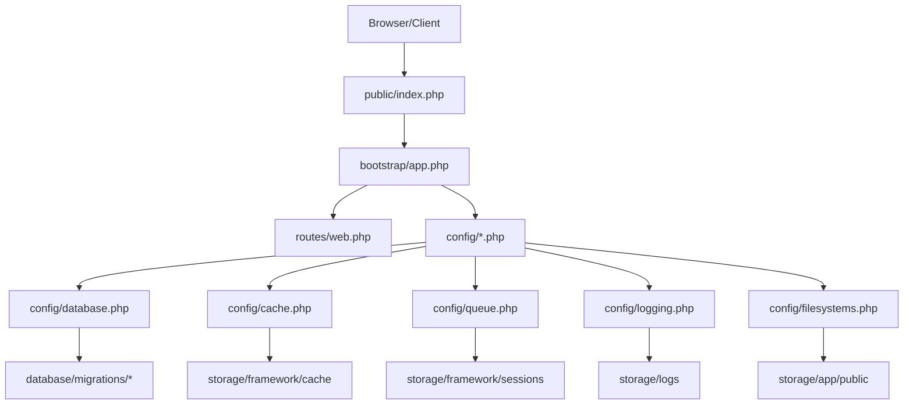
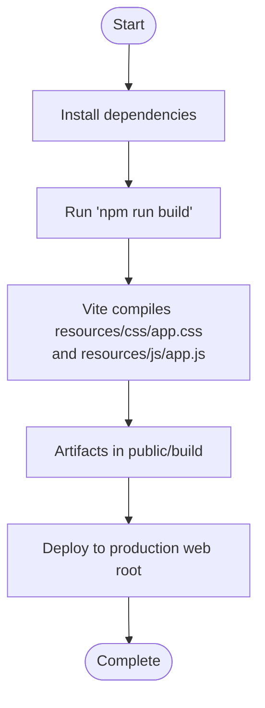
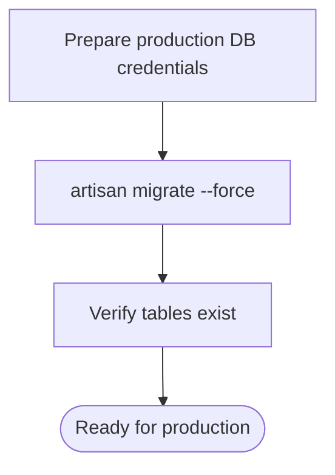
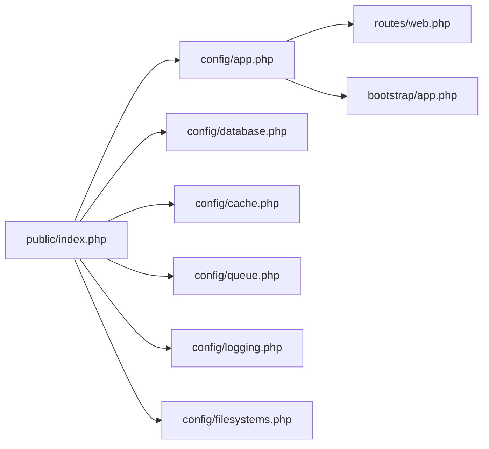

# Deployment and Production

<cite>
**Referenced Files in This Document**
- [composer.json](file://composer.json)
- [package.json](file://package.json)
- [vite.config.js](file://vite.config.js)
- [config/app.php](file://config/app.php)
- [config/cache.php](file://config/cache.php)
- [config/database.php](file://config/database.php)
- [config/queue.php](file://config/queue.php)
- [config/logging.php](file://config/logging.php)
- [config/filesystems.php](file://config/filesystems.php)
- [bootstrap/app.php](file://bootstrap/app.php)
- [routes/web.php](file://routes/web.php)
- [public/index.php](file://public/index.php)
- [database/migrations/0001_01_01_000000_create_users_table.php](file://database/migrations/0001_01_01_000000_create_users_table.php)
- [database/migrations/0001_01_01_000001_create_cache_table.php](file://database/migrations/0001_01_01_000001_create_cache_table.php)
- [database/migrations/0001_01_01_000002_create_jobs_table.php](file://database/migrations/0001_01_01_000002_create_jobs_table.php)
- [database/migrations/2026_04_02_115916_create_agent_conversations_table.php](file://database/migrations/2026_04_02_115916_create_agent_conversations_table.php)
</cite>

## Table of Contents
1. [Introduction](#introduction)
2. [Project Structure](#project-structure)
3. [Core Components](#core-components)
4. [Architecture Overview](#architecture-overview)
5. [Detailed Component Analysis](#detailed-component-analysis)
6. [Dependency Analysis](#dependency-analysis)
7. [Performance Considerations](#performance-considerations)
8. [Troubleshooting Guide](#troubleshooting-guide)
9. [Conclusion](#conclusion)
10. [Appendices](#appendices)

## Introduction
This document provides a comprehensive guide to deploying Laravel Assistant to production environments. It focuses on production environment setup, security hardening, performance optimization, production asset builds, database migrations, environment configuration management, CI/CD integration patterns, monitoring, caching strategies, and operational maintenance. It also explains the relationship between development and production configurations and outlines best practices for scaling, load balancing, and disaster recovery.

## Project Structure
Laravel Assistant follows a standard Laravel application layout with configuration under config/, runtime artifacts under storage/, public assets under public/, frontend assets under resources/, and database migrations under database/migrations/. The application boots through public/index.php, which delegates to bootstrap/app.php and routes/web.php for the default route.

**Diagram sources**
- [public/index.php:1-21](file://public/index.php#L1-L21)
- [bootstrap/app.php:1-19](file://bootstrap/app.php#L1-L19)
- [routes/web.php:1-8](file://routes/web.php#L1-L8)
- [config/app.php:1-127](file://config/app.php#L1-L127)
- [config/cache.php:1-131](file://config/cache.php#L1-L131)
- [config/database.php:1-185](file://config/database.php#L1-L185)
- [config/queue.php:1-130](file://config/queue.php#L1-L130)
- [config/logging.php:1-133](file://config/logging.php#L1-L133)
- [config/filesystems.php:1-81](file://config/filesystems.php#L1-L81)

**Section sources**
- [public/index.php:1-21](file://public/index.php#L1-L21)
- [bootstrap/app.php:1-19](file://bootstrap/app.php#L1-L19)
- [routes/web.php:1-8](file://routes/web.php#L1-L8)
- [config/app.php:1-127](file://config/app.php#L1-L127)

## Core Components
- Application bootstrap and routing: The application is bootstrapped via bootstrap/app.php and exposes a simple web route in routes/web.php.
- Configuration-driven behavior: Production behavior is governed by environment variables loaded through config/*.php files.
- Asset pipeline: Frontend assets are built with Vite using vite.config.js and package.json scripts.
- Database and migrations: SQLite is default in this skeleton; production typically uses MySQL/MariaDB/PostgreSQL with migrations under database/migrations/.
- Caching and queues: Configured via config/cache.php and config/queue.php respectively.
- Logging and filesystems: Centralized via config/logging.php and config/filesystems.php.

**Section sources**
- [bootstrap/app.php:1-19](file://bootstrap/app.php#L1-L19)
- [routes/web.php:1-8](file://routes/web.php#L1-L8)
- [config/app.php:1-127](file://config/app.php#L1-L127)
- [config/cache.php:1-131](file://config/cache.php#L1-L131)
- [config/queue.php:1-130](file://config/queue.php#L1-L130)
- [config/logging.php:1-133](file://config/logging.php#L1-L133)
- [config/filesystems.php:1-81](file://config/filesystems.php#L1-L81)
- [package.json:1-18](file://package.json#L1-L18)
- [vite.config.js:1-19](file://vite.config.js#L1-L19)

## Architecture Overview
The production runtime architecture centers on the front controller (public/index.php), the Laravel bootstrap (bootstrap/app.php), configuration-driven services, and persistent storage for cache, queues, logs, and assets.

**Diagram sources**
- [public/index.php:1-21](file://public/index.php#L1-L21)
- [bootstrap/app.php:1-19](file://bootstrap/app.php#L1-L19)
- [routes/web.php:1-8](file://routes/web.php#L1-L8)
- [config/database.php:1-185](file://config/database.php#L1-L185)
- [config/cache.php:1-131](file://config/cache.php#L1-L131)
- [config/queue.php:1-130](file://config/queue.php#L1-L130)
- [config/logging.php:1-133](file://config/logging.php#L1-L133)
- [config/filesystems.php:1-81](file://config/filesystems.php#L1-L81)
- [database/migrations/0001_01_01_000000_create_users_table.php:1-50](file://database/migrations/0001_01_01_000000_create_users_table.php#L1-L50)
- [database/migrations/0001_01_01_000001_create_cache_table.php:1-36](file://database/migrations/0001_01_01_000001_create_cache_table.php#L1-L36)
- [database/migrations/0001_01_01_000002_create_jobs_table.php:1-58](file://database/migrations/0001_01_01_000002_create_jobs_table.php#L1-L58)

## Detailed Component Analysis

### Production Environment Setup
- Environment variables: Configure APP_ENV, APP_DEBUG, APP_KEY, APP_URL, LOG_CHANNEL, LOG_LEVEL, and database credentials via environment files. The application reads these through config/*.php.
- Maintenance mode: Controlled via config/app.php maintenance driver and storage/framework/maintenance.php.
- Static assets: Build with npm scripts and Vite; ensure public/build is served by the web server.

Practical steps:
- Set APP_ENV=production and APP_DEBUG=false.
- Generate and securely store APP_KEY.
- Point APP_URL to your production domain.
- Configure LOG_CHANNEL and LOG_LEVEL for production logging.
- Choose appropriate CACHE_STORE, QUEUE_CONNECTION, and FILESYSTEM_DISK for production.

**Section sources**
- [config/app.php:29](file://config/app.php#L29)
- [config/app.php:42](file://config/app.php#L42)
- [config/app.php:100](file://config/app.php#L100)
- [config/app.php:121-124](file://config/app.php#L121-L124)
- [config/logging.php:21](file://config/logging.php#L21)
- [config/logging.php:64](file://config/logging.php#L64)
- [package.json:5-8](file://package.json#L5-L8)
- [vite.config.js:1-12](file://vite.config.js#L1-L12)

### Security Hardening
- Disable debug mode in production (APP_DEBUG=false).
- Enforce HTTPS and secure cookies by setting APP_URL to https and ensuring cookie security settings align with your reverse proxy/edge CDN.
- Rotate APP_KEY periodically; maintain previous keys during key rotation.
- Restrict filesystem permissions for storage/ and bootstrap/cache/.
- Use strong database credentials and network-level access restrictions.
- Harden logging output; avoid verbose logs in production.

Operational tips:
- Use a reverse proxy or CDN that terminates TLS and forwards X-Forwarded-* headers.
- Ensure storage/ is writable only by the web server user and not world-writable.
- Back up APP_KEY and previous keys securely.

**Section sources**
- [config/app.php:42](file://config/app.php#L42)
- [config/app.php:100-106](file://config/app.php#L100-L106)
- [config/logging.php:64](file://config/logging.php#L64)

### Performance Optimization Strategies
- Optimize autoload and Composer settings via composer.json configuration.
- Use a production cache store (e.g., Redis or database) and set CACHE_PREFIX appropriately.
- Tune queue workers and retry policies via config/queue.php.
- Enable long-term log rotation via daily logs.
- Serve static assets from a CDN or edge cache.

**Section sources**
- [composer.json:81-92](file://composer.json#L81-L92)
- [config/cache.php:18](file://config/cache.php#L18)
- [config/cache.php:115](file://config/cache.php#L115)
- [config/queue.php:16](file://config/queue.php#L16)
- [config/logging.php:68-74](file://config/logging.php#L68-L74)

### Production Asset Compilation
- Build assets for production using npm scripts defined in package.json.
- Vite configuration in vite.config.js specifies inputs and plugin chain.
- After building, deploy public/build artifacts and ensure your web server serves them.

**Diagram sources**
- [package.json:5-8](file://package.json#L5-L8)
- [vite.config.js:6-12](file://vite.config.js#L6-L12)

**Section sources**
- [package.json:5-8](file://package.json#L5-L8)
- [vite.config.js:1-19](file://vite.config.js#L1-L19)

### Database Migration Procedures
- Default connection is SQLite in this skeleton; switch to MySQL/MariaDB/PostgreSQL for production.
- Run migrations using Artisan; ensure database credentials are set via environment variables.
- Migrations are organized under database/migrations/.

**Diagram sources**
- [config/database.php:20](file://config/database.php#L20)
- [composer.json:44](file://composer.json#L44)
- [database/migrations/0001_01_01_000000_create_users_table.php:1-50](file://database/migrations/0001_01_01_000000_create_users_table.php#L1-L50)
- [database/migrations/0001_01_01_000001_create_cache_table.php:1-36](file://database/migrations/0001_01_01_000001_create_cache_table.php#L1-L36)
- [database/migrations/0001_01_01_000002_create_jobs_table.php:1-58](file://database/migrations/0001_01_01_000002_create_jobs_table.php#L1-L58)
- [database/migrations/2026_04_02_115916_create_agent_conversations_table.php:1-51](file://database/migrations/2026_04_02_115916_create_agent_conversations_table.php#L1-L51)

**Section sources**
- [config/database.php:20](file://config/database.php#L20)
- [composer.json:44](file://composer.json#L44)
- [database/migrations/0001_01_01_000000_create_users_table.php:1-50](file://database/migrations/0001_01_01_000000_create_users_table.php#L1-L50)
- [database/migrations/0001_01_01_000001_create_cache_table.php:1-36](file://database/migrations/0001_01_01_000001_create_cache_table.php#L1-L36)
- [database/migrations/0001_01_01_000002_create_jobs_table.php:1-58](file://database/migrations/0001_01_01_000002_create_jobs_table.php#L1-L58)
- [database/migrations/2026_04_02_115916_create_agent_conversations_table.php:1-51](file://database/migrations/2026_04_02_115916_create_agent_conversations_table.php#L1-L51)

### Environment Configuration Management
- Centralize environment-specific settings in .env and .env.example.
- Use config/*.php to translate environment variables into application behavior.
- Keep secrets out of version control; use CI/CD secret managers for deployment.

Key variables to review:
- Application: APP_ENV, APP_DEBUG, APP_KEY, APP_URL, LOG_CHANNEL, LOG_LEVEL
- Database: DB_CONNECTION, DB_HOST, DB_PORT, DB_DATABASE, DB_USERNAME, DB_PASSWORD
- Cache: CACHE_STORE, CACHE_PREFIX
- Queue: QUEUE_CONNECTION, REDIS_* for Redis-backed queues
- Filesystems: FILESYSTEM_DISK, AWS_* for S3

**Section sources**
- [config/app.php:16-106](file://config/app.php#L16-L106)
- [config/database.php:20-184](file://config/database.php#L20-L184)
- [config/cache.php:18-115](file://config/cache.php#L18-L115)
- [config/queue.php:16-127](file://config/queue.php#L16-L127)
- [config/logging.php:21-132](file://config/logging.php#L21-L132)
- [config/filesystems.php:16-80](file://config/filesystems.php#L16-L80)

### CI/CD Integration Patterns
- Composer install and setup: Use composer.json scripts to automate installation, key generation, migrations, and asset builds.
- Build pipeline:
  - Install PHP dependencies (Composer).
  - Install Node dependencies (npm).
  - Build assets (npm run build).
  - Run tests (optional).
  - Deploy artifacts to production servers.
- Secrets management: Inject environment variables and APP_KEY via CI/CD variables.

Recommended CI steps:
- composer install --no-dev --optimize-autoloader --prefer-dist
- npm ci
- npm run build
- php artisan config:cache
- php artisan route:cache
- php artisan view:cache
- php artisan migrate --force

**Section sources**
- [composer.json:39-74](file://composer.json#L39-L74)
- [package.json:5-8](file://package.json#L5-L8)
- [vite.config.js:1-19](file://vite.config.js#L1-L19)

### Monitoring Setup
- Logging: Configure LOG_CHANNEL and LOG_LEVEL; use daily logs for long retention.
- Health endpoint: The bootstrap registers a health check path (/up) for load balancers and monitoring systems.
- Metrics: Integrate application metrics via your platform’s monitoring stack or APM.

**Section sources**
- [config/logging.php:21](file://config/logging.php#L21)
- [config/logging.php:68-74](file://config/logging.php#L68-L74)
- [bootstrap/app.php:11](file://bootstrap/app.php#L11)

### Caching Strategies
- Default cache store is database; for production, prefer Redis or clustered cache.
- Set CACHE_PREFIX per environment to avoid cross-environment key collisions.
- Use cache locks for distributed locking when needed.

**Section sources**
- [config/cache.php:18](file://config/cache.php#L18)
- [config/cache.php:115](file://config/cache.php#L115)
- [database/migrations/0001_01_01_000001_create_cache_table.php:1-36](file://database/migrations/0001_01_01_000001_create_cache_table.php#L1-L36)

### Queue and Background Jobs
- Default queue connection is database; for production, use Redis or managed SQS.
- Configure retry_after, block_for, and max retries according to workload.
- Run dedicated queue workers behind a process supervisor.

**Section sources**
- [config/queue.php:16](file://config/queue.php#L16)
- [config/queue.php:38-90](file://config/queue.php#L38-L90)
- [database/migrations/0001_01_01_000002_create_jobs_table.php:1-58](file://database/migrations/0001_01_01_000002_create_jobs_table.php#L1-L58)

### Filesystems and Assets
- Local filesystems for private/public storage; for CDN distribution, configure S3-compatible disks.
- Ensure storage/app/public symlink is deployed if using the public disk.

**Section sources**
- [config/filesystems.php:16](file://config/filesystems.php#L16)
- [config/filesystems.php:33-61](file://config/filesystems.php#L33-L61)

### Maintenance Mode and Rollouts
- Maintenance mode is controlled via config/app.php and a maintenance file in storage/framework.
- Use rolling deployments and drain connections before taking instances out of rotation.

**Section sources**
- [config/app.php:121-124](file://config/app.php#L121-L124)
- [public/index.php:8-11](file://public/index.php#L8-L11)

## Dependency Analysis
The runtime depends on configuration-driven services and persistent storage. The following diagram maps key dependencies among configuration files and runtime entry points.

**Diagram sources**
- [public/index.php:1-21](file://public/index.php#L1-L21)
- [config/app.php:1-127](file://config/app.php#L1-L127)
- [config/database.php:1-185](file://config/database.php#L1-L185)
- [config/cache.php:1-131](file://config/cache.php#L1-L131)
- [config/queue.php:1-130](file://config/queue.php#L1-L130)
- [config/logging.php:1-133](file://config/logging.php#L1-L133)
- [config/filesystems.php:1-81](file://config/filesystems.php#L1-L81)
- [routes/web.php:1-8](file://routes/web.php#L1-L8)
- [bootstrap/app.php:1-19](file://bootstrap/app.php#L1-L19)

**Section sources**
- [public/index.php:1-21](file://public/index.php#L1-L21)
- [bootstrap/app.php:1-19](file://bootstrap/app.php#L1-L19)
- [routes/web.php:1-8](file://routes/web.php#L1-L8)
- [config/app.php:1-127](file://config/app.php#L1-L127)

## Performance Considerations
- Use opcode caching (OPcache) and optimize Composer autoload.
- Prefer Redis for cache and queues; tune connection and prefix settings.
- Serve static assets via CDN and enable long-term caching headers.
- Minimize view and route caching overhead; keep Blade templates lean.
- Monitor queue backlog and scale workers horizontally.

[No sources needed since this section provides general guidance]

## Troubleshooting Guide
Common issues and remedies:
- Application crashes on startup: Verify APP_KEY is set and valid; check maintenance file presence.
- Database connectivity errors: Confirm DB_* environment variables and connection type.
- Asset 404 errors: Rebuild assets with npm run build and redeploy public/build.
- Queue not processing: Ensure QUEUE_CONNECTION is set and workers are running; check failed jobs table.
- Excessive logs: Adjust LOG_LEVEL and enable daily rotation.

**Section sources**
- [public/index.php:8-11](file://public/index.php#L8-L11)
- [config/app.php:100](file://config/app.php#L100)
- [config/database.php:20](file://config/database.php#L20)
- [package.json:5-8](file://package.json#L5-L8)
- [config/queue.php:16](file://config/queue.php#L16)
- [database/migrations/0001_01_01_000002_create_jobs_table.php:37-58](file://database/migrations/0001_01_01_000002_create_jobs_table.php#L37-L58)
- [config/logging.php:68-74](file://config/logging.php#L68-L74)

## Conclusion
Deploying Laravel Assistant to production requires careful attention to environment configuration, security posture, caching, queues, logging, and asset delivery. Use the configuration files and scripts documented here to establish a robust, scalable, and observable production environment. Continuously monitor performance and reliability, and maintain secure, auditable change management practices.

[No sources needed since this section summarizes without analyzing specific files]

## Appendices

### A. Production Checklist
- Set APP_ENV=production and APP_DEBUG=false
- Generate and store APP_KEY securely
- Configure DB_* variables for target database
- Choose CACHE_STORE and set CACHE_PREFIX
- Configure QUEUE_CONNECTION and worker processes
- Set LOG_CHANNEL and LOG_LEVEL
- Build assets with npm run build
- Cache configuration, routes, and views
- Run migrations with --force
- Deploy storage/app/public symlink if used
- Configure CDN for static assets
- Set up health checks and monitoring

**Section sources**
- [config/app.php:29](file://config/app.php#L29)
- [config/app.php:42](file://config/app.php#L42)
- [config/app.php:100](file://config/app.php#L100)
- [config/database.php:20](file://config/database.php#L20)
- [config/cache.php:18](file://config/cache.php#L18)
- [config/cache.php:115](file://config/cache.php#L115)
- [config/queue.php:16](file://config/queue.php#L16)
- [config/logging.php:21](file://config/logging.php#L21)
- [package.json:5-8](file://package.json#L5-L8)
- [composer.json:56-63](file://composer.json#L56-L63)
- [composer.json:44](file://composer.json#L44)
- [config/filesystems.php:16](file://config/filesystems.php#L16)

### B. Scaling, Load Balancing, and Disaster Recovery
- Horizontal scaling: Run multiple application instances behind a load balancer; ensure shared cache/queue backends (Redis).
- Session handling: Use database or Redis for sessions to support multiple nodes.
- Disaster recovery: Back up databases, cache stores, and application code; test restore procedures regularly.
- Blue/green or canary deployments: Use health checks and gradual traffic shifting.

[No sources needed since this section provides general guidance]