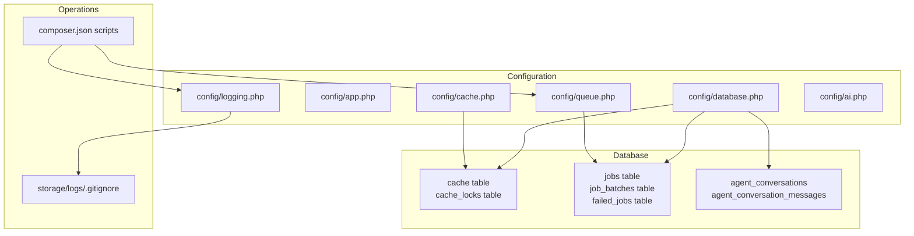
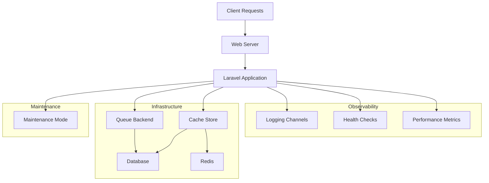
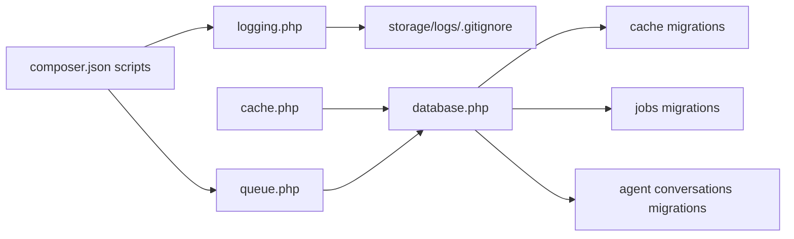

# Monitoring and Maintenance

<cite>
**Referenced Files in This Document**
- [logging.php](file://config/logging.php)
- [app.php](file://config/app.php)
- [cache.php](file://config/cache.php)
- [queue.php](file://config/queue.php)
- [database.php](file://config/database.php)
- [0001_01_01_000001_create_cache_table.php](file://database/migrations/0001_01_01_000001_create_cache_table.php)
- [0001_01_01_000002_create_jobs_table.php](file://database/migrations/0001_01_01_000002_create_jobs_table.php)
- [2026_04_02_115916_create_agent_conversations_table.php](file://database/migrations/2026_04_02_115916_create_agent_conversations_table.php)
- [composer.json](file://composer.json)
- [storage/logs/.gitignore](file://storage/logs/.gitignore)
- [ai.php](file://config/ai.php)
</cite>

## Table of Contents
1. [Introduction](#introduction)
2. [Project Structure](#project-structure)
3. [Core Components](#core-components)
4. [Architecture Overview](#architecture-overview)
5. [Detailed Component Analysis](#detailed-component-analysis)
6. [Dependency Analysis](#dependency-analysis)
7. [Performance Considerations](#performance-considerations)
8. [Troubleshooting Guide](#troubleshooting-guide)
9. [Conclusion](#conclusion)
10. [Appendices](#appendices)

## Introduction
This document provides a production-focused guide to monitor and maintain Laravel Assistant. It covers logging configuration, error tracking, performance monitoring, application health checks, database monitoring, queue worker management, maintenance procedures (cache clearing, log rotation, database cleanup), troubleshooting, alerting, backup and disaster recovery, and maintenance window planning. The guidance is grounded in the repository’s configuration and migration files to ensure accuracy and operational alignment.

## Project Structure
The monitoring and maintenance surface spans configuration files for logging, caching, queues, and databases, along with database migrations that define cache and queue infrastructure. Composer scripts provide development and operational helpers that can be adapted for production workflows.

**Diagram sources**
- [logging.php:1-133](file://config/logging.php#L1-L133)
- [app.php:1-127](file://config/app.php#L1-L127)
- [cache.php:1-131](file://config/cache.php#L1-L131)
- [queue.php:1-130](file://config/queue.php#L1-L130)
- [database.php:1-185](file://config/database.php#L1-L185)
- [0001_01_01_000001_create_cache_table.php:1-36](file://database/migrations/0001_01_01_000001_create_cache_table.php#L1-L36)
- [0001_01_01_000002_create_jobs_table.php:1-58](file://database/migrations/0001_01_01_000002_create_jobs_table.php#L1-L58)
- [2026_04_02_115916_create_agent_conversations_table.php:1-51](file://database/migrations/2026_04_02_115916_create_agent_conversations_table.php#L1-L51)
- [storage/logs/.gitignore:1-3](file://storage/logs/.gitignore#L1-L3)
- [composer.json:1-93](file://composer.json#L1-L93)

**Section sources**
- [logging.php:1-133](file://config/logging.php#L1-L133)
- [app.php:1-127](file://config/app.php#L1-L127)
- [cache.php:1-131](file://config/cache.php#L1-L131)
- [queue.php:1-130](file://config/queue.php#L1-L130)
- [database.php:1-185](file://config/database.php#L1-L185)
- [0001_01_01_000001_create_cache_table.php:1-36](file://database/migrations/0001_01_01_000001_create_cache_table.php#L1-L36)
- [0001_01_01_000002_create_jobs_table.php:1-58](file://database/migrations/0001_01_01_000002_create_jobs_table.php#L1-L58)
- [2026_04_02_115916_create_agent_conversations_table.php:1-51](file://database/migrations/2026_04_02_115916_create_agent_conversations_table.php#L1-L51)
- [storage/logs/.gitignore:1-3](file://storage/logs/.gitignore#L1-L3)
- [composer.json:1-93](file://composer.json#L1-L93)

## Core Components
- Logging: Centralized configuration for channels (stack, single, daily, slack, syslog, stderr, papertrail, errorlog, null), deprecation logging, and emergency fallback.
- Caching: Multi-store cache configuration including database, file, redis, memcached, dynamodb, octane, failover, and array.
- Queues: Unified queue configuration supporting sync, database, beanstalkd, sqs, redis, deferred, background, and failover; includes failed job storage.
- Database: Connection definitions for sqlite, mysql, mariadb, pgsql, sqlsrv; Redis client options and cache database separation; migrations for cache, jobs, failed jobs, and AI conversation tables.
- Maintenance Mode: Configurable maintenance driver and store for coordinated maintenance actions.
- AI Provider Configuration: Provider defaults and credentials for AI operations.

**Section sources**
- [logging.php:1-133](file://config/logging.php#L1-L133)
- [cache.php:1-131](file://config/cache.php#L1-L131)
- [queue.php:1-130](file://config/queue.php#L1-L130)
- [database.php:1-185](file://config/database.php#L1-L185)
- [app.php:118-124](file://config/app.php#L118-L124)
- [ai.php:1-132](file://config/ai.php#L1-L132)

## Architecture Overview
Production monitoring and maintenance rely on layered observability and resilient infrastructure. Logs are aggregated through configurable channels; cache and queue backends underpin performance and reliability; database migrations define durable structures for cache and queue workloads; maintenance mode ensures coordinated outages; AI provider configuration enables model-backed features.

[No sources needed since this diagram shows conceptual workflow, not actual code structure]

## Detailed Component Analysis

### Logging Configuration and Error Tracking
- Default channel selection and stack composition enable routing logs to multiple handlers.
- Daily rotation with retention days supports long-term diagnostics.
- Slack and Papertrail integrations facilitate real-time alerts and offsite aggregation.
- Deprecation logging can be enabled with optional stack traces for proactive updates.
- Emergency channel ensures writes even when primary channels fail.

Practical setup steps:
- Choose a stack combining daily and slack for production.
- Configure Slack webhook URL and level thresholds for critical events.
- Enable deprecation logging during upgrades to catch legacy code.
- Route stderr to container logs for centralized log collection.

Operational tips:
- Monitor storage growth and adjust retention days accordingly.
- Use structured processors for machine parsing.
- Rotate logs externally if not using daily rotation.

**Section sources**
- [logging.php:21-133](file://config/logging.php#L21-L133)

### Performance Monitoring Setup
- Cache store selection impacts latency and throughput; database store integrates with migrations for TTL and locks.
- Redis and Memcached offer distributed caching for horizontal scaling.
- Octane store targets in-process caching for high concurrency scenarios.
- Failover cache store improves resilience by falling back to array when primary fails.

Recommendations:
- Use database cache for simplicity; switch to redis for scale.
- Monitor cache hit rates and eviction patterns.
- Tune lock timeouts and prefixes to avoid contention.

**Section sources**
- [cache.php:18-131](file://config/cache.php#L18-L131)
- [0001_01_01_000001_create_cache_table.php:14-24](file://database/migrations/0001_01_01_000001_create_cache_table.php#L14-L24)

### Application Health Checks
- Health endpoints can leverage framework-provided mechanisms to report readiness and liveness.
- Maintenance mode driver and store coordinate scheduled outages across instances.

Implementation pointers:
- Integrate maintenance mode with deployment orchestration to gate traffic.
- Combine maintenance mode with load balancer drain and pod termination policies.

**Section sources**
- [app.php:121-124](file://config/app.php#L121-L124)

### Database Monitoring
- Database connections for sqlite, mysql, mariadb, pgsql, sqlsrv support diverse infrastructures.
- Redis client options include clustering, prefixing, persistence, retries, and backoff strategies.
- Cache and queue tables are migrated by default; monitor queue backlog and failed job counts.

Monitoring checklist:
- Track queue depth per queue and failed job rate.
- Monitor cache expiration and TTL distribution.
- Watch database connection counts and slow query logs.

**Section sources**
- [database.php:20-185](file://config/database.php#L20-L185)
- [0001_01_01_000001_create_cache_table.php:14-24](file://database/migrations/0001_01_01_000001_create_cache_table.php#L14-L24)
- [0001_01_01_000002_create_jobs_table.php:14-45](file://database/migrations/0001_01_01_000002_create_jobs_table.php#L14-L45)

### Queue Worker Management
- Default connection is database; other drivers include redis, sqs, beanstalkd, and sync.
- Retry timing and block-for/backoff parameters influence responsiveness and resource usage.
- Failed job storage supports post-mortem analysis and reprocessing.

Worker management:
- Scale workers horizontally for long-tail queues.
- Use separate queues for high-priority vs. background tasks.
- Monitor retry_after and dead-letter strategies.

**Section sources**
- [queue.php:16-129](file://config/queue.php#L16-L129)
- [0001_01_01_000002_create_jobs_table.php:14-45](file://database/migrations/0001_01_01_000002_create_jobs_table.php#L14-L45)

### Maintenance Procedures
- Cache clearing: Use cache store-specific commands or provider APIs depending on selected driver.
- Log rotation: Rely on daily channel rotation; external rotation for non-daily setups.
- Database cleanup: Archive or prune old job batches and failed jobs; vacuum/compact sqlite as needed.

Operational cadence:
- Weekly cache flush during maintenance windows.
- Monthly pruning of failed_jobs and job_batches older than SLA.
- Quarterly database vacuum for sqlite deployments.

**Section sources**
- [cache.php:18-131](file://config/cache.php#L18-L131)
- [logging.php:68-74](file://config/logging.php#L68-L74)
- [0001_01_01_000002_create_jobs_table.php:37-45](file://database/migrations/0001_01_01_000002_create_jobs_table.php#L37-L45)

### Alerting Systems
- Slack channel for critical logs enables immediate notifications.
- Papertrail handler supports remote log aggregation and alerting.
- Combine with queue metrics and cache hit ratios for threshold-based alerts.

Alerting examples:
- Critical log rate > X per minute.
- Queue backlog > Y for Z minutes.
- Cache miss ratio above baseline for sustained period.

**Section sources**
- [logging.php:76-95](file://config/logging.php#L76-L95)
- [queue.php:123-127](file://config/queue.php#L123-L127)

### Backup Strategies and Disaster Recovery
- Database backups: Snapshot sqlite file or export schema/data; for relational backends, use native tools.
- Cache data: Treat as ephemeral; rebuild from source after restore.
- Queue data: Export failed_jobs for forensic analysis; recreate jobs from immutable sources.
- DR plan: Restore DB, restart services, replay failed jobs, validate cache rebuild.

**Section sources**
- [database.php:35-45](file://config/database.php#L35-L45)
- [0001_01_01_000002_create_jobs_table.php:37-45](file://database/migrations/0001_01_01_000002_create_jobs_table.php#L37-L45)

### Maintenance Windows Planning
- Schedule maintenance during low-traffic periods; enable maintenance mode to prevent new requests.
- Coordinate cache invalidation and queue draining before upgrades.
- Validate health checks post-deploy.

**Section sources**
- [app.php:121-124](file://config/app.php#L121-L124)

## Dependency Analysis
The following diagram maps configuration dependencies among logging, cache, queue, database, and migrations.

**Diagram sources**
- [logging.php:1-133](file://config/logging.php#L1-L133)
- [cache.php:1-131](file://config/cache.php#L1-L131)
- [queue.php:1-130](file://config/queue.php#L1-L130)
- [database.php:1-185](file://config/database.php#L1-L185)
- [0001_01_01_000001_create_cache_table.php:1-36](file://database/migrations/0001_01_01_000001_create_cache_table.php#L1-L36)
- [0001_01_01_000002_create_jobs_table.php:1-58](file://database/migrations/0001_01_01_000002_create_jobs_table.php#L1-L58)
- [2026_04_02_115916_create_agent_conversations_table.php:1-51](file://database/migrations/2026_04_02_115916_create_agent_conversations_table.php#L1-L51)
- [storage/logs/.gitignore:1-3](file://storage/logs/.gitignore#L1-L3)
- [composer.json:1-93](file://composer.json#L1-L93)

**Section sources**
- [logging.php:1-133](file://config/logging.php#L1-L133)
- [cache.php:1-131](file://config/cache.php#L1-L131)
- [queue.php:1-130](file://config/queue.php#L1-L130)
- [database.php:1-185](file://config/database.php#L1-L185)
- [0001_01_01_000001_create_cache_table.php:1-36](file://database/migrations/0001_01_01_000001_create_cache_table.php#L1-L36)
- [0001_01_01_000002_create_jobs_table.php:1-58](file://database/migrations/0001_01_01_000002_create_jobs_table.php#L1-L58)
- [2026_04_02_115916_create_agent_conversations_table.php:1-51](file://database/migrations/2026_04_02_115916_create_agent_conversations_table.php#L1-L51)
- [storage/logs/.gitignore:1-3](file://storage/logs/.gitignore#L1-L3)
- [composer.json:1-93](file://composer.json#L1-L93)

## Performance Considerations
- Select cache store aligned with workload: database for simplicity, redis for scale.
- Use daily log rotation to cap disk usage; external log archival for compliance.
- Tune queue retry_after and backoff to balance throughput and latency.
- Monitor cache lock expiration and TTL to prevent hot-key contention.
- For sqlite, schedule periodic vacuum to maintain performance.

[No sources needed since this section provides general guidance]

## Troubleshooting Guide
Common production issues and resolutions:
- Excessive critical logs: Review Slack channel configuration and adjust thresholds; confirm daily rotation is active.
- Queue backlog growth: Increase worker count, scale out queue backend, inspect retry_after and failed job rate.
- Cache misses: Evaluate cache key prefixing, TTL distribution, and store capacity; consider redis migration.
- Database slowdown: Check connection limits, slow query logs, and migration status; prune failed_jobs and job_batches.
- Maintenance mode not effective: Verify maintenance driver and store configuration; ensure reverse proxy and load balancer respect maintenance signals.

**Section sources**
- [logging.php:76-95](file://config/logging.php#L76-L95)
- [queue.php:38-90](file://config/queue.php#L38-L90)
- [cache.php:42-80](file://config/cache.php#L42-L80)
- [database.php:146-182](file://config/database.php#L146-L182)
- [app.php:121-124](file://config/app.php#L121-L124)

## Conclusion
Effective monitoring and maintenance of Laravel Assistant require robust logging, resilient caching and queuing, disciplined database hygiene, and coordinated maintenance procedures. Use the repository’s configurations and migrations as a foundation to implement health checks, alerting, backups, and DR plans tailored to your environment.

[No sources needed since this section summarizes without analyzing specific files]

## Appendices

### Practical Examples Index
- Log analysis: Filter critical events from daily logs and correlate with Slack alerts.
- Performance metrics: Track cache hit ratio, queue depth, and failed job rate; alert on deviations.
- Alerting: Configure Slack webhook for critical severity and Papertrail for offsite aggregation.

[No sources needed since this section provides general guidance]