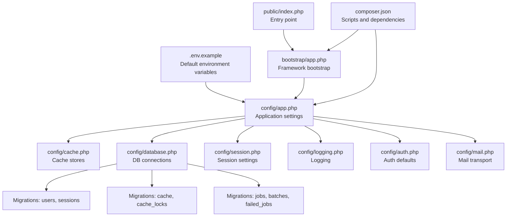
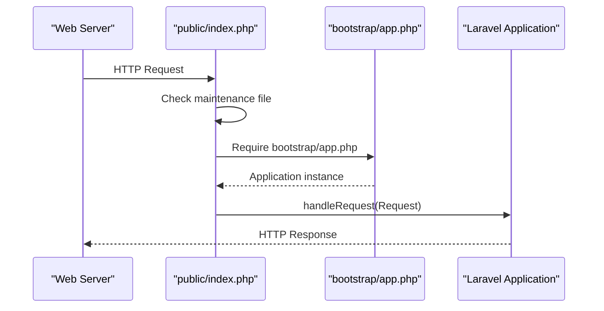
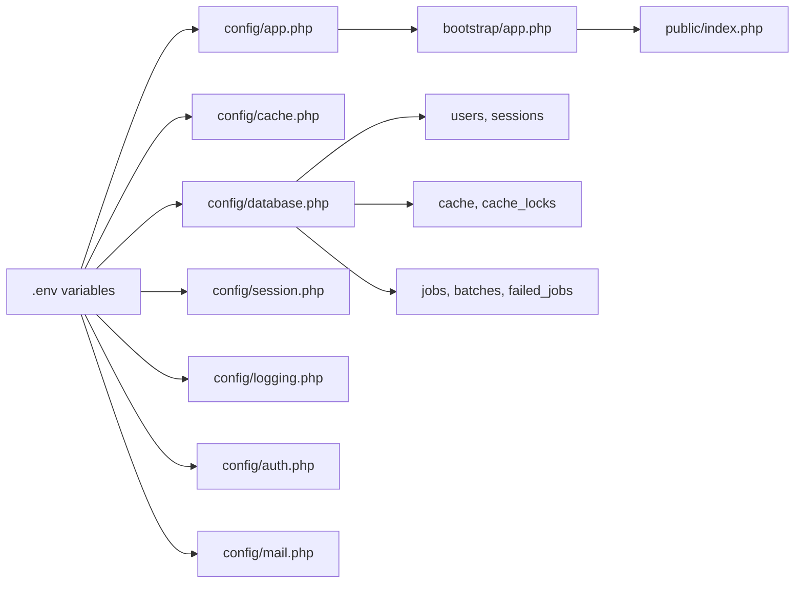

# Production Environment Setup

<cite>
**Referenced Files in This Document**
- [.env.example](file://.env.example)
- [composer.json](file://composer.json)
- [bootstrap/app.php](file://bootstrap/app.php)
- [public/index.php](file://public/index.php)
- [config/app.php](file://config/app.php)
- [config/cache.php](file://config/cache.php)
- [config/database.php](file://config/database.php)
- [config/session.php](file://config/session.php)
- [config/logging.php](file://config/logging.php)
- [config/auth.php](file://config/auth.php)
- [config/mail.php](file://config/mail.php)
- [database/migrations/0001_01_01_000000_create_users_table.php](file://database/migrations/0001_01_01_000000_create_users_table.php)
- [database/migrations/0001_01_01_000001_create_cache_table.php](file://database/migrations/0001_01_01_000001_create_cache_table.php)
- [database/migrations/0001_01_01_000002_create_jobs_table.php](file://database/migrations/0001_01_01_000002_create_jobs_table.php)
- [.agents/skills/laravel-best-practices/rules/config.md](file://.agents/skills/laravel-best-practices/rules/config.md)
- [.claude/skills/laravel-best-practices/rules/security.md](file://.claude/skills/laravel-best-practices/rules/security.md)
</cite>

## Table of Contents
1. [Introduction](#introduction)
2. [Project Structure](#project-structure)
3. [Core Components](#core-components)
4. [Architecture Overview](#architecture-overview)
5. [Detailed Component Analysis](#detailed-component-analysis)
6. [Dependency Analysis](#dependency-analysis)
7. [Performance Considerations](#performance-considerations)
8. [Troubleshooting Guide](#troubleshooting-guide)
9. [Conclusion](#conclusion)
10. [Appendices](#appendices)

## Introduction
This document provides a comprehensive guide to configuring Laravel Assistant for production deployment. It focuses on environment variable management, application configuration for production, and security hardening. Topics include APP_ENV and APP_DEBUG, encryption key setup, timezone configuration, database connection optimization, cache configuration for production, session management strategies, and practical examples for a production .env file. It also covers common pitfalls, their solutions, and the relationship between development and production configurations.

## Project Structure
Laravel Assistant follows a standard Laravel structure. For production setup, the most relevant areas are:
- Environment and bootstrapping: .env.example, bootstrap/app.php, public/index.php
- Application configuration: config/*.php
- Database schema: database/migrations/*
- Scripts and automation: composer.json

**Diagram sources**
- [.env.example](file://.env.example)
- [bootstrap/app.php](file://bootstrap/app.php)
- [public/index.php](file://public/index.php)
- [composer.json](file://composer.json)
- [config/app.php](file://config/app.php)
- [config/cache.php](file://config/cache.php)
- [config/database.php](file://config/database.php)
- [config/session.php](file://config/session.php)
- [config/logging.php](file://config/logging.php)
- [config/auth.php](file://config/auth.php)
- [config/mail.php](file://config/mail.php)
- [database/migrations/0001_01_01_000000_create_users_table.php](file://database/migrations/0001_01_01_000000_create_users_table.php)
- [database/migrations/0001_01_01_000001_create_cache_table.php](file://database/migrations/0001_01_01_000001_create_cache_table.php)
- [database/migrations/0001_01_01_000002_create_jobs_table.php](file://database/migrations/0001_01_01_000002_create_jobs_table.php)

**Section sources**
- [.env.example](file://.env.example)
- [bootstrap/app.php](file://bootstrap/app.php)
- [public/index.php](file://public/index.php)
- [composer.json](file://composer.json)

## Core Components
This section outlines the production-relevant configuration components and how they are wired together.

- Application environment and debug mode
  - APP_ENV and APP_DEBUG are read from the environment and applied during bootstrap.
  - The default environment in configuration is production-like, while .env.example sets local by default.

- Encryption key
  - APP_KEY is required for encryption and signed URLs. It must be set before deployment.

- Timezone
  - Application timezone is configured in config/app.php and should be set to a production-appropriate value.

- Logging
  - LOG_CHANNEL and related settings control where logs go in production.

- Database
  - Default connection and per-store settings are configured via environment variables.

- Cache
  - Default store and key prefixing are configurable for production.

- Sessions
  - Driver, lifetime, cookie attributes, and encryption are configurable for production.

- Mail
  - Default mailer and transport settings are environment-driven.

- Auth
  - Defaults for guards, providers, and password reset behavior are environment-aware.

- Queue and Jobs
  - Job tables are included in migrations for production queue support.

**Section sources**
- [config/app.php](file://config/app.php)
- [config/cache.php](file://config/cache.php)
- [config/database.php](file://config/database.php)
- [config/session.php](file://config/session.php)
- [config/logging.php](file://config/logging.php)
- [config/auth.php](file://config/auth.php)
- [config/mail.php](file://config/mail.php)
- [database/migrations/0001_01_01_000000_create_users_table.php](file://database/migrations/0001_01_01_000000_create_users_table.php)
- [database/migrations/0001_01_01_000001_create_cache_table.php](file://database/migrations/0001_01_01_000001_create_cache_table.php)
- [database/migrations/0001_01_01_000002_create_jobs_table.php](file://database/migrations/0001_01_01_000002_create_jobs_table.php)

## Architecture Overview
The production runtime flow starts at the web server, which forwards requests to public/index.php. That file boots the Laravel application via bootstrap/app.php and delegates request handling to the framework. Configuration values are loaded from environment variables and config files.

**Diagram sources**
- [public/index.php](file://public/index.php)
- [bootstrap/app.php](file://bootstrap/app.php)

## Detailed Component Analysis

### Environment Variables and .env Management
- Use environment variables for all production-sensitive values.
- Prefer encrypted environment files or platform-native secret stores for production.
- Avoid committing .env files to version control.

Practical guidance:
- Generate and set APP_KEY before deployment.
- Set APP_ENV to production and APP_DEBUG to false.
- Configure APP_URL to the production hostname.
- Set LOG_LEVEL to a production-appropriate level.

**Section sources**
- [.agents/skills/laravel-best-practices/rules/config.md](file://.agents/skills/laravel-best-practices/rules/config.md)
- [.claude/skills/laravel-best-practices/rules/security.md](file://.claude/skills/laravel-best-practices/rules/security.md)
- [.env.example](file://.env.example)

### Application Configuration for Production
Key production settings:
- APP_ENV: Controls environment-dependent behavior.
- APP_DEBUG: Should be false in production to avoid leaking sensitive information.
- APP_KEY: Required for encryption and signed URLs.
- APP_URL: Must reflect the production domain.
- Timezone: Set to a production-appropriate timezone in config/app.php.

Recommendations:
- Use config caching in production after deployment.
- Ensure all environment-dependent values are sourced from environment variables.

**Section sources**
- [config/app.php](file://config/app.php)
- [.env.example](file://.env.example)

### Database Connection Optimization
Production considerations:
- Choose a persistent, production-grade database (e.g., MySQL/MariaDB/PostgreSQL).
- Use environment variables for host, port, database name, username, and password.
- Enable SSL/TLS where applicable and configure appropriate charset/collation.
- For Redis, set client, cluster, prefix, and retry/backoff policies.
- For SQLite, prefer a managed database in production.

Schema readiness:
- Users, sessions, password reset tokens, cache, cache_locks, jobs, job_batches, failed_jobs are provisioned by migrations.

**Section sources**
- [config/database.php](file://config/database.php)
- [database/migrations/0001_01_01_000000_create_users_table.php](file://database/migrations/0001_01_01_000000_create_users_table.php)
- [database/migrations/0001_01_01_000001_create_cache_table.php](file://database/migrations/0001_01_01_000001_create_cache_table.php)
- [database/migrations/0001_01_01_000002_create_jobs_table.php](file://database/migrations/0001_01_01_000002_create_jobs_table.php)

### Cache Configuration for Production
Production best practices:
- Use a distributed cache backend (Redis recommended) for scalability.
- Set a unique cache prefix to avoid key collisions across applications.
- Consider failover stores for resilience.
- For database-backed cache, ensure the cache and cache_locks tables exist.

**Section sources**
- [config/cache.php](file://config/cache.php)
- [database/migrations/0001_01_01_000001_create_cache_table.php](file://database/migrations/0001_01_01_000001_create_cache_table.php)

### Session Management Strategies
Production strategies:
- Use database or Redis-backed sessions for multi-node deployments.
- Set secure, httpOnly, and sameSite cookie attributes.
- Configure session lifetime and optional encryption.
- Ensure the sessions table exists and is indexed appropriately.

**Section sources**
- [config/session.php](file://config/session.php)
- [database/migrations/0001_01_01_000000_create_users_table.php](file://database/migrations/0001_01_01_000000_create_users_table.php)

### Logging and Monitoring
- Set LOG_CHANNEL to a production-friendly channel (e.g., daily, stderr).
- Configure LOG_LEVEL to reduce verbosity in production.
- Optionally integrate with external logging systems via configured channels.

**Section sources**
- [config/logging.php](file://config/logging.php)

### Mail Configuration
- Select a production-capable mailer (e.g., SMTP, SES).
- Configure credentials and timeouts.
- Set global from address and name via environment variables.

**Section sources**
- [config/mail.php](file://config/mail.php)

### Security Hardening
- Disable APP_DEBUG in production.
- Use encrypted environment files or platform secret stores.
- Apply rate limiting to authentication and API routes.
- Validate uploads and sanitize filenames.
- Keep dependencies audited and up-to-date.

**Section sources**
- [.claude/skills/laravel-best-practices/rules/security.md](file://.claude/skills/laravel-best-practices/rules/security.md)
- [composer.json](file://composer.json)

### Practical .env.production Setup
Below are the essential entries for a production .env file. Replace placeholders with your environment values.

- Basic application
  - APP_ENV=production
  - APP_DEBUG=false
  - APP_KEY=<generate-a-32-character-key-here>
  - APP_URL=https://your-domain.com

- Logging
  - LOG_CHANNEL=daily
  - LOG_LEVEL=notice

- Database
  - DB_CONNECTION=mysql
  - DB_HOST=your-db-host
  - DB_PORT=3306
  - DB_DATABASE=your_db_name
  - DB_USERNAME=your_db_user
  - DB_PASSWORD=your_db_password

- Cache
  - CACHE_STORE=redis
  - REDIS_CACHE_DB=1

- Sessions
  - SESSION_DRIVER=database
  - SESSION_LIFETIME=120
  - SESSION_SECURE_COOKIE=true
  - SESSION_SAME_SITE=strict

- Mail
  - MAIL_MAILER=smtp
  - MAIL_HOST=smtp.your-server.com
  - MAIL_PORT=587
  - MAIL_USERNAME=postmaster@your-domain.com
  - MAIL_PASSWORD=your-smtp-password
  - MAIL_FROM_ADDRESS=noreply@your-domain.com
  - MAIL_FROM_NAME="Your App Name"

- Redis
  - REDIS_CLIENT=phpredis
  - REDIS_HOST=127.0.0.1
  - REDIS_PASSWORD=null
  - REDIS_PORT=6379

- Maintenance
  - APP_MAINTENANCE_DRIVER=file

Notes:
- Generate APP_KEY using the framework’s key generation command.
- Use encrypted environment files or platform secret stores for production.
- Ensure database and Redis instances are reachable from the application host.

**Section sources**
- [.env.example](file://.env.example)
- [config/app.php](file://config/app.php)
- [config/cache.php](file://config/cache.php)
- [config/database.php](file://config/database.php)
- [config/session.php](file://config/session.php)
- [config/mail.php](file://config/mail.php)

### Relationship Between Development and Production Configurations
- Development typically uses local databases (e.g., SQLite), verbose logging, and APP_DEBUG enabled.
- Production uses remote databases, strict logging, APP_DEBUG disabled, and secure cookie settings.
- Environment-specific overrides should be managed via separate .env files and/or platform environments.

**Section sources**
- [.env.example](file://.env.example)
- [config/app.php](file://config/app.php)
- [config/logging.php](file://config/logging.php)

## Dependency Analysis
This section maps configuration dependencies and highlights potential coupling points.

**Diagram sources**
- [.env.example](file://.env.example)
- [config/app.php](file://config/app.php)
- [config/cache.php](file://config/cache.php)
- [config/database.php](file://config/database.php)
- [config/session.php](file://config/session.php)
- [config/logging.php](file://config/logging.php)
- [config/auth.php](file://config/auth.php)
- [config/mail.php](file://config/mail.php)
- [bootstrap/app.php](file://bootstrap/app.php)
- [public/index.php](file://public/index.php)
- [database/migrations/0001_01_01_000000_create_users_table.php](file://database/migrations/0001_01_01_000000_create_users_table.php)
- [database/migrations/0001_01_01_000001_create_cache_table.php](file://database/migrations/0001_01_01_000001_create_cache_table.php)
- [database/migrations/0001_01_01_000002_create_jobs_table.php](file://database/migrations/0001_01_01_000002_create_jobs_table.php)

**Section sources**
- [.env.example](file://.env.example)
- [config/app.php](file://config/app.php)
- [config/cache.php](file://config/cache.php)
- [config/database.php](file://config/database.php)
- [config/session.php](file://config/session.php)
- [config/logging.php](file://config/logging.php)
- [config/auth.php](file://config/auth.php)
- [config/mail.php](file://config/mail.php)
- [bootstrap/app.php](file://bootstrap/app.php)
- [public/index.php](file://public/index.php)
- [database/migrations/0001_01_01_000000_create_users_table.php](file://database/migrations/0001_01_01_000000_create_users_table.php)
- [database/migrations/0001_01_01_000001_create_cache_table.php](file://database/migrations/0001_01_01_000001_create_cache_table.php)
- [database/migrations/0001_01_01_000002_create_jobs_table.php](file://database/migrations/0001_01_01_000002_create_jobs_table.php)

## Performance Considerations
- Use Redis or Memcached for cache and sessions in multi-node deployments.
- Enable config caching and route caching after deployment.
- Tune database connection pooling and query logging.
- Set appropriate cache TTLs and key prefixes.
- Monitor log volume and retention to avoid disk pressure.

[No sources needed since this section provides general guidance]

## Troubleshooting Guide
Common production issues and resolutions:
- Application crashes on startup
  - Cause: Missing or invalid APP_KEY.
  - Resolution: Generate and set APP_KEY; clear config cache after setting.

- Database connectivity errors
  - Cause: Incorrect DB_* variables or unreachable host.
  - Resolution: Verify DB_CONNECTION and credentials; confirm network/firewall rules.

- Session not persisting across requests
  - Cause: SESSION_DRIVER misconfiguration or missing sessions table.
  - Resolution: Use database or Redis driver and ensure sessions table exists.

- Excessive log growth
  - Cause: LOG_LEVEL too verbose.
  - Resolution: Set LOG_LEVEL to a production-appropriate level and enable daily rotation.

- CSRF or session cookie issues
  - Cause: Missing secure flags or wrong sameSite policy.
  - Resolution: Set SESSION_SECURE_COOKIE and SESSION_SAME_SITE appropriately.

- Maintenance mode activation
  - Cause: Maintenance file detected by entry point.
  - Resolution: Remove maintenance file and redeploy.

**Section sources**
- [public/index.php](file://public/index.php)
- [config/app.php](file://config/app.php)
- [config/session.php](file://config/session.php)
- [config/logging.php](file://config/logging.php)
- [config/database.php](file://config/database.php)

## Conclusion
Deploying Laravel Assistant to production requires disciplined environment management, hardened configuration, and validated infrastructure. By setting APP_ENV and APP_DEBUG correctly, generating and securing APP_KEY, optimizing database and cache backends, and tuning sessions and logging, you can achieve a robust, secure, and performant production environment. Adopt encrypted environment files or platform secret stores, apply rate limiting, and keep dependencies audited to maintain long-term security and reliability.

[No sources needed since this section summarizes without analyzing specific files]

## Appendices

### Appendix A: Environment Variable Reference
- APP_ENV: Application environment (e.g., production).
- APP_DEBUG: Boolean enabling debug mode.
- APP_KEY: 32-character encryption key.
- APP_URL: Base URL for the application.
- LOG_CHANNEL, LOG_LEVEL: Logging configuration.
- DB_CONNECTION, DB_HOST, DB_PORT, DB_DATABASE, DB_USERNAME, DB_PASSWORD: Database connection.
- CACHE_STORE: Default cache store.
- SESSION_DRIVER, SESSION_LIFETIME, SESSION_SECURE_COOKIE, SESSION_SAME_SITE: Session configuration.
- MAIL_MAILER, MAIL_HOST, MAIL_PORT, MAIL_USERNAME, MAIL_PASSWORD: Mail transport.
- REDIS_*: Redis client and connection settings.

**Section sources**
- [.env.example](file://.env.example)
- [config/app.php](file://config/app.php)
- [config/cache.php](file://config/cache.php)
- [config/database.php](file://config/database.php)
- [config/session.php](file://config/session.php)
- [config/mail.php](file://config/mail.php)