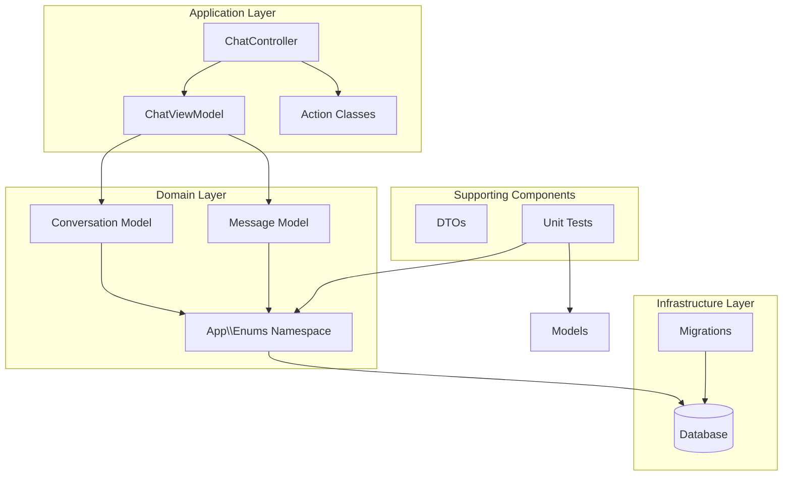
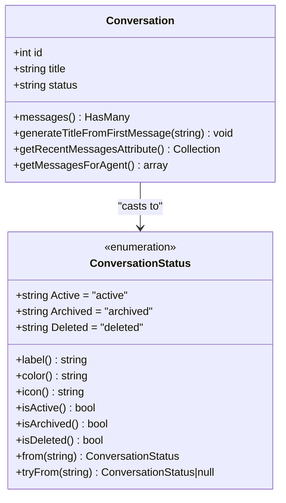
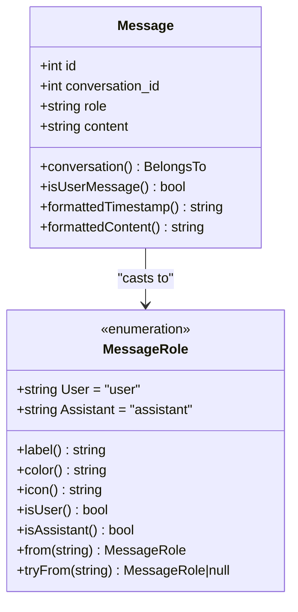
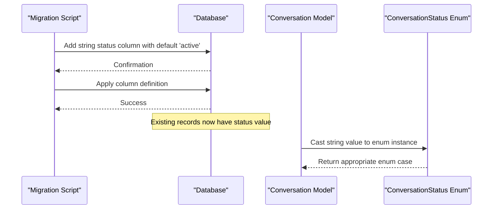
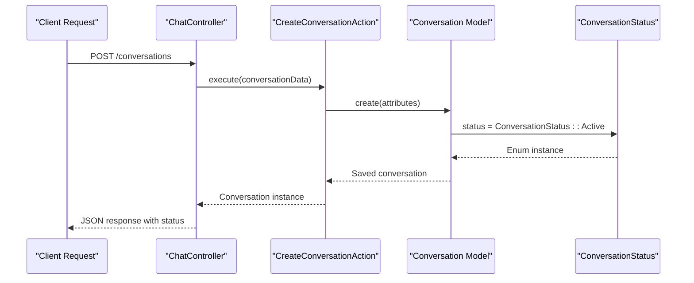
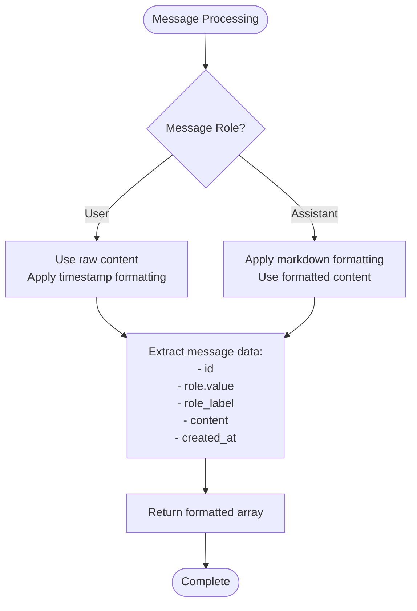
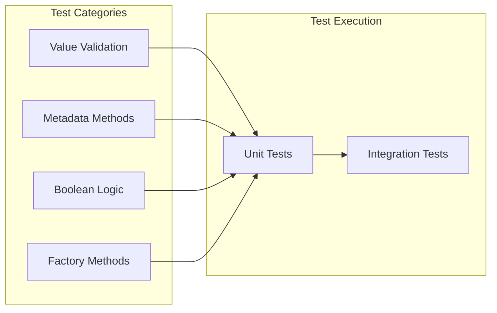

# Enum System Specification

<cite>
**Referenced Files in This Document**
- [ConversationStatus.php](file://app/Enums/ConversationStatus.php)
- [MessageRole.php](file://app/Enums/MessageRole.php)
- [Conversation.php](file://app/Models/Conversation.php)
- [Message.php](file://app/Models/Message.php)
- [ConversationStatusTest.php](file://tests/Unit/ConversationStatusTest.php)
- [MessageRoleTest.php](file://tests/Unit/MessageRoleTest.php)
- [2026_04_04_195518_add_status_to_conversations_table.php](file://database/migrations/2026_04_04_195518_add_status_to_conversations_table.php)
- [2026_04_02_123238_create_messages_table.php](file://database/migrations/2026_04_02_123238_create_messages_table.php)
- [ChatController.php](file://app/Http/Controllers/ChatController.php)
- [ChatViewModel.php](file://app/ViewModels/ChatViewModel.php)
- [MessageData.php](file://app/DTOs/MessageData.php)
</cite>

## Update Summary
**Changes Made**
- Updated enum implementation details to reflect native PHP 8.3 enum syntax with string backing
- Enhanced documentation of enum casting mechanisms in Eloquent models
- Added comprehensive coverage of metadata methods and boolean helper functions
- Updated testing strategies to reflect current unit test implementations
- Expanded database integration documentation with migration examples

## Table of Contents
1. [Introduction](#introduction)
2. [System Architecture](#system-architecture)
3. [Core Enum Components](#core-enum-components)
4. [Implementation Details](#implementation-details)
5. [Database Integration](#database-integration)
6. [Usage Patterns](#usage-patterns)
7. [Testing Strategy](#testing-strategy)
8. [Best Practices](#best-practices)
9. [Future Extensions](#future-extensions)
10. [Conclusion](#conclusion)

## Introduction

The Enum System Specification defines a comprehensive approach to implementing type-safe enumerations in the Laravel Assistant application. This system replaces magic strings with strongly-typed PHP enums, providing compile-time safety, improved code maintainability, and enhanced developer experience. The implementation follows Laravel's best practices and modern PHP standards, utilizing native PHP 8.3 enum features with string backing values.

The enum system serves two primary domains within the application: conversation status management and message role classification. By centralizing categorical data into well-defined enum structures, the system ensures data integrity while providing rich metadata for UI presentation and business logic operations.

**Updated** The implementation now uses native PHP 8.3 enum syntax with string backing, providing seamless integration with Laravel's Eloquent ORM casting system.

## System Architecture

The enum system architecture follows a layered approach that integrates seamlessly with Laravel's existing MVC pattern while introducing new architectural components for better separation of concerns.



**Diagram sources**
- [ChatController.php:19-104](file://app/Http/Controllers/ChatController.php#L19-L104)
- [ChatViewModel.php:29-120](file://app/ViewModels/ChatViewModel.php#L29-L120)
- [Conversation.php:9-65](file://app/Models/Conversation.php#L9-L65)
- [Message.php:10-50](file://app/Models/Message.php#L10-L50)

The architecture demonstrates clear separation of concerns with enums serving as the foundation for type-safe data representation across all application layers.

## Core Enum Components

### ConversationStatus Enum

The ConversationStatus enum manages the lifecycle states of chat conversations, providing a comprehensive set of status values with associated metadata methods for UI presentation and business logic operations.



**Diagram sources**
- [ConversationStatus.php:23-89](file://app/Enums/ConversationStatus.php#L23-L89)
- [Conversation.php:17-25](file://app/Models/Conversation.php#L17-L25)

### MessageRole Enum

The MessageRole enum defines the roles participants can assume in chat interactions, supporting both user and assistant perspectives with comprehensive metadata for presentation and logic operations.



**Diagram sources**
- [MessageRole.php:23-77](file://app/Enums/MessageRole.php#L23-L77)
- [Message.php:23-25](file://app/Models/Message.php#L23-L25)

**Section sources**
- [ConversationStatus.php:1-89](file://app/Enums/ConversationStatus.php#L1-L89)
- [MessageRole.php:1-77](file://app/Enums/MessageRole.php#L1-L77)

## Implementation Details

### Enum Definition Patterns

Both enums follow consistent implementation patterns that ensure type safety and provide rich metadata for various application contexts.

#### Native PHP 8.3 Enum Syntax

The enums utilize the modern PHP 8.3 enum syntax with string backing values to maintain compatibility with database storage while providing compile-time type safety in PHP code. This approach leverages PHP 8.3's native enum support with explicit string backing declarations.

#### Metadata Methods

Each enum provides three primary metadata methods:
- `label()`: Human-readable presentation text
- `color()`: Tailwind CSS color class for UI styling
- `icon()`: Icon identifier for visual representation

#### Boolean Helper Methods

Dedicated boolean methods enable clean conditional logic without string comparisons:
- `isActive()`, `isArchived()`, `isDeleted()` for status enums
- `isUser()`, `isAssistant()` for role enums

#### Factory Methods

Static factory methods `from()` and `tryFrom()` provide safe instantiation from database values or external input, returning appropriate enum cases or null for invalid values.

**Section sources**
- [ConversationStatus.php:29-87](file://app/Enums/ConversationStatus.php#L29-L87)
- [MessageRole.php:28-75](file://app/Enums/MessageRole.php#L28-L75)

### Model Integration

The enum system integrates seamlessly with Laravel's Eloquent ORM through native enum casting capabilities.

#### Model Casting Configuration

```php
protected $casts = [
    'status' => ConversationStatus::class,
    'role' => MessageRole::class,
];
```

This casting configuration automatically converts between database string values and enum instances, ensuring type safety throughout the application lifecycle.

#### Relationship Integration

Enums work harmoniously with Eloquent relationships, allowing developers to access enum properties directly from related model instances without additional conversion logic.

**Section sources**
- [Conversation.php:23-25](file://app/Models/Conversation.php#L23-L25)
- [Message.php:23-25](file://app/Models/Message.php#L23-L25)

## Database Integration

### Migration Strategy

The database integration follows a systematic approach to introduce enum-backed columns while maintaining backward compatibility and data integrity.

#### Status Column Addition

The `add_status_to_conversations_table` migration introduces a string column with a default value, ensuring existing conversations receive a valid status value.



**Diagram sources**
- [2026_04_04_195518_add_status_to_conversations_table.php:14-16](file://database/migrations/2026_04_04_195518_add_status_to_conversations_table.php#L14-L16)

#### Role Column Evolution

The message table initially used ENUM type for roles but was later adapted to string backing for better enum integration. This evolution demonstrates the system's flexibility in adapting to changing requirements.

**Section sources**
- [2026_04_04_195518_add_status_to_conversations_table.php:1-29](file://database/migrations/2026_04_04_195518_add_status_to_conversations_table.php#L1-L29)
- [2026_04_02_123238_create_messages_table.php:17](file://database/migrations/2026_04_02_123238_create_messages_table.php#L17)

### Data Type Consistency

The enum system maintains consistency across data types by:
- Storing enum backing values as strings in the database
- Automatically converting between string values and enum instances
- Preserving existing data during migration processes

## Usage Patterns

### Controller Integration

The ChatController demonstrates comprehensive enum usage patterns across various application scenarios.

#### Conversation Management



**Diagram sources**
- [ChatController.php:67-64](file://app/Http/Controllers/ChatController.php#L67-L64)
- [Conversation.php:17](file://app/Models/Conversation.php#L17)

#### Message Processing

The controller handles message creation and retrieval while leveraging enum properties for role-based logic and content formatting.

**Section sources**
- [ChatController.php:28-39](file://app/Http/Controllers/ChatController.php#L28-L39)
- [ChatController.php:86-102](file://app/Http/Controllers/ChatController.php#L86-L102)

### ViewModel Integration

The ChatViewModel showcases advanced enum usage patterns for UI presentation and data transformation.

#### Message Formatting Pipeline



**Diagram sources**
- [ChatViewModel.php:65-78](file://app/ViewModels/ChatViewModel.php#L65-L78)

#### Sidebar Data Transformation

The ViewModel transforms conversation data for sidebar display, extracting relevant metadata while maintaining type safety through enum properties.

**Section sources**
- [ChatViewModel.php:91-102](file://app/ViewModels/ChatViewModel.php#L91-L102)

### DTO Integration

The MessageData DTO demonstrates immutable data transfer patterns that complement the enum system by providing type-safe data containers.

#### Request Data Processing

The DTO extracts validated request data and prepares it for action classes, ensuring type safety from input to business logic execution.

**Section sources**
- [MessageData.php:39-45](file://app/DTOs/MessageData.php#L39-L45)

## Testing Strategy

### Unit Test Coverage

The enum system includes comprehensive unit tests that validate both functional and behavioral aspects of the implementation.

#### Value Validation Tests

Tests ensure enum backing values match expected string representations, providing confidence in database compatibility and external API integration.

#### Metadata Method Tests

Comprehensive tests validate the label, color, and icon methods for proper UI presentation across all enum cases.

#### Boolean Logic Tests

Boolean helper methods are tested to ensure correct conditional logic without relying on string comparisons.

#### Factory Method Tests

Tests validate the `from()` and `tryFrom()` factory methods for safe enum instantiation from external values.



**Diagram sources**
- [ConversationStatusTest.php:5-57](file://tests/Unit/ConversationStatusTest.php#L5-L57)
- [MessageRoleTest.php:5-44](file://tests/Unit/MessageRoleTest.php#L5-L44)

**Section sources**
- [ConversationStatusTest.php:1-57](file://tests/Unit/ConversationStatusTest.php#L1-L57)
- [MessageRoleTest.php:1-44](file://tests/Unit/MessageRoleTest.php#L1-L44)

## Best Practices

### Enum Design Principles

The enum system adheres to several key design principles that ensure maintainability and extensibility.

#### Single Responsibility Principle

Each enum focuses on a specific domain concept, preventing feature creep and maintaining clear boundaries between different categorical data types.

#### Consistent Method Naming

Metadata methods follow a consistent naming pattern (`label()`, `color()`, `icon()`) that makes the API predictable and easy to use across different enum types.

#### Backward Compatibility

String backing values ensure compatibility with existing database schemas and external systems while providing type safety in PHP code.

### Integration Guidelines

#### Model Casting

Always configure enum casting in model `$casts` arrays to ensure automatic conversion between database values and enum instances.

#### Validation Integration

Use Laravel's `Rule::enum()` validation for incoming data to prevent invalid enum values from entering the system.

#### UI Integration

Leverage enum metadata methods for consistent UI presentation, avoiding hard-coded strings and ensuring visual consistency across the application.

**Section sources**
- [Conversation.php:23-25](file://app/Models/Conversation.php#L23-L25)
- [Message.php:23-25](file://app/Models/Message.php#L23-L25)

## Future Extensions

### Additional Enum Types

The current implementation provides a foundation for extending the enum system to cover additional categorical data types within the application.

#### User Roles

A user role enum could manage different user permissions and access levels throughout the application.

#### Message Status

Additional message states beyond user/assistant roles could include pending, processing, error, and delivered states.

#### Notification Types

Notification categories could include system notifications, user alerts, and administrative messages.

### Advanced Features

#### Enum Collections

Future enhancements could include collection methods for filtering, grouping, and transforming enum values.

#### Internationalization Support

Enum metadata methods could be extended to support internationalized labels and descriptions.

#### Custom Attributes

Enums could support custom attributes for domain-specific metadata beyond the standard label, color, and icon properties.

## Conclusion

The Enum System Specification represents a comprehensive approach to implementing type-safe enumerations in the Laravel Assistant application. By replacing magic strings with strongly-typed PHP enums, the system achieves improved code quality, enhanced maintainability, and better developer experience.

The implementation demonstrates adherence to Laravel best practices while leveraging modern PHP 8.3 features. The systematic approach to enum design, database integration, and testing ensures reliability and extensibility for future development needs.

Key benefits of the implemented system include:
- Compile-time type safety preventing runtime errors
- Automatic database conversion through native Laravel casting
- Rich metadata methods for UI presentation and business logic
- Comprehensive test coverage ensuring reliability
- Clear separation of concerns maintaining architectural integrity

The enum system serves as a foundation for continued architectural improvements and provides a template for implementing similar patterns across other categorical data types in the application.