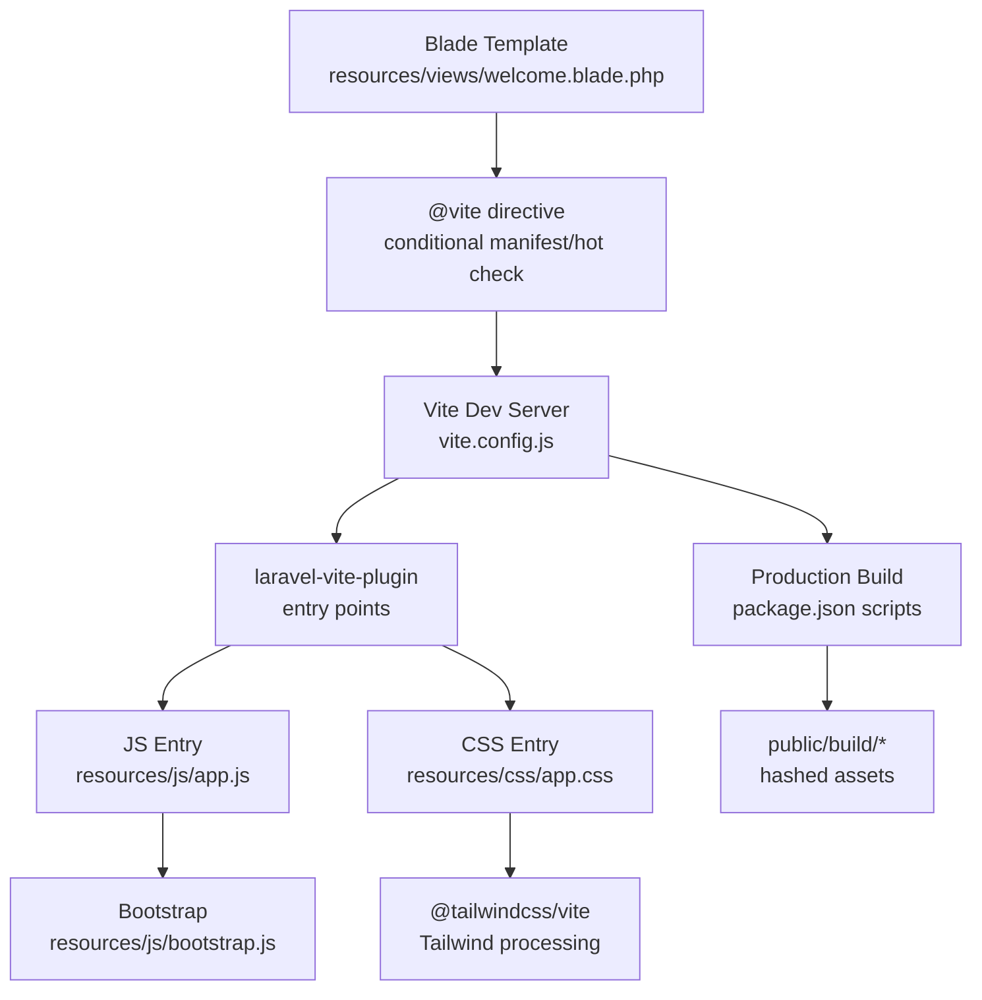
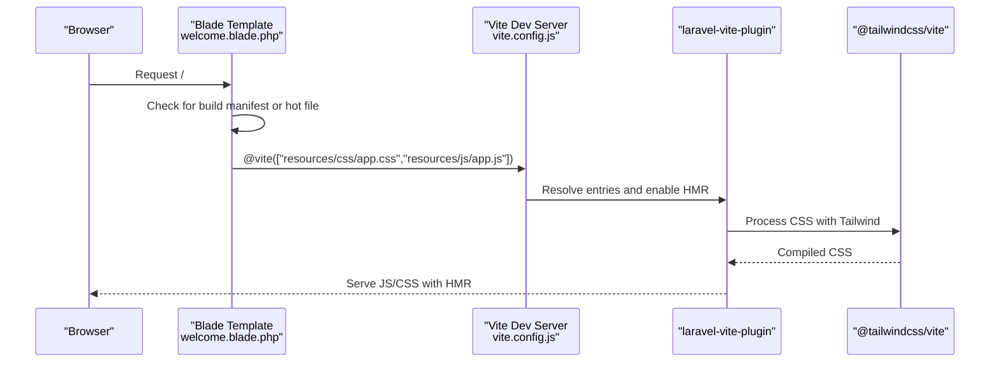
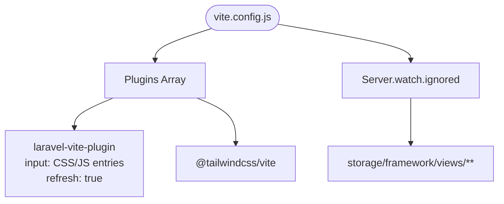
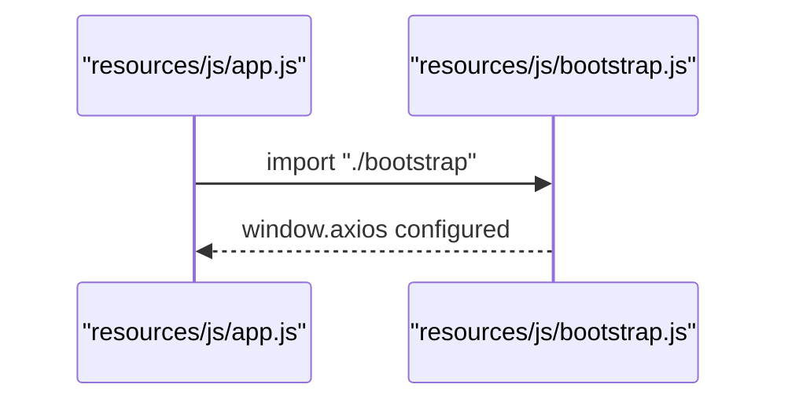
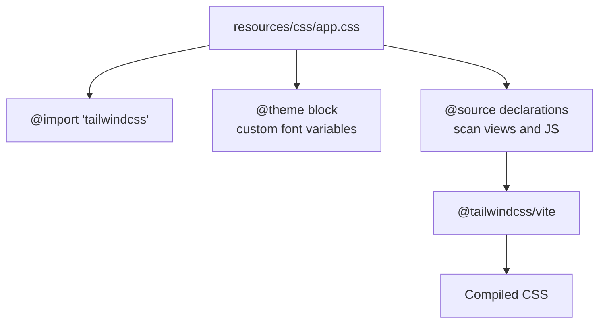
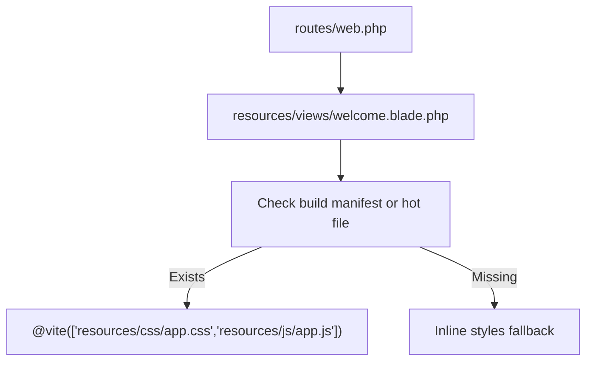
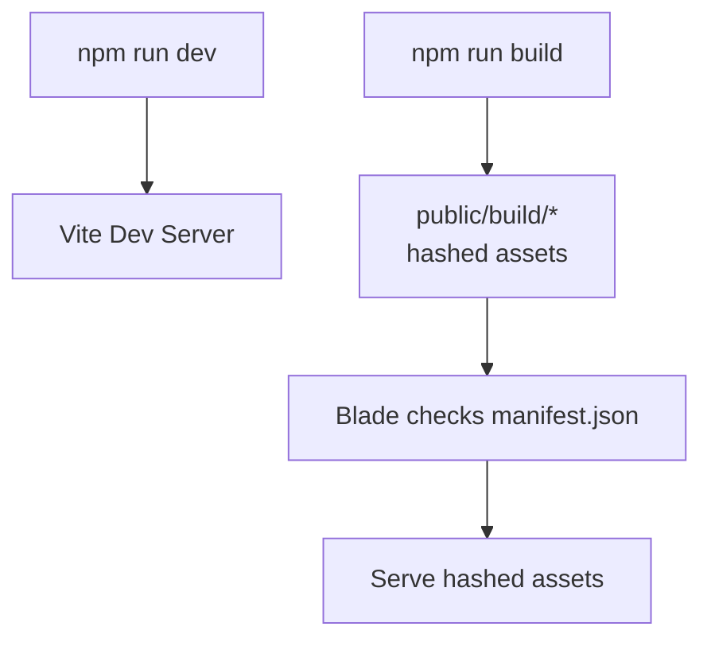
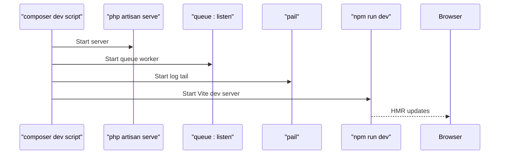
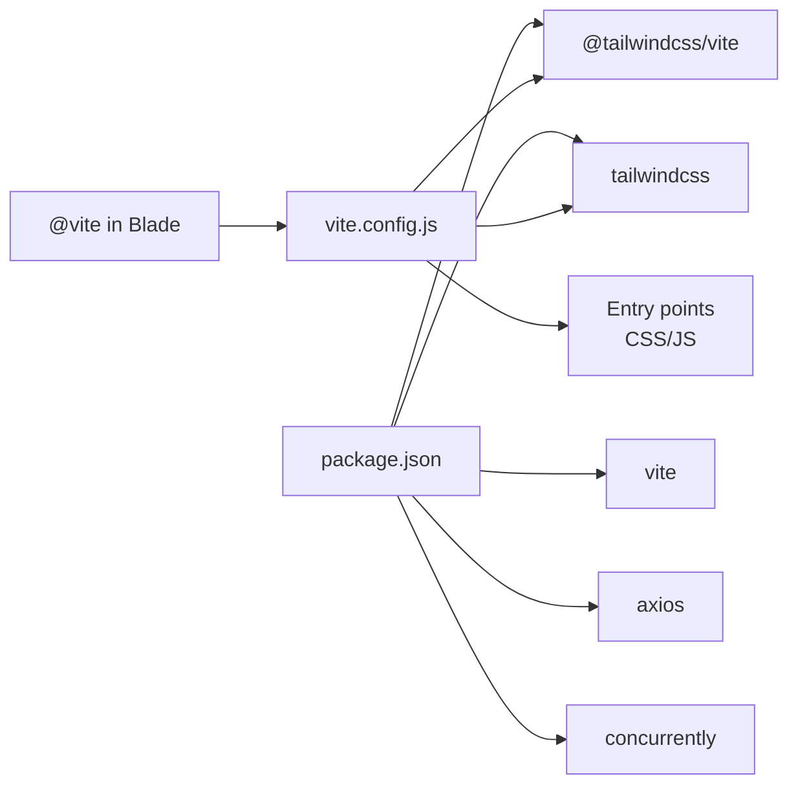

# Asset Pipeline

<cite>
**Referenced Files in This Document**
- [vite.config.js](file://vite.config.js)
- [package.json](file://package.json)
- [resources/js/app.js](file://resources/js/app.js)
- [resources/js/bootstrap.js](file://resources/js/bootstrap.js)
- [resources/css/app.css](file://resources/css/app.css)
- [resources/views/welcome.blade.php](file://resources/views/welcome.blade.php)
- [routes/web.php](file://routes/web.php)
- [composer.json](file://composer.json)
- [config/app.php](file://config/app.php)
</cite>

## Table of Contents
1. [Introduction](#introduction)
2. [Project Structure](#project-structure)
3. [Core Components](#core-components)
4. [Architecture Overview](#architecture-overview)
5. [Detailed Component Analysis](#detailed-component-analysis)
6. [Dependency Analysis](#dependency-analysis)
7. [Performance Considerations](#performance-considerations)
8. [Troubleshooting Guide](#troubleshooting-guide)
9. [Conclusion](#conclusion)

## Introduction
This document explains the Asset Pipeline for the project, focusing on the Vite build system configuration and asset management. It covers the Vite plugin setup with laravel-vite-plugin and @tailwindcss/vite, the build process and development server configuration, asset compilation workflow, and how Vite integrates with Laravel’s Blade templating for asset serving. It also provides practical guidance on JavaScript entry points, CSS preprocessing, file watching, performance optimization, fingerprinting, CDN strategies, and troubleshooting common issues.

## Project Structure
The asset pipeline centers around a small but complete frontend stack:
- Vite configuration defines plugins, server behavior, and watch patterns.
- NPM scripts orchestrate development and production builds.
- Blade templates conditionally load Vite-managed assets during development and production.
- Laravel routes and configuration support the runtime behavior of asset loading.

**Diagram sources**
- [resources/views/welcome.blade.php:14-20](file://resources/views/welcome.blade.php#L14-L20)
- [vite.config.js:5-18](file://vite.config.js#L5-L18)
- [resources/js/app.js:1-2](file://resources/js/app.js#L1-L2)
- [resources/js/bootstrap.js:1-5](file://resources/js/bootstrap.js#L1-L5)
- [resources/css/app.css:1-12](file://resources/css/app.css#L1-L12)
- [package.json:5-8](file://package.json#L5-L8)

**Section sources**
- [vite.config.js:1-19](file://vite.config.js#L1-L19)
- [package.json:1-18](file://package.json#L1-L18)
- [resources/views/welcome.blade.php:14-20](file://resources/views/welcome.blade.php#L14-L20)

## Core Components
- Vite configuration
  - Plugins: laravel-vite-plugin and @tailwindcss/vite.
  - Entry points: resources/css/app.css and resources/js/app.js.
  - Development server watch patterns: ignores storage/framework/views to reduce unnecessary reloads.
- NPM scripts
  - dev: starts Vite dev server.
  - build: runs Vite production build.
- Blade integration
  - Conditional inclusion of Vite assets based on presence of manifest.json or hot file.
- Laravel runtime
  - Routes and configuration support asset serving and environment behavior.

**Section sources**
- [vite.config.js:5-18](file://vite.config.js#L5-L18)
- [package.json:5-8](file://package.json#L5-L8)
- [resources/views/welcome.blade.php:14-20](file://resources/views/welcome.blade.php#L14-L20)
- [routes/web.php:5-7](file://routes/web.php#L5-L7)
- [config/app.php:54-56](file://config/app.php#L54-L56)

## Architecture Overview
The asset pipeline integrates Vite with Laravel as follows:
- During development, Blade injects Vite’s client and modulepreload polyfills via the @vite directive when a hot file exists.
- During production, Blade injects hashed assets from public/build when manifest.json exists.
- Tailwind processes CSS entries through @tailwindcss/vite, respecting @source directives for scanning.
- laravel-vite-plugin resolves entries and enables HMR and auto-refresh.

**Diagram sources**
- [resources/views/welcome.blade.php:14-20](file://resources/views/welcome.blade.php#L14-L20)
- [vite.config.js:5-18](file://vite.config.js#L5-L18)
- [resources/css/app.css:1-12](file://resources/css/app.css#L1-L12)
- [resources/js/app.js:1-2](file://resources/js/app.js#L1-L2)

## Detailed Component Analysis

### Vite Configuration and Plugins
- laravel-vite-plugin
  - Defines input entries for CSS and JS.
  - Enables refresh on file changes.
- @tailwindcss/vite
  - Processes Tailwind directives in CSS.
  - Respects @source globs to scan Tailwind usage across views and JS.
- Development server
  - Ignores storage/framework/views to avoid triggering reloads on view cache writes.

**Diagram sources**
- [vite.config.js:5-18](file://vite.config.js#L5-L18)
- [resources/css/app.css:3-6](file://resources/css/app.css#L3-L6)

**Section sources**
- [vite.config.js:5-18](file://vite.config.js#L5-L18)
- [resources/css/app.css:1-12](file://resources/css/app.css#L1-L12)

### JavaScript Entry Point and Bootstrap
- resources/js/app.js
  - Imports the shared bootstrap module to initialize global libraries.
- resources/js/bootstrap.js
  - Sets up axios defaults for XHR requests.

**Diagram sources**
- [resources/js/app.js:1-2](file://resources/js/app.js#L1-L2)
- [resources/js/bootstrap.js:1-5](file://resources/js/bootstrap.js#L1-L5)

**Section sources**
- [resources/js/app.js:1-2](file://resources/js/app.js#L1-L2)
- [resources/js/bootstrap.js:1-5](file://resources/js/bootstrap.js#L1-L5)

### CSS Preprocessing and Tailwind Integration
- resources/css/app.css
  - Imports Tailwind.
  - Declares @source globs for Tailwind to scan Blade views, compiled PHP views, and JS files.
  - Defines a custom theme variable for fonts.
- @tailwindcss/vite
  - Processes Tailwind directives and purges unused styles based on scanned sources.

**Diagram sources**
- [resources/css/app.css:1-12](file://resources/css/app.css#L1-L12)
- [vite.config.js:11-11](file://vite.config.js#L11-L11)

**Section sources**
- [resources/css/app.css:1-12](file://resources/css/app.css#L1-L12)
- [vite.config.js:11-11](file://vite.config.js#L11-L11)

### Blade Integration and Asset Serving
- resources/views/welcome.blade.php
  - Conditionally loads Vite assets when public/build/manifest.json or public/hot exists.
  - Otherwise, falls back to inline styles (useful for environments without built assets).
- routes/web.php
  - Provides the root route that renders the Blade template.

**Diagram sources**
- [routes/web.php:5-7](file://routes/web.php#L5-L7)
- [resources/views/welcome.blade.php:14-20](file://resources/views/welcome.blade.php#L14-L20)

**Section sources**
- [resources/views/welcome.blade.php:14-20](file://resources/views/welcome.blade.php#L14-L20)
- [routes/web.php:5-7](file://routes/web.php#L5-L7)

### Build Process and Production Workflow
- package.json scripts
  - dev: starts Vite dev server.
  - build: runs Vite production build.
- Production behavior
  - Blade checks for public/build/manifest.json and serves hashed assets accordingly.

**Diagram sources**
- [package.json:5-8](file://package.json#L5-L8)
- [resources/views/welcome.blade.php:14-20](file://resources/views/welcome.blade.php#L14-L20)

**Section sources**
- [package.json:5-8](file://package.json#L5-L8)
- [resources/views/welcome.blade.php:14-20](file://resources/views/welcome.blade.php#L14-L20)

### Development Server Configuration and Hot Module Replacement
- vite.config.js
  - Enables HMR via laravel-vite-plugin refresh option.
  - Ignores storage/framework/views to prevent unnecessary reloads.
- composer.json
  - Provides a dev script that runs Laravel, queues, logs, and Vite concurrently.

**Diagram sources**
- [vite.config.js:9-17](file://vite.config.js#L9-L17)
- [composer.json:48-51](file://composer.json#L48-L51)

**Section sources**
- [vite.config.js:9-17](file://vite.config.js#L9-L17)
- [composer.json:48-51](file://composer.json#L48-L51)

## Dependency Analysis
- NPM dependencies
  - Vite, laravel-vite-plugin, @tailwindcss/vite, tailwindcss, axios, concurrently.
- Laravel integration
  - Blade @vite directive resolves assets produced by Vite.
  - Composer scripts coordinate development tasks.

**Diagram sources**
- [package.json:9-16](file://package.json#L9-L16)
- [resources/views/welcome.blade.php:14-20](file://resources/views/welcome.blade.php#L14-L20)
- [vite.config.js:5-18](file://vite.config.js#L5-L18)

**Section sources**
- [package.json:9-16](file://package.json#L9-L16)
- [resources/views/welcome.blade.php:14-20](file://resources/views/welcome.blade.php#L14-L20)
- [vite.config.js:5-18](file://vite.config.js#L5-L18)

## Performance Considerations
- Build performance
  - Use Vite’s native parallelization and efficient bundling in production builds.
  - Keep entry points minimal to reduce bundle size.
- CSS optimization
  - Tailwind purging is driven by @source globs; ensure all relevant files are covered to remove unused styles.
- Asset serving
  - Serve hashed assets from public/build in production for long-term caching.
- Development performance
  - Ignore non-essential directories in Vite watch patterns to reduce rebuild cycles.

[No sources needed since this section provides general guidance]

## Troubleshooting Guide
- Assets not loading in development
  - Ensure public/hot exists or public/build/manifest.json exists so Blade can inject Vite assets.
  - Verify the @vite directive is present in the Blade template.
- Hot reload not working
  - Confirm laravel-vite-plugin refresh is enabled and the dev server is running.
  - Check that Vite is not ignoring necessary files (review ignored watch patterns).
- Tailwind utilities missing
  - Ensure @source globs in CSS cover all relevant Blade and JS files.
  - Re-run the build after adding new source files to be scanned.
- Production assets not updating
  - Clear old assets and re-run npm run build.
  - Confirm Blade checks for manifest.json and serves hashed assets.

**Section sources**
- [resources/views/welcome.blade.php:14-20](file://resources/views/welcome.blade.php#L14-L20)
- [vite.config.js:9-17](file://vite.config.js#L9-L17)
- [resources/css/app.css:3-6](file://resources/css/app.css#L3-L6)
- [package.json:5-8](file://package.json#L5-L8)

## Conclusion
The project’s asset pipeline leverages Vite with laravel-vite-plugin and @tailwindcss/vite to deliver a modern, efficient build and development experience. Blade seamlessly switches between development and production asset delivery, while Tailwind’s scanning ensures efficient CSS purging. By following the configuration and best practices outlined here, teams can maintain fast builds, reliable HMR, and optimized production deployments.